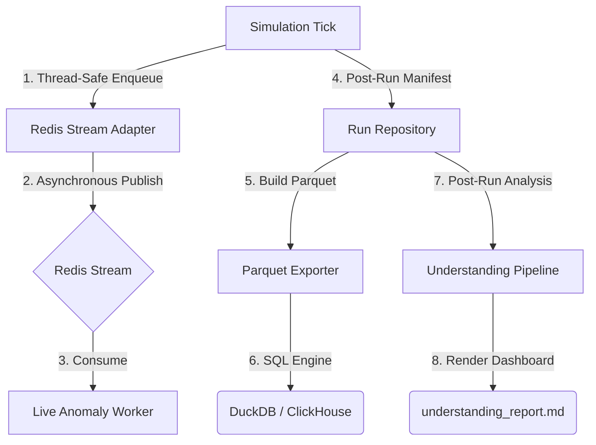

# Deterministic Concurrent RPG Engine

A high-fidelity, deterministic 2D RPG simulation engine built with Python and React. It features parallelized AI agents governed by an authoritative WorldLoop, aspect-oriented composition, and production-grade observability telemetry.

---

## Architecture & Principles

### Aspect-Oriented Composition (AOA)
The engine has successfully migrated to a **Feature-Based Aspect-Oriented Architecture** (AOA). Entities are purely represented as aspect compositions (`IdentityAspect`, `BodyAspect`, `MindAspect`, `SocialAspect`) while domain-separated modules process systems deterministically without side effects.

### Key Design Principles
*   **Absolute Determinism**: All simulation randomness is derived from xxhash-based generators seeded per run, guaranteeing 100% byte-identical replay fidelity.
*   **Intent vs. Effect**: Parallel AI workers propose tactical intents; the singular authoritative WorldLoop validates and executes them.
*   **Decoupled Read-Write**: Thread-safe isolated read models allow active API presenters to serve queries instantly without locking the core tick calculation.
*   **Shared Schema Serialization**: Singular Pydantic models define both the simulation's gameplay logic and the API presenters, guaranteeing zero-drift parity.

### Directory Structure
```text
src/
├── __main__.py              # Entry point — serve (default) or cli mode
├── cli/                     # CLI entrypoint and argument parsing
├── config/                  # Configuration loaders and validators
├── api/                     # FastAPI web server and WebSocket layer
├── core/                    # Authoritative state, aspects, and protocol contracts
├── engine/                  # The Simulation Kernel, scheduler, and replay manager
├── systems/                 # Pure domain systems (movement, combat, strategy)
├── platform/                # Monotonic clocks and xxhash RNG engines
└── logging/                 # Structured, contextual logging
frontend/                    # React 19 + Vite + TypeScript SPA UI
```

---

## Prerequisites & Quick Start

### System Requirements
*   **Backend**: Python ≥ 3.11 (utilizing `msgpack`, `xxhash`, `fastapi`, `uvicorn`, and `pydantic`).
*   **Frontend**: Node.js ≥ 18 (utilizing `npm` ≥ 9 as the package manager).
*   **Infrastructure**: Docker & Docker Compose (optional, for Grafana/Loki/Redis/RabbitMQ telemetry).

### Quick Start
All commands use `make` (runs `Makefile` on Linux/macOS, `make.bat` on Windows).

```bash
make install         # Install all dependencies (Python + Node/npm)
make serve           # Build frontend + start production server at :8000
```

Open `http://127.0.0.1:8000` in your browser.

```bash
make cli             # Run a headless simulation (200 ticks)
```

---

## Execution Modes

### Server Mode (Default)
Starts the FastAPI server serving the visual client and real-time synchronization streams.
```bash
python3 -m src serve --host 127.0.0.1 --port 8000 --seed 42 --entities 50 --workers 4
```

### CLI Mode
Runs the simulation headless and outputs a chunked replay directory.
```bash
python3 -m src cli --seed 42 --ticks 1000 --entities 50 --log-level INFO
```

---

## Web Visualization

The frontend is served as a React 19 + Vite + TypeScript SPA using an HTML5 Canvas for real-time spectating and auditing:
*   **Triple-Layer Fog of War**: Dynamic visibility (clear), explored (dimmed), and unseen (dark) fog systems.
*   **Spectate Vision Lenses**: Select any entity to restrict visibility to exactly what that character can currently see.
*   **Auditing Panels**: Inspect entity inventories, active attributes, personal memory timelines, active goals, and strategic directives.

---

## Gameplay & Simulation Core

The engine supports dynamic gameplay domains, fully externalized into data-driven registries:

*   **Town Economy & Services**: Towns generate buildings (Adventurer's Guild, Blacksmith, General Store) enabling heroes to sell loot, purchase upgrades, and craft powerful gear dynamically. Detailed in **[Town Economy Guide](docs/buildings_economy.md)**.
*   **Faction & Sovereignty**: Entities belong to one of 10 factions with dynamic relationships. Entering hostile territory inflicts severe stat debuffs, alerts guards, and triggers region-wide alarm states. Detailed in **[Faction System Guide](docs/faction_system.md)**.
*   **Entity Classes & Progression**: Features robust attribute scaling, automated masteries, custom skill breakthroughs, and level-scaled quest generation. Detailed in **[Combat Mechanics](docs/mechanics/combat.md)**.

---

## V2 Observability & Simulation Understanding

The V2 RPG Engine incorporates a comprehensive, production-grade observability and diagnostic suite:



### Key Pillars
1.  **Hard Law Monitor**: Continuously validates simulation invariants in-tick with zero performance cost.
2.  **Baselines & Scenario Sweeps**: Runs seed matrices concurrently and aggregates statistical baselines to detect behavioral drift.
3.  **Analytics Externalization**: Decouples analytical workloads via Redis Streams, ClickHouse warehousing, and transactional Parquet/DuckDB export engines.
4.  **Advanced Post-Run Understanding**: Generates confidence-ranked root-cause hypotheses, design balance diagnosis metrics, and emergent story detectors post-run.

For deep technical specs, architecture guides, and checklists, see the dedicated phase manuals:
*   **[Phase 1 & 2: Decoupled Semantic Architecture](docs/observability/phase_1.md)**
*   **[Phase 3: Single-Run Processing Pipeline](docs/observability/phase_3.md)**
*   **[Phase 4: Multi-Run Baseline and Balance Analysis](docs/observability/phase_4.md)**
*   **[Phase 5: Live Observatory and Developer Inspection](docs/observability/phase_5.md)**
*   **[Phase 6: Externalization and Scale Readiness](docs/observability/phase_6.md)**
*   **[Phase 7: Production-Grade Observatory Platform](docs/observability/phase_7.md)**
*   **[Phase 8: Advanced Simulation Understanding Framework](docs/observability/phase_8.md)**
*   **[Phase 9: Simulation Mining & AI-Assisted Investigation (Architecture)](docs/observability/phase_9.md)** | **[Usage & Run Guide](docs/observability/phase_9_usage.md)**
*   **[Ecosystem Infrastructure: Distributed UI & Visualization Stack Overview](docs/engine/infrastructure_overview.md)**
*   **[Scenario Sweeping: Multi-Run Sweep Config & Execution Guide](docs/engine/sweep_configuration.md)**
*   **[Phase 14: Human-Gated Agentic Simulation Lab Guideline](docs/observability/phase_14_agentic_lab.md)**

---

## Developer Specifications

*   **[Project Lawbook](docs/engine/project_lawbook_m10.md)** — Definitive laws of the engine kernel.
*   **[Engineering Playbook](docs/engine/engineering_playbook_m10.md)** — Architectural practices and guidelines.
*   **[Design Patterns](docs/design_patterns.md)** — Core structural patterns and schemas.
*   **[Optimization Specs](docs/performance/optimization_architecture.md)** — Performance constraints and caching layers.

---

## Infrastructure & Troubleshooting

The simulation uses **Docker Compose** to manage logging and message-broker infrastructures (Redis, RabbitMQ, Grafana, Loki).

### Logging & Dashboards
Service logs are aggregated in **Loki** and queryable in **Grafana**:
*   **Grafana Dashboard**: `http://localhost:3000` (User: `admin`, Pass: `admin`)
*   **All Service Logs**: `docker compose logs -f`

### Troubleshooting Kafka
If Kafka fails with `InconsistentClusterIdException`, wipe conflicting persistent container volumes:
```bash
docker compose down -v
docker compose up -d --build
```

---

## Testing & Resource Guards

The test suite is built on **pytest** and includes automatic runtime resource limits to protect the execution environment (e.g. VirtualBox VM) against Out-Of-Memory (OOM) crashes and infinite loop hangs.

### Resource Budgets (`--resource-budget`)

Use the `--resource-budget` CLI argument to scale or disable resource limits per test case:

```bash
# Run tests with strict small budget (1GB RAM limit, 15s timeout)
pytest tests/ --resource-budget=small

# Run tests with default medium budget (4GB RAM limit, 60s timeout)
pytest tests/ --resource-budget=medium

# Run tests with large budget (8GB RAM limit, 600s/10m timeout)
pytest tests/ --resource-budget=large

# Disable all time/memory resource limits entirely
pytest tests/ --resource-budget=off
```

For more details on runtime limits, see [tests/conftest.py](file:///home/vboxuser/Work/rpg-based-simulation/tests/conftest.py).