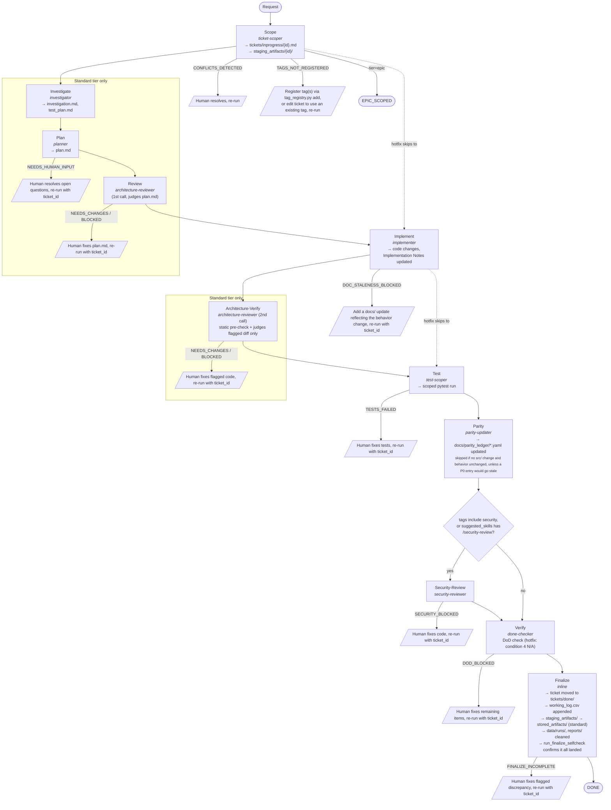

# Ticket Lifecycle

This document describes the complete flow from an implementation request to a closed ticket. It covers the `implement-ticket` workflow in detail, including gate behavior, failure recovery, and artifact layout.

For a concrete example, this document traces the task of integrating relation projection into combat target classification, tracked as `TCK-20260606-COMBAT-RELATION`.

---

## Tier Routing

The workflow short-circuits based on the ticket's `## Tier` field:

| Tier | Phases run | Use when |
|---|---|---|
| `hotfix` | Scope → Implement → Test → Parity → Verify → Finalize | Targeted fix with self-evident intent — no investigation needed |
| `standard` | Full 10-phase pipeline (default) | Any substantive feature, repair, or refactor |
| `epic` | Scope only | Large initiative; tracks child tickets, no direct implementation |

The tier can be set in the ticket file (`## Tier`) or passed as `args.tier` to override.

---

## Overview

`Investigate`/`Plan`/`Review` and `Architecture-Verify` run for `standard` tier only — `hotfix`
skips straight from `Scope` to `Implement`, and from `Implement` to `Test` (see Tier Routing
above). Every gate-branch edge below is labeled with the exact return status that triggers it.



---

## Invocation

**From a user prompt — use the skill (preferred):**
```
/implement-ticket request="relation projection into combat target classification"
/implement-ticket ticket_id=TCK-20260606-COMBAT-RELATION
/implement-ticket request="Fix off-by-one in region boundary check" tier=hotfix
```

**Important:** Do **not** type `/workflow implement-ticket` — `/workflow` is a Claude-internal tool name, not a slash command. The skill `/implement-ticket` is the correct user-facing form.

**From Claude's internal tools (when orchestrating):**
```js
Workflow({ name: 'implement-ticket', args: {
  request: 'integrate relation projection into combat target classification'
}})

// Resume after a gate failure:
Workflow({ name: 'implement-ticket', args: {
  ticket_id: 'TCK-20260606-COMBAT-RELATION'
}})
```

---

## Step-by-Step Detail

### Scope

**Agent:** `ticket-scoper`

**What happens:**
- Scans `tickets/` (including `inprogress/`, `done/`, and `backlogs/`) for duplicate or conflicting work — a hit in `backlogs/` means the work was already investigated and deliberately deprioritized, not abandoned
- Scans `docs/mechanics/`, `docs/engine/` for constraints
- Scans `stored_artifacts/` for prior investigations
- Reads relevant source files
- Produces the ticket at `tickets/inprogress/TCK-YYYYMMDD-SHORT-SCOPE.md`
- Creates `staging_artifacts/{ticket_id}/`

**Example output:**
```
tickets/inprogress/TCK-20260606-COMBAT-RELATION.md
staging_artifacts/TCK-20260606-COMBAT-RELATION/
```

**Gate:** If conflicts are detected, the workflow returns `CONFLICTS_DETECTED` with a list. The user resolves (adjust scope, close duplicate, etc.) and re-runs.

**Gate (tag registry):** After the agent call returns, the orchestrator runs
`tools/tag_registry.py::check_tags_registered` against the ticket's tags (via `bash()` — not
agent-self-reported, so it can't be skipped by a prompt-following mistake). If any tag isn't in
`registries/tag_registry.jsonl`, the workflow returns `TAGS_NOT_REGISTERED` with the list —
catching this here instead of only at Verify (`done-checker`'s `frontmatter_valid` condition), 6+
phases later. The user registers the tag (`python3 tools/tag_registry.py add <tag> --category <cat>
--note "..."`) or edits the ticket to use an existing registered tag, then re-runs.

**If resuming with `ticket_id`:** This phase reads the existing ticket and skips creation — the
tag-registry check still runs against whatever tags the file already has, since those may have
been set by a human or by `create-tickets.js` without going through this check.

---

### Investigate

**Agent:** `investigator`

**What happens:**
- Reads the ticket's "Related Code Areas" — for the example: `src/content_semantics/relation.py`, `src/content_semantics/faction.py`, and the combat target selection component
- Reads `docs/mechanics/02_combat_laws.md` for the target classification law
- Checks `docs/parity_ledger/combat_movement.yaml` for overlapping P0 entries
- Searches `stored_artifacts/` for prior related work

**Produces:**
- `staging_artifacts/{id}/investigation.md` — current combat classification behavior at `file:line`, relation projection service interface, legacy fallback path, anti-drift hazards ("do not rewrite full combat system", "do not remove legacy enum fallback")
- `staging_artifacts/{id}/test_plan.md` — regression surface (existing arena/combat tests that must pass), new tests required (5 per the repair plan), scoped pytest commands

**Structured return (added by `TCK-20260802-DOC-UPDATE-DISCIPLINE`):** the Investigate `agent()`
call now has a schema requiring `docs_to_update` (array of the exact `docs/` paths this ticket must
change if implemented as scoped — empty array only if none apply, never a lazy default) and
`findings_summary` (the prose findings/open-questions/parity-IDs content the free-text return used
to carry). `investigation.md`'s own template gained a matching `## Docs Requiring Update` section
between `Mechanics/Engine Constraints` and `Parity Ledger Overlap`. `docs_to_update` feeds the
Implement phase's doc-relevance advisory check below — it is not itself a gate.

---

### Plan

**Agent:** `planner`

**What happens:**
- Reads investigation.md + test_plan.md + ticket
- Produces ordered steps that are narrow and each independently verifiable
- Maps each step to the acceptance criteria in the ticket

**Example plan structure:**
```
Step 1 — Add compatibility wrapper around combat target classification
  Files: src/content_semantics/relation.py (or new wrapper module)
  Change: Try RelationProjectionService first; fallback to legacy enum/bucket
  Do NOT touch: combat damage resolution, turn resolution, EntityRole enum definition
  Verify: test_clean_projection_used_when_relationship_data_exists

Step 2 — Wire wrapper into combat target selection component
  Files: combat target selection component (path from investigation.md)
  Change: Replace direct legacy call with wrapper call
  Do NOT touch: combat damage, movement, arena rules
  Verify: test_combat_target_uses_relation_projection_for_clean_data

Step 3 — Add hostile label set (enemy, threat, intruder, prey)
  Files: same wrapper
  Change: Define targetable labels; non-targetable: ally, neutral, protected, ignored
  Verify: test_hero_perspective_targets_goblin_as_enemy, test_hero_perspective_does_not_target_merchant_as_enemy

Step 4 — Add fallback reporting
  Files: same wrapper
  Change: When fallback is used, emit a reportable signal (debug log or report field)
  Verify: test_fallback_usage_reported

Step 5 — Legacy regression
  Files: existing arena tests
  Change: Confirm existing tests still pass with no changes
  Verify: test_legacy_monster_fallback_still_hostile, test_old_is_hostile_semantics_still_pass
```

**Gate:** If plan.md contains an "Unresolved Questions" section, the workflow returns `NEEDS_HUMAN_INPUT`. The user reads `staging_artifacts/{id}/plan.md`, resolves the questions (editing the plan directly), and re-runs with `ticket_id`.

---

### Architecture Review

**Agent:** `architecture-reviewer`

**What it validates for the example task:**
- The wrapper must try clean projection first and fall back (not the reverse)
- Legacy fallback path must remain — no deletion of `EntityRole.MONSTER` logic
- Projection result must not be stored in `reason` strings or `metadata` — must be a typed return value
- No new hardcoded relationship labels in combat code — labels come from the projection service
- Check `docs/mechanics/02_combat_laws.md` for any law governing target classification

**Gate:** Returns `NEEDS_CHANGES` or `BLOCKED` with violation list. The user fixes `staging_artifacts/{id}/plan.md` and re-runs with `ticket_id`. The workflow resumes from the Review phase (Scope/Investigate/Plan are already cached).

---

### Implement

**Agent:** `implementer`

**Constraints enforced:**
- No raw domain model from the relation projection service exposed at the combat API boundary — shaped return value only
- No durable state stored in the wrapper — it reads entity state, does not own it
- No comments explaining the fallback logic unless the REASON is non-obvious (it is obvious here — skip)

**After writing code, the implementer updates:**
- `tickets/inprogress/{id}.md` → Implementation Notes section
- `staging_artifacts/{id}/plan.md` → Deviations section (if any step differed)

**Returns structured report:**
```json
{
  "files_changed": ["src/content_semantics/relation.py", "src/combat/..."],
  "behavior_changed": true,
  "parity_subsystems": ["combat_movement"],
  "implementation_summary": "Added RelationProjectionWrapper..."
}
```

**`behavior_changed` definition (broadened by `TCK-20260802-DOC-UPDATE-DISCIPLINE`):** the
`implementer` agent must report `true` for *any* new logic, new feature, or new setting/config
value this ticket introduces — not only modifications to behavior that already existed. A
brand-new feature has no prior behavior to diverge from, but it still requires doc updates and
parity-ledger entries the same as a modification would; this closes an ambiguity where an
implementer could otherwise reasonably report `false` on the reasoning that nothing *existing*
changed.

**Gate (doc staleness):** Immediately after the agent returns, the orchestrator runs
`tools/gate_checks/doc_staleness_check.py` (via `bash()` — deterministic, no agent call) against
`files_changed`/`behavior_changed`. If `behavior_changed` is true, at least one changed path is
under `src/`, under `config/` (added by `TCK-20260802-DOC-UPDATE-DISCIPLINE` — behavior-driving
settings like `config/simulation_quality/*.yaml` scoring weights/thresholds live outside `src/`
but change simulation behavior the same as code would), or is a `.claude/workflows/*.js` file, and
zero changed paths are under `docs/`, the workflow returns `DOC_STALENESS_BLOCKED`
(`TCK-20260720-GATE-CHECK-WIRING-DECISIONS`, wired in after shipping unwired from
`TCK-20260711-DOC-STALENESS-GATE-CHECK`) — the same "catch it here instead of 6+ phases later at
Verify" reasoning already applied to Scope's tag-registry gate above; the 2026-W28 retro found 36%
of `done-checker`'s first-attempt Verify failures traced to exactly this gap. The user adds a
`docs/` update reflecting the behavior change, then re-runs with `ticket_id`.

**Advisory doc-relevance check (added by `TCK-20260802-DOC-UPDATE-DISCIPLINE`):** the blanket gate
above only confirms *some* `docs/` path was touched, not that it's the *right* one. When the
blanket check already `PASS`es, the same script call also checks Investigate's `docs_to_update`
list against `files_changed`; if a specifically-flagged doc wasn't touched, it appends a separate
`ADVISORY` entry (never `FAIL`) that gets folded into the existing Implement-phase event summary
and logged as a non-blocking warning. This is deliberately advisory-only for now — promoting it to
a hard block is deferred until there's evidence of how often Investigate over-lists docs that turn
out not to need touching once Review/Implement refine the plan (same reasoning that kept the
blanket check itself unwired for one ticket cycle before being promoted to blocking).

---

### Architecture Verify

**Agent:** `architecture-reviewer` (second call — same agent identity as the pre-Implement Review
phase, invoked again post-Implement).

**Why a second call exists:** the original Review phase (above) runs before Implement, so it has no
code to parse — `plan.md` is prose, not Python source. Architecture-Verify closes that gap by
re-invoking `architecture-reviewer` after the real diff exists.

**Step 0 — static pre-check:** before the agent call, the orchestrator runs
`tools/gate_checks/architecture_reviewer_static.py::run_architecture_checks(implementation.files_changed)`
via `bash()` and injects its `condition`/`status`/`evidence` JSON output into the prompt. Three
checks: a durable-state-mutation AST scan (`object.__setattr__` bypass outside a field-name
allowlist, nested mutable-container mutation by field-name heuristic, direct nested attribute
assignment), a raw-domain-object API-boundary AST scan of `src/api/` route return annotations, and a
reason/metadata-smuggling regex scan (disclosed as having zero confirmed historical incidents in
this repo — rule-derived, not evidence-derived).

**What the agent does:** judges only the flagged item(s) (if any) against the real changed files —
does **not** re-review the whole plan, and does not re-litigate strategic/tactical boundary
soundness or abstraction-premature-ness (already judged `APPROVED` in the pre-Implement Review
phase). Self-reports which findings came from the static script vs. independent judgment in a
`verified_by` field.

**Gate:** Returns `NEEDS_CHANGES` or `BLOCKED` (same vocabulary as Review) with a violation list —
the workflow returns that status and does not proceed to Test. The user fixes the flagged code and
re-runs with `ticket_id`.

**Skipped for hotfix**, same as the pre-Implement Review phase and the hotfix Tier Routing pipeline.

**Self-reference note:** the ticket that introduced this phase
(TCK-20260705-GATE-DET-ARCHITECTURE-REVIEWER) does not exercise it against itself — the workflow
script executing that ticket's own run was already loaded before its own edits landed, so that
ticket's own run proceeds straight from Implement to Test, same as every prior ticket. This is
expected, not a defect.

---

### Test

**Agent:** `test-scoper`

**For the example task:**
- Maps `src/content_semantics/relation.py` → `tests/unit/content_semantics/`
- Maps combat component → `tests/unit/combat/`
- Expands to `tests/arena/` (transitive — arena tests depend on target classification)
- Checks `test_plan.md` for the 5 required new tests

**Scoped command example:**
```
pytest tests/unit/content_semantics/ tests/unit/combat/ tests/arena/ -v
```

The agent executes this via Bash and reports results.

**Gate:** Returns `TESTS_FAILED` with failing test names. The user fixes the tests and re-runs with `ticket_id`. The workflow resumes from the Test phase.

**Post-Test cleanup checkpoint:** Immediately after Test phase completes (before Parity), the
orchestrator runs `tools/gate_checks/done_checker_static.py::clean_data_runs_early(start_ts)`
directly via `bash()` — not an agent prompt step. This auto-cleans any `data/runs/*` /
`reports/release_proof/*` files this session's own Test-phase pytest run produced
(`mtime >= start_ts`), closing the gap where Verify's `data_runs_clean` check (below) used to
run before Finalize's cleanup ever had a chance to execute. On success (nothing to clean, or
cleaned successfully) the workflow proceeds silently to Parity. **Gate:** Returns
`DATA_RUNS_CLEAN_FAILED` only if deletion itself errors (e.g. permission/lock) — the user
resolves manually and re-runs with `ticket_id`.

**Reliability caveat (added by TCK-20260714-DATA-RUNS-VERIFY-REGEN):** direct evidence from
`agent-monitoring/tools.jsonl` across 5+ weeks of runs found this checkpoint's own `bash()` call
has never been observed to execute — as a bare, non-`phase()`-anchored block, the LLM orchestrator
reading `implement-ticket.js` has no reliable translation-table anchor for it (see
`stored_artifacts/TCK-20260714-DATA-RUNS-VERIFY-REGEN/investigation.md`). Its code and this
paragraph are kept as documentation of intent and as a defense-in-depth no-op if the orchestrator
ever does execute it, but it must not be relied on as the load-bearing cleanup mechanism. The
Verify section below (`done-checker`'s Step 0a) carries the evidenced-reliable sweep that actually
closes this gap, and subsumes this checkpoint's original post-Test purpose as well as covering
later-phase (Parity/Verify) regeneration.

---

### Parity

**Agent:** `parity-updater`

**Step 0:** When the full agent call is not skipped, the orchestrator runs
`tools/gate_checks/parity_updater_static.py::expected_subsystems_for_files(implementation.files_changed)`
via `bash()` before the agent call and injects the resulting `src/` file → expected ledger file(s)
todo-list into the prompt preamble (`NA` = no existing `v2_evidence` citation found). After the agent
call returns, the orchestrator runs `::cross_reference_touched` against the actual `git status` diff
of `docs/parity_ledger/` and includes any untouched-mapped-subsystem miss in the pushed event —
visibility only, no new blocking status.

**For the example task:** `behavior_changed: true`, subsystem: `combat_movement`

**Updates `docs/parity_ledger/combat_movement.yaml`:**
- Finds the entry covering target classification (or adds a new one)
- Sets `status: verified`, `v2_evidence: "src/content_semantics/relation.py::RelationProjectionWrapper"`, `test_path: "tests/unit/content_semantics/test_relation_wrapper.py::test_combat_target_uses_relation_projection_for_clean_data"`
- If the legacy fallback is an intentional divergence from the Mechanics Bible: sets `status: divergent`, adds to `docs/guidelines/intentional_divergences.md`

**Skipped when:** `files_changed` has no `src/` path and `behavior_changed` is false — the
`parity-updater` agent call is replaced with a `skipped` event. A P0 ledger safeguard checks first that
no P0 entry's `v2_evidence` depends on a changed file; if it does, the full agent call runs anyway.

---

### Security-Review

**Agent:** `security-reviewer`

**Runs only when triggered:** the ticket's frontmatter `tags` include `security` (ground truth), or its `suggested_skills` include `/security-review` (derived, secondary). For a ticket with neither, this phase does not run — zero added latency, agent calls, or events.

**What it validates:** injection, unsafe deserialization, path traversal, subprocess/command injection, secrets-in-code, and raw-domain-model API exposure (cross-referencing `architecture-reviewer`'s own API-boundary rule rather than duplicating it).

**Gate:** Returns `NEEDS_CHANGES` or `BLOCKED` with a violation list — the workflow returns `SECURITY_BLOCKED` and does not proceed to Verify/Finalize. The user fixes the flagged code and re-runs with `ticket_id`.

---

### Verify (Definition of Done)

**Agent:** `done-checker`

**Step 0a (added by TCK-20260714-DATA-RUNS-VERIFY-REGEN):** before anything else, `done-checker`
runs `tools/gate_checks/done_checker_static.py::clean_data_runs_early(start_ts)` and auto-cleans
any `data/runs/*` / `reports/release_proof/*` this session has produced up to this point —
including artifacts Parity's or `done-checker`'s own re-verification pytest runs regenerated after
the post-Test checkpoint (above) ran or was skipped. A deletion-error result here is folded
directly into condition 10 rather than raising a separate blocking status.

**Step 0b:** Before judging conditions 3, 4, 7, 10 (if not already marked `FAIL` by Step 0a), 12 by
hand, `done-checker` runs
`tools/gate_checks/done_checker_static.py::run_static_precheck(ticket_id, tier, start_ts)` and
cites its PASS/FAIL/NA + evidence output verbatim for those conditions, then self-reports a
`verified_by` field listing which condition(s) came from which script(s) vs. pure judgment.
`run_static_precheck` aggregates 6 checks as of `TCK-20260718-TIER-PRIORITY-CANONICAL-ENUM`: the 5
named above plus `ticket_field_values_valid` (canonical `## Tier`/`## Priority` body-field
values), which does not yet have a dedicated numbered condition in the 13-condition table below.

`mechanics-auditor` is a separate, ad hoc agent (not part of this Verify phase or any pipeline phase)
available for checking mechanics parity before/after a change; it now has its own self-invoked static
pre-check, `tools/gate_checks/mechanics_auditor_static.py::verify_entry_test_path`.

**13-condition table:**

| # | Condition | Expected evidence |
|---|---|---|
| 1 | Implementation matches scope | Wrapper + classification logic, no combat rewrite |
| 2 | Architecture respected | No raw domain models, no durable state in wrapper |
| 3 | Ticket in inprogress/ | ✓ (moved to done/ by finalizer after this check) — script-checked |
| 4 | Staging artifacts complete | investigation.md, plan.md, test_plan.md all exist — script-checked |
| 5 | Tests run and updated | 5 new tests + passing arena/combat regression |
| 6 | Docs updated | `combat_movement.yaml` updated, Ch02 unchanged (classification not a formula) |
| 7 | working_log.csv entry | Not yet present — will be written by finalizer — script-checked |
| 8 | No undocumented decisions | Fallback-first vs. projection-first decision documented in plan |
| 9 | Repo consistent | No leftover temp files |
| 10 | data/runs/ cleaned | — script-checked; primary cleanup now happens immediately before this check, inside done-checker's own Step 0a (as of TCK-20260714-DATA-RUNS-VERIFY-REGEN) — closes the gap where Parity/Verify's own re-verification work could regenerate artifacts after the post-Test checkpoint (Test section above, now a documented-intent no-op — see its Reliability caveat) had already run. `run_static_precheck`'s data_runs_clean check (Step 0b) remains the backstop confirmation read. |
| 11 | No material gaps | All follow-up items (e.g. fallback reporting) marked complete or explicitly flagged |
| 12 | Frontmatter valid (ticket + staging artifacts) | — script-checked |
| 13 | **Agent monitoring** _(pre-marked PASS)_ | Written by workflow `writeMonitoring` after READY_TO_CLOSE |

---

### Finalize

**Inline (no dedicated agent):**

1. Update ticket: Status → `DONE`, fill Completion Summary and Files Changed
2. Move: `tickets/inprogress/{id}.md` → `tickets/done/{id}.md`
3. Append `tickets/working_log.csv`:
   ```
   2026-06-06T00:00:00Z,TCK-20260606-COMBAT-RELATION,Relation Projection,DONE,Added relation projection wrapper into combat target classification,stored_artifacts/TCK-20260606-COMBAT-RELATION
   ```
4. Move: `staging_artifacts/{id}/` → `stored_artifacts/{id}/`
5. Clean: `data/runs/*`, `reports/release_proof/*` (backstop — primary cleanup happens post-Test as of
   TCK-20260708-DATA-RUNS-CLEANUP-TIMING; this step now typically finds nothing to remove).
6. **Self-verification** (`bash()`, orchestrator-level — not the finalize agent's own prose report):
   runs `tools/gate_checks/done_checker_static.py::run_finalize_selfcheck(ticket_id, tier)` to
   confirm steps 2-4 above actually landed, aggregating 4 checks (as of
   `TCK-20260709-REGISTRY-REGEN-ON-CLOSE`, up from 3): `stored_artifacts/` complete,
   `staging_artifacts/` gone, ticket in `tickets/done/`, exactly one `working_log.csv` row, and
   `docs/REGISTRY.yaml` regenerated with the closing ticket's entry landed in it. Any discrepancy
   (or unparseable script output) returns `FINALIZE_INCOMPLETE` with `failing_items` instead of
   falling through to `DONE`.
7. **Write agent monitoring records** (`writeMonitoring`): appends one run entry to `agent-monitoring/runs.jsonl` and one event per phase to `agent-monitoring/events.jsonl` — status is `DONE` if the self-check passed, `FINALIZE_INCOMPLETE` otherwise. This step is non-fatal — if the write fails, it logs a WARNING and the workflow still returns its computed status.
8. **Refresh the knowledge-search index** (added by `TCK-20260802-DOC-UPDATE-DISCIPLINE`, runs
   right after the self-check passes and before the `DONE` return): orchestrator-run `bash()`
   checks `git status --porcelain -- docs/`; if this run touched any `docs/` path, it runs `make
   knowledge-index-update`. Closes a gap where CLAUDE.md's After Work rule and
   `docs/guidelines/agent_working_environment.md`'s Index Lifecycle Rules both required this but
   nothing in the workflow ever ran it — `search_docs`'s index silently went stale after every
   ticket touching `docs/`. Fail-open, same as monitoring-write and tag-drift below: a stale index
   degrades future search quality but must never block ticket close. Deliberately orchestrator-run,
   not inside the Finalize agent's own prompt — see the post-Test cleanup checkpoint's Reliability
   caveat above for why a bare, non-`phase()`-anchored agent-prompt bash instruction is not trusted
   for this kind of step.

---

---

## Epic Batch Workflow

Use `/implement-epic` when you have multiple tickets to implement in sequence.

```
/implement-epic folder=tickets/todos/monitoring/
/implement-epic epic_id=TCK-20260607-MY-EPIC
/implement-epic request="add a caching layer to the world registry"
```

**How it works:**
1. **Discover** — lists all TCK-*.md tickets in the folder or reads the epic's `## Related Tickets` section; filters out any already in `tickets/done/`
2. **Implement** — calls `implement-ticket` for each ticket in order; stops at the first gate failure
3. **Report** — summarizes done/failed/remaining tickets and writes a batch monitoring record

**Gate failure recovery:**
```
# Batch stopped at TCK-20260607-C (TESTS_FAILED). Fix it, then re-run:
/implement-epic folder=tickets/todos/my-feature/
# Already-done tickets are skipped automatically — resumes at TCK-20260607-C
```

**Batch monitoring:** A single batch run record (prefixed `EPIC-` or `FOLDER-`) is written to `agent-monitoring/runs.jsonl` in addition to the per-ticket run records.

See `docs/ai/workflows.md` → `implement-epic` for the full args reference.

**Epic staleness check:** `tools/agent-monitoring/epic_staleness_check.py` (`make agent-monitoring-epic-staleness`) periodically scans all open epics — both `epic_id`-mode tickets in `tickets/inprogress/` and `folder`-mode/hybrid `SEQUENCE.md` folders in `tickets/todos/*/` — for child-ticket activity that has gone idle. It flags an epic **stale** only if at least one child ticket shows real activity evidence (a `tickets/working_log.csv` row or `agent-monitoring/runs.jsonl` record) whose timestamp is older than a 5-day default window. An epic whose children have **zero activity ever** is never flagged stale — that shape (scoped and sequenced, then deliberately queued behind other work) is normal planning behavior, not abandonment; it is instead surfaced separately, informationally, as "never started" in the report (never in the hook nudge). `TCK-20260702-OBSISO-EPIC` is the concrete example: zero child activity ever, correctly classified as never-started, not stale. The two discovery loops (`epic_id`-mode, `folder`-mode) are deduped by `epic_id` after both scans complete — first-occurrence-wins, with the `epic_id`-mode loop enumerated first so an epic present in both `tickets/inprogress/` and its `tickets/todos/` origin (e.g. during the window between Scope's copy and a later Finalize/cleanup) is reported exactly once, preferring the `tickets/inprogress/` candidate. Advisory-only, read-only, mirrors `retro_nudge_hook.py`'s `PostToolUse` hook shape — see "Agent Monitoring" below.

---

## Agent Monitoring

Every `implement-ticket` run (including hotfix) writes:
- `agent-monitoring/runs.jsonl` — one run record: `run_id`, timestamps, tier, `final_status`, phase event count
- `agent-monitoring/events.jsonl` — one event per phase: phase name, agent name, status, summary

These records are written at the end of every exit point (CONFLICTS_DETECTED, DONE, TESTS_FAILED, etc.) — not just on success. Hotfix runs push three `skipped` events for the Investigate/Plan/Review phases.

**DoD condition 13** (pre-marked PASS) — the `done-checker` agent marks this PASS with the note "will be written by workflow writeMonitoring after READY_TO_CLOSE". You do not need to verify monitoring manually.

**Retrospective tools:**
```sh
make agent-monitoring-retro        # current-week retro report
make agent-monitoring-validate     # cross-check integrity against working_log.csv
make agent-monitoring-query ARGS="--agent investigator --days 14"
make agent-monitoring-epic-staleness  # report open epics with no recent child-ticket activity
```

**Epic staleness advisory hook:** a `PostToolUse` hook entry (`epic_staleness_check.py --hook`, wired alongside `retro_nudge_hook.py` in `.claude/settings.json`) fires an `additionalContext` nudge, at most once per session, if any open epic is flagged **stale** — i.e. has real child-ticket activity followed by 5+ days of silence. The separate "never started" (zero activity ever) case never reaches this hook — it is queryable-surface only, via `make agent-monitoring-epic-staleness`, to avoid alarm-fatigue nudges on legitimately-queued backlog epics.

---

## Artifact Layout

```
Before work:
  tickets/inprogress/{ticket_id}.md

During work:
  staging_artifacts/{ticket_id}/
    investigation.md
    plan.md
    test_plan.md

After work:
  tickets/done/{ticket_id}.md
  stored_artifacts/{ticket_id}/
    investigation.md
    plan.md
    test_plan.md
  tickets/working_log.csv  ← one new row appended

Deliberately deprioritized (not done, not actively blocked-and-waiting):
  tickets/backlogs/{ticket_id}.md
```

**`tickets/backlogs/`** holds two distinct kinds of content — both intentionally out of the active
`inprogress/done/todos` pipeline:

1. **Pre-ticket epic outlines** (the folder's original use) — lightweight `epic-NN-*.md` /
   `enhance-NN-*.md` feature sketches that haven't been promoted through `ticket-scoper` into a
   full `TCK-YYYYMMDD-*.md` yet. No frontmatter or required-sections format is enforced on these.
2. **Formally-scoped tickets moved here after deliberate deprioritization** — a full `TCK-*.md`
   ticket (already through Scope, and often through Investigate/Plan) whose work is real,
   understood, and worth keeping — but is not competing for active attention right now, and isn't
   "blocked" in the sense of *actively waiting* on a specific external event a human is tracking.
   Distinguish this from `Status: BLOCKED` in `tickets/inprogress/`: BLOCKED means "paused mid-pipeline,
   resume once the blocking condition changes" (the ticket stays where active work lives); BACKLOG
   means "understood, shelved on purpose, no one is watching for a trigger to resume it." Moving a
   ticket here does not delete its `staging_artifacts/` — migrate them to `stored_artifacts/{ticket_id}/`
   as usual so the investigation record survives, and update the ticket's own `## Status` to
   `BACKLOG` (not `BLOCKED`/`OPEN`) plus its frontmatter `phase: backlog`. See
   `tickets/backlogs/TCK-20260710-EXECUTABLE-WORKFLOW-RUNTIME.md` for a worked example (moved
   2026-07-11 after two independent re-confirmations that its actual platform blocker still held —
   the ticket was accurate, but "wait indefinitely in `inprogress/`" was the wrong resting place for
   a condition nobody could schedule or predict).

There is no automated workflow step that reads from or writes to `tickets/backlogs/` — moving a
ticket there (or promoting one out, back into `tickets/todos/` or `tickets/inprogress/` when it's
picked up) is a manual, deliberate action, not something `implement-ticket`/`implement-epic` do on
their own.

---

## Failure Recovery Reference

| Return status | What failed | Fix | Re-run |
|---|---|---|---|
| `CONFLICTS_DETECTED` | Duplicate or conflicting ticket found | Review `conflicts` list, adjust scope or close duplicate | Re-run with `request` (new scope) |
| `TAGS_NOT_REGISTERED` | A ticket tag isn't in `registries/tag_registry.jsonl` | Register it (`python3 tools/tag_registry.py add <tag> --category <cat> --note "..."`) or edit the ticket's tags to use an existing registered one | Re-run with `ticket_id` |
| `NEEDS_HUMAN_INPUT` | Plan has unresolved questions | Edit `staging_artifacts/{id}/plan.md`, fill in the answers | Re-run with `ticket_id` |
| `NEEDS_CHANGES` | Architecture violations in plan | Fix `plan.md` per violation list | Re-run with `ticket_id` |
| `BLOCKED` | Fundamental architectural conflict | Revisit scope, possibly split ticket | Re-run with `ticket_id` or new `request` |
| `TESTS_FAILED` | Tests failing after implementation | Fix the code or tests | Re-run with `ticket_id` |
| `DATA_RUNS_CLEAN_FAILED` | Post-Test auto-clean of `data/runs/*`/`reports/release_proof/*` failed (deletion error, e.g. permission/lock) | Resolve the underlying error manually (check file permissions/locks), then confirm the flagged files are removable | Re-run with `ticket_id` |
| `SECURITY_BLOCKED` | Security review found a vulnerability | Fix the flagged code | Re-run with `ticket_id` |
| `DOD_BLOCKED` | DoD condition(s) not met | Fix each failing item listed | Re-run with `ticket_id` |
| `FINALIZE_INCOMPLETE` | Finalize's own migration self-check found a discrepancy after moving artifacts | Fix each item in `failing_items` (e.g. incomplete `stored_artifacts/`, `staging_artifacts/` not cleaned, duplicate working_log row) | Re-run with `ticket_id` |

---

## Manual Execution (Without the Workflow)

If you need to run individual phases manually (e.g., the implementation was done outside the workflow):

```python
# 1. Create/load ticket
Agent(subagent_type="ticket-scoper", prompt="Load existing ticket TCK-20260606-...")

# 2. Investigate
Agent(subagent_type="investigator", prompt="Investigate ticket TCK-20260606-...")

# 3. Plan
Agent(subagent_type="planner", prompt="Plan implementation for TCK-20260606-...")

# 4. Review
Agent(subagent_type="architecture-reviewer", prompt="Review plan at staging_artifacts/TCK-20260606-.../plan.md")

# 5. Implement
Agent(subagent_type="implementer", prompt="Implement plan for TCK-20260606-...")

# 6. Test
Agent(subagent_type="test-scoper", prompt="Scope and run tests for files: src/content_semantics/relation.py ...")

# 7. Parity
Agent(subagent_type="parity-updater", prompt="Update parity ledger for TCK-20260606-..., subsystem combat_movement, behavior changed")

# 8. Done check
Agent(subagent_type="done-checker", prompt="Check DoD for ticket TCK-20260606-...")
```

Each agent reads the artifacts written by the previous one from `staging_artifacts/{ticket_id}/`, so the handoff is through the filesystem — no direct parameter passing required.
