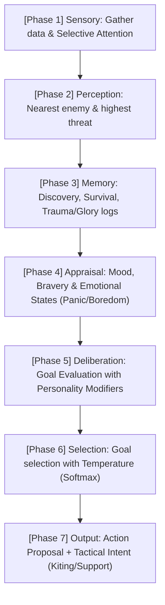

# AI System

Technical documentation for the hybrid AI architecture, goal evaluation, state machine, state handlers, perception, memory, and personality traits.

---

## Overview

Entity AI uses a **hybrid architecture** combining **Utility AI** for goal evaluation with a **State Machine** for execution. The goal evaluator picks *what* to do; the state handler executes *how* to do it.

**Primary files:** `src/ai/brain.py`, `src/ai/goals/`, `src/ai/states.py`, `src/ai/perception.py`, `src/engine/worker_pool.py`, `src/core/traits.py`

---

## 1. Hybrid Architecture (The 7-Phase Cognitive Pipeline)

The `AIBrain` has evolved from a reactive state-machine into a **proactive cognitive engine**. Instead of simple state-checks, every entity processes their surroundings through a 7-step pipeline every tick.

### Decision Flow



### 1.1 Phase Breakdown

1.  **Sensory (The Focus)**: Gathers visible entities and applies **Selective Attention** (Pillar 1: Soul). Entities only "see" a limited number of targets (default 5) based on saliency (distance, faction, rarity), simulating "tunnel vision" in dense combat.
2.  **Perception (The Data)**: Computes spatial relationships (nearest enemy/ally) and faction-aware threat.
3.  **Memory (The History)**: Records high-impact events as narrative memories (`GLORY`, `TRAUMA`, `DISCOVERY`). 
4.  **Appraisal (The Feeling)**: Derives `mood` and `bravery` from memory clusters. Identifies emotional states like `panic` (from trauma or low HP) or `stuck` (from navigation loops).
5.  **Deliberation (The Planning)**: `GoalEvaluator` scores all viable goals (EXPLORE, COMBAT, etc.). Personality traits (Openness, Agreeableness) apply dynamic weight modifiers.
6.  **Selection (The Choice)**: A winning goal is picked via weighted random. `temperature` is derived from **Openness**—higher openness leads to more creative/random choices.
7.  **Output (The Action)**: Generates an `ActionProposal` and attaches **Tactical Intents** (Pillar 3: Action) to the context (e.g., "skirmish" or "support_target_id").

```python
@dataclass(slots=True)
class AIContext:
    actor: Entity
    snapshot: Snapshot
    config: SimulationConfig
    rng: DeterministicRNG
    faction_reg: FactionRegistry
```

### 1.1 Parallel Execution (The Worker Pool)

To prevent the AI from slowing down the global tick, evaluations are offloaded to a **WorkerPool** (`src/engine/worker_pool.py`):

-   **Inline Mode**: If `num_workers <= 1`, AI runs on the engine thread (useful for debugging).
-   **Distributed Mode**: Tasks are serialized via `pickle` and sent to **RabbitMQ**. External worker nodes (Docker) pick up the task, run `AIBrain.decide()`, and return the `ActionProposal`.
-   **Fault Tolerance**: If a worker crashes or timeouts, the engine falls back to a **REST (Stationary)** action to ensure the tick completes.

---

## 2. Goal Evaluation (Utility AI)

### Plugin System (`src/ai/goals/`)

Each goal is a `GoalScorer` subclass with:
- `name` — unique goal identifier
- `target_state` — `AIState` to transition to
- `score(ctx)` — returns float utility score (0.0–1.0+)

Scorers are registered in `GOAL_REGISTRY` via `register_all_goals()` in `src/ai/goals/registry.py`.

### Selection

`GoalEvaluator.evaluate(ctx)` scores all registered goals and returns sorted `GoalScore` list. `GoalEvaluator.select(scores, rng)` picks the winner via weighted random from the top 3 scores.

### Built-in Goals (9)

| Goal | Scorer | Maps to | Key Factors |
|------|--------|---------|-------------|
| COMBAT | `CombatGoal` | HUNT | Enemy proximity, power comparison, HP ratio, traits |
| FLEE | `FleeGoal` | FLEE | HP ratio vs flee threshold (trait-modified), enemy presence |
| EXPLORE | `ExploreGoal` | WANDER | HP/stamina health, no enemies, trait curiosity |
| LOOT | `LootGoal` | LOOTING | Ground items nearby, inventory space (0.0 if bag full) |
| TRADE | `TradeGoal` | VISIT_SHOP | Sellable items, buying needs (+0.4 urgency when bag nearly full) |
| REST | `RestGoal` | RESTING_IN_TOWN | Low HP, low stamina |
| CRAFT | `CraftGoal` | VISIT_BLACKSMITH | Recipes, materials available |
| SOCIAL | `SocialGoal` | VISIT_GUILD | Intel needs, class hall needs |
| GUARD | `GuardGoal` | GUARD_CAMP | Non-hero, home territory proximity |

### 2.1 Score Modifiers (Milestone 4/5)
Goal scores are further influenced by a pipeline of `ScoreModifier` objects in `GoalEvaluator`:
- **SocialModifier**: Boosts social goals if "lonely".
- **SkirmishModifier**: Boosts `FLEE` or `MOVE` goals for ranged entities when an enemy is adjacent (Kiting).
- **EconomicModifier**: Boosts trading goals when gold is high or inventory is full.

### Trait Influence

Each entity's traits add `UtilityBonus` values to goal scores. See section 7.

---

## 3. State Machine (18 States)

| State | Value | Description |
|-------|-------|-------------|
| IDLE | 0 | Waiting, re-evaluates goals |
| WANDER | 1 | Exploring, seeking targets |
| HUNT | 2 | Moving toward a target enemy |
| COMBAT | 3 | In melee, attacking |
| FLEE | 4 | Running from danger |
| RETURN_TO_TOWN | 5 | Navigating back to town |
| RESTING_IN_TOWN | 6 | Healing at town |
| RETURN_TO_CAMP | 7 | Enemy returning to camp |
| GUARD_CAMP | 8 | Patrolling camp radius |
| LOOTING | 9 | Picking up ground items |
| ALERT | 10 | Responding to territory intrusion |
| VISIT_SHOP | 11 | Buying/selling at store |
| VISIT_BLACKSMITH | 12 | Crafting at blacksmith |
| VISIT_GUILD | 13 | Getting intel at guild |
| HARVESTING | 14 | Channeling resource harvest |
| VISIT_CLASS_HALL | 15 | Learning skills, breakthroughs |
| VISIT_INN | 16 | Resting at inn |
| VISIT_HOME | 17 | Storing items at home |

Each state has a `StateHandler` subclass registered in `STATE_HANDLERS` dict.

### 3.1 Boredom & Decision Inertia (Pillar 3: Action)

To prevent behavioral jitter, the brain applies **Decision Inertia** (Goal Locking) and **Boredom Penalties**:
-   **Goal Locking (Hysteresis)**: High-tier entities (Heroes/Elites) commit to their goal for `GOAL_LOCK_TICKS` (default 5). They will not re-evaluate their state unless their HP drops into critical danger.
-   **Boredom Penalty**: When a goal is selected, its multiplier in `actor.mind.boredom_multipliers` drops (e.g., to `0.8`). This decays over time, encouraging character diversity.

---

## 4. State Handlers

### IdleHandler
- Re-evaluates goals via the `GoalEvaluator`
- Transitions to the winning goal's target state

### WanderHandler
- Moves toward unexplored tiles (frontier exploration).
- **Sensory Awareness:** Now uses the `attention_pool` to prioritize targets.
- **Leash enforcement:** mobs with `leash_radius > 0` return to camp when beyond leash range.

### HuntHandler
- Moves toward target using **A* pathfinding** for distances > 2 tiles, greedy fallback for short distances
- Transitions to COMBAT when within weapon range (melee: Manhattan ≤ 1, ranged: ≤ weapon_range)
- **Diagonal deadlock prevention (bug-01):** when two mutually aggressive entities are at Manhattan distance 2, the higher-ID entity yields (rests) so the lower-ID entity can close the gap unimpeded
- **Leash enforcement (enhance-04):** abandons chase if distance from home > leash_radius × 1.5, or after `mob_chase_give_up_ticks` (20) without engaging
- Transitions to FLEE if HP drops below threshold
- Enemies abort hunts in town at 60% HP

### CombatHandler
- Proposes ATTACK or USE_SKILL actions against enemies within weapon range.
- **Tactical Hints (Pillar 3: Action):** Now respects hints generated during Phase 7.
    - **Skirmishing (Kiting):** Ranged classes (Mage, Ranger) maintain a minimum distance from hostiles, repositioning if approached.
    - **Support Intent:** Agreeable entities prioritize aiding allies tagged in the tactical context.
- **Skill selection:** `best_ready_skill()` considers distance, range, and nearby enemy count (AoE preference).
- Uses potions when HP < 50%.

### FleeHandler
- Moves away from the nearest threat (maximizes distance)
- Heroes flee toward town; enemies flee toward camp
- Transitions to RETURN_TO_TOWN (heroes) or RETURN_TO_CAMP (enemies) when safe

### ReturnToTownHandler
- Navigates toward town center using greedy pathfinding
- Transitions to RESTING_IN_TOWN on arrival

### RestingInTownHandler
- Heals at `hero_heal_per_tick` rate until full HP
- After full heal, runs economy decision flow:
  1. Has sellable items → VISIT_SHOP
  2. Can afford upgrade → VISIT_SHOP
  3. Needs recipes or can craft → VISIT_BLACKSMITH
  4. Lacks camp intel or needs quest → VISIT_GUILD
  5. Needs class skills or breakthrough → VISIT_CLASS_HALL
  6. Nothing to do → WANDER

### ReturnToCampHandler
- Enemy navigates back to nearest camp
- Transitions to GUARD_CAMP on arrival

### GuardCampHandler
- Patrols within camp radius
- Engages intruders within vision_range / 2
- Re-evaluates goals periodically

### LootingHandler
- Moves toward nearest ground loot
- Channels loot pickup (`loot_progress` increments each tick)
- Proposes LOOT action when channel completes
- Interrupts: flee if low HP, engage if enemy within 3 tiles

### AlertHandler
- Triggered by territory intrusion
- Seeks and engages the intruder
- Returns to GUARD_CAMP or retreats if no enemy visible

### 4.1 Specialized Boss AI (Calamities)

World Bosses use the same state machine but with template-level overrides:
-   **Ability Rotation**: Instead of simple attacks, `CombatHandler` for bosses executes a `behavior_rotation` (e.g., `[SummonAdds, AoE_Slam, Melee_Strike]`).
-   **Regional Auras**: Bosses emit passive debuffs to all heroes in their region via a recurring `AURA_PULSE` scheduled in the **Schedule** phase.

### VisitShopHandler
- Walks to General Store
- Sells: gold pouches, excess materials, inferior equipment
- Buys: potions (if < 2), equipment upgrades, buff potions

### VisitBlacksmithHandler
- Walks to Blacksmith
- Learns recipes, picks best upgrade as craft target
- Crafts when materials + gold available

### VisitGuildHandler
- Walks to Adventurer's Guild
- Reveals camp locations and resource nodes (intel)
- Generates quests (if < 3 active)
- Provides material hints and terrain tips

### VisitClassHallHandler
- Walks to Class Hall
- Learns available skills (deducts gold)
- Attempts breakthrough if eligible

### VisitInnHandler
- Walks to Traveler's Inn
- Rapid HP/stamina recovery

### VisitHomeHandler
- Walks to hero's home position
- Upgrades storage if affordable
- Stores low-priority items: materials not needed for crafting, weaker equipment, excess consumables (keep 2)

### HarvestingHandler
- Finds nearest available resource node within 8 tiles
- Moves toward node, then channels harvest
- Proposes HARVEST action when channel completes
- Interrupts: flee if low HP, engage if enemy within 3 tiles

---

## 5. Social & Perception

### Hero Proximity Familiarity

Heroes develop relationships over time by spending time in vision range of each other (`_tick_proximity_familiarity`):
- **Gain Rate**: +0.002 per tick when in proximity (vision range).
- **Decay Rate**: -0.0005 per tick when apart.
- **Alliance Status**: When familiarity reaches **0.5**, the heroes are marked as **Allies**.
- **Symmetry**: Familiarity gains are symmetric between both heroes.

### Dynamic Goal Selection

While goal scoring is handled by Utility AI, the `WorldLoop` thread translates these into visible goals for the frontend by tracking `last_reason` and the current `AIState`.

## 5. Perception (`src/ai/perception.py`)

### Methods

| Method | Description |
|--------|-------------|
| `nearest_enemy(actor, visible, faction_reg)` | Closest hostile entity (tie-break: lowest ID) |
| `highest_threat_enemy(actor, visible, faction_reg)` | Visible hostile with highest threat score; falls back to nearest |
| `nearest_ally(actor, visible, faction_reg)` | Closest allied entity |
| `ground_loot_nearby(actor, snapshot, radius)` | Nearest ground loot position |
| `is_on_enemy_territory(actor, snapshot, reg)` | True if on hostile tile |
| `is_on_home_territory(actor, snapshot, reg)` | True if on own faction's tile |

All perception is limited to the entity's `vision_range` (Manhattan distance).

### Threat-Based Targeting (epic-05 F3)

`AIContext.nearest_enemy()` dispatches based on faction:
- **Mobs** (non-HERO_GUILD) with threat entries → `highest_threat_enemy()`
- **Heroes** and mobs without threat data → `nearest_enemy()`

---

## 6. Memory System

### Terrain Memory

Each entity tracks which tiles it has explored in `terrain_memory: set[tuple[int, int]]`. Tiles within vision range are added each tick. Used for:
- Frontier exploration (WanderHandler seeks unexplored tiles)
- Fog-of-war overlay on the frontend
- Exploration progress tracking

### Entity Memory

Each entity tracks last-seen positions of other entities in `entity_memory: dict[int, ...]`. Updated each tick for entities within vision. Used for:
- Chasing enemies last seen at a position
- Ghost markers on the frontend overlay
- Territory awareness

### Memory Persistence & Pruning

To maintain simulation performance, memory is periodically pruned:
- **Terrain Memory**: Persistent for heroes; mobs may forget remote tiles if memory size exceeds 1000 nodes.
- **Entity Memory**: Entries expire if the entity hasn't been seen for **200 ticks**.

---

## 7. Individual Spirit (AI Personality)

Milestone 10 introduces a persistent personality layer that influences targeting and survival decisions.

### 7.1 Nemesis System (Persistent Grudges)
Entities track animosity toward specific individuals who have caused them harm.
- **Grudge Gain**: Damage taken increases a "grudge" value against the attacker, scaled by the percentage of max HP lost.
- **Vengeful Targeting**: `AIContext.nearest_enemy()` prioritizes targets with a grudge > 50.0 as "Nemeses," overriding standard proximity or threat-based targeting.

### 7.2 Emotional Mood & Confidence
Entity state is modulated by a `mood` value (0.0 to 1.0).
- **Mood Dynamics**: Mood drops when taking damage (fear/despair) and recovery is handled post-respawn.
- **Survival Thresholds**: `should_flee()` uses mood to adjust the HP ratio threshold:
  - **Low Mood (Despair)**: Increases the threshold (flee earlier, up to 30% HP).
  - **High Mood (Fury)**: Decreases the threshold (stay in the fight longer, down to 10% HP).

### 7.3 Locational Memory (Bad Memories)
Regions carry emotional weight based on an entity's past experiences.
- **Trauma Recording**: Upon defeat, the region where death occurred is marked with negative sentiment in `memory_locations`.
- **Exploration Bias**: `find_frontier_target()` in `Perception` penalizes "dangerous" regions by increasing their effective distance, causing entities to naturally avoid areas where they have previously died.

---

## 8. Strategic Awareness (Milestone 11)

The global strategic state of the world filters down to individual AI decisions through status effects and environmental awareness.

### 8.1 Conquered Region Behavior
In regions where monster influence is high (`influence < -80`) and a **Stronghold** is present:
- **`CONQUERED_DEBUFF`**: Applied to all `HERO_GUILD` entities, reducing ATK, DEF, and SPD.
- **Avoidance**: Heroes are less likely to `EXPLORE` or `HUNT` in conquered regions as the `ExploreGoal` and `CombatGoal` receive a danger penalty proportional to the control gap.

### 8.2 War Readiness
When a faction's aggression triggers a `WarEvent` (`aggression > 80`):
- **Increased Aggression**: Non-hero entities gain a `+0.3` flat bonus to `CombatGoal` scores.
- **Tier Escalation**: The `EntityGenerator` prioritizes spawning higher-tier elites to press the offensive against the town.

### 8.3 Renown-Based Fear
AI entities (mobs) evaluate a hero's `fame` during goal scoring:
- **Intimidation**: High-renown heroes (`fame > 50`) reduce the `CombatGoal` score of nearby mobs, causing them to hesitate or prioritize other targets.
- **Legendary Status**: At `fame > 100`, most standard mobs will actively prioritize `FLEE` over `HUNT` unless they are part of a World Boss pack.

---

## 8. Personality Traits (`src/core/traits.py`)

Rimworld-style discrete personality traits assigned at spawn.

### Assignment

- Each entity gets **2–4 traits** via `assign_traits()`
- Incompatible pairs enforced (e.g. AGGRESSIVE + CAUTIOUS cannot coexist)
- Race-biased selection: certain races more likely to get specific traits

### Trait Categories (20 traits)

| Category | Traits |
|----------|--------|
| **Combat** | Aggressive, Cautious, Brave, Cowardly, Bloodthirsty |
| **Social** | Greedy, Generous, Charismatic, Loner |
| **Work Ethic** | Diligent, Lazy, Curious |
| **Combat Style** | Berserker, Tactical, Resilient |
| **Magic** | Arcane Gifted, Spirit Touched, Elementalist |
| **Perception** | Keen-Eyed, Oblivious |

### Trait Effects (Typed Dataclasses)

Traits modify two things via typed dataclasses (no string-keyed dicts):

1. **`UtilityBonus`** — additive bonuses to goal evaluation
   - Fields: `.combat`, `.flee`, `.explore`, `.loot`, `.trade`, `.rest`, `.craft`, `.social`

2. **`TraitStatModifiers`** — multiplicative/additive passive stat modifiers
   - Fields: `.atk_mult`, `.def_mult`, `.matk_mult`, `.mdef_mult`, `.crit_bonus`, `.evasion_bonus`, `.vision_bonus`, `.hp_regen_mult`, `.interaction_speed_mult`, `.flee_threshold_mod`

### Aggregation

```python
bonus = aggregate_trait_utility(entity.traits)   # → UtilityBonus
mods = aggregate_trait_stats(entity.traits)       # → TraitStatModifiers
```

---

## 8. A* Pathfinding (epic-09)

**Primary file:** `src/ai/pathfinding.py`

### Pathfinder Class

`Pathfinder(grid, max_nodes=200)` computes optimal paths using A* with Manhattan heuristic.

| Method | Returns | Description |
|--------|---------|-------------|
| `find_path(start, goal, occupied)` | `list[Vector2] \| None` | Full path excluding start, including goal |
| `next_step(start, goal, occupied)` | `Vector2 \| None` | First step of the path |

### Terrain Cost Weights

`TERRAIN_MOVE_COST` registry determines step cost per tile type:

| Tile | Cost | Effect |
|------|------|--------|
| ROAD / BRIDGE | 0.7 | Preferred routes |
| GRASSLAND / FARMLAND | 0.9 | Open terrain, fast |
| FLOOR / TOWN / SANCTUARY | 1.0 | Baseline |
| CAVE / GRAVEYARD | 1.1 | Slightly slower |
| DESERT | 1.2 | Arid terrain |
| FOREST / VOLCANIC | 1.3 | Dense/rough terrain |
| MOUNTAIN / SNOW | 1.4 | Rocky/icy terrain |
| SWAMP / SHALLOW_WATER | 1.5 | Difficult terrain |
| JUNGLE | 1.6 | Very dense terrain |

### Integration

`propose_move_toward()` in `src/ai/states.py`:
- **Distance ≤ 2:** greedy movement (fast, no pathfinding overhead)
- **Distance > 2:** A* pathfinding with terrain cost awareness
- **A* fails:** falls back to greedy movement with perpendicular fallback

### Path Caching

Entity fields `cached_path` and `cached_path_target` store the last computed A* path. Cache is reused when the target hasn't changed and the entity is at the expected position.

---

## 9. Thread Safety

- AI logic runs in worker threads, reading only immutable `Snapshot` data
- Workers produce `ActionProposal` objects pushed to a thread-safe `ActionQueue`
- No shared mutable state between AI workers
- Entity memory is updated only by the `WorldLoop` thread after actions are applied

---

## 10. Debugging AI

For developers trying to tune behavior or root-cause a logic loop:

1.  **AI Visualizer (Frontend)**: Toggle `Debug > Show AI Goals` in the Sidebar. This draws lines to the entity's current `move_target` and overlays the active `AIState` above their head.
2.  **Goal Inspector**: Click an entity and open the `AI` tab in the Inspector. It shows a real-time table of all goals and their raw utility scores.
3.  **Logs**: Set `LOG_LEVEL=DEBUG` and grep for the entity's ID to see their state transitions and pathfinding failures.
4.  **Deterministic Replay**: If an AI bug is found, use the `world_seed` and `tick` from the error report to reproduce the exact decision sequence locally.
