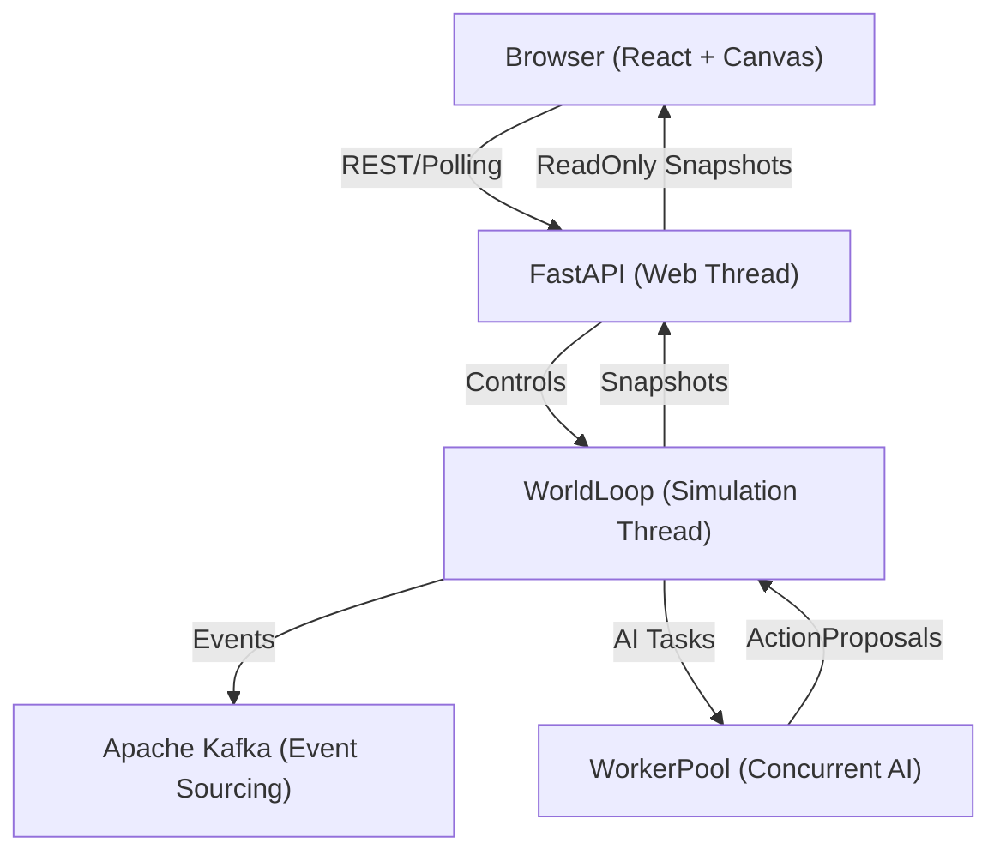

# Project Architecture: The Orchestrated Conductor (AOA)

This document provides a deep technical overview of the **Aspect-Oriented Architecture (AOA)** at the heart of the WorldLoop RPG simulation. It is the primary guide for developers to understand the engine's "plumbing," concurrency model, and strict execution guarantees.

---

## 1. High-Level Architecture

The simulation is built on a **Deterministic Orchestrated Engine** where the `WorldLoop` acts as a central conductor, coordinating decoupled systems and maintaining a single source of truth through immutable snapshots.

### System Context Diagram



### The Threaded Concurrency Model

WorldLoop strictly isolates **Mutation** from **Reading** to avoid race conditions and GIL contention:

1.  **Web Thread (FastAPI)**: Serves the REST API and handles user I/O. It **only** reads immutable `Snapshot` copies of the world.
2.  **Simulation Thread (`WorldLoop`)**: The **Single-Writer**. Only this thread is allowed to mutate the `WorldState`.
3.  **Worker Pool**: AI brain computations are offloaded to background threads. They receive a `freeze()` frozen snapshot and return an `ActionProposal`. They cannot change the state directly.
4.  **Snapshots**: At the end of every tick, the engine creates a `Snapshot` (a deep-copy processed by the `WorldPresenter`) and performs an atomic swap.

---

## 2. The 7-Phase Orchestration Cycle

Every tick (default 50ms) executes exactly seven phases in a strict, contract-enforced sequence defined in `src/engine/world_loop.py`.

### Phase Sequence & Contracts

| Phase | Responsibility | Permissions (READ / MUTATE) |
| :--- | :--- | :--- |
| **1. PreSystems** | Global clock, age multipliers, environmental shifts. | `world.clock`, `world.config` / `world.environment` |
| **2. Scheduling** | Identify entities due to act, reset per-tick temporary state. | `world.entities` / `tick_ready_entities` |
| **3. Collection** | Fan-out AI tasks to `WorkerPool`, collect `ActionProposal` list. | `world.entities`, `action_queue` / `tick_proposals` |
| **4. Resolution** | **Conflict & Update Phase**. Resolution, authoritative reward proposals. | `tick_proposals` / `tick_applied`, `world.entities` |
| **5. Cleanup** | Remove dead entities, drop items, and handle hero respawns. | `world.entities`, `rng` / `world.entities` (DELETE) |
| **6. Finalization** | **Metric Phase**. Calculate tick-duration and performance metrics. | `world`, `tick_applied` / `tick_metrics` |
| **7. Persistence** | **External Phase**. Kafka/Redis publication and stream canonicalization. | `world`, `tick_applied`, `tick_events` / NONE (I/O only) |

### Phase Governance (`PhaseGuard`)
Runtime integrity is enforced by the `PhaseGuard` and `EngineContextProxy`. Since the **RPG Core Stabilization (2026-04-06)**, the guard is in **Strict Mode**: any attempt to access or mutate a field not explicitly declared in the `PhaseContract` will raise a `RuntimeError` and halt execution. This ensures 100% architectural compliance.

---

## 3. Aspect-Oriented Entity Model

Entities are no longer "flat" data objects. They are composed of domain-specific **Aspects** that encapsulate logic and state.

### Core Aspect Container
```python
class Entity(SimulationModel):
    identity: IdentityAspect    # Name, kind, faction, role
    spatial: SpatialAspect      # Position, facing, vision_range
    combat: CombatAspect        # HP, ATK/DEF properties, alive status
    progression: ProgressionAspect # Level, XP, stat training accumulators
    mind: MindAspect            # AI state, perception, emotion, memories
    interaction: InteractionAspect # Reputation, familiarity, active interaction state
    inventory: InventoryAspect  # Equipment slots, bag items, gold
```

### Snapshot Immutability (`freeze()`)
Before being passed to the `WorkerPool`, every `Entity` and `WorldState` is put through a `freeze()` process. This recursively converts Pydantic models into `MappingProxyType` or tuple-backed structures, making them functionally immutable. This ensures that AI logic remains a purely functional mapping from `WorldState -> ActionProposal`.

---

## 4. Deterministic Determinism

WorldLoop uses the **Seed-Domain-Identity** formula to ensure perfect replayability.

### The RNG Formula
The `DeterministicRNG` (using `xxhash`) generates seeds based on:
1.  **World Seed**: Global simulation seed.
2.  **Domain**: (e.g., `Domain.COMBAT`, `Domain.AI_WANDER`).
3.  **Entity ID**: Ensures different entities don't "sync" their random rolls.
4.  **Tick**: Ensures rolls change every frame.

```python
# Canonical way to roll for crit
roll = ctx.rng.next_float(Domain.COMBAT, attacker.id, ctx.world.tick)
is_crit = roll < attacker.combat.crit_rate
```

---

## 5. Persistence & Event Sourcing (Kafka)

Instead of a traditional CRUD database, the engine uses **Event Sourcing**:

-   **Snapshots**: Compacted world state saved to `sim.snapshots` every 100 ticks.
-   **Events**: Granular `SimEvent` logs (Combat, Loot, Level-up) saved to `sim.events`.
-   **Recovery**: On boot, the engine fetches the latest snapshot and "replays" the Kafka event stream until it reaches the desired tick.

---

## 6. The Presenter Boundary

The API does not serve the raw `WorldState`. It uses the `WorldPresenter` to:
1.  **Slimming**: Reduce 1MB+ entity objects to ~200B "Slim" versions for map rendering.
2.  **Mapping**: Convert internal Python enums/IDs into developer-friendly string keys for the frontend.
3.  **Introspection**: Inject derived stats (like `StatBreakdown`) only when a specific entity is inspected.

---

## 7. Performance Benchmarks
-   **Tick Budget**: 50ms (20 TPS).
-   **Resolution Target**: ~2ms for 200 entities.
-   **API Loop**: ~80ms polling cycle.
-   **SSE Stream**: Delta-compression for large world changes.
