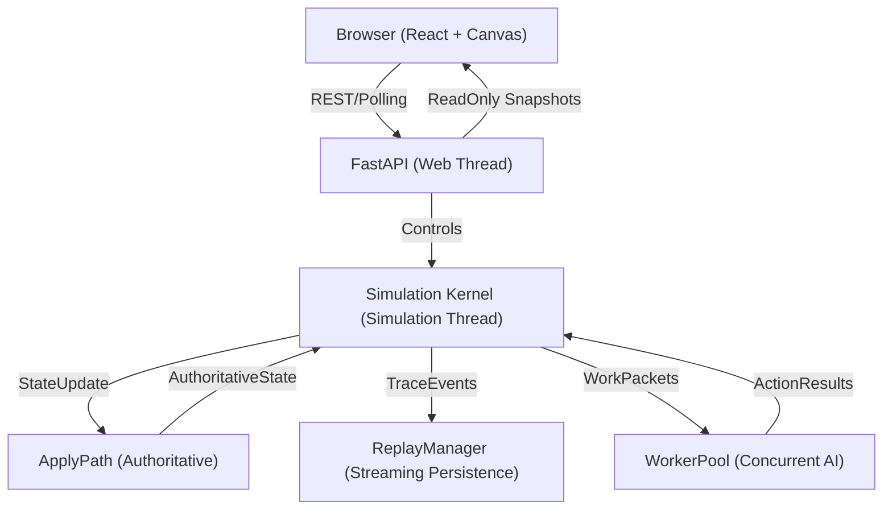

# Project Architecture: The Resource-Safe Conductor (v2)

This document provides a deep technical overview of the **Resource-Safe Simulation Engine** at the heart of the v2 RPG simulation. It defines the authoritative execution laws, deterministic guarantees, and resource-safety boundaries.

---

## 1. High-Level Architecture

The engine is built on a **Deterministic Orchestrated Loop** where the `Kernel` acts as the authoritative conductor, coordinating decoupled systems and maintaining a single source of truth.

### System Context Diagram

### The Threaded Concurrency Model

The v2 engine isolates **Authoritative Mutation** from **Concurrent Deliberation** to ensure 100% determinism and resource safety:

1.  **Simulation Thread (`Kernel`)**: The **Single-Writer**. Only this thread is allowed to produce and apply `AuthoritativeState` transitions.
2.  **Web Thread (FastAPI)**: Serves the REST API. It reads immutable `AuthoritativeState` references. 
3.  **Worker Pool (AI)**: AI brain computations are fanned out to background threads. They receive **Compact Worker Packets** (shallow-cloned subset of state) and return **ActionResults**. They never modify the world state directly.
4.  **Generation-Based Apply**: Instead of deep-cloning every tick, the engine uses the `ApplyPath` to create the next "Generation" of the world. This preserves shared references for read-only visibility while ensuring that even a single illegal mutation of a shared reference is caught by runtime checks or caught by the law of separation.

---

## 2. The 6-Phase Deterministic Kernel Loop

Every tick executes exactly six phases in a strict, contract-enforced sequence. This "Law of Ticks" is frozen in **Milestone 1**.

### Phase Sequence & Contracts

| Phase | Responsibility | Permissions (READ / MUTATE) |
| :--- | :--- | :--- |
| **1. INIT** | Increments simulation clock and resets per-tick buffers. | `state.world_time` / `state.world_time` |
| **2. GOVERNANCE** | Evaluates resource pressure (RAM/CPU) and calculates the **Degradation Mode**. | `status.signals`, `profile` / `governor.policy` |
| **3. SCHEDULING** | Identifies entities due to act and selects work based on the **Work Debt** budget. | `state.entities`, `policy` / `tick_work` |
| **4. PACKETIZATION** | Offloads AI deliberation tasks to the `WorkerPool` using compact packets. | `tick_work`, `policy` / `worker_results` |
| **5. RESOLUTION** | **Authoritative Update**. Converts results into `StateUpdate` and applies it via `ApplyPath`. | `worker_results` / `state.authoritative` |
| **6. PERSISTENCE** | **External Phase**. Streams `TraceEvent` records to the `ReplayManager`. | `state.hash`, `policy` / `disk/stream` (I/O only) |

### Phase Governance
Runtime integrity is enforced by the **PhaseContract**. Any attempt to access state outside the assigned phase boundary or perform unmanaged mutations results in an immediate simulation halt. This prevents "Semantic Drift" where systems accidentally depend on the side effects of others.

---

## 3. Resource-Safe Execution Laws

The engine is governed by three primary laws to ensure it survives pathological conditions:

1.  **Law of Bounded State**: No authoritative collection may grow without limit. Every entity, event buffer, and replay stream must have an explicit retention policy.
2.  **Law of Non-Blocking Persistence**: Replay and observability are "Non-Authoritative." Failures in tracing or persistence must never stall the kernel.
3.  **Law of Progressive Degradation**: The engine must shed optional load (traces, then diagnostics, then AI fidelity) before it crashes due to resource exhaustion.

---

## 4. Determinism & Deterministic RNG

The v2 kernel uses the **Seed-Domain-Identity** formula to ensure perfect replayability across all certified hardware.

### The RNG Formula
The `DeterministicRNG` (using `xxhash`) generates sequences based on:
1.  **World Seed**: Global simulation seed.
2.  **Domain**: Identifies the simulation subsystem (e.g., `Domain.COMBAT`).
3.  **Entity ID**: Ensures different entities don't "sync" their random rolls.
4.  **Tick**: Ensures rolls change every frame.

---

## 5. Performance Monitoring (Standard Hardware Classes)

Throughput claims are never made in isolation. The engine certifies its performance against **Hardware Classes**:
- **Class A (Low-Power)**: Bounded to strictly degraded profiles (10 TPS).
- **Class B (Consumer)**: Standard profile (20 TPS).
- **Class C (High-Performance)**: Enhanced observability profiles.

---

## 6. Domain-Driven System Organization (v2.1)

In v2.1, the monolithic `src/systems/` directory was modularized into domain-specific packages to improve maintainability and prevent circular dependencies.

- **Strategic Systems** (`src/systems/strategic_systems/`): High-level intention and redirection logic.
- **Social Systems** (`src/systems/social_systems/`): Relationship management and collective behavior.
- **World Systems** (`src/systems/world_systems/`): Environmental processes, quests, and spatial navigation.
- **Economy Systems** (`src/systems/economy_systems/`): Resource flow, markets, and production.
- **Lifecycle Systems** (`src/systems/lifecycle_systems/`): Biological pressures and entity evolution.

Compatibility is maintained via wrappers in `src/systems/*.py`, which re-export the modular implementations.

## 7. Decoupled Core Models

To further harden the engine against "Graph Hub" fragility, core state and update models are being extracted from `state.py` and `updates.py` into specialized packages:

- **State Models** (`src/core/models/`): Standalone components like `ItemStack`, `SocialBond`, and `QuestState`.
- **Update Models** (`src/core/update_models/`): Standalone intents like `InventoryUpdate` and `ResourceTransferIntent`.

This separation allows systems to depend on specific model definitions without importing the entire world state, reducing the impact of architectural changes.

> [!NOTE]
> All architectural claims in this document are pinned by the `tests/docs/` integrity suite.
