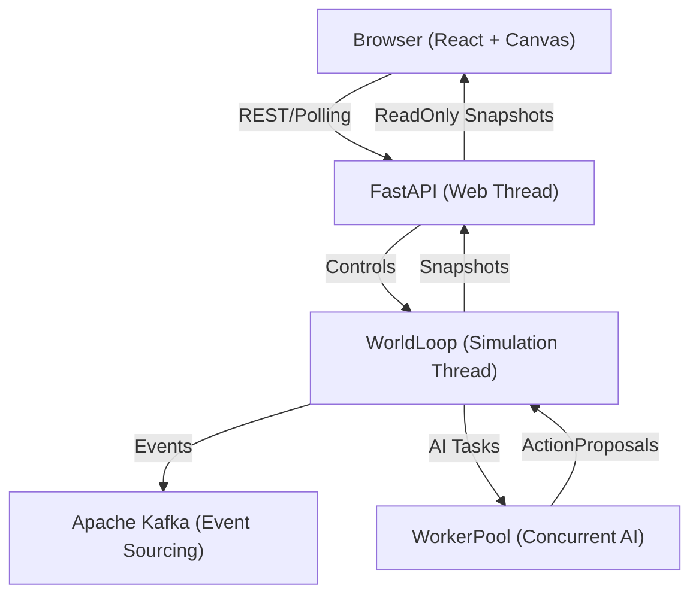

# Project Architecture: The Orchestrated Conductor (AOA)

This document provides a deep technical overview of the **Aspect-Oriented Architecture (AOA)** at the heart of the WorldLoop RPG simulation. It is the primary guide for developers to understand the engine's "plumbing," concurrency model, and strict execution guarantees.

---

## 1. High-Level Architecture

The simulation is built on a **Deterministic Orchestrated Engine** where the `WorldLoop` acts as a central conductor, coordinating decoupled systems and maintaining a single source of truth through immutable snapshots.

### System Context Diagram



### The Threaded Concurrency Model

WorldLoop strictly isolates **Mutation** from **Reading** to avoid race conditions and GIL contention:

1.  **Web Thread (FastAPI)**: Serves the REST API and handles user I/O. It **only** reads immutable `Snapshot` copies of the world.
2.  **Simulation Thread (`WorldLoop`)**: The **Single-Writer**. Only this thread is allowed to mutate the `WorldState`.
3.  **Worker Pool**: AI brain computations are offloaded to background threads. They receive a `freeze()` frozen snapshot and return an `ActionProposal`. They cannot change the state directly.
4.  **Snapshots**: At the end of every tick, the engine creates a `Snapshot` (a deep-copy processed by the `WorldPresenter`) and performs an atomic swap.

---

## 2. The 7-Phase Orchestration Cycle

Every tick (default 50ms) executes exactly seven phases in a strict, contract-enforced sequence. The engine has moved from a tactical loop to a **Strategic-Aware Orchestration** where world-tier systems and entity-tier strategic persistence are interleaved with the tactical action loop.

### Phase Sequence & Contracts

| Phase | Responsibility | Permissions (READ / MUTATE) |
| :--- | :--- | :--- |
| **1. Pre-Systems** | **Environmental & Strategic Phase**. Regional control shifts, Calamities, and [StrategySystem] broadcasts. | `world.clock`, `system_manager` / `world.region_control`, `strategic_registry` |
| **2. Scheduling** | Identify entities due to act and reset per-tick temporary state. | `world.entities` / `tick_ready_entities` |
| **3. Collection** | Fan-out AI tasks to `WorkerPool`. Entities derive tactical objectives and Strategic Updates (e.g. project switches) here. | `world.entities`, `mind.strategic` / `tick_proposals` |
| **4. Resolution** | **Conflict & Authoritative Update**. Resolves tactical actions and applies Strategic Updates (Source Trust, Projects) via `ActionSystem`. | `tick_proposals` / `world.entities`, `action_system` |
| **5. Cleanup** | Remove dead entities, drop items, handle hero respawns and log rotation tasks. | `world.entities`, `rng` / `world.entities` (DELETE) |
| **6. Finalization** | **Metric Phase**. Performance metrics and tick-duration calculations. | `world`, `tick_applied` / `tick_metrics` |
| **7. Persistence** | **External Phase**. Redis Delta-Streaming and Kafka Snapshot persistence. | `world`, `tick_applied`, `tick_events` / NONE (I/O only) |

### Phase Governance (`PhaseGuard`)
Runtime integrity is enforced by the `PhaseGuard`. Since the **Strategic Stabilization (2026-04)**, the guard ensures that even long-term memory updates and strategic project derivations remain deterministic and traceable. Any attempt to access state outside the `PhaseContract` results in an immediate simulation halt.

---

## 3. Strategic AI Framework

Entities are governed by a **Tri-Layer Strategic Hierarchy** embedded in their `MindAspect`:

1.  **Directives**: Persistent, motive-driven "north stars" (e.g., "Build Wealth").
2.  **Projects**: Medium-term commitments with specific success conditions (e.g., "Clear Bandit Camp").
3.  **Objectives**: Tactical, concrete steps derived dynamically from the active project (e.g., "Kill Bandit Leader").

This hierarchy ensures that AI behavior remains consistent across hundreds of ticks, resisting tactical "jitter" and maintaining narrative continuity.

---

## 4. Deterministic Determinism

WorldLoop uses the **Seed-Domain-Identity** formula to ensure perfect replayability, now extended to include strategic choice-points.

### The RNG Formula
The `DeterministicRNG` (using `xxhash`) generates seeds based on:
1.  **World Seed**: Global simulation seed.
2.  **Domain**: (e.g., `Domain.COMBAT`, `Domain.AI_WANDER`).
3.  **Entity ID**: Ensures different entities don't "sync" their random rolls.
4.  **Tick**: Ensures rolls change every frame.

```python
# Canonical way to roll for crit
roll = ctx.rng.next_float(Domain.COMBAT, attacker.id, ctx.world.tick)
is_crit = roll < attacker.combat.crit_rate
```

---

## 5. Persistence & Event Sourcing (Kafka)

Instead of a traditional CRUD database, the engine uses **Event Sourcing**:

-   **Snapshots**: Compacted world state saved to `sim.snapshots` every 100 ticks.
-   **Events**: Granular `SimEvent` logs (Combat, Loot, Level-up) saved to `sim.events`.
-   **Recovery**: On boot, the engine fetches the latest snapshot and "replays" the Kafka event stream until it reaches the desired tick.

---

## 6. The Presenter Boundary

The API does not serve the raw `WorldState`. It uses the `WorldPresenter` to:
1.  **Slimming**: Reduce 1MB+ entity objects to ~200B "Slim" versions for map rendering.
2.  **Mapping**: Convert internal Python enums/IDs into developer-friendly string keys for the frontend.
3.  **Introspection**: Inject derived stats (like `StatBreakdown`) only when a specific entity is inspected.

---

## 7. Performance Benchmarks
-   **Tick Budget**: 50ms (20 TPS).
-   **Resolution Target**: ~2ms for 200 entities.
-   **API Loop**: ~80ms polling cycle.
-   **SSE Stream**: Delta-compression for large world changes.
