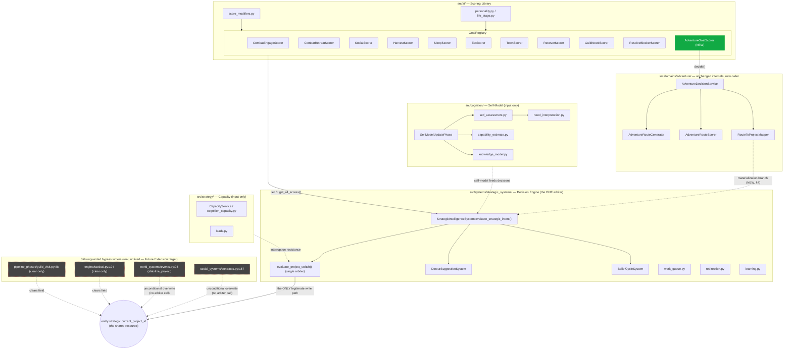
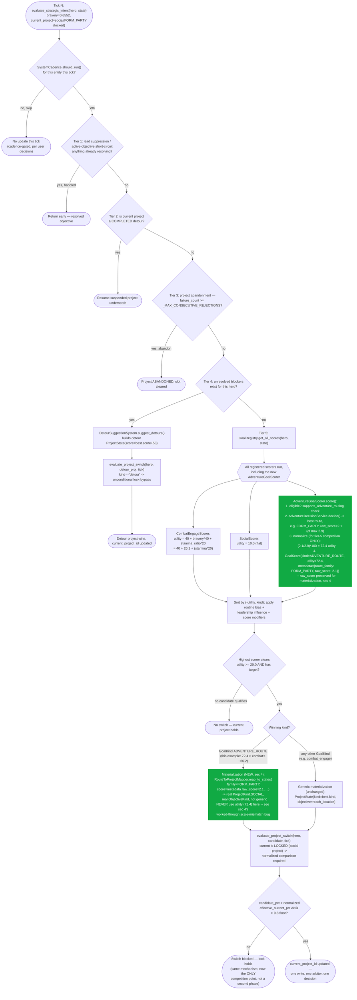

# Adventure as a Strategic-Cognition Sub-Component — Wrapper Design

## Context

`TCK-20260810-COMBAT-BRAVERY-QUARTILE-ENGAGEMENT-INVERSION`'s investigation (and the 4-ticket batch
it spawned — `TCK-20260810-COGNITION-PROFILE-ADVENTURE-ELIGIBILITY`,
`TCK-20260810-PROJECT-SWITCH-BYPASS-GENERALIZATION`, `TCK-20260810-COGNITION-ELIGIBILITY-BYPASS-DOCS`,
`TCK-20260810-D22-DORMANT-WIRING-AUDIT`) found and partially fixed a structural problem: two
independent decision-making systems — `AdventureDecisionPhase` (`src/domains/adventure/`, route
selection for cognition-eligible entities: recover, craft, train, quest, scout, trade, socialize)
and `StrategicIntelligenceSystem`/`GoalRegistry` (`src/systems/strategic_systems/` +
`src/ai/goals/`, the universal baseline covering combat/social/survival for every entity) — both
write to `entity.strategic.current_project_id`, arbitrated only by convention (both are supposed to
call `evaluate_project_switch()`, but nothing enforces this).

That batch fixed the specific bug (adventure's own re-lock cycle starving combat) by making
`AdventureDecisionPhase` route its commits through the shared arbiter instead of overwriting
directly, and added a regression guard confirming it can't silently regress back to a direct
overwrite. But a follow-on architectural review (this document's own origin) found the fix, while
correct, is narrower than the actual risk surface:

- **At least two more writers bypass the arbiter entirely today**, unrelated to adventure:
  `src/systems/social_systems/contracts.py:187` (social contracts unconditionally claim the project
  slot) and `src/systems/world_systems/events.py:98` (region-danger stabilization unconditionally
  suspends whatever is current and takes over). Neither goes through `evaluate_project_switch()`.
  Confirmed via direct grep of every `current_project_id_set=` write site in `src/` — see
  `TCK-20260811-*` follow-up context in this session's own investigation trail.
- **A real, separately-ticketed normalization defect** (`TCK-20260811-INTERRUPTION-BYPASS-RETENTION-MARGIN-SCALE-BUG`)
  means a locked adventure-routed project can never be interrupted by a System-B candidate, no
  matter how urgent, because `retention_margin` divided by adventure's own small declared score
  ceiling (`~2.9`) structurally dominates any realistic candidate percentage.
- **The two systems still use two distinct, overlapping-by-string enum vocabularies**
  (`ProjectKind` vs `GoalKind`) — worked around via `isinstance()` classification, never unified.

This document proposes a design that addresses the *root cause* underlying all three findings —
not by patching each bypass site individually, but by restructuring so there is exactly **one**
place that ever competes for and commits to `current_project_id`, and folding adventure's decision
logic into that one place as a richer sub-component rather than a structurally-independent peer.

## Goals

1. Exactly one code path ever writes `current_project_id` for goal-competing entities — no
   convention-dependent "everyone must remember to call the arbiter" discipline.
2. Adventure's own rich internal decision logic (candidate generation, personality-biased scoring,
   route-to-project mapping) is preserved unchanged — this is a structural/organizational change,
   not a rewrite of the 15 route families' own reasoning.
3. Adventure becomes correctly subject to the same strategic hierarchy (lead-suppression → detour
   resumption → project abandonment → blocker-driven redirection → goal scoring) every other
   decision already respects — closing a gap where it was invisible to that hierarchy entirely.
4. The design generalizes: the same pattern should be directly applicable to the two confirmed
   bypass sites (`contracts.py`, `events.py`) as a natural follow-on, not a one-off special case for
   adventure alone.

## Non-goals

- **Fixing `TCK-20260811-INTERRUPTION-BYPASS-RETENTION-MARGIN-SCALE-BUG`'s own normalization math is
  not this design's job — but per an explicit sequencing decision, it is fixed first, as its own
  ticket, before the tickets for this design are created.** An earlier draft of this document
  reasoned that this design merely reduces that bug's impact and could ship without it; on review,
  that framing understated the real risk (§4/§8's own worked arithmetic shows a materialized
  `ADVENTURE_ROUTE` project would be exactly as exposed to that bug as any other locked
  `ProjectKind`-typed project once this design lands) — doing the smaller, more surgical fix first
  means this design's own Goal #3 (correct hierarchy participation) is actually meaningful from the
  moment it ships, not contingent on a second, separately-timed fix.
- Migrating `contracts.py`/`events.py` to the new pattern — identified as natural follow-on work
  (see "Future Extension Patterns" below), explicitly not implemented by this design.
- Unifying `ProjectKind`/`GoalKind` into one enum — orthogonal, tracked separately under D22.
- Multi-step/persistent planning (an entity committing to a sequence of future intentions, not just
  the next single action) — a materially larger, separate architectural question, noted under
  Future Extension Patterns but out of scope here.

## Design

### 1. Architecture — `AdventureGoalScorer`, a `GoalScorer` wrapper

One new class, `AdventureGoalScorer`, implementing the existing `GoalScorer` protocol
(`src/ai/goals/base.py`: `score(entity, state) -> GoalScore`), registered under one new
`GoalKind.ADVENTURE_ROUTE` enum member (`src/core/strategic.py`). Its `score()` method:

1. Resolves eligibility via the existing 3-tier `_resolve_cognition_profile_id`/
   `_supports_adventure_routing` logic (landed by `TCK-20260810-COGNITION-PROFILE-ADVENTURE-ELIGIBILITY`,
   unchanged by this design).
2. If eligible, calls `AdventureDecisionService.decide()` — completely unchanged: still generates up
   to 25 candidates via `AdventureRouteGenerator`, scores via `AdventureRouteScorer`, picks the best
   non-blocked one internally.
3. Wraps the single winning result into one `GoalScore(kind=GoalKind.ADVENTURE_ROUTE,
   utility=<normalized>, target_id=..., metadata={"route_family": ..., "objective_kind": ...,
   "raw_score": <the real, unnormalized AdventureRouteOption.score, ~0-2.9 scale>})`. **Carrying
   `raw_score` in metadata is required, not optional** — see §4's own explicit warning about why
   `utility` (the normalized value) must never be the value passed into `RouteToProjectMapper`.
   The real route family also travels in `metadata`, not lost.
4. If ineligible, or the service returns `DEFER_WITH_REASON`, returns a score that can never win
   (`utility=0`, no target) — no special-casing needed anywhere else.

`GoalRegistry.get_all_scores()` then treats this exactly like `CombatEngageScorer`'s or
`SocialScorer`'s output: one candidate among many, same list, same 20.0 utility floor, same
downstream selection logic. `AdventureDecisionPhase` and its separate `pipeline.py` registration are
deleted entirely.

### 2. Hierarchy compliance

`StrategicIntelligenceSystem.evaluate_strategic_intent()` (`intelligence.py:1130-1450`, `def` at
1130, real closing `return StrategicUpdate()` at ~1450 — re-verified during spec review after an
earlier draft cited a range that was off by several dozen lines) already implements a real,
five-tier fallthrough for every strategic entity, every tick it's evaluated:

1. Lead suppression / active-objective short-circuit
2. Detour completion → project resumption
3. Project abandonment (rejection-backoff, plus embedded harvesting/hunger/fatigue/shopping
   completion checks)
4. Blocker-driven detour suggestion (`DetourSuggestionSystem.suggest_detours()`, itself routed
   through `evaluate_project_switch()`) — **nested inside tier 3's "has an active current project"
   branch** (`intelligence.py:1220-1348`), not an independently-reachable tier; an entity with no
   current project skips it and falls straight to tier 5
5. Goal scoring (`GoalRegistry.get_all_scores()`) — the generic, lowest-priority fallback

**Today, `AdventureDecisionPhase` participates in none of this** — it runs as a wholly separate,
earlier `pipeline.py` phase, invisible to tiers 1-4. Under this design, `GoalKind.ADVENTURE_ROUTE`
becomes one candidate in tier 5, exactly where routine, non-urgent activity semantically belongs —
whichever of tiers 1-4 actually apply get first refusal for adventure-eligible entities exactly as
they already do for combat and social decisions. This is not merely "consistent with" the existing
hierarchy; it closes a real gap where adventure was silently exempt from it.

### 3. Score normalization

`AdventureRouteScorer`'s real score tops out at ~2.9 (`docs/mechanics/04_strategic_cognition.md`
§6.6, Certified Level 1). `GoalRegistry`'s selection requires `utility >= 20.0` to be considered at
all. A raw pass-through would mean adventure could never win a single tick — a far worse version of
the exact defect class this whole investigation started from. The fix reuses the percentage-of-own-
declared-max pattern already established and battle-tested in `evaluate_project_switch()`'s own
normalized lock-bypass gate (landed by `TCK-20260810-PROJECT-SWITCH-BYPASS-GENERALIZATION`):

```
utility = (raw_score / _ADVENTURE_ROUTE_SCORE_MAX) * _GOAL_UTILITY_SCORE_MAX
```

reusing the exact same two constants already introduced for that gate. A maximal adventure route
(2.9/2.9 = 1.0 normalized) becomes utility 100 — comparable to a maximal `CombatEngageScorer` output.
A mediocre one (~1.0 raw) becomes ~34.5 — comfortably clears the floor. **This needs empirical
validation once real** (same discipline as every calibration this session — E11D, the 24-seed
quartile recalibration), not assumed correct by formula alone.

### 4. Materialization — a real gap found during design review, and a real bug found during spec review

Verified directly (`intelligence.py`, the generic construction runs approximately lines 1397-1414,
immediately after the resume-suspended-project branch at 1388-1396 — cited precisely so a future
reader doesn't trust an earlier draft's off-by-a-decade line numbers): after
`GoalRegistry.get_all_scores()` picks a winner today, the resulting `ProjectState`/`ObjectiveState`
construction is **generic** — one `ObjectiveState(kind="reach_location",
target=best_candidate.target_id, ...)` and one `ProjectState(kind=best_candidate.kind, ...)`,
because no existing `GoalScorer` has ever needed anything richer.

`RouteToProjectMapper`, by contrast, maps **15** distinct route families (`RouteFamily` has 16
members total; only `DEFER_WITH_REASON`, which never represents a real committed route, is excluded
from `_MAP`) to their own specific `(ProjectKind, ObjectiveKind)` pairs
(`HUNT_WEAK_ENEMY → (COMBAT, DEFEAT_ENEMY)`, `FORM_PARTY → (SOCIAL, ...)`, etc.). Feeding an
`ADVENTURE_ROUTE` winner through the generic path would collapse all 15 families into one
indistinguishable project kind with a generic objective — a real loss of fidelity for any downstream
consumer (observability, decision traces, other scoring logic) that reads
`ProjectState.kind`/`ObjectiveState.kind` today expecting the specific value.

**Required addition, not optional**: one new branch at the materialization site —
`if best_candidate.kind == GoalKind.ADVENTURE_ROUTE: call RouteToProjectMapper.map_to_states(...)`
using the real route family carried in the `GoalScore`'s `metadata`, instead of the generic 2-line
construction.

**A real bug in this branch, found and fixed during spec review — do not use `best_candidate.utility`
as the mapper's `score=` argument.** `utility` is the *normalized* value from §3 (0-100 scale).
`RouteToProjectMapper.map_to_states()` sets `ProjectState.kind` to a real `ProjectKind` member, which
`_score_scale_max()` (`intelligence.py:89-107`) classifies via `isinstance(kind, ProjectKind)` onto
the *small*, 2.9-ceiling scale — not the 100-ceiling scale `utility` was normalized onto. Passing
`utility` (e.g. `72.4`) as `score=` into a `ProjectKind`-classified project produces
`candidate_pct = 72.4/2.9 ≈ 25` — a ~2500% normalized score, which would either trivially bypass
any lock as a candidate, or (once committed and itself `current`) become permanently un-interruptible
by anything else, since its own `current.score/current_max` would compute the same ~25. This is the
same defect class as `TCK-20260811-INTERRUPTION-BYPASS-RETENTION-MARGIN-SCALE-BUG`, but dramatically
worse if built this way — directly undermining this design's own Goal #3.

**The correct implementation**: this materialization branch must call
`RouteToProjectMapper.map_to_states(score=metadata["raw_score"], ...)` — the *raw*, unnormalized
route score threaded through in §1 step 3's `metadata` dict, never `best_candidate.utility`. The
normalized `utility` value exists only to let `ADVENTURE_ROUTE` compete fairly in tier 5's selection
step (§3); it must not leak into the committed `ProjectState.score`, which needs to stay on the same
scale `_score_scale_max()` expects for whatever `ProjectKind` the route actually mapped to. Implement
should add a unit test asserting this specifically (a materialized `ADVENTURE_ROUTE` winner's
`ProjectState.score` equals the pre-normalization raw score, not the post-normalization utility) —
see §9.

### 5. Components

**New:**
- `AdventureGoalScorer` — co-locate with the other scorers in `src/ai/goals/`.
- `GoalKind.ADVENTURE_ROUTE` — new enum member, `src/core/strategic.py`.

**Modified:**
- `src/ai/goals/__init__.py` — register the new scorer.
- `intelligence.py`'s tier-5 materialization branch — the `RouteToProjectMapper` special case
  (§4 above).

**Relocated:** `_resolve_cognition_profile_id()`/`_supports_adventure_routing()` — currently
module-level functions in `src/domains/adventure/phase.py`, alongside the class this design deletes.
They move to wherever `AdventureGoalScorer` lives (co-located per "New," above) since its own
`score()` step 1 still needs them, unchanged internally.

**Deleted:**
- `AdventureDecisionPhase` class and its `pipeline.py` registration.

**Unchanged, called from a new place only:** `AdventureDecisionService`, `AdventureRouteGenerator`,
`AdventureRouteScorer`, `RouteToProjectMapper` — no internal logic changes.

**Resolved — `_threat_resolved()` relocates to the general arbiter as a lock-expiry condition, not
a new bypass mechanic.** `_threat_resolved()` (`src/domains/adventure/phase.py:27-46`) implements
`STRAT-236` (`docs/parity_ledger/strategic_cognition.yaml:2687-2706`, P1, verified) — HP>80% and no
hostile within radius 10.0. Its own signature already takes `(hero: EntityState, state:
AuthoritativeState)` with zero adventure-specific logic inside it. **Citation correction (caught
during spec review, verified against the real ledger, not assumed):** the "strategic project locks
on `COMBAT_RETREAT`/`RECOVER` projects" scope language does **not** appear in `STRAT-236`'s own
ledger `text` field — that field is currently adventure-specific, literally saying "the lock is
bypassed in `AdventureDecisionPhase`." The broader scope language instead appears in
`_threat_resolved()`'s own docstring (`phase.py:32-33`: "Used as an early-release condition for
strategic project locks on `COMBAT_RETREAT` / `RECOVER` projects..."). So the intended generality is
real and pre-existing — just documented informally in code, not yet reflected in the authoritative
parity ledger — and a `COMBAT_RETREAT`-typed project locked via System B has never actually
benefited from it, since only `AdventureDecisionPhase` has ever called it.

Given this, treating it as a new *bypass* mechanic (a second `"detour"`-style unconditional
exemption keyed to `kind`) would be the wrong shape — it would reproduce the exact hardcoded,
kind-string-special-case pattern `TCK-20260810-PROJECT-SWITCH-BYPASS-GENERALIZATION` (C2) already
replaced once with a generic rule. `_threat_resolved()` isn't really about a *candidate* deserving
to win; it's about whether the *current* project's own lock is still justified at all — a property
of `current`, not of whatever's competing against it.

**The fix**: relocate `_threat_resolved()` from `phase.py` to `src/systems/strategic_systems/`
(co-located with `evaluate_project_switch()`, its new sole caller). **This is a real signature
change to a shared function, not a same-line boolean edit** — verified against the real current
code: `evaluate_project_switch(entity: EntityState, candidate_project: ProjectState, current_tick:
int)` (`intelligence.py:928-932`) takes no `state: AuthoritativeState` parameter today, and
`_threat_resolved(hero, state)` needs `state` for `SpatialQueryService.nearby_entities(state, ...)`.
The fix requires: (1) adding `state: AuthoritativeState` to `evaluate_project_switch()`'s own
signature, (2) threading `state` through both of its real call sites
(`intelligence.py:1341`, `:1422` — both already sit inside `evaluate_strategic_intent(state, entity,
...)`, where `state` genuinely is in scope, so the plumbing is mechanical, not a design problem —
just not a one-line change), and (3) extending the lock check itself from
`if current.lock_until_tick > current_tick:` to
`if current.lock_until_tick > current_tick and not _threat_resolved(entity, state):`. When the
threat has resolved, the lock is treated as already expired — falling through to the existing
unlocked raw-score comparison, exactly the same outcome `_threat_resolved()` already produces for
adventure-originated projects today (byte-identical behavior, confirmed by construction, not by a
new special case). The generalization to any other locked project kind (including the
already-documented-but-never-wired `COMBAT_RETREAT` case) is a deliberate, disclosed side effect —
it closes a real, pre-existing gap between `_threat_resolved()`'s own documented intent and both its
actual implementation and the parity ledger's own text, not scope creep invented by this design.

> **Post-landing citation correction (2026-08-11, `TCK-20260811-THREAT-RESOLVED-ARBITER-RELOCATION`):**
> the fix described above has since landed exactly as specified. The line citations in the paragraph
> above were already approximate at design time and are now additionally stale post-relocation —
> `_threat_resolved()` no longer lives at `phase.py:27-46`; it is now a module-level function at
> `src/systems/strategic_systems/intelligence.py:112`. `evaluate_project_switch()`'s widened
> signature (now including `state: Optional[AuthoritativeState] = None`) is at
> `intelligence.py:955`, not `:928-932`. Its two calls inside `evaluate_strategic_intent()` are now
> at `intelligence.py:1384` and `:1494`, not `:1341`/`:1422`. This note corrects citations only; the
> design rationale above is unchanged and matches the landed implementation. See
> `docs/parity_ledger/strategic_cognition.yaml`'s `STRAT-236` entry for the current authoritative
> citations.

### 6. Data flow — one tick, cognition-eligible entity

1. Self-model phase runs (`src/cognition/`, unchanged) → produces the entity's self-model.
2. `StrategicIntelligenceSystem.evaluate_strategic_intent()` runs, subject to cadence.
3. Tiers 1-3 get first refusal for every entity, adventure-eligible or not. Tier 4
   (blocker-driven detour suggestion) is nested inside tier 3's "has an active current project"
   branch (`intelligence.py:1220-1348`) — an entity with no current project skips it entirely and
   falls straight to tier 5; this doesn't affect the worked example below (the hero already has a
   locked project) but is worth being precise about. For the first time, adventure-eligible entities
   genuinely pass through whichever of tiers 1-4 apply to them, instead of being invisible to all of
   them.
4. If nothing above fires, tier 5 runs. `AdventureGoalScorer.score()` is one call among many:
   eligibility check → `AdventureDecisionService.decide()` (unchanged) → normalize → one `GoalScore`.
5. All candidates sorted by utility; highest one clearing the 20.0 floor and carrying a target wins.
6. If the winner is `GoalKind.ADVENTURE_ROUTE`, `RouteToProjectMapper` builds the real,
   specifically-typed project/objective (§4). Otherwise the existing generic path runs unchanged.
7. One `StrategicUpdate`. One write to `current_project_id`. No second phase, no separate arbiter
   call — the two-phase race collapses into one competition with one winner.

### 7. Migration / rollout plan

A real behavior change (cadence, competitive dynamics, hierarchy participation) — staged, not a
single flip:

1. Land `AdventureGoalScorer` + `GoalKind.ADVENTURE_ROUTE` alongside the still-active
   `AdventureDecisionPhase`, registered but not wired into `pipeline.py` — fully unit-testable in
   isolation first.
2. Shadow-mode integration test: run both paths side by side on the same scenario, diff their
   decisions without either affecting committed state — surfaces normalization miscalibration
   before it's live.
3. Only then remove `AdventureDecisionPhase` from `pipeline.py` and delete the class.
4. Full-corpus SimQ re-run to catch any behavior regression the shadow test's synthetic scenarios
   missed.

### 8. Error handling / edge cases

- **Ineligible entity / `DEFER_WITH_REASON`**: scorer returns an unwinnable score — no special
  casing needed elsewhere.
- **Ties**: `modified_scores.sort(key=lambda x: (-x.utility, x.kind))` already exists, deterministic
  by `kind` string on exact-utility ties — `ADVENTURE_ROUTE`'s literal string value affects
  tie-break ordering against other kinds; pick it deliberately.
- **`TCK-20260811-INTERRUPTION-BYPASS-RETENTION-MARGIN-SCALE-BUG` is a hard prerequisite, not a
  parallel concern** — fixed first, as its own ticket, before this design's own tickets are created
  (see Non-goals). Without that fix landing first, an `ADVENTURE_ROUTE`-sourced project that wins,
  gets locked, and needs to be interrupted by a genuinely urgent System-B candidate would be subject
  to the exact same `retention_margin`/small-`ProjectKind`-scale math that ticket describes, once
  §4's fix correctly threads `raw_score` through — meaning this design's own Goal #3 would be true in
  name only for any locked adventure-routed project. **Getting §4's `raw_score`-not-`utility` fix
  wrong would independently make this design a new, worse instance of that same bug class regardless
  of prerequisite sequencing** (see §4's own worked-through arithmetic) — this is not a hypothetical
  risk, it's what an earlier draft of this document actually proposed before spec review caught it.
  Both facts hold at once: the prerequisite fix and getting §4 right are each independently
  necessary, neither is sufficient alone.
- **`contracts.py`/`events.py` bypasses**: unaffected either way by this design alone — see Future
  Extension Patterns.

### 9. Testing

- Unit tests for `AdventureGoalScorer` in isolation: eligibility, normalization arithmetic, metadata
  carrying both the real route family and the raw (unnormalized) score.
- **Materialization branch — the §4 fix specifically**: a winning `ADVENTURE_ROUTE` candidate's
  committed `ProjectState.score` must equal `metadata["raw_score"]` (the pre-normalization value),
  never `best_candidate.utility` — a dedicated regression test for this exact distinction, not just
  an incidental assertion, given §4's own finding that getting this wrong silently breaks
  interruptibility in a hard-to-notice way (the entity still "works," it just becomes
  un-interruptible or trivially-interruptible depending on which direction the mistake goes).
- Materialization branch — shape fidelity: a winning `ADVENTURE_ROUTE` candidate must produce the
  *same* `ProjectState`/`ObjectiveState` shape `RouteToProjectMapper` produces today, for each of the
  **15** route families (`RouteFamily` has 16 members; only `DEFER_WITH_REASON` is excluded from
  `_MAP` and never reaches materialization).
- Re-run `test_bravery_quartile_combat_rate_2x` and `test_score_normalization.py` — this design
  should make the locked-bypass edge case moot for the *starvation pattern* specifically; confirm
  empirically, not by assumption.
- Parity ledger, per architecture review: `STRAT-185`/`STRAT-186`/`STRAT-187`
  (`strategic_cognition.yaml:1987-2016`, all P0/verified but `test_path: null` today) are directly
  exercised differently once adventure routes through the same gate — a real opportunity to close
  that pre-existing P0-without-a-passing-test gap, not just preserve it. `STRAT-236`
  (`:2687-2706`, P1) currently says "the lock is bypassed in `AdventureDecisionPhase`" in its own
  `text` field — both `text` and `v2_evidence` need updating post-relocation (per §5's resolved
  decision), not just `v2_evidence`: the ledger's own claim is adventure-specific today, and this is
  the real opportunity to bring it into line with what `_threat_resolved()`'s own docstring already
  intended (`COMBAT_RETREAT`/`RECOVER` scope) but the ledger never captured. Broader entries citing
  `AdventureDecisionPhase`/`src/domains/adventure/phase.py`
  directly will need a `v2_evidence` sweep once the class is actually deleted.
- Corpus-level SimQ sweep before final cutover (migration step 4).

## Future Extension Patterns

**Same pattern, other purposes.** The wrapper principle — rich internal decision logic behind a thin
`GoalScorer` adapter — generalizes directly to the two confirmed, still-live bypass sites found
during this session's own architecture review:

- `src/systems/social_systems/contracts.py:187` → a `SocialContractGoalScorer`. Contract-driven
  obligations would compete fairly against combat, recovery, and adventure instead of
  unconditionally overriding them.
- `src/systems/world_systems/events.py:98` (`stabilize_project`) → a
  `RegionStabilizationGoalScorer`. Regional-crisis urgency becomes a real, comparable score instead
  of an automatic override.

Both are real, not hypothetical — the exact same "direct overwrite, no arbiter" defect class fixed
for adventure this session, still present, currently unguarded. Fixing them this way closes the
safety gap and extends the pattern in the same piece of work, not two separate ones.

**Deepening adventure's own reasoning** (internal richness, not a structural change — orthogonal to
the wrapper migration itself):

- **Memory-informed candidates**: `src/domains/memory/` already tracks entity experience, but
  `AdventureRouteGenerator` doesn't consult it — an entity that suppresses `BUY_UPGRADE` at a vendor
  who previously cheated it starts to look like it remembers, not just re-derives the same choice
  fresh every tick.
- **Capability-estimate-driven confidence**: `src/cognition/`'s `CapabilityEstimateService` already
  computes real "can I fight/craft/travel" estimates that adventure's own `confidence_bonus` term
  doesn't read — wiring this in closes an inert loop between two subsystems that already exist.
- **Relationship-aware `FORM_PARTY`**: real trust/relationship data already exists in
  `src/systems/social_systems/`; today's `FORM_PARTY` bias is a flat `sociability` scalar.
- **Multi-step planning** (materially larger, separate question): everything above is still a
  single-step, freshly-re-decided-every-eligible-tick choice. A genuinely deeper version would let
  an entity commit to a short sequence of intentions (e.g. train → craft → quest) rather than only
  ever picking the single next action — this implies a new persistent planning concept, not a
  scorer tweak, and deserves its own design conversation rather than folding into this one.

## Diagrams

### Full strategy system — component diagram (post-design)



*`AdventureDecisionPhase` itself is not shown — it's deleted by this design (§5). Dashed arrows into
the shared resource mark paths that skip the arbiter; solid marks the one enforced path. The `BYPASS`
subgraph shows four sites, not just the two (`contracts.py`, `events.py`) discussed in prose and
Future Extension Patterns below — `tactical.py:194` and `guild_visit.py:88` are confirmed real too,
but only ever *clear* the field (`current_project_id_set=""`), never steal it from an active project,
a meaningfully lower-risk pattern than the other two's unconditional overwrite. Included in the
diagram for completeness; not discussed as Future Extension candidates since "clearing" doesn't need
the same competitive-arbitration fix "stealing" does.*

### Decision tree with real data — one tick for an adventure-eligible hero

Worked example using real formulas, constants, and thresholds verified this session (not invented
for the diagram): a hero with `bravery=0.6552` (the same value the parent ticket's own live trace
used for its hero 4), locked into a `social`/`FORM_PARTY` project, evaluated one tick after this
design lands. Illustrative of the mechanism, not a literal replay of the pre-design trace — hero 4's
own real numbers were captured under the *current* two-phase architecture, applied here to show how
the *same inputs* would flow through the *proposed* single-arbiter design.



*Real constants used: `_GOAL_UTILITY_SCORE_MAX=100.0`, `_ADVENTURE_ROUTE_SCORE_MAX=2.9`,
`_INTERRUPTION_URGENCY_FLOOR_PCT=0.8`, the `20.0` goal-utility floor, `CombatEngageScorer`'s real
formula — all verified against source this session, not invented for illustration. The specific raw
route score (2.1) and resulting numeric comparison are an illustrative example, not a captured trace
value; the formulas and thresholds they're run through are real.*

## Open Questions For Implementation

- Exact normalization constant validation (empirical, per §3) — deferred to Implement, same as every
  other calibration this session.
- `ADVENTURE_ROUTE`'s literal string value, chosen deliberately for tie-break ordering (§8) —
  deferred to Implement.
- Whether the shadow-mode integration test (migration step 2) needs its own dedicated scenario
  corpus or can reuse existing `tests/integration/scenarios/` fixtures — deferred to Implement.
