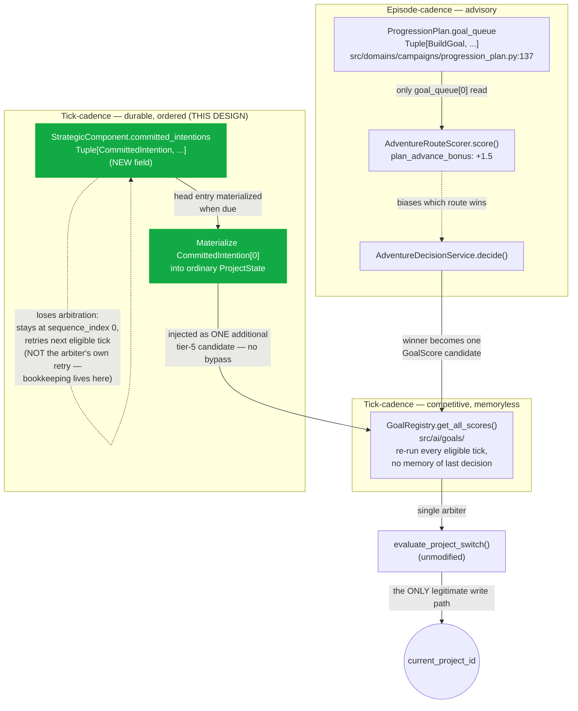
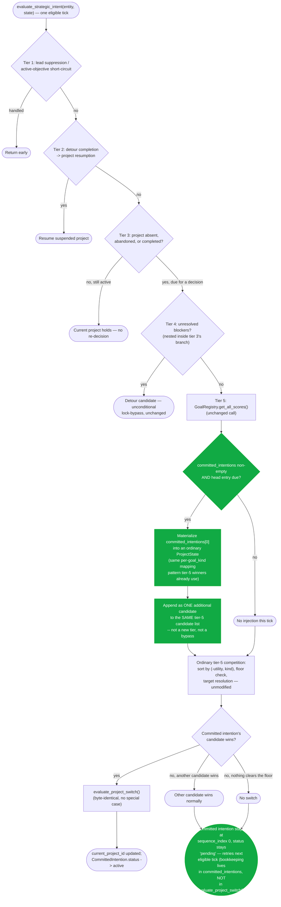

# Multi-Step Persistent Planning for Adventure-Eligible Entities — Design & Go/No-Go

## Context

`docs/architecture/2026-08-11-adventure-as-cognition-strategy-subcomponent-design.md`'s "Future
Extension Patterns" section, under "Deepening adventure's own reasoning," explicitly named this
proposal and explicitly scoped it out of that document (lines 449-453, read directly):

> "Multi-step planning (materially larger, separate question): everything above is still a
> single-step, freshly-re-decided-every-eligible-tick choice. A genuinely deeper version would let
> an entity commit to a short sequence of intentions (e.g. train → craft → quest) rather than only
> ever picking the single next action — this implies a new persistent planning concept, not a
> scorer tweak, and deserves its own design conversation rather than folding into this one."

This document is that conversation. It picks up after both prerequisite tickets from the
`adventure-cognition-merge` epic — `TCK-20260811-ADVENTURE-GOAL-SCORER` and
`TCK-20260811-THREAT-RESOLVED-ARBITER-RELOCATION` — landed and stabilized, per
`tickets/todos/adventure-cognition-merge/SEQUENCE.md:17`'s own recommendation to wait for exactly
that. Every claim below about the current single-slot arbiter (`evaluate_project_switch()`,
`evaluate_strategic_intent()`) reflects the post-epic state of `src/systems/strategic_systems/
intelligence.py`, not the pre-epic behavior those two tickets replaced.

The proposal, restated precisely: let an entity commit to a short, ordered sequence of future
intentions (e.g. train → craft → quest) rather than re-deciding the single next action from
scratch every eligible tick. This document produces a durable typed model for that idea, resolves
how it interacts with the existing single-slot `current_project_id` model and arbiter, states its
relationship to `ProgressionPlan.goal_queue`, and records a Go/No-Go decision.

## Goals

a. Define a durable, typed model for committing to 2-4 near-term intentions.

b. Keep `evaluate_project_switch()` byte-identical — no special-cased bypass for committed
   intentions.

c. Keep `ProgressionPlan.goal_queue` untouched, coexisting with a clearly separated
   responsibility.

d. Stay within the Strategic/Tactical Rule's "strategy" side — do not add a 6th `GoalScorer`-shaped
   tactical hack as the primary mechanism.

## Non-Goals

- No code lands under this ticket (`TCK-20260811-MULTI-STEP-PLANNING-DESIGN`'s own Out of Scope is
  explicit: "No production code merged under this ticket").
- No change to `_threat_resolved()`, `RouteToProjectMapper`, `AdventureGoalScorer`,
  `SocialContractGoalScorer`, or `RegionStabilizationGoalScorer` — all nine sibling tickets in the
  `adventure-cognition-merge` epic are DONE and out of this ticket's reach.
- No unification of `GoalKind`/`ProjectKind` — tracked separately under D22, per the sibling
  design's own Non-goals.
- No resolution of `CognitionProfile.reserved_detour_depth`'s fate beyond stating it is unrelated
  (see Design §5) — it is not silently repurposed by this design.

## Design

### 1. The Two Existing Planning Concepts

Two structurally distinct planning mechanisms already coexist in the codebase today, and this
design must not be confused with, or accidentally overlap, either of them.

**`ProgressionPlan.goal_queue`** (`src/domains/campaigns/progression_plan.py:123-141`, a frozen
dataclass; `goal_queue: Tuple[BuildGoal, ...]` at line 137) is **episode-cadence**. It is wired
exclusively from `CampaignOrchestrator._build_initial_state()`/`_advance_state()` — once per
episode boundary, never from the per-tick strategic loop
(`docs/simulation/domains/progression_planner_contract.md:69-96`'s "Episode Boundary Hooks"
section). Only `goal_queue[0]` — the head goal — is ever consulted, and only as a scoring nudge,
not a commitment. The contract doc states this boundary verbatim
(`progression_planner_contract.md:123`): *"Only `goal_queue[0]` (the head goal) is considered.
Multi-goal lookahead is deferred (post-E61)."* Concretely, the head goal contributes a flat
**+1.5 additive scoring bias** inside `AdventureRouteScorer.score()`
(`progression_planner_contract.md:97-119`) when a candidate route's family matches the head goal's
target route family — it never writes `current_project_id` and never commits a project itself; it
only nudges which `AdventureRouteOption` wins inside `AdventureDecisionService.decide()`, whose
single winner then becomes one ordinary `GoalScore` candidate for tier 5.

**`GoalRegistry`/tier-5 scoring** (`src/ai/goals/`) is **tick-cadence**: every registered
`GoalScorer` is re-run every eligible tick, memorylessly — each `score()` call has no notion of
what it decided last tick. This is the layer `evaluate_strategic_intent()`'s tier 5 consults
(`src/systems/strategic_systems/intelligence.py`); the 5-tier fallthrough is described in full in
Design §4 below, and matches the sibling design doc's own §2 "Hierarchy compliance" description of
the same five tiers.

Neither of these is a queue in the sense the proposal needs. In particular,
`StrategicComponent.projects` (`src/core/strategic.py:356`, `Dict[str, ProjectState]`) is a
**multi-entry dict, not a queue** — it can hold more than one `ProjectState`, including
`SUSPENDED` ones, but it carries no ordering field. Resumption of a suspended entry today happens
in exactly one place, the detour-completion branch, via unordered dict iteration:
`next((p for p in strat.projects.values() if p.status == ProjectStatus.SUSPENDED), None)`
(`intelligence.py:1248`) — first-found, not first-committed. This distinction matters: at a
glance, `projects` being multi-entry could read as "multi-step planning already exists," but there
is no explicit ordering, no commitment semantics, and no general "resume in commitment order" path
outside the narrow detour-completion branch.

### 2. The Proposed Model

The proposal is a genuinely new, third durable model — not an extension of
`ProgressionPlan.goal_queue` — living as a new field on `StrategicComponent`. The following is an
illustrative typed sketch, for this design document only; it is not landed `src/` code under this
ticket:

```python
@dataclass(frozen=True)
class CommittedIntention:
    """One step in a short, ordered, durable sequence of future intentions."""
    intention_id: str
    goal_kind: str          # a GoalKind value (src/core/strategic.py:121-147) — reuses the existing
                             # vocabulary; does NOT introduce a third kind-enum
    target_hint: Optional[str]   # optional pre-resolved target; re-resolved at materialization
                                  # time if absent
    sequence_index: int      # explicit ordering — the one thing StrategicComponent.projects's
                              # existing SUSPENDED dict lacks today (see Design §1's citation)
    status: str               # "pending" | "active" | "completed" | "abandoned" | "skipped"
```

New field on `StrategicComponent` (`src/core/strategic.py:346-370`, a frozen, `slots=True`
dataclass with existing `Dict`/`List`/`Tuple` fields following the same
frozen-immutable-with-`field(default_factory=...)` pattern this model must match):

```python
committed_intentions: Tuple[CommittedIntention, ...] = field(default_factory=tuple)
```

New cap field on `CognitionProfile` (`src/core/strategic.py:328-342`, mirroring the existing
`max_active_projects: int = 3` pattern at line 333):

```python
max_committed_intentions: int = 3
```

**Why this is a new model, not an extension of `ProgressionPlan.goal_queue`.** `ProgressionPlan`
is a frozen dataclass whose entire lifecycle is episode-boundary export/import
(`ProgressionPlanExporter`/`ProgressionPlanImporter`, `progression_plan.py:169-`, and the contract
doc's "Episode Boundary Hooks" section). There is no existing mechanism for intra-episode,
tick-level mutation of a `ProgressionPlan`, and building one would either (a) violate its
established episode-cadence lifecycle — a Durable State Rule violation, since CLAUDE.md requires
"a defined lifecycle" and this would give `ProgressionPlan` two incompatible ones — or (b) require
a *parallel* tick-level tracking structure anyway, which is just this new model with extra
indirection. Placing `committed_intentions` on `StrategicComponent` instead keeps it co-located
with the tick-cadence state it actually interacts with (`current_project_id`, `projects`),
consistent with the Durable State Rule's "stable location in entity/world/registry state."

This model is not to be confused with `ProjectState`s sitting in `StrategicComponent.projects`:
`projects` holds *materialized* `ProjectState`s (including `SUSPENDED` ones with no ordering
guarantee); `committed_intentions` holds *not-yet-materialized*, explicitly-ordered future intent.

### 3. Relationship to `ProgressionPlan.goal_queue`

The relationship is explicit: **coexist**, not supersede or extend. Each of the three concepts now
covers a distinct, non-overlapping responsibility:

1. **`ProgressionPlan.goal_queue`** — long-horizon (18+ months / multi-episode), advisory-only,
   episode-cadence scoring nudge. Answers: "which route family should I be nudged toward this
   episode."
2. **`GoalRegistry`/tier-5 scoring** — short-horizon, memoryless, tick-cadence, competitive utility
   comparison. Answers: "what's the single best immediate action right now."
3. **New: `StrategicComponent.committed_intentions`** — medium-horizon (a handful of ticks to a
   fraction of an episode), durable, ordered, tick-cadence-consulted-but-not-re-decided-each-tick.
   Answers: "given I already decided to do X then Y then Z, hold that commitment across several
   ticks without re-litigating it from scratch every eligible tick."

No overlap: (1) never touches `current_project_id` directly; (2) has no memory of past decisions;
(3) is memory-carrying but does not touch episode boundaries or `CampaignOrchestrator`. This
directly resolves the originating ticket's own flagged "third overlapping planning concept" risk
by naming the third concept's distinct responsibility, rather than merely acknowledging the risk
and proceeding without resolving it.

This design does not propose migrating `goal_queue`'s head-goal-bonus scoring term
(`AdventureRouteScorer`'s `plan_advance_bonus`, `progression_planner_contract.md:97-119`) into the
new model — it stays exactly where it is.

### 4. Interaction with `current_project_id` and the Arbiter

When `committed_intentions[0]` becomes due — current project absent, abandoned, or completed, the
same tier-3 condition that already triggers generic tier-5 fallthrough
(`intelligence.py:1262-1391`) — it is materialized into an ordinary `ProjectState` using the same
per-`goal_kind` mapping pattern tier-5 winners already use (the sibling design's own §4
`RouteToProjectMapper` pattern is the precedent this design reuses, not something it invents), and
injected as **one additional candidate in tier 5's competitive field** — not a new sixth tier, not
a bypass. It must win `evaluate_project_switch()`'s normal comparison (`intelligence.py:954-1049`)
exactly like any fresh `CombatEngageScorer`/`AdventureGoalScorer` candidate; no `kind`-based
special case exists in the arbiter today besides the single unconditional `"detour"` bypass at
lines 1024-1025. This is deliberately the "unmodified, ordinary candidate" answer, not "give
committed intentions special priority": giving committed intentions arbiter-level priority would
reproduce the exact hardcoded kind-string-special-case pattern
`TCK-20260810-PROJECT-SWITCH-BYPASS-GENERALIZATION` already replaced once — the sibling design
doc's own §5 makes the identical argument about `_threat_resolved()` (lines 234-239: *"treating it
as a new bypass mechanic... would reproduce the exact hardcoded, kind-string-special-case
pattern... already replaced once with a generic rule"*), and the same logic applies here.

**The one real deviation from tier-5's existing semantics, stated explicitly.** Today, a losing
tier-5 candidate is simply discarded — `evaluate_project_switch()` returns `None` at lines
1037/1049, and the caller does not requeue it. A committed intention that loses one tick's
arbitration must **not** be discarded — it must remain at `sequence_index` 0 and re-compete next
eligible tick until it wins, is explicitly abandoned, or is skipped by revision logic. This "retry"
bookkeeping lives entirely in the new `committed_intentions` tracking, not inside
`evaluate_project_switch()` itself — the arbiter function's own code is untouched. Consequently,
**STRAT-185/186/187 need no re-verification against a new path, because there is no new path at
the arbiter** (`docs/parity_ledger/strategic_cognition.yaml:1991-2033`): STRAT-185 ("Strategic
project retention is bounded by interruption resistance"), STRAT-186 ("switching requires margin
or explicit emergency"), and STRAT-187 ("current project has reservation priority") all describe
`evaluate_project_switch()`'s existing lock/margin logic at `intelligence.py:1005-1049`, which this
design proposes to *call*, not modify.

**Other writers to `current_project_id`.** Per the sibling design doc's own diagram, the *only*
legitimate write path today is `evaluate_project_switch()` itself; the two remaining unguarded
bypass writers are `engine/tactical.py:194` and `pipeline_phases/guild_visit.py:88`, both
confirmed clear-only (`current_project_id_set=""`), never steal-on-write. A committed intention
materializing into a candidate and losing to a concurrent clear from either of those two sites
behaves exactly as any other tier-5 candidate would today — no new interaction, since this design
adds a candidate *source*, not a new writer to the field itself.

**Duplicate-`GoalKind` coexistence — a disclosed, structurally harmless consequence.** Because §2
deliberately reuses an existing `GoalKind` value rather than introducing a third kind-enum, and the
injection happens by appending to the tier-5 candidate list *after*
`GoalRegistry.get_all_scores(entity, state)` already ran (`intelligence.py:1394`), a committed
intention's materialized candidate and that same tick's own live-registered scorer's candidate for
the identical `GoalKind` can coexist as two separate entries in `modified_scores` simultaneously.
`GoalRegistry`'s own one-scorer-per-kind invariant (`src/ai/goals/base.py:21-50`, `register()`
raises `ValueError` on a kind conflict between different scorer classes) governs *registration*,
not this list's post-hoc contents — it is never violated by this design, but it also does not
prevent this coexistence, since the committed-intention candidate never goes through
`register()`/`get_all_scores()` at all.

This is safe by direct trace of `intelligence.py:1393-1408`, not by assumption. `all_scores`'s only
two consumers of `.kind` before the winner is picked are: (a) the routine/role utility-boost
lookups (`s.kind.lower()`, lines 1399-1400) — these independently boost each entry, with no
uniqueness requirement, and remain correct even with duplicates; and (b)
`modified_scores.sort(key=lambda x: (-x.utility, x.kind))` (line 1408) — an ordinary stable-sort
tie-break key, which tolerates duplicate values with no special-casing needed. The
winner-selection loop that follows just iterates the sorted list and picks the first entry
clearing the utility floor with a resolvable target — with a same-kind duplicate present,
whichever of the two sorts first is evaluated first, and the other remains a live fallback
candidate if the first is skipped (no target, below floor). No crash, no silent data loss, no
special-case code required.

This coexistence is therefore an accepted, disclosed consequence of appending outside the
registry's own enforcement path — not a constraint requiring committed intentions to avoid kinds
with a currently-registered scorer, and not a suppression or merge of the real scorer's own
candidate. Both entries compete on equal footing through the normal sort/floor/target-resolution
pipeline.

### 5. `reserved_detour_depth` — Not the Intended Seam

`CognitionProfile.reserved_detour_depth: int = 2` (`src/core/strategic.py:342`, comment verbatim:
*"Max nesting depth for detour chains (reserved for future recursive planning)"*) sits alongside
`detour_breadth: int = 3  # Max detour suggestions per tick` (line 341) — both are scoped to
**detours**: tier 4's `DetourSuggestionSystem.suggest_detours()`, a blocker-driven, *reactive*
interruption chain (`intelligence.py:1363-1391`).

A committed-intention sequence is **proactive** — planned ahead of any blocker — a structurally
different concept from bounding how deep a reactive detour-of-a-detour chain may nest.

**Conclusion: not the intended seam; unrelated field. It is not repurposed by this design.** The
new model's own cap is the separately-introduced `max_committed_intentions` field from Design §2,
not `reserved_detour_depth`. This field is neither removed nor renamed here — it is unrelated but
still plausibly reserved for genuine detour-recursion work, and removing it is a separate,
unrelated cleanup outside this ticket's mandate.

As a one-line forward-pointer only (not designed here): a future ticket could examine whether a
detour occurring *while* a committed sequence is active should count against
`reserved_detour_depth` or be tracked independently. This is explicitly out of scope for this
design.

### 6. Strategic/Tactical Rule Review

CLAUDE.md's Strategic/Tactical Rule, verbatim: *"Strategy owns enduring direction. Tactics own
immediate execution. Do not solve strategic problems by stacking more tactical goal scoring."*

Classification: tier-5 `GoalScorer`s — including the three landed this epic
(`AdventureGoalScorer`, `SocialContractGoalScorer`, `RegionStabilizationGoalScorer`) — are
**tactical**: one-shot utility comparison, re-run every eligible tick, no memory beyond the
current `ProjectState`. `committed_intentions` is a durable, ordered, multi-tick commitment that
survives across ticks with its own typed lifecycle (Durable State Rule) — by the rule's own
plain-language test ("enduring direction" vs. "immediate execution"), this sits on the **strategy**
side.

This design deliberately avoids the rule's own named anti-pattern: it does **not** add a new
`GoalKind`/`GoalScorer` as its primary mechanism. Design §2's model is a new field plus a
materialization hook that feeds an *existing* candidate into tier 5's *existing* competition —
not a new scorer class, and not "stacking more tactical goal scoring" to solve what is, by the
rule's own test, a strategic problem.

### 7. Mechanics Bible and Parity Ledger Impact (Follow-Up Scope)

`docs/mechanics/04_strategic_cognition.md` §4 ("The Project Lifecycle," lines 107-113 —
*"Directive → Project → Objective → Action"*, confirmed a single active chain today, describing
*decomposition* of one goal, not a queue of goals) will need an update describing the new
committed-sequence concept if and when the follow-up ticket lands. A new
`docs/parity_ledger/strategic_cognition.yaml` entry (not yet assigned an ID) will be required for
whatever mechanism materializes `committed_intentions[0]` into a candidate.

**This is explicitly not performed by this ticket** — no code, no behavior change lands here — and
belongs to the follow-up ticket's own Implement phase, per CLAUDE.md's Authoritative Mechanics
Rule (doc/code parity is required only when logic actually changes). Accordingly, no file under
`docs/mechanics/*.md` or `docs/parity_ledger/*.yaml` is modified by this ticket.

## Future Extension Patterns

If the follow-up ticket lands, `ProgressionPlan.goal_queue`'s head-goal bias term could
*optionally* seed the initial `committed_intentions` ordering at plan-creation time. This is
flagged as a nice-to-have for a later ticket, not part of this design's own scope — see Open
Question 4 below.

## Diagrams

### The three coexisting planning concepts — cadence and responsibility split



### Where the committed-intention head is injected — no new tier



## Go/No-Go Decision

**Decision: GO**, scoped narrowly.

**Rationale.** The proposal is accepted as a genuinely new, third durable model — not an extension
of `ProgressionPlan.goal_queue` — living as a new field on `StrategicComponent`, executed by
feeding its head entry into the existing, **unmodified** `evaluate_project_switch()` arbiter as
one more ordinary tier-5 candidate. This satisfies all four Goals stated above: it is a durable
typed model (Goal a); `evaluate_project_switch()` stays byte-identical, with the one disclosed
deviation — retry bookkeeping — living entirely in the new model's own tracking, not the arbiter
(Goal b); `ProgressionPlan.goal_queue` is untouched and coexists with a clearly separated
responsibility (Goal c); and the mechanism sits on the strategy side of the Strategic/Tactical
Rule, not as a sixth `GoalScorer`-shaped tactical hack (Goal d). The one disclosed structural
consequence — duplicate-`GoalKind` coexistence in the tier-5 candidate list when a committed
intention reuses a kind with a currently-registered scorer — was traced directly against
`intelligence.py:1393-1408` and confirmed structurally harmless: both downstream consumers of
`.kind` (the routine/role utility-boost lookups and the sort tie-break key) are duplicate-tolerant
by construction.

**Follow-Up Ticket Stub** (proposed content for the accepted next implementation step):

- **Proposed ID**: `TCK-20260812-COMMITTED-INTENTION-SEQUENCE`
- **Tier**: standard
- **Type**: feature
- **Priority**: P3 (matches parent)
- **Layer**: strategy
- **Scope** (narrow, MVP — not the full generality of this design's illustrative sketch): add the
  `CommittedIntention` dataclass and `committed_intentions` field to `StrategicComponent`; add
  `max_committed_intentions` to `CognitionProfile`; add the materialization hook that feeds
  `committed_intentions[0]` into tier 5's existing candidate field when due; implement the "losing
  candidate stays queued, doesn't get discarded" retry semantics from Design §4; add the Mechanics
  Bible §4 update and a new parity ledger entry (Design §7). Cap sequences at
  `max_committed_intentions=3` entries — no branching, no conditional sequences.
- **Out of Scope for the follow-up**: no changes to `evaluate_project_switch()`'s own code; no
  `ProgressionPlan.goal_queue` changes; no new `GoalKind`/`GoalScorer`; no UI/observability surface
  beyond standard inspection/debug visibility (Durable State Rule minimum).
- **Related Docs**: this design doc, `docs/mechanics/04_strategic_cognition.md`,
  `docs/parity_ledger/strategic_cognition.yaml`.

The follow-up ticket has been filed: `tickets/todos/TCK-20260812-COMMITTED-INTENTION-SEQUENCE.md`,
using the stub above verbatim as its scope.

## Open Questions For Implementation

These are genuinely unresolved details, deliberately left for the follow-up implementation ticket
to resolve with empirical/implementation-time judgment — not gaps in this design's own reasoning:

1. **Is `max_committed_intentions=3` the right cap?** Chosen only by analogy to
   `CognitionProfile.max_active_projects: int = 3` (`src/core/strategic.py:333`) — not empirically
   validated for this genuinely different use case (a durable sequence vs. a set of concurrently
   trackable projects). The follow-up ticket should treat this as a starting point, not a settled
   constant.
2. **Exact abandonment semantics when a mid-sequence intention is skipped.**
   `CommittedIntention.status` includes `"skipped"` (Design §2's sketch), but this design does not
   specify the trigger (explicit player/AI decision? automatic timeout? external world-state
   invalidation?) or whether skipping index N auto-advances to N+1 or halts the whole sequence.
   Left for the follow-up ticket's own implementation-time design.
3. **`target_hint` re-resolution failure handling.** Design §2 specifies `target_hint` is
   "re-resolved at materialization time if absent" but does not specify what happens if resolution
   fails (the hinted target no longer exists) — abandon the intention, skip to the next
   `sequence_index`, or retry next tick with a fresh resolution attempt. Follow-up ticket's call.
4. **Whether `ProgressionPlan.goal_queue`'s head-goal bias should auto-seed
   `committed_intentions` at plan-creation time** — flagged only as a "nice-to-have, explicitly not
   part of this design's own scope" in the Future Extension Patterns section above; whether and how
   to wire this is fully open.
5. **Observability/debug surface shape** — the Durable State Rule's minimum ("inspection/debug
   visibility") is a hard requirement, but this design does not specify the exact surface (a new
   `EntityInspector` field, a decision-trace entry, a dedicated debug endpoint) — an implementation
   detail for the follow-up ticket, not a design-level decision.
