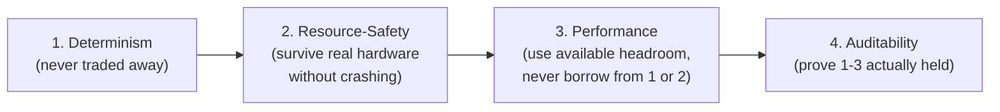
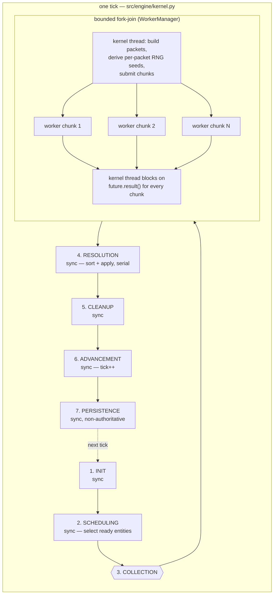
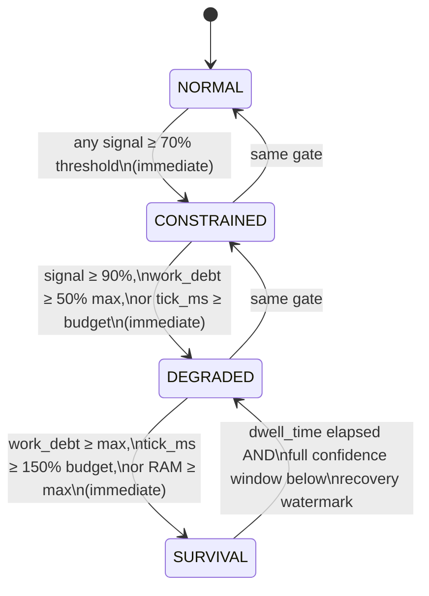

# Kernel Concurrency Model & Design Philosophy

## Purpose

The engine contracts define the *laws* concurrency and performance must obey. None of them
narrate the *model*: why the tick loop is synchronous while still running work in parallel, what
the engine is actually optimizing for when those laws trade off against each other, and how
"use the hardware" and "never break determinism" coexist under real load. This doc is that
missing narrative layer.

## Part 1 — Design Philosophy: what we're actually optimizing for

`docs/engine/project_lawbook_m10.md` lists five Architectural Pillars — Determinism,
Authoritative Apply, Bounded Resources, Hardware-Class Honesty, Observability Separation —
unordered, with performance appearing only as a constraint on Bounded Resources, never as a
goal in its own right. Reading `harness_architecture.md`'s Core Principles (Absolute Determinism
-> Resource Boundaries -> Auditability), `architecture.md`'s three Resource-Safe laws (Bounded
State, Non-Blocking Persistence, Progressive Degradation), and `certification_contract.md`'s
reporting law ("No modification of kernel laws for benchmark vanity") together implies one
consistent order: Determinism, then Resource-Safety, then Performance (only within what the
first two allow), then Auditability (proving the first three held). This ordering is implicit,
reconstructed from three documents plus code — it is not stated as a rule anywhere.



Every mechanism traced below is a specific engineering answer to one governing question: "How
do we use the hardware's available parallelism without ever letting *when* something ran change
*what* the outcome is?"

## Part 2 — The tick loop, with Collection expanded

The kernel (`src/engine/kernel.py`) executes 7 phases per tick: INIT, SCHEDULING, COLLECTION,
RESOLUTION, CLEANUP, ADVANCEMENT, PERSISTENCE. Only COLLECTION runs work in parallel; every other
phase is single-threaded. `_phase_collection()` dispatches work to a bounded thread/process pool
(`WorkerManager`, `ThreadPoolExecutor`/`ProcessPoolExecutor`) and blocks on `future.result()` for
every chunk before `_phase_resolution()` begins. That barrier is required by determinism, not a
missed optimization: `_phase_resolution()`'s first act is
`self._final_results.sort(key=lambda r: (r.class_priority, -r.local_priority, r.entity_id))` —
"same seed + same profile + same inputs => bit-identical state" requires applying every proposal
in one global, stable order, which requires having all of them before sorting any of them.



This is fork-join, not asyncio/anyio, because the Collection-phase workload (brain/action/
movement decision logic in `src/engine/domain_logic.py`, `worker_logic.py`) is CPU-bound, not
I/O-bound. asyncio's value is interleaving many idle-but-not-blocked tasks on one thread; CPU work
still needs `run_in_executor`/`to_thread.run_sync` underneath, i.e. the same thread/process pool
already in use. An event loop would add a scheduling layer for zero new capability, and
cooperative concurrency's safety model ("nothing mutates shared state across an `await` point")
is weaker than what's actually enforced (Part 3). `asyncio` does exist in this codebase, entirely
inside `src/api/ws/stream.py` — the FastAPI WebSocket layer streaming non-authoritative
observability events, on the explicitly non-authoritative side of the kernel contract's own state
classification.

## Part 3 — How Collection avoids race conditions

Three independent mechanisms:

1. State is structurally read-only, not read-only by convention. `EntityState.to_readonly()`
   converts entity properties to `ReadOnlyDict`, wounds/scars/inventory to tuples, equipment to
   `ReadOnlyDict`. Everything else workers can see (regions, resource nodes, buildings, terrain,
   groups, corpses, ground items) is `deep_freeze()`'d once in the kernel thread before dispatch
   and cached by object identity (`src/engine/executor.py`). Workers never hold a mutable
   reference to shared state.

2. The RNG is stateless per call. `DeterministicRNG.get_float/get_int/choice/...`
   (`src/platform/rng.py`) build a fresh `random.Random(composite_seed)` per call, seeded by a
   pure hash of `(base_seed, domain, tick, entity_id, sub_id)` — no shared generator to race, and
   results are order-independent regardless of which worker finishes first. The deprecated
   stateful twin (`next_float`/`next_int`) is unused anywhere in `src/`.

3. Output collisions are prevented structurally and validated twice ("Option A"). A worker's
   result set is filtered to `eid == packet.subject.id or eid == 0`
   (`src/engine/worker_logic.py:default_simulation_worker`). `ProtocolValidator`
   (`src/core/protocol_validator.py`) enforces "one work item per entity per tick" before
   dispatch and "no duplicate result per entity" after collection, raising
   `ProtocolViolationError` on conflict rather than silently merging it. Each pool chunk
   accumulates its own local result list; merging into the shared list happens only in the
   kernel thread, after every future has resolved. The one genuinely shared mutable object —
   `WorkerManager`'s inflight/active/peak counters — is protected by an explicit `threading.Lock`.

```mermaid
sequenceDiagram
    participant K as Kernel thread
    participant WM as WorkerManager
    participant T1 as Worker chunk (thread/process)
    participant T2 as Worker chunk (thread/process)

    K->>K: state.readonly_view()<br/>entities → ReadOnlyDict/tuples (to_readonly)
    K->>K: deep_freeze() regions, nodes,<br/>buildings, terrain, groups...
    K->>K: per-packet seed = composite_hash(base_seed, domain, tick, entity_id)
    K->>WM: execute_batch(packets)
    WM->>T1: chunk 1 (frozen packets)
    WM->>T2: chunk 2 (frozen packets)
    Note over T1,T2: each worker reads only immutable data;<br/>each accumulates its own local result list;<br/>result filtered to eid == subject.id or 0
    T1-->>WM: future.result() → local list 1
    T2-->>WM: future.result() → local list 2
    WM-->>K: merged results (kernel thread only)
    K->>K: ProtocolValidator: no duplicate entity results
```

Open question, now resolved (TCK-20260817-DOC-COLLECTION-RNG-CONSUMPTION, closed 2026-08-21, see
C7 above): no `rng.get_*` calls were found in `domain_logic.py`, `combat.py`, or `movement.py` —
the Collection-phase worker path consumes no randomness. This is no longer only an
absence-of-grep-match inference; a full trace confirmed it and is recorded at
`docs/engine/contracts/simulation_kernel_contract.md` §7.1.

## Part 4 — Performance under pressure

Performance is implemented as graceful, provable scope reduction — the direct expression of
"Progressive Degradation." Two control loops plus a hard backstop:

**Slow loop — RuntimeMode** (`src/engine/governor.py`): `ResourceGovernor.evaluate()` reads
`PressureSignals` every tick and walks NORMAL -> CONSTRAINED -> DEGRADED -> SURVIVAL. Escalation
is immediate on any threshold breach. Recovery requires a minimum dwell time *and* a full
confidence window of samples all below a watermark-scaled threshold, stepping down one level at
a time — deliberately slow and hysteresis-protected, so the engine doesn't flap between modes.



Each mode is a pre-composed policy bundle (`src/engine/policy.py`):

| | NORMAL | CONSTRAINED | DEGRADED | SURVIVAL |
|---|---|---|---|---|
| `concurrency_limit` | 1.0 | 1.0 | 0.5 | 0.25 |
| brain/strategic cadence | every 10 ticks | every 20 | every 50 | every 100 |
| `scan_policy` | FULL | THROTTLED | EXACT_DIRTY | EXACT_DIRTY |
| candidate/movement budget | 1000 | 500 | 200 | 50 |
| opportunistic work | allowed | allowed | off | off |
| replay richness | FULL | FULL | MINIMAL | off |

`concurrency_limit` goes *down* as pressure rises because everything else already shrank the
batch by then — fewer, less-contended workers on a smaller batch beats fighting for cores on an
already-stressed system. Open question, now resolved (TCK-20260817-DOC-CONCURRENCY-LIMIT-RATIONALE,
closed 2026-08-21, see C6 in the parent proposal): the full rationale is written down in
`GovernorPolicy.from_mode()`'s docstring (`src/engine/policy.py`) and
`docs/engine/contracts/bounded_concurrency_contract.md` §5.1 ("Why `concurrency_limit` Decreases as
`RuntimeMode` Escalates") — see that section for the mechanism rather than restating it here.

**Fast loop — PhaseBudgetGovernor** (`src/engine/phase_governor.py`): independent of mode, reacts
to *this tick's* measured phase costs (locomotion, final_integrity) and tightens budgets further
in real time, regardless of the mode's baseline.

**Scheduling shrinks demand before it's dispatched**: `DeterministicScheduler.select_work()`
(`src/engine/scheduler.py`) filters candidates via readiness gating, LOD
(`LODService.should_execute` — entities far from focus points skip), and cadence gating (brain/
strategy re-evaluation staggered per entity). A population spike means more entities competing
for the same bounded budget slots, not a proportionally larger per-tick workload.

**Hard backstop**: if Resolution runs long, `kernel.py` checks elapsed time every 10 results and,
past the hard cap, drops remaining results outright, records the drop, force-escalates to
DEGRADED, and fires a watchdog alert. Dropped work becomes an entry in
`state.work_debt[subsystem_id]` (`src/engine/apply.py:280` — a typed, durable, per-subsystem
ledger), drained later via low-priority `DRAIN_DEBT` items that always sort last in the
deterministic commit order, so backlog repayment never starves fresh critical work.
`work_debt_total >= max_work_debt` is itself one of the two hardest SURVIVAL triggers: "can't
keep up" means "shrink scope further," never "blow the budget."

## Part 5 — Benchmarking integrity

DEGRADED and SURVIVAL exist for unexpected runtime events. They must never be the mode a
performance claim was actually measured in. See C4 in the parent proposal for the full gap
analysis: `performance_contract.md`'s Scoped Claims dimensions omit `RuntimeMode`, and the live
CI gate (`tests/perf/test_perf_regression_baseline.py`) has no assertion that it stayed NORMAL
for every sampled tick — a real mechanism by which a benchmark could silently blend cheaper
degraded-mode ticks into a reported baseline and mask a genuine regression.

## Known documentation drift (see C2, C3, C8 in the parent proposal for follow-up)

1. Concurrency framing contradiction: `kernel.md` ("Concurrent" Collection) vs.
   `simulation_kernel_contract.md` §9 ("No concurrency or parallel execution").

**Update (TCK-20260817-FIX-CONCURRENCY-DOC-CONTRADICTION, closed 2026-08-21):** resolved — §9
was corrected to a narrower, accurate statement: concurrency is bounded to the COLLECTION phase
only, RESOLUTION applies all proposals through a single deterministic serial commit order;
kernel.md, simulation_kernel_contract.md, and bounded_concurrency_contract.md now agree.

2. Phase-count contradiction: `architecture.md`'s 6-phase framing vs. `kernel.md`/
   `simulation_kernel_contract.md`'s 7-phase framing.

**Update (TCK-20260817-FIX-PHASE-COUNT-CONTRADICTION, closed 2026-08-21):** resolved —
architecture.md's fabricated GOVERNANCE/PACKETIZATION table was corrected to the real 7-phase
list, the identical defect in docs/guides/simulation.md was also fixed, and the
xfail(strict=True) marker was removed from tests/docs/test_kernel_phase_names_consistent.py,
which now genuinely passes.

3. Hardware-class definition conflict (already self-flagged): `perf_baseline_policy.md` §2.2 vs.
   `certification_contract.md` §3, per `TCK-20260702-OBSISO-ISOLATION-PROOF`.

**Update (TCK-20260817-AUDIT-ENGINE-DOCS-DRIFT, closed 2026-08-21):** full audit recorded at
`docs/audits/D25_engine_docs_drift.md`, including a 4th newly-found item (architecture.md's
inverted hardware-class table) and 2 direct fixes (README.md, CLAUDE.md) folded in beyond this
list's original 3.

## References

- `src/engine/kernel.py`, `src/engine/executor.py`, `src/engine/worker_manager.py`,
  `src/engine/worker_logic.py`, `src/engine/scheduler.py`, `src/engine/governor.py`,
  `src/engine/phase_governor.py`, `src/engine/policy.py`
- `src/core/protocol_validator.py`, `src/platform/rng.py`, `src/core/state.py`
- `src/engine/apply.py:280`, `src/perf/long_run_harness.py:225`,
  `tests/perf/test_perf_regression_baseline.py`
- `docs/engine/project_lawbook_m10.md`, `docs/engine/architecture.md`, `docs/engine/kernel.md`,
  `docs/engine/governance_logic.md`, `docs/engine/runtime_profiles.md`
- `docs/engine/contracts/bounded_concurrency_contract.md`, `worker_contract.md`,
  `concurrent_integrity_contract.md`, `harness_architecture.md`, `certification_contract.md`,
  `simulation_kernel_contract.md`
- `docs/engine/performance_contract.md`, `docs/performance/perf_baseline_policy.md`
- `src/api/ws/stream.py`
