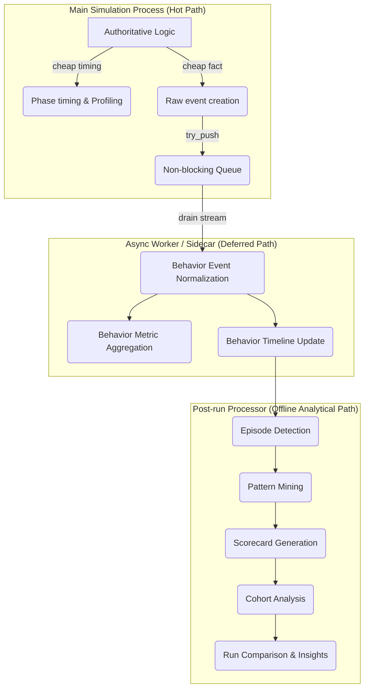

# Observability & Behavior Profiling Architectural Boundaries

This document defines the architectural boundaries, terminology, and operational pipeline separating **Runtime Profiling** from **Behavior Profiling** within the RPG Simulation Engine.

---

## 1. Core Rule & Principles

> [!IMPORTANT]
> **Correctness Invariance Rule**
> Simulation correctness and outcomes must be 100% identical whether observability is set to `OFF` or `ON`. Only generated artifacts, metrics, and diagnostics may differ.

1. **Performance profiling is first-class** and focuses on performance optimization.
2. **Behavior profiling is optional** and focuses on understanding entity behaviors, decision-making, and emergent properties.
3. **Heavy behavior processing is deferred** to async workers or post-run processors to keep the main engine hot path cheap and predictable.

---

## 2. Terminology Definitions

### Runtime Profiling
The measurement and analysis of execution performance, timing, memory utilization, and throughput of the simulation loop, individual ticks, and phases. Its primary goal is performance optimization.

### Raw Simulation Event
A cheap, raw fact or occurrence generated directly by systems during the hot path (e.g., `CombatDamageEvent`, `MovementEvent`). It contains minimal context and is cheap to emit.

### Behavior Event
A semantic layer mapped from raw simulation events representing an entity's actions in behavioral terms (e.g., `combat/engage`, `movement/travel`, `recovery/recover`).

### Behavior Timeline
A chronological sequence of behavioral events and states for a specific entity or region over time.

### Behavior Episode
A high-level behavioral segment grouping related events under a specific semantic context (e.g., a combat encounter or resource gathering run) with a start time, end time, and key outcomes.

### Behavior Metric
Aggregated performance or semantic counters/ratios characterizing behaviors over windows of ticks (e.g., movement-to-rest ratio, combat success rate).

### Behavior Finding
A detected anomaly or interesting behavior pattern of interest identified during analysis (e.g., "Entity got stuck in a movement loop").

### Behavior Insight
A high-level synthesized conclusion derived from multiple findings, metrics, and patterns (e.g., "The resource scarcity in Region A led to cooperative hunting behaviors").

### Scorecard
A post-run summarized evaluation report of an entity, cohort, or region across a set of behavioral dimensions (e.g., survivability, economic efficiency, cooperation cohesion).

### Run Comparison
A diff-like analytical comparison between two or more simulation runs (e.g., Baseline vs. Experiment) to evaluate the impact of rule changes, parameters, or environment modifications on agent behavior.

---

## 3. Structural Pipeline & Responsibilities

### Hot-Path Responsibilities
- Deterministic simulation loop execution.
- Cheap phase timing and resource profiling.
- Cheap raw event creation and queue appends.
- Bounded, in-memory tick timings.

### Async Worker/Sidecar Responsibilities
- Consuming raw events from the non-blocking queue.
- Reconstructing behavior event layers.
- Updating local behavioral timelines and rolling metric windows.

### Post-run / Offline Responsibilities
- Pattern mining, episodic analysis, and deep cohort modeling.
- Scorecard generation and run-to-run comparisons.
- Large JSON/YAML artifact serialization and database/warehouse ingestion.
