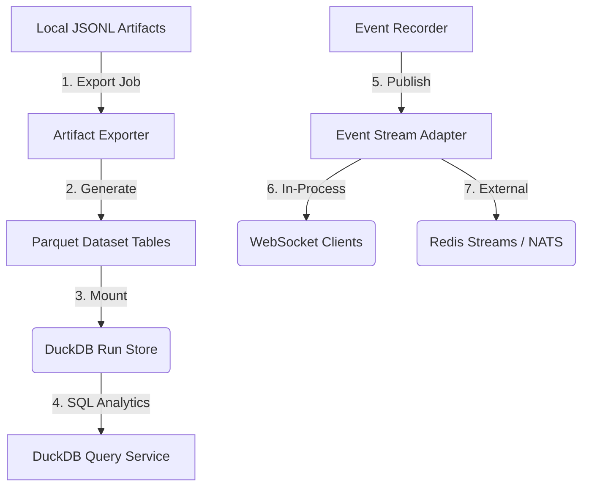

# Phase 6: Externalization and Scale Readiness

This document describes the architectural specifications, processing pipelines, and data layout introduced in **Phase 6: Externalization and Scale Readiness**. This phase established clear abstractions, analytical storage mappings, and stream adapter interfaces, preparing the Observatory for high-volume deployments while maintaining a simple, local-first default path.

---

## 1. Architectural Overview

Phase 6 decouples diagnostic storage and live transport from the engine process. It introduces an optional Parquet/DuckDB export path for high-performance multi-run query execution and a clean stream adapter boundary for out-of-process event distribution.



---

## 2. Standard Analytics Directory Layout

Exported analytical datasets are organized inside a dedicated local warehouse directory:

```text
data/analytics/<dataset_id>/
  ├── dataset_manifest.json          # Table schemas, file paths, and record counts
  ├── runs.parquet                   # High-level performance indices
  ├── metric_windows.parquet         # Statistical time-series aggregates
  ├── anomalies.parquet              # Behavioral violation logs
  └── simulation_events.parquet      # Raw event streams (payloads stored as JSON strings)
```

---

## 3. Core Subsystems

### 3.1 Storage Export Layer (`ArtifactExporter`)
Located in `src/observability/analytics/exporter.py`:
*   Supports single-run and multi-run sweep exports to `jsonl` or `parquet`.
*   **Dependency Protection**: Pyarrow is dynamically loaded. If Arrow dependencies are missing, the exporter reports a clear `ImportError` and skips the job rather than breaking the application startup sequence.
*   Writes a detailed `ExportManifest` detailing output file paths and record counts.

### 3.2 DuckDB Local Analytics Store (`DuckDBQueryService`)
Located in `src/observability/analytics/dataset.py` and `src/observability/analytics/query.py`:
*   Builds unified analytical datasets from local run set indices.
*   Maps clean relational schemas for `runs`, `metric_windows`, and `anomalies`.
*   **Schema Safety**: Stores complex, dynamic event properties as an un-flattened `payload_json` string, ensuring zero schema breakages from new game event types.
*   Provides fast, serverless predefined SQL query execution (`worst-runs`, `anomaly-summary`, `run-metric-trend`).

### 3.3 Event Stream Adapter Interface (`EventStreamAdapter`)
Located in `src/observability/stream/base.py`:
*   Defines abstract streaming methods: `publish(event)`, `publish_batch(events)`, `health()`, `flush()`, and `close()`.
*   Shields the core `EventRecorder` from direct database or network dependencies, utilizing a clean dependency-injection adapter pattern.

### 3.4 Retention and Data Lifecycle Manager (`RetentionManager`)
Located in `src/observability/reporting/retention_manager.py`:
*   Enforces configurable limits on run sets (e.g., maximum run directories, retention age in days, disk space quotas).
*   Prevents locally compiled run histories from exhausting disk space during continuous CI sweeps.

---

## 4. CLI Access Layer

Developers can execute analytics pipelines directly from the terminal:

```bash
# Export a single completed run to Parquet
rpg-observe export <run_id> --format parquet

# Compile a multi-run sweep into a DuckDB-ready dataset
rpg-observe build-dataset <sweep_id>

# Run predefined SQL analytics on a dataset
rpg-observe query-dataset <dataset_id> --query worst-runs
rpg-observe query-dataset <dataset_id> --query anomaly-summary
```

---

## 5. Verification Command Checklist

Developers can run local tests to verify externalization and local SQL database pipelines:
```bash
# Run exporter and schema serialization tests
pytest tests/unit/observability/test_artifact_exporter.py

# Run DuckDB query and dataset builder tests
pytest tests/unit/observability/test_parquet_dataset_builder.py -m "not slow"
pytest tests/unit/observability/test_duckdb_query_service.py
```
