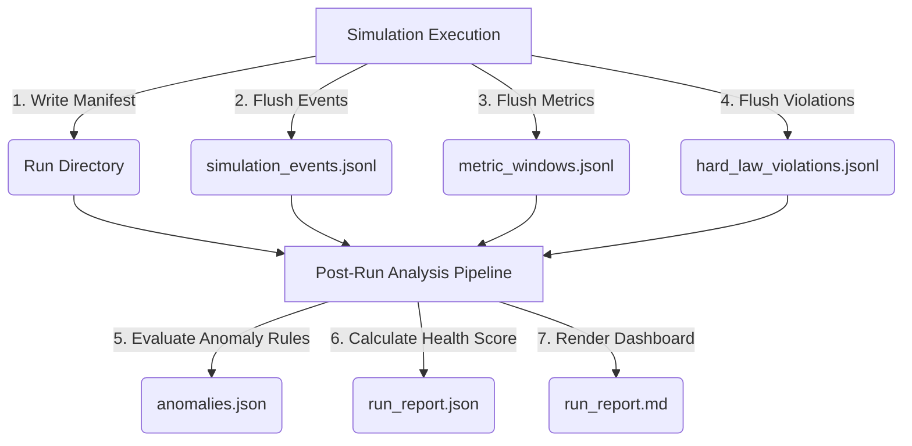

# Phase 3: Single-Run Observatory Processing Pipeline

This document describes the architectural specifications, processing pipelines, and data layout introduced in **Phase 3: Single-Run Observatory processing pipeline**. This phase established the unified post-run diagnostic orchestration layer, enabling transition from raw metrics and standard log formats to decoupled behavioral analysis.

---

## 1. Architectural Overview

Phase 3 introduces a fully offline, post-run processing model. The design strictly isolates simulation runtime execution from diagnostic logic, guaranteeing **zero tick performance overhead** while outputting descriptive run reports.



---

## 2. Standard Run Artifact Layout

To ensure robust reproducibility, every simulation run compiles its results inside a dedicated repository directory structured as follows:

```text
data/runs/<run_id>/
  ├── run_manifest.json          # Complete execution metadata & environment info
  ├── simulation_events.jsonl    # Line-separated semantic event envelopes
  ├── metric_windows.jsonl       # Bounded rolling time-series window aggregates
  ├── hard_law_violations.jsonl  # Invariant monitor failure streams (if any)
  ├── anomalies.json             # Post-hoc rule evaluation output detections
  ├── run_report.json            # Machine-readable health score & aggregated metrics
  └── run_report.md              # Premium-grade developer diagnostic dashboard
```

> [!NOTE]
> All files in `data/runs/` are fully decoupled from version control using updated `.gitignore` rules, ensuring transient diagnostic data is not committed to git.

---

## 3. Core Subsystems

### 3.1 Run Artifact Repository (`RunArtifactRepository`)
Located in `src/observability/reporting/run_repository.py`, the repository:
*   Enforces the standard directory contract based on a unique `run_id`.
*   Writes a Pydantic-validated `RunManifest` holding details like scenario name, seed, observability mode, started/ended timestamps, tick completions, and status states (`CREATED`, `RUNNING`, `COMPLETED`, `FAILED`, `ANALYZED`, `REPORT_GENERATED`).
*   Implements transactional, safe, and append-only writers for standard JSONL streams.

### 3.2 Metric Window Recorder (`MetricWindowRecorder`)
Located in `src/observability/reporting/metric_recorder.py`, this component accumulates per-tick in-memory snapshots and flushes aggregated windows every $N$ ticks (typically 100 and 1000):
*   Calculates statistical distributions (avg, max) for entities, gold, memory RSS.
*   Computes accurate **p95 tick latency** and compute-time distributions.
*   Employs a zero-lock, memory-bounded accumulator, introducing near-zero compute impact.

### 3.3 Rule Engine and Anomaly Post-Run Analyzer
Located in `src/observability/anomaly/rules.py` and `post_run_analyzer.py`, this module evaluates the completed run against five primary behavioral rules:
1.  `HardLawViolationRule`: Direct violations of physical/simulation invariants.
2.  `NavigationStuckRule`: Detecting loops, blocked tiles, or zero-mobility sectors.
3.  `QuestStalledRule`: High quest latency or uncompletable paths.
4.  `CombatNeverEndsRule`: Infinite combat engagement lockups between factions.
5.  `ResourceNodeCrowdingRule`: Bottlenecks and worker queue congestion.

---

## 4. Single-Run Executive Report and Health Score

Upon pipeline completion, a unified `run_report.py` summarizes run health. The dashboard calculates a **weighted Health Score** starting at 100:

| Anomaly Severity | Penalty Deduct | Example Triggers |
| :--- | :--- | :--- |
| **Critical** | `-40` | Hard law invariant failures |
| **Error** | `-15` | Stuck entities, infinite combat loops |
| **Warning** | `-5` | Resource crowding, stalled quests |

The markdown report (`run_report.md`) formats this into a beautiful developer command dashboard displaying system alerts, anomalies by severity, and next-step actions.

---

## 5. Verification Command Checklist

Developers can run local tests to verify single-run processing contract:
```bash
# Run run repository and manifest validation tests
pytest tests/unit/observability/test_run_artifact_repository.py

# Run metric windows verification tests
pytest tests/unit/observability/test_metric_window_recorder.py
```
