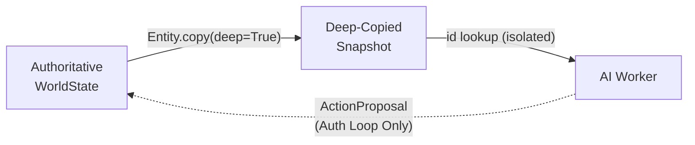

# Design Spec: AOA Runtime Hardening (TCK-20260331)

## Overview
This specification addresses the "split-brain" vulnerability in the simulation's runtime by enforcing strict Aspect-Oriented Architecture (AOA) boundaries between authoritative world state and read-only AI sensing data.

The goal is to move from **shared mutable aspect memory** to **absolute snapshot isolation**.

## Core Components

### 1. Entity Deep Isolation
- **Mechanism**: The `Entity.copy()` method will be refactored to perform a recursive deep copy via Pydantic's `model_copy(deep=True)`.
- **Reasoning**: Currently, `Entity.copy()` only performs a shallow copy of aspects, meaning fields like `MindAspect.pos_history` (a list) or `InventoryAspect.items` are shared between the live world and the snapshot. If a worker were to mutate these lists during the AI decision phase, the world state would be corrupted before conflict resolution.
- **Clean Code Principle**: "No Side Effects" — the entity snapshot must be truly side-effect free.

### 2. Worker-Actor Resolution
- **Mechanism**: The `WorkerPool._dispatch_inline` method will be refactored to lookup the acting entity from the `Snapshot` instead of accepting a list of live `Entity` objects.
- **Trade-off**: This adds a dictionary lookup per entity per tick, but ensures workers only see the snapshot view of themselves.
- **Logic**:
  ```python
  snapshot_actor = snapshot.entities.get(entity.id)
  if snapshot_actor:
      self._think(snapshot_actor, snapshot) # Worker now only sees the snapshot version!
  ```

### 3. Verification & Safety Gate
- **Mutation-Safety Test**: A new integration test `tests/integration/test_snapshot_safety.py` will verify that manual mutation of snapshot aspects cannot affect the source entities in `WorldState`.
- **TPS Monitoring**: Performance will be monitored to ensures TPS stays > 10. If Pydantic's recursive `deepcopy` is too slow, we will pivot to a manual slots-based copy.

## Data Flow


## Status
APPROVED (via Brainstorming)
