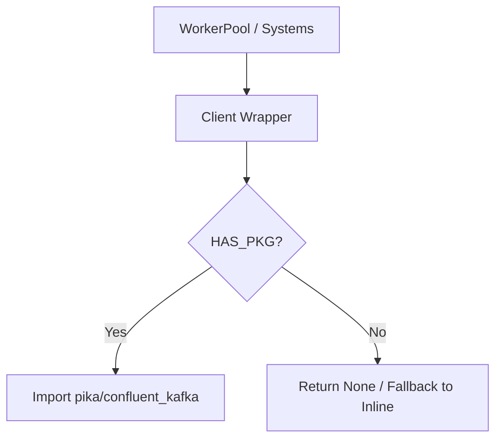

# Design Specification: Trust Boundary & Infrastructure Remediation

**Date**: 2026-04-13
**Status**: DRAFT
**Track**: Cross-Cutting Remediation (Strategic implementation Updated Plan)

---

## 1. Problem Statement

The simulation engine currently suffers from **infrastructure leakage**. External dependencies (RabbitMQ/Kafka) are imported at the top level of core simulation modules. This prevents deterministic test collection and execution in environments without these brokers installed. Additionally, regression tests rely on an external helper script (`scripts.test_harness`) instead of the canonical `HeadlessRunner`.

## 2. Goals

- **Runtime Isolation**: Ensure the engine can collect and execute without RabbitMQ or Kafka clients installed.
- **Portability**: Eliminate dependencies on non-source-tree helper scripts in tests.
- **Observability**: Standardize on `HeadlessRunner` as the single truth for regression artifacts.

---

## 3. Architecture & Data Flow

### 3.1 Lazy Import Pattern
We will adopt the "Lazy Package Wrapper" pattern used by the existing Redis client.

### 3.2 Canonical Regression Path
Tests will migrate from the procedural `run_harness` to the object-oriented `HeadlessRunner`.

---

## 4. Components & Implementation Details

### 4.1 RabbitMQ Isolation (`src/api/rabbitmq_client.py`)
- Guard imports with `try/except ImportError`.
- `_connection` type hint should use `TYPE_CHECKING`.
- `get_rabbitmq()` must check `is_rabbitmq_disabled()` AND `HAS_PIKA`.

### 4.2 Kafka Isolation (`src/api/kafka_client.py`)
- Guard imports for `Producer`, `Consumer`, `AdminClient`.
- Topics initialization should be skipped if `HAS_KAFKA` is false.

### 4.3 WorkerPool Cleanup (`src/engine/worker_pool.py`)
- Remove top-level `import pika`.
- Lazy-import `pika` methods only when `num_workers > 1`.
- Ensure type annotations for `_channel` are string-quoted or use `TYPE_CHECKING`.

### 4.4 Test Harness Migration (`tests/integration/strategy/test_strategic_determinism.py`)
- Replace `scripts.test_harness` with `src.testing.headless_regression_runner.HeadlessRunner`.
- Assertions must be updated to handle the `RunResult` dataclass.

### 4.5 Cleanup
- Delete `scripts/test_harness.py` once all dependent tests have been migrated.

---

## 5. Error Handling & Edge Cases

- **Missing Package**: If a user tries to run with `num_workers > 1` but `pika` is missing, the engine should emit a clear `CRITICAL` log and fall back to `num_workers = 1` if possible, or halt safely.
- **Broken Connection**: Existing retry logic in `get_rabbitmq()` must be preserved.

---

## 6. Testing & Success Criteria

### 6.1 Success Criteria
- `pytest tests/integration/strategy/test_strategic_determinism.py` passes.
- `PYTHONPATH=. pytest --collect-only` does not trigger `ImportError`.
- No files in `src/` import `pika` or `confluent_kafka` at module scope.

### 6.2 Manual Verification
- Temporarily rename `pika` folder in `path` (if possible) or use a mock to verify the `ImportError` is swallowed.
- Verify `logs/regression/` contains valid `manifest.json` and `replay.json` after running the new tests.
