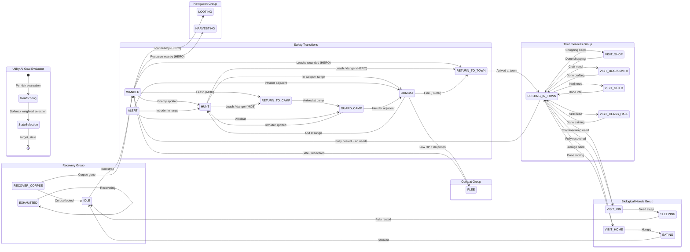
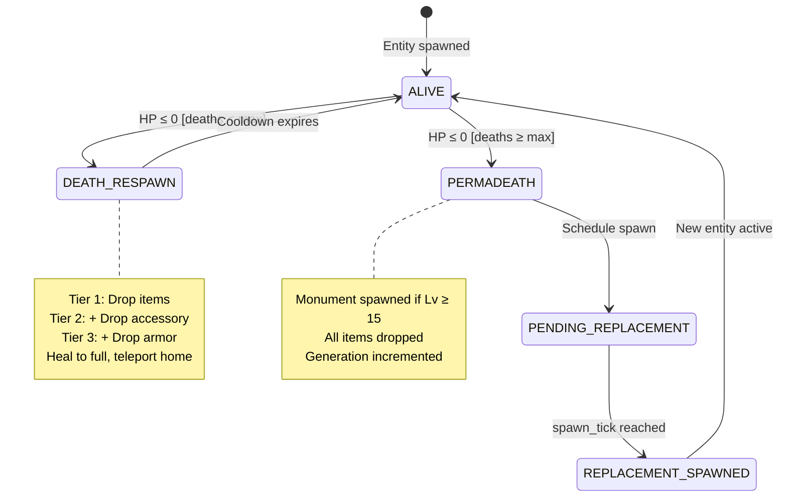
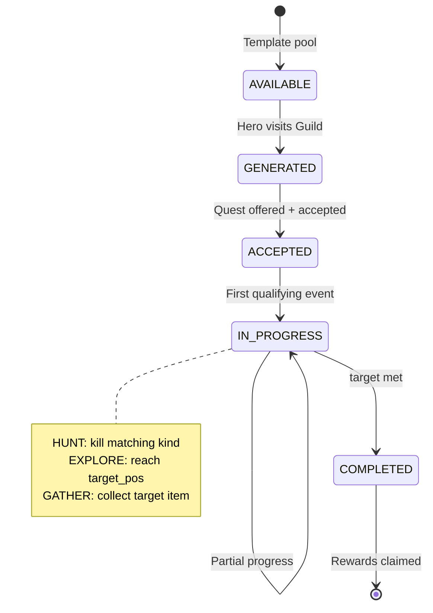
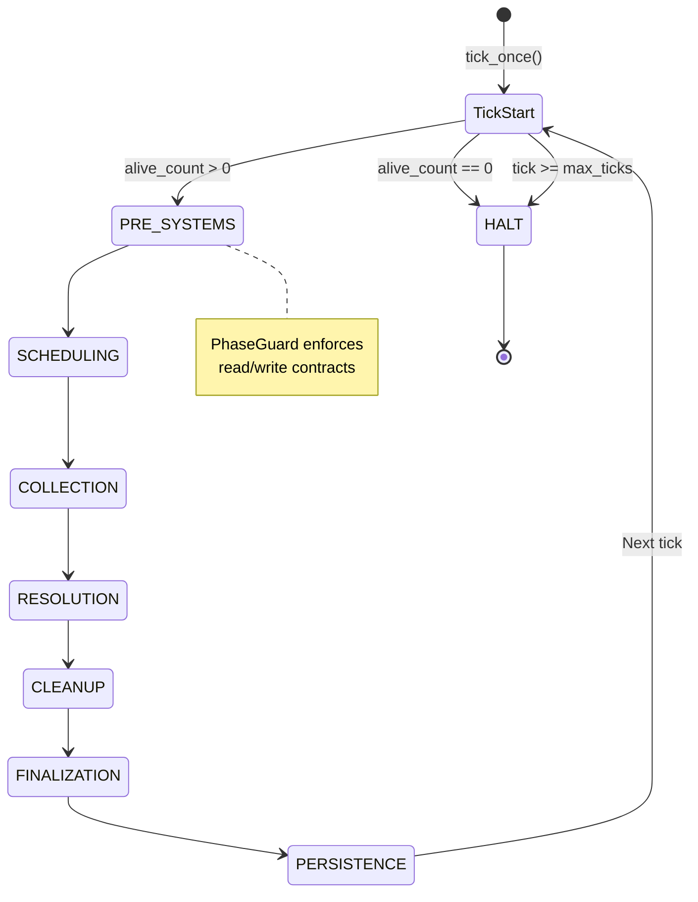
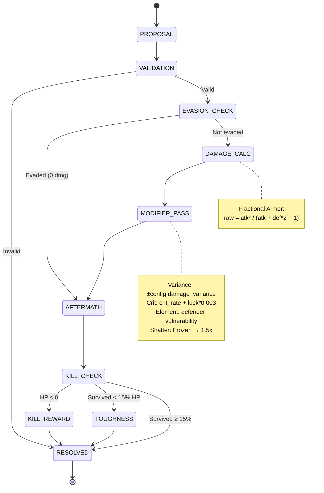

> [!WARNING]
> **ARCHIVED 2026-08-10 — `TCK-20260809-STALE-DOCS-AI-BRAIN-ARCHITECTURE-AUDIT`.** Every section
> below describes an architecture (`AIBrain`, `STATE_HANDLERS`, `HeroLifecycleSystem`, `WorldLoop`,
> `PhaseGuard`, `EngineContext`, `CombatAction`, `DamageResolutionService`) that does not exist
> anywhere in the current `src/` tree — confirmed via direct `grep`/`find`, not assumed. Real,
> current documentation for the same ground:
> - §1 Entity AI Behavioral FSM → `docs/engine/contracts/tactical_contract.md` (tactical decisions),
>   `docs/systems/strategic_cognition.md` (strategic layer)
> - §2 Hero Lifecycle FSM → `docs/simulation/lifecycle_systems_contract.md`
> - §3 Quest Lifecycle FSM → `docs/simulation/quest_contract.md`
> - §4 Engine Tick Cycle FSM → `docs/engine/kernel.md`
> - §5 Combat Engagement FSM → `docs/mechanics/02_combat_laws.md`,
>   `docs/mechanics/damage_formula_contract.md`, `docs/engine/contracts/minimal_kernel.md`
>
> Kept for historical reference only — do not treat anything below as current.

# RPG Simulation — Formal State Machine Specifications

> **Generated from codebase analysis** — `src/ai/states/`, `src/ai/brain.py`, `src/ai/goals/`, `src/systems/`, `src/engine/`, `src/core/models/enums.py`

---

## Table of Contents

1. [Entity AI Behavioral FSM](#1-entity-ai-behavioral-fsm)
2. [Hero Lifecycle FSM](#2-hero-lifecycle-fsm)
3. [Quest Lifecycle FSM](#3-quest-lifecycle-fsm)
4. [Engine Tick Cycle FSM](#4-engine-tick-cycle-fsm)
5. [Combat Engagement FSM](#5-combat-engagement-fsm)

---

## 1. Entity AI Behavioral FSM

### 1.1 Architecture Summary

The core AI decision engine is a **Utility-AI-gated Finite State Machine** with **23 states** and **20 registered state handlers**. The architecture is split into two layers:

- **Deliberation Layer** (`AIBrain._deliberation_tactical_phase`): A Utility AI Goal Evaluator (`GoalEvaluator`) scores 12 `GoalType` options against the entity's personality, motives, emotions, biological needs, memories, and social bonds. The winning goal maps to a `target_state` (AIState), which is the **requested** state.
- **Execution Layer** (`STATE_HANDLERS`): Each AIState has a `StateHandler.handle()` that returns a `(new_state, ActionProposal)` tuple. The handler may **override** the deliberation layer's state choice based on real-time tactical conditions (e.g., enemy proximity, HP threshold, leash range).

This dual-layer design means transitions are **not purely graph-driven** — the Utility AI proposes a destination, but the handler can redirect based on ground truth.

**Entity Roles** determine which states are reachable:
- **HERO** (Faction: `HERO_GUILD`): Full state set including all town-building interactions, biological needs, and corpse recovery.
- **MOB** (Faction: `GOBLIN_HORDE`, `WOLF_PACK`, etc.): Combat-oriented subset — `IDLE`, `WANDER`, `HUNT`, `COMBAT`, `FLEE`, `ALERT`, `GUARD_CAMP`, `RETURN_TO_CAMP`, `LOOTING`, `EXHAUSTED`.
- **WORLD_BOSS**: Simplified aggressive loop — `IDLE`, `WANDER`, `HUNT`, `COMBAT`, `GUARD_CAMP`.

**Cognitive Pipeline** (per-tick, per-entity):
1. **Sensory/Perception Phase** — Gather visible entities, apply selective attention, update beliefs.
2. **Memory/Appraisal Phase** — Decay stale beliefs, update emotions, calculate social/personality biases.
3. **Deliberation/Tactical Phase** — Score goals via Utility AI, select target state.
4. **Finalization/Output Phase** — Dispatch to state handler, produce `ActionProposal`.

### 1.2 State Table

| # | State | Purpose | Entry Actions | Exit Actions | Invariants |
|---|-------|---------|---------------|--------------|------------|
| 0 | **IDLE** | Bootstrap/initialization state | None | Clean dead memories | Always transitions out on first tick |
| 1 | **WANDER** | Exploration & opportunistic detection | Scan for loot, resources, enemies | Reset loot progress | Actor is alive; no locked combat target |
| 2 | **HUNT** | Chase a detected enemy to close distance | Increment `chase_ticks`; path toward target | Reset `chase_ticks` on engagement | Enemy must exist in memory or vision |
| 3 | **COMBAT** | Active melee/ranged engagement | Sync `combat_target_id` on both combatants | Clear combat target | Adjacent to or in range of valid target |
| 4 | **FLEE** | Retreat from danger when HP/threat threshold exceeded | Propose move away from nearest enemy | Reset `chase_ticks`; clear panic | `should_flee()` returned True |
| 5 | **RETURN_TO_TOWN** | Navigate back to home town position | Path toward `home_pos` | None | Actor is a HERO with `home_pos` set |
| 6 | **RESTING_IN_TOWN** | Heal and decide on town activities | Passive HP regeneration | None | Actor is standing on a TOWN tile |
| 7 | **RETURN_TO_CAMP** | Navigate back to nearest camp | Path toward camp; passive heal en route | None | Actor is a MOB with a known camp |
| 8 | **GUARD_CAMP** | Patrol camp perimeter; intercept intruders | Random patrol movement within `camp_radius` | None | Actor is within `camp_radius + 1` of camp |
| 9 | **LOOTING** | Pick up ground items with channeled progress bar | Increment `loot_progress` per tick | Reset `loot_progress` to 0 | Ground items exist at or near position |
| 10 | **ALERT** | Emergency response to territory intrusion | Scan for nearest enemy | None | Enemy detected within camp territory |
| 11 | **VISIT_SHOP** | Navigate to store; sell/buy items | Move to store building | Return to RESTING_IN_TOWN | Actor can use buildings (`EntityRole.HERO/NPC`) |
| 12 | **VISIT_BLACKSMITH** | Learn recipes; craft items | Move to blacksmith; learn recipes on first visit | Return to RESTING_IN_TOWN or WANDER | Actor can use buildings |
| 13 | **VISIT_GUILD** | Gather intel; accept quests | Move to guild; reveal camp/resource locations | Return to RESTING_IN_TOWN | Actor can use buildings |
| 14 | **HARVESTING** | Channel resource node extraction | Increment `loot_progress`; stand on node | Reset `loot_progress` | Resource node is available at position |
| 15 | **VISIT_CLASS_HALL** | Learn class skills; breakthrough | Move to class hall | Return to RESTING_IN_TOWN | Actor has a valid `HeroClass` |
| 16 | **VISIT_INN** | Rest and recover stamina/sleep | Move to inn building | Return to RESTING_IN_TOWN | Actor has stamina deficit or sleep debt |
| 17 | **VISIT_HOME** | Manage home storage; eat | Move to `home_pos` | Return to RESTING_IN_TOWN | Actor has `home_storage` |
| 18 | **RAID** | Coordinated faction assault (reserved) | — | — | Currently unused placeholder |
| 19 | **EXHAUSTED** | Stamina recovery state | REST action only | — | Stamina is depleted |
| 20 | **RECOVER_CORPSE** | Navigate to own corpse for item recovery | Path toward corpse node | Loot corpse → IDLE | Corpse node exists for this entity |
| 21 | **SLEEPING** | Biological sleep recovery | `is_sleeping = True` | `is_sleeping = False` | `sleep_debt > 0.05` |
| 22 | **EATING** | Biological hunger satisfaction | EAT action with hunger reduction | None | `hunger_level > 0.1` |

### 1.3 Transition Table

| # | Source | Target | Trigger / Event | Guard Condition | Action / Effect | Priority |
|---|--------|--------|-----------------|-----------------|-----------------|----------|
| 1 | IDLE | WANDER | Tick fires | Always (bootstrap) | Clean dead memories | — |
| 2 | WANDER | RETURN_TO_TOWN | Leash check | `beyond_leash(actor)` and HERO | Path toward `home_pos` | 1 (highest) |
| 3 | WANDER | RETURN_TO_CAMP | Leash check | `beyond_leash(actor)` and MOB | Path toward camp | 1 |
| 4 | WANDER | FLEE | Leash check | `beyond_leash(actor)` and no home/camp | Move away from enemy | 1 |
| 5 | WANDER | RETURN_TO_TOWN | Town aura | `is_in_hostile_town()` and (HP < 0.6 or no enemy) | Retreat home | 2 |
| 6 | WANDER | RETURN_TO_TOWN | Enemy territory + wounded | `is_on_enemy_territory()` and HP < 0.8 | Retreat home | 3 |
| 7 | WANDER | RETURN_TO_TOWN | Wounded | HP < 0.7 and `home_pos` exists | Retreat home | 4 |
| 8 | WANDER | LOOTING | Loot detected | HERO, ground loot within radius=4, at loot position | LOOT action | 5 |
| 9 | WANDER | LOOTING | Loot detected | HERO, ground loot within radius=4, not at position | Move toward loot | 5 |
| 10 | WANDER | HARVESTING | Resource detected | HERO, resource within radius=5, at resource | HARVEST action | 6 |
| 11 | WANDER | HARVESTING | Resource detected | HERO, resource within radius=5, not at resource | Move toward resource | 6 |
| 12 | WANDER | COMBAT | Enemy adjacent + skill ready | Enemy in weapon range, skill available | USE_SKILL action | 7 |
| 13 | WANDER | COMBAT | Enemy adjacent | Enemy in weapon range, no skill | ATTACK action | 7 |
| 14 | WANDER | HUNT | Enemy visible | Enemy beyond weapon range | Move toward enemy | 8 |
| 15 | WANDER | RETURN_TO_TOWN | Should flee | `should_flee(actor, config)` | Retreat home | 7 |
| 16 | WANDER | HUNT | Memory recall | HERO Lv≥3, remembered enemy > 3 tiles away | Move toward memory | 9 |
| 17 | WANDER | WANDER | Frontier explore | Frontier tile found | Move toward frontier | 10 |
| 18 | WANDER | WANDER | Random walk | Tile passable | MOVE to random neighbor | 11 |
| 19 | WANDER | WANDER | Blocked | No passable tile | REST | 12 |
| 20 | HUNT | RETURN_TO_TOWN | Leash exceeded | `beyond_leash(actor, chase_mult)` and HERO | Retreat home | 1 |
| 21 | HUNT | RETURN_TO_CAMP | Leash exceeded | `beyond_leash(actor, chase_mult)` and MOB | Retreat home | 1 |
| 22 | HUNT | RETURN_TO_TOWN | Chase timeout | `chase_ticks >= config.mob_chase_give_up_ticks` | Retreat home | 2 |
| 23 | HUNT | WANDER | Target gone (at last pos) | No enemy, memory exists, at memory pos | REST; clear memory entry; reset chase | 3 |
| 24 | HUNT | HUNT | Memory pursuit | No enemy visible, memory exists, not at pos | Move toward memory pos; increment chase | 3 |
| 25 | HUNT | WANDER | Lost target | No enemy, no memory | REST; reset chase | 4 |
| 26 | HUNT | RETURN_TO_TOWN | Flee check | `should_flee(actor, config, enemy)` and HERO | Retreat home | 5 |
| 27 | HUNT | COMBAT | Skill-range engagement | Enemy dist ≤ weapon_range + 2, skill ready | USE_SKILL; reset chase | 6 |
| 28 | HUNT | COMBAT | Melee engagement | Enemy dist ≤ weapon_range | ATTACK; reset chase | 7 |
| 29 | HUNT | HUNT | Anti-deadlock yield | dist=2, both hunting, actor.id > enemy.id | REST (yield) | 8 |
| 30 | HUNT | HUNT | Skirmish (kiting) | Tactical hint `skirmish` and dist < `min_dist` | Move away (kite) | 8 |
| 31 | HUNT | HUNT | Close distance | Otherwise | Move toward enemy; increment chase | 9 |
| 32 | COMBAT | WANDER | Target lost | No enemy visible | REST | 1 |
| 33 | COMBAT | COMBAT | Potion use | `should_flee()` and potion available | USE_ITEM (potion) | 2 |
| 34 | COMBAT | RETURN_TO_TOWN | Flee | `should_flee()` and no potion, HERO | Retreat home | 2 |
| 35 | COMBAT | FLEE | Flee | `should_flee()` and no potion, no home | Move away | 2 |
| 36 | COMBAT | COMBAT | Skill use | Skill ready, enemy in range | USE_SKILL | 3 |
| 37 | COMBAT | COMBAT | Support ally | Tactical hint `support_target_id` | USE_SKILL or move to ally | 4 |
| 38 | COMBAT | COMBAT | Basic attack | Enemy in weapon range | ATTACK | 5 |
| 39 | COMBAT | COMBAT | Skirmish reposition | Tactical hint `skirmish`, too close | Move away | 5 |
| 40 | COMBAT | HUNT | Out of range | Enemy dist > weapon_range | Move toward enemy | 6 |
| 41 | FLEE | WANDER | Safety recovered | No enemy visible | REST; reset chase ticks | 1 |
| 42 | FLEE | FLEE | Continue fleeing | Enemy still visible | Move away from enemy | 2 |
| 43 | ALERT | COMBAT | Intruder adjacent | Enemy dist ≤ 1 | ATTACK | 1 |
| 44 | ALERT | HUNT | Intruder in range | Enemy detected, dist > 1 | Move toward enemy | 2 |
| 45 | ALERT | GUARD_CAMP | Stand down | No enemy, on home territory | REST | 3 |
| 46 | ALERT | RETURN_TO_TOWN | Stand down (HERO) | No enemy, not on home territory, HERO | Retreat home | 4 |
| 47 | ALERT | RETURN_TO_CAMP | Stand down (MOB) | No enemy, not on home territory, MOB | Retreat to camp | 4 |
| 48 | GUARD_CAMP | COMBAT | Intruder adjacent | Enemy dist ≤ 1 | ATTACK | 1 |
| 49 | GUARD_CAMP | HUNT | Intruder in chase range | Enemy dist ≤ chase_range | Move toward enemy | 2 |
| 50 | GUARD_CAMP | GUARD_CAMP | Return to camp | dist_to_camp > camp_radius + 1 | Move toward camp | 3 |
| 51 | GUARD_CAMP | GUARD_CAMP | Patrol | Random direction, passable | MOVE | 4 |
| 52 | GUARD_CAMP | GUARD_CAMP | Patrol blocked | Not passable | REST | 5 |
| 53 | RETURN_TO_TOWN | RESTING_IN_TOWN | Arrived | `is_in_town(actor)` | REST | 1 |
| 54 | RETURN_TO_TOWN | RETURN_TO_TOWN | En route | `home_pos` exists, not in town | Move toward `home_pos` | 2 |
| 55 | RETURN_TO_TOWN | WANDER | No town | No `home_pos` | REST | 3 |
| 56 | RETURN_TO_CAMP | GUARD_CAMP | Arrived | `is_in_camp(actor)` | REST; heal; reset chase | 1 |
| 57 | RETURN_TO_CAMP | RETURN_TO_CAMP | En route | Camp exists, not in camp | Move toward camp; heal | 2 |
| 58 | RETURN_TO_CAMP | WANDER | No camp | No camp found | REST | 3 |
| 59 | RESTING_IN_TOWN | RESTING_IN_TOWN | Healing | HP < max_HP | REST | 1 |
| 60 | RESTING_IN_TOWN | VISIT_SHOP | Shopping need | Fully healed, `hero_wants_to_buy()` or sellable items | Move to store | 2 |
| 61 | RESTING_IN_TOWN | VISIT_BLACKSMITH | Craft need | `hero_should_visit_blacksmith()` | Move to blacksmith | 3 |
| 62 | RESTING_IN_TOWN | VISIT_GUILD | Intel need | `hero_should_visit_guild()` | Move to guild | 4 |
| 63 | RESTING_IN_TOWN | VISIT_CLASS_HALL | Skill need | `hero_should_visit_class_hall()` | Move to class hall | 5 |
| 64 | RESTING_IN_TOWN | VISIT_HOME | Storage need | `hero_should_visit_home()` | Move to home | 6 |
| 65 | RESTING_IN_TOWN | VISIT_INN | Stamina/sleep need | `hero_should_visit_inn()` | Move to inn | 7 |
| 66 | RESTING_IN_TOWN | WANDER | Fully recovered | HP = max_HP, no needs | REST → leave town | 8 |
| 67 | VISIT_SHOP | WANDER | Cannot use buildings | `!can_use_buildings(actor)` | REST | 1 |
| 68 | VISIT_SHOP | WANDER | No store | Store building not found | REST | 2 |
| 69 | VISIT_SHOP | VISIT_SHOP | Walking to store | Not at store position | Move toward store | 3 |
| 70 | VISIT_SHOP | VISIT_SHOP | Selling | At store, sellable items | REST + sell items | 4 |
| 71 | VISIT_SHOP | VISIT_SHOP | Buying | At store, want to buy | REST + buy item | 5 |
| 72 | VISIT_SHOP | RESTING_IN_TOWN | Done shopping | Nothing to sell/buy | REST | 6 |
| 73 | VISIT_BLACKSMITH | WANDER | Cannot use buildings | `!can_use_buildings(actor)` | REST | 1 |
| 74 | VISIT_BLACKSMITH | WANDER | No blacksmith | Building not found | REST | 2 |
| 75 | VISIT_BLACKSMITH | VISIT_BLACKSMITH | Walking | Not at blacksmith position | Move toward blacksmith | 3 |
| 76 | VISIT_BLACKSMITH | VISIT_BLACKSMITH | Learn recipes | At blacksmith, no known recipes | REST + learn all recipes | 4 |
| 77 | VISIT_BLACKSMITH | VISIT_BLACKSMITH | Crafting | `craft_target` set, can craft | REST + craft item | 5 |
| 78 | VISIT_BLACKSMITH | WANDER | Need materials | `craft_target` set, cannot craft | REST → go gather | 6 |
| 79 | VISIT_BLACKSMITH | RESTING_IN_TOWN | Nothing to craft | No craft target | REST | 7 |
| 80 | VISIT_GUILD | WANDER | Cannot use buildings | `!can_use_buildings(actor)` | REST | 1 |
| 81 | VISIT_GUILD | WANDER | No guild | Building not found | REST | 2 |
| 82 | VISIT_GUILD | VISIT_GUILD | Walking | Not at guild position | Move toward guild | 3 |
| 83 | VISIT_GUILD | VISIT_GUILD | Reveal intel | At guild, unrevealed camps/resources | REST + reveal terrain | 4 |
| 84 | VISIT_GUILD | VISIT_GUILD | Accept quest | At guild, quest slot available | REST + add quest | 5 |
| 85 | VISIT_GUILD | VISIT_GUILD | Material tips | Guild tips available | REST + add goals | 6 |
| 86 | VISIT_GUILD | RESTING_IN_TOWN | Done | No more intel | REST | 7 |
| 87 | VISIT_CLASS_HALL | WANDER | Cannot use buildings | `!can_use_buildings(actor)` | REST | 1 |
| 88 | VISIT_CLASS_HALL | WANDER | No class hall | Building not found | REST | 2 |
| 89 | VISIT_CLASS_HALL | VISIT_CLASS_HALL | Walking | Not at class hall | Move toward class hall | 3 |
| 90 | VISIT_CLASS_HALL | VISIT_CLASS_HALL | Learn skill | Skill available + affordable | REST + learn skill | 4 |
| 91 | VISIT_CLASS_HALL | VISIT_CLASS_HALL | Breakthrough | Can breakthrough | REST + class upgrade | 5 |
| 92 | VISIT_CLASS_HALL | RESTING_IN_TOWN | Done | No skills/breakthrough available | REST | 6 |
| 93 | VISIT_INN | WANDER | Cannot use buildings | `!can_use_buildings(actor)` | REST | 1 |
| 94 | VISIT_INN | WANDER | No inn | Building not found | REST | 2 |
| 95 | VISIT_INN | VISIT_INN | Walking | Not at inn position | Move toward inn | 3 |
| 96 | VISIT_INN | SLEEPING | Need rest | At inn, HP/Sta deficit or sleep debt | SLEEP action + `is_sleeping=True` | 4 |
| 97 | VISIT_INN | RESTING_IN_TOWN | Fully recovered | At inn, no deficit | REST + Well-Rested buff | 5 |
| 98 | VISIT_HOME | WANDER | Cannot use buildings | `!can_use_buildings(actor)` | REST | 1 |
| 99 | VISIT_HOME | WANDER | No home | No `home_pos` | REST | 2 |
| 100 | VISIT_HOME | VISIT_HOME | Walking | Not at home position | Move toward home | 3 |
| 101 | VISIT_HOME | VISIT_HOME | Upgrade storage | At home, can afford upgrade | REST + upgrade + pay gold | 4 |
| 102 | VISIT_HOME | VISIT_HOME | Store items | At home, items to store | REST + move items to storage | 5 |
| 103 | VISIT_HOME | EATING | Hungry at home | `hunger_level > 0.5` | EAT action | 6 |
| 104 | VISIT_HOME | RESTING_IN_TOWN | Done | Nothing to do | REST | 7 |
| 105 | LOOTING | WANDER | Bag full | Inventory effectively full | REST; reset loot_progress | 1 |
| 106 | LOOTING | LOOTING | Channeling | At loot, progress < duration | REST; increment loot_progress | 2 |
| 107 | LOOTING | LOOTING | Pick up | At loot, progress ≥ duration | LOOT action | 3 |
| 108 | LOOTING | LOOTING | Moving to loot | Loot nearby, not at position | Move toward loot | 4 |
| 109 | LOOTING | WANDER | No loot | No loot nearby | REST; reset loot_progress | 5 |
| 110 | HARVESTING | RETURN_TO_TOWN | Low HP | `should_flee(actor, config)` and HERO | Retreat home | 1 |
| 111 | HARVESTING | HUNT | Enemy nearby | Enemy within dist ≤ 3 | Move toward enemy; reset loot_progress | 2 |
| 112 | HARVESTING | WANDER | No resources | No resource at pos, none nearby | REST; reset loot_progress | 3 |
| 113 | HARVESTING | HARVESTING | Moving to resource | Resource nearby, not at position | Move toward resource | 4 |
| 114 | HARVESTING | HARVESTING | Harvest complete | At resource, progress ≥ harvest_ticks | HARVEST action (collect) | 5 |
| 115 | HARVESTING | HARVESTING | Channeling | At resource, progress < harvest_ticks | HARVEST; increment progress | 6 |
| 116 | SLEEPING | IDLE | Fully rested | `sleep_debt ≤ 0.05` | REST; `is_sleeping=False` | 1 |
| 117 | SLEEPING | SLEEPING | Continue sleeping | `sleep_debt > 0.05` | SLEEP action | 2 |
| 118 | EATING | IDLE | Satiated | `hunger_level ≤ 0.1` | REST | 1 |
| 119 | EATING | EATING | Continue eating | `hunger_level > 0.1` | EAT; `hunger_delta=-0.3` | 2 |
| 120 | RECOVER_CORPSE | WANDER | Corpse gone | No corpse node for entity | REST | 1 |
| 121 | RECOVER_CORPSE | IDLE | Corpse looted | At corpse position | LOOT; remove corpse | 2 |
| 122 | RECOVER_CORPSE | RECOVER_CORPSE | En route | Corpse exists, not at position | Move toward corpse | 3 |
| 123 | EXHAUSTED | EXHAUSTED | Recovering | Always | REST | — |

**Goal → State Mapping** (Utility AI Deliberation → Execution):

| GoalType | Target AIState | Base Scorer |
|----------|---------------|-------------|
| COMBAT | HUNT | `0.3 + 0.7*(1 - dist/15) + trait.combat` |
| FLEE | FLEE | `2.0 if HP < threshold; 0.0 otherwise` |
| EXPLORE | WANDER | `0.2 + trait.explore` |
| LOOT | LOOTING | `0.1 + loot_nearby_bonus + trait.loot` |
| TRADE | VISIT_SHOP | `0.05 + bag_fullness_bonus` |
| REST | RESTING_IN_TOWN | `0.0 (base)` |
| CRAFT | VISIT_BLACKSMITH | `0.05` |
| SOCIAL | VISIT_GUILD | `0.05` |
| GUARD | GUARD_CAMP | `0.0 (base)` |
| CORPSE_RUN | RECOVER_CORPSE | `0.0 (base)` |
| SLEEP | SLEEPING | `sleep_debt * 1.5 + night_bonus` |
| EAT | EATING | `hunger_level * 1.0` |

### 1.4 Diagram — Entity AI Behavioral FSM

### 1.5 Validation

| Metric | Value |
|--------|-------|
| **Total States** | 23 (IDLE through EATING) |
| **Total Transitions** | 123 |
| **Unreachable States** | RAID (18) — reserved, no handler registered |
| **Dead-End States** | EXHAUSTED — self-loops only, requires external recovery |
| **Conflicting Transitions** | None — priority ordering resolves all guard overlaps |
| **Missing Recovery Paths** | EXHAUSTED has no exit path in current handlers (requires ActionSystem intervention) |

---

## 2. Hero Lifecycle FSM

### 2.1 Architecture Summary

The **Hero Lifecycle** manages hero mortality, respawn, and generational replacement. It is driven by `HeroLifecycleSystem.process_hero_death()` and operates orthogonally to the behavioral FSM. The key axis is `death_count` vs `config.death_tier_max`.

Heroes have **tiered death penalties**:
- **Death 1**: Drop all inventory items. Respawn at home. AI state → RESTING_IN_TOWN.
- **Death 2**: Drop all items + accessory.
- **Death 3**: Drop all items + accessory + armor.
- **Death ≥ death_tier_max**: **Permadeath**. Entity removed. Replacement hero scheduled.

### 2.2 State Table

| # | State | Purpose | Entry Actions | Exit Actions | Invariants |
|---|-------|---------|---------------|--------------|------------|
| 0 | **ALIVE** | Normal gameplay | Spawned with stats/gear | — | `combat.alive = True` |
| 1 | **DEATH_RESPAWN** | Temporary death with respawn | Drop items (tiered); teleport home; heal to full; clear effects/memory; set cooldown | Resume at `RESTING_IN_TOWN` | `death_count < death_tier_max` |
| 2 | **PERMADEATH** | Permanent removal | Drop all items; emit DeathEvent; spawn monument (if Lv≥15); remove entity | Schedule replacement | `death_count >= death_tier_max` |
| 3 | **PENDING_REPLACEMENT** | Countdown to new hero spawn | Set spawn tick (current + 50) | — | Replacement data stored in lifecycle system |
| 4 | **REPLACEMENT_SPAWNED** | New hero entity created | Create new entity; assign class/gear/name; increment generation | Entity added to world | spawn_tick reached |

### 2.3 Transition Table

| # | Source | Target | Trigger | Guard | Action | Priority |
|---|--------|--------|---------|-------|--------|----------|
| 1 | ALIVE | DEATH_RESPAWN | HP ≤ 0 | `death_count < death_tier_max` | Drop tiered items; teleport to home; heal; clear state; set `next_act_at` | — |
| 2 | ALIVE | PERMADEATH | HP ≤ 0 | `death_count >= death_tier_max` | Drop all items; publish DeathEvent; spawn monument; remove entity | — |
| 3 | DEATH_RESPAWN | ALIVE | Cooldown expires | `tick >= next_act_at` | Resume AI at RESTING_IN_TOWN | — |
| 4 | PERMADEATH | PENDING_REPLACEMENT | Immediate | Always | `_schedule_hero_replacement()` with generation + 1 | — |
| 5 | PENDING_REPLACEMENT | REPLACEMENT_SPAWNED | Tick threshold | `tick >= spawn_tick` (50 ticks later) | Build new hero via EntityBuilder; add to world | — |
| 6 | REPLACEMENT_SPAWNED | ALIVE | Immediate | Always | New entity begins at IDLE | — |

### 2.4 Diagram — Hero Lifecycle

### 2.5 Validation

| Metric | Value |
|--------|-------|
| **Total States** | 5 |
| **Total Transitions** | 6 |
| **Unreachable States** | None |
| **Dead-End States** | None (PERMADEATH leads to replacement cycle) |
| **Conflicting Transitions** | None |
| **Missing Recovery Paths** | None |

---

## 3. Quest Lifecycle FSM

### 3.1 Architecture Summary

Quests are generated at the **Guild** building and tracked per-entity in `progression.quests`. The quest system supports three types: **HUNT** (kill N enemies), **EXPLORE** (visit coordinates), **GATHER** (collect N items). Quest progress is advanced by `QuestSystem.on_tick()` and completion is checked against `target_count`.

### 3.2 State Table

| # | State | Purpose | Entry Actions | Exit Actions | Invariants |
|---|-------|---------|---------------|--------------|------------|
| 0 | **AVAILABLE** | Template exists in pool | None | None | Template `min_level` ≤ hero level |
| 1 | **GENERATED** | Quest instance created from template | Set quest_id, targets, rewards | None | Generated by `generate_quest()` |
| 2 | **ACCEPTED** | Quest added to hero's active list | Add to `progression.quests` | None | `len(active) < MAX_ACTIVE_QUESTS (3)` |
| 3 | **IN_PROGRESS** | Progress is being tracked | Increment `progress` on qualifying events | None | `progress < target_count` |
| 4 | **COMPLETED** | Target met | Set `completed = True` | Award gold, XP, optional item | `progress >= target_count` |
| 5 | **EXPIRED** | Quest removed (future; not yet implemented) | — | — | — |

### 3.3 Transition Table

| # | Source | Target | Trigger | Guard | Action | Priority |
|---|--------|--------|---------|-------|--------|----------|
| 1 | AVAILABLE | GENERATED | Hero visits Guild | `hero_level >= template.min_level` | `generate_quest()` from template | — |
| 2 | GENERATED | ACCEPTED | Quest offer accepted | `quest_id not in existing_ids`; `active < MAX_ACTIVE_QUESTS` | Add to `progression.quests` via `ProgressionUpdate` | — |
| 3 | ACCEPTED | IN_PROGRESS | Qualifying event | HUNT: kill matching `target_kind`; EXPLORE: at `target_pos`; GATHER: collect `target_kind` item | `quest.advance(amount)` | — |
| 4 | IN_PROGRESS | IN_PROGRESS | Partial progress | `progress < target_count` | Increment progress counter | — |
| 5 | IN_PROGRESS | COMPLETED | Target met | `progress >= target_count` | Set `completed = True`; award `gold_reward`, `xp_reward`, `item_reward` | — |

### 3.4 Diagram — Quest Lifecycle

### 3.5 Validation

| Metric | Value |
|--------|-------|
| **Total States** | 5 (6 including EXPIRED placeholder) |
| **Total Transitions** | 5 |
| **Unreachable States** | EXPIRED (not implemented) |
| **Dead-End States** | COMPLETED (terminal) |
| **Conflicting Transitions** | None |
| **Missing Recovery Paths** | No quest abandonment/failure mechanic |

---

## 4. Engine Tick Cycle FSM

### 4.1 Architecture Summary

The engine executes one **tick** per cycle via `WorldLoop._step()`. The tick is decomposed into **7 ordered phases**, each with a strict `PhaseGuard` contract that controls which context fields are readable/writable. This ensures deterministic, side-effect-isolated execution.

### 4.2 State Table

| # | Phase | Purpose | Entry Actions | Exit Actions | Invariants |
|---|-------|---------|---------------|--------------|------------|
| 0 | **PRE_SYSTEMS** | Run registered systems (combat effects, progression, economy, environment) | Initialize `EngineContext` | Sync new entities | Systems may mutate world state |
| 1 | **SCHEDULING** | Identify entities ready to act this tick | Filter by `next_act_at ≤ tick` | Populate ready entity list | World state is stable from pre-systems |
| 2 | **COLLECTION** | Dispatch AI decisions to worker pool; collect `ActionProposal`s | Dispatch to `WorkerPool` | Drain `ActionQueue` | Proposals are read-only suggestions |
| 3 | **RESOLUTION** | Validate proposals; resolve conflicts; apply state changes | `ConflictResolver.resolve()`; `ActionSystem.apply()` | Applied proposals stored | Single-threaded mutation |
| 4 | **CLEANUP** | Remove dead entities; apply territory effects; process hero deaths | Process death queue; drop items; spawn replacements | Clear death queue | All combat is resolved |
| 5 | **FINALIZATION** | Advance tick counter; resource regeneration; spawn timers | `world.tick += 1` | Record to replay | — |
| 6 | **PERSISTENCE** | Snapshot creation; event emission; telemetry | Create `Snapshot.from_world()` | Persist to recorder | World state is consistent |

### 4.3 Transition Table

| # | Source | Target | Trigger | Guard | Action | Priority |
|---|--------|--------|---------|-------|--------|----------|
| 1 | [Init] | PRE_SYSTEMS | `tick_once()` called | `alive_count > 0 and tick < max_ticks` | Initialize EngineContext | — |
| 2 | PRE_SYSTEMS | SCHEDULING | Phase complete | Always | Sync new entities | — |
| 3 | SCHEDULING | COLLECTION | Phase complete | Always | Ready entities dispatched | — |
| 4 | COLLECTION | RESOLUTION | Phase complete | Always | ActionQueue drained | — |
| 5 | RESOLUTION | CLEANUP | Phase complete | Always | Proposals applied | — |
| 6 | CLEANUP | FINALIZATION | Phase complete | Always | Dead entities removed | — |
| 7 | FINALIZATION | PERSISTENCE | Phase complete | Always | Tick advanced | — |
| 8 | PERSISTENCE | [End] | Phase complete | Always | Snapshot persisted | — |
| 9 | [End] | PRE_SYSTEMS | Next tick | `tick_once()` returns True | New cycle | — |
| 10 | [Any] | [Error Recovery] | Phase exception | `config.ignore_phase_errors = True` | Log error; continue | — |
| 11 | [Any] | [Halt] | Phase exception | `config.ignore_phase_errors = False` | Re-raise exception | — |
| 12 | [Init] | [Halt] | No entities | `alive_count == 0 and tick > 0` | Log end; return False | — |
| 13 | [Init] | [Halt] | Max ticks | `tick >= max_ticks` | Log end; return False | — |

### 4.4 Diagram — Engine Tick Cycle

### 4.5 Validation

| Metric | Value |
|--------|-------|
| **Total States** | 9 (7 phases + TickStart + HALT) |
| **Total Transitions** | 13 |
| **Unreachable States** | None |
| **Dead-End States** | HALT (terminal) |
| **Conflicting Transitions** | None (strict linear sequence) |
| **Missing Recovery Paths** | Error recovery configurable via `ignore_phase_errors` |

---

## 5. Combat Engagement FSM

### 5.1 Architecture Summary

The **Combat Engagement** FSM tracks the lifecycle of a single combat interaction between an attacker and a defender. This is a micro-FSM that operates within a single tick's RESOLUTION phase, driven by `CombatAction.apply()` and its service decomposition: `DamageResolutionService`, `CombatAftermathService`, `KillRewardService`.

### 5.2 State Table

| # | State | Purpose | Entry Actions | Exit Actions | Invariants |
|---|-------|---------|---------------|--------------|------------|
| 0 | **PROPOSAL** | Attack/skill proposed by AI | ActionProposal created | None | `verb = ATTACK or USE_SKILL` |
| 1 | **VALIDATION** | Range, LoS, and alive checks | `CombatAction.validate()` | Reject if invalid | Both entities alive; in range; LoS for ranged |
| 2 | **EVASION_CHECK** | Defender's evasion roll | RNG check with luck modifier | Short-circuit if evaded | `effective_evasion = evasion - luck*0.002` |
| 3 | **DAMAGE_CALC** | Base damage resolution | Determine dmg type, element; fractional armor mitigation | None | `raw_damage ≥ 1` |
| 4 | **MODIFIER_PASS** | Variance, crit, elemental, shatter | Apply damage variance (±variance); crit roll; elem vuln; frozen shatter (1.5x) | None | — |
| 5 | **AFTERMATH** | Side effects: threat, grudge, memory, emotion | Update threat table; generate grudge; narrative memory; panic increment; social harm | Emit CombatEvent | — |
| 6 | **KILL_CHECK** | Death determination | Check `defender.hp - damage ≤ 0` | — | — |
| 7 | **KILL_REWARD** | XP, gold, veterancy, corpse spawn | Award XP/gold; spawn corpse node; emit DeathEvent; fame for world boss | — | Defender is dead |
| 8 | **TOUGHNESS** | Survivorship hardening | +1 max_HP if defender survives below 15% | — | Defender survived |
| 9 | **RESOLVED** | Combat tick complete | Proposal finalized with all updates | Return to engine | — |

### 5.3 Transition Table

| # | Source | Target | Trigger | Guard | Action | Priority |
|---|--------|--------|---------|-------|--------|----------|
| 1 | PROPOSAL | VALIDATION | Resolution phase | Proposal verb is ATTACK or USE_SKILL | `CombatAction.validate()` | — |
| 2 | VALIDATION | RESOLVED | Invalid | Validation fails | Reject proposal | — |
| 3 | VALIDATION | EVASION_CHECK | Valid | dist ≤ range, both alive, LoS passed | — | — |
| 4 | EVASION_CHECK | AFTERMATH | Evaded | `rng.next_bool(evasion chance)` = True | Damage = 0; is_evasion = True | — |
| 5 | EVASION_CHECK | DAMAGE_CALC | Not evaded | Evasion roll failed | — | — |
| 6 | DAMAGE_CALC | MODIFIER_PASS | Always | — | Calculate base damage via fractional armor | — |
| 7 | MODIFIER_PASS | AFTERMATH | Always | — | Apply variance, crit, element, shatter | — |
| 8 | AFTERMATH | KILL_CHECK | Always | — | Generate threat, grudge, narrative, emotion updates | — |
| 9 | KILL_CHECK | KILL_REWARD | Kill confirmed | `defender.hp - damage ≤ 0` | — | — |
| 10 | KILL_CHECK | TOUGHNESS | Survived | `defender.hp - damage > 0` and `hp_ratio < 0.15` | +1 max_HP | — |
| 11 | KILL_CHECK | RESOLVED | Survived (healthy) | `defender.hp - damage > 0` and `hp_ratio ≥ 0.15` | — | — |
| 12 | KILL_REWARD | RESOLVED | Always | — | XP, gold, corpse, events | — |
| 13 | TOUGHNESS | RESOLVED | Always | — | — | — |

### 5.4 Diagram — Combat Engagement

### 5.5 Validation

| Metric | Value |
|--------|-------|
| **Total States** | 10 |
| **Total Transitions** | 13 |
| **Unreachable States** | None |
| **Dead-End States** | RESOLVED (terminal per-engagement) |
| **Conflicting Transitions** | None (linear pipeline with branching) |
| **Missing Recovery Paths** | None — all branches converge to RESOLVED |

---

## Cross-Machine Summary

| State Machine | States | Transitions | Unreachable | Dead-Ends | Recovery Gaps |
|---------------|--------|-------------|-------------|-----------|---------------|
| Entity AI Behavioral | 23 | 123 | 1 (RAID) | 1 (EXHAUSTED) | EXHAUSTED lacks exit |
| Hero Lifecycle | 5 | 6 | 0 | 0 | None |
| Quest Lifecycle | 5 | 5 | 1 (EXPIRED) | 1 (COMPLETED) | No abandonment mechanic |
| Engine Tick Cycle | 9 | 13 | 0 | 1 (HALT) | Configurable error policy |
| Combat Engagement | 10 | 13 | 0 | 0 | None |
| **Total** | **52** | **160** | **2** | **3** | **2** |
