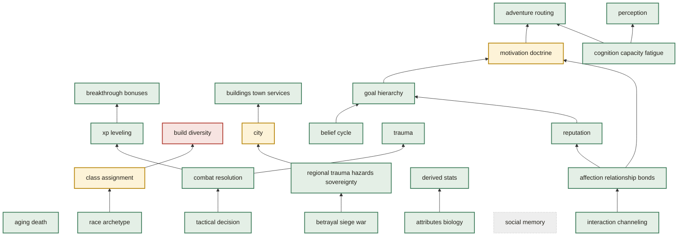

# Mechanism Priority View — Top 25 Unverified

Generated from `docs/brainstorm/mechanisms.yaml` — regenerate with
`make mechanism-priority-view`. Do not hand-edit.

**Which mechanism to verify next.** 67 of 75 mechanisms are currently
unverified (see `docs/brainstorm/mechanism_verification_view.md`). Priority is derived, never
hand-ranked: `layer weight × transitive dependent-count`, computed from the registry's own
`depends_on` edges — a hub mechanism nobody has verified is the highest-value next target, since
more depends on it. Ranked below, top 25.

## Text form

| Mechanism | Layer | State | Priority | Transitive Dependents |
|---|---|---|---|---|
| `tactical_decision` | entity | done | 70 | 14 |
| `combat_resolution` | entity | done | 60 | 12 |
| `cognition_capacity_fatigue` | entity | done | 45 | 9 |
| `perception` | entity | done | 40 | 8 |
| `trauma` | entity | done | 40 | 8 |
| `betrayal_siege_war` | faction | done | 33 | 11 |
| `belief_cycle` | entity | done | 30 | 6 |
| `interaction_channeling` | entity | done | 30 | 6 |
| `affection_relationship_bonds` | entity | done | 25 | 5 |
| `regional_trauma_hazards_sovereignty` | region | done | 16 | 8 |
| `goal_hierarchy` | entity | done | 15 | 3 |
| `race_archetype` | entity | done | 15 | 3 |
| `reputation` | faction | done | 12 | 4 |
| `attributes_biology` | entity | done | 10 | 2 |
| `aging_death` | entity | done | 5 | 1 |
| `class_assignment` | entity | partial | 5 | 1 |
| `derived_stats` | entity | done | 5 | 1 |
| `motivation_doctrine` | entity | partial | 5 | 1 |
| `xp_leveling` | entity | done | 5 | 1 |
| `city` | region | partial | 4 | 2 |
| `social_memory` | faction | skeleton | 3 | 1 |
| `buildings_town_services` | world | done | 1 | 1 |
| `adventure_routing` | entity | done | 0 | 0 |
| `breakthrough_bonuses` | entity | done | 0 | 0 |
| `build_diversity` | entity | gap | 0 | 0 |

## Chart form

