# Mechanism Priority View — Top 25 Unverified

Generated from `registries/mechanisms.yaml` — regenerate with
`make mechanism-priority-view`. Do not hand-edit.

**Which mechanism to verify next.** 60 of 93 mechanisms are currently
unverified (see `docs/brainstorm/mechanism_verification_view.md`). Priority is derived, never
hand-ranked: `layer weight × transitive dependent-count`, computed from the registry's own
`depends_on` edges — a hub mechanism nobody has verified is the highest-value next target, since
more depends on it. Ranked below, top 25.

## Text form

_2 of this registry's declared `depends_on` edges are unaudited (see `unaudited_depends_on_edges` in `registries/mechanisms.yaml`) -- the "Unaudited Edges" column below is how many of those fall within each row's own transitive-dependent count, not assumed zero._

| Mechanism | Layer | State | Priority | Transitive Dependents | Unaudited Edges |
|---|---|---|---|---|---|
| `belief_cycle` | entity | done | 20 | 4 | 1 |
| `entity_role` | entity | done | 15 | 3 | 0 |
| `movement` | entity | done | 15 | 3 | 0 |
| `personality` | entity | done | 10 | 2 | 0 |
| `affection_relationship_bonds` | entity | done | 5 | 1 | 1 |
| `aging_death` | entity | done | 5 | 1 | 0 |
| `attributes_biology` | entity | done | 5 | 1 | 0 |
| `campaigns` | world | done | 3 | 3 | 0 |
| `diplomacy` | faction | done | 3 | 1 | 0 |
| `social_memory` | faction | skeleton | 3 | 1 | 0 |
| `buildings` | world | done | 2 | 2 | 0 |
| `inventory_trade_conservation` | world | done | 2 | 2 | 0 |
| `world_generation` | world | done | 2 | 2 | 0 |
| `adventure_routing` | entity | done | 0 | 0 | 0 |
| `belief_institution` | world | partial | 0 | 0 | 0 |
| `betrayal_siege_war` | faction | done | 0 | 0 | 0 |
| `breakthrough_bonuses` | entity | done | 0 | 0 | 0 |
| `build_diversity` | entity | gap | 0 | 0 | 0 |
| `building_sabotage` | world | done | 0 | 0 | 0 |
| `chronicle` | world | done | 0 | 0 | 0 |
| `clan` | faction | gap | 0 | 0 | 0 |
| `cognition_capacity_fatigue` | entity | done | 0 | 0 | 0 |
| `commitment_pressure_consequences` | entity | partial | 0 | 0 | 0 |
| `committed_intentions` | entity | orphan | 0 | 0 | 0 |
| `concern_intake` | entity | done | 0 | 0 | 0 |

## Chart form

```mermaid
flowchart BT
    classDef done fill:#e4efe6,stroke:#3f7d5c,stroke-width:2px,color:#232019
    classDef partial fill:#fdf3d8,stroke:#b8860b,stroke-width:2px,color:#232019
    classDef gap fill:#f7e4e1,stroke:#b0392f,stroke-width:2px,color:#232019
    classDef orphan fill:#f7e4e1,stroke:#b0392f,stroke-width:2px,stroke-dasharray: 2 2,color:#232019
    classDef gated fill:#f7ecd2,stroke:#9a6b0c,stroke-width:2px,stroke-dasharray: 3 3,color:#232019
    classDef skeleton fill:#eee,stroke:#888,stroke-width:1px,stroke-dasharray: 1 3,color:#232019

    adventure_routing["adventure routing"]:::done
    affection_relationship_bonds["affection relationship bonds"]:::done
    aging_death["aging death"]:::done
    attributes_biology["attributes biology"]:::done
    belief_cycle["belief cycle"]:::done
    belief_institution["belief institution"]:::partial
    betrayal_siege_war["betrayal siege war"]:::done
    breakthrough_bonuses["breakthrough bonuses"]:::done
    build_diversity["build diversity"]:::gap
    building_sabotage["building sabotage"]:::done
    buildings["buildings"]:::done
    campaigns["campaigns"]:::done
    chronicle["chronicle"]:::done
    clan["clan"]:::gap
    cognition_capacity_fatigue["cognition capacity fatigue"]:::done
    commitment_pressure_consequences["commitment pressure consequences"]:::partial
    committed_intentions["committed intentions"]:::orphan
    concern_intake["concern intake"]:::done
    diplomacy["diplomacy"]:::done
    entity_role["entity role"]:::done
    inventory_trade_conservation["inventory trade conservation"]:::done
    movement["movement"]:::done
    personality["personality"]:::done
    social_memory["social memory"]:::skeleton
    world_generation["world generation"]:::done

    entity_role --> adventure_routing
    personality --> adventure_routing
    diplomacy --> adventure_routing
    campaigns --> belief_institution
    buildings --> building_sabotage
```

