# Mechanism Priority View — Top 25 Unverified

Generated from `registries/mechanisms.yaml` — regenerate with
`make mechanism-priority-view`. Do not hand-edit.

**Which mechanism to verify next.** 10 of 93 mechanisms are currently
unverified (see `docs/brainstorm/mechanism_verification_view.md`). Priority is derived, never
hand-ranked: `layer weight × transitive dependent-count`, computed from the registry's own
`depends_on` edges — a hub mechanism nobody has verified is the highest-value next target, since
more depends on it. Ranked below, top 25.

## Text form

_0 of this registry's declared `depends_on` edges are unaudited (see `unaudited_depends_on_edges` in `registries/mechanisms.yaml`) -- the "Unaudited Edges" column below is how many of those fall within each row's own transitive-dependent count, not assumed zero._

| Mechanism | Layer | State | Priority | Transitive Dependents | Unaudited Edges |
|---|---|---|---|---|---|
| `social_memory` | faction | skeleton | 3 | 1 | 0 |
| `clan` | faction | gap | 0 | 0 | 0 |
| `conversation` | entity | gap | 0 | 0 | 0 |
| `entity_trade` | entity | gap | 0 | 0 | 0 |
| `gods_pantheon_blessings` | world | gap | 0 | 0 | 0 |
| `lair` | region | gap | 0 | 0 | 0 |
| `nest` | region | gap | 0 | 0 | 0 |
| `race_collective_force` | faction | gap | 0 | 0 | 0 |
| `settlement_capacity_axis` | faction | gap | 0 | 0 | 0 |
| `team_up` | entity | gap | 0 | 0 | 0 |

## Chart form

```mermaid
flowchart BT
    classDef done fill:#e4efe6,stroke:#3f7d5c,stroke-width:2px,color:#232019
    classDef partial fill:#fdf3d8,stroke:#b8860b,stroke-width:2px,color:#232019
    classDef gap fill:#f7e4e1,stroke:#b0392f,stroke-width:2px,color:#232019
    classDef orphan fill:#f7e4e1,stroke:#b0392f,stroke-width:2px,stroke-dasharray: 2 2,color:#232019
    classDef gated fill:#f7ecd2,stroke:#9a6b0c,stroke-width:2px,stroke-dasharray: 3 3,color:#232019
    classDef skeleton fill:#eee,stroke:#888,stroke-width:1px,stroke-dasharray: 1 3,color:#232019

    clan["clan"]:::gap
    conversation["conversation"]:::gap
    entity_trade["entity trade"]:::gap
    gods_pantheon_blessings["gods pantheon blessings"]:::gap
    lair["lair"]:::gap
    nest["nest"]:::gap
    race_collective_force["race collective force"]:::gap
    settlement_capacity_axis["settlement capacity axis"]:::gap
    social_memory["social memory"]:::skeleton
    team_up["team up"]:::gap

```

