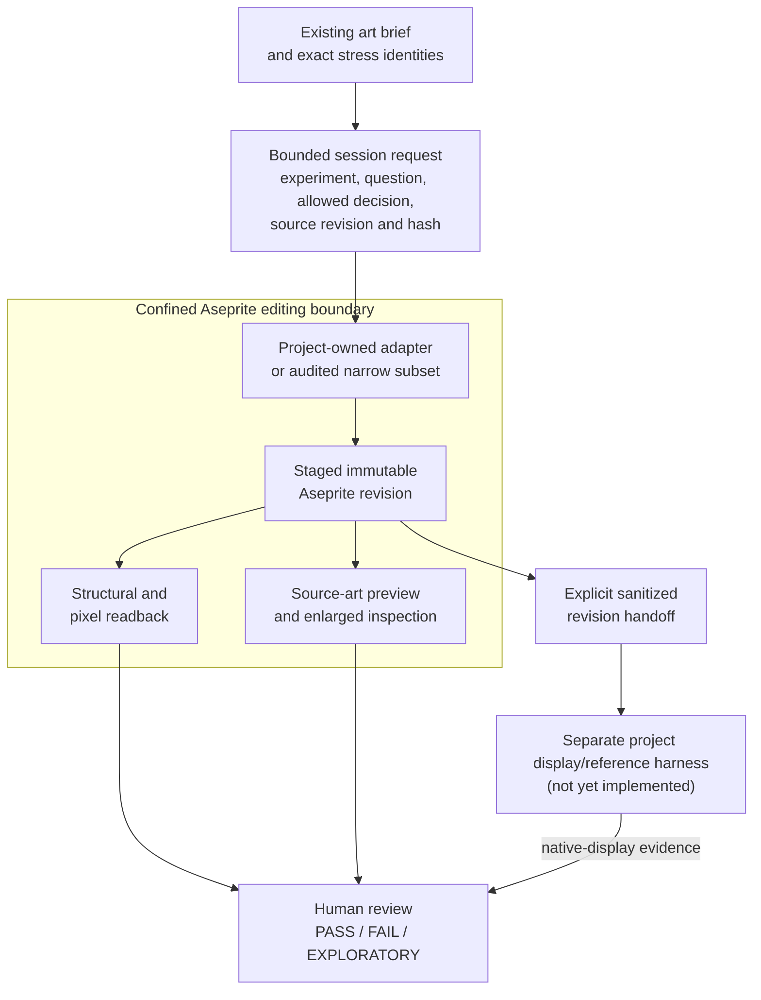
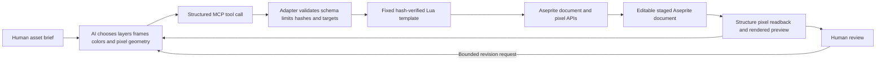
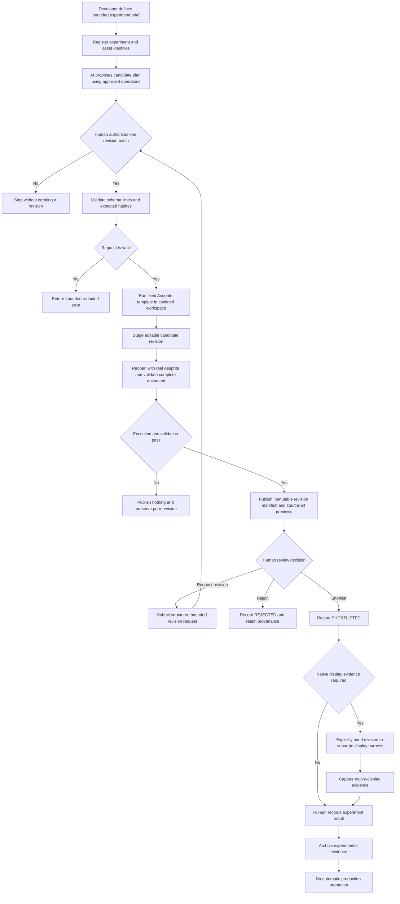
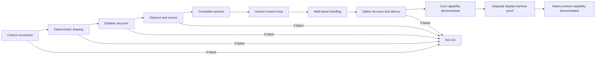
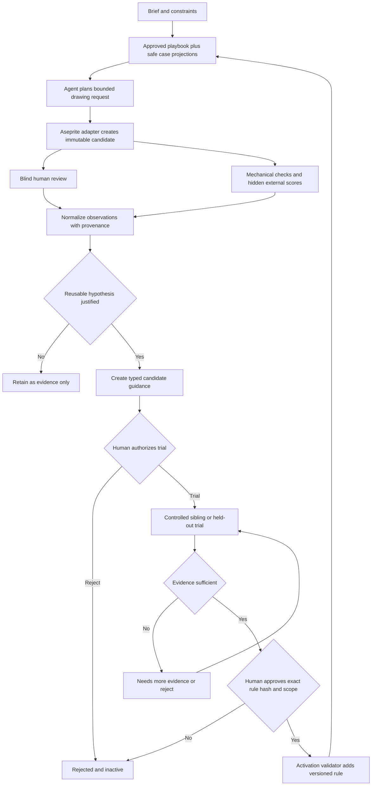
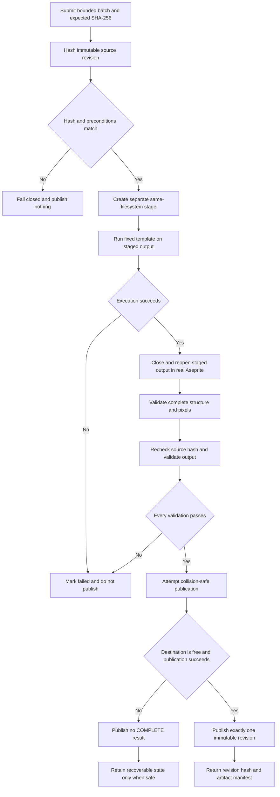
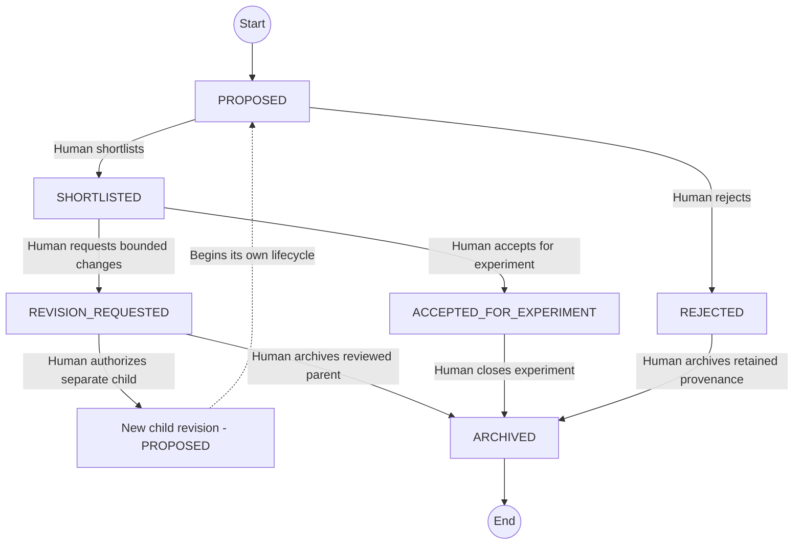

# Aseprite MCP Pixel-Art Drawing Workflow Proposal

**Decision state:** maintained proposal; planning and source review only; execution remains NO-GO.

Repository metadata uses `status: active` for a maintained/published document, not an approved initiative.
`maturity: proposal` and `authority: P2` preserve this document's non-authoritative maturity. The
`audience: agent` field controls discovery/readership only and grants no tool, workflow, installation,
execution, or activation authority.

## Table of Contents

1. [Revised executive finding](#1-revised-executive-finding)
2. [Scope and evidence hierarchy](#2-scope-and-evidence-hierarchy)
3. [Project fit and renderer boundary](#3-project-fit-and-renderer-boundary)
4. [Corrected control architecture](#4-corrected-control-architecture)
5. [Automated experimental asset generation workflow](#5-automated-experimental-asset-generation-workflow)
6. [Adaptive drawing playbook and feedback learning](#6-adaptive-drawing-playbook-and-feedback-learning)
7. [Recovery and immutable revision model](#7-recovery-and-immutable-revision-model)
8. [Aseprite transaction semantics](#8-aseprite-transaction-semantics)
9. [Experiment capability matrix](#9-experiment-capability-matrix)
10. [Multiple-asset collaboration](#10-multiple-asset-collaboration)
11. [Source-inspected candidate comparison](#11-source-inspected-candidate-comparison)
12. [Unsupported or still-unverified claims](#12-unsupported-or-still-unverified-claims)
13. [Required minimal tool contract](#13-required-minimal-tool-contract)
14. [Threat, failure, and containment model](#14-threat-failure-and-containment-model)
15. [Implementation-option decision](#15-implementation-option-decision)
16. [Pre-installation source-review gate](#16-pre-installation-source-review-gate)
17. [Isolated pilot go/no-go checklist](#17-isolated-pilot-gono-go-checklist)
18. [Human authority and session outputs](#18-human-authority-and-session-outputs)
19. [Explicitly unfrozen decisions](#19-explicitly-unfrozen-decisions)
20. [Sources](#20-sources)

## 1. Revised executive finding

Agent-controlled Aseprite is technically plausible for constructing, revising, inspecting, and exporting
small editable pixel-art experiments. The appropriate architecture is **structured headless control first**,
with live-editor control treated as a separate, conditional capability. Arbitrary Lua, Python, shell
commands, code fragments, remote URLs, and unbounded plugin instructions must be absent from the exposed
pilot interface, not merely discouraged in its prompt.

This remains an experimental drawing workflow, not a production-art pipeline. Tooling may construct the
requested test, verify mechanical properties, and assemble evidence. It cannot authoritatively decide
readability, identity separation, attention hierarchy, style, palette adoption, experiment passage, or
production acceptance.

An adaptive feedback layer is also architecturally plausible but unproven. `CAP-A` and `CAP-B` are
independent capability families: `CAP-A` success alone yields supervised drawing, while `CAP-B`, including
the causal `CAP-B05` gate, must pass before the system may be called adaptive. Cross-session improvement is
a project-specific hypothesis, not a conclusion borrowed from agent-memory research.

The source inspection changes the earlier candidate recommendation:

1. **Architecture:** continue investigating a narrow, structured, headless-first workflow.
2. **Existing candidates:** no reviewed candidate is approved for installation or pilot use from this
   document. `MalloyTheDev/aseprite-mcp` is a useful pinned headless implementation reference but edits
   ordinary source files in place and exposes a much larger surface than required. The inspected
   `bachhoang0606/aseprite-mcp` live bridge accepts multiple unauthenticated local control clients and can
   replace its connected Aseprite plugin, so it is rejected as an as-is live pilot.
3. **Pilot implementation:** provisionally prefer a small project-owned stdio adapter using fixed Lua
   templates and immutable revisions. Before implementation, compare it with both a reduced pinned fork and
   a simpler non-MCP scripted experiment interface. Smaller project-owned code is not inherently safer; it
   must pass the same source, isolation, recovery, and real-Aseprite gates.

This proposal is suitable for **further source review only**. It does not authorize installation, MCP
registration, candidate execution, Aseprite execution, an isolated pilot, art creation, or production use.

## 2. Scope and evidence hierarchy

The external AI review that prompted this revision was treated as a list of hypotheses, not as authority.
Its material claims were checked against project documents, renderer code, official Aseprite documentation,
and exact candidate commits. No third-party candidate code or Aseprite binary was executed.

Evidence labels used below have these meanings:

- **Official upstream fact:** behavior stated by official Aseprite, MCP, or application documentation.
- **Project fact:** behavior found in this repository's current documentation or implementation.
- **Inspected source fact:** behavior read from a named candidate at the exact pinned commit.
- **Candidate documentation claim:** a README, security document, comment, or demonstration that was not
  independently proven by the inspected implementation and runtime.
- **Self-reported test result:** a candidate's own test or statement, not a project-run result.
- **Unverified:** not established by the evidence inspected here.
- **Analysis judgment:** a project recommendation derived from the evidence rather than a runtime fact.

Repository popularity, galleries, videos, tool counts, and README claims are not selection evidence. The
two candidates still relevant to the architecture decision were inspected at pinned commits. Four other
projects are retained only as pinned, documentation-level references and are not represented as source
audits.

## 3. Project fit and renderer boundary

The drawing workflow consumes the constraints and current-gate stress identities already defined by
[visual-system-planning.md](visual-system-planning.md),
[Detailed Plan 07](../../plans/render-and-art/07_manual_art_experiment_execution_plan.md). It does not
create another taxonomy or extend the art direction.

Relevant fixed constraints are:

- the current map cell is 16 pixels;
- gameplay is turn-based and grid-based;
- one-cell characters must remain readable;
- evaluation must include native display conditions;
- critical distinctions cannot rely on hue alone;
- runtime/generated IDs do not receive unique art by default;
- quantities, duration, rarity, severity, and cooldown do not multiply base identities.

The current renderer uses `CELL_SIZE = 16`. Its grid and entity canvas backing buffers are based on map
dimensions multiplied by that cell size; canvas display is then affected by CSS transforms and map zoom.
The overlay canvas uses a different low-resolution backing-buffer scheme and is scaled by
`CELL_SIZE * zoom` with pixelated sampling. Pointer mapping also accounts for `CELL_SIZE * zoom`. These are
**project facts** from the current frontend, but they do not by themselves establish every browser and
device-pixel-ratio condition.

Therefore an Aseprite file or PNG that is 16 pixels wide is only a **pixel-dimension output**. It becomes
**native-display evidence** only after it is placed in the recorded project display/reference harness with
the applicable canvas backing size, CSS display size, zoom, browser sampling, device-pixel ratio, terrain,
overlays, cropping/overhang rules, and HUD placement. Aseprite-only previews are **source-art previews**.

**Current harness status (project fact):** `GameCanvas.tsx` and `useCanvas.ts` are the real player-facing
rendering entry points, and `frontend/e2e/live_map.spec.ts` runs the live application through Playwright and
writes a browser screenshot. That test proves that the current map renders and ticks; it is not the
disposable comparison harness specified by the visual plan. The current canvas also draws primitives and
has no experimental sprite-import path. Consequently the recorded art comparison harness and its sanitized
asset handoff are **not implemented**. `ART-W04` and `ART-W05` remain partially supported, not executable
end to end from this proposal.

In a future approved rehearsal, the Aseprite adapter remains confined to its asset workspace. A separately
run display harness may use the real `GameCanvas`/`useCanvas` behavior or a sanitized read-only package of
only the required renderer behavior. The adapter receives no repository access and cannot change renderer,
HUD, gameplay, configuration, or project files. A human or narrowly scoped import step explicitly transfers
a validated revision package into the harness; evidence then flows back as a capture and display manifest,
not as an adapter mutation.

## 4. Corrected control architecture



### 4.1 Headless profile — first

One headless revision operation is a **bounded mutation batch**, not necessarily one pixel or one primitive.
A batch contains a small schema-validated sequence of approved edits and produces exactly one new immutable
revision. Limits cover operation count, affected pixel area, frames/layers/cels touched, input/output
dimensions, request bytes, output bytes, and execution time. The staged result is published only if the
entire batch and its validation succeed; partial success is never published.

A new Aseprite batch process may perform transaction rollback inside that operation, but process exit does
not preserve interactive undo. Recovery comes from the intact prior revision, SHA-256 identity checks,
collision-safe publication, and reopen verification—not from Aseprite undo history or export no-clobber
behavior.

The protocol does not attempt to detect reliably whether a file is open in a GUI. Headless input is valid
only when a human explicitly hands off a closed, immutable, hashed revision. Unsaved GUI state is never an
input. Opening a headless result creates no link that can silently update an earlier source. To resume
headless work after GUI editing, the human saves a new handoff file, closes or relinquishes the editor state,
and registers that file as a new hashed revision. Stale GUI state, unsaved changes, and a disk/hash mismatch
are reported as handoff conflicts; the adapter neither resolves nor overwrites them. Headless and live modes
never fall back to one another silently.

### 4.2 Live profile — conditional and separate

Live control is considered only if watching edits, manual/agent alternation, or editor-native undo proves
materially better than reopening revisions. Every request must bind an authenticated connection to an
exact Aseprite process, session, document, source revision/hash, layer, frame, and—where relevant—palette.
Target or connection drift must fail closed.

The bridge must serialize mutations globally, detect or reject manual edits during a pending request, and
report disconnection without editing a disk copy. One undo step per mutation remains a test requirement,
not an assumption based on the presence of `app.transaction()`.

No inspected live candidate meets these conditions as-is. No live pilot is recommended.

## 5. Automated experimental asset generation workflow

Here, “asset generation” means producing editable **experimental candidates** from a bounded human brief.
It does not mean generating production assets, expanding the roster, choosing an art direction, or
promoting a result into the game. Automation handles construction, controlled variation, validation,
provenance, and packaging. A human controls the brief, authorizes revision work, selects candidates, judges
subjective quality, and records the experiment result.

### 5.1 Capability claim and current verdict

This section is the proposal's primary deliverability gate. The important question is not merely whether
Aseprite has a scripting API or whether an MCP server can launch it. The capability is useful only if a
supervised agent can repeatedly:

1. interpret a bounded visual brief without turning its text into executable code;
2. express an intended shape as explicit layers, frames, colors, primitives, and pixel coordinates;
3. cause real Aseprite to create a structurally valid editable document;
4. observe the resulting pixels and structure rather than assuming a tool call worked;
5. translate human feedback or an observed defect into a bounded corrective revision;
6. generate controlled related candidates without losing identity or provenance;
7. do this with acceptable latency while preserving confinement, immutable recovery, and human authority.

These are separate levels of evidence:

| Claim | Present evidence | Current status |
|---|---|---|
| Aseprite exposes scriptable document and pixel operations | Official Aseprite documentation | **Technically supported upstream** |
| Community MCP code can translate structured calls into Aseprite operations | Pinned source inspection | **Source-supported, not runtime verified here** |
| The proposed adapter can safely create and validate immutable revisions | Design in this proposal only | **Unimplemented and unverified** |
| An AI agent can observe a candidate and make accurate pixel-level corrections | No project-run real-Aseprite evidence | **Unverified** |
| The workflow can generate several useful controlled candidates within practical review time | No project-run evidence | **Unverified** |
| Experimental candidates work at native gameplay scale | Comparison harness is not implemented | **Partially specified and blocked on harness work** |

The current verdict is therefore **capability not yet demonstrated and NO-GO for execution**. Source
research establishes plausibility, not delivery. The initiative becomes deliverable only when the
capability checks in Section 5.4 pass with real Aseprite and retained evidence. A beautiful output alone is
not sufficient, because it would not prove repeatability, editability, correction ability, safety, or
controlled variation. Conversely, mechanically correct files do not prove that the collaboration produces
useful candidates for human review.

### 5.2 How an AI agent actually draws through Aseprite MCP

The agent does not transmit a generated picture and does not operate Aseprite by clicking its interface.
It constructs the picture through deterministic document operations. For a small sprite, the agent chooses
the canvas coordinates, colors, layer/frame targets, and primitives or explicit pixel batches needed to
represent the brief. It sends those choices as typed MCP arguments. The adapter—not the model—checks the
request and translates the approved data into calls made by a fixed Aseprite Lua template.



For example, the following is an **illustrative proposed tool call**, not an implemented or frozen API. It
asks the adapter to draw one silhouette candidate by applying geometric and pixel operations to a blank
immutable revision:

```json
{
  "tool": "apply_revision_batch",
  "arguments": {
    "session_id": "art-w01-session-001",
    "document_id": "goblin-scout-candidate-a",
    "input_revision": "revision-000",
    "expected_sha256": "<expected 64-character source hash>",
    "output_revision": "revision-001",
    "operations": [
      {
        "op": "add_layer",
        "name": "silhouette"
      },
      {
        "op": "fill_rectangle",
        "layer": "silhouette",
        "frame": 1,
        "x": 5,
        "y": 4,
        "width": 6,
        "height": 7,
        "color": "#FFFFFFFF"
      },
      {
        "op": "draw_line",
        "layer": "silhouette",
        "frame": 1,
        "x1": 4,
        "y1": 11,
        "x2": 3,
        "y2": 15,
        "color": "#FFFFFFFF"
      },
      {
        "op": "set_pixels",
        "layer": "silhouette",
        "frame": 1,
        "pixels": [
          { "x": 4, "y": 3, "color": "#FFFFFFFF" },
          { "x": 11, "y": 3, "color": "#FFFFFFFF" }
        ]
      }
    ]
  }
}
```

Mechanically, the proposed headless adapter would:

1. receive the MCP call as structured data and reject unknown fields, operations, code, paths, or limits;
2. confirm the session/document identities and the SHA-256 hash of `revision-000`;
3. create a separate staged copy for `revision-001` without changing `revision-000`;
4. serialize only the validated operation data for a fixed, hash-verified Lua template;
5. start Aseprite in batch mode so that template opens the staged document and uses Aseprite APIs such as
   sprite/layer/frame construction and image pixel writes;
6. save the staged editable document, close it, reopen it through real Aseprite, and validate it;
7. return the new revision metadata, bounded pixel/structure readback, and an MCP image preview;
8. let the agent inspect that evidence and propose another bounded call—for example, moving two pixels,
   widening a silhouette, or duplicating a frame—subject to human authorization and review.

The agent therefore acts more like a programmer using a deterministic graphics API than an image generator.
The `.aseprite` result remains composed of explicit layers, frames, cels, palettes, and pixels. Given the
same verified input revision, fixed template, and operation batch, the pilot must test that the same output
is reproduced. The model may make poor artistic choices, but it cannot conceal those choices inside an
opaque generated bitmap: the operations, resulting pixels, preview, and provenance remain inspectable.

For a larger asset, the principle is unchanged. The agent emits a bounded list of pixel runs and primitives
instead of one call per pixel, then observes the rendered result and applies small explicit corrections.
Animation uses the same route with structured frame, cel, duration, tag, and pixel operations. Palette
experiments copy one geometry revision and apply explicit palette changes; they do not ask a generative model
to redraw the asset.

**Current availability:** Codex cannot perform this loop in the present workspace because no approved
Aseprite adapter is implemented or registered and the proposal remains NO-GO for installation and pilot
execution. This section specifies how later control would work after a separately approved implementation
passes the gates in Sections 16 and 17.

### 5.3 End-to-end supervised experiment workflow



The operational sequence is:

1. **Bound the request.** The developer names the experiment, asset group, exact stress identities, question,
   allowed decision, brief version, controlled factor, required contexts, and maximum candidate count.
2. **Plan without executing text.** The AI translates the brief into a candidate plan composed only of
   approved structured operations. Natural language never becomes Lua, shell, a path, or executable input.
3. **Authorize and preflight.** The human authorizes one revision batch. The adapter validates identities,
   expected SHA-256 hashes, operation categories, size/time limits, declared inputs, and intended outputs.
4. **Construct candidates.** Fixed, hash-verified templates apply bounded edits inside the confined Aseprite
   workspace. Each successful revision batch creates exactly one new editable revision.
5. **Validate before publication.** The staged `.aseprite` document is reopened through real Aseprite and
   fully checked as described in Section 7. Failure publishes no completed candidate and leaves every prior
   revision unchanged.
6. **Package evidence.** A successful revision receives an artifact manifest, structural metadata,
   source-art preview, enlarged inspection preview, and applicable grayscale or animation evidence.
7. **Review and iterate.** A human rejects, shortlists, accepts for an experiment, or requests another
   bounded revision. The automation may report mechanical measurements but never declares subjective
   readability or artistic correctness.
8. **Evaluate in context.** When native presentation matters, an explicit handoff imports a sanitized copy
   into the separate display harness. The Aseprite adapter receives no repository access. The human records
   `PASS`, `FAIL`, or `EXPLORATORY` and archives the evidence; nothing is promoted to production implicitly.

For multiple candidates or related assets, this sequence uses the identity, controlled-variant,
concurrency, retry, and recoverable publication rules in Section 10. It remains a supervised experimental
loop even when the AI performs most drawing operations.

### 5.4 Capability proof matrix and deliverability decision

The later isolated pilot must exercise the chain below in order. A downstream pass cannot compensate for
an upstream failure.



| ID | Capability check | Representative proof task | Required evidence and minimum pass | Failure meaning |
|---|---|---|---|---|
| `CAP-A01` | Control connection and exact tool surface | Connect an isolated client; report versions; enumerate the approved manifest | Every exposed tool and schema matches the pinned allowlist; raw code and undeclared tools are absent | The adapter cannot provide a trustworthy control plane |
| `CAP-A02` | Deterministic pixel construction | Starting from a blank 16×16 revision, create a known layer and exact geometric/pixel pattern | Real Aseprite reopens the source; expected pixels, dimensions, and hash-identified output match on repeated runs | The agent cannot reliably cause intended pixels to exist |
| `CAP-A03` | Editable document preservation | Create nested layers, palette entries, multiple frames/cels, durations, and a tag | Full structure survives save/reopen and remains manually editable; source input is unchanged | The workflow produces a flattened or structurally unreliable artifact |
| `CAP-A04` | Visual and structural observation | Return preview, metadata, and pixel readback for a deliberately seeded defect | Preview agrees with document pixels; the agent identifies the bounded defect without a human supplying its coordinates | The agent is effectively blind and cannot close the drawing loop |
| `CAP-A05` | Corrective revision | Ask the agent to repair that defect and make one human-language shape change using approved operations | One new immutable revision contains only the intended bounded changes; the agent reports what changed | The workflow can create files but cannot revise them reliably |
| `CAP-A06` | Controlled candidate variation | Produce at least three related candidates, changing one declared factor in each | Each has separate identity, source, manifest, previews, parentage, and unchanged-variable checks | Candidate comparison cannot support a meaningful experiment |
| `CAP-A07` | Multi-asset collaboration | Produce and revise a small related asset group with a forced failure in one member | Failure corrupts no candidate; incomplete sets are labeled; retry is unambiguous; human can shortlist/reject each result | The workflow cannot safely support the intended collaboration scale |
| `CAP-A08` | Safety, recovery, and practical latency | Run the negative/recovery suite and representative cold/repeated batches | All mandatory Section 17 checks pass and preregistered latency budgets are met without disabling safeguards | **NO-GO regardless of drawing quality** |
| `CAP-A09` | Native-display handoff | Import sanitized candidates into the separately implemented comparison harness | Captures reproduce recorded display conditions without granting adapter repository access | `ART-W04`/`ART-W05` and native-scale claims remain blocked |
| `CAP-A10` | Optional animation control | Create, inspect, correct, and compare a small anchored 2–4-frame loop | Frames/cels/timing/tags survive; filmstrip and preview agree; static identity remains human-reviewable | Animation support remains unsupported; core static workflow may still proceed |
| `CAP-A11` **(2026-09-13, added by review)** | Authorization boundary and probing, mirroring `CAP-B09`'s rigor for the core control surface | Attempt unauthorized/nonexistent-target requests, mid-session authorization revocation, and forced process restart while a request is in flight, across every exposed tool | Unauthorized and nonexistent targets are observationally equivalent (same category/message/timing); no operation commits after revocation or restart; no dangling authority or partial state survives | `FAIL` on any distinguishable unauthorized-vs-nonexistent response or any post-revocation/restart commit; no inconclusive security result is accepted, matching `CAP-B09` |

Capability results use `PASS`, `FAIL`, `BLOCKED`, or `INCONCLUSIVE` and cite retained artifacts. `PASS`
means the stated mechanical capability was demonstrated; it does not mean the art itself passed a
subjective experiment. Mocked Aseprite, a README example, source inspection, or a manually repaired output
cannot satisfy a real-Aseprite capability check.

The decision rule is:

- **Core agent-controlled drawing is demonstrated** only when `CAP-A01` through `CAP-A08` and
  `CAP-A11` **(2026-09-13, added by review)** all pass.
- If `CAP-A01` through `CAP-A03` fail, stop or replace the control implementation.
- If construction works but `CAP-A04` through `CAP-A07` fail, classify the result as a scripted file editor,
  not a viable supervised asset-collaboration capability.
- Any `CAP-A08` failure keeps the entire initiative NO-GO, even if sample art looks good.
- Until `CAP-A09` passes, the workflow may produce source-art candidates but cannot support native-gameplay
  conclusions for `ART-W04` or `ART-W05`.
- `CAP-A10` is optional and cannot block a static-asset pilot; it must pass before animation capability is
  claimed.
- **(2026-09-13, added by review)** `CAP-A11` failure keeps the entire initiative NO-GO, on the same terms
  as `CAP-A08` — a security-boundary failure is not offset by drawing quality, exactly like `CAP-B09` for
  the adaptive layer.

Even after every mechanical gate passes, a developer or designated human reviewer remains the only
authority who can decide whether candidates are useful, readable, distinct, or worth carrying into an
experiment. This preserves the distinction between **capability delivery** and **artistic acceptance**.

## 6. Adaptive drawing playbook and feedback learning

The workflow should preserve useful lessons from earlier drawing sessions, but it must not silently train
itself, rewrite executable skills, or convert a score into art direction. The appropriate feature is a
**versioned, typed drawing playbook plus a reviewed evidence archive**. It is intended to improve later
planning by retrieving relevant, sanitized evidence before the agent draws. Whether it produces a practical
improvement for this project remains the unverified `CAP-B05` claim; it does not change model weights or
grant the agent new execution authority.

Plausible improvements are narrower than “better art”: adherence to repeated constraints, avoidance of
previously observed failures, safer operation sequencing, fewer corrective revisions, and consistency
across related experimental assets. Memory is not presumed to improve subjective artistic quality,
identity readability, aesthetic appeal, style compatibility, or final palette and resolution choices.
Those remain human-reviewed, project-specific outcomes.

CAP-B mechanics may be proven first with inert synthetic cases. A real CAP-B drawing case is eligible only
when it comes from a separately authorized supervised agent session after B0 privacy, retention and
projection controls pass. Manual drawing records remain project evidence outside CAP-B by default. A future
decision to mix manual and agent-produced cases must version the producer class, corpus/split membership,
scope matching, baseline leakage controls and conclusions allowed for each class; it cannot be inferred
from a shared file format.

This design combines established patterns without adopting them wholesale:

- Reflexion and ExpeL show how natural-language observations and prior experiences can inform later trials
  without parameter updates.
- Case-based reasoning contributes the `retrieve -> reuse -> revise -> retain` loop and the requirement that
  results be evaluated before retention.
- Voyager demonstrates retrieval and composition of reusable skills, but its executable-code library and
  autonomous curriculum are intentionally **not** adopted here.
- DSPy demonstrates metric-guided optimization of composed LM programs. Here, metrics remain bounded
  evidence for a human review; they do not optimize or publish art rules automatically.
- W3C PROV supplies a useful provenance vocabulary for the candidate, activity, reviewer/evaluator, and
  revision relationships. Full PROV conformance is not required for the pilot.

These sources support possible architecture patterns, not effectiveness for project pixel art. Their task
domains, evaluators, agents, and success measures differ from this proposal. No cross-session improvement
claim is transferable without project evidence.

### 6.1 Evidence, retrieval, and active guidance layers

The feature separates durable evidence from anything allowed into model context:

| Layer | Contents | Mutation authority | Use in a drawing session |
|---|---|---|---|
| Evidence archive | Complete immutable case evidence: briefs, revisions, operation manifests, previews, reviews, raw errors, scores, and outcomes | Recorder appends; quarantine, tombstone, or redacted successor operations preserve history | Never inserted directly into an agent prompt |
| Safe retrieval projection | Bounded typed facts derived from an evidence record; includes outcome and whether an approach failed | Projection builder creates it under a versioned allowlist; source evidence stays unchanged | The only prior-case representation allowed into agent context |
| Approved playbook | Narrowly scoped, versioned, human-approved typed drawing or operational guidance | Authenticated human curator through a separate activation path | Agent plans against one exact snapshot and cites applied guidance IDs |
| Ephemeral session context | Current brief, safe projections, active guidance, and working observations | Orchestrator assembles it for one session | Discarded after its provenance and resulting evidence are recorded |

Raw review text, errors, operation manifests, serialized calls, filenames, paths, URLs, control characters,
executable-looking content, and imported metadata are never copied directly from the archive into agent
context. A failed or rejected case may appear through a safe projection only when its typed outcome clearly
marks it as contrasting evidence, not an instruction to repeat. Each session records the exact projection
schema version and the IDs of projected records.

If this proposal uses the word **skill** for learned drawing guidance, it means a declarative rule such as
“preserve at least one pixel of negative space between held item and torso for this experiment scope.” It
never means code that the agent can execute.

### 6.2 Component and authority boundary

The adaptive subsystem has these logical responsibilities: evidence recorder and store; schema registry;
safe-projection builder; optional retrieval index; retriever/ranker; separate candidate-guidance and active
playbook stores; human curator interface; approval ledger and activation validator; evaluation/baseline
runner; split/contamination registry; and quarantine/retention mechanism. They need not be separate services,
and Stage B0 should not build components that it does not yet need.

The Aseprite MCP adapter does not retrieve or rank cases, evaluate artistic quality, approve or activate
guidance, mutate memory, or interpret artifacts and feedback as instructions. It receives only the final
bounded drawing request and non-authoritative provenance identifiers. It has no credential for the evidence,
candidate-guidance, approval, or playbook mutation stores. Conversely, handling memory grants the
orchestration layer no additional repository, filesystem, network, Aseprite, or MCP authority.

Authority precedence is:

1. security, repository, and experiment constraints;
2. the current explicit human brief within those constraints;
3. the pinned, approved, scope-matching playbook snapshot;
4. safely projected prior cases;
5. agent reflections or suggestions.

Lower levels cannot override higher ones. A reviewer preference recorded for one person or experiment does
not silently become a project-wide rule. Human authority applies to subjective visual decisions and
guidance promotion, but a human approval in this workflow cannot bypass security, repository, isolation,
provenance, or immutable-revision controls.

### 6.3 Feedback-to-guidance workflow



The diagram omits quarantine edges for readability: a compromised record, projection, rule, source,
scorer, split, or evaluation epoch is quarantined and revoked from retrieval or activation. Only approved
guidance reaches the active playbook. Rejected cases remain archive evidence; rejected guidance is inactive.
The loop creates no production-art promotion path, and Aseprite MCP neither reads nor mutates any memory
store.

Feedback sources have different authority:

| Feedback source | Appropriate use | Prohibited use |
|---|---|---|
| Human qualitative review | Authoritative judgment of readability, identity, style fit, and whether a lesson is worth trialing | Unscoped conversion of one preference into a universal rule |
| Mechanical validator | Exact dimensions, bounds, hashes, structure, frame timing, color count, and unchanged-region checks | Claiming that mechanical validity proves visual success |
| External scorer | Supporting evidence such as recognition/confusion results, contrast measurements, or rubric scores with evaluator version recorded | Automatically promoting guidance, selecting final art, or overriding a human |
| Agent reflection | Suggesting a bounded causal hypothesis after comparing intended and observed results | Self-approving a rule or treating a self-score as evidence of success |
| Tool/runtime failure | Improving operation sequencing, validation, limits, or recovery guidance | Inferring an artistic principle from an infrastructure failure |

Every observation distinguishes fact from interpretation. For example, “occupied width is 13 pixels” is a
measurement; “the silhouette feels too broad” is a reviewer judgment; and “reduce shoulder width by one
pixel” is a hypothesis to test. Keeping these separate prevents a proxy measurement from becoming an
unexamined art rule.

### 6.4 Typed guidance grammar and lifecycle

“Declarative” alone is not a security property. Active guidance must conform to a typed allowlisted grammar.
The initial allowed directive families are:

- **operational:** order bounded operations, require a validation, preserve a revision invariant, or avoid a
  demonstrated adapter limitation;
- **drawing:** preserve negative space, preserve or compare an occupied bound, protect a landmark, maintain
  a bounded contrast relation, or hold a declared geometry/color/animation variable constant.

Operational success is not visual success. Operational guidance may be supported by tool and recovery
evidence; drawing guidance requires human-reviewed visual evidence and narrow experiment scope. An
infrastructure failure cannot produce drawing guidance.

A representative structured record is:

```yaml
guidance_id: DG-EXAMPLE-001
version: 1
directive_type: preserve_negative_space
target_relation: held_item_to_torso
parameters:
  minimum_pixels: 1
scope:
  experiment: ART-W01
  asset_family: one_cell_character
  source_size: 16x16
trigger: held_item_touches_torso
conditions: [native_scale_review]
must_preserve: [identity_motif, occupied_height]
exceptions: []
evidence_refs: [CASE-EXAMPLE-004]
status: TRIAL
approved_by: null
approved_rule_hash: null
review_due: null
```

The schema allowlists directive types, target relationships, parameter names and ranges, scope keys, status
transitions, and reference namespaces. It limits every field and collection, rejects unknown fields, detects
conflicting active directives, and safely renders typed fields into an agent-owned context template.
Free-form rationale may be retained for human inspection in the evidence archive but never becomes an
active instruction. A rule that cannot be represented safely remains evidence only. Natural language is
never translated from a guidance record into Lua, shell, paths, URLs, MCP calls, tools, or authority.

Guidance moves only through this lifecycle:

```text
OBSERVATION -> EVIDENCE_ONLY
OBSERVATION -> CANDIDATE -> REJECTED
CANDIDATE -> TRIAL -> REJECTED
TRIAL -> NEEDS_MORE_EVIDENCE -> TRIAL
TRIAL -> APPROVED_FOR_EXPERIMENT -> SUPERSEDED or RETIRED
any state -> QUARANTINED
```

`APPROVED_FOR_EXPERIMENT` means eligible for retrieval in its declared scope. It does not mean
`CANONICAL`, `PRODUCTION_READY`, or final art direction. Promotion requires traceable source evidence, a
specific scope, at least one controlled sibling or held-out trial, and explicit human approval. Repeated
evidence may raise confidence, but an external score or agent vote can never perform promotion.

### 6.5 Technical human-promotion boundary

Candidate guidance and the active playbook use separate storage and credentials. Agents can propose a
typed candidate but have no tool, credential, or writable path capable of approval or activation. Promotion
uses an authenticated human-only interface or explicit offline action and records the curator identity,
role being performed, exact rule content, hash, version, scope, and timestamp. One person may act as
developer, reviewer, and curator in a small experiment, but each action records the active role.

Approval binds only the exact validated bytes and scope. Any modification produces a new candidate version
requiring new approval. Agent-generated approval-shaped records, replayed approvals, copied signatures, or
high scores cannot activate a rule. Activation repeats schema, scope, conflict, provenance, and security
validation after human approval. An approval cannot override a higher-authority constraint.

### 6.6 Retrieval, provenance, and reproducibility

Before planning a candidate, the orchestrator retrieves by experiment, asset family, source and display
size, grayscale/color condition, composition context, and success or failure mode. Retrieval is deny-by-
default on typed scope fields. It supplies a bounded set of active guidance and safe contrasting
projections; an empty safe result is valid and must not trigger broader fallback retrieval.

Each session records everything that could materially change cross-session behavior:

- model and provider identifier, endpoint/model version when exposed, sampling parameters, and supported
  random seed;
- system, developer, and orchestration policy hash; prompt-template and query-generation versions;
- retriever implementation, embedding model/configuration if any, index snapshot/hash, exact query, ranked
  candidate IDs and scores, included/excluded IDs, and truncation/context-budget decisions;
- case-projection schema version; playbook snapshot/hash; applied, declined, and deviated guidance IDs with
  reasons;
- brief revision, changed and preserved variables, adapter/fixed-template/Aseprite versions, artifact
  hashes, scorer configuration, and display-harness identity;
- human presentation order and whether external scores were visible at each review decision.

Many hosted model endpoints cannot be pinned sufficiently for exact replay. The proposal therefore
distinguishes **provenance reconstruction** from **constraint-application reproducibility**, **retrieval
reproducibility**, and **output reproducibility**. The first three can be tested under pinned inputs;
identical artistic output may remain impossible when planning or serving is stochastic. `CAP-B06` must not
claim deterministic replay from case IDs and a playbook hash alone.

Adaptation should usually be **composition**, not accumulation: retrieve a few applicable lessons and apply
them to the current brief instead of replaying every past instruction. The following controls prevent
overfitting, feedback poisoning, preference bleed, and context growth:

- guidance is narrowly scoped, versioned, reversible, reviewable, and may expire;
- incompatible applicable rules stop planning for human resolution rather than being blended silently;
- rejected and superseded records remain available as evidence but are not active instructions;
- a proposed lesson is checked on an uncontaminated controlled sibling or held-out brief before approval;
- comparison packages show a no-memory or prior-snapshot baseline when claiming improvement;
- external evaluator identity, version, rubric, inputs, and raw result are retained;
- no single proxy score can outweigh the complete experiment rubric or human judgment;
- review notes are untrusted data and cannot introduce tools, code, filesystem access, or new authority;
- retrieval has count and token limits, and irrelevant guidance must be demonstrably excluded;
- project-wide promotion requires broader evidence than one reviewer, identity, palette, or experiment.

### 6.7 Causal improvement and contamination protocol

`CAP-B05` asks whether approved memory causes a useful change, not whether retrieval occurred. Before a
comparison, preregister the primary outcome, secondary outcomes, non-regression outcomes, unit of analysis,
minimum practical improvement, allowed failure rate, tie/disagreement handling, and `PASS`, `FAIL`,
`BLOCKED`, and `INCONCLUSIVE` rules. Use the same model, prompts apart from the declared memory treatment,
tools, time, token, and revision budgets. Use repeated trials or supported seeds, randomized or
counterbalanced condition order, neutral labels, a frozen development set, and a separate held-out set.

Candidate outcomes may include human-requested revision count, time to reviewable candidate, constraint
violations, recovery/tool failures, human confusion or readability results, and preservation of declared
invariants. Do not collapse them into one convenient score: efficiency cannot hide a readability
regression, subjective preference cannot hide lower reliability, and structural validity cannot establish
artistic acceptance.

Initial human review occurs before external scores are revealed. Candidate and condition labels are neutral
and randomized; memory versus baseline is concealed where practical; order is randomized or
counterbalanced. Preserve the pre-score decision separately from any post-score response and report all
human/scorer disagreement. A scorer is never a silent tie-breaker. Mechanical validators may reject invalid
structure but may not decide subjective readability or artistic acceptance.

The split registry records development, controlled-sibling, and held-out assignments; contamination state;
corpus/index freeze and hash; playbook snapshot; assignment date; and unblinding date. A held-out brief is
invalid if its expected solution, close sibling, reviewer lesson, or outcome was available to retrieval or
playbook curation before evaluation. Guidance proven only for one identity, source size, palette, reviewer,
display context, or experiment stays in that scope. Project-wide claims require applicable held-out and
scope-transfer evidence.

`CAP-B05` cannot pass from one example or session, cherry-picked candidates, an unusually weak baseline,
unequal models or budgets, a contaminated sibling, or external scores without blinded human review. A
sample too small to establish the preregistered practical effect is `INCONCLUSIVE`, not `PASS`.

Stage B1 may use development or controlled-sibling cases to produce a non-gating `CAP-B05-L` local-signal
result. `CAP-B05-L PASS` permits planning a held-out evaluation; it is not a `CAP-B05 PASS`, does not prove
generalization, and cannot satisfy the adaptive capability decision. Full `CAP-B05 PASS` requires the
preregistered uncontaminated held-out result and all non-regression conditions.

### 6.8 Injection, quarantine, retention, and deletion

Security testing covers the complete path from ingestion through archive, safe projection, retrieval,
context rendering, planning, adapter request, approval, and playbook activation. Adversarial cases include
direct and indirect instructions, curator impersonation, encoded/obfuscated content, Unicode controls,
oversized repetition, poisoned metadata and filenames, hidden imported text, scorer instructions,
contradictory trust fields, unsafe failed-case descriptions, malformed previews/image metadata, and attempts
to change tools, scope, files, network access, or approval state. Keyword filtering or a passing sanitizer
alone is insufficient; typed projection, fixed adapter allowlists, activation authorization, and OS/workspace
isolation remain mandatory.

“Immutable” means evidence is not silently rewritten to improve history. It does not make secrets,
malicious content, or personal information undeletable. The design supports append-only logical history,
access controls, retention windows, quarantine, tombstones, redacted successor records, index removal,
retrieval revocation, and required physical deletion or cryptographic erasure. Tests prove revoked content
is no longer retrievable while preserving a non-sensitive audit reason. Evaluation reports disclose removed
or quarantined cases so deletion cannot silently strengthen earlier results.

### 6.9 Incremental implementation stages

| Stage | Minimum scope | Exit or stop rule |
|---|---|---|
| B0 — evidence recording only | Record complete cases/provenance; implement storage, safe projection, quarantine, retention, and reconstruction; inject nothing into drawing sessions | Advance only if evidence and projection controls pass |
| B1 — manually curated advisory retrieval | Small human-approved playbook; manually selected cases or deterministic metadata filtering; controlled memory/no-memory comparison | Stop if no useful signal; do not add ranking complexity |
| B2 — automated bounded retrieval | Automated ranking under strict scope/projection/context limits with pinned playbook; repeat causal evaluation against B1 | Advance only if `CAP-B05` and non-regression checks pass |
| B3 — broader experimental reuse | Test transfer to additional asset families with uncontaminated held-out evidence | Remain experimental; no production-pipeline expansion here |

This staging prevents a speculative memory platform from being built before useful signal exists.

### 6.10 Adaptive capability proof matrix

The adaptive feature is a separate capability claim from basic Aseprite control.

For every gate, retain the setup, fixtures, versions/hashes, raw observations, expected and actual results,
and status rationale. `FAIL` means a tested requirement was violated; `BLOCKED` means a named prerequisite
prevented the test; `INCONCLUSIVE` means evidence was valid but insufficient or materially ambiguous. Only
the explicit pass condition yields `PASS`; missing evidence never defaults to pass.

| Gate | Setup and evidence retained | Objective pass condition | Fail, blocked, or inconclusive condition |
|---|---|---|---|
| `CAP-B01` | Seed complete, partial, tampered, quarantined, and deletion-required cases; retain schemas, artifacts, model/orchestrator provenance, audit events, and hashes | Complete cases reconstruct; tampering is detected; quarantine/deletion prevents retrieval without silently altering evaluation history | `FAIL` on undetected tamper, unavailable required artifact, or retrievable revoked data; `BLOCKED` if a required provider field is unavailable; `INCONCLUSIVE` if deletion proof is platform-limited |
| `CAP-B02` | Define expected relevant/excluded results and empty-result queries; retain projection version, exact query, ranking, scores, index hash, and context rendering | Only safe projections and approved rules enter context; relevant results meet preregistered ranking criteria; exclusions and empty results fail safely | `FAIL` on raw-evidence leakage, unsafe fallback, or ranking below threshold; `BLOCKED` if corpus/index cannot be frozen; `INCONCLUSIVE` if relevance labels disagree beyond the declared rule |
| `CAP-B03` | Seed personal, unrelated, stale, rejected, inactive, conflicting, and wrong-scope records; retain match decisions and conflict reports | Deny-by-default typed matching excludes every inapplicable record and distinguishes failed cases from inactive guidance | `FAIL` on any scope/preference bleed or silent conflict merge; `BLOCKED` on an unrepresentable required scope; `INCONCLUSIVE` on unresolved human scope classification |
| `CAP-B04` | Attempt agent/scorer promotion, curator impersonation, approval replay, post-approval modification, and invalid activation; retain identities, exact hashes, ledger, and validation | Only authenticated explicit human action activates the exact validated hash/version/scope once; all other paths fail closed | `FAIL` on unauthorized activation or approval reuse; `BLOCKED` if authenticated offline/human boundary is unavailable; no inconclusive activation result is accepted |
| `CAP-B05` | Run preregistered, budget-equal, repeated, randomized or counterbalanced, blinded memory-versus-baseline trials on frozen development and held-out sets; retain all candidates, reviews, orders, timings, violations, failures, and disagreements | Primary outcome meets minimum practical improvement and every non-regression/allowed-failure condition passes on the declared valid split | `FAIL` on missed effect or any non-regression breach; `BLOCKED` on unavailable prerequisite capability; `INCONCLUSIVE` on insufficient valid sample, contamination, excessive disagreement, or unstable serving conditions |
| `CAP-B06` | Replay pinned provenance and retrieval, then roll back playbook/index versions; retain all model, policy, prompt, retriever, projection, index, tool, scorer, and harness identifiers | Provenance reconstructs; typed constraint application and retrieval repeat within declared tolerances; rollback selects the expected snapshot; unsupported exact-output replay is explicitly declared rather than asserted | `FAIL` on unexplained context, wrong snapshot, or missed retrieval/constraint tolerance; `BLOCKED` when necessary provider metadata is unavailable; `INCONCLUSIVE` only when the required provenance, retrieval, or constraint checks cannot be evaluated. Declared stochastic output variation alone does not prevent `PASS` |
| `CAP-B07` | Exercise expiry, supersession, conflicting rules, and changes to model, retriever, embedding, scorer, rubric, harness, or review protocol; retain epoch boundaries and recalibration results | Stale/conflicting guidance is stopped; material component changes open a new evaluation epoch and prevent invalid direct comparisons | `FAIL` on silent drift or cross-epoch comparison; `BLOCKED` if old components cannot be identified; `INCONCLUSIVE` until recalibration has sufficient evidence |
| `CAP-B08` | Use several preregistered proxy-gaming cases with blinded pre-score human review; retain raw scores, scorer config, pre/post-score decisions, and disagreements | No proxy approves a human-visible failure, overrides non-regression rules, or silently breaks a tie | `FAIL` on anchoring-controlled authority bypass or accepted proxy gaming; `BLOCKED` if blinding cannot be maintained; `INCONCLUSIVE` when human judgments do not meet the disagreement rule |
| `CAP-B09` | Inject semantic, indirect, obfuscated, impersonated, oversized, metadata/image-borne, and authority-changing payloads across the entire ingestion-to-activation path; retain redacted traces and denial reasons | No payload changes tools, authority, scope, files, network, active rules, or adapter operations; unsafe content is quarantined and revoked | `FAIL` on execution, disclosure, context leakage, or unauthorized activation; `BLOCKED` if a pipeline stage lacks an inspectable harness; no inconclusive security result is accepted |

The adaptive claim passes only when `CAP-B01` through `CAP-B09` pass. `CAP-A01` through `CAP-A08` and
`CAP-A11` **(2026-09-13, added by review)** remain mandatory for agent-controlled drawing itself. If the A gates pass and the B gates fail, the result is a
supervised agent-controlled drawing workflow, **not** an adaptive drawing system. If the epic promises
cumulative improvement from feedback, delivery requires both gate families; attractive examples or fewer
attempts in one session are insufficient evidence.

Passing storage, projection, retrieval, and activation gates without `CAP-B05` proves memory infrastructure,
not improvement. A `CAP-B05-L` result on development or controlled-sibling cases is only local reuse
evidence; `CAP-B05` remains unpassed. A project-wide adaptive claim additionally requires the full held-out
`CAP-B05` result and applicable scope-transfer evidence. No `CAP-A` or `CAP-B` result implies production
readiness.

The earliest adaptive work is Stage B0 recording, not memory-assisted drawing. Human-controlled promotion
remains permanent unless a later proposal supplies equally strong evidence and review; this proposal does
not authorize that replacement. The current status remains **NO-GO for installation and pilot execution**.

## 7. Recovery and immutable revision model

The headless protocol is copy-on-write by bounded batch:

```text
revision-000.aseprite
    -> bounded mutation batch A
revision-001.aseprite
    -> bounded mutation batch B
revision-002.aseprite
```



Before mutation, the adapter verifies these preconditions:

```text
session identity
document identity
expected input revision and cryptographic hash
expected active layer/frame/palette where relevant
connection mode
```

For each batch, the adapter computes SHA-256 over the source bytes and compares it with the expected
revision identity before execution. It writes only to a separately staged output on the same filesystem,
closes it, reopens the actual `.aseprite` through real Aseprite, validates it, confirms that the source hash
is unchanged, computes the output SHA-256, and only then publishes the next revision. A byte hash is file
identity evidence; it does not prove visual or semantic equivalence.

Experimental assets are expected to be small, so validation should cover the whole document where
practical: enumerate every layer, nested layer, frame, cel, tag, slice, palette entry, and relevant metadata;
compute pixel checksums for every cel or normalized frame; verify intended changes; and, when the operation
contract requires it, prove unrelated areas unchanged. Reject malformed, unexpectedly large, or
structurally inconsistent output. Bounded spot checks may supplement this process but are not complete
corruption detection.

Failure, timeout, crash, disk-full, malformed output, or failed verification must leave the previous
revision intact and must not publish the new one. Multi-file exports are staged with a declared manifest.
If all-or-nothing cross-file publication cannot be demonstrated on the selected pilot platform, the batch
uses explicit `STAGING`, `VALIDATED`, `PUBLISHING`, `COMPLETE`, or `FAILED_RECOVERABLE` state; only
`COMPLETE` is presented as a finished set.

“Atomic publication” is platform-scoped, not universal. The pilot platform has not yet been selected. Its
implementation must define same-filesystem staging and a collision-safe, no-replacement publication
primitive, then test an existing destination, concurrent creation of the same revision, crashes before and
during publication, disk full, permission failure, case and Unicode normalization collisions, links, and
path replacement/TOCTOU attempts. A result proven on one filesystem/OS is not asserted for another.

Each successful batch result and artifact revision manifest records:

- input and output revision identifiers and hashes;
- batch operation names and bounded serialized edit/provenance data;
- resulting dimensions, color mode, layers, frames, tags, palette metadata, and selected targets;
- every file created or changed;
- reopen-verification outcome and tool/dependency revisions.

Operational/security logs are separate. They contain timestamps, operation type, revision identifiers,
hashes, status, duration, and a bounded error category. They exclude pixel payloads, credentials, arbitrary
file contents, and sensitive or unnecessary absolute paths. Artifact manifests may contain bounded pixel
edits when needed for provenance, but remain inside the confined workspace under its retention policy.
Adapter, subprocess, and Aseprite error text is length-limited and redacted for paths, environment values,
credentials, file contents, and control characters before logging or returning it.

These mechanisms are distinct:

| Mechanism | What it protects | What it does not prove |
|---|---|---|
| Transaction rollback | Changes inside a transaction whose function fails | Recovery after a completed headless call, crash, or later overwrite |
| Live undo history | Reversal in the still-open editor when mutations were correctly recorded | Durable recovery between independent headless processes |
| Export no-clobber | Refusal to replace certain output files | Protection of editable source files mutated in place |
| Immutable revision checkpoint | Durable recovery to an earlier verified source | Correct art, correct live undo, or safe host permissions |

## 8. Aseprite transaction semantics

**Official upstream fact:** `app.transaction()` groups operations, and Aseprite rolls back the transaction
when its function fails. In a live editor, correctly implemented undo-generating mutations may appear as
one undo step. Direct image/pixel editing has API-specific undo behavior, so the mere presence of a
transaction wrapper is not proof that every edit is safely undoable.

A headless process that saves and exits does not retain a user's durable undo stack across calls. A
successful same-file save can therefore be irreversible even though the mutation ran inside a transaction.
The proposal consequently requires clone/copy-and-patch behavior plus immutable outputs and real-Aseprite
tests. Transaction rollback is an additional local protection, not the recovery model.

## 9. Experiment capability matrix

The exact identities/groups remain those in the existing handoff. A session may inform only the decision
allowed by that experiment.

| Experiment | Structured Aseprite support | Evidence boundary | Proposal capability; not runtime readiness |
|---|---|---|---|
| `ART-W01` silhouette entities | Draw one-color entity candidates and comparison rows; inspect dimensions and pixels | Human judges neighbor and body-family readability | **Supported by proposed contract** |
| `ART-W02` grayscale items | Draw contour/motif variants and export comparison sheets without hue | Human judges family and decision-relevant identity | **Supported by proposed contract** |
| `ART-W03` skill-icon grammar | Construct the required paired icons and mechanical state variants | Source art is supported; actual UI-state presentation is verified separately | **Proposed support; separate UI-state check required** |
| `ART-W04` 16/24/32 comparison | Construct and export each source-size candidate | Source-art previews are insufficient; recorded display/reference harness supplies native-display evidence | **Partial proposed support; harness absent** |
| `ART-W05` crowded composition | Assemble an Aseprite mock using experiment copies | Live map/HUD conclusions require the actual display/reference harness and renderer composition | **Partial proposed support; harness absent** |
| `ART-W06` palette/color tests | Apply palette variants without geometry changes and produce grayscale copies | Every palette variant must branch from the same immutable geometry revision | **Proposed support with immutable copies** |
| `ART-W07` optional idle | Construct frames, timing, tags, filmstrips, and static comparisons | Adoption waits for verified frame differences, stable anchoring, filmstrip correctness, and preview behavior | **Conditional proposed support** |

## 10. Multiple-asset collaboration

This workflow may operate like a supervised drawing collaborator for a bounded experiment group without
becoming a production pipeline. Applicable groups include multiple character identities; characters beside
important objects; alternate silhouettes or poses for one identity; shared faction or role markers;
skill/status readability samples; Place representation alternatives; and animation-versus-static
comparisons. These are experiment categories, not commitments to a roster, asset count, or visual system.

### 10.1 Representative collaboration sequence

1. A developer supplies one bounded experiment brief, named question, controlled factors, and allowed
   decision for an asset group.
2. The supervised AI–Aseprite workflow creates several editable candidate revisions through approved
   bounded batches.
3. Each candidate is presented with source-art and enlarged previews, structure metadata, provenance, and,
   where the separate harness exists, a native-display capture.
4. The developer shortlists candidates; the workflow does not rank them as artistically correct.
5. The developer submits structured bounded revision requests for selected candidates.
6. The developer evaluates revised candidates in the real project display harness where required.
7. The developer records `PASS`, `FAIL`, or `EXPLORATORY` for the experiment.
8. No candidate becomes production art merely because it passes an experiment.

### 10.2 Identity and lifecycle

Experiment identity is independent of runtime/generated IDs:

| Field | Purpose |
|---|---|
| `experiment_id` | Binds work to one approved question and decision boundary |
| `asset_group_id` | Groups related concepts evaluated together |
| `concept_id` | Stable experiment concept; may be shared by many runtime identities |
| `candidate_id` | One alternative for a concept |
| `revision_id` | Immutable candidate revision identity |
| `source_revision_hash` | Expected SHA-256 identity of the editable source |
| `brief_version` | Exact bounded brief interpreted for the revision |
| `display_context` | Source-art-only or an exact display-harness manifest reference |
| `review_state` | Explicit lifecycle state |
| `review_notes` | Human result and bounded mechanical observations |

Allowed lifecycle states are `PROPOSED`, `SHORTLISTED`, `REVISION_REQUESTED`,
`ACCEPTED_FOR_EXPERIMENT`, `REJECTED`, and `ARCHIVED`. The workflow does not use `FINAL`,
`PRODUCTION_READY`, or `CANONICAL`. A runtime entity ID never automatically creates a concept or unique
artwork; multiple runtime identities may intentionally reference one experiment concept.



Every candidate revision preserves its brief, parent revision, operation manifest, editable `.aseprite`
source, structural and palette metadata, preview outputs, applicable display-harness capture, and human
review result. A rejected, shortlisted, or reviewed revision is immutable. Controlled variants change one
declared factor; a candidate that combines multiple changes is labeled `MULTI_FACTOR_EXPLORATORY` and
cannot support a causal claim about which change helped.

When a human elects to submit a revision for production consideration, the producer emits the
asset-management proposal's versioned `CandidateHandoffPackage`. This is a copy-out operation containing
the exact immutable candidate and declared provenance; it grants no write access to managed asset storage.
Asset management owns intake validation, quarantine, adoption eligibility and every later lifecycle state.
Handoff is not experiment passage, adoption, publication or activation.

### 10.3 Structured revision request

A revision request contains the target candidate and expected hash, human-language visual intent, allowed
operation categories, elements that must remain unchanged, maximum affected region, requested preview
contexts, and expected alternative count. Natural language may guide selection among approved tools but is
never inserted into Lua, shell, paths, or another executable context.

The workflow may report dimensions, palette count, layer structure, occupied bounds, pixel differences,
and contrast measurements. It may flag a result for human review. It may not convert those measurements
into an authoritative subjective pass.

### 10.4 Multi-asset batches and concurrency

A multi-asset request declares every input hash and intended output before execution. Each candidate has
its own lock/precondition, staging area, and independently validated output. No two requests mutate the same
candidate revision concurrently, and one candidate's failure cannot alter another published revision.
Idempotency keys make a retry return the existing completed result or create an explicitly new revision;
they never produce ambiguous duplicates.

If the pilot platform proves safe all-or-nothing publication for the complete output set, the manifest and
outputs publish together. Otherwise, the recoverable batch-state model in Section 7 is mandatory: validated
outputs remain staged, the set is marked incomplete, and partial previews are not presented as a completed
candidate group. This is recovery coordination, not a claim of cross-file transactional filesystem
semantics.

## 11. Source-inspected candidate comparison

### 11.1 Scope of inspection

Two repositories were source-inspected without building or running them:

- `MalloyTheDev/aseprite-mcp` at commit
  [`8caabf9ce240a040ca2c94d3d7366c9d8dd63653`](https://github.com/MalloyTheDev/aseprite-mcp/tree/8caabf9ce240a040ca2c94d3d7366c9d8dd63653).
- `bachhoang0606/aseprite-mcp` at commit
  [`df44edcccf8da0b09b9394fff2e946fb292ce2fe`](https://github.com/bachhoang0606/aseprite-mcp/tree/df44edcccf8da0b09b9394fff2e946fb292ce2fe).

The shortlist discovery cutoff was 2026-09-10; the candidate landscape is not necessarily exhaustive. Four
additional projects were resolved to exact revisions but remain **documentation-only references**, not
source-inspected candidates: `oaktreegames/aseprite-live-mcp` at `97167b0d`,
`giangdvdotdev/aseprite-mcp` at `e7d1885e`, `mattt/aseprite-mcp` at `0cd6aac4`, and
`logiksecurity/ase-mcp` at `10f9c03d`. They are excluded from pilot recommendation rather than granted trust
from their documentation.

### 11.2 Comparison at pinned revisions

| Criterion | Malloy headless candidate | bach live candidate |
|---|---|---|
| Structured editing | **Inspected source fact:** broad fixed tools and a curated batch-operation registry | **Inspected source fact:** typed live commands plus offline/server tools |
| Visual readback | **Inspected source fact:** temporary PNG can be returned as inline MCP image | **Inspected source fact:** live preview can return inline images with a byte limit; filmstrip writes a file |
| Structural readback | **Inspected source fact:** sprite/layer/frame/palette/pixel inspection exists | **Inspected source fact:** structured status and document operations exist; complete pilot coverage is unverified |
| Editable source preservation | **Inspected source fact:** works with `.aseprite` files | **Inspected source fact:** live saves can preserve editor documents; complete path discipline is unverified |
| Transaction rollback | **Inspected source fact:** curated batch operations use `app.transaction()` | **Inspected source fact:** transactions appear in some handlers, not across every mutation path inspected |
| Live undo | Not applicable to the headless process | **Unverified:** not every relevant mutation was shown to produce exactly one undo step |
| Durable headless recovery | **Inspected source fact:** ordinary mutation tools reopen and save the same source path; **analysis judgment:** this does not meet the proposal's durable-recovery contract | **Unverified:** an immutable revision-and-hash protocol was not established by the inspected paths |
| Path handling | **Inspected source fact:** paths resolve under a workspace by default and reject normal absolute, traversal, and resolved symlink escape; an environment flag can allow absolute paths | **Inspected source fact:** output-root behavior exists, but complete canonical confinement across live saves/imports was not established |
| Junction/reparse/hard-link/TOCTOU/case/Unicode defense | **Unverified** | **Unverified** |
| Overwrite behavior | **Inspected source fact:** create/save-as and selected exports use no-clobber; ordinary edits save in place, and several export/import paths only resolve a path | **Unverified/incomplete:** no acceptable global source-and-export no-clobber contract was established |
| Subprocess construction | **Inspected source fact:** list-form `subprocess.run`, no shell, timeout, secure temporary-script creation, best-effort cleanup | **Inspected source fact:** server can auto-spawn a sibling bridge executable; the live topology has more process lifecycle surface |
| Lua/code exposure | **Inspected source fact:** fixed scripts receive serialized values, but the registered surface is broad | **Inspected source fact:** raw Lua and CLI tools are registered but source-gated by `ASEPRITE_MCP_ALLOW_LUA`; they remain outside an acceptable pilot build |
| Live authentication and identity | Not applicable | **Inspected source fact:** bridge binds loopback without a token, accepts multiple control clients, and a new plugin connection replaces the existing plugin sender |
| Serialization/concurrent edits | **Unverified:** no hash precondition, file lock, or concurrent-mutation rejection found | **Inspected source fact:** one server lock serializes its commands, but multiple bridge control clients defeat global serialization |
| Disconnect/fallback | Stateless headless calls | **Inspected source fact:** live calls fail loudly when disconnected and no silent batch fallback was found |
| Network/update behavior | **Unverified:** requires dependency and runtime network audit | **Unverified:** requires dependency and runtime network audit |
| Limits | **Inspected source fact:** limits exist for batch operations, explicit pixels, palette size, preview scale, and pixel readback; complete byte/frame/layer limits were not found | **Inspected source fact:** preview byte limit exists; complete request/output limits remain unverified |
| Real-Aseprite tests | **Inspected source fact:** integration/golden tests require `--run-aseprite` and otherwise skip | **Inspected source fact:** bridge integration test uses a mock plugin without Aseprite; real-editor coverage was not found |
| Maintenance/dependency risk | **Unverified:** runtime compatibility and transitive dependencies were not tested | **Unverified:** Rust build, bridge binary, plugin, and dependency chain were not tested |
| Disposition | **Comparison reference only; not approved as-is** | **Rejected as-is for live pilot** |

At the inspected Malloy commit, 113 `@mcp.tool()` registrations were counted while its README stated 108.
This mismatch reinforces that tool count is mutable metadata, not safety or selection evidence. The source's
default path resolution is useful but is not an operating-system sandbox. Its `apply_operations` transaction
can roll back a failed batch before saving; successful ordinary mutations still save the same `.aseprite`
path, so they do not provide immutable recovery.

At the inspected bach commit, loopback binding is not authentication. The bridge explicitly supports
multiple control clients, while a later plugin connection replaces the currently stored plugin sender.
Consequently a request cannot be proven to target the intended client/editor solely from loopback location
or per-request IDs. The raw Lua environment gate is better than unconditional execution, but the project's
pilot contract requires raw-code tools not to be registered or exposed by the pilot build or its enforced
tool allowlist.

### 11.3 Evidence appendix

No row below is real-Aseprite verification; candidate code was read but not executed. Line numbers can drift
outside the pinned commits, so symbols and pinned URLs are authoritative.

| Candidate/claim | Pinned source and location | Evidence type | Checked | Conclusion | Remaining uncertainty |
|---|---|---|---|---|---|
| Malloy workspace confinement | `8caabf9`; `core/config.py`, `workspace()`, `allow_absolute()`, `resolve()` | Inspected source fact | 2026-09-10 | Default resolved paths stay below the workspace; escape flag exists | Link types, TOCTOU, case/Unicode, pilot OS behavior |
| Malloy subprocess/scripts | `8caabf9`; `core/runner.py`, `run_lua()`, `run_cli()`; `core/luagen.py`, `to_lua()`, `assemble_script()` | Inspected source fact | 2026-09-10 | List-form subprocess; secure temporary creation; serialized values in generated fixed bodies | Runtime permissions, crash residue, hostile document behavior |
| Malloy same-file mutation | `8caabf9`; `tools/batch.py`, `apply_operations()`; `core/oplib.py`, `BATCH_LUA_BODY`; `core/luagen.py`, `save_sprite()` | Inspected source fact; analysis judgment | 2026-09-10 | Successful ordinary mutations save the opened source path; no immutable recovery | Real-Aseprite failure behavior and durability |
| Malloy no-clobber scope | `8caabf9`; `core/paths.py`, `ensure_output_path()` and callers | Inspected source fact | 2026-09-10 | Selected create/save-as/export paths check destination; coverage is not global | Complete tool-by-tool runtime behavior |
| Malloy test classification | `8caabf9`; `tests/conftest.py`, `pytest_addoption()`, `pytest_collection_modifyitems()` | Inspected source fact | 2026-09-10 | Real-Aseprite-marked tests require `--run-aseprite`; otherwise skipped | No project-run results |
| bach live connection identity | `df44edc`; `src/bin/aseprite-live-bridge.rs`, `Bridge`, `handle_plugin()`, client accept loop | Inspected source fact | 2026-09-10 | Loopback, multiple control clients, replaceable plugin sender, no observed authentication | Runtime behavior and OS exposure |
| bach per-server serialization | `df44edc`; `src/live.rs`, `LiveBridge.command_lock` and request path | Inspected source fact; analysis judgment | 2026-09-10 | One server serializes its calls; bridge-wide serialization is not established | Cross-client runtime races |
| bach raw tools | `df44edc`; `src/server.rs`, `run_lua_script`, `execute_cli`, environment gate | Inspected source fact | 2026-09-10 | Tools are registered and gated, which does not meet the pilot's absent-interface rule | Whether a reduced build can remove them cleanly |
| bach integration testing | `df44edc`; `tests/bridge_loopback.rs` | Inspected source fact | 2026-09-10 | Loopback test uses a mock plugin, not real Aseprite | Real-editor correctness and undo |
| Current renderer baseline | project `colors.ts`, `useCanvas.ts`, `GameCanvas.tsx` | Project fact | 2026-09-10 | 16px cell; canvas backing/display transforms and overlay scaling affect presentation | Cross-browser/DPR behavior not characterized |
| Current browser evidence | project `frontend/e2e/live_map.spec.ts`, `playwright.config.ts` | Project fact | 2026-09-10 | Live Chromium smoke test captures current map | Not an art comparison/import harness |
| Aseprite transactions | official `app.transaction()` documentation | Official upstream fact | 2026-09-10 | Failed transaction rolls back; grouping may produce an undo step | Candidate-specific pixel/undo coverage needs real tests |

## 12. Unsupported or still-unverified claims

The following claims must not be used to authorize a pilot without additional evidence:

- that any candidate provides global no-clobber protection for both editable sources and all exports;
- that a transaction gives durable undo across headless calls;
- that every live mutation creates exactly one usable undo step;
- that adapter path validation confines the Aseprite process or its Lua runtime;
- that loopback binding identifies or authenticates the intended MCP client and Aseprite process;
- that candidate tests passed against real Aseprite when real-editor tests were skipped or mocked;
- that source-art previews reproduce browser-native gameplay presentation;
- that temporary scripts are always removed after process termination or host crash;
- that all dependencies, update checks, telemetry, and runtime network behavior are offline;
- that path handling covers hard links, junctions, reparse points, case folding, Unicode normalization, and
  time-of-check/time-of-use races;
- that filmstrip, frame anchoring, animation diff, palette, nested-layer, and indexed-transparency behavior
  round-trip correctly in real Aseprite.
- that the current Playwright screenshot test is the visual-plan comparison harness;
- that publication is atomic or collision-safe on an unselected pilot OS/filesystem;
- that full-document validation and acceptable iteration latency can be achieved without weakening limits;
- that a small project-owned adapter is safer or cheaper than a reduced fork or non-MCP script;
- that storing feedback causes useful cross-session improvement rather than noise, overfitting, or preference
  bleed;
- that any external scorer is sufficiently aligned, stable, or manipulation-resistant to support guidance
  promotion;
- that a retrieval strategy can select relevant drawing cases while excluding stale or conflicting advice;
- that the typed guidance grammar can express useful art lessons without unsafe free-form instructions;
- that enough independent human review can be obtained for the declared blinding and disagreement rules;
- that hosted model/provider provenance is complete enough for the desired comparisons;
- that quarantine, physical deletion, and retrieval revocation can be proven on an unselected storage stack.

## 13. Required minimal tool contract

The preferred adapter exposes only the following approximate surface. It uses fixed, project-owned Lua
templates with schema-validated serialized data arguments.

### Session and immutable revision operations

- report health, adapter version, Aseprite version, exact dependency revisions, mode, and confinement state;
- create an initial immutable revision and derive a new revision from an expected input hash;
- execute one bounded schema-validated mutation batch that produces exactly one output revision;
- inspect dimensions, color mode, transparent index, layers, cels, frames, durations, tags, and palette;
- inspect a bounded pixel region and compute full-document cel/frame checksums for validation;
- report the mutation manifest and reopen-verification result.

### Bounded drawing and document operations

- apply a bounded pixel batch;
- draw bounded line, rectangle, ellipse, and fill operations;
- create, rename, select, show, hide, and inspect layers;
- create, duplicate, select, inspect, and time frames/cels;
- create and inspect animation tags;
- copy, inspect, and apply a bounded palette.

### Observation and export

- render one frame as an inline bounded source-art preview;
- render a bounded filmstrip;
- save an editable copy as the next immutable revision;
- export a review PNG or sprite sheet into a staged no-clobber output set.

The interface rejects caller-supplied Lua, Python, shell commands, executable fragments, absolute paths,
remote URLs, asset downloads, and arbitrary plugin instructions. Every mutation accepts the full precondition
tuple from Section 7 and fails closed on any mismatch. Limits cover dimensions, pixel region, operation
count, total affected area, frames/layers/cels touched, palettes, request bytes, preview bytes, total output
bytes, execution time, and concurrent requests. The approved tool manifest records the exact tool name,
schema, fixed-template hash, and enabled version; the MCP server exposes no undeclared tool.

Adaptive memory remains outside this MCP surface. A feedback recorder, case store, playbook curator,
safe-projection builder, retriever, and optional evaluator adapter may prepare a request, but the drawing
adapter receives only a final bounded operation request plus non-authoritative snapshot and provenance IDs.
It has no read access to raw cases or active guidance and exposes no operation that approves guidance,
edits the playbook, runs an evaluator, or follows instructions embedded in feedback.

## 14. Threat, failure, and containment model

### 14.1 Required failure handling

The adapter must fail closed when:

- the source changes after inspection or its hash differs at mutation time;
- two requests try to mutate the same document, or two MCP clients share a session;
- a live bridge reconnects to a different Aseprite process;
- active file, layer, frame, cel, palette, or connection mode changes after preflight;
- a manual edit occurs while a live request is pending;
- a GUI handoff is missing, stale, unsaved, or has a different disk hash;
- a write is partial, disk is full, Aseprite crashes, output is corrupt, or a multi-file export is incomplete;
- paths collide through case folding or Unicode normalization;
- traversal uses symlinks, junctions, reparse points, hard links, or a time-of-check/time-of-use swap;
- an `.aseprite`, image, palette, or metadata input is malformed or hostile;
- images, pixel dumps, previews, frames, layers, palettes, operation batches, or results exceed limits;
- a modal dialog blocks live execution or the connection times out;
- expected real-Aseprite tests are skipped or replaced by mocks;
- **(2026-09-13, added by review)** the caller targets a workspace object, tool, or session it is not
  authorized for, or one that does not exist at all — both cases must return the same error category,
  message shape, and timing profile, so a caller cannot use the response to distinguish "exists but
  denied" from "does not exist" (this repository's HUD/Live Map surface already requires this property;
  the adapter's own control surface previously did not state it explicitly);
- **(2026-09-13, added by review)** a session's authorization is revoked, its Aseprite process restarts,
  or its host session ends while a request is in flight — any not-yet-committed operation is discarded
  and no partial state, cached credential, or dangling tool-authority survives the restart or revocation.

Operational logs and artifact manifests follow the separation and redaction rules in Section 7. Temporary
scripts and partial outputs use secure creation, bounded permissions, explicit tracking, and best-effort
cleanup; cleanup alone is not relied on for confidentiality after a host crash.

The adaptive layer must additionally fail closed when a safe projection or typed guidance record contains
unknown fields, disallowed values, unavailable authority, missing provenance, excessive content, a wrong
scope, or a conflict with a higher-authority rule. Raw feedback is archived or quarantined, never rendered
directly into agent context. Scorers are pinned and treated as untrusted evidence producers. Their output
cannot activate guidance, and changes to the model, retriever, projection, index, scorer, rubric, display
harness, or review protocol begin a new evaluation epoch until comparison or recalibration is complete.
These controls address feedback poisoning, prompt injection, proxy gaming, stale-rule drift, preference
leakage, and silent freezing of provisional art direction.

### 14.2 Containment layers

These controls are different and must not be conflated:

| Layer | Responsibility |
|---|---|
| MCP argument validation | Reject invalid schemas, code, URLs, excessive sizes, and stale preconditions |
| Adapter workspace confinement | Resolve only named workspace objects and publish immutable outputs |
| Aseprite process permissions | Limit what the executable can read, write, spawn, and inherit |
| Lua runtime permissions | Recognize that even a trusted fixed script executes with Aseprite's authority |
| OS filesystem isolation | Deny repository roots, production assets, credentials, and unrelated user files |
| OS network isolation | Deny telemetry, update checks, downloads, and dependency/runtime network calls |

For any future pilot, use a disposable directory outside production asset trees and, where practical, a
dedicated restricted account, container, VM, or equivalent OS boundary. Expose no repository-root access,
credentials, SSH agent, or unnecessary environment variables. Deny network by default, disable update
checks, disallow remote assets, securely create temporary files, and lock every dependency and source
revision exactly—never `latest` or a moving branch.

## 15. Implementation-option decision

The implementation decision remains open. A pre-implementation spike must compare the three viable
headless choices against the same measured criteria; the current preference is provisional.

| Criterion | Minimal project-owned MCP adapter | Reduced pinned structured fork | Simpler non-MCP scripted interface |
|---|---|---|---|
| Exposed attack surface / code reachability | Can be narrowly designed; still executes fixed Lua through Aseprite | Must prove broad/raw registrations are removed, not merely hidden | Potentially smallest invocation surface; must prevent caller-supplied scripts/arguments |
| Dependencies / source complexity | New small adapter plus MCP SDK | Existing candidate plus retained transitive code | CLI/schema/runner only; no MCP SDK |
| Path confinement / copy-on-write | Can implement the required revision model directly | Requires material changes to existing same-file workflows | Can implement the same model without tool protocol |
| Structural and visual readback | Purpose-built typed results | May reuse mature inspection/preview code | Must define a stable result schema and image handoff |
| Real-Aseprite testability | Project owns complete harness | Can adapt upstream tests, but cannot count skips/mocks | Straightforward process-level tests if interface stays small |
| Implementation effort | New implementation and packaging | Reduction, refactor, and proof of unreachable removed capabilities | Likely lowest protocol effort; actual estimate unverified |
| Audit effort | Every line is project-owned but still requires adversarial review | Larger inherited surface and dependency history | Small surface, still subject to the same OS/process audit |
| Maintenance ownership | Entirely project-owned | Project fork plus upstream-drift decisions | Entirely project-owned without MCP integration |
| Expected iteration latency | One MCP round trip plus Aseprite batch/validation | Similar, with framework overhead to measure | Direct batch invocation may be lower; must measure |
| Current judgment | **Provisional preference**, because it offers typed supervised collaboration | Comparison option if a genuinely reduced build is feasible | Required baseline; abandon MCP if it is safer and equally usable |

The spike records exposed tools, reachable code, dependency count, source size, audit findings,
implementation estimate, and measured startup/mutation/validation/preview/end-to-end latency. The selected
option must be usable for repeated manual review without weakening isolation, immutable recovery, complete
validation, or human authority. Project ownership and small size are hypotheses, not safety evidence.

An existing live bridge is outside this three-way headless decision. Live mode remains optional and NO-GO
until authenticated connection handling, exact target identity, complete undo verification, fail-closed
disconnection, path confinement, and absence of exposed arbitrary code are proven.

## 16. Pre-installation source-review gate

Before installing, registering, building, or executing any candidate or adapter:

- pin source, transitive dependencies, extension/bridge binaries, and lockfiles to exact revisions;
- inventory the final exposed tool registration, not only source-level feature flags;
- verify there is no caller-supplied code, shell, remote URL, hidden execution endpoint, telemetry, or
  unavoidable update check;
- trace every path from request through canonicalization, open/save/export, temporary files, and manifest;
- prove editable source and every export category obey the revision/no-clobber contract;
- inspect Aseprite invocation, environment inheritance, timeouts, process cleanup, and output limits;
- inspect socket binding, authentication, client/session/document identity, reconnection, and serialization;
- identify every mutation API and its transaction/undo behavior without assuming wrapper coverage;
- classify tests as pure unit, mocked integration, skipped real-Aseprite, or executed real-Aseprite;
- inspect licenses, maintenance burden, packaged executables, and dependency/network behavior;
- map each unresolved item to a negative test or reject the candidate.
- compare the minimal MCP adapter, reduced fork, and non-MCP script using every criterion in Section 15;
- define pilot-platform publication primitives and batch/performance limits before implementation approval.

**Gate result for this revision: NO-GO for installation or pilot.** The architecture may advance to a
project-owned adapter design or a narrower pinned-fork comparison, but the required implementation and
negative evidence do not yet exist.

## 17. Isolated pilot go/no-go checklist

A later pilot is GO only when all applicable items are proven with real Aseprite in an OS-isolated,
disposable environment:

- [ ] exact source/dependency locks and reviewed exposed tool allowlist;
- [ ] no raw code, shell, remote URLs, downloads, telemetry, or update checks;
- [ ] no repository, production-art, credential, or SSH-agent access;
- [ ] immutable input/output revisions, hashes, manifests, selected-platform collision-safe publication, and reopen verification;
- [ ] each bounded mutation batch stays within approved operation, area, object, dimension, byte, and time limits;
- [ ] SHA-256 input identity matches before execution and the input hash is unchanged afterward;
- [ ] overwrite refusal for editable sources and every export category;
- [ ] same-filesystem output publication is collision-safe on the selected pilot OS/filesystem;
- [ ] traversal, symlink, junction/reparse, hard-link, case/Unicode collision, and TOCTOU negative tests;
- [ ] creating and reopening editable sprites with nested layers;
- [ ] pixels, indexed/transparent colors, frames, cels, durations, tags, and palette preservation;
- [ ] preview pixels agree with bounded pixel readback;
- [ ] full structure enumeration and every-cel/normalized-frame pixel validation succeed;
- [ ] timeout, crash, disk-full/partial-write, corrupt-output, and malformed-input recovery;
- [ ] concurrent mutation and stale-hash rejection;
- [ ] retries are idempotent or create explicitly distinct, unambiguous revisions;
- [ ] staged multi-file export failure leaves no apparently complete package;
- [ ] multi-asset failure cannot alter previously published candidates;
- [ ] all oversize limits fail closed;
- [ ] skipped or mocked tests are reported separately from real-Aseprite passes;
- [ ] every pilot-required claim is exercised with real Aseprite rather than a mock;
- [ ] operational logs exclude pixel payloads and sensitive data; errors are redacted and size-limited;
- [ ] every exposed MCP tool matches the approved manifest and each fixed Lua template is immutable or hash-verified;
- [ ] network denial is tested, and isolated dependencies/artifacts are pinned and available without runtime fetching;
- [ ] source-art preview is explicitly separated from recorded native-display evidence;
- [ ] display-harness import grants the adapter no repository read/write access and changes no project files;
- [ ] startup, mutation, validation, preview, and end-to-end iteration latency meet preregistered pilot budgets;
- [ ] human review protocol and editable evidence package remain authoritative;

When adaptive memory is enabled or cumulative improvement is claimed, also require:

- [ ] Stage B0 evidence is attributable and reconstructable, tampering is detectable, and quarantine,
  tombstone, redaction, revocation, retention, and required deletion behavior are proven;
- [ ] only versioned typed safe projections—not raw reviews, errors, operations, paths, metadata, or
  executable-looking content—can enter agent context;
- [ ] exact model/policy/prompt/retriever/projection/index/playbook/tool/scorer/harness provenance and every
  included, excluded, applied, declined, or deviated ID are recorded to the degree the providers expose it;
- [ ] rejected, stale, personal, conflicting, unrelated, contaminated, and quarantined records are isolated
  under deny-by-default scope matching;
- [ ] authenticated human promotion binds the exact validated rule hash, version, and scope; agents,
  scorers, replayed approvals, and approval-shaped input cannot activate guidance or expand tools;
- [ ] typed guidance rejects unknown fields, unsafe references, unbounded parameters, code, calls, paths,
  URLs, secrets, and authority-changing content both before and after human approval;
- [ ] approved guidance can expire, be superseded, retired, quarantined, and rolled back without rewriting
  evidence;
- [ ] preregistered, equal-budget, repeated, blinded and randomized or counterbalanced comparisons test
  memory against a valid baseline without held-out contamination;
- [ ] initial human review precedes score exposure; neutral labels, review order, pre/post-score decisions,
  scorer configuration, and all disagreement are retained;
- [ ] the primary practical effect passes without regression in readability, reliability, constraints, or
  declared invariants; small or ambiguous samples are `INCONCLUSIVE`;
- [ ] semantic injection, obfuscation, impersonation, poisoned metadata/image input, and unauthorized
  activation fail across the complete ingestion-to-adapter path.

### 17.1 Performance gate

Before execution, define non-production pilot budgets for Aseprite startup, mutation execution, reopen and
full-document validation, preview generation, and end-to-end time from an approved revision request to a
reviewable candidate. Measure cold and repeated batches separately and record asset dimensions, frame/cel
count, operation count, affected area, adapter option, Aseprite version, OS, and filesystem. Report median
and worst observed samples; do not hide timeouts or failed validation.

**Pass:** representative bounded batches stay inside every security/validation limit and meet the
preregistered review-latency budgets without omitting validation, weakening isolation, or merging revision
history. **Fail:** any safety step must be disabled to obtain usable latency, or repeated manual review is
impractical. The actual numeric budgets remain a pilot-plan decision rather than an art or production
specification.

For a live-mode comparison, also require:

- [ ] authenticated short-lived connection and exact MCP-client/Aseprite-process/session identity;
- [ ] exact document/layer/frame/palette preconditions and globally serialized requests;
- [ ] one verified undo step for every exposed mutation path;
- [ ] manual-edit, modal-dialog, disconnect, reconnect, and wrong-process tests;
- [ ] fail-closed disconnection with no live-to-disk fallback;
- [ ] GUI/disk divergence and newer-file-overwrite tests;
- [ ] no ambiguous active-document targeting or exposed arbitrary code.

Any unchecked security, recovery, identity, or real-Aseprite item is NO-GO. Passing this checklist authorizes
only the bounded experiment rehearsal named by a later approval, not production art or pipeline adoption.

## 18. Human authority and session outputs

The MCP and agent may construct requested experiments, verify dimensions and document structure, detect
obvious missing or misplaced pixels, assemble review packages, and report mechanical observations. They may
not authoritatively decide whether a one-cell sprite is readable, an identity is sufficiently distinct, an
attention hierarchy succeeds, a palette or style should be adopted, an experiment passes, or an output
becomes production art.

Each drawing session must produce an editable immutable revision, mutation manifest, source-art preview,
enlarged nearest-neighbor inspection view, and any experiment-specific grayscale or animation evidence.
`ART-W04` and `ART-W05` additionally require the recorded project display/reference harness before any
native-display conclusion. A human records `PASS`, `FAIL`, or `EXPLORATORY` using the existing handoff
template. AI observations remain inputs to that review.

If the human requests production consideration, the session may additionally emit a
`CandidateHandoffPackage` conforming to the asset-management contract. Required fields unavailable to the
producer are explicitly `UNAVAILABLE` or `NOT_APPLICABLE`; they are never invented. The asset intake
independently copies and verifies bytes, hashes, structure, provenance and rights before any adoption
decision. The Aseprite adapter has no managed-source, build, publication or activation authority.

When adaptive memory is enabled, the same human also decides whether an observation should become a trial
guidance entry and whether a successful trial is approved for its narrow experimental scope. The session
package records proposed guidance separately from active guidance so that future agents cannot mistake a
suggestion for a rule. Initial visual review is blind to external scores; any later score-visible decision
is a separate record. Human role, authenticated identity, exact rule hash, and scope are retained for each
promotion action, and human approval cannot bypass mandatory controls.

## 19. Explicitly unfrozen decisions

- adoption of any existing Aseprite MCP, a reduced fork, or a project-owned adapter;
- headless, live, or deliberately separated hybrid operation;
- final sprite or icon resolution;
- final palette or color ramps;
- final art style or shape language;
- status/effect roster and subtype grammar;
- full skill roster;
- Place representation, footprint, and transformation treatment;
- faction-emblem breadth;
- animation frame count, timing, easing, and production scope;
- loading, atlas, manifest, renderer architecture, and production asset paths;
- unique art for runtime/generated IDs, which remains disallowed by default unless separately justified;
- final playbook schema, retrieval/ranking method, retention window, confidence representation, promotion
  evidence threshold, and choice of external scorers.

Tool convenience, candidate defaults, generated templates, and workflow helpers do not freeze any of these
decisions.

## 20. Sources

### Official and project sources

1. Aseprite. [Command Line Interface](https://www.aseprite.org/docs/cli/). Accessed 2026-09-10.
2. Aseprite. [Scripting API](https://www.aseprite.org/api/). Accessed 2026-09-10.
3. Aseprite. [Image API](https://www.aseprite.org/api/image). Accessed 2026-09-10.
4. Aseprite. [Sprite API](https://www.aseprite.org/api/sprite). Accessed 2026-09-10.
5. Aseprite. [App API: transactions](https://www.aseprite.org/api/app#apptransaction). Accessed
   2026-09-10.
6. Model Context Protocol. [Specification 2026-07-28](https://modelcontextprotocol.io/specification/2026-07-28),
   including its security, user-control, data-privacy, and tool-safety principles.
   Accessed 2026-09-10.
7. Project sources:
   [visual-system-planning.md](visual-system-planning.md),
   [render-and-art-review-handoff.md](render-and-art-review-handoff.md),
   [rendering-overview.md](rendering-overview.md),
   [Detailed Plan 07](../../plans/render-and-art/07_manual_art_experiment_execution_plan.md),
   [colors.ts](../../../frontend/src/constants/colors.ts),
   [useCanvas.ts](../../../frontend/src/hooks/useCanvas.ts), and
   [GameCanvas.tsx](../../../frontend/src/components/GameCanvas.tsx),
   [live_map.spec.ts](../../../frontend/e2e/live_map.spec.ts), and
   [playwright.config.ts](../../../frontend/playwright.config.ts).

### Source-inspected candidates

8. MalloyTheDev. [`aseprite-mcp` at `8caabf9ce240a040ca2c94d3d7366c9d8dd63653`](https://github.com/MalloyTheDev/aseprite-mcp/tree/8caabf9ce240a040ca2c94d3d7366c9d8dd63653),
   including inspected
   [path configuration](https://github.com/MalloyTheDev/aseprite-mcp/blob/8caabf9ce240a040ca2c94d3d7366c9d8dd63653/src/aseprite_mcp/core/config.py),
   [process runner](https://github.com/MalloyTheDev/aseprite-mcp/blob/8caabf9ce240a040ca2c94d3d7366c9d8dd63653/src/aseprite_mcp/core/runner.py),
   [batch tool](https://github.com/MalloyTheDev/aseprite-mcp/blob/8caabf9ce240a040ca2c94d3d7366c9d8dd63653/src/aseprite_mcp/tools/batch.py),
   [batch operation body](https://github.com/MalloyTheDev/aseprite-mcp/blob/8caabf9ce240a040ca2c94d3d7366c9d8dd63653/src/aseprite_mcp/core/oplib.py), and
   [test configuration](https://github.com/MalloyTheDev/aseprite-mcp/blob/8caabf9ce240a040ca2c94d3d7366c9d8dd63653/tests/conftest.py).
9. bachhoang0606. [`aseprite-mcp` at `df44edcccf8da0b09b9394fff2e946fb292ce2fe`](https://github.com/bachhoang0606/aseprite-mcp/tree/df44edcccf8da0b09b9394fff2e946fb292ce2fe),
   including inspected
   [loopback bridge](https://github.com/bachhoang0606/aseprite-mcp/blob/df44edcccf8da0b09b9394fff2e946fb292ce2fe/src/bin/aseprite-live-bridge.rs),
   [live client](https://github.com/bachhoang0606/aseprite-mcp/blob/df44edcccf8da0b09b9394fff2e946fb292ce2fe/src/live.rs), and
   [server registration](https://github.com/bachhoang0606/aseprite-mcp/blob/df44edcccf8da0b09b9394fff2e946fb292ce2fe/src/server.rs).

### Pinned documentation-only references

10. oaktreegames. [`aseprite-live-mcp` at `97167b0df2485d3d5bc578e6dc6bc8008adc18fc`](https://github.com/oaktreegames/aseprite-live-mcp/tree/97167b0df2485d3d5bc578e6dc6bc8008adc18fc).
11. giangdvdotdev. [`aseprite-mcp` at `e7d1885ed817bb35fe550e3aee32ded55f49ecd2`](https://github.com/giangdvdotdev/aseprite-mcp/tree/e7d1885ed817bb35fe550e3aee32ded55f49ecd2).
12. mattt. [`aseprite-mcp` at `0cd6aac4420a603ec10d19c9fe49a1bb5f6bff8b`](https://github.com/mattt/aseprite-mcp/tree/0cd6aac4420a603ec10d19c9fe49a1bb5f6bff8b).
13. logiksecurity. [`ase-mcp` at `10f9c03d8ff35f12320b19e1671266eaa443674d`](https://github.com/logiksecurity/ase-mcp/tree/10f9c03d8ff35f12320b19e1671266eaa443674d).

These four pinned references were not source-audited for this revision and supply no pilot authorization.

### Feedback-learning and provenance research

14. Shinn et al. [Reflexion: Language Agents with Verbal Reinforcement Learning](https://arxiv.org/abs/2303.11366).
    Accessed 2026-09-10.
15. Zhao et al. [ExpeL: LLM Agents Are Experiential Learners](https://arxiv.org/abs/2308.10144).
    Accessed 2026-09-10.
16. Wang et al. [Voyager: An Open-Ended Embodied Agent with Large Language Models](https://arxiv.org/abs/2305.16291).
    Accessed 2026-09-10.
17. Khattab et al. [DSPy: Compiling Declarative Language Model Calls into Self-Improving Pipelines](https://arxiv.org/abs/2310.03714).
    Accessed 2026-09-10.
18. Aamodt and Plaza. [Case-Based Reasoning: Foundational Issues, Methodological Variations, and System Approaches](https://journals.sagepub.com/doi/10.3233/AIC-1994-7104).
    Accessed 2026-09-10.
19. W3C. [PROV-DM: The PROV Data Model](https://www.w3.org/TR/prov-dm/). Accessed 2026-09-10.

These sources support memory, retrieval, evaluation, and provenance patterns; none proves that the proposed
pixel-art workflow will improve. That remains a project-specific `CAP-B` claim requiring controlled
evidence.
