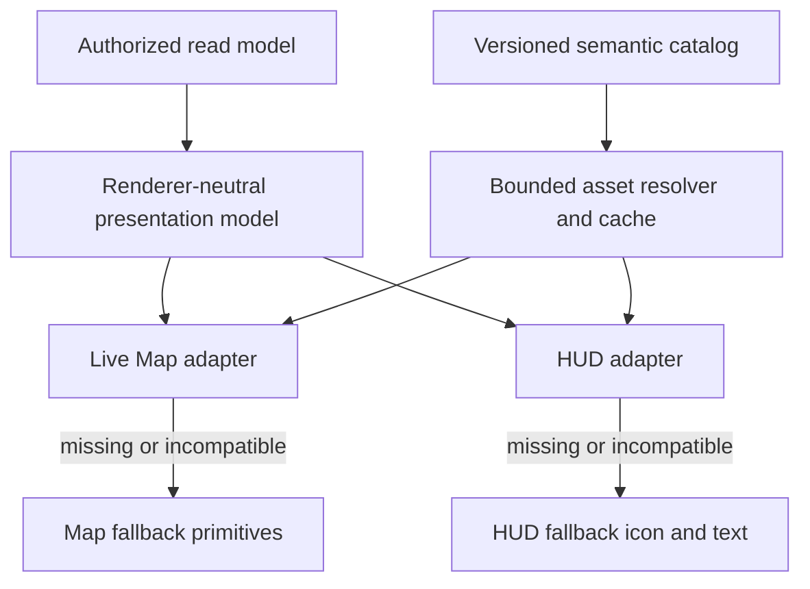

# Proposal: Visual Asset Management and Runtime Integration

**Decision state:** Draft for external and human review; no implementation or production adoption is authorized.

**Purpose:** Define a safe, replaceable path from approved visual experiments to assets consumed by the Live Map and HUD.

**Boundary:** this proposal does not change the Aseprite workflow's current `NO-GO`, select production art, or freeze the renderer, file layout, palette, resolution, style, or roster

## Table of contents

1. [Executive finding](#1-executive-finding)
2. [Why this proposal is separate](#2-why-this-proposal-is-separate)
3. [Verified repository state](#3-verified-repository-state)
4. [Scope and non-goals](#4-scope-and-non-goals)
5. [Requirements](#5-requirements)
6. [Proposed lifecycle and authority gates](#6-proposed-lifecycle-and-authority-gates)
7. [Identity and version model](#7-identity-and-version-model)
8. [Logical repository structure](#8-logical-repository-structure)
9. [Catalog and manifest contracts](#9-catalog-and-manifest-contracts)
10. [Live Map and HUD consumption](#10-live-map-and-hud-consumption)
11. [Replacement, cache invalidation, and rollback](#11-replacement-cache-invalidation-and-rollback)
12. [Build, validation, and provenance](#12-build-validation-and-provenance)
13. [Failure, security, and accessibility](#13-failure-security-and-accessibility)
14. [Migration and validation sequence](#14-migration-and-validation-sequence)
15. [Options and trade-offs](#15-options-and-trade-offs)
16. [Proposed decision records](#16-proposed-decision-records)
17. [Capability gates](#17-capability-gates)
18. [UNVERIFIED register](#18-unverified-register)
19. [Decisions explicitly unfrozen](#19-decisions-explicitly-unfrozen)
20. [External-review questions](#20-external-review-questions)
21. [Sources](#21-sources)

## 1. Executive finding

The current plans cover two ends of the visual workflow but not the production bridge between them:

- the Aseprite proposal governs safe, immutable **experimental candidate revisions**;
- the rendering proposals govern renderer-neutral presentation and recommend a versioned semantic visual
  registry;
- no reviewed document yet defines how a human-approved candidate becomes a managed project source,
  validated runtime artifact meeting a declared evidence level, activated release, or safely replaceable
  Live Map/HUD dependency.

That bridge should be a separate, independently authorized asset-lifecycle capability. It should not be a
side effect of drawing, experiment passage, file export, or MCP execution.

The recommended architecture boundary is:

1. preserve experiment candidates outside production asset trees;
2. require an explicit human adoption record for a named candidate revision;
3. copy the adopted editable source into a managed, immutable source revision;
4. derive sanitized runtime artifacts through a version-pinned build that meets its declared evidence level;
5. map semantic presentation keys to compatible artifact variants through separated logical contracts;
6. have `ASSET-0` select one deployment profile: a build-coupled frontend release or, only when justified,
   an independently activated catalog with an explicit client bootstrap/snapshot protocol;
7. let Live Map and HUD resolve semantic keys through surface-specific adapters, never through
   server-supplied paths;
8. retain the compatible prior deployable unit and its reachable artifacts for tested rollback.

The repository currently uses Vite, so build-coupled assets are the smaller default candidate for
investigation. That is not a deployment decision: production hosting, cache, update, offline, and native
requirements are not established. Do not implement both profiles by default.

This is a proposal only. The current primitive Canvas renderer remains the functioning baseline and
fallback. The Aseprite capability remains `NO-GO` for installation or execution until its own gates pass.

## 2. Why this proposal is separate

The experimental and production lifecycles have different authority and risk.

| Concern | Experimental drawing workflow | Managed runtime asset workflow |
|---|---|---|
| Goal | Answer a bounded visual question | Supply approved visuals reliably to game surfaces |
| Identity | experiment, concept, candidate, revision | semantic asset, source revision, artifact, deployable release |
| Storage | confined/disposable workspace and evidence store | reviewed repository/release-owned locations |
| Acceptance | `ACCEPTED_FOR_EXPERIMENT` | separately authorized adoption and activation |
| Consumer | human review and disposable display harness | Live Map and HUD asset resolvers |
| Mutation | new immutable candidate revision | new immutable source/artifact plus activation of the selected profile's complete deployable unit |
| Rollback | return to a prior candidate revision | restore a prior compatible deployable release |

Combining these paths would let experimental tooling implicitly publish production files, confuse visual
evaluation with release approval, and make renderer behavior depend on an MCP adapter. Keeping them separate
allows supervised drawing capability (`CAP-A`) to be proven without designing or operating a production
asset pipeline.

## 3. Verified repository state

The following are repository facts as of 2026-09-10:

- `frontend/src/constants/colors.ts` defines the current map `CELL_SIZE` as 16.
- `frontend/src/hooks/useCanvas.ts` draws terrain, entities, items, buildings, resources, and overlays as
  Canvas primitives. No sprite catalog or image-loading abstraction was found in the live frontend.
- `frontend/src/components/GameCanvas.tsx` owns the current Canvas surfaces and pixelated display scaling.
- `frontend/package.json` defines `tsc -b && vite build` and currently declares Vite 7.
- `frontend/vite.config.ts` has no asset-manifest, PWA, Service Worker, deployment, or custom public-base
  configuration. Vite's supported asset behavior is available but does not prove which profile this project
  should deploy.
- no Service Worker registration or application offline-cache implementation was found under `frontend/`.
- no production frontend deployment workflow, CDN contract, or independent asset release channel was found;
  the checked CI workflow builds the frontend for validation only.
- `.gitignore` excludes `frontend/dist/`; `.gitattributes` defines merge behavior but no project-specific
  Git LFS or binary-art policy.
- the renderer-neutral presentation store and semantic asset registry exist in planning, not in current
  frontend implementation.
- no `.aseprite` files or production pixel-art source tree were found in the checked repository paths.
- existing PNG files are experiment/rendering outputs; their presence does not establish a production
  asset convention.
- the live-map rendering proposal's `DR-18` recommends versioned semantic visual definitions and family
  fallback, but marks final schema detail as low-confidence.
- the Aseprite proposal expressly prevents an experiment candidate from becoming production art merely
  because it passes and leaves loading, atlases, manifests, renderer architecture, and production paths
  unfrozen.

The final repository layout, bundler behavior for asset URLs, CDN/release topology, supported browser/device
matrix, and production cache budget are `UNVERIFIED`.

## 4. Scope and non-goals

### In scope

- lifecycle boundaries from human-selected experiment revision to runtime activation;
- stable semantic identity independent of filenames, renderer paths, and runtime/generated entity IDs;
- editable sources, derived artifacts, logical registry/descriptors, release manifests, provenance, compatibility, replacement,
  rollback, and garbage-collection policy boundaries;
- separate Live Map and HUD consumers sharing versioned semantic identity and runtime-resolution contracts;
- validation, security, accessibility, missing-asset behavior, and migration gates;
- a logical structure that can later be mapped to real repository paths.

### Non-goals

- implementing, installing, registering, or executing Aseprite, MCP, asset tooling, or a renderer;
- importing current candidates into production;
- choosing Canvas, PixiJS, Godot, an atlas packer, storage service, or hot-reload system;
- proposing gameplay mechanics or changing authoritative simulation state;
- making runtime/generated IDs create unique art by default;
- finalizing exact schemas, directories, file formats, names, compression, or numeric budgets;
- replacing the display-harness plan or treating harness passage as production approval.

## 5. Requirements

### 5.1 Functional requirements

| ID | Requirement |
|---|---|
| `AM-F01` | A candidate can enter production consideration only through an explicit, attributable human adoption record. |
| `AM-F02` | Adoption preserves the exact candidate revision hash, brief, provenance, review evidence, and license status. |
| `AM-F03` | Editable sources and runtime artifacts have distinct identities and immutable revisions. |
| `AM-F04` | One semantic visual key can resolve to surface-, scale-, state-, or accessibility-specific variants without changing gameplay IDs. |
| `AM-F05` | Multiple generated/runtime identities can resolve to one visual family or safe fallback by default. |
| `AM-F06` | Live Map and HUD never receive arbitrary filesystem or network paths from simulation payloads. |
| `AM-F07` | An asset replacement activates as one complete compatible deployable release snapshot, never as an ambiguous partial overwrite. |
| `AM-F08` | A previous compatible release can be restored without rebuilding or redrawing assets. |
| `AM-F09` | Missing, corrupt, incompatible, or late assets fail loudly and visibly without crashing or hiding critical state. |
| `AM-F10` | Each release declares and proves its required repeatability, reproducibility, or functional-equivalence level; an unmet claim blocks that release. |
| `AM-F11` | Variant resolution is finite, deterministic, cycle-free, bounded, and records why a fallback was selected. |
| `AM-F12` | Every semantic role declares which critical information its fallback must preserve. |
| `AM-F13` | Retention and garbage collection cannot remove artifacts still reachable by active, rollback, supported-client, evidence, fixture, or in-flight references. |
| `AM-F14` | One deployment profile is selected from repository evidence; independent activation is not required when the frontend build is the safe deployable unit. |
| `AM-F15` | Every manual, CAP-A, or other candidate crosses one asset-owned versioned handoff and independent intake validation before adoption eligibility. |
| `AM-F16` | Later license, authorship, provenance, or policy invalidation can recall affected sources, artifacts, releases, caches, and future build eligibility without destroying required evidence. |

### 5.2 Quality and architecture requirements

- Keep the current 16-pixel map-cell constraint and native-scale evaluation explicit while final source and
  icon resolutions remain unfrozen.
- Critical identity cannot depend on hue alone; catalog metadata cannot waive visual review.
- Asset resolution is presentation-only. It cannot mutate `AuthoritativeState`, bypass the 39-phase
  mutation pipeline, or become a hidden gameplay rule.
- Runtime consumers depend on a narrow asset-resolution interface, not Aseprite, MCP, experiment memory,
  or editable-source formats.
- Releases are inspectable, bounded, cacheable, reversible, and explicit about the reproducibility level they have actually proven.
- A renderer change should require a new adapter or artifact variant, not a new gameplay namespace.

## 6. Proposed lifecycle and authority gates

```mermaid
flowchart LR
    C[Immutable experiment candidate]
    R[Human review]
    H[Human adoption approval]
    A[Adoption record]
    S[Managed source revision]
    B[Validated build with declared evidence level]
    K[Deployable release candidate]
    V[Map and HUD compatibility validation]
    X[Human activation approval]
    P[Active deployable generation]
    C --> R
    R -->|reject or revise| C
    R -->|select for adoption review| H
    H -->|approve exact revision and provenance| A
    H -->|decline; retain experiment state| C
    A --> S
    S --> B
    B --> K
    K --> V
    V -->|fail| S
    V -->|pass| X
    X -->|approve| P
    X -->|decline| K
```



The gates are deliberately asymmetric:

- `ACCEPTED_FOR_EXPERIMENT` means only that an experimental revision may support its bounded test.
- **Adoption approved** means an accountable human approved the exact revision, provenance, license status,
  intended semantic role, and bounded production consideration; selection for adoption review is not approval.
- **Adopted source** means a human has accepted exact provenance and repository ownership for continued work.
- **Release candidate** means artifacts and the applicable logical contracts passed mechanical checks; it
  is not active.
- **Active release** means a human authorized one complete, compatible deployable unit for the named
  environment under the selected profile.

No agent, scorer, MCP server, drawing tool, build process, or renderer may collapse these gates. Promotion
must be explicit, attributable, scope-bound, and idempotent.

## 7. Identity and version model

Three revision layers prevent replacement from overwriting history:

| Layer | Stable identity | Immutable version | Meaning |
|---|---|---|---|
| Editable source | `source_asset_id` | `source_revision` plus content hash | Human-editable authoritative art source after adoption |
| Runtime artifact | `artifact_id` | content hash plus build fingerprint | Sanitized PNG, sheet, atlas page, or renderer-specific derivative |
| Catalog release | `catalog_id` | monotonically distinct release ID plus manifest hash | Complete mapping activated for one compatibility contract |

Semantic lookup adds a fourth identity that is stable across replacement:

- `visual_key` names a presentation role such as an entity family, item family, skill grammar member, status
  semantic, terrain kind, HUD action, or safe placeholder;
- a `visual_key` is not a file path, database primary key, or generated entity ID;
- aliases are explicit, versioned compatibility entries, not silent filename redirects;
- presentation variants may include surface, scale class, state, animation tag, contrast mode, or render tier,
  but the permitted axes and cardinality remain to be proven;
- runtime identities resolve through reviewed family/template rules before catalog lookup.

Replacing an image normally preserves `visual_key` and creates a new source revision, artifact hash, and
catalog release. A semantic change creates a new key or a reviewed compatibility migration; it must not
silently reuse an old key with different meaning.

## 8. Logical repository structure

The proposal recommends logical ownership before choosing physical paths:

```text
visual-assets/
  sources/          # adopted editable sources; immutable revisions or version-control history
  definitions/      # semantic visual definitions and variant compatibility
  build-config/     # pinned export/packing rules and tool fingerprints
  generated/        # derived artifacts; never hand-edited
  manifests/        # immutable release candidates and activated release records
  provenance/       # adoption, license, source, build, and review references
  fixtures/         # bounded validation and fallback fixtures
```

This tree is illustrative, not an approved directory layout. A later repository investigation must decide
whether generated artifacts are committed, produced during builds, or attached to releases. The required
separation is conceptual:

1. experiment workspaces are not production sources;
2. editable sources are not runtime artifacts;
3. generated output is not hand-edited;
4. release manifests are not mutable “latest” files without immutable identity;
5. test fixtures cannot be mistaken for production assets.

A physical layout proposal must account for frontend bundling, possible native clients, large/binary-file
history, CI artifact retention, release packaging, and contributor workflow before approval.

### 8.1 Deployment profiles

#### Profile A — build-coupled frontend assets

The semantic registry, descriptors, runtime manifest, artifacts, and frontend client form one immutable
deployable release. Vite may include imported assets in its build graph, emit hashed output names, and
optionally emit a build manifest; the project must verify its actual chosen configuration. Activation and
rollback operate on the complete compatible frontend release. There is no asset-specific mutable pointer,
and an old tab continues using the assets bound to its client build.

This is the smaller current candidate because the repository already builds a Vite frontend and does not
show an independent asset service. It is not selected until deployment and rollback facts are established.

#### Profile B — independently activated catalog

The frontend client obtains an authenticated bootstrap/activation record, pins one immutable catalog
snapshot and generation, then loads content-addressed artifacts through an approved release channel. This
profile is justified only if asset replacement cadence, size, native packaging, or another measured need
outweighs its extra bootstrap, compatibility, caching, retention, and security machinery.

`ASSET-0` selects one profile and records why the other is unnecessary. A future requirement may trigger a
new decision; the first implementation must not build both speculatively.

## 9. Catalog and manifest contracts

The architecture has four logical contracts. A first implementation may store several in one reviewed file,
but their versions, consumers, and shipped fields remain separable.

**(2026-09-13) Disambiguation, added by review.** This section's "semantic registry / resolver / catalog"
vocabulary is presentation-layer only and intentionally distinct from the existing gameplay-content system
(`src/content/repository.py::CatalogRepository`, `src/content/resolver.py`, `data/content/`). The gameplay
catalog resolves deterministic pre-tick content data (what an entity/region *is*); this proposal's registry
resolves which visual artifact renders a given semantic key (how it *looks*). Verified non-conflicting by
direct inspection of both — no shared code path, no shared identifier namespace — but the naming overlap is
real enough that an implementer should not assume either system without checking which one a given ticket
means.

### 9.1 Semantic visual registry

The registry owns a finite `visual_key` namespace, family/template relationship, surface roles, required
information, and fallback-safety class. It defines the normalized syntax, case policy, maximum key length,
maximum keys per release, derivation owner, alias rules, and unknown-value behavior.

The renderer-neutral presentation boundary derives keys from bounded semantic enums or reviewed mappings.
Runtime/generated instance IDs never become keys, URLs, cache identities, or catalog entries. Unknown inputs
cannot trigger a network fetch or dynamic registration, and diagnostic cardinality is bounded.

### 9.2 Surface/renderer descriptor

The descriptor maps a semantic key to compatible presentation variants. It owns:

- allowed surface, scale/state/contrast/motion/tier axes and their strict precedence;
- immutable artifact reference;
- logical dimensions, frame/tag mapping, pivot/anchor, footprint, crop/overhang, composition slot,
  event/effect bindings, sampling, and renderer protocol compatibility;
- maximum variants per key/family, maximum fallback depth, explicit fallback edges, and cycle rejection;
- no implicit nearest/approximate match;
- stable recording of the selected variant and fallback reason.

Unsupported reduced-motion or accessibility variants follow an explicit safe fallback or block activation;
they are never guessed. Metadata describes compatibility, not artistic quality.

### 9.3 Minimal runtime release manifest

The shipped runtime contract binds exact schema/release identity, semantic/descriptor versions, client and
renderer compatibility ranges, artifact hashes, trusted publisher-generated locators, decoded bounds,
required fallbacks, fallback-contract version, and required capabilities. It excludes personal identities,
raw source paths, prompts, review notes, detailed license records, and complete provenance.

The manifest hash covers either its exact immutable stored bytes or one explicitly selected canonical
encoding. Strict parsing rejects duplicate fields, ambiguous values, unknown critical fields, and
nonconforming encodings. JSON and RFC 8785 are options, not decisions.

### 9.4 Protected audit/provenance package

The protected package retains adoption and activation records, human identities/roles, full license and
source provenance, build definition and attestations, validation evidence, source/artifact lineage,
deletion records, and review results. Runtime manifests reference it by immutable ID without shipping it to
every client.

### 9.5 Activation and bootstrap contract

For Profile A, activation is the existing reviewed deployment action for a complete frontend release; no
asset-only active pointer is introduced. Rollback restores a complete compatible frontend release.

For Profile B, activation is a separate append-only record that binds a manifest hash to environment,
strictly distinct generation, approving identity/authority/time, expected prior generation, compatibility
result, reason, and rollback eligibility. The active pointer advances only by validated compare-and-swap.

Profile B must additionally define how a client retrieves the bootstrap record; authenticated origin or
signature policy; integrity, authenticity, authorization, and freshness checks; cache headers/fetch mode;
generation pinning for a session/render transaction; whether open tabs switch or reload; multiple-tab,
Service Worker, HTTP/CDN cache, offline, and maximum-staleness behavior; old-client compatibility; late-load
fencing; and decoded-resource disposal. Server-side pointer serialization alone is not end-to-end atomic
client activation.

### 9.6 Candidate handoff and intake contract

Asset management owns a versioned `CandidateHandoffPackage`. Manual drawing and CAP-A are producer
classes; neither owns adoption semantics or may write managed source, artifact, release, or activation
state. The minimum package contains:

- schema version, candidate identity, immutable editable-source revision/hash and expected parent;
- producer class and the exact creator/editor/adapter/tool/version provenance available for that class;
- source MIME/format plus bounded dimensions, frames, cels, layers, palette, tags and animation metadata;
- preview/export hashes, brief/experiment identity and human-review evidence references;
- license/rights state and evidence reference;
- quarantine, revocation and producer-side validation state;
- declared limitations and unsupported features;
- an explicit `HANDOFF_IS_NOT_ADOPTION_PUBLICATION_OR_ACTIVATION` assertion.

Intake copies bytes into a new bounded quarantine/staging root; it never trusts a producer-controlled path.
An independent validator compares package claims with staged bytes, rejects path/symlink/format/resource
escape, verifies hashes and permitted structure, and records a new immutable intake result. A mismatch,
withdrawn right, unsupported feature or incomplete required field quarantines the package. Only a passing
intake may be presented to an accountable human for a separate adoption decision.

Manual and CAP-A candidates pass the same structural, security, provenance and rights policy. Fields that
cannot exist for a producer class are explicit `NOT_APPLICABLE` or `UNAVAILABLE` under policy, never
fabricated. Different evidence availability may affect adoption eligibility without changing the boundary.

## 10. Live Map and HUD consumption



### Live Map

The Live Map adapter resolves semantic world presentation roles into renderer-appropriate handles and
composition metadata. It owns world-space concerns such as cell anchoring, footprint, draw slot, cropping,
overhang, animation tag, and visibility-safe fallback. It must preserve the existing primitive renderer as
the initial control and rollback route.

### HUD

The HUD adapter resolves semantic interface and inspection roles into accessible icon/image handles. It
owns screen-space sizing, text/label pairing, alternative descriptions where meaningful, focus/contrast
states, and reduced-motion treatment. It must not reuse a map sprite merely because both surfaces refer to
the same gameplay concept; shared use must be an explicit compatible variant.

### Shared boundary

Both adapters may share catalog identity, decoding, integrity checks, cache policy, and provenance, while
retaining different surface composition rules. Neither adapter owns authoritative simulation state. A
missing visual may change presentation quality but cannot erase the corresponding entity, action, status,
or alert from accessible UI.

Resolution order is part of the versioned descriptor contract. It is deterministic, has no implicit
“closest” match, terminates within declared depth/cardinality bounds, and records bounded diagnostics. The
presentation boundary—not raw runtime data—owns semantic-key derivation.

Surface qualification is role-scoped. A map-only role requires the versioned Live Map descriptor/resolver
seam and map fixtures; a HUD-only role requires the applicable HUD seam and fixtures; a shared role
requires both. Unrelated HUD panels or map features do not block an isolated participating surface.
Final all-surface portfolio regression may still wait for the broader HUD/Live Map delivery program.

## 11. Replacement, cache invalidation, and rollback

Replacement follows immutable publication rather than in-place overwrite. The activated deployable unit
depends on the selected profile:

1. create a new source revision from an expected parent hash;
2. build new artifacts into staging with a pinned build fingerprint;
3. validate hashes, decoding, metadata, dimensions, catalog references, fallbacks, and surface fixtures;
4. publish a complete immutable frontend release candidate for Profile A or catalog release candidate for
   Profile B;
5. activate the complete frontend deployment for Profile A, or append an approved activation record and
   compare-and-swap the Profile B pointer;
6. invalidate caches by client/release identity and artifact hash, plus Profile B generation and decode
   configuration;
7. retain the previous manifest and referenced artifacts for the declared rollback window.

Each resolution or render transaction observes one immutable release snapshot and generation: client-build
identity for Profile A, or activation generation for Profile B. Loads started under an old generation may
finish for that old snapshot, but they cannot populate or replace current-generation cache entries. Cache
keys bind the applicable release/generation identity, immutable artifact hash, and decode/transform
configuration; a filename or semantic key alone is insufficient. The selected deployment must prove how
snapshot acquisition and switching provide these semantics before `ASSET-4`.

For Profile A, the client-build identity supplies the generation boundary and a rollback restores the whole
frontend deployable. For Profile B, the activation generation supplies it. An older asset release is
rollback-eligible only when its catalog schema, renderer protocol, client-build range, capability set, and
fallback contract accept the consuming client.

A deployment or activation failure leaves the previous deployable unit active. A runtime load failure uses
the safe fallback, records a bounded diagnostic keyed by semantic identity, release, and generation, and
must not retry without limits. Profile A rollback is an attributable redeployment of the whole previously
validated frontend release. Profile B rollback is a new, attributable activation of a previously validated
compatible manifest. Both require named human authorization or a preauthorized emergency policy and record
actor, reason, expected current generation, and result; neither reconstructs assets from a mutable source
tree during an incident.

Three fallbacks remain distinct:

- **per-semantic fallback** preserves declared information when one visual fails and remains durable;
- **release rollback** restores a previously validated compatible deployable unit;
- **migration rollback** temporarily disables the new resolver and returns to the old renderer path.

Migration rollback may be retired only through a later decision backed by stable resolver, failure,
accessibility, and release evidence. Information-preserving semantic fallback is not retired with it.

Artifact deletion is reachability-based. Roots include active releases, approved rollback candidates,
supported client/session pins or leases, in-flight publication and loads, retained evidence/provenance, and
validation fixtures. Deletion requires a dry run, a grace period longer than supported stale/offline use,
no publication/rollback lock, bounded deletion audit, and an approved policy for storage pressure. Absence
from the newest release is never sufficient.

Hot reload is optional and deferred. If later added for development, it must use the same staged validation
and distinct release identity rather than watching and serving arbitrary edited paths directly.

### Post-activation rights and provenance recall

A later license, authorship, provenance or policy invalidation marks the affected source revision,
artifacts, releases and future build eligibility as revoked without rewriting history. It prevents new
adoption, build, publication, activation and distribution. A named human authority or preauthorized
emergency policy must then roll back, disable or replace active use; failed recall remains a visible
incident rather than silently accepting continued use.

The selected deployment profile defines response for current clients, supported-old clients, open tabs,
Service Workers, HTTP/CDN caches and offline clients where applicable. Recall records bind reason,
authority, affected immutable identities, expected active generation, attempted actions, cache/distribution
status and result. Retain only bounded non-sensitive audit and legally required evidence. Recall places
holds on evidence/incident roots so garbage collection cannot erase material required for investigation.

Tests cover successful and failed recall, stale/offline clients, late loads, rollback unavailability,
concurrent publication and recovery. A revoked late completion cannot populate current cache state.

## 12. Build, validation, and provenance

The production build must be independent of the agent-control protocol. Aseprite may be one editable source
format and its pinned CLI may later be one exporter, but runtime consumers never require MCP or an AI agent.

The build trust boundary must be positive and allowlisted. Its selected confinement mechanism must:

- read only the exact adopted immutable source set, pinned configuration, and approved toolchain;
- write only to a newly created bounded staging root;
- deny network access, repository paths outside declared inputs, production asset roots, user credentials,
  SSH agents, release-pointer authority, and activation credentials;
- expose no caller-supplied code, paths, URLs, plugins, or undeclared tools;
- pass staged output to a separate validator/publisher that can publish only validated content-addressed
  artifacts and immutable manifests;
- keep activation authority in a separate human-approved release action.

The exact runner, OS confinement, publisher, and credential separation are `UNVERIFIED` and block any real
production build or activation.

Each stage declares one of three evidence levels:

1. **authoritative-platform repeatability** — the same pinned source, instructions, and declared build
   environment reproduce identical required bytes on the selected authoritative platform;
2. **cross-environment byte reproducibility** — independently realized declared environments reproduce
   identical required bytes;
3. **decoded functional equivalence** — pixels, frames, timings, transparency, and required metadata match
   under a declared comparison even if container bytes differ.

Early stages may require immutable verified artifacts plus authoritative-platform repeatability and decoded
equivalence. Cross-environment byte reproducibility is optional until a product/release need justifies it.
No level is inferred from Aseprite CLI support or version pinning; every claimed level requires retained test
evidence.

A future build record should capture:

- exact input source hashes and expected parents;
- builder/control-plane and isolated-runner identities; exporter, packer, sanitizer, tool-binary, lockfile,
  dependency, build-image, configuration, parameter, and platform fingerprints;
- deterministic operation/configuration identity;
- output hashes, dimensions, mode, alpha/transparency behavior, frames, tags, and decoded-size estimates;
- warnings, validation results, and reproducibility result;
- license/provenance and human adoption/activation references.

Provenance is generated or attested outside untrusted exporter output where practical and verified against
policy before publication. Merely storing provenance or pinning a version does not authenticate a build.

Required validation families should include:

- schema, reference, hash, duplicate-key, alias-cycle, and fallback-chain checks;
- decode, extreme-dimension, frame-count, palette/transparency, metadata, and resource-bound checks;
- Live Map anchor, footprint, crop/overhang, draw-order, visibility, native-scale, and missing-asset fixtures;
- HUD sizing, label pairing, focus, contrast, grayscale/non-hue, reduced-motion, and missing-icon fixtures;
- catalog compatibility, stale cache, partial publication, activation failure, and rollback rehearsal;
- checks for the declared repeatability, reproducibility, or functional-equivalence level on the selected
  build platform(s).

Mechanical checks cannot approve art quality. Native-scale human review remains required for readability and
attention hierarchy.

## 13. Failure, security, and accessibility

### Failure policy

- Each semantic role declares a fallback-safety class: critical information to preserve; allowed primitive,
  family, icon, border/pattern, label, DOM/HUD, or text alternative; and whether a missing key blocks
  activation, fails closed at runtime, or permits fallback.
- Unknown runtime IDs resolve through reviewed bounded semantics, not dynamic asset creation.
- Unknown semantic keys and missing artifacts render a loud safe placeholder plus accessible text where the
  surface contract requires it. A generic family fallback is never presumed safe.
- A required fallback missing from a release blocks activation.
- Corrupt or incompatible artifacts are quarantined and never partially activated.
- A catalog mismatch cannot silently select a “close enough” path outside declared compatibility rules.

### Security boundary

- Reject simulation-, candidate-, reviewer-, or other caller-controlled paths and URLs, absolute paths,
  traversal, unapproved schemes/origins, escaping symlinks, unsafe redirects, executable/scriptable inputs,
  unexpected MIME/format content, and undeclared metadata.
- Permit only trusted publisher-generated relative or content-addressed locators rooted in the selected
  release channel, with resolved origin/root, redirect, digest, byte, MIME/content, and decoded-bound checks.
- Decode with explicit byte, pixel, dimension, frame, layer, and time budgets.
- Strip unnecessary metadata from runtime derivatives and do not place raw review notes, prompts, paths, or
  MCP manifests in shipped catalogs.
- Pin tools and dependencies; record licenses and provenance before adoption.
- Keep experiment/MCP credentials and filesystem authority out of build and runtime consumers.
- Never allow an asset catalog or renderer to authorize simulation mutations.

The release threat model separates:

- **integrity:** bytes match the referenced digest;
- **authenticity:** metadata came from the trusted publisher/channel;
- **authorization:** an allowed actor approved the environment action;
- **freshness:** replayed, frozen, expired, or superseded metadata is detected according to policy.

`ASSET-0` decides whether authenticated deployment channels are sufficient or whether signatures are
needed, including trust bootstrap, key/credential rotation, mix-and-match, replay/freeze, wrong-target, and
publication-authority-compromise recovery. This vocabulary does not require adopting TUF.

### Accessibility boundary

- Critical distinctions remain available through silhouette, shape, border, pattern, label, position, or
  another non-hue channel.
- HUD icons that convey actions or state require a text/accessibility contract; images alone are insufficient.
- Animation is nonessential, bounded, and compatible with reduced motion.
- Fallbacks preserve information even when all images fail.

## 14. Migration and validation sequence

These are proposal stages, not implementation authorization:

| Stage | Authorization prerequisite | Covered gates | Outcome | Explicit non-goal |
|---|---|---|---|---|
| `ASSET-0` Contract investigation | Planning/document review only | `AM-C01` | Select one deployment profile; resolve owners, contract split, threat model, build boundary, client policy, rollback authority, and UNVERIFIED items | No code, asset import, or tooling execution |
| `ASSET-1` Synthetic contract harness | Separate implementation ticket and normal workflow approval | `AM-C02`; evidence toward `AM-C05`–`AM-C07` and `AM-C09` | Prove bounded resolution, safety classes, strict manifests, snapshot fencing, accessible fallbacks, rollback, and GC dry run with tiny synthetic fixtures | No real candidate or production activation |
| `ASSET-2` Source/build rehearsal | Separate execution authorization after `AM-C01`–`AM-C02` | `AM-C03`, `AM-C04`, `AM-C08` | Produce a non-authoritative adoption-candidate/build dry-run package | No adopted-source state or active asset |
| `ASSET-3` Surface compatibility rehearsal | Separate candidate-transfer and harness authorization | `AM-C05`–`AM-C07` | Exercise one candidate in isolated Live Map/HUD harnesses as applicable | No normal-path rollout |
| `ASSET-4` Bounded activation pilot | Explicit human pilot authorization after `AM-C01`–`AM-C09` pass for the selected profile | `AM-C10` | Activate and roll back one noncritical semantic role | No broad migration |
| `ASSET-5` Incremental migration | Per-family adoption and rollout authorization; no inherited pilot authority | Re-run affected gates | Move only reviewed compatible families | No forced renderer migration |

`ASSET-0` can be planned while Aseprite remains `NO-GO`. Stages involving an Aseprite-produced candidate
depend on the applicable drawing-workflow gates, but the asset architecture must also accept manually made
or other approved sources. `CAP-A` therefore remains deliverable without this production track.

Stop the affected path if authority is missing, provenance or licensing is incomplete, source/artifact
identity is ambiguous, the declared validation/evidence level fails, a required fallback or rollback route is absent,
runtime paths escape the approved root, critical information disappears on asset failure, or adoption would
freeze a decision reserved for art experiments.

## 15. Options and trade-offs

### 15.1 Direct paths in gameplay payloads

**Benefit:** minimal initial client code.
**Costs:** couples server data to renderer storage, permits path/URL abuse, makes replacement and fallback
hard to audit, and conflates runtime IDs with authored art.
**Disposition:** reject.

### 15.2 Renderer-local switch statements

**Benefit:** simple for the current small primitive renderer.
**Costs:** duplicates mapping across Live Map and HUD, scatters fallbacks, and makes releases/version drift
implicit.
**Disposition:** retain only as the existing rollback implementation; do not make it the asset architecture.

### 15.3 Versioned semantic catalog with immutable releases

**Benefit:** decouples gameplay, art, and renderer paths; supports surface variants, controlled replacement,
fallback, caching, and rollback.
**Costs:** introduces schemas, build ownership, validation, and release bookkeeping before asset volume is
known.
**Disposition:** recommend at the boundary level; prove the smallest useful schema before expanding it.

### 15.4 Build-coupled versus independently activated deployment

Build-coupling reuses the frontend release boundary, reduces skew, and fits Vite's normal imported-asset
graph, but requires a frontend deploy for each art replacement. Independent activation permits separate
cadence and potentially smaller updates, but adds bootstrap, cache, compatibility, trust, retention, and
operational authority. `ASSET-0` selects the smallest profile supported by real deployment needs; do not
implement both.

### 15.5 Committed artifacts versus build/release artifacts

Committing derived files simplifies local builds and review but can grow history and permit source/artifact
drift. Building them in CI reduces binary history but adds tool availability, licensing, determinism, and
release-retention requirements. The repository lacks enough evidence to decide; `ASSET-0` must compare both,
including a hybrid where small runtime files are committed and packed releases are generated.

### 15.6 Individual files versus atlases

Individual immutable files simplify early replacement and debugging. Atlases may reduce requests/draw
overhead but enlarge replacement scope and require packing stability. Begin catalog design without assuming
atlases; authorize packing only from measured renderer/build evidence.

## 16. Proposed decision records

### AM-DR-01 — Separate experiment acceptance from production adoption

- **Recommendation:** require a distinct human adoption record and never infer it from experiment passage.
- **Trade-off:** additional review step in exchange for clear authority and provenance.
- **Revisit trigger:** none; automation may prepare a record but may not erase the authority boundary.

### AM-DR-02 — Stable semantic keys, not paths or runtime IDs

- **Recommendation:** game projections expose semantics; clients resolve versioned visual definitions.
- **Trade-off:** catalog maintenance in exchange for renderer and storage independence.
- **Revisit trigger:** schema usability evidence, not convenience of direct paths.

### AM-DR-03 — Immutable three-layer revisioning

- **Recommendation:** independently identify source revisions, derived artifacts, and catalog releases.
- **Trade-off:** more identities and retention in exchange for reproducibility and rollback.
- **Revisit trigger:** measured storage/operation cost after a bounded pilot; immutability remains required.

### AM-DR-04 — Shared catalog, surface-specific adapters

- **Recommendation:** share semantic identity and integrity machinery while keeping map and HUD composition
  contracts separate.
- **Trade-off:** some variant duplication in exchange for avoiding false map/HUD equivalence.
- **Revisit trigger:** evidence that one declared variant is compatible on both surfaces.

### AM-DR-05 — Deployment profile before activation mechanics

- **Recommendation:** select build-coupled or independently activated delivery in `ASSET-0`; within the
  selected profile, clients consume one compatible immutable release snapshot.
- **Trade-off:** build-coupling costs replacement cadence; independent activation costs bootstrap,
  compatibility, cache, trust, and retention machinery.
- **Revisit trigger:** a measured delivery requirement cannot be met by the selected profile.

### AM-DR-06 — Preserve primitive and accessible fallbacks

- **Recommendation:** missing art degrades to explicit primitives/icons/text without hiding critical state.
- **Trade-off:** fallback maintenance in exchange for resilient and accessible operation.
- **Revisit trigger:** fallback form may evolve; the information-preservation requirement does not.

## 17. Capability gates

Every gate records setup/fixtures, exact repository and environment revisions, retained raw evidence,
reviewer, result, and allowed conclusion. For every row:

- `PASS` means valid evidence satisfies every stated condition;
- `FAIL` means a valid run violates at least one mandatory condition;
- `BLOCKED` means a named prerequisite or authorization was absent, so the run did not proceed;
- `INCONCLUSIVE` means work ran but its evidence was invalid, insufficient, contaminated, or ambiguous.

No missing result defaults to pass. A failed production gate does not invalidate the disposable art harness
unless its failure also violates that harness's independently stated controls.

Evidence gathered before a gate's complete setup is available may be retained as **contributing evidence**.
It cannot yield that gate's `PASS`, `FAIL`, or `INCONCLUSIVE` result and does not authorize a later stage.

| Gate | Required setup and retained evidence | PASS condition | FAIL trigger | BLOCKED condition | INCONCLUSIVE condition |
|---|---|---|---|---|---|
| `AM-C01` Repository/deployment fit | Instructions, owners, Vite/build/deploy/cache/offline/native facts, profile comparison, authority map | One smallest valid profile and its unresolved prerequisites are approved for planning | Profile is assumed, both are mandated without need, or authority/deployment facts conflict | Applicable instructions, accountable owners, or deployment evidence are unavailable | Evidence exists but cannot distinguish the profiles or resolve a material contradiction |
| `AM-C02` Semantic resolution | Finite-key fixtures, normalization, precedence, variants, cycles, depth/cardinality, unknowns, diagnostics | Every lookup is deterministic, bounded, explainable, and performs no dynamic fetch/creation from unknown input | Any ambiguity, unbounded key/cardinality, cycle, closest-match guess, or unknown-triggered fetch | Schema/fixture charter or synthetic-harness authorization is absent | Runs complete but coverage or diagnostics cannot establish determinism and bounds |
| `AM-C03` Source/artifact separation | Adoption-candidate, immutable source, build definition, artifact digest, lineage/provenance records | Identities remain distinct, immutable, traceable, and no dry run creates adopted/active state | Overwrite, ambiguous parentage, missing lineage, or implicit adoption | Authorized source/build rehearsal or required identity contract is absent | Hashes, lineage, or provenance cannot be independently verified |
| `AM-C04` Build isolation | Hostile files/metadata, denied path/network/secret tests, resource limits, runner and validator/publisher evidence | Allowlisted inputs/staging and separated publication/activation authority hold under every negative test | Escape, undeclared tool/code, network/secret access, unbounded decode, or build authority can activate | A confinement platform, threat fixtures, or execution authorization is absent | Test instrumentation or platform behavior leaves a denied capability unproven |
| `AM-C05` Release consistency | Selected-profile client bootstrap/build binding, caches/tabs/workers/offline as applicable, late loads | A client/render transaction consumes one compatible immutable snapshot and stale completions cannot contaminate it | Mixed generations, stale cache population, or origin pointer claimed atomic without client proof | Deployment profile, client matrix, or applicable cache/bootstrap fixture is unresolved | Observations cannot attribute a mix/stale result or omit a supported client state |
| `AM-C06` Compatibility/rollback and recall | Current and supported-old client builds, compatibility ranges, failure/emergency rollback, rights-recall and stale/offline response records | Compatible rollback and required recall succeed; incompatible rollback rejects; actions are attributable and preserve the prior safe unit/evidence | Incompatible release loads, partial rollback/recall, revoked distribution continues contrary to policy, missing authority/audit, or required artifact unavailable | Rollback/recall authority, supported-client range, or retained release fixture is unavailable | Some declared compatibility, recall or failure path lacks valid evidence |
| `AM-C07` Accessibility/failure preservation | Per-role safety classes; missing/corrupt catalog/artifact/cache/animation fixtures; native-scale and HUD alternatives | Declared critical information and operability survive every allowed failure without hue-only dependence | Any critical identity/action/state disappears or unsafe generic fallback is accepted | Semantic role, preserved-information contract, reviewer, or accessible alternative is undefined | Evidence cannot establish native-scale or assistive information equivalence |
| `AM-C08` Reproducibility/provenance | Declared evidence level, pinned source/environment/build, independent provenance verification, candidate intake and post-approval revocation fixture | Required level passes; verified provenance binds builder, inputs, parameters, outputs and policy; revoked/quarantined input cannot build | Claimed level fails, provenance is unauthenticated/incomplete, pinning is treated as proof, or revoked input remains build-eligible | Required evidence level, authoritative environment, intake or verification policy is undefined | Outputs cannot be compared validly or provenance/rights authenticity remains unresolved |
| `AM-C09` Retention/garbage collection | Reachability roots, leases/pins, grace window, in-flight locks, dry run, deletion audit, storage-pressure case | Only unreachable eligible artifacts are proposed/deleted and rollback/supported clients remain intact | Reachable/in-flight artifact deletion, newest-only policy, absent dry run/audit, or unsafe pressure override | Retention owners, roots, stale/offline window, or deletion authorization are undefined | Reachability, lease, in-flight, or storage-pressure evidence is incomplete/ambiguous |
| `AM-C10` Bounded activation | Explicit later authorization, one noncritical role, selected profile, prior gates, monitoring and rollback rehearsal | Activation and rollback preserve consistency, accessibility, authority, and the prior working route | Broad migration, inherited authority, partial activation, failed rollback, or hidden critical information | Explicit pilot authorization or any required `AM-C01`–`AM-C09` pass is absent | Pilot runs but monitoring, attribution, consistency, accessibility, or rollback evidence is invalid/incomplete |

## 18. UNVERIFIED register

| ID | Missing fact or decision | Resolution task | Blocks |
|---|---|---|---|
| `AM-U01` | Physical production asset directories and ownership | Inventory build/release conventions and propose reviewed paths | Any repository import |
| `AM-U02` | Whether editable sources and generated binaries belong in Git, LFS, CI, or release storage | Compare history size, licensing, offline builds, review, retention, and recovery | Storage decision |
| `AM-U03` | Supported browser/device/native matrix, hosting, CDN/HTTP cache, offline, and stale-client policy | Record actual deployment targets and test Vite/conditional native packaging | Deployment-profile choice |
| `AM-U04` | Minimum four-contract split, manifest encoding/hash bytes, strict parser, and compatibility policy | Prototype with synthetic fixtures; compare exact-byte hashing with an explicitly canonical encoding | Runtime contract implementation |
| `AM-U05` | Required asset families and scale/variant cardinality | Derive only from passed art experiments and committed UI/map needs | Capacity and packing |
| `AM-U06` | Source/export formats and pinned production tools | Compare approved manual export, Aseprite CLI, and other deterministic options after license review | Automated build |
| `AM-U07` | Reproducibility across supported platforms | Run same pinned input/build on selected environments and compare normalized outputs | Reproducible release claim |
| `AM-U08` | Cache, memory, startup, decode, and retention budgets | Measure representative synthetic/candidate bundles and obtain owners' thresholds | Activation gates |
| `AM-U09` | Integrity, authenticity, authorization, freshness, trust bootstrap, signing/channel, rotation, replay/freeze, mix-and-match, and compromised-publisher recovery requirements | Threat-model the selected deployment; choose the minimum authenticated-channel or signature policy without presuming TUF | Release trust decision |
| `AM-U10` | Hot reload need and safe development boundary | Observe contributor workflow after the static path works | Hot reload |
| `AM-U11` | Atlas necessity and packing stability | Compare individual files with measured renderer workloads | Atlas adoption |
| `AM-U12` | Catalog/release approver, art adopter, build owner, renderer owner, and rollback owner | Assign accountable roles before execution | Any activation |
| `AM-U13` | License policy for authored, generated, adapted, and third-party visual sources | Legal/project policy review with provenance fields | Adoption |
| `AM-U14` | Exact relationship between catalog version and renderer protocol negotiation | Reconcile with renderer and cross-surface architecture before schema approval | Multi-client compatibility |
| `AM-U15` | Selected-profile mechanism for deployable snapshots, generation identity, switching, and in-flight cache fencing | Prove whole-build identity for Profile A or compare-and-swap activation for Profile B, plus concurrent loads, stale completions, and snapshot consistency | `ASSET-4` |
| `AM-U16` | Build-runner confinement, validator/publisher separation, and activation-credential isolation | Select a platform and prove the positive allowlist plus denied network, secret, repository, production-root, and activation access | Any real production build |
| `AM-U17` | Human and emergency rollback authority, audit retention, and response expectations | Approve a bounded rollback policy and rehearse attributable failure/success paths | `ASSET-4` |
| `AM-U18` | Build-coupled versus independently activated deployment profile | Inspect real Vite build, hosting, replacement cadence, rollback, native, cache, and operations requirements; select one | `ASSET-1` profile fixtures and all later work |
| `AM-U19` | Client bootstrap, tabs/workers, cache, offline, late-load, disposal, and maximum-staleness semantics | Required only to select Profile B; design and test the end-to-end snapshot protocol | Profile B implementation |
| `AM-U20` | Finite semantic-key namespace, derivation owner, normalization, precedence, bounds, and diagnostic budget | Reconcile renderer-neutral planning with real API/types and synthetic adversarial fixtures | `AM-C02` |
| `AM-U21` | Per-role fallback safety classes and accessible HUD/read-model alternatives | Inventory committed semantic roles only after art/HUD needs are known; define preserved information | `AM-C07` and real activation |
| `AM-U22` | Reachability roots, supported leases/pins, grace period, evidence retention, deletion authority, and storage-pressure policy | Model both deployment profiles and prove a GC dry run with synthetic history | `AM-C09` |
| `AM-U23` | Rights/provenance recall authority, legal evidence retention, supported stale/offline response and distribution/cache invalidation capability | Define the selected profile's recall policy and run current/stale/offline success and failure rehearsals | `AM-C06`, `AM-C08` and any activation |

## 19. Decisions explicitly unfrozen

- final sprite and icon resolution;
- final palette, color ramps, art style, and shape language;
- status/effect and full skill rosters;
- Place representation, footprint, and transformation treatment;
- faction-emblem breadth;
- animation frame count, timing, and production scope;
- production renderer or engine;
- physical asset directory layout and naming convention;
- editable and runtime file formats;
- atlas, packing, compression, CDN, storage, and hot-reload choices;
- exact catalog/manifest schema and version syntax;
- build-coupled or independently activated deployment until `ASSET-0`;
- trust/signing, bootstrap, cache, stale/offline-client, and garbage-collection mechanisms;
- final asset families, counts, variants, and migration order;
- whether any current experimental candidate is adopted;
- unique art for runtime/generated IDs, which remains disallowed by default unless separately justified.

## 20. External-review questions

The external reviewer should treat this proposal and prior AI work as hypotheses and answer:

1. Does the separation among experiment revision, adopted source, runtime artifact, and active deployable release
   close the authority gap without unnecessary machinery?
2. Can the proposed semantic-key boundary support both Live Map and HUD while keeping their composition and
   accessibility responsibilities independent?
3. Are replacement, atomic activation, cache invalidation, and rollback specified strongly enough without
   assuming a renderer or deployment platform?
4. Does any path accidentally allow MCP/agent output, a passed experiment, build success, or an external
   score to become production art without human adoption and activation?
5. Are source, artifact, catalog, provenance, and license identities sufficient to reproduce and audit a
   release? Which fields are premature or missing?
6. Are the security limits adequate for hostile images, metadata, paths, oversized decodes, dependency
   compromise, and catalog drift?
7. Does the migration sequence preserve the current Canvas/primitives baseline and allow independent
   progress from the Aseprite capability work?
8. Which claims require repository experiments or owner decisions and should be moved to the `UNVERIFIED`
   register?
9. Does this conflict with the visual-system, rendering-engine, Live Map/HUD integration, or Aseprite plans?
10. What is the smallest useful `ASSET-0`/`ASSET-1` scope that proves the boundary before real art adoption?

Review approval would authorize only revision of this proposal or later detailed planning. It would not
authorize installation, implementation, pilot execution, asset creation, candidate adoption, or production
activation, and it would not change the Aseprite proposal's current `NO-GO` status.

## 21. Sources

### Repository implementation

- [`frontend/src/constants/colors.ts`](../../../frontend/src/constants/colors.ts)
- [`frontend/src/hooks/useCanvas.ts`](../../../frontend/src/hooks/useCanvas.ts)
- [`frontend/src/components/GameCanvas.tsx`](../../../frontend/src/components/GameCanvas.tsx)
- [`frontend/src/App.tsx`](../../../frontend/src/App.tsx)
- [`frontend/package.json`](../../../frontend/package.json)
- [`frontend/vite.config.ts`](../../../frontend/vite.config.ts)
- [`.github/workflows/test.yml`](../../../.github/workflows/test.yml)
- [`.gitignore`](../../../.gitignore)
- [`.gitattributes`](../../../.gitattributes)

### Related proposals and plans

- [Live-map rendering architecture proposal](live_map_rendering_engine_architecture_proposal.md), especially `DR-18`
- [Live Map/HUD surface integration architecture](live_map_hud_surface_integration_architecture.md)
- [Aseprite MCP pixel-art workflow proposal](aseprite_mcp_pixel_art_workflow_proposal.md)
- [Visual-system planning](visual-system-planning.md)
- [Render and art program review handoff](render-and-art-review-handoff.md)
- [Rendering overview](rendering-overview.md)
- [Manual art experiment execution plan](../../plans/render-and-art/07_manual_art_experiment_execution_plan.md)
- [Aseprite agent-controlled pixel-art milestone plans](../../plans/aseprite-mcp-pixel-art/README.md)

### Higher authority

- [Authoritative mutation pipeline](../../engine/authoritative_pipeline.md)

### External primary references checked for this revision

- [Vite static asset handling](https://vite.dev/guide/assets)
- [Vite build manifest option](https://vite.dev/config/build-options#build-manifest)
- [Vite public base path](https://vite.dev/guide/build#public-base-path)
- [W3C Service Workers specification](https://www.w3.org/TR/service-workers/)
- [SLSA build requirements](https://slsa.dev/spec/v1.2/build-requirements)
- [SLSA artifact verification](https://slsa.dev/spec/v1.1/verifying-artifacts)
- [The Update Framework specification](https://theupdateframework.github.io/specification/latest/) — threat vocabulary only; not an adoption decision
- [Reproducible Builds definition](https://reproducible-builds.org/docs/definition/)
- [Reproducible Builds environment boundary](https://reproducible-builds.org/docs/perimeter/)
- [RFC 8785 JSON Canonicalization Scheme](https://www.rfc-editor.org/rfc/rfc8785.html) — optional reference; not selected
- [OWASP File Upload Cheat Sheet](https://cheatsheetseries.owasp.org/cheatsheets/File_Upload_Cheat_Sheet.html)
- [Aseprite CLI documentation](https://www.aseprite.org/docs/cli/)
