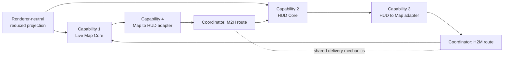
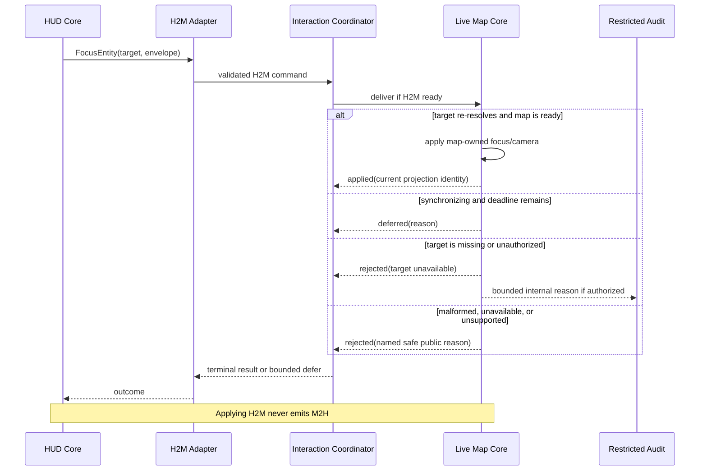
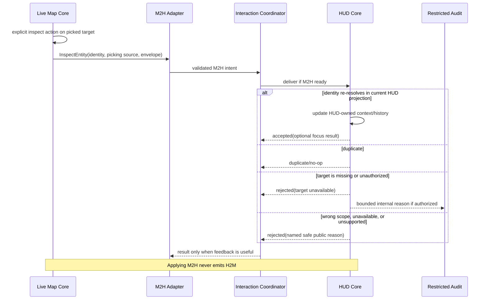
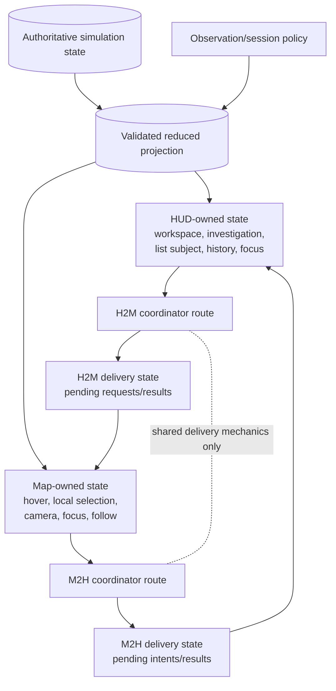
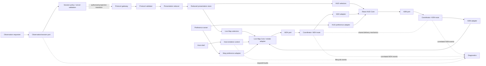
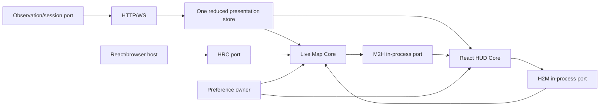
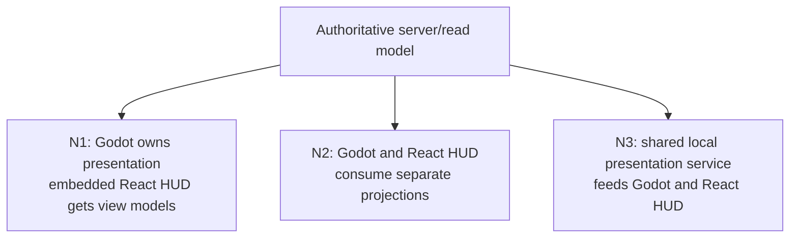

# Live Map and HUD Surface Independence and Cross-Surface Interaction Architecture


**Owners:** accountable people assigned in M0; candidate areas: live-map, HUD, frontend protocol/session, host integration, accessibility  
**Decision state:** proposed architecture; authorizes milestone planning only  
**Purpose:** make Live Map and HUD independently operable while making each cross-surface direction explicit, typed, observable, testable, and reversible.

## Table of contents

- [1. Authority and relationship](#1-authority-and-relationship)
- [2. Scope, terms, and non-goals](#2-scope-terms-and-non-goals)
- [3. Evidence and current mismatch](#3-evidence-and-current-mismatch)
- [4. Four-capability model](#4-four-capability-model)
- [5. Independence dimensions](#5-independence-dimensions)
- [6. Live Map Core](#6-live-map-core)
- [7. HUD Core](#7-hud-core)
- [8. Contract families and HUD to Live Map interaction](#8-contract-families-and-hud-to-live-map-interaction)
- [9. Live Map to HUD investigation contract](#9-live-map-to-hud-investigation-contract)
- [10. State ownership](#10-state-ownership)
- [11. Coordinator and envelope](#11-coordinator-and-envelope)
  - [11.1 Target component architecture](#111-target-component-architecture)
  - [11.2 Current-to-target migration](#112-current-to-target-migration)
  - [11.3 Per-message freshness and delivery policy](#113-per-message-freshness-and-delivery-policy)
- [12. Functional requirements](#12-functional-requirements)
- [13. Non-functional requirements](#13-non-functional-requirements)
- [14. Runtime, deployment, and failure-domain mappings](#14-runtime-deployment-and-failure-domain-mappings)
- [15. Isolation harnesses and flags](#15-isolation-harnesses-and-flags)
- [16. Tests and cross-surface experiments](#16-tests-and-cross-surface-experiments)
- [17. Failure and recovery](#17-failure-and-recovery)
- [18. Security and accessibility](#18-security-and-accessibility)
- [19. Milestones and planning readiness](#19-milestones-and-planning-readiness)
- [20. Decision records](#20-decision-records)
- [21. Open questions and blockers](#21-open-questions-and-blockers)
- [22. Sources and contradiction log](#22-sources-and-contradiction-log)

## 1. Authority and relationship

This document is the detailed source of truth for Live Map/HUD **surface independence, directional interaction contracts, cross-surface coordination, isolated test modes, and integration readiness**.

- [The rendering proposal](live_map_rendering_engine_architecture_proposal.md) owns live-map renderer evaluation, presentation architecture, and Canvas/PixiJS/Godot/Unity gates. Its renderer requirements apply to Live Map Core, not to HUD Core.
- [The HUD delivery roadmap](../../plans/hud_delivery_roadmap.md) owns detailed HUD UX, panels, information hierarchy, and delivery order.
- [The live-map scaling roadmap](../../plans/live_map_scaling_roadmap.md) owns reconnection, renderer performance, and interest-management sequencing.
- This document does not reopen renderer selection, redesign the HUD, or freeze art direction. Existing semantic readability constraints continue to apply.
- If summary wording in the rendering proposal conflicts with this document on cross-surface interaction, this document governs that subject. The authoritative simulation and read-model rules remain higher authority.

Labels used below:

- **RF** — repository fact verified in checked-out implementation.
- **PF** — active planning fact.
- **PD** — proposed decision in this document.
- **D** — explicitly deferred.
- **OQ** — unresolved question.

## 2. Scope, terms, and non-goals

The four capabilities are:

1. **Live Map Core (LM):** presents and locally manipulates a spatial world view without changing HUD investigation context.
2. **HUD Core (HUD):** presents and navigates investigation workflows without changing map-local focus or camera.
3. **HUD → Live Map (H2M):** explicit semantic requests from HUD to map.
4. **Live Map → HUD (M2H):** explicit semantic investigation intents from map to HUD.

“Core ready” means a core passes its own contract and harness with both directional adapters disabled. “Integrated ready” means both cores and both directional adapters pass their gates together. Neither phrase implies a production rollout.

Out of scope:

- renderer or engine selection;
- HUD panel or navigation redesign;
- simulation commands, gameplay rules, or direct authoritative mutation;
- new network services, duplicate reducers, or separate deployables without evidence;
- final sprite/icon size, palette, art style, status/effect roster, skill roster, Place representation, or faction-emblem breadth;
- implementation, dependencies, tickets, or production flags.

## 3. Evidence and current mismatch

### 3.1 Verified implementation facts

- `App.tsx` creates one `useSimulation` instance and passes the same entity selection and contextual callbacks to `GameCanvas` and `Sidebar`.
- `useSimulation.ts` owns `selectedEntityId`; that value also requests the selected subject's richer state, so HUD selection, map selection, and observation are currently conflated.
- `GameCanvas.tsx` already owns pan, zoom, viewport, minimap navigation, and local location focusing.
- `useCanvas.ts` owns hover locally, but map clicks call application callbacks that directly change HUD context.
- `Sidebar.tsx` derives modes from shared entity/building/loot selection and auto-switches tabs when context changes.
- `SimulationLoadingGate` wraps the map rather than the whole HUD, so the HUD can remain mounted while the map is loading or unavailable.
- No production interaction coordinator, directional adapter pair, or cross-surface envelope was found.
- The browser uses one application runtime and one simulation hook. Existing frontend tests do not exercise the six isolation modes in Section 15.

### 3.2 Planning facts

- HUD M1 plans durable, separated navigation state; M2 plans the notice → locate → inspect → follow → return workflow.
- The HUD roadmap explicitly treats live-map scaling as independent, with only a soft data-availability relationship.
- The rendering proposal preserves React/DOM HUD ownership and recommends one renderer-neutral reduced store for the browser path.
- Live-map renderer and interest-management work remain evidence-gated. Current art choices remain unfrozen.

### 3.3 Correction

The target architecture must stop treating “selected” as one shared mutable concept. State values may deliberately coincide, but coincidence is not ownership. A shared projection store is a data topology choice, not permission for either surface to mutate the other's interaction state.

## 4. Four-capability model



The arrows carry semantic intents, acknowledgements, or results—not authoritative game state. Both cores remain useful with `H2M=false` and `M2H=false`. Both adapters are mandatory only at the integrated-product gate.

| Capability | Independent readiness | Required for integrated readiness | Independent rollback |
|---|---|---|---|
| Live Map Core | Yes | Yes | Renderer/core release unit |
| HUD Core | Yes | Yes | HUD/core release unit |
| HUD → Live Map | No effect on core readiness | Yes | Disable H2M adapter |
| Live Map → HUD | No effect on core readiness | Yes | Disable M2H adapter |

## 5. Independence dimensions

| Dimension | Required interpretation | Recommended default | Evidence that may justify physical separation |
|---|---|---|---|
| Functional independence | Each core performs primary workflows with adapters off | Mandatory | None; this is a logical requirement |
| State ownership | Every interaction concept has one owner | Explicit owned slices plus shared read-only projection | Ownership/team or reliability conflict |
| Data-source topology | Sharing data does not mean sharing interaction state | One reduced store/selectors in browser | Security scopes, material fan-out/performance, or native ownership |
| Runtime topology | Logical ports work in-process or across a boundary | One browser runtime | Approved native or embedded-runtime scenario |
| Deployment topology | Packaging is separate from capability boundaries | Ship browser surfaces together | Independent release/operations requirement |
| Test isolation | Cores accept fixtures and fake/no-op ports | Six harness modes | None |
| Rollback isolation | Either direction can be disabled without reverting a core | Two directional switches | None |

Logical separation comes first. This model does **not** require four apps, four services, four connections, duplicated authority, duplicated reducers, or separate artifacts.

## 6. Live Map Core

### Responsibilities

- Consume validated authoritative/read-model presentation input through renderer-neutral selectors.
- Load map/terrain and present static and dynamic world layers, entities, objects, fog, visibility, and remembered-world state.
- Reconcile ticks to frames without inventing outcomes.
- Own camera, pan, zoom, resize, map-local focus, optional follow, minimap navigation, hover, picking feedback, local selection outline, and bounded world-space tooltips/overlays.
- Present targeting, range, HP, objectives, threat, effects, reduced motion, render tiers, missing assets, and unknown semantic IDs according to the rendering proposal.
- Expose reconnect/resync/staleness/fallback, diagnostics, performance capture, and replay behavior.
- Emit an M2H intent only for an explicit investigation action.

### Non-goals

- Owning HUD workspace, inspector, tab, route, list selection, history, filters, or panel modality.
- Opening a HUD inspector merely because hover or map-local selection changed.
- Approving gameplay commands or mutating `AuthoritativeState`.
- Parsing renderer-specific details into cross-surface contracts.

### Core readiness

LM Core is ready when it passes its renderer/protocol gates with a no-op M2H port, preserves map-local interaction, exposes map unavailable/stale states, and never changes HUD state. Renderer selection remains governed by the parent proposal.

### Isolated harness

Provide a fixed snapshot/delta/replay fixture, camera/input script, fake clock, missing-ID cases, disconnect/gap cases, and a no-op M2H collector. Assertions cover semantic output, local interaction, diagnostics, recovery, native-scale readability, and absence of HUD calls.

## 7. HUD Core

### Responsibilities

- Consume renderer-neutral presentation selectors for entities, objects, events, connection state, and permitted observation data.
- Own route/workspace, investigation history, selected/list subject, open inspector and tab, filter/search, scroll/return context, focus management, and accessible DOM interaction.
- Own the roadmap's notice, inspect, relationship-following, history, and return-context work inside the HUD; explicit locate/follow effects are H2M requests whose application is not part of HUD Core readiness.
- Show map unavailable, pending request, rejection, stale target, and unsupported-capability states without losing investigation context.
- Issue H2M commands only from explicit user actions.

### Non-goals

- Owning map camera, hover, map-local selection, map focus, minimap navigation, follow mechanics, world-space overlays, or renderer lifecycle.
- Depending on a renderer implementation, scene node, React-to-engine bridge, or map availability for basic investigation.
- Replacing HUD roadmap UX decisions or inferring authoritative game state.

### Core readiness

HUD Core is ready when its roadmap-approved workflows pass against fixture selectors with a no-op H2M port, preserve durable context, remain keyboard/screen-reader operable, and render a truthful map-unavailable state without moving the map.

### Isolated harness

Provide fixture selectors, deterministic event/entity/object data, fake connection states, a fake clock, and an H2M recorder that returns success, rejection, timeout, unsupported, and unavailable outcomes. Assertions cover history/return, focus, filters, stale/duplicate input, accessibility, and absence of map effects.

## 8. Contract families and HUD to Live Map interaction

H2M is only the typed semantic interaction boundary from an explicit HUD workflow to map-owned presentation state. Observation, host lifecycle, preferences, and diagnostics are separate contracts even when they reuse envelope utilities or a physical transport.

### 8.1 Contract-family boundary

| Family | Purpose and examples | Owner/destination | Interaction coordinator? |
|---|---|---|---|
| H2M interaction | Explicit HUD requests: `FocusEntity`, `FocusLocation`; later highlight/follow/restore | Live Map Core | Yes |
| M2H investigation | Explicit map intents: inspect entity/object/ground stack | HUD Core | Yes |
| Observation/session (OBS) | Request permitted observed subject or visibility/memory scope | Session/observation policy; server validated | Separate port; may reuse envelope/transport mechanics |
| Host-renderer control (HRC) | Viewport size, DPR, suspend/resume, renderer readiness | Host and rendering adapter | Separate lifecycle port |
| Presentation preferences (PREF) | Reduced motion, render tier, presentation pause, optional effect density | Application preference owner; surface-specific adapters | Separate preference port |
| Diagnostics | Observational samples/results | Diagnostics sink | Never routed as a domain command |

The coordinator routes H2M and M2H only. OBS/HRC/PREF may share the versioned envelope codec, correlation library, and native transport, but use distinct schemas, authorization, freshness, ownership, and test gates.

### 8.2 Minimum H2M roster and extensions

| Command | Tier | Evidence/workflow | Owner transition | Result |
|---|---|---|---|---|
| `FocusEntity` | **First slice** | HUD M2 needs locate during investigation; entity identity exists, but HUD→camera wiring is new | Explicit HUD action → map re-resolves entity → map owns applied focus/camera | applied, deferred, superseded, or named rejection |
| `FocusLocation` | **First slice** | HUD M2 follows location context; the current map focuses coordinates from its own location panel, but the semantic port is new | Explicit HUD action → map re-resolves semantic location → map owns applied focus/camera | applied, deferred, superseded, or named rejection |
| `HighlightSemanticTarget` | Extension | No confirmed first-slice workflow requires a highlight separate from focus | Map-local highlight | applied/rejected/expired |
| `SetMapFollowTarget` | Deferred | Follow is optional in renderer planning and absent from current code | Map follow state | applied/rejected/unsupported |
| `RestoreMapView` | Deferred | HUD return context is planned, but bookmark identity/lifetime is unresolved | Map camera/bookmark state | applied/rejected/stale |

A first-slice command carries a discriminated semantic identity, explicit workflow reason, requested behavior, and envelope—not coordinates owned by a React component or renderer implementation detail. The map re-resolves the target against its current permitted projection and owns the applied camera/focus.

### 8.3 Lifecycle and outcomes

- **Applied:** destination accepted and committed the requested map-local state.
- **Rejected:** invalid, unauthorized, missing, malformed, incompatible, or policy-denied.
- **Deferred:** valid but map is temporarily synchronizing or not ready; bounded by an origin-relative deadline.
- **Superseded:** a newer request in the same coalescing key made it obsolete.

Discrete commands return one terminal result. Focus requests coalesce by map viewport and behavior; a newer request supersedes an older pending request. Cancellation never rolls back an already applied camera action. Timeouts use origin-relative monotonic elapsed time and produce `timed_out`, not assumed success or failure. If map is unavailable, HUD stays usable and reports `map_unavailable`.

Freshness is message-specific under Section 11.3. Focus normally survives ordinary tick changes when its semantic target still exists and is permitted; a different world/session fails closed. Logs contain bounded type/result/latency/origin/capability metadata, not unrestricted entity IDs. H2M has an independent default-off rollout switch and no-op fallback.

The destination accepts a target only when it can be re-resolved from the caller's current permitted
projection or from an authorized opaque reference. Caller-visible results collapse unauthorized and
nonexistent targets to the same bounded disclosure class wherever distinguishing them would reveal hidden
world membership. Trusted internal audit may retain a bounded reason code under separate authorization;
timing, retry behavior, rate limits, log cardinality, and accessible copy must not restore the distinction.

### 8.4 Sequence



## 9. Live Map to HUD investigation contract

M2H carries only explicit semantic investigation intents. The map does not know React components, tabs, routes, history shape, panel modality, observation policy, transport diagnostics, or host lifecycle.

### 9.1 Minimum M2H roster and extensions

| Intent | Tier | Evidence/workflow | Owner transition | HUD result |
|---|---|---|---|---|
| `InspectEntity` | **First slice** | Current entity click calls `onEntityClick`; HUD M2 requires entity investigation | Explicit map inspect → HUD resolves entity → HUD owns context/history | accepted, missing/stale, unsupported, unavailable |
| `InspectWorldObject` | **First slice** | Current building click opens `BuildingPanel`; discriminated family avoids one message per future family | Explicit map inspect with `family=building` initially → HUD owns context/history | accepted or named unsupported family/missing |
| `InspectGroundStack` | **First slice** | Current ground-item click opens `LootPanel` | Explicit map inspect with tile/stack identity → HUD owns context/history | accepted, missing/stale, unavailable |
| `InspectLocation` | Extension | No current generic location-picking-to-HUD path | HUD investigation context | accepted/unsupported |
| `InspectEventContext` | Deferred | Event/objective marker contract is not approved | HUD investigation context | accepted/unsupported |
| `OpenAccessibleMapSummary` | Extension | Accessibility need exists; exact summary workflow is unshaped | HUD accessibility context | accepted/unsupported |

Hover, camera movement, minimap navigation, and map-local selection emit nothing by default. An explicit “inspect in HUD” action emits one intent with semantic identity and picking source (pointer, keyboard, accessible target list, or controller). Current click behavior supplies implementation evidence, but the exact gesture separating local selection from inspection remains XS-OQ-02.

Automatic camera/viewport telemetry is not M2H. If M2 later proves a consumer for bounded map context, define a separate query/context port with its own cadence and privacy policy.

### 9.2 Delivery rules

HUD re-resolves identities against its current permitted projection and returns a named missing/stale/unsupported result rather than requiring the exact originating tick. A different world/session fails closed. Duplicate `message_id` is idempotent. A newer explicit inspect may supersede older pending navigation, but never silently erases investigation history.

As in H2M, a target must originate in the permitted projection or be an authorized opaque reference.
Public results for unauthorized and nonexistent targets are observationally equivalent whenever a distinct
answer could enumerate hidden subjects. Internally useful denial/missing reasons remain restricted audit
data, not caller-visible discovery behavior.

Acknowledgement is required only when the map exposes pending/failure feedback; successful in-process handoff may be fire-and-record with correlated diagnostics. Pointer-originated inspection need not steal DOM focus. Keyboard/accessibility-originated inspection supplies a predictable focus destination and announcement. M2H has independent diagnostics, switch, and rollback.

### 9.3 Sequence



## 10. State ownership



| State | Class | Owner / sole writer | Readers | Lifetime | Crosses boundary? | Conflict / stale behavior |
|---|---|---|---|---|---|---|
| Authoritative simulation state | Authoritative | Server 39-phase pipeline | Read-model projection | Durable | Via projection only | Client input never wins; server revision is authoritative |
| Validated reduced projection | Presentation | Renderer-neutral presentation/session layer | Both cores | Session/stream | Shared read boundary | Reject gap, wrong stream, incompatible revision; resync |
| Connection continuity | Presentation | Protocol/session layer | Both cores | Connection/session | Shared status | New stream supersedes old; partial readiness is visible |
| HUD investigation context/history | Presentation UI | HUD Core | HUD and M2H result path | HUD session/history scope | M2H may request a transition | HUD policy resolves current vs history; stale target is named |
| HUD selected/list subject | Presentation UI | HUD Core | HUD selectors | HUD session | No automatic crossing | Never aliases map selection or observation; missing subject is stale |
| Map hover | Ephemeral | Live Map Core | Map renderer | Gesture/frame | No | Latest pointer/input sample wins; clears on blur/unavailable |
| Map-local selection | Ephemeral presentation | Live Map Core | Map renderer | Map session | Only explicit M2H intent crosses | Destination HUD state never overwrites it |
| Map camera transform | Ephemeral presentation | Live Map Core | Map/minimap | Viewport/session | H2M may request change | Map validates/clamps; newer coalescing key supersedes pending request |
| Map semantic focus target | Ephemeral presentation | Live Map Core | Map/minimap | Viewport/session | H2M may request; bounded context may be reported | Requested and applied targets stay distinct; stale target rejects |
| Map follow target | Ephemeral presentation | Live Map Core | Map renderer | Map session | H2M may request | Distinct from focus and observation; unsupported/stale request rejects |
| Observed subject for visibility/memory | Presentation/session policy | Session/observation policy; server validates permitted projection | Both cores/projection layer | Session | Typed request/result boundary | Server permission/revision wins; old request cannot reveal data |
| Host lifecycle/readiness | Control | Host integration owner | Host and Live Map adapter | Host instance generation | HRC only | Latest host generation/measurement wins; no renderer or simulation ordering rule |
| Renderer lifecycle/readiness | Control | Render adapter owner | Live Map adapter/renderer | Renderer lifecycle generation | HRC only | Context/restart invalidates old renderer work; comparison stays inside the host-renderer contract |
| Presentation preferences | Preference | Application preference owner | Approved surface adapters | User/profile session or persisted setting | PREF only | Latest preference version wins; partial surface application is visible |
| Requested cross-surface target | Delivery | Coordinator | Origin/destination adapters | Until terminal result | Yes | Dedup by message ID; cancel/supersede/timeout rules apply |
| Applied cross-surface target | Destination presentation | Destination core | Destination and result consumer | Destination-defined | Result crosses back | Destination revision wins; never inferred from request alone |
| Cross-surface readiness/dedup | Delivery | Coordinator | Both adapters/diagnostics | Runtime/session | Yes | Instance/session change invalidates inappropriate pending work |

Values may be equal—for example, HUD subject, observed subject, and map focus can all refer to one entity—yet remain distinct typed fields with separate transitions.

## 11. Coordinator and envelope

The coordinator is a narrow delivery boundary, not a global interaction store. A common envelope contains:

```text
message_id; message_type; contract_version; origin_surface; origin_instance;
correlation_id?; causation_id?; stream_id?; projection_revision?; tick?;
origin_elapsed_start?; timeout_ms?; coalescing_key?; capability_requirements; payload
```

Responsibilities:

- schema/version validation and semantic routing;
- per-origin deduplication by `message_id`;
- correlation of acknowledgement, named result, error, cancellation, and supersession;
- coalescing only declared high-rate/supersedable types;
- per-origin ordering where order matters; no global ordering promise;
- destination readiness/capability negotiation;
- bounded timeout and pending queues;
- sanitized diagnostics and trace correlation;
- enforcing the two directional switches.
- routing only H2M/M2H domain messages; OBS, HRC, PREF, and diagnostics use separate policy ports.

It owns no camera, HUD context, observed subject, host lifecycle, preferences, diagnostics state, or projection. Timeouts are measured with the waiting runtime's monotonic elapsed clock; envelope wall-clock timestamps are diagnostic only. Discrete delivery is at-most-once at a destination instance after dedup; retries reuse `message_id`. An applied result records the destination revision. Restart/session changes invalidate inappropriate pending work.

### Loop prevention

There is no generic bidirectional `selectionChanged` event. Commands and intents have different types and directions. Destination-applied changes do not automatically emit their opposite-direction counterpart. Any deliberate chained action must be a new user- or workflow-authored request with a new `message_id`, the original `correlation_id`, and an explicit policy; `causation_id` permits cycle detection. The coordinator rejects repeated causation within the same policy chain.

### 11.1 Target component architecture

The target is a dependency model, not a mandated file split. Conceptual names become files only when normal ticket investigation demonstrates a useful seam.



Solid projection arrows are data flow; port arrows are interaction/control flow. The interaction coordinator has direction-specific routes and owns no domain state. HRC never routes to HUD; OBS never routes through Live Map Core; preference adapters fan out only approved settings.

| Target component | Responsibility / owned state | Inputs → outputs | Allowed / forbidden dependencies | Browser / conditional native mapping | Test seam | Status |
|---|---|---|---|---|---|---|
| Protocol validator | Validate version/schema/catalog and bounds; own negotiated protocol capability, not projection | transport frame/object → typed message or named error | May depend on schemas; no network lifecycle, reduction, renderer, React, or gameplay mutation | TypeScript boundary / TypeScript for A or GDScript for B | malformed/version/catalog corpus | Refactor from `useSimulation.ts`; protocol repair planned |
| Presentation reducer | Apply validated snapshots/deltas and own coherent current/previous projection continuity | typed messages → immutable reducer commit or named resync | May depend on validated types; no network I/O, drawing, camera, or HUD navigation | framework-neutral TypeScript / TypeScript for A or Godot service for B | deterministic replay/gap/resync corpus | New seam extracted from current hook |
| Reduced presentation store | Publish reducer commits and own subscriptions plus presentation availability metadata | reducer commits + session status → surface selector notifications | May depend on reducer output/session status; performs no protocol validation or semantic reduction | one browser store / topology-dependent projection container | subscription/atomic-publication fixture | New seam extracted from current hook |
| Live Map selectors | Supply render-safe spatial slices | store → map projection | No HUD state/components | TypeScript selectors / native query or view model | selector fixtures | New |
| HUD selectors | Supply investigation-safe lists/details/events | store → HUD projection | No map camera/renderer nodes | TypeScript selectors / bounded HUD view models or projection client | selector fixtures | New |
| Live Map Core/render adapter | Own scene, render loop, map-local behavior | map selectors + H2M/HRC/PREF → visuals/results + explicit M2H | May depend on renderer adapter; no React navigation or authority | `GameCanvas`/`useCanvas` refactor / native scene | LM-only harness | Refactor |
| Map interaction state | Own hover, local selection, camera, focus, optional follow | input/H2M → map-local state | No HUD investigation or observed-subject ownership | hook/store local to LM / native scene state | fake input and clock | Refactor from `GameCanvas`/`useCanvas` |
| HUD investigation/navigation state | Own workspace, history, subject, inspector/tab/filter/focus | HUD input/M2H → HUD transitions | No renderer nodes or map camera writes | React state/store / embedded React store | HUD-only component harness | Refactor from `App.tsx`/`Sidebar.tsx`; HUD M1 planned |
| H2M interaction port | Origin-side typed first-slice commands | HUD commands → correlated result | Semantic types/envelope only; no canvas/engine calls | in-process interface / WebView or IPC adapter | recording/no-op port | New |
| H2M map adapter | Validate capability and invoke map-owned handler | H2M → map result | Map facade only; no HUD internals | in-process function / native adapter | fake map facade | New |
| M2H investigation port | Origin-side typed explicit inspect intents | map intents → optional result | Semantic types/envelope only; no React component names | in-process interface / WebView or IPC adapter | recording/no-op port | New |
| M2H HUD adapter | Resolve identity and invoke HUD transition | M2H → HUD result | HUD navigation facade only; no renderer internals | in-process function / embedded HUD adapter | fake HUD facade | New |
| Observation/session port | Request authorized subject/scope; own pending request only | observation request → accepted/rejected projection transition | Session/auth/protocol allowed; no camera or HUD tab effects | app/session client / topology-specific authenticated client | auth, revocation, transition fixture | New; current behavior entangled in `useSimulation.ts` |
| Host-renderer control | Own renderer readiness handshake/lifecycle generation | size/DPR/suspend/resume → applied/current readiness | Host and renderer adapter only; no simulation tick/HUD investigation | ResizeObserver/app shell / host-WebView/native lifecycle adapter | fake host/renderer | New seam from current DOM sizing |
| Presentation preference owner/adapters | Own preference version and approved scope | user/app preference → latest applied per surface | Settings storage + surface facades; no authority or arbitrary renderer command | React application preference store / host-owned settings | fake surface adapters | New |
| Interaction coordinator | Own H2M/M2H delivery metadata, bounded pending work, dedup | typed interactions/results → routed delivery/trace | Ports/envelope/diagnostics only; no projection, camera, or HUD state | in-process service / transport-neutral coordinator endpoints | fake clock, adapters, restart | New |
| Browser in-process adapter | Preserve logical contract without serialization | typed call → typed result | Contract types only | direct TypeScript implementation / not applicable | same contract suite | New |
| WebView/IPC/native adapter | Serialize/authenticate/version one selected topology | contract envelope ↔ physical transport | Host transport allowed; no domain reinterpretation | not used / conditional N1-N3 | loopback/fault/security harness | Conditional new |
| Fake/no-op/recording ports | Isolate every core/family | configured request → scripted result/record | Test types only | test modules / native harness equivalent | itself is test seam | New |
| Correlation diagnostics | Record bounded lifecycle facts | delivery/control events → metrics/traces | Redaction/sampling only; no routing decisions | browser telemetry / native telemetry | failed-sink and cardinality tests | New |

### 11.2 Current-to-target migration

| Current area | Verified coupling | Target responsibility | Migration guard |
|---|---|---|---|
| `App.tsx` | Composes one hook; callbacks clear entity/building/loot state across map and HUD | Composition root wiring explicit selectors and ports only | No domain transition logic in composition callbacks |
| `useSimulation.ts` | Mixes network lifecycle, reduced projection, selected ID, selected full subject, polling, and observation-like visibility input | Protocol/session reducer plus projection store; observed-subject request exits through OBS | No renderer/HUD interaction ownership in reducer |
| `GameCanvas.tsx` | Hosts renderer and owns camera/minimap state while accepting application callbacks | Live Map host, map-owned state, typed M2H output, H2M/HRC/PREF handlers | Operates with no-op M2H and absent HUD |
| `useCanvas.ts` | Owns hover/picking but invokes entity/building/ground callbacks directly | Map-local interaction plus explicit first-slice inspect intent | Hover/local selection never emit M2H |
| `Sidebar.tsx` | Derives mode/tab from shared selected entity/building/loot values | HUD-owned investigation/navigation transitions and explicit H2M calls | M2H changes HUD context without automatic H2M echo |
| `SimulationLoadingGate` | Gates map while HUD remains mounted | Map availability boundary surfaced to HUD and ports | Map failure does not unmount HUD in browser |
| Current tests | Hook/loading/metadata and one broad map E2E; no port isolation | Contract, core, control-family, and six-mode harnesses | Browser evidence not generalized to native |

This table fixes dependency direction without prescribing exact filenames, state libraries, or deployment processes.

### 11.3 Per-message freshness and delivery policy

`world_id`/map revision and session identity are required once the protocol exposes them. An ordinary simulation tick is evidence for re-resolution, not a universal equality lock. “Timeout” below means monotonic elapsed duration measured by the waiting origin runtime; no synchronized browser/WebView/engine/server wall clock is assumed.

| Contract/message | Identity and required scope | Revision/tick and re-resolution | Authorization | Ordering, dedup, coalescing | Timeout/result | Restart behavior |
|---|---|---|---|---|---|---|
| H2M `FocusEntity` | world/session + entity ID | Tick may advance; map re-resolves current permitted entity; wrong world fails | Current permitted map projection | Dedup message ID; latest per viewport/focus behavior supersedes | Short local timeout; applied/deferred/superseded/missing/denied/unavailable | Pending requests do not replay blindly; user may retry |
| H2M `FocusLocation` | world + semantic location/map revision | Validate map identity/revision; ordinary tick irrelevant; re-resolve location | Location must be permitted to client | Dedup; latest per viewport/focus behavior supersedes | Short local timeout; applied/deferred/superseded/missing/unavailable | Drop if world/map changed |
| Extension highlight | world + semantic target | Re-resolve; expiry is presentation time, not simulation tick | Permitted target only | Latest by target/style key; coalescible | Applied/rejected/expired; no long queue | Clear on renderer restart |
| Deferred follow | world/session + entity | Must be current, permitted, and followable at application and while following | Current observation/map policy | Latest follow request wins | Terminal start/stop result; later target loss is map state | Clear/revalidate on stream or renderer restart |
| Deferred restore view | world/map + bookmark/version | Validate bookmark/map identity; no exact tick | Local user/session policy | Dedup; latest restore wins | Applied/invalid-map/unsupported | Persist only if later policy explicitly allows |
| M2H `InspectEntity` | world/session + entity + picking source | HUD re-resolves current projection; tick may advance | Entity must remain permitted | Dedup; explicit later inspect may supersede pending navigation | Fire-and-record has no wait; feedback uses a short origin-monotonic timeout and returns accepted/missing/denied/unavailable/timed-out | Do not replay after HUD restart without explicit policy |
| M2H `InspectWorldObject` | world/map + discriminated family/object ID | Re-resolve family and object; ordinary tick may advance | Object/family must remain permitted | Dedup; preserve HUD history | Fire-and-record has no wait; feedback uses a short origin-monotonic timeout and returns accepted/missing/unsupported-family/unavailable/timed-out | Drop pending on world/HUD generation change |
| M2H `InspectGroundStack` | world/map + stable stack ID if available, otherwise tile + originating revision | Re-resolve current stack; changed/empty stack returns missing/stale | Tile/stack must be permitted | Dedup; no coordinate-only cross-world reuse | Fire-and-record has no wait; feedback uses a short origin-monotonic timeout and returns accepted/missing/stale/unavailable/timed-out | Drop pending on world/map/HUD generation change |
| OBS change subject | authenticated session + world + requested subject/scope | Server/session policy validates current authority; accepted result identifies resulting projection/stream | Mandatory server validation; never reveal on optimistic UI | Serialize subject transitions; dedup; newer request may supersede pending | Bounded local wait; accepted/denied/missing/session-expired; projection transition is separate evidence | Re-authenticate and re-request; never replay across session |
| HRC viewport/DPR | host generation + surface ID | No simulation tick; latest host measurement wins | Trusted host boundary; validate numeric bounds | Latest-wins by surface; coalesce resize | Applied/current size or renderer-unavailable | Host generation invalidates prior controls |
| HRC suspend/resume/readiness | host + renderer generation | No simulation tick; ordered within generation | Trusted host boundary | Dedup; ordered; readiness supersedes old generation | Explicit applied/readiness result | Handshake anew after renderer/host restart |
| PREF reduced motion | user/profile + preference version | No world revision; latest preference version wins | Local settings policy | Latest-wins; idempotent by version | Applied per participating surface; partial application visible | Rehydrate and reapply on surface restart |
| PREF render tier/presentation pause | preference version + target surface | No simulation tick; latest-wins | Local capability/settings policy | Latest-wins per surface/key | Applied/unsupported; map-specific | Reapply current preference after renderer ready |
| Diagnostics sample | runtime/component generation | Observational revision/tick labels only | Redacted diagnostics policy | Sample/coalesce; never domain-dedup semantics | No domain acknowledgement | Loss is non-fatal; new generation starts new series |

## 12. Functional requirements

Evidence/status uses RF/PF/PD/D labels from Section 1. Renderer-specific detail stays in the parent proposal.

### 12.1 Live Map Core

| ID | Owner | Requirement | Evidence/status | Priority | Minimum acceptance | Dependency / OQ |
|---|---|---|---|---|---|---|
| LM-FR-01 | LM | Render coherent map, terrain, objects, entities, knowledge state, and bounded overlays from validated projection data | RF partial; PD boundary | Must | Fixture yields a complete semantic frame or named failure | Parent protocol gates |
| LM-FR-02 | LM | Own applied camera/focus/follow, hover, picking feedback, map selection, and minimap navigation; accept viewport lifecycle only through HRC | RF partial | Must | Scripted local actions change no HUD state | Follow remains optional |
| LM-FR-03 | LM | Reconcile ticks/frames and expose stale, reconnect, resync, and fallback states | RF/PF partial | Must | Gap/reconnect fixture converges or fails visibly | Live-map roadmap |
| LM-FR-04 | LM | Preserve required semantics across renderer/tier/reduced-motion choices | PF/PD | Must | Parent semantic and accessibility gates pass | Renderer selection deferred |
| LM-FR-05 | LM | Support unknown/missing semantic IDs and diagnostics without unique runtime-ID art | PF | Must | Safe visible fallback and bounded diagnostic | Asset catalog |
| LM-FR-06 | LM | Operate with M2H disabled or unavailable | PD | Must | LM-only harness passes and emits no M2H call | None |

### 12.2 HUD Core

| ID | Owner | Requirement | Evidence/status | Priority | Minimum acceptance | Dependency / OQ |
|---|---|---|---|---|---|---|
| HUD-FR-01 | HUD | Own durable route/workspace, investigation, history, inspector/tab, filter/search, and focus state | PF/PD | Must | Reload/transition scope defined by HUD roadmap; contexts do not overwrite each other | HUD M1 |
| HUD-FR-02 | HUD | Complete HUD-owned investigation/history portions and form explicit locate/follow H2M requests | PF/PD | Must | With a no-op/fake H2M port, HUD retains context and handles every recorded outcome without claiming map application | HUD M2; H2M application separate |
| HUD-FR-03 | HUD | Remain useful when map is unavailable, loading, stale, or adapters are off | RF partial; PD | Must | Core workflows work and status is truthful | Required fixture data |
| HUD-FR-04 | HUD | Avoid implicit map camera/focus/follow changes | PD | Must | HUD-only actions produce no map-port calls unless explicitly invoked | None |
| HUD-FR-05 | HUD | Preserve DOM keyboard, focus, announcement, and screen-reader behavior | RF/PF partial | Must | Accessibility suite passes without renderer | HUD roadmap |
| HUD-FR-06 | HUD | Treat map/cross-surface outcomes as bounded statuses, not as navigation authority | PD | Must | Rejection/timeout does not destroy HUD history | H2M result contract |

### 12.3 HUD → Live Map

| ID | Owner | Requirement | Evidence/status | Priority | Minimum acceptance | Dependency / OQ |
|---|---|---|---|---|---|---|
| H2M-FR-01 | H2M | Admit only the first-slice `FocusEntity` and `FocusLocation` commands until an extension decision | PD | Must | Both commands pass named outcome tests; other types return unsupported | XS-OQ-06 shapes location identity |
| H2M-FR-02 | H2M | Apply type-specific world/session, re-resolution, readiness, capability, and permission policy | PD | Must | Focus survives ordinary tick advance but rejects wrong world/session or missing/unpermitted target | Section 11.3 |
| H2M-FR-03 | H2M | Support cancel, timeout, dedup, declared coalescing, and supersession | PD | Must | Fault fixtures terminate once with correct result | Timeout budgets open |
| H2M-FR-04 | H2M | Leave HUD usable when map/adapter is unavailable | PD | Must | No context loss; named unavailable result | None |
| H2M-FR-05 | H2M | Roll out and roll back independently of both cores and M2H | PD | Must | H2M-off mode passes | Flag mapping deferred |
| H2M-FR-06 | H2M | Never cause automatic M2H echo | PD | Must | Loop sentinel observes zero echo intent | Coordinator |
| H2M-FR-07 | H2M | Prevent target enumeration through result class, timing, retry, diagnostics or accessible copy | PD | Must | Unauthorized and nonexistent probes are observationally equivalent to the caller while bounded audit remains available to authorized operators | Security owner; numeric budgets via XS-OQ-05 |

### 12.4 Live Map → HUD

| ID | Owner | Requirement | Evidence/status | Priority | Minimum acceptance | Dependency / OQ |
|---|---|---|---|---|---|---|
| M2H-FR-01 | M2H | Emit typed investigation intents only from explicit actions | RF current callbacks; PD contract | Must | Hover/select/camera scripts emit none; inspect emits one | Input grammar |
| M2H-FR-02 | M2H | Carry semantic identity and picking/input source without UI implementation detail | PD | Must | Contract has no component/tab/route fields | Identity catalog |
| M2H-FR-03 | M2H | Handle stale, unavailable, duplicate, unsupported, and history/focus outcomes | PD | Must | Fault matrix passes without losing map state | HUD capability declaration |
| M2H-FR-04 | M2H | Preserve accessible focus behavior and avoid pointer-driven focus theft | PD | Must | Keyboard and pointer tests produce declared focus results | HUD accessibility |
| M2H-FR-05 | M2H | Roll out and roll back independently of both cores and H2M | PD | Must | M2H-off mode passes | Flag mapping deferred |
| M2H-FR-06 | M2H | Never cause automatic H2M echo | PD | Must | Loop sentinel observes zero echo command | Coordinator |
| M2H-FR-07 | M2H | Prevent target enumeration through result class, timing, retry, diagnostics or accessible copy | PD | Must | Unauthorized and nonexistent probes are observationally equivalent to the caller while bounded audit remains available to authorized operators | Security owner; numeric budgets via XS-OQ-05 |

### 12.5 Observation/session requests

| ID | Owner | Requirement | Evidence/status | Priority | Minimum acceptance | Dependency / OQ |
|---|---|---|---|---|---|---|
| OBS-FR-01 | Session/observation policy | Accept observed-subject/scope requests outside H2M and obtain server-validated authorization | RF behavior entangled; PD boundary | Must before observation switching | Denied/missing request reveals no new data and cannot change map/HUD state optimistically | Protocol/security owner |
| OBS-FR-02 | Session/observation policy | Identify the resulting permitted projection/stream separately from request acceptance | PD | Must | Tests distinguish accepted request, projection transition, revocation, and resync | Protocol repair |
| OBS-FR-03 | Session/observation policy | Survive UI-surface absence and reject replay across sessions/worlds | PD | Must | Auth/restart harness passes with both surface adapters off | Concrete component owner |
| OBS-FR-04 | Session/observation policy | On revocation, immediately clear affected focused/inspected presentation data and fence late renderer, HUD and asset completions | PD | Must | Revocation fixture reveals no revoked subject through retained focus, history detail, a late result or a stale asset completion | Protocol/security and surface owners |

### 12.6 Host-renderer lifecycle/control

| ID | Owner | Requirement | Evidence/status | Priority | Minimum acceptance | Dependency / OQ |
|---|---|---|---|---|---|---|
| HRC-FR-01 | Host/render adapter | Carry viewport size and DPR without H2M or simulation-tick semantics | RF sizing exists locally; PD port | Must for embedded/native seam | Latest bounded measurement applies; malformed size fails safely | Host mapping |
| HRC-FR-02 | Host/render adapter | Negotiate readiness and suspend/resume per host/renderer generation | PD | Must where runtimes differ | Restart handshake invalidates old controls; HUD status remains truthful | Native/embedded experiment |
| HRC-FR-03 | Host/render adapter | Fail independently from interaction routing | PD | Must | HRC failure cannot mutate HUD investigation or authoritative state | None |

### 12.7 Presentation preferences

| ID | Owner | Requirement | Evidence/status | Priority | Minimum acceptance | Dependency / OQ |
|---|---|---|---|---|---|---|
| PREF-FR-01 | Application preference owner | Version and propagate reduced-motion to every surface with approved motion | PF requirement; PD owner | Must | Latest version applies independently; partial failure is visible | HUD/renderer accessibility |
| PREF-FR-02 | Application preference owner | Route render tier and presentation pause only to Live Map unless later evidence adds a HUD consumer | PF/PD | Should | HUD does not receive or interpret map-only preference | Renderer tier planning |
| PREF-FR-03 | Application preference owner | Keep effect density and other unapproved settings deferred | D | Deferred | No first-slice API or production specification is created | Future evidence |

## 13. Non-functional requirements

| ID | Requirement | Evidence/status | Priority | Minimum acceptance / open threshold |
|---|---|---|---|---|
| XS-NFR-01 | Functional and test readiness are independent; runtime availability follows Section 14 topology | PD | Must | Either core harness passes while the other and both adapters are absent; no whole-process survival claim |
| XS-NFR-02 | Directional rollback is independent | PD | Must | Disable one direction without reverting core code/data or the other direction |
| XS-NFR-03 | Contracts are semantic, typed, and versioned | PD | Must | Schema compatibility and unknown-version failure tests pass |
| XS-NFR-04 | Cross-surface queues, payloads, deadlines, and logs are bounded | PD | Must | Numeric budgets declared before production |
| XS-NFR-05 | Discrete intents are observable end-to-end | PD | Must | Correlation trace reaches one terminal outcome without raw high-cardinality logging |
| XS-NFR-06 | Ordering and idempotency are deterministic within declared scope | PD | Must | Replay/duplicate/reorder fixtures pass |
| XS-NFR-07 | Shared projection does not duplicate authority or reducers | PF/PD | Must | Browser mapping uses one reducer; exceptions require written evidence |
| XS-NFR-08 | Partial availability is truthful and recoverable | PD | Must | No stale success indication or destructive context reset |
| XS-NFR-09 | Cross-surface traffic cannot scale with every rendered entity/frame by default | PD | Must | Representative trace stays semantic/event-driven; budget TBD |
| XS-NFR-10 | Accessibility does not depend on transient canvas-only cues | PF/PD | Must | Keyboard/text alternative and non-hue semantics pass |
| XS-NFR-11 | Security scopes and server visibility are not widened by integration | RF authority rule; PD | Must | Unauthorized target tests fail closed |
| XS-NFR-12 | Diagnostics failure cannot break either core | PD | Must | Faulted collector leaves core workflows operational |
| XS-NFR-13 | Logical ports are renderer- and UI-framework-neutral | PD | Must | Fake ports run without Canvas/Pixi/Godot/React objects |
| XS-NFR-14 | Physical separation requires measured benefit and operating owner | PD | Must | ADR cites deployment/performance/security/reliability evidence |
| XS-NFR-15 | Native-scale critical distinctions are not hue-only | PF | Must | Existing readability gate passes in LM-only and integrated modes |
| XS-NFR-16 | Command/intent latency is bounded and measured end-to-end | PD | Must | Representative EX-X trace establishes threshold before production |
| XS-NFR-17 | Freshness is type-specific; wrong world/session or authority-sensitive scope fails closed | PD | Must | Section 11.3 tick-advance, re-resolution, wrong-world/session, and restart fixtures pass |
| XS-NFR-18 | Opposite-direction loops are structurally prevented | PD | Must | Cycle/echo sentinel records no automatic reverse message |
| XS-NFR-19 | Map/HUD tick inconsistency is bounded or visibly disclosed | PD | Must | Cross-runtime drift experiment establishes threshold and stale UI policy |
| XS-NFR-20 | Bridge serialization, copy cost, and backlog are measured | PD | Must where bridged | Focused control/native profiles establish payload/rate/copy budgets before topology approval |
| XS-NFR-21 | Each core and direction has framework-free fake/no-op harnesses | PD | Must | All six modes run without the omitted real surface/adapter |
| XS-NFR-22 | Directional flags and rollback do not alter authoritative simulation flags | PD | Must | Independent off/on/off rehearsal preserves both cores |
| XS-NFR-23 | WebView, IPC, JavaScript, and native host bridges authenticate peers and bound payloads | PD | Must where applicable | Threat review plus malformed/replay/origin tests |
| XS-NFR-24 | Renderer replacement does not change semantic adapter contracts | PD | Must | Same contract suite passes current and candidate renderer ports |

## 14. Runtime, deployment, and failure-domain mappings

The logical contracts remain stable across mappings; independence guarantees do not.

### 14.1 Browser default



Canvas/PixiJS browser deployment uses one TypeScript protocol/reducer and one browser application artifact. Components and harnesses can fail/reload independently to the degree React boundaries permit, but a tab/browser-process crash removes both surfaces. Process-level independent availability is not a current browser requirement.

### 14.2 Conditional native application mappings



| Mapping | Data/reducer shape | Physical adapters | Main evidence gate |
|---|---|---|---|
| N1 — Godot-owned presentation + HUD view-model bridge | Godot owns presentation; embedded React/DOM HUD receives bounded view models/query results | WebView/CEF/plugin/host messaging selected separately | Bridge volume/copy, local API, focus, startup, reducer failure, and host recovery |
| N2 — separate Godot and React projections | Two connection/reducer/auth/reconnect paths | Small WebView/IPC interaction ports | Tick/stream convergence, visible stale policy, fan-out, auth, and independent recovery |
| N3 — shared local presentation service | Local renderer-neutral service owns projection and feeds both clients | Local RPC/IPC plus typed ports | Service lifecycle, security, deployment, latency, and operational ownership |

N1–N3 remain conditional and unselected. Native Godot does not imply browser-export `JavaScriptBridge`. N3 has the highest complexity and is not recommended without future product-scale evidence.

### 14.3 Independence actually provided

| Mapping | Functional/state/test independence | Component reload/failure isolation | Runtime/process availability | Deployment/release independence |
|---|---|---|---|---|
| Browser default | Yes through ports/owned slices/harnesses | React error boundary or renderer reinitialization may isolate a component; prove it | No: one tab/process failure removes both | No by default; one web artifact |
| N1 | Yes logically; one Godot-owned projection | Map scene, WebView, bridge, and reducer failures are distinguishable only if host architecture exposes separate restart boundaries | No: whole native host crash removes map and embedded HUD | Usually one native artifact |
| N2 | Yes, plus separate reducer/client recovery | Stronger client/component isolation; interaction bridge can fail alone | Depends on whether WebView and Godot share the host process; not assumed | Usually coordinated; could diverge only with explicit release design |
| N3 | Yes; shared service is a common data dependency | Surface reload can be isolated; service failure affects both projections | Potentially stronger only if service/surfaces are separate supervised processes | Possible, not guaranteed; highest operations cost |

Physical process-independent HUD availability is not a current requirement. If it becomes one, browser-default and ordinary N1 cannot satisfy it; select and test a multi-process N2/N3 shape rather than relabeling logical independence.

### 14.4 N1 failure semantics

| Failure | What can remain available | Required behavior | Recovery expectation |
|---|---|---|---|
| Map scene/renderer failure, host + WebView alive | HUD and host controls | HUD shows map unavailable; interaction ports fail closed | Recreate renderer generation; HRC readiness handshake; no blind request replay |
| Godot presentation reducer/client failure | HUD shell may remain, but its view model may be stale/unavailable | Expose projection stale/unavailable; reveal no new data | Reconnect/resync reducer before claiming consistency |
| HUD WebView failure | Map and map-local interaction | M2H returns unavailable or stays local | Recreate WebView/HUD generation; do not replay old intents |
| Bridge failure | Both cores may render from last valid data | Disable affected physical adapters; expose partial state | Re-handshake versions/capabilities; pending messages expire |
| Whole host-process crash | Nothing inside N1, including embedded HUD | No claim of HUD survival | External supervisor restarts whole application; restore only explicitly persisted safe state |

## 15. Isolation harnesses and flags

The switches below are **logical harness/rollout controls**, not additions to the simulation's authoritative `FeatureFlagManager`. Concrete configuration names and persistence are an implementation decision.

| Mode | LM Core | HUD Core | H2M | M2H | Required proof |
|---|---:|---:|---:|---:|---|
| Live Map Core only | On | Stub/absent | Off | No-op collector | Rendering, local input, recovery; zero HUD dependency |
| HUD Core only | Stub/absent | On | No-op recorder | Off | Investigation/accessibility; zero map dependency |
| Both cores, interaction off | On | On | Off | Off | Shared data without interaction coupling; either core can fail/reload without corrupting the other |
| H2M interaction only | On | On | On | Off | First-slice focus commands/results; zero reverse echo |
| M2H investigation only | On | On | Off | On | Entity/building/ground-stack picking priority, investigation intents, focus behavior; zero reverse echo |
| Full integrated interaction | On | On | On | On | Integrated first-slice workflows plus required OBS/HRC/PREF gates, faults, traces, accessibility |

Minimum independent controls are `live_map_core_available`, `hud_core_available`, `h2m_adapter_enabled`, and `m2h_adapter_enabled` in harnesses. Production core availability comes from deployment/readiness rather than a requirement to flag every core. Directional rollout defaults off until its gate passes. Fallback is a no-op port plus truthful unavailable/unsupported UI, not silent partial coupling.

## 16. Tests and cross-surface experiments

The six interaction modes remain mandatory. Separate focused harnesses test control families without mislabeling them as H2M/M2H:

| Harness | Required cases | Gate it informs |
|---|---|---|
| OBS | authorize, deny, revoke, projection transition, session/world restart | Observation/session port only |
| HRC | resize/DPR bounds, coalescing, suspend/resume, readiness generation | Renderer-host seam only |
| PREF | latest-version fan-out, map-only settings, partial surface failure | Preference propagation only |
| Coordinator | loss/restart, dedup, cancellation, timeout using local monotonic clocks | H2M/M2H delivery mechanics |
| Semantic freshness | ordinary tick advance, missing target, wrong world/session, map revision | Per-message policies |
| Native failure | map scene, reducer, WebView, bridge, whole-host faults | Only the chartered N1/N2/N3 topology |

| ID | Question | Minimum evidence | Allowed conclusion |
|---|---|---|---|
| EX-X01 | Can LM Core run without HUD/interactions? | LM-only fixture/replay, no-op M2H, map/HRC failure trace | LM readiness only |
| EX-X02 | Can HUD Core run without map/interactions? | HUD-only investigation/accessibility, recording H2M port | HUD readiness only |
| EX-X03 | Are first-slice H2M commands correct? | `FocusEntity`/`FocusLocation` success, re-resolution, supersession, timeout, unavailable | Minimum H2M readiness only |
| EX-X04 | Are first-slice M2H intents correct? | Entity/building/ground-stack priority, stale/missing, input-source focus, duplicate | Minimum M2H readiness only |
| EX-X05 | Are interaction routes loop-free and restart-safe? | causation/dedup, coordinator loss/restart, one-direction rollback | Interaction delivery readiness |
| EX-X06 | Are OBS/HRC/PREF separate and correct? | Three focused harness result bundles | Respective control-family readiness, not integrated interaction |
| EX-X07 | Does complete browser integration preserve both cores? | Six-mode browser matrix, faults, accessibility, traces, rollback | Integrated browser readiness |
| EX-X08 | Does one approved native mapping satisfy its declared guarantees? | Topology-specific bridge/copy/drift/security/failure evidence | That exact native mapping only |

Every applicable H2M/M2H/OBS experiment also compares unauthorized with nonexistent probes across public
result, bounded timing class, retry behavior, accessible copy and caller-visible diagnostics. Revocation
fixtures must inject late renderer, HUD and asset completions and prove that none can restore or disclose the
revoked target. Exact numeric timing/rate bounds remain predeclared charter inputs, not values frozen here.

### Experiment charter specifics

These are architecture-level functional thresholds. Any numeric latency, payload, drift, or copy threshold remains a pre-run charter input owned by XS-OQ-05; it cannot be invented after results are visible.

| ID | Hypothesis and exact topology | Fixture / control | Predeclared minimum success threshold | Captured evidence | Failure / inconclusive rule | Cleanup, rollback, and prohibited inference |
|---|---|---|---|---|---|---|
| EX-X01 | Browser in-process LM Core + reduced fixture store + no-op M2H, with HUD absent | Versioned map replay, camera/input script, HRC fault cases; current Canvas semantics as control | All scoped LM Must assertions pass; zero HUD dependency and zero delivered M2H | Semantic assertions, trace, screenshots, recovery log | Any Must failure is fail; missing/invalid fixture or trace is inconclusive | Remove disposable harness state; LM readiness only, never renderer selection, HUD readiness, or art freeze |
| EX-X02 | Browser React HUD Core + fixture selectors + recording/no-op H2M, with map absent | HUD investigation/history/accessibility fixture and scripted H2M outcomes | All scoped HUD Must assertions pass; zero renderer dependency and no claimed map application | DOM/accessibility results, navigation state, port recording | Any Must failure is fail; incomplete accessibility/fixture evidence is inconclusive | Reset fixture state; HUD readiness only, never map or integrated readiness |
| EX-X03 | Browser in-process HUD origin → H2M route/coordinator → fake LM handler | Both first-slice commands across current/moved/missing/wrong-world/unavailable cases | Each case yields exactly one declared terminal result within its predeclared origin-local bound; zero M2H echo | Envelope/result trace, fake-map state diff, timeout/supersession record | Wrong result, duplicate apply, echo, or leaked pending work is fail; absent timing/source evidence is inconclusive | Disable H2M and clear bounded pending work; minimum H2M only, never extensions |
| EX-X04 | Browser in-process LM origin → M2H route/coordinator → fake HUD transition facade | Entity, building-family object, and ground-stack fixtures with pointer/keyboard, stale, duplicate, and wrong-world cases | Each explicit inspect produces at most one accepted transition or one named result; hover/local selection produce zero M2H; no H2M echo | Intent/result trace, HUD state/focus diff, picking-source record | Wrong priority, implicit emission, duplicate transition, echo, or timeout-policy violation is fail; missing focus evidence is inconclusive | Disable M2H and restore fixture context; minimum M2H only, never new object families |
| EX-X05 | Browser interaction coordinator with fake H2M/M2H endpoints and fake monotonic clocks | Duplicate, reorder, cancellation, one-route loss, coordinator generation restart | Zero automatic reverse messages or duplicate applies; all pending work terminates or expires within declared local bounds | Causation graph, dedup log, pending-count timeline, rollback trace | Any loop/duplicate/unbounded pending work is fail; clock or generation ambiguity is inconclusive | Restart coordinator generation and disable affected route; no core/native-readiness inference |
| EX-X06 | Browser focused OBS, HRC, and PREF ports with separate fake policy/renderer/surface endpoints; interaction coordinator disconnected | Authorization/revocation, projection transition, resize/DPR/lifecycle, latest-version preference and partial failure fixtures | Every family passes its own requirement rows and emits zero H2M/M2H traffic | Family-specific request/result traces, projection/readiness/preference state diffs | Cross-routing, unauthorized reveal, false readiness, or silent preference failure is fail; missing authority evidence is inconclusive | Reset each fake endpoint independently; only the tested family gate may advance |
| EX-X07 | Browser default: one reduced store, React HUD, selected LM renderer, in-process H2M/M2H, separate OBS/HRC/PREF | All six modes, first-slice workflows, injected component/route/control faults, accessibility and rollback scripts | Every applicable core/directional/control Must assertion passes in all six modes; no state corruption, loop, hue-only critical distinction, or failed rollback | Mode matrix, E2E traces, accessibility output, state diffs, failure/recovery and rollback logs | Any mandatory mode or rollback failure is fail; incomplete topology/environment evidence is inconclusive | Return both interaction switches off and restore control build; browser integration only, never native or production migration |
| EX-X08 | Conditional: exactly one approved and named N1, N2, or N3 deployment mapping—never a generic native topology | Same semantic/fault corpus plus that mapping's bridge/copy/drift/security and scene/reducer/WebView/whole-host faults | All chartered topology guarantees and predeclared functional/numeric NFR thresholds pass; N1 whole-host loss must include embedded HUD | Build manifest, topology/process map, raw bridge/copy/drift metrics, security and fault-recovery logs | Any guarantee/threshold failure is fail; unverified process boundary or non-equivalent fixture is inconclusive | Remove/archive disposable native artifact and restore prior host; conclusion applies only to the named mapping, never production adoption or another native topology |

### First-slice traceability

| Message | Concrete workflow | Isolated test | Experiment | Milestone gate |
|---|---|---|---|---|
| H2M `FocusEntity` | HUD entity investigation → locate subject on map | fake current/moved/missing entity; latest focus wins | EX-X03 | M3 |
| H2M `FocusLocation` | HUD relationship/location context → locate on map | valid/wrong-map/missing location; tick advance allowed | EX-X03 | M3 |
| M2H `InspectEntity` | explicit map entity inspection | pointer/keyboard identity, current/missing projection | EX-X04 | M4 |
| M2H `InspectWorldObject(family=building)` | current building click → HUD investigation | discriminated family, supported/unsupported/missing | EX-X04 | M4 |
| M2H `InspectGroundStack` | current ground-stack click → HUD loot investigation | stack/tile identity, emptied/replaced/wrong-world | EX-X04 | M4 |

Every experiment follows parent Section 16: preapproved question/hypothesis and exact topology; valid fixture/control; predeclared functional or numeric threshold with rationale; bounded profile-guided optimization only where performance is relevant; retained raw and per-dimension evidence; allowed/prohibited conclusions; failure/inconclusive classification; cleanup/rollback. Renderer comparisons remain LM-only. Browser in-process results cannot claim native WebView/IPC readiness, and disposable visuals cannot freeze art.

## 17. Failure and recovery

| Failure domain | Realistic surviving capability | Required behavior | Recovery / gate |
|---|---|---|---|
| Map component unavailable/loading in browser | HUD Core and its projection may remain | H2M returns unavailable/deferred; M2H absent; HUD preserves context | Recreate renderer generation and HRC handshake |
| HUD component unavailable in browser | LM Core and map-local interaction may remain | M2H returns unavailable or stays local | Recreate HUD generation; do not replay expired intent |
| Whole browser tab/process failure | None in that runtime | Do not claim independent availability | Browser/session restart and authoritative resync |
| Projection gap/stale stream | Surface shells may remain, data marked stale | Strictly reject wrong world/session; apply message-specific re-resolution otherwise | Protocol resync; invalidate obsolete pending work |
| H2M or M2H adapter failure | Both cores | Disable only failed direction; named result/fallback | Independent adapter rollback/restart |
| Interaction coordinator failure | Both cores plus separate OBS/HRC/PREF where their paths survive | Stop new interaction delivery; bound/expire pending work | New coordinator generation; no blind replay |
| OBS denial/revocation/failure | Cores using last explicitly valid permitted projection, marked appropriately | Reveal no new data; do not treat request acceptance as projection success | Re-authenticate/re-request/resync |
| HRC failure | HUD and existing map frame may remain depending on renderer | No fake readiness; interaction requiring renderer rejects | Host-renderer re-handshake |
| PREF propagation failure | Cores continue with last safely applied preference; accessibility failure is visible | Never silently claim full propagation | Retry latest preference version after readiness |
| Duplicate/reordered message | Destination state after first valid application | Dedup/order by type; no generic revision rejection | Correlated diagnostic |
| WebView/bridge failure | Topology-specific, per Section 14 | Disable physical adapter and expose partial availability | Version/capability handshake after recreation |
| Whole N1 host-process failure | Nothing inside host, including embedded HUD | No HUD-survival claim | External supervisor restarts whole app |

## 18. Security and accessibility

- All targets are opaque semantic identities resolved against the permitted projection; no arbitrary paths, scripts, component names, scene paths, or executable payloads.
- Unauthorized and nonexistent target probes are caller-observationally equivalent wherever distinction
  would disclose hidden membership. Restricted audit reasons use bounded identifiers and separate access.
- Cross-surface integration never bypasses server authentication, command authorization, visibility, interest scope, or the 39-phase mutation pipeline.
- Envelopes and diagnostics are size/rate bounded and redact or hash high-cardinality subject identity where operational detail is unnecessary.
- Keyboard users can initiate both directions through semantic controls. The picking source travels with M2H so HUD focus is predictable.
- Pointer-originated inspection does not automatically steal focus. Failures have accessible text, not color-only or transient-map-only cues.
- Critical distinctions remain non-hue-only and are evaluated at native scale. Reduced motion applies without suppressing required static semantics.
- Observation revocation invalidates affected focus/inspection data and destination generations; late map,
  HUD, renderer, or asset work is rejected rather than repopulating revoked presentation state.

## 19. Milestones and planning readiness

| Milestone | Candidate owner | Entry | Exit | Does not authorize / wait for |
|---|---|---|---|---|
| M0 Architecture harmonization and contract baseline | Frontend architecture owner with live-map, HUD, protocol/security representatives | This proposal accepted for planning | Parent conflicts resolved; target components recorded; first roster and policies accepted; accountable owners named; blockers classified | Implementation, dependencies, renderer selection |
| M1 Live Map Core | Live-map rendering initiative | M0 boundaries accepted; parent protocol/fixture prerequisites available for chosen scope | LM requirements and LM-only harness pass with no-op M2H and no HUD dependency | HUD roadmap or interaction adapters |
| M2 HUD Core | HUD roadmap owner | M0 boundaries accepted; fixture selectors available | HUD requirements and HUD-only harness pass with recording/no-op H2M and no renderer dependency | Renderer selection or interaction adapters |
| M3 Minimum H2M interaction | Cross-surface owner + live-map/HUD representatives | M0; stable H2M port/map handlers; relevant M1/M2 slices | Only `FocusEntity` and `FocusLocation` pass policy, EX-X03/05, security, diagnostics, and rollback | M2H or extensions |
| M4 Minimum M2H investigation | Cross-surface owner + live-map/HUD representatives | M0; semantic picking and HUD navigation ports stable; relevant M1/M2 slices | Only entity, building-family world object, and ground-stack inspect pass EX-X04/05, accessibility, diagnostics, rollback | H2M or extensions |
| M5 Integrated browser experience | Frontend release owner | M1–M4 and OBS/HRC/PREF gates needed by the selected workflow | Six modes, EX-X07, partial failure, accessibility, traceability, and rollback pass | Final art, native topology, deferred messages |
| Conditional native validation | Product/release + native experiment owner | Native is an approved scenario and one exact N1/N2/N3 question has a charter | EX-X08 passes only that topology's declared failure/security/copy/drift gates | Production migration or other native topology claims |

M1 and M2 may proceed in parallel after M0. M3 and M4 may proceed independently when their own origin/destination ports are stable. M5 requires all four capabilities and only the control-family gates its workflow actually consumes. Production adoption additionally requires the parent renderer gates, HUD roadmap gates, normal ticket workflow, security review, and staged rollback.

The architecture is sufficiently shaped to create a milestone plan. M0 must assign accountable
people/teams; settle XS-OQ-02 before M2H implementation, XS-OQ-04 before live envelope/freshness work, and
XS-OQ-06 before `FocusLocation`. XS-OQ-05 blocks production/native numeric exits, not functional
directional fake-port harnesses. Planning readiness is not implementation approval.

## 20. Decision records

“Recommend” below means accept for follow-up milestone planning, not production specification.

### XS-DR-01 — Capability split

- **Context:** Shared callbacks currently blur surface responsibilities.
- **Options:** one coupled surface; two cores only; two cores plus two directions.
- **Recommendation:** two independent cores plus H2M and M2H capabilities.
- **Rationale:** readiness and rollback become explicit.
- **Consequences:** integrated product needs four gates.
- **Confidence:** High.
- **Validation:** EX-X01–X06.
- **Reversal:** merge only if evidence proves isolation has no value.

### XS-DR-02 — Logical before physical separation

- **Context:** Independence can be confused with separate processes.
- **Options:** physical split now; logical ports first.
- **Recommendation:** logical ports first.
- **Rationale:** meets test/ownership goals without speculative operations.
- **Consequences:** one runtime/artifact remains valid.
- **Confidence:** High.
- **Validation:** six harness modes.
- **Reversal:** approve physical split with measured deployment, security, performance, or reliability need.

### XS-DR-03 — Browser projection topology

- **Context:** Both surfaces consume overlapping live data.
- **Options:** duplicate clients/reducers; one reduced store; map-mediated state.
- **Recommendation:** one renderer-neutral reduced store with surface selectors.
- **Rationale:** minimizes drift and reconnect duplication.
- **Consequences:** store schemas must not contain coupled interaction ownership.
- **Confidence:** High.
- **Validation:** reducer replay and side-by-side-off test.
- **Reversal:** topology ADR with contrary evidence.

### XS-DR-04 — Interaction-state ownership

- **Context:** Current selected state has several meanings.
- **Options:** shared selection; coordinator-owned selection; single owner per concept.
- **Recommendation:** single owner per state in Section 10.
- **Rationale:** eliminates alias-driven side effects.
- **Consequences:** explicit transitions replace callback mutation.
- **Confidence:** High.
- **Validation:** state-diff and loop tests.
- **Reversal:** revise individual ownership with workflow evidence, never restore an ambiguous field.

### XS-DR-05 — Observed subject

- **Context:** Observation can affect permitted visibility/memory data.
- **Options:** HUD-owned; map-owned; session/observation policy-owned.
- **Recommendation:** session/observation policy ownership with server validation.
- **Rationale:** neither presentation surface should own authorization.
- **Consequences:** HUD/map values may differ from observation.
- **Confidence:** Medium.
- **Validation:** visibility/auth and subject-switch fixtures.
- **Reversal:** assign another owner only with authoritative protocol design.

### XS-DR-06 — Directional contracts

- **Context:** A generic two-way selection event invites loops.
- **Options:** shared event; generic bus; separate command and intent contracts.
- **Recommendation:** typed H2M commands and M2H investigation intents.
- **Rationale:** direction and meaning stay reviewable.
- **Consequences:** two schemas and adapters.
- **Confidence:** High.
- **Validation:** contract and echo-sentinel tests.
- **Reversal:** version contracts; do not introduce untyped generic events.

### XS-DR-07 — Coordinator role

- **Context:** Delivery needs correlation and fault policy.
- **Options:** direct component calls; global state owner; narrow coordinator.
- **Recommendation:** narrow coordinator owning envelope mechanics only.
- **Rationale:** centralizes delivery policy without absorbing domain state.
- **Consequences:** coordinator availability is visible but cores tolerate its loss.
- **Confidence:** High.
- **Validation:** fault, dedup, ordering, overload tests.
- **Reversal:** distribute mechanics only if equivalent invariants remain testable.

### XS-DR-08 — Loop prevention

- **Context:** Applied focus/inspection could echo forever.
- **Options:** heuristics; source tag only; type separation plus causation policy.
- **Recommendation:** no automatic opposite emission; track message/correlation/causation IDs.
- **Rationale:** deterministic and diagnosable.
- **Consequences:** deliberate chains require explicit policy.
- **Confidence:** High.
- **Validation:** cyclic and duplicate fixtures.
- **Reversal:** none without an equally deterministic loop proof.

### XS-DR-09 — Map-local interaction

- **Context:** Hover, selection, camera, and minimap need not change HUD.
- **Options:** broadcast all; broadcast selection; explicit inspect only.
- **Recommendation:** keep all local; emit M2H only for explicit investigation.
- **Rationale:** preserves LM independence and avoids focus churn.
- **Consequences:** interaction grammar must expose inspect intentionally.
- **Confidence:** High.
- **Validation:** LM-only and M2H-only scripts.
- **Reversal:** promote a behavior only with a documented product workflow.

### XS-DR-10 — HUD-initiated map effects

- **Context:** HUD workflows may need locate/follow/restore.
- **Options:** direct camera mutation; implicit shared state; H2M requests.
- **Recommendation:** semantic requests with named outcomes.
- **Rationale:** map retains camera/focus ownership.
- **Consequences:** HUD displays pending/failure without assuming application.
- **Confidence:** High.
- **Validation:** EX-X04.
- **Reversal:** remove commands that prove unnecessary.

### XS-DR-11 — Acknowledgement and coalescing

- **Context:** Some requests can fail; some updates are high-rate.
- **Options:** ack all; ack none; type-specific policy.
- **Recommendation:** terminal results for fallible discrete requests; coalesce declared high-rate types.
- **Rationale:** adequate truth without chatty traffic.
- **Consequences:** each message declares lifecycle policy.
- **Confidence:** Medium.
- **Validation:** representative rate/backlog trace.
- **Reversal:** tune per type from measured evidence.

### XS-DR-12 — Browser mapping

- **Context:** React and Canvas share one runtime today.
- **Options:** in-process ports; worker/IPC; separate services.
- **Recommendation:** in-process TypeScript coordinator/adapters by default.
- **Rationale:** smallest operational surface and best current fit.
- **Consequences:** logical isolation is enforced by contracts/tests.
- **Confidence:** High.
- **Validation:** EX-X07.
- **Reversal:** move a port across a boundary without changing semantics.

### XS-DR-13 — Native mapping

- **Context:** Native delivery is not a current Must.
- **Options:** select N1/N2/N3 now; preserve mappings conditionally.
- **Recommendation:** keep N1–N3 conditional and unselected.
- **Rationale:** no deployment evidence supports commitment.
- **Consequences:** no native bridge or JavaScriptBridge assumption.
- **Confidence:** High.
- **Validation:** approved EX-X08 only after scenario decision.
- **Reversal:** choose through a scenario-specific ADR.

### XS-DR-14 — Readiness and rollout

- **Context:** Coupled rollout would block or revert healthy cores.
- **Options:** one integrated gate; core-only gates; core plus direction gates.
- **Recommendation:** independent core/direction gates, complete gate for integrated product.
- **Rationale:** isolates learning and rollback.
- **Consequences:** production cannot claim integration from core readiness.
- **Confidence:** High.
- **Validation:** milestone matrix and rollback rehearsal.
- **Reversal:** combine gates only after operational evidence.

### XS-DR-15 — Experiment governance

- **Context:** Renderer and integration experiments answer different questions.
- **Options:** one broad prototype; separate bounded experiments.
- **Recommendation:** LM-only renderer experiments first; EX-X experiments after stable ports.
- **Rationale:** prevents HUD coupling from biasing renderer choice.
- **Consequences:** HUD delivery continues independently.
- **Confidence:** High.
- **Validation:** retained charters/results under parent Section 16.
- **Reversal:** combine only when the charter preserves attribution and decision limits.

### XS-DR-16 — Interaction versus control-plane contracts

- **Context:** The earlier H2M list mixed map interaction, observation, lifecycle, and settings.
- **Options:** one generic HUD/renderer command surface; separate domain families with shared mechanics.
- **Recommendation:** H2M/M2H are interaction only; OBS, HRC, PREF, and diagnostics are separate ports.
- **Rationale:** authority, freshness, failure, and owners differ materially.
- **Consequences:** more explicit interfaces; shared codecs/transports remain possible.
- **Confidence:** High.
- **Validation:** family-specific contract/harness tests and dependency review.
- **Reversal:** combine only transport plumbing, never ambiguous domain schemas.

### XS-DR-17 — Observed-subject authority and routing

- **Context:** Current `selectedEntityId` also influences visibility/memory presentation.
- **Options:** map-owned H2M; HUD-owned selection; session/observation policy port.
- **Recommendation:** OBS port to session policy with server authorization and explicit projection transition.
- **Rationale:** neither visual surface owns information authority.
- **Consequences:** request acceptance is distinct from new projection readiness.
- **Confidence:** Medium.
- **Validation:** authorize/deny/revoke/reconnect tests and protocol/security review.
- **Reversal:** concrete component may move after protocol ADR; authority boundary may not.

### XS-DR-18 — Target components and dependency direction

- **Context:** Capability prose alone was not implementation-shapable.
- **Options:** prescribe files now; retain direct callbacks; define conceptual components/ports and seams.
- **Recommendation:** adopt Section 11.1's component/dependency model without mandating file layout.
- **Rationale:** enables milestone scoping while avoiding premature library/module choices.
- **Consequences:** M0 assigns concrete homes and owners before tickets.
- **Confidence:** High.
- **Validation:** dependency diagram review plus fake-port spike at planning time.
- **Reversal:** merge/split components if all ownership and forbidden-dependency rules remain.

### XS-DR-19 — Type-specific freshness and timeouts

- **Context:** Exact tick matching rejects useful semantic intents; cross-runtime wall clocks may differ.
- **Options:** exact tick for all; no freshness; per-message re-resolution with strict world/session identity.
- **Recommendation:** use Section 11.3 policy and origin-local monotonic timeout durations.
- **Rationale:** preserves useful intent without crossing world, session, authority, or visibility boundaries.
- **Consequences:** each new message must declare policy before admission.
- **Confidence:** High.
- **Validation:** tick-advance, wrong-world, restart, and timeout fixtures.
- **Reversal:** tighten a type with evidence; never loosen authority/session checks silently.

### XS-DR-20 — Native failure-domain semantics

- **Context:** Logical independence does not guarantee survival of a shared host crash.
- **Options:** claim core availability; require multi-process now; document topology-specific guarantees.
- **Recommendation:** document actual guarantees; ordinary N1 loses embedded HUD with whole host.
- **Rationale:** prevents misleading availability claims without inventing a native requirement.
- **Consequences:** process-independent HUD would force a different N2/N3 deployment question.
- **Confidence:** High.
- **Validation:** chartered fault injection for the selected topology.
- **Reversal:** update guarantees after a concrete supervised process design exists.

### XS-DR-21 — Minimum first contract roster

- **Context:** Candidate messages could silently become an oversized first milestone.
- **Options:** all candidates; one entity-only pair; smallest current/planned workflow slice.
- **Recommendation:** H2M `FocusEntity` + `FocusLocation`; M2H `InspectEntity`, building-family `InspectWorldObject`, and `InspectGroundStack`.
- **Rationale:** connects HUD M2 locate needs to current map identity/building/loot behavior with limited new semantics.
- **Consequences:** highlight, follow, restore, location/event inspection, and context reporting remain extensions/deferred.
- **Confidence:** Medium.
- **Validation:** first-slice traceability tests and M3/M4 exit reviews.
- **Reversal:** M0 may remove a message if workflow evidence is absent; additions require an extension decision.

### XS-DR-22 — Document authority relationship

- **Context:** Renderer and surface-integration documents overlap at the host boundary.
- **Options:** merge documents; duplicate requirements; explicit ownership and cross-reference.
- **Recommendation:** parent owns renderer/presentation technology and LM experiments; this document owns surface/control-family boundaries and integrated readiness; HUD roadmap owns UX.
- **Rationale:** keeps decisions coherent without bloating the renderer evaluation.
- **Consequences:** shared summaries must link here and remain non-normative on detailed interaction.
- **Confidence:** High.
- **Validation:** parent conflict search and fresh-reader review.
- **Reversal:** merge only through repository governance with preserved authority labels.

## 21. Open questions and blockers

| ID | Question / decision | Evidence owner | Blocks |
|---|---|---|---|
| XS-OQ-01 | Which concrete modules and accountable people own projection, HUD state, LM state, OBS, HRC/PREF, and coordinator ports? | M0 architecture/maintainer assignment | Implementation tickets; not milestone-plan creation |
| XS-OQ-02 | Which gesture distinguishes map-local selection from explicit “inspect in HUD”? | HUD/LM UX and accessibility owners | M4 implementation and M2H acceptance details |
| XS-OQ-03 | Which concrete client component implements OBS while preserving server authorization? | Protocol/security ADR | OBS implementation |
| XS-OQ-04 | What stable world/session/stream/map-revision identities will protocol repair expose? | Live-map protocol owner | Live first-slice schemas and stale tests |
| XS-OQ-05 | What timeout, payload, pending-count, message-rate, bridge-copy, and tick-drift budgets are acceptable? | Representative browser traces; native experiment when applicable | Production adapter/native gates, not functional harnesses |
| XS-OQ-06 | Is `FocusLocation` identity a location ID, discriminated semantic target, or versioned map coordinate? | Map schema + HUD M2 workflow | Final first-slice `FocusLocation` schema |
| XS-OQ-07 | Does return context require a map bookmark beyond HUD-owned investigation history, and what is its lifetime? | HUD M2 evidence | Deferred `RestoreMapView` extension only |
| XS-OQ-08 | Does any proven HUD workflow need bounded map-context query/reporting? | HUD M2 evidence | Optional context port only |
| XS-OQ-09 | Is native deployment a Must, and which exact N1/N2/N3 question follows? | Product/release decision | Native validation only |
| XS-OQ-10 | Which diagnostics may ship, with what redaction, retention, sampling, and cardinality? | Operations/privacy review | Production observability |
| XS-OQ-11 | How are contract/capability versions rolled across cached browser and conditional native clients? | Deployment/protocol owner | Production compatibility |

No question blocks creation of a milestone plan. M0 must resolve XS-OQ-01 before any implementation ticket,
XS-OQ-02 before M2H implementation, XS-OQ-04 before live envelope/freshness implementation, and XS-OQ-06
before `FocusLocation` implementation. XS-OQ-05 blocks production adapter and native numeric exits, not
functional fake-port harnesses. XS-OQ-03 blocks OBS work; XS-OQ-07/08 block only extensions; XS-OQ-09
blocks only native work.

## 22. Sources and contradiction log

### Repository sources consulted

- `AGENTS.md` and `docs/engine/authoritative_pipeline.md`
- `docs/brainstorm/render-and-art/live_map_rendering_engine_architecture_proposal.md`
- `docs/brainstorm/render-and-art/rendering-overview.md`
- `docs/plans/live_map_scaling_roadmap.md`, active live-map performance/interest-management tickets, and the rendering-tier idea
- `docs/plans/hud_delivery_roadmap.md`, `docs/plans/hud_design_system_foundation_epic.md`, and active HUD epics
- `frontend/src/App.tsx`, `frontend/src/hooks/useSimulation.ts`, `frontend/src/components/GameCanvas.tsx`, `frontend/src/hooks/useCanvas.ts`, and HUD components/tests
- `src/api/server.py`, `src/api/ws/stream.py`, frontend API types, and current Playwright live-map coverage
- `docs/guides/feature_flags.md` and parent Section 16 experiment governance

### Contradictions and resolutions

| Source tension | Resolution |
|---|---|
| Parent proposal summarized one bidirectional “HUD bridge.” | Replace the summary with two typed directional adapters and a narrow coordinator; this document owns the detail. |
| Current `selectedEntityId` drives HUD context, map drawing, and observed data. | Treat this as current coupled implementation, not target ownership; separate the states in Section 10. |
| HUD roadmap calls live-map work separate/no file overlap, while integrated workflows need both directions. | Preserve independent core milestones; add integration as separately gated capabilities rather than a core dependency. |
| Parent shared-store recommendation could be read as shared interaction ownership. | Keep one reduced projection by default while assigning interaction state to surface owners. |
| Parent bridge wording uses browser `JavaScriptBridge` near native discussion. | Use it only for web-export interop where applicable; do not assume it exists in native deployment. |
| Current map click callbacks automatically alter Sidebar modes. | Record as current behavior to replace at the boundary, not as the M2H contract. |
| HUD plan says `/state` returns full entity/event data, while inspected server route returns minimal manager state. | Preserve the parent proposal's Phase 0/1 contract-defect finding; fixtures may support isolated HUD work, but live readiness waits for protocol evidence. |
| Earlier H2M mixed observation, resize/lifecycle, and preferences with map interaction. | OBS, HRC, and PREF now have separate owners, requirements, message policies, harnesses, and failure semantics. |
| Blanket revision/tick rejection treated all messages alike. | Section 11.3 now uses strict world/session/authority boundaries plus semantic re-resolution, host generations, or preference versions by message type. |
| Logical independence could be read as HUD survival after a native host crash. | Section 14 states actual browser/N1–N3 failure domains; ordinary N1 loses its embedded HUD with the host. |
| The candidate message list could become an oversized first milestone. | M3/M4 and XS-DR-21 limit the first slice to two H2M commands and three current-evidence M2H intents. |

**Readiness verdict: Ready for milestone planning.** No contradiction justifies reopening renderer choice, changing HUD roadmap order, duplicating authoritative state, or freezing art. M0 must assign accountable owners for every target ownership area and resolve its named implementation blockers. This authorizes creation of a milestone plan only—not implementation or production migration.
