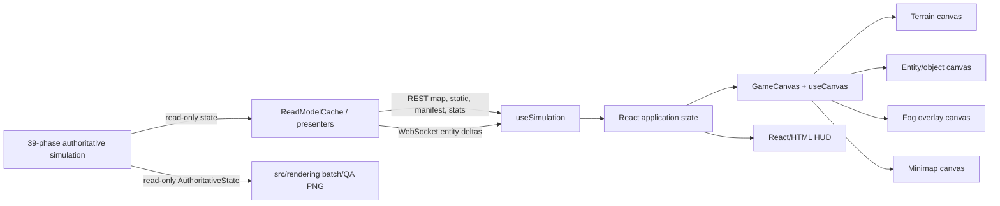
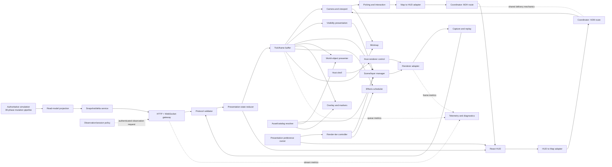
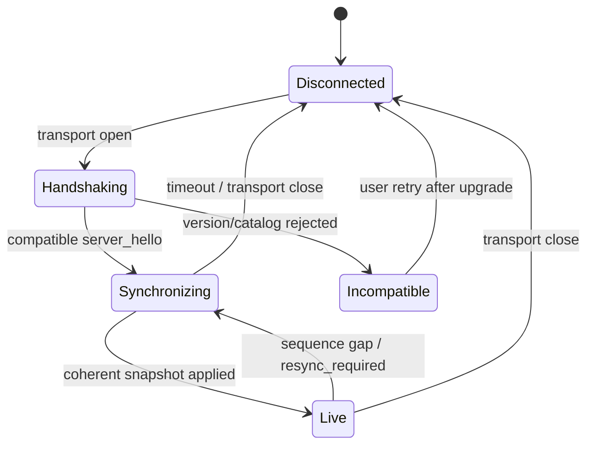

# Proposal: Live-Map Rendering Client Architecture and Rendering Technology Evaluation

**Owners:** TBD
**Decision state:** Proposed; validation experiment authorization is requested, not production migration approval
**Relationship to existing plans:** This proposal reopens and tests the live-client technology choice made in
`docs/plans/live_map_reconnection_epic.md` §B. It does not replace
`docs/plans/live_map_scaling_roadmap.md`, the HUD roadmap, or the deterministic QA renderer's contracts.
The companion [Live Map/HUD surface integration architecture](live_map_hud_surface_integration_architecture.md) owns surface independence, H2M/M2H interaction, OBS/HRC/PREF boundaries, their delivery mechanics, isolation harnesses, and integrated-readiness gates. This proposal's renderer requirements apply to Live Map Core only.

## Table of contents

- [1. Executive Summary](#1-executive-summary)
- [2. Decision Requested](#2-decision-requested)
- [3. Scope, Non-Goals, and Deferred Decisions](#3-scope-non-goals-and-deferred-decisions)
- [4. Evidence Model and Investigation Boundary](#4-evidence-model-and-investigation-boundary)
- [5. Current-State Architecture](#5-current-state-architecture)
  - [5.1 Context](#51-context)
  - [5.2 Verified Implementation Findings](#52-verified-implementation-findings)
  - [5.3 Protocol Findings](#53-protocol-findings)
  - [5.4 Existing Measurements](#54-existing-measurements)
- [6. Verified Problems vs. Hypotheses](#6-verified-problems-vs-hypotheses)
- [7. Functional Requirements](#7-functional-requirements)
- [8. Non-functional Requirement Catalogue](#8-non-functional-requirement-catalogue)
  - [8.1 NFR Decision Metadata](#81-nfr-decision-metadata)
- [9. Product and Deployment Scenarios](#9-product-and-deployment-scenarios)
- [10. Technology-neutral Target Architecture](#10-technology-neutral-target-architecture)
  - [10.1 Snapshot/Delta Sequence](#101-snapshotdelta-sequence)
  - [10.2 Reconnect State](#102-reconnect-state)
- [11. Component Responsibilities and Candidate Mappings](#11-component-responsibilities-and-candidate-mappings)
  - [11.1 Component Contracts](#111-component-contracts)
- [12. Presentation-state and Tick/Frame Model](#12-presentation-state-and-tickframe-model)
- [13. Renderer-facing Protocol Proposal](#13-renderer-facing-protocol-proposal)
- [14. React HUD and Engine Boundary](#14-react-hud-and-engine-boundary)
  - [14.1 Directional Adapters and Coordinator](#141-directional-adapters-and-coordinator)
  - [14.2 Godot Integration Variants](#142-godot-integration-variants)
- [15. Weighted Decision Matrix](#15-weighted-decision-matrix)
  - [15.1 Mandatory Eligibility Gates](#151-mandatory-eligibility-gates)
  - [15.2 Candidate Evidence Profiles](#152-candidate-evidence-profiles)
  - [15.3 Workflow and Presentation-capability Evaluation](#153-workflow-and-presentation-capability-evaluation)
  - [15.4 Scenario Sensitivity Analysis](#154-scenario-sensitivity-analysis)
- [16. Experimental Validation Workstream](#16-experimental-validation-workstream)
  - [Program Questions and Experiment Families](#program-questions-and-experiment-families)
  - [16.1 Shared Fixtures and Controls](#161-shared-fixtures-and-controls)
  - [16.2 Common Measurements](#162-common-measurements)
  - [16.3 Browser/live Experiment Pass/Fail Gates](#163-browserlive-experiment-passfail-gates)
  - [16.4 Godot Trigger Gate](#164-godot-trigger-gate)
- [17. Conditions Before Production Adoption](#17-conditions-before-production-adoption)
- [18. Benchmark Design](#18-benchmark-design)
- [19. Testing and Validation Strategy](#19-testing-and-validation-strategy)
- [20. Observability and Diagnostics](#20-observability-and-diagnostics)
- [21. Security, Licensing, Build, and Deployment](#21-security-licensing-build-and-deployment)
  - [Security](#security)
  - [Licensing and Supply Chain](#licensing-and-supply-chain)
  - [Build and Deployment](#build-and-deployment)
- [22. Phased Migration Plan](#22-phased-migration-plan)
  - [22.1 Phase Gate Details](#221-phase-gate-details)
- [23. Risks and Mitigations](#23-risks-and-mitigations)
  - [23.1 Risk Triage and Ownership](#231-risk-triage-and-ownership)
- [24. Alternatives Considered](#24-alternatives-considered)
- [25. Decision Records](#25-decision-records)
  - [DR-01 — Authority Boundary](#dr-01--authority-boundary)
  - [DR-02 — Product Scenario](#dr-02--product-scenario)
  - [DR-03 — Adoption Strategy](#dr-03--adoption-strategy)
  - [DR-04 — Full-engine Candidate](#dr-04--full-engine-candidate)
  - [DR-05 — HUD Ownership](#dr-05--hud-ownership)
  - [DR-06 — Presentation Store](#dr-06--presentation-store)
  - [DR-07 — Snapshot and Delta Continuity](#dr-07--snapshot-and-delta-continuity)
  - [DR-08 — Wire Encoding](#dr-08--wire-encoding)
  - [DR-09 — Tick/Frame Behavior](#dr-09--tickframe-behavior)
  - [DR-10 — Map Scale Strategy](#dr-10--map-scale-strategy)
  - [DR-11 — Effects Policy](#dr-11--effects-policy)
  - [DR-12 — Art Resolution and Style](#dr-12--art-resolution-and-style)
  - [DR-13 — QA Renderer Relationship](#dr-13--qa-renderer-relationship)
  - [DR-14 — Production Rollout and Fallback](#dr-14--production-rollout-and-fallback)
  - [DR-15 — Interaction and Control Boundaries](#dr-15--interaction-and-control-boundaries)
  - [DR-16 — Semantic Layer and Overlay Ownership](#dr-16--semantic-layer-and-overlay-ownership)
  - [DR-17 — Minimap Ownership](#dr-17--minimap-ownership)
  - [DR-18 — Visual-definition and Asset Registry](#dr-18--visual-definition-and-asset-registry)
  - [DR-19 — Experimental Evidence Policy](#dr-19--experimental-evidence-policy)
- [26. Decisions to Make Now](#26-decisions-to-make-now)
- [27. Decisions Explicitly Deferred](#27-decisions-explicitly-deferred)
- [28. Open Questions and Required Evidence](#28-open-questions-and-required-evidence)
- [29. Follow-up Work Products](#29-follow-up-work-products)
- [30. Source and Contradiction Appendix](#30-source-and-contradiction-appendix)
  - [30.1 Repository Evidence Consulted](#301-repository-evidence-consulted)
  - [30.2 External Primary Sources](#302-external-primary-sources)
  - [30.3 Contradictions and Corrections](#303-contradictions-and-corrections)

## 1. Executive Summary

**Recommendation: run a chartered intermediate rendering-library validation experiment; do not adopt an engine or begin a
production migration.** The repository proves that browser delivery, React/HTML HUD integration, and a
working Canvas2D live map exist. It does not prove a native-desktop requirement, an engine-experienced team,
a production sprite pipeline, or a Canvas performance failure. The only live-browser render-timing harness
has not produced representative results, and the two scaling epics remain deliberately evidence-gated.

The best next comparison is therefore the current Canvas renderer versus a bounded **PixiJS v8** experiment on
identical recorded presentation inputs. PixiJS directly tests the useful hypotheses—GPU-backed sprites,
scene/layer organization, caching, culling, batching, a real frame loop, and React coexistence—without
adding a second application runtime or cross-language HUD bridge. This is a medium-confidence recommendation
because no repository-specific PixiJS benchmark exists yet.

This matrix position recommends PixiJS only as the next browser-first experiment. It does not establish PixiJS as the final production renderer or long-term rendering architecture.

**Godot is the leading full-engine candidate, with medium-low confidence, but is not the default next browser-first
experiment.** It has a strong dedicated 2D scene/resource workflow, native exports, WebSocket support, web export,
and a permissive MIT license. Its costs are material here: GDScript would add a new language; Godot 4 C#
projects cannot currently export to web; an embedded web build introduces WebAssembly startup and a
JavaScript bridge beside a React HUD; threaded web builds require cross-origin isolation. A Godot
live-integration experiment becomes justified if native desktop is declared a Must, if an engine-native artist workflow
is required, or if PixiJS fails a capability gate rather than merely a coding-preference test.

A small offline Godot capability/authoring experiment may also be justified when richer presentation or artist workflow becomes strategically important, even if PixiJS meets browser performance gates. That experiment uses recorded fixtures and does not imply live integration or engine adoption.

Unity is credible technology but is not competitive for this repository's currently evidenced browser-first,
2D, data-heavy-HUD problem. It carries the largest runtime/tooling and commercial-license surface while
providing no demonstrated requirement that Godot or PixiJS cannot test more cheaply.

The most important prerequisite is **protocol correctness**, not rendering technology. The current
`/api/v1/ws` stream sends a minimal initial summary rather than a full presentation snapshot; carries a
tick but no stream sequence; has no resync request; leaves `snapshot_as_of_tick` fixed at connection time;
and sends no semantic events from `compute_tick_delta()`. The frontend's 500 ms `/state` poll expects a
rich `WorldState`, but the checked-in route returns only the minimal summary and ignores `since_tick` and
`selected`. A second client should not preserve those mismatches as a new contract.

This repair remains mandatory before any live candidate integration; it does not block a clearly labeled offline capability/authoring experiment over frozen recorded fixtures.

## 2. Decision Requested

Authorize scoped follow-up planning for these dependency-governed work products, not implementation or migration. Section 22 defines their authoritative ordering and parallelism:

- define and test a versioned, renderer-neutral presentation stream;
- charter the control experiment, capture representative authoritative input streams, and establish a Canvas baseline;
- execute one chartered, disposable PixiJS comparison slice behind a development-only switch;
- optionally scope a recorded-fixture offline Godot capability/authoring experiment when its strategic trigger is documented; it need not wait for production protocol repair;
- decide whether to retain/refactor Canvas, adopt PixiJS, or trigger a separate Godot experiment.

Approval of this proposal authorizes maintainers to scope and review each follow-up item. It does not authorize production-facing protocol, reducer, Canvas, or dependency changes; those require their normal ticket/review gates.

Do **not** authorize an engine dependency, production asset work, Canvas removal, HUD rebuild, or native
release target through this proposal.

## 3. Scope, Non-Goals, and Deferred Decisions

### In scope

- Live world presentation: terrain, static objects, entities, visibility/knowledge, selection, targeting,
  world-space overlays, camera, minimap, restrained animation/effects, reconnect, and diagnostics.
- A renderer-neutral presentation-state boundary and minimal protocol changes.
- Canvas, PixiJS, Godot, and Unity comparison.
- Browser-first, native-first, and dual-target consequences.
- Integration with the existing React HUD and the separate deterministic QA renderer.
- Incremental migration, equivalent benchmarks, failure recovery, and rollback.

### Non-goals

- Changing authoritative simulation behavior or the 39-phase mutation pipeline.
- Making a renderer authoritative or allowing it to submit direct state mutations.
- Redesigning HUD workflows already covered by `docs/plans/hud_delivery_roadmap.md`.
- Implementing a renderer, dependency, protocol extension, engine project, or ticket in this task.
- Turning the Python QA renderer into a live renderer or requiring pixel identity across runtimes.

### Deferred

Final sprite/icon resolution, palette, art style, animation/VFX roster, status/effect grammar, Place
representation, faction-emblem breadth, full skill art, production asset counts, target device classes,
native packaging, player-facing render-tier selection, and binary wire encoding all remain unfrozen.

## 4. Evidence Model and Investigation Boundary

This proposal labels claims as:

- **RF — Repository fact:** checked in current code/configuration or authoritative current documentation.
- **PF — Planning fact:** active plan/ticket, not necessarily implemented.
- **M — Measurement:** retained benchmark or reproducible result.
- **EF — External fact:** current official candidate documentation.
- **I — Inference:** recommendation derived from the preceding evidence.
- **OQ — Open question:** the repository cannot currently answer it.

The investigation inspected the live renderer and hooks, API presenter/cache/stream/manager, frontend types
and application shell, core HUD panels, live-map/HUD roadmaps and epics, render-tier and art-planning docs,
the shipped `src/rendering/` QA renderer and contracts, tests and performance harnesses, Vite/Nginx/Docker
deployment, CI, and current official Godot, Unity, and PixiJS documentation. The evidence index is in the
appendix.

## 5. Current-State Architecture

### 5.1 Context



### 5.2 Verified implementation findings

- **RF:** `GameCanvas.tsx` owns pan, zoom, minimap size/zoom, location navigation, and pointer gestures.
  World zoom is 0.5–3.0 and is applied through CSS transforms.
- **RF:** `useCanvas.ts` owns three stacked canvases. Terrain/grid is drawn once; the entity/object layer is
  cleared and fully redrawn when its React dependencies change; fog is a one-pixel-per-tile overlay redrawn
  when the selected subject's position or memory key changes.
- **RF:** `CELL_SIZE` is 16; at the current native 1× presentation this is the mandatory 16-CSS-pixels-per-cell baseline, not a source-sprite or logical-world-unit specification. Current content commonly uses a 512×512 terrain grid, producing an
  8192×8192 terrain/entity backing canvas; the fog canvas stays 512×512 and is CSS-scaled.
- **RF:** There is no `requestAnimationFrame` render loop in `GameCanvas.tsx` or `useCanvas.ts`.
  Rendering follows data/React updates, so no renderer-owned interpolation currently occurs.
- **RF:** The live map uses primitives, text, HP/progress bars, lines, and shadows; its only `drawImage()`
  use is the cached minimap terrain. It has no production sprite/icon asset pipeline.
- **RF:** Picking converts pointer coordinates to a grid cell. Click priority is entity, then building, then
  ground item. Hover aggregates terrain, all entities, buildings, loot, resources, and remembered ghosts.
- **RF:** Visibility is computed client-side as a Manhattan-radius set around the selected subject.
  Terrain/entity memory is supplied only on the detailed selected-entity shape.
- **RF:** The minimap caches terrain/static content, then redraws visible terrain, resources, entities, and
  viewport indication on state/camera changes. It is not an independent scene service.
- **RF:** `useSimulation.ts` fetches map/static/manifest once, opens `/api/v1/ws`, reduces
  `changed`/`removed` arrays into React entity state, and separately polls stats and supposed detail
  state every 500 ms.
- **RF:** The React shell owns the HUD, live map placement, and selected entity/building/loot state.
  The HUD is DOM-based, data-dense, and already uses Radix components and ordinary browser accessibility
  mechanisms.
- **RF:** Production packaging is a Vite-built React site served by Nginx beside FastAPI/Redis services.
  There is no checked-in desktop packaging, Godot project, Unity project, engine CI, or declared native
  platform support policy.

### 5.3 Protocol findings

- **RF:** `GET /map` returns RLE terrain; `GET /static` returns buildings, resources, chests, and regions;
  `GET /manifest` separates `protocol_version` from a catalog fingerprint.
- **RF:** The WebSocket handshake selects JSON or msgpack. The stream queue is bounded to 10, but the
  state-stream enqueue path has no explicit `QueueFull` policy or resync signal.
- **RF:** The first WebSocket message is a minimal summary. Subsequent messages contain
  `tick, changed, removed, events, snapshot_as_of_tick, region_id`.
- **RF:** `events` is currently always empty in `ReadModelCache.compute_tick_delta()`.
- **RF:** There is no per-connection sequence number, base revision, stream/session identifier, duplicate
  policy, client resync request, acknowledgement, or declared stale-message behavior.
- **RF:** `snapshot_as_of_tick` is captured once from the connection-time summary and is not advanced.
- **RF:** `useSimulation.ts` declares `lastTickRef` but never updates it.
- **RF:** The frontend calls `/state?since_tick=...&selected=...` as if it returns `WorldState`; the
  current `/api/v1/state` route ignores those parameters and returns only `manager.get_state()`'s minimal
  summary. This is a checked-in code/protocol mismatch, not an engine limitation.
- **PF:** Server-side interest management and client rendering optimization remain open, independent,
  evidence-gated epics.

### 5.4 Existing measurements

- **M:** The historical V1 payload report measured about 75 KB per update at roughly 360 entities and about
  270 KB for the one-time RLE map, down from substantially larger full-state payloads.
- **M:** The V2 reconnection work obtained a live 500-entity WebSocket payload result, but the retained epic
  summary does not preserve a single headline number in its own text.
- **M:** The browser render-timing harness exists but its documented representative run was not completed.
  It measures browser animation-frame intervals while the data-driven canvas is visible, not renderer
  frames produced by the current code.
- **M:** Two runs observed roughly 7.8–7.9 simulation TPS at 500 entities against a nominal 20 TPS pacing
  target, but the audit classifies the result as unconfirmed because the host was contended.
- **PF, not a client target:** `docs/performance/perf_baseline_policy.md` names 500, 2,500, and 10,000+
  entity server benchmark classes. These are useful scenario inputs, not evidence that 10,000 entities are
  simultaneously visible or that a browser must draw all of them.

## 6. Verified Problems vs. Hypotheses

| Kind | Finding | Consequence |
|---|---|---|
| Verified | No renderer-owned frame loop or interpolation | Smooth motion/effects require architectural work in any option |
| Verified | Whole-map backing canvases and full entity-layer redraw on each data update | Plausible memory/update cost; severity remains unmeasured |
| Verified | Presentation protocol cannot prove gap-free bootstrap or reconnect | A second renderer would reproduce ambiguity unless the contract is fixed |
| Verified | Detailed-state polling contract disagrees with the current route | Selected-subject memory and dynamic object detail cannot be treated as reliable |
| Verified | Canvas drawing, picking, visibility, camera, minimap, and React state are coupled across two large files | Equivalent replacement and focused tests are difficult |
| Verified | HUD and map selection state have overlapping owners | A cross-runtime engine could amplify feedback-loop and context-loss risk |
| Hypothesis | GPU sprites/batching will outperform Canvas primitives | Must be benchmarked on equivalent visible scenes |
| Hypothesis | An engine will improve artist iteration enough to justify a second runtime | Requires an identified workflow and actual maintainers/artists |
| Hypothesis | Native desktop will become a product target | No checked-in product or deployment evidence |
| Hypothesis | WebAssembly engine startup/memory is acceptable | Must be measured on declared target browsers/devices |
| Hypothesis | 10,000 total simulated entities require 10,000 live scene nodes | Interest/visibility design may make that unnecessary |

## 7. Functional Requirements

Priority is provisional until product/platform decisions are made.

| ID | Requirement | Evidence / current status | Priority | Acceptance concept | Open question |
|---|---|---|---|---|---|
| FR-01 | Load one authoritative world with explicit progress/error state | RF / partially implemented | Must | Recorded snapshot yields complete visible baseline or a named failure | Is world switching required? |
| FR-02 | Apply ordered live updates without inventing gameplay state | RF / partial | Must | Same stream produces same presentation state in Canvas and experiment | Required retention window? |
| FR-03 | Detect disconnect, show stale state, reconnect, and full-resync | RF / reconnect exists, resync absent | Must | Forced gap converges to current server state | Stale-display timeout? |
| FR-04 | Separate simulation pause from presentation pause | RF / simulation controls exist | Must | UI states and queued visuals behave independently | Is presentation pause user-facing? |
| FR-05 | Evaluate the current map at the mandatory baseline of 16 CSS pixels per cell while keeping world coordinates and picking stable | RF | Must | Native-scale fixture passes at 16 CSS pixels per cell and at any separately declared display scales | Source sprite resolution, logical world-unit representation, overhang, and future display scale remain unfrozen |
| FR-06 | Pan, zoom, resize, map-local focus, and optional follow without losing camera context | RF / pan-zoom exists | Must | Scripted camera workflow round-trips within tolerance | Touch/gamepad required? |
| FR-07 | Render terrain, boundaries, obstacles, and walkability cues | RF/PF / partial | Must | Semantic fixture displays every required category | Which walkability cues are player-visible? |
| FR-08 | Render spawn, update, move, hide, remember, death, and removal | RF/PF / partial | Must | Recorded lifecycle fixture has no stale/ghost duplicates | Corpse lifetime semantics? |
| FR-09A | Preserve behavioral parity for currently rendered object families: buildings, resource nodes, and ground-item stacks | RF / implemented or partially implemented | Must | Recorded current-family fixtures preserve state, layer, picking, hover, map-local selection where applicable, and fallback behavior | Which current edge cases need golden fixtures? |
| FR-09B | Support future object families such as chests, services, corpses, camps, entrances, hazards, objectives, and interactables through registry/configuration boundaries | PF / not uniformly implemented | Should | One disposable fixture adds a future family without renderer-core gameplay branching | Which family is the smallest architecture probe? |
| FR-09C | Defer the final Place hierarchy, service semantics, exact future-family roster, and content-specific state machines | PF / schema commitments unresolved | Deferred | No experiment or architecture decision treats these schemas as frozen | Which roadmap decision will own each schema? |
| FR-10 | Distinguish visible, remembered, and unexplored knowledge | RF / partial | Must | Fog fixture cannot confuse hidden, dead, or depleted state | Memory correction/expiry rules? |
| FR-11 | Render map-local hover, selection, focus, targeting, and permitted observation using distinct state slots and deterministic overlay precedence | RF / partial; companion ownership proposed | Must | Priority fixture preserves distinct values and produces deterministic overlays without a shared selection winner | See companion state-ownership model |
| FR-12 | Present HP, critical state, targeting, range, and bounded statuses | RF/PF / partial | Must | Crowded fixture preserves critical precedence | Final status roster deferred |
| FR-13 | Consume semantic movement, action, impact, heal, block, harvest, loot, objective, death, and transition events | PF / event stream absent | Should | Events trigger bounded presentation without state inference | Which events merit animation? |
| FR-14 | Coalesce/suppress presentation when updates outrun animation | PF / absent | Must | Burst fixture reaches latest tick within configured bound | Bound must be measured |
| FR-15 | Maintain a minimap and viewport indicator | RF / implemented | Should | Camera/minimap round-trip passes coordinate fixtures | Engine or DOM placement? |
| FR-16 | Preserve independent LM/HUD cores and support separately typed H2M commands and M2H investigation intents | RF coupled callbacks; companion contracts proposed | Must for integrated experience, not core readiness | Companion directional harnesses prevent loops and support independent rollback | Detailed requirements: companion H2M-FR and M2H-FR |
| FR-17 | Offer reduced-motion/static semantics | PF / absent | Must | All critical events remain readable with motion disabled | User, OS, or both settings? |
| FR-18 | Allow a low-fidelity diagnostic mode without losing required information | PF / idea only | Should | Semantic assertions pass with optional effects disabled | Player-facing or developer-only? |
| FR-19 | Support unknown/missing visual definitions safely | PF / primitives act as fallback | Must | Missing asset never crashes or becomes invisible | Warning escalation policy? |
| FR-20 | Capture and replay presentation inputs deterministically enough for comparison | RF precedent / absent live adapter | Must | Canvas and candidate consume the same versioned fixture | Storage/retention owner? |
| FR-21 | Keep observation/session requests, host-renderer lifecycle, presentation preferences, and diagnostics outside H2M/M2H interaction contracts | RF currently mixed; companion separation proposed | Must at target boundary | Companion family-specific harnesses pass and LM-only renderer experiments require no HUD interaction | Detailed requirements: companion OBS-FR, HRC-FR, PREF-FR |

## 8. Non-functional requirement catalogue

The numeric targets below are deliberately not invented here. Phase 0 must record the current distribution and approve each threshold type, rationale, and approval source before comparing candidates; absolute product requirements need not derive from the Canvas baseline.

| ID | Requirement | How it is evaluated |
|---|---|---|
| NFR-01 | Smooth native-scale interaction under normal and crowded views | p50/p95/p99 frame time and long-frame count |
| NFR-02 | Bounded memory during long sessions, pan/zoom, reconnect, and map changes | heap/GPU memory trend and post-GC plateau |
| NFR-03 | Fast enough startup for browser play | compressed bytes, parse/compile time, first usable map |
| NFR-04 | Deterministic presentation-state reduction from recorded messages | replay hash/assertions, excluding explicitly cosmetic state |
| NFR-05 | Recovery from loss, duplication, reordering, stale dictionaries, and reconnect | fault-injection scenarios |
| NFR-06 | Compatibility with the supported browser matrix | automated smoke and manual GPU/browser coverage |
| NFR-07 | Accessible HUD and non-color critical cues | keyboard, screen-reader, focus, contrast, shape/label checks |
| NFR-08 | Maintainable by the repository's TypeScript/Python team | dependency, debugging, review, and onboarding assessment |
| NFR-09 | CI-capable headless validation | documented noninteractive build/test path |
| NFR-10 | Observable frame, stream, queue, and recovery behavior | stable metrics and diagnostic capture |
| NFR-11 | No renderer-side authoritative mutation | boundary tests and architecture review |
| NFR-12 | Versioned, bounded, validated network input | protocol contract and malformed-input tests |
| NFR-13 | Asset attribution and license compliance | manifest and release audit |
| NFR-14 | Reversible migration | feature flag and Canvas fallback until exit gate |
| NFR-15 | Preserve 16 CSS pixels per map cell as the current mandatory native-scale baseline test without fixing source sprite resolution, logical world units, overhang, or future display scale | screenshot/native-scale and scaling review |
| NFR-16 | Avoid hue-only critical distinctions | grayscale and color-vision review |
| NFR-17 | Do not require unique art for generated/runtime IDs | fallback-family fixture |
| NFR-18 | Avoid regressions in server tick throughput | concurrent server/client benchmark |
| NFR-19 | Bounded tick-to-visible reconciliation lag, queue age, and backlog at the declared simulation update rate | tick/frame trace, p50/p95/p99 latency, maximum queue age/depth |
| NFR-20 | Explicit total-world, subscribed, visible, labeled, and effected population assumptions | scenario metadata and separate scaling curves for each count |
| NFR-21 | Network bandwidth and decode work fit the declared viewer/update scenarios | bytes per snapshot/minute, message rate, encode/decode CPU |
| NFR-22 | Static work is not invalidated by unrelated dynamic changes | dirty-region/chunk counters and camera/update traces |
| NFR-23 | Culling, pooling, atlas/cache, batch/draw-call, allocation, and effect budgets are declared and enforced where applicable | candidate-specific counters plus common visible-scene results |
| NFR-24 | Multiple concurrent viewers and server interest management are evaluated separately from client drawing | server fan-out/TPS/network test paired with isolated client benchmark |

### 8.1 NFR decision metadata

The acceptance method for each ID is the evaluation in the preceding table.

| ID | Evidence / current status | Priority | Open question |
|---|---|---|---|
| NFR-01 | RF: no production RAF loop; benchmark incomplete | Must | What interaction target is justified for this turn-based game? |
| NFR-02 | RF: full-world backing surfaces; no retained client budget | Must | Which devices and memory ceilings? |
| NFR-03 | RF: Vite browser deployment; candidate sizes unmeasured | Must | What first-usable-map budget? |
| NFR-04 | RF: reducer exists inside the hook; replay adapter absent | Must | Which cosmetic fields are excluded from hashes? |
| NFR-05 | RF: reconnect exists; sequence/resync semantics absent | Must | How long may stale state remain visible? |
| NFR-06 | OQ: supported-browser matrix is not declared | Must | Which browsers/GPU fallbacks? |
| NFR-07 | RF/PF: DOM accessibility exists; map cues are partial | Must | Which WCAG/product baseline applies? |
| NFR-08 | RF: repository uses TypeScript/Python; no engine owner found | Must | Who owns graphics/runtime upgrades? |
| NFR-09 | RF: browser CI exists; no engine CI exists | Must | Which native CI platforms, if any? |
| NFR-10 | PF: timing harness exists; production diagnostics are incomplete | Must | Which metrics may ship to production? |
| NFR-11 | RF: Singular Bottleneck Law | Must | None within this proposal |
| NFR-12 | RF: versions exist; bounds/continuity contract incomplete | Must | Compatibility support window? |
| NFR-13 | RF: no production art registry; candidate licenses differ | Must | Attribution and legal owner? |
| NFR-14 | PF: Canvas is required baseline/fallback | Must | What stability window retires it? |
| NFR-15 | RF/PF: the current renderer uses 16 CSS pixels per cell at native scale; source-art and future-scale choices are open | Must | Which source sizes, overhang rules, and display scales should later experiments retain? |
| NFR-16 | PF: visual-planning constraint | Must | Which automated/manual color checks? |
| NFR-17 | PF: taxonomy/art-planning constraint | Must | Which family fallback catalog is minimum? |
| NFR-18 | M: server TPS under load is not yet stable evidence | Must | What predeclared tolerance and host class? |
| NFR-19 | RF: no renderer loop; stream/update cadence is mixed | Must | What lag/backlog bound and server tick rate scenarios? |
| NFR-20 | RF/M: 512² map; server entity classes exist but visible counts do not | Must | What are normal and crowded subscribed/visible distributions? |
| NFR-21 | M: historical payload measurements; current target unresolved | Must | What viewer count, link class, and bytes budget? |
| NFR-22 | RF: terrain is static but entity layer redraw is coarse | Must | What chunk/dirty-region invalidation granularity? |
| NFR-23 | PF/EF: candidate techniques exist; no repository budgets | Must | Which counters are comparable and what candidate-specific limits? |
| NFR-24 | PF: interest-management epic open; client benchmark is separate | Must | Expected simultaneous viewers and subscription scopes? |

## 9. Product and deployment scenarios

These are scenarios, not claims that all three are committed targets.

| Scenario | Current evidence | Architecture consequence | Preferred investigation |
|---|---|---|---|
| Browser-first | Strong: Vite/React/Nginx, Playwright, and the shipped Canvas map | Keep the renderer in the browser and preserve React HUD | Canvas baseline, then PixiJS |
| Native-first | Weak: no native packaging, store, input, or release pipeline is present | A game engine may justify its integration cost | Godot validation experiment after the target is approved |
| Dual browser/native | Unproven | Decide whether one renderer or two delivery shells is more valuable than simplicity | Compare Godot web/native with PixiJS plus a separately selected desktop shell; do not choose the shell here |

Offline/local play, initial-load sensitivity, and update/patch expectations are not documented. This proposal assumes the current connected web deployment only for comparison, and leaves those three product requirements open rather than treating absence as a negative requirement.

A native export is therefore a weighted benefit, not a current hard requirement. If native desktop becomes a Must requirement, rerun the matrix with native export and engine-native tooling weighted more heavily.

## 10. Technology-neutral target architecture

The target separates authoritative simulation, delivery protocol, presentation state, and drawing. That separation is useful whether Canvas, PixiJS, or an engine wins.



Boundary rules:

- Only the server pipeline changes authoritative state. The client sends intents and renders projections.
- Presentation state may contain interpolation, hover, map-local selection, camera, and cosmetic timing. It must never be serialized back as authoritative truth.
- Semantic identifiers and protocol fixtures are shared across renderers. Drawing code and pixel output are not required to be shared with the QA renderer.
- Renderer adapters consume one presentation model; they do not parse transport messages directly.
- Sharing one reduced projection does not share camera, map-local selection, HUD investigation, or observed-subject ownership. Those interaction boundaries are defined in the companion surface-integration architecture.
- By default, the DOM HUD consumes the same reduced state through selectors, not a second network connection. Godot Variant B is the explicit exception and must pass its duplicated-projection, drift, reconnect, session, and fan-out gates.

### 10.1 Snapshot/delta sequence

```mermaid
sequenceDiagram
    participant C as Client
    participant G as Gateway
    participant P as Projection service
    participant R as Presentation reducer
    participant B as Tick/frame reconciler
    participant E as Effects orchestrator
    participant D as Renderer + HUD

    C->>G: connect; client_hello / subscribe
    G->>C: server_hello(protocol, dictionary, stream)
    G->>P: capture coherent projection
    P-->>G: snapshot at tick T
    G-->>C: snapshot(seq 1, tick T)
    C->>R: validate and atomically replace
    R->>B: accept coherent state T
    B->>D: sample presentation frame T
    D-->>D: draw visible snapshot
    loop authoritative ticks
        P-->>G: delta(base_tick, tick, seq, semantic events)
        G-->>C: ordered delta
        C->>R: validate sequence and base
        alt contiguous
            R->>B: commit state and semantic events
            B->>E: schedule, coalesce, or suppress cues
            B->>D: sample bounded interpolation
            E->>D: active bounded cues + static fallbacks
            D-->>D: draw visible frame and HUD selectors
        else gap or incompatible revision
            C->>G: resync_request(last good seq/tick)
            G-->>C: snapshot or resync_required
        end
    end
```

### 10.2 Reconnect state



## 11. Component responsibilities and candidate mappings

“Godot mapping” describes a possible architecture, not an instruction to start a Godot project. Unity is excluded from detailed mapping because it is not recommended for a validation experiment.

FR-09A defines mandatory parity for current object families; FR-09B defines an extension capability test; FR-09C schemas must not be assumed by component mappings.

| Component | Responsibility | Canvas / PixiJS mapping | Godot mapping |
|---|---|---|---|
| 1. Read-model projection | Produce render-safe semantic state | Existing FastAPI/server projection | Same server projection |
| 2. Snapshot/delta service | Coherent bootstrap, ordered changes, resync | Existing service, extended contract | Same |
| 3. Transport gateway | HTTP/WS lifecycle, auth, bounds | Existing FastAPI endpoints | Same |
| 4. Protocol validator | Version/schema/catalog validation | TypeScript boundary module | TypeScript boundary (Godot A) or GDScript boundary (Godot B) |
| 5. Presentation reducer | Apply snapshots/deltas deterministically | Framework-independent TypeScript store | TypeScript store + batched scene applicator (Godot A) or Godot autoload/service (Godot B) |
| 6. Tick/frame buffer | Separate server cadence from display cadence | TypeScript queue + RAF driver | TypeScript-produced batches (Godot A) or Godot process loop + bounded queue (Godot B) |
| 7. Camera/viewport | Pan, zoom, coordinate transforms, clamping | TS camera module | Camera2D |
| 8. Scene/layer manager | Stable terrain/object/entity/overlay ordering | Canvas layers or Pixi Containers | Node2D/CanvasLayer tree |
| 9. Terrain/chunk renderer | Cull/cache map cells and invalidation | Canvas chunks or Pixi textures/containers | TileMapLayer/chunk nodes |
| 10. Entity renderer | Pool/update visible entity instances | Canvas batches or Pixi sprites/containers | pooled Sprite2D/MultiMesh only if proven suitable |
| 11. Visibility renderer | Fog, memory, hidden/revealed states | Canvas/Pixi mask/overlay | shader/texture/CanvasItem |
| 12. Effect scheduler | Bounded cosmetic and semantic cues | TS scheduler | scene/node pool |
| 13. Picking/input adapter | Convert pointer/input to semantic targets/intents | browser pointer events | Godot input plus bridge |
| 14. Asset/catalog resolver | Map semantic families to art/fallbacks | Vite/Pixi asset manifest | Godot resources/imports |
| 15. Minimap | Overview, markers, viewport, navigation | Renderer-owned surface hosted by React | SubViewport/Control bridged to page |
| 16. Diagnostics adapter | Frame, queue, stream, recovery evidence | Performance APIs and app telemetry | Godot profiler/custom monitors |
| 17. World-object presenter | Present buildings, resources, loot, corpses, entrances, hazards, objectives, and interactables | Canvas/Pixi object batches/containers | pooled Sprite2D/Node2D compositions |
| 18. Overlay/marker system | Apply bounded semantic precedence for selection, threat, objectives, targeting, range, HP, and status | Canvas/Pixi overlay containers | CanvasLayer/Node2D overlay groups |
| 19. Render-tier controller | Preserve mandatory cues while reducing optional fidelity | TypeScript capability/settings policy | project/settings policy and feature flags |
| 20. Cross-surface adapters/coordinator | Typed HUD→map commands and map→HUD investigation intents; correlation, readiness, and named outcomes | in-process TypeScript ports over the shared projection | batched presentation plus typed host/web bridge (Godot A) or narrow web-export UI bridge (Godot B); native IPC deferred |
| 21. Capture/replay adapter | Feed recorded inputs and produce comparable semantic/screenshot evidence | browser fixture runner + Playwright | headless scene runner/export + capture harness |
| 22. Observation/session port | Request server-validated observed subject/scope and receive explicit projection transition | separate application/session client | topology-specific authenticated client; never a map-interaction command |
| 23. Host-renderer control | Viewport/DPR, readiness, suspend/resume by host/renderer generation | browser host/ResizeObserver boundary | WebView/CEF/plugin/native lifecycle adapter selected separately |
| 24. Presentation preference owner/adapters | Version and fan out reduced motion; route renderer-only tier/pause settings | application preference store and typed surface adapters | host-owned settings with surface adapters |

### 11.1 Component contracts

The mapping table is shorthand; these contracts define the renderer-neutral seam. “State” means presentation/read-model state only.

| # | Inputs → outputs | Owned state | Prohibited responsibilities | Lifecycle, failure, and performance |
|---|---|---|---|---|
| 1 | Authoritative read model → render projection | projection schema/version | mutation, gameplay rules, renderer assets | per committed tick; fail without publishing a partial projection; bound projection work |
| 2 | projection changes/subscriptions → snapshots/deltas/resync | stream sequence and retained recovery window | inventing state or presentation timing | per stream; overflow emits resync rather than silent loss; bound retention/payload |
| 3 | authenticated sessions/messages → validated transport frames | connections and transport backpressure | domain reduction or drawing | connection lifetime; reject oversize/rate abuse; keep queues bounded |
| 4 | bytes/objects → typed protocol messages or named error | negotiated protocol/catalog capability | scene allocation or compatibility guessing | connection/message lifetime; fail closed; validate before expensive allocation |
| 5 | typed messages → coherent presentation projection/selectors | current/previous tick, scope, removal tombstones needed for transition | network I/O, drawing, business rules | session lifetime; gap enters resync; structurally share/batch updates |
| 6 | projections/events/time → sampled visual transitions | bounded queue, interpolation clock, presentation pause | changing authoritative outcomes | frame/session lifetime; snap or suppress on overload; avoid per-frame allocation |
| 7 | input/HUD requests/world bounds → matrices and visible bounds | camera transform/follow target | selection authority or world mutation | viewport lifetime; clamp invalid input; compute culling bounds once per change/frame |
| 8 | semantic scene changes → ordered layer operations | layer registry and visible instance handles | transport parsing or gameplay inference | world lifetime; loud fallback on unknown layer; update only invalidated layers |
| 9 | map revision/camera/terrain changes → visible terrain batches | bounded chunks/cache/dirty regions | dynamic entity or fog ownership | world/revision lifetime; placeholders on missing tiles; evict by budget |
| 10 | entity projections → pooled visual instances | instance-to-semantic-ID mapping and reusable pools | authored art per runtime ID or combat rules | spawn-to-remove; fallback visual on missing definition; cull/pool/batch |
| 11 | authoritative knowledge state → fog/memory surface | presentation texture/cache for permitted knowledge | deciding what the client is allowed to know | subject/scope lifetime; hide safely on ambiguity; dirty-region updates |
| 12 | semantic events/tier settings → bounded cues | active cue pool, cancellation/suppression state | inferring critical outcomes from animation | event lifetime; preserve static fallback on suppression; enforce budgets |
| 13 | normalized input/camera/visible targets → semantic hover/select intents | pointer/focus capture and transient candidate set | direct commands or authoritative target validity | gesture lifetime; release cleanly on blur/failure; query visible spatial index |
| 14 | semantic visual ID/catalog/version → asset/composition definition | loaded asset handles, family fallbacks, import metadata | arbitrary server paths or gameplay branching | catalog/world lifetime; loud safe placeholder; async load and bounded cache |
| 15 | reduced world/camera → overview image, markers, viewport, navigation intent | minimap reduction/cache | independent world truth or unrestricted detail | world/viewport lifetime; retain textual fallback; use lower-frequency bounded updates |
| 16 | measurements/events → sampled metrics/debug bundle | bounded aggregates and sanitized recent headers | high-cardinality world logging or simulation control | session/build lifetime; diagnostics failure is non-fatal; sampling must not distort tests |
| 17 | world-object projections/catalog → pooled object visuals | semantic-ID/instance mapping and object pools | service/gameplay rules or unique art per runtime instance | object lifecycle; safe fallback; cull/pool and update changed state only |
| 18 | scene semantics/priority → bounded world overlays | active marker slots and overflow summary | authority, unlimited stacking, or hue-only critical meaning | selection/event lifetime; move overflow to HUD; batch stable geometry |
| 19 | capability/user settings/diagnostics → enabled fidelity features | active tier and mandatory-semantic floor | hiding required gameplay cues or changing server behavior | session/settings lifetime; fall back on unsupported feature; apply changes without world reload where feasible |
| 20 | semantic directional commands/intents → delivery result | message/correlation IDs, dedup, capability/readiness, bounded pending work | camera/HUD state, world duplication, arbitrary calls, or authoritative command approval | viewport/app lifetime; named failure and no-op fallback; coalesce only declared high-rate messages |
| 21 | recorded protocol/camera trace → replay state, captures, metrics | fixture cursor, capture metadata, approved baselines | altering inputs to favor a renderer or requiring cross-runtime pixel identity | test-run lifetime; fail with reproducible artifact; keep instrumentation comparable and bounded |
| 22 | authenticated observation request → accepted/denied projection transition | pending observation request identity only | camera/HUD navigation or optimistic visibility | session lifetime; server validates; re-auth/resync after restart |
| 23 | viewport/DPR/lifecycle generation → renderer control/readiness | host and renderer generation | simulation tick, HUD investigation, or interaction routing | latest measurement or ordered lifecycle; handshake after restart |
| 24 | preference version/scope → per-surface applied result | current approved preference values | authority, arbitrary renderer calls, or implicit cross-surface interaction | latest version wins; partial application visible and retryable |

Required visual-definition fields are semantic definition ID and version, logical footprint, render anchor and optional overhang bounds, composition slots, layer/overlay slots, fallback family, animation/effect event bindings, render-tier flags, and import/validation metadata. Gameplay payloads reference semantic IDs; they never reference engine file paths.

The baseline semantic order is terrain → boundaries/static world objects → dynamic objects/entities → knowledge/fog treatment → relationship/range overlays → selection/target/objective/interactable markers → bounded effects → screen-space HUD. Visibility can mask earlier layers but cannot reveal unauthorized state. Within overlays, critical target/objective/selection semantics outrank decorative/status detail; overflow reduces or moves detail to the HUD rather than stacking without bound.

## 12. Presentation-state and tick/frame model

Maintain three explicit layers of state:

1. **Authoritative projection:** the latest coherent server tick accepted by the client.
2. **Previous projection:** the preceding coherent tick, retained only where transition presentation needs it.
3. **Ephemeral presentation state:** interpolation time, camera, hover, map-local selection, effect lifetimes, local accessibility settings, and diagnostics.

The render loop samples presentation state independently of simulation ticks. It may interpolate ordinary movement between two known positions. It must snap on teleport, spawn, removal, reconnect, visibility revocation, or any transition without a valid predecessor. Health, death, inventory, ownership, collision, visibility authorization, and outcomes are never interpolated into invented game state.

Queues must be bounded. Contiguous state deltas may be coalesced when semantics are preserved; superseded cosmetic cues may be dropped. Critical events need a persistent static representation or HUD/log fallback, so noticing them cannot depend on a brief animation. Pausing presentation must not pause the server.

## 13. Renderer-facing protocol proposal

The current `{tick, changed, removed, events}` shape is a useful seed but lacks enough identity and continuity information for a robust independent renderer. Define and validate at least:

Live integration in Canvas, PixiJS, Godot, or Unity must wait for the protocol repair and fault fixtures in this section. A recorded-fixture offline rendering/authoring experiment may proceed earlier with a frozen versioned fixture envelope; it must not represent fixture playback as evidence of live ordering, reconnect, resync, authentication, or interest-management correctness.

- `server_hello { protocol_version, dictionary_version, stream_id, capabilities }`
- `snapshot { stream_id, seq, tick, scope, map_revision, entities, objects, visibility }`
- `delta { stream_id, seq, base_tick, tick, changed, removed, object_changes, visibility_changes, events }`
- `resync_required { stream_id, reason, latest_tick }`
- client `subscribe { scope, capabilities }`
- client `observation_request { request_id, requested_subject_id?, requested_scope? }`
- `observation_result { request_id, status, projection_stream_id? }`
- client `resync_request { stream_id, last_seq, last_tick }`

Requirements:

- A snapshot and its following stream must share a coherent cut; an HTTP bootstrap cannot silently race a WebSocket delta.
- `seq` detects delivery gaps and duplicates; `base_tick` detects application against the wrong projection; `stream_id` prevents old-session messages from being accepted.
- Unknown major protocol versions, incompatible dictionary versions, excessive payloads, invalid coordinates, and unknown required message types fail closed into an explicit recovery/error state.
- JSON remains the first reference format because it is inspectable and already supported. MessagePack is selected only if captured payload/CPU measurements justify it; both formats must share one schema and fixtures.
- Acknowledge subscription and OBS requests, not every state delta, unless measurement proves per-delta acknowledgement necessary. Gameplay commands remain outside this renderer-facing presentation protocol.
- Interest scope is server-defined and versioned. The client must not infer that absence outside the subscribed scope means deletion.
- Events include stable semantic type, authoritative tick, involved IDs, importance, and bounded presentation hints. They do not carry executable scripts or arbitrary asset paths.
- Commands/intents remain a separate, authenticated, rate-limited channel. A renderer is always an untrusted client.

## 14. React HUD and engine boundary

Retain React/DOM for the current HUD. It already owns data-dense panels, selection details, controls, and browser accessibility; replacing it does not address the measured live-map bottleneck.

Use one reduced presentation store:

This is the default for Canvas/PixiJS and the hypothesis for Godot Variant A. Godot Variant B is an explicit exception whose duplicated projection and recovery costs must be measured.

- Live Map Core owns renderer-local hover, map selection, camera, focus, follow, minimap navigation, and world-space presentation.
- React HUD Core owns investigation context, history, list selection, tabs/routes, filters, and accessible screen-space UI.
- Observation/visibility scope uses a separate session-policy port with server validation; it is not an H2M map command.
- Viewport, DPR, renderer readiness, and suspend/resume use a host-renderer lifecycle port.
- Reduced motion is an application preference fanned to participating surfaces; render tier and presentation pause remain map-specific preferences unless evidence adds another consumer.
- Diagnostics are observational and never domain commands.
- HUD→Live Map commands and Live Map→HUD investigation intents use separate typed adapters through a narrow coordinator; applying one direction must not automatically emit the other.
- The shared reduced store supplies projection data only. It does not merge interaction ownership or duplicate authoritative state.
- Detailed messages, outcomes, state ownership, loop prevention, isolated harnesses, and rollout gates are owned by the [surface-integration architecture](live_map_hud_surface_integration_architecture.md).
- The minimap remains renderer-owned and map-local; any explicit HUD request to change map focus uses the HUD→Live Map adapter.

For a Godot web experiment, use a narrow, versioned JavaScript interop boundary where required. Do not mirror the whole world through per-entity calls. Direct Godot WebSocket consumption creates a second client reducer and must pass the duplicated-projection gates. A native Godot process is not assumed to provide web-export `JavaScriptBridge`.

### 14.1 Directional adapters and coordinator

The parent interaction requirements are summary-only: two independently switchable semantic adapters share message/correlation identity, named outcomes, readiness/capability checks, bounded delivery, and explicit loop prevention through the coordinator. Observation/session, host-renderer lifecycle, presentation preferences, and diagnostics are separate typed control boundaries; they may reuse envelope or physical transport mechanics but not interaction schemas. Renderer experiments exercise Live Map Core with both adapters disabled first; cross-surface readiness is evaluated separately. The companion architecture is authoritative for this boundary.

- **Embedded browser (default):** typed in-process TypeScript calls/store subscriptions for Canvas/PixiJS; a narrow JavaScript interop adapter for an embedded Godot/Unity web viewport.
- **Separate native client plus web HUD:** local IPC or an authenticated loopback/session relay would be required, but this arrangement is not selected and the transport is deferred.
- **HUD rebuilt in engine:** rejected for current scope.
- **All-DOM world overlays:** retain only for accessibility fallbacks or simple controls; high-frequency world-space state belongs with the renderer.

Layout ownership is explicit: React allocates the viewport rectangle and communicates CSS size and device-pixel ratio; the renderer owns its internal backing resolution and camera. Focus transfer is intentional, Escape returns focus to the DOM shell, and pointer capture must be released on blur, disconnect, or viewport replacement.

### 14.2 Godot integration variants

Both variants keep the simulation server authoritative. They differ in which client runtime owns transport and presentation reduction. Neither is selected without experiment evidence.

| Concern | Variant A — TypeScript transport/reduction, batched Godot presentation | Variant B — Godot direct presentation stream, React separate/shared projection |
|---|---|---|
| State ownership | TypeScript owns protocol validation, reconnect, current/previous projections, and HUD selectors. Godot owns only scene instances and ephemeral visuals derived from batched presentation updates. | Godot owns its protocol client, current/previous presentation projection, and scene. React owns a separate HUD projection/client store, or consumes a server-provided shared read-model projection—not Godot scene state. |
| Bridge volume | Higher: one initial world batch, then bounded per-tick/dirty batches plus typed H2M/M2H, HRC, PREF, and diagnostics traffic. OBS remains a separate session-policy path. Never use arbitrary per-entity calls. | Lower world-state bridge volume: typed H2M/M2H, HRC, PREF, and diagnostics cross the bridge; OBS remains a separate session-policy path. Network/projection work is duplicated across Godot and React. |
| Duplication | One TypeScript reducer and reconnect implementation; Godot needs a batch schema and scene applicator. | Two client reducers/subscriptions and potentially two compatibility/auth paths. Shared server schemas/fixtures reduce but do not remove duplication. |
| Drift risk | Lower for HUD/world projection and tick agreement because both originate in the TypeScript store; bridge backlog can still make the viewport visibly late. | Higher: HUD and world can accept different ticks, scopes, reconnect states, or catalog versions. A displayed-tick/stream identity and explicit stale-state policy are mandatory. |
| Reconnect/resync | TypeScript performs one reconnect/resync and atomically replaces Godot presentation state; Godot must discard stale batches by stream/sequence. | Godot and React recover independently. The UI must expose partial recovery and cannot claim consistency until compatible stream/projection identities converge. |
| Testing | Reuse TypeScript protocol/reducer tests; add batch-schema, bridge backpressure, scene-application, and screenshot tests. | Run the same protocol/replay/fault corpus against two reducers, plus cross-client tick/projection convergence and independent-failure tests. |
| Deployment cost | Best fit for embedded web with the existing React host. Native deployment would retain a JavaScript host/IPC-like boundary or require a later ownership migration. | More natural for a standalone native Godot client and viable for web, but adds a second live client, session reuse, fan-out, observability, and React/Godot compatibility burden. |
| Primary evidence needed | Sustainable batch size/rate, serialization/copy cost, bridge backlog, first-state time, and context-loss recovery. | Reducer parity, dual-client bandwidth/server cost, tick drift, auth/session coordination, and independent reconnect behavior. |

Selection rule: Variant A is the lower-duplication browser hypothesis; Variant B is the stronger standalone-native hypothesis. A live Godot experiment must measure the approved variant question at the smallest representative seam needed for its deployment scenario; it compares both variants only when the selection decision requires equivalent evidence. One experiment need not implement both by default. A recorded-fixture offline authoring experiment may postpone this choice entirely because it does not require live transport.

## 15. Weighted decision matrix

### 15.1 Mandatory eligibility gates

Weighted scores rank only candidates that are eligible for the scenario and decision stage. A failed **Must** gate cannot be offset by strengths elsewhere. “Unproven” permits a bounded experiment designed to answer that gate; it does not permit production selection.

| Gate | Mandatory evidence | Applies to | Failure consequence |
|---|---|---|---|
| EG-01 Authority | Renderer cannot mutate authoritative state or duplicate gameplay rules | Every experiment and production candidate | Reject architecture |
| EG-02 Current behavioral parity | FR-01–FR-08, FR-09A, FR-10–FR-12, FR-14, FR-16–FR-17, FR-19, and FR-20 pass their acceptance concepts | Replacement/cutover; representative subset declared for an experiment | No replacement/cutover |
| EG-03 Live consistency | Versioned coherent snapshot/delta, ordering, gap detection, reconnect, resync, stale-state behavior | Any live integration | Offline fixture work only |
| EG-04 Scenario platform | Builds, starts, renders, accepts input, and recovers on the approved browser/native matrix | Scenario being ranked | Ineligible for that scenario |
| EG-05 HUD/accessibility | React ownership, H2M focus, M2H investigation, HRC resize, reduced motion, non-hue critical cues, and map-unavailable fallback pass | Embedded browser production | No embedded-browser adoption |
| EG-06 Declared budgets | Predeclared frame, lag/backlog, memory, startup, payload, visible-count, effect, and server-impact budgets pass | Production selection | experiment may continue; production ineligible |
| EG-07 Operability and ownership | Headless CI, diagnostics, pinned dependencies/terms, upgrade path, and named maintainers exist | Production selection | Production ineligible |
| EG-08 Visual baseline | Current 16-CSS-pixels-per-cell baseline remains readable; source resolution, logical units, overhang, and future scale stay testable | Every visual experiment and production candidate | Revise or reject presentation approach |
| EG-09 Reversibility | Recorded-input comparison and Canvas fallback/rollback remain usable through the exit gate | Migration/cutover | No cutover |

Current eligibility assessment:

- **Canvas:** eligible as the current control and fallback; production scaling budgets remain unproven, and protocol repair still gates the target live contract.
- **PixiJS:** eligible for browser-first shortlisting and recorded-fixture rendering work; live experiment eligibility is conditional on EG-03/Phase 1, and all production gates remain unproven.
- **Godot:** eligible for a recorded-fixture offline capability/authoring experiment when its strategic trigger is met. Live browser/native eligibility remains unproven.
- **Unity:** not rejected by a fabricated Must failure, but not shortlisted because no current scenario justifies the higher-cost experiment; reassess only if requirements or ownership change.

Weight rationale:

- **Browser/React integration (25%):** the browser client and DOM HUD are shipped facts and the largest near-term integration constraint.
- **Repository/team maintainability (20%):** TypeScript/Python are present; no engine ownership is evidenced, so ongoing cognitive and upgrade cost is nearly as important.
- **Large-map 2D fit (15%):** map memory, culling, and update work motivate the investigation, but the severity and visible population are not yet measured.
- **Native export (10%):** valuable under a future scenario, not a current Must.
- **Authoring and presentation workflow (10%):** future art practice matters, while final assets and production workflow remain unfrozen.
- **Testing/diagnostics (10%):** deterministic comparison, reconnect correctness, and performance evidence are adoption gates.
- **License/lifecycle (5%):** all candidates require governance, but it does not outweigh product fit at current scale.
- **Startup/deployment (5%):** browser load and CI matter, but no numeric budget exists yet.

Scoring is 1 (poor fit) to 5 (strong fit). Totals are weighted averages out of 5. These scores reflect the repository and requirements documented above, not universal product rankings.

| Criterion | Weight | Canvas baseline | PixiJS | Godot | Unity |
|---|---:|---:|---:|---:|---:|
| Browser and React integration | 25% | 5.0 | 5.0 | 2.5 | 2.0 |
| Repository/team maintainability | 20% | 4.0 | 4.5 | 2.5 | 2.0 |
| Large-map 2D rendering fit | 15% | 2.5 | 4.0 | 4.0 | 4.5 |
| Native export path | 10% | 1.0 | 1.5 | 5.0 | 5.0 |
| Authoring and presentation workflow | 10% | 2.0 | 4.0 | 5.0 | 5.0 |
| Testing and diagnostics | 10% | 4.0 | 4.0 | 3.5 | 4.0 |
| License/lifecycle fit | 5% | 5.0 | 5.0 | 5.0 | 2.5 |
| Startup/deployment fit | 5% | 5.0 | 4.5 | 2.5 | 2.0 |
| **Weighted total** | **100%** | **3.63** | **4.18** | **3.45** | **3.20** |
| Evidence confidence |  | High | Medium | Medium-low | Medium-low |

### 15.2 Candidate evidence profiles

- **Current Canvas2D — baseline, high evidence confidence.** It already embeds perfectly in React, deploys through Vite/Nginx, uses direct browser input, and is exercised by Playwright. Canvas supplies no retained scene graph, atlas, pooling, culling, animation, particle, shader, or authoring workflow by itself; each is application architecture. The current code has coarse terrain/entity/fog layers and minimap caching, so its full-world allocation and redraw behavior must not be mislabeled as an inherent Canvas limit. Native export would require a separately chosen wrapper. Browser profiling and CI are already available.
- **PixiJS v8 — intermediate library, medium evidence confidence.** Official architecture supplies a scene graph, ticker, renderers, and asset system; WebGL is the recommended renderer while WebGPU is documented as experimental. Culling is opt-in, texture caching requires measured use, and particle-oriented APIs must be treated as version-sensitive rather than assumed. It stays in TypeScript, speaks the current WebSocket/HTTP stack directly, embeds under React without a cross-language world bridge, and retains browser test/profiling tools. It improves runtime rendering structure and sprite/atlas iteration, but it is not a tile-world editor, native exporter, gameplay engine, or guarantee of performance.
- **Godot — conditional full engine, medium-low evidence confidence.** Its 2D scene/resource model, Camera2D, TileMapLayer direction, Sprite2D/animation, CanvasItem/shader, particle, import, editor, profiler, and native exports plausibly support the desired workflow. Large worlds still require an application-specific chunk/cull/pool design; engine nodes alone are not a scale strategy. Official web export runs in a browser canvas, defaults to single-threaded operation in current stable guidance, and threaded builds require cross-origin isolation. Its WebSocket/JavaScript interop can integrate with the backend/HUD, but startup bytes, memory, CSP/headers, browser coverage, bridge cost, screenshot automation, and deterministic replay are repository-local unknowns. Headless command-line export is documented. Godot 4 C# cannot currently export to web, making GDScript the credible shared web/native experiment path.
- **Unity 6 — evaluated but not shortlisted, medium-low evidence confidence.** It offers mature 2D scenes, tilemaps, sprites/animation, shaders/particles/lighting, profiling, asset import, pooling/batching tools, native platforms, and command-line builds. Web builds have documented browser/platform technical limitations and JavaScript plug-in interoperability rather than native DOM/React ownership. Large-map behavior, download/startup, memory, bridge throughput, deterministic replay, and CI cost remain local measurements, not assumed engine benefits. C# adds another client stack; editor/toolchain ownership and changing commercial terms require ongoing governance. No repository requirement currently offsets that larger integration surface.

For all candidates, atlas dimensions, cache policy, pool sizes, visible counts, lighting/shader/particle use, and binary transport remain benchmark outcomes. No candidate receives performance credit merely for advertising a GPU renderer or game-engine label.

### 15.3 Workflow and presentation-capability evaluation

The matrix's workflow score is not a proxy for frame rate. It summarizes the following capabilities, which must be demonstrated with the same small representative content slice:

| Capability | Canvas2D | PixiJS | Godot | Unity |
|---|---|---|---|---|
| Scene authoring | Application code and custom tools; current team familiarity | Code-first retained scene graph; custom tools still required | Dedicated editor, scenes, nodes, and resources | Mature editor, scenes, components, and prefabs |
| Layered sprite composition | Manual composition/cache conventions | Containers, sprites, textures, and code-defined composition | Node/resource compositions with editor preview | GameObject/prefab and renderer composition |
| Animation authoring | Custom data/timing and preview tooling | Code/data-driven; external or custom authoring UI | Editor animation workflow and reusable resources | Mature animation/editor workflow |
| Effects and shaders | Canvas effects or a separate WebGL path; no native shader pipeline | WebGL filters/shaders and bounded effects in the same browser stack | CanvasItem shaders, particles, and editor iteration | Mature shader/VFX/particle tooling |
| Terrain/world authoring | Generated data plus custom visualization | Generated data plus custom/external tools | TileMapLayer and scene/resource tools, still requiring scale design | Tilemap/editor tools, still requiring scale design |
| Asset import and preview | Vite/browser pipeline and custom registry validation | Browser asset pipeline with PixiJS asset loading; custom semantic preview | Engine import pipeline, resources, and editor preview | Mature import database and editor preview |
| Developer/artist iteration | Fastest for existing TypeScript developers; weakest direct artist surface | Fast for TypeScript developers; improved runtime structure but no full game editor | Stronger direct artist workflow; new GDScript/engine/export learning and bridge iteration | Strong direct artist workflow; largest toolchain, governance, and repository-context cost |

A capability claim is not accepted from documentation alone. The workflow-first experiment must record: steps and elapsed hands-on time to import one disposable asset set, assemble one layered entity and world object, author one minimal movement/impact animation, adjust one effect/shader, change a terrain definition, preview the result at the 16-CSS-pixel baseline, and reproduce the build in headless CI. This is an engineering workflow comparison, not a formal user study.

### 15.4 Scenario sensitivity analysis

These tables reuse the provisional 1–5 raw scores; only weights change. They show sensitivity, not a new selection, and apply only after the scenario's eligibility gates pass.

| Criterion | Browser-first | Rich presentation / artist workflow first | Browser + native strategic target |
|---|---:|---:|---:|
| Browser and React integration | 25% | 5% | 20% |
| Repository/team maintainability | 20% | 10% | 15% |
| Large-map 2D rendering fit | 15% | 15% | 15% |
| Native export path | 10% | 5% | 25% |
| Authoring and presentation workflow | 10% | 45% | 10% |
| Testing and diagnostics | 10% | 10% | 5% |
| License/lifecycle fit | 5% | 5% | 5% |
| Startup/deployment fit | 5% | 5% | 5% |
| **Total** | **100%** | **100%** | **100%** |

| Scenario | Canvas | PixiJS | Godot | Unity | Provisional ranking and meaning |
|---|---:|---:|---:|---:|---|
| Browser-first | 3.63 | **4.18** | 3.45 | 3.20 | PixiJS is the next browser experiment because it preserves React/TypeScript integration. This does not establish the final architecture. |
| Rich presentation / artist workflow first | 2.88 | 4.05 | **4.20** | 4.10 | Godot leads narrowly because editor/authoring capability dominates. This authorizes at most an offline capability experiment; Unity's score cannot bypass its unproven ownership/experiment-justification gates. |
| Browser + native strategic target | 3.13 | 3.73 | **3.78** | 3.55 | Godot leads narrowly when native export carries 25%. If “one renderer codebase” is a Must, PixiJS plus an unspecified wrapper cannot claim eligibility until that path is defined and tested. |

Why rankings change:

- Browser-first rewards the already shipped React/browser boundary and favors PixiJS's incremental adoption path.
- Workflow-first shifts weight from embedding to scene, animation, effect, terrain, import, preview, and artist iteration capabilities, bringing full engines forward. It does not prove that those benefits exceed team/toolchain cost.
- Browser plus native raises native export from a benefit to a strategic constraint, making Godot the leading conditional investigation. Its web startup, bridge/reducer choice, CI, and maintainer gates still apply.
- Close scores are not meaningful precision. A Must-gate failure, a different approved product scenario, or repository-local experiment evidence takes precedence over these arithmetic results.

Interpretation:

- **PixiJS leads only the next browser-first investigation**, primarily because it preserves the deployed TypeScript/React boundary while adding a retained scene graph, WebGL renderer, asset management, and explicit culling options.
- **Canvas remains the production baseline and fallback.** Its low large-map score describes the current full-world/redraw strategy, not a proof that optimized Canvas cannot pass.
- **Godot is the leading full-engine candidate**, but only conditionally. It gains from native export and artist tooling, while paying for web payload/startup, a new language/runtime and CI path, React integration, and duplicated client logic.
- **Unity is not recommended for this project now.** Its mature tooling and native reach do not offset its integration, deployment, organizational, and licensing-governance cost for a browser-first 2D map.
- A native-first mandate materially changes the weights and could place Godot first. Record that mandate before treating this table as obsolete.

## 16. Experimental validation workstream

The first recommended browser experiment compares Canvas with PixiJS; it is not an engine migration or final architecture selection. Godot remains a separate conditional experiment path: offline capability/authoring work may run under the workflow trigger, while live integration requires the stronger Section 16.4 gate.
Renderer experiments run against Live Map Core with both cross-surface adapters disabled first. HUD Core delivery is not blocked by these experiments; EX-X01–X08 and integrated-readiness evidence are owned by the companion surface-integration architecture.

### Program questions and experiment families

Experiments are first-class milestone deliverables, not informal demos. Every experimental phase must retain an approved charter and a result bundle before its exit review. The program answers two independent questions:

1. **Capability sufficiency:** can the candidate implement required live-map behavior with correct semantics, acceptable integration boundaries, and maintainable ownership?
2. **Optimization sufficiency:** after capability is demonstrated, can the candidate meet declared scale and performance budgets within one bounded, profile-guided optimization round?

A capability pass does not imply a performance pass, and a performance pass cannot compensate for missing semantics or an ineligible architecture.

#### A. Functional capability experiments

| Experiment | Required capability slice | Live-only addition |
|---|---|---|
| EX-F01 Map and layers | Map/terrain loading; viewport/chunk rendering; static and dynamic world layers | Coherent live map revision/change application |
| EX-F02 Entity lifecycle | Spawn, movement, update, visibility, memory, death, removal, and reusable layered visual composition | Ordered delta/removal behavior |
| EX-F03 Knowledge presentation | Fog, unexplored and remembered-world state; correction/revocation without confusing hidden, dead, disabled, or depleted state | Authoritative visibility/scope changes |
| EX-F04 Interaction and navigation | Map-local selection, hover, picking priority, camera, zoom, focus, resize, and minimap | Renderer-host input/focus/resize compatibility; directional round trips are deferred to companion EX-X tests |
| EX-F05 Combat and overlays | HP, targeting, range, objectives, relationship cues, bounded overlay priority, and overflow | Semantic event/tick attribution |
| EX-F06 Tick and effects | Tick-to-frame interpolation and snap rules; semantic-event queues; animation/effect suppression; persistent static fallback; reduced motion | Backlog/catch-up against live cadence |
| EX-F07 Resilience and fallbacks | Missing assets, unknown semantic IDs, map-unavailable behavior, deterministic replay/capture, and safe failure | Disconnect, stale state, reconnect, gap detection, and full resynchronization |

Each candidate's charter declares which rows it covers. A limited offline authoring experiment may cover only an explicitly approved subset; it cannot claim whole-client capability.

#### B. Performance and optimization experiments

| Experiment | Controlled comparisons |
|---|---|
| EX-P01 Map work | Full-world versus viewport/chunk rendering; full redraw versus layer/chunk invalidation; uncached versus cached static content |
| EX-P02 Instance work | Culling disabled/enabled; new allocation/pooling; individual textures versus atlas/batched rendering |
| EX-P03 Population and cadence | Normal/crowded visible populations; steady updates/burst catch-up; normal effects/bounded effect burst |
| EX-P04 Camera and cache | Stationary view versus camera sweep and zoom; cache occupancy, churn, eviction, and pop-in |
| EX-P05 Duration and optimization | Short run/long soak; unoptimized candidate baseline/one bounded, profile-guided optimization round |
| EX-P06 Integration load | Bridge serialization/copy path where applicable; isolated client load/concurrent clients with server impact measured separately |

These are controlled comparisons, not mandatory implementation techniques. “Disabled,” “uncached,” or “unpooled” variants may be skipped only when the candidate cannot express them or the comparison is technically meaningless; the limitation must be recorded rather than changing the scenario silently.

#### C. Authoring and workflow experiment

EX-W01 uses one identical disposable content slice for every candidate under comparison. Its charter records the effort and artifacts needed to:

- import assets;
- assemble one layered entity;
- configure one world object;
- author one movement and one impact animation;
- create or adjust one bounded effect/shader;
- modify terrain presentation;
- preview at the mandatory 16-CSS-pixel baseline;
- diagnose and correct one seeded presentation error;
- reproduce the build and capture path in headless CI.

Section 15.3 defines the capability interpretation. EX-W01 records hands-on steps, elapsed active time, tool/runtime setup, specialist knowledge, iteration/rebuild loop, failure/recovery notes, and the resulting reproducible artifact. It is an engineering workflow comparison, not a research study.

#### Experiment charter and result contract

Every experiment declares these fields before execution:

| Field | Required content |
|---|---|
| Experiment identity | Stable experiment ID, decision question, and hypothesis |
| Candidate | Technology, exact version, relevant renderer/backend, and integration variant |
| Control | Current Canvas/control behavior and any known mismatch |
| Fixture | Versioned semantic fixture, camera/update trace, seed, object-count dimensions, and required features |
| Required coverage | Functional, performance, workflow, accessibility, recovery, and platform features included or explicitly excluded |
| Environment | Hardware, OS/browser/runtime, viewport/DPR, build mode, hosting/headers, and server mode where applicable |
| Metrics | Metrics, collection method, warm-up/repetitions, and aggregation/reporting method |
| Thresholds | Type, value/unit, rationale, approval source, and pass/fail role for every threshold, fixed before candidate results are inspected |
| Optimization round | One bounded, profile-guided optimization round with a predeclared engineering-time budget, permitted components, permitted optimization scope, prohibited architectural changes, and stopping condition |
| Result artifacts | Charter, raw metrics, logs, captures, environment/build manifest, implementation/optimization notes, evidence validity, dimension results, overall disposition, and signed result summary |
| Permitted conclusion | The exact capability, optimization, integration, or workflow decision this experiment may inform |
| Prohibited conclusions | Production adoption, untested platform/scale behavior, final art direction, or other claims outside the charter |
| Stop/rollback | Time/resource/eligibility stop, invalid-evidence rule, and removal/archive/fallback action |

Thresholds use one of four declared types:

- **absolute product threshold** — a product or operational requirement independent of the current renderer;
- **non-regression threshold** — a maximum acceptable regression from the approved control;
- **comparative/migration-value target** — an improvement target used to judge whether migration value justifies cost;
- **diagnostic indicator** — contextual evidence that does not directly determine pass/fail.

Every threshold records its rationale and approval source. Phase 0 may use Canvas to establish control distributions and non-regression thresholds, but it must not derive every future product requirement from the current Canvas baseline.


Use identical semantic fixtures and camera/update traces across candidates where technically possible. Candidate-specific instrumentation may differ, but common metric definitions and object-count dimensions remain stable. Record limitations and non-comparable fields explicitly.

A failed first implementation does not automatically reject a candidate. After the baseline is profiled, conduct one bounded, profile-guided optimization round within the charter. The round may contain a small related set of changes addressing the measured bottleneck; record the work and remeasure the baseline and optimized cases. Do not extend its engineering-time or scope budget retroactively after results are visible.

Every result bundle records the two-level result model:

- **Evidence validity:** `valid` or `invalid/inconclusive`, with the invalidating limitation recorded.
- **Dimension results:** capability, performance, integration, and operability/workflow each record `pass`, `fail`, or `not tested`.

It then states one **overall disposition**: `pass for stated scope`, `fail for stated scope`, or `inconclusive`.

An `invalid/inconclusive` validity requires an `inconclusive` overall disposition; unsupported dimension results are `not tested`. A valid result is `pass for stated scope` only when every required tested dimension passes, and is `fail for stated scope` when any required tested dimension fails. `Not tested` is permitted only for dimensions explicitly outside the charter. A performance pass cannot compensate for a capability, eligibility, or semantic failure.

Experiment results feed the selection ADR. An overall disposition of `pass for stated scope` authorizes only its recorded conclusion and the next separately gated decision. It does not authorize production adoption.


### 16.1 Shared fixtures and controls

Use captured, sanitized, deterministic fixtures through the proposed renderer-facing contract:

- the current 512 × 512 map shape;
- a normal native-scale view;
- a crowded one-cell-character gameplay composition;
- pan/zoom and rapid viewport traversal;
- entity spawn/move/remove, ground items, buildings/resources, selected state, fog/memory changes, and representative bounded effects;
- reconnect, duplicated delta, missing sequence, stale dictionary, and resync;
- generated/runtime IDs resolved through family/fallback art rather than unique assets.

Use primitives or explicitly disposable test assets. This validation experiment must not freeze palette, final sprite/icon resolution, final style, effect/status roster, full skill roster, Place representation, or faction-emblem breadth.

### 16.2 Common measurements

Record on declared hardware, browser, viewport, device-pixel ratio, build mode, map fixture, visible-object distribution, and stream rate:

- p50/p95/p99 render-loop frame time and long-frame count;
- CPU time attributable to reduction, scene update, and drawing;
- tick-to-visible latency, including reducer, queue, bridge where present, and presentation sampling;
- JavaScript heap and, where available, GPU/process memory trend;
- startup bytes, first usable map, and reconnect-to-usable-map time;
- total-world, subscribed, visible, labeled, effected, allocated and pooled object counts; draw calls/batches where observable; texture/atlas occupancy; invalidation volume;
- delta queue depth, age, coalesced/dropped cosmetic events, sequence gaps, and resync duration;
- input-to-visible-selection/camera response;
- build/CI duration and artifact size;
- bridge serialization, copy cost, message rate, and backlog for bridged candidates;
- server TPS, network, and fan-out impact under the declared concurrent-client load;
- implementation size, new concepts/dependencies, and debugging workflow.

The existing RAF timing harness may be reused as infrastructure, but it is not by itself a production-renderer benchmark.

### 16.3 Browser/live experiment pass/fail gates

Phase 0 must establish the control distribution and approve the applicable typed thresholds defined above **before** browser/live candidate results are inspected. After the unoptimized run and one bounded, profile-guided optimization round defined by the charter, the PixiJS browser candidate or any later live Godot candidate passes only if:

- all semantic fixture assertions pass, including reconnect and visibility revocation;
- no sequence loss, duplicate, or incompatible dictionary is silently accepted;
- agreed frame-time, memory, startup, reconnect, and interaction thresholds pass on the supported browser matrix;
- crowded native-scale captures remain readable without hue-only critical distinctions;
- React host keyboard, focus, screen-reader, resize, and pointer behavior around the map viewport does not regress; this gate does not establish H2M or M2H readiness;
- server tick throughput stays within the predeclared tolerance during concurrent runs;
- CI can build and run the selected validation path without a developer GUI;
- maintainers accept the dependency, debugging, asset, and fallback burden;
- the Canvas fallback still works until the production exit gate.

The optional offline Godot capability/authoring experiment is evaluated only against its Section 16.4 and Phase 1A exit criteria; reconnect and live-protocol gates do not apply until a live integration experiment.

A statistically significant result is not required. Repeatable engineering measurements with warm-up, identical fixtures, declared environment, and raw result retention are sufficient.

### 16.4 Godot trigger gate

A Godot investigation has two distinct scopes.

**Offline capability/authoring experiment.** This may be authorized when richer game presentation, scene/animation/effect authoring, or artist iteration becomes strategically important—even if PixiJS passes browser performance requirements. It may also explore whether one codebase for future browser/native delivery is credible. Entry requires:

- a documented strategic workflow/capability question;
- the same small sanitized recorded snapshot/event fixtures and 16-CSS-pixel baseline used elsewhere;
- a disposable asset scope and named Godot maintainer;
- predeclared workflow observations and artifact/startup/build measurements.

This experiment does **not** require the full production live protocol. It uses a frozen, versioned fixture envelope and can test scene organization, layered composition, terrain, animation, effects/shaders, import/preview, picking, native-scale readability, headless build, and captured output. It cannot claim live/reconnect readiness or select either Godot integration variant.

**Live integration experiment.** This may be authorized when native desktop becomes a committed Must, optimized Canvas/PixiJS fails a mandatory capability or performance gate, or the offline experiment demonstrates a strategically required benefit worth testing live. Entry additionally requires the renderer-facing protocol seam, coherent snapshot/delta fixtures, reconnect/resync behavior, authentication approach, and one explicit Variant A/Variant B experiment question from Section 14.2.

A live comparison must measure Godot web startup/artifact size, browser compatibility, headless export/CI, bridge or dual-client cost, reconnect, state drift, native export where relevant, and maintainer burden. Godot 4 C# is not a valid browser experiment path under current official documentation.

Passing either experiment authorizes only its evidence report. It does not select Godot, supersede PixiJS/Canvas, or freeze the final integration variant.

## 17. Conditions before production adoption

Regardless of renderer, production adoption requires:

- the renderer-facing protocol, version policy, snapshot consistency, gap handling, and resync path to be implemented and tested;
- authoritative visibility/interest semantics to be defined; client-side distance fog cannot be treated as a security boundary;
- supported browser/device and, if applicable, native platform matrices to be approved;
- numeric budgets for frames, memory, startup, payload, recovery, effects, and visible objects;
- asset manifest, attribution, fallback, and import/reproducibility policy;
- accessibility ownership across canvas/engine and DOM;
- release, rollback, monitoring, and incident diagnostics;
- named maintainers and upgrade cadence for the chosen runtime;
- completion of the art experiments before production art specifications are frozen.
- both cores and both directional adapters to pass the companion integrated-readiness gate for a production experience that advertises cross-surface navigation;

## 18. Benchmark design
Section 18 is the shared benchmark-fixture and execution method for the Section 16 experiment program, not a separate informal performance activity. Every use is bound to an approved experiment charter, optimization-round budget, and complete result model.


Use a small benchmark suite rather than one heroic scene:

| Fixture | Purpose |
|---|---|
| Static wide map | startup, terrain cache/chunk construction, memory |
| Normal play | representative steady-state cost |
| Crowded native-scale | one-cell readability, culling, picking, overlays |
| Camera sweep/zoom | cache churn, pop-in, transform correctness |
| Burst update | reducer/scene synchronization and bounded queue |
| Effects burst | pool/budget behavior and critical-cue fallback |
| Long soak | leaks, cache bounds, reconnect stability |
| Protocol faults | gap, duplicate, reorder, stale version, oversized/invalid message |
| Server + client | detect whether client work or telemetry harms simulation TPS |

Benchmark rules:

- production builds only, after a declared warm-up;
- run the unoptimized case first, profile it, perform one bounded, profile-guided optimization round within the charter, and retain both results;
- if the fixture, control, environment, or instrumentation is invalid, mark evidence invalid/inconclusive and the overall disposition inconclusive rather than tuning around it;
- identical semantic fixtures and camera traces for every candidate;
- render at native scale and the supported zoom extrema;
- retain raw measurements, screenshots, build identifiers, and environment metadata;
- report distributions and long frames, not only mean FPS;
- separate total-world population, subscribed population, visible instances, effects, and labels;
- never reuse server benchmark classes (500/2,500/10,000 entities) as client-visible targets without a product scenario linking them.

## 19. Testing and validation strategy

- **Experiment governance:** verify that every charter contains the required fields and the type, rationale, and approval source for every threshold are recorded before execution; retain the raw bundle; require evidence validity, all dimension results, and one overall disposition; allow ADRs to cite only valid, eligible evidence.
- **Contract:** schema fixtures shared between server and each reducer; major/minor compatibility; dictionary mismatch; limits and malformed data.
- **Reducer:** deterministic snapshot/delta replay; spawn/change/remove; scope changes; duplicates/gaps; resync; no authoritative mutation.
- **Renderer semantics:** coordinate transforms, layer ordering, fallback assets, picking priority, visibility revocation, selected-state continuity.
- **Visual regression:** a few stable semantic fixtures at native scale. Exact pixels are renderer-specific; assert semantic regions and separately approve baselines.
- **Interaction:** pan, zoom, map-local selection, tooltip, explicit M2H inspector handoff, HRC resize and device-pixel ratio, keyboard/focus, minimap.
- **Browser/platform:** the approved browser matrix; GPU-disabled/failure behavior where supported; native smoke only after a native target exists.
- **Performance:** the suite in Section 18 with regression tolerances.
- **End to end:** retain and extend the real live-map Playwright test so mocked WebSockets cannot substitute for server integration.
- **QA parity:** confirm shared fixture meanings and important layer intent with the batch PNG renderer, without requiring identical architecture or pixels.

## 20. Observability and diagnostics

Expose development diagnostics behind a non-production-default switch:

- protocol/stream/dictionary version, current and presented tick, sequence, connection state;
- queue depth/age, gaps, resync count/duration, dropped/coalesced cosmetic events;
- frame-time distribution, long frames, scene/visible counts, cache occupancy and invalidations;
- renderer/backend identity and fallback activation;
- asset resolution failures and placeholder counts;
- camera position/zoom and interest scope identifier.

Telemetry must be bounded and avoid entity secrets or uncontrolled high-cardinality runtime IDs. Production logs should sample repetitive renderer events. A downloadable diagnostic bundle may contain environment metadata, metrics, and sanitized recent protocol headers—not full private world state by default.

## 21. Security, licensing, build, and deployment

### Security

The server remains authoritative and clients remain untrusted. Validate message type, version, size, counts, coordinates, strings, event hints, and catalog references before allocation or scene creation. Never execute server-supplied code or accept arbitrary local/remote asset paths. Define production authentication independently of the current query-string API-key mechanism, protect command endpoints against replay/rate abuse, and ensure interest/visibility filtering happens server-side.

### Licensing and supply chain

- Browser Canvas adds no renderer dependency.
- PixiJS and Godot are MIT-licensed, but project releases still need dependency/asset attribution and vulnerability/update review.
- Unity's current commercial terms require explicit organizational/legal review at selection and on upgrade; do not base a long-lived decision only on the cancellation of the Runtime Fee.
- Pin versions and lockfiles; inventory transitive packages, imported plugins, fonts, shaders, and art licenses; make asset builds reproducible.

### Build and deployment

Browser candidates should remain compatible with the Vite build and Nginx-hosted static artifact. Define cache-busted asset manifests, compression, source-map policy, CSP/worker requirements, and rollback artifacts. Godot web requires a separate headless export pipeline and hosting review; threaded web export introduces cross-origin-isolation requirements. Unity likewise adds its own web build artifact and CI/editor licensing/toolchain concerns. Native packaging, signing, updates, crash reporting, and stores are out of scope until a native scenario is approved.

## 22. Phased migration plan

Every phase that performs an experiment has two mandatory milestone deliverables: an approved pre-execution charter and a retained result bundle with Section 16 evidence validity, all four dimension results, and one overall disposition. A missing or inconclusive result cannot satisfy the evidence-completeness gate. A `fail for stated scope` disposition may complete evidence collection but cannot satisfy an advancement gate; `pass for stated scope` authorizes only the next separately gated decision, not production adoption.


| Phase | Work | Exit gate | Rollback |
|---|---|---|---|
| 0. Baseline and decision inputs | Repair representative browser measurement; declare browser/hardware/fixtures; set budgets; document and isolate the current `/state` contract mismatch for Phase 1 | Reproducible Canvas/server control charter, raw result bundle, approved typed thresholds with rationales and approval sources, and a complete result model | No production change |
| 1A. Optional offline Godot capability/authoring experiment | With a Section 16.4 offline trigger, load frozen recorded fixtures and test the small workflow/capability slice without live networking | Approved EX-W01/functional-subset charter; reproducible workflow/headless build/capture result bundle with a complete result model; explicit no-live-readiness conclusion | Delete/archive disposable experiment; no production dependency |
| 1. Protocol seam | Specify/version coherent snapshot, delta, sequence, scope, dictionary, resync; build fixtures | Contract and fault tests pass with existing Canvas | Retain current endpoint/adapter behind flag |
| 2. Presentation core | Extract reducer, tick/frame model, selectors, and diagnostics from drawing | Existing Canvas and React HUD pass semantic/E2E tests | Switch to old hook path |
| 3. Canvas optimization control | Execute the chartered Canvas optimization-control experiment: unoptimized run, profile, and one bounded, profile-guided optimization round | Retained charter and result bundle include baseline evidence, optimization-round evidence, optimization work, complete result model, and no art freeze | Feature flags |
| 4. PixiJS validation experiment | Execute the chartered EX-F/EX-P PixiJS slice against the same core | Charter, raw result bundle, complete result model, Section 16 gates, and reviewed cost report | Delete experiment; Canvas unchanged |
| 5. Conditional Godot live-integration experiment | Execute a chartered live-integration experiment only after the Section 16.4 live trigger and Phase 1 protocol seam | Charter and result bundle with a complete result model contain the approved Variant A/B question, drift, reconnect, bridge/dual-client, build, and deployment evidence | Archive experiment; no production dependency |
| 6. Production selection and rollout | Write ADR, asset/build/runbooks; incremental cohort/default switch | All Section 17 conditions, monitoring, fallback rehearsal | Restore Canvas default and previous artifact |

Phase 1A may run after Phase 0 in parallel with protocol/Canvas/Pixi work when its strategic workflow trigger is approved, including after PixiJS passes browser performance gates. It produces capability evidence only and does not advance the live-integration sequence.

Phase 3 is the comparison role for `tickets/todos/live-map-rendering-performance/TCK-20260821-EPIC-LIVE-MAP-RENDERING-PERFORMANCE.md`: reuse or amend that active epic rather than creating parallel Canvas scope. Interest/visibility implementation remains owned by `tickets/todos/live-map-interest-management/TCK-20260821-EPIC-LIVE-MAP-INTEREST-MANAGEMENT.md`; this proposal supplies requirements and measurements only.
Cross-surface integration is a separate milestone sequence: core ports may be planned independently, renderer experiments remain Live-Map-only, and production integration waits for both directional adapter gates. See the companion architecture; these steps do not alter the renderer phase numbering.

Except for explicitly parallel Phase 1A, each phase requires the prior applicable exit gate and an explicit evidence review. Passing a phase authorizes only the next applicable phase, not production adoption. The earlier Canvas-extension plan remains operative until a later ADR, backed by these gates, supersedes it.

### 22.1 Phase gate details

The main table supplies deliverables, exit result, and rollback. This table supplies the remaining gate fields; thresholds referenced below are written in Phase 0.

| Phase | Dependencies and entry criteria | Measurable success | Principal risk | Explicitly excluded |
|---|---|---|---|---|
| 0 | current production-like Canvas path and reproducible server fixture | approved control charter; raw distributions and result bundle retained; environment complete; typed thresholds with rationales and approval sources approved before candidate results are inspected; result model complete | biased/unrepresentative fixture | runtime selection, production refactor, final art |
| 1A | Phase 0 recorded fixtures, documented workflow trigger, approved EX-W01/functional-subset charter, disposable scope, and Godot maintainer; production protocol is not required | Section 15.3 authoring tasks and predeclared build/artifact/capture evidence retained in a result bundle with a complete result model; no claim of live readiness | attractive editor demo bypasses system costs | live transport, reconnect, production assets, integration-variant selection |
| 1 | Phase 0 scenarios; protocol owner assigned | schema/compatibility/fault suite passes; coherent cut and resync demonstrated | unrelated API rewrite | command redesign, renderer dependency |
| 2 | Phase 1 contract and recorded fixtures | replay equivalence, Canvas E2E, HUD selectors, bounded queue diagnostics pass | accidental business-rule duplication | new visuals or engine nodes |
| 3 | Phase 2 seam, approved control charter, and predeclared optimization-round budget | baseline and optimization-round results report all Section 16.2 metrics; semantic/accessible behavior passes; round work and complete result model retained | optimizing unmeasured paths | production art, interest-management implementation unless separately scoped |
| 4 | Phases 0–3 results, approved EX-F/EX-P charter, optimization-round budget, and disposable scope | result bundle retains raw evidence and a complete result model; PixiJS passes every predeclared Section 16.3 gate and cost review | benchmark tailored to candidate | full-map rewrite, dependency adoption, Canvas removal |
| 5 | Section 16.4 live trigger, Phase 1 contract, approved charter with selected A/B experiment question and optimization-round budget, and Godot maintainer | result bundle retains a complete result model and equivalent semantic, platform, drift, reconnect, bridge/dual-client, build, startup, memory, frame, and recovery evidence | offline promise is mistaken for live readiness | production project, C# web path, HUD rebuild, final variant selection |
| 6 | selection ADR citing only valid, eligible experiment result bundles, production conditions, release/rollback owners | staged cohort meets budgets; rollback rehearsal succeeds; agreed stability window closes | indefinite dual paths or hard-to-reverse cutover | old-path deletion before separate cleanup approval |

Entry to a phase requires the previous exit gate and review of raw evidence. If a phase fails, use its rollback and record retain-Canvas, revise-and-repeat, or stop; failure does not automatically authorize the next candidate.

## 23. Risks and mitigations

| Risk | Consequence | Mitigation / evidence gate |
|---|---|---|
| Choosing a runtime before finding the bottleneck | Costly migration with no user benefit | Phase 0 profiling and optimized-Canvas control |
| Full-world scene construction | startup/memory spikes regardless of renderer | chunking, interest scope, visible-count fixtures |
| Protocol races or gaps | stale or corrupt presentation | coherent snapshot/stream, sequence/base tick, resync tests |
| Client visibility treated as enforcement | information disclosure | authoritative server filtering |
| React/engine bridge is chatty | latency, duplicate state, difficult debugging | semantic coarse-grained bridge benchmark |
| Two reducers drift | HUD/world disagreement | one store by default; shared fixtures if duplication is unavoidable |
| Effects swamp critical state | unreadable scene and queue growth | budgets, pooling, prioritization, persistent fallback |
| Final art assumptions leak into architecture | premature production lock-in | disposable assets and explicit unfrozen list |
| Web engine startup/browser constraints | slow or unsupported experience | artifact/startup/browser gate before adoption |
| New runtime lacks ownership | upgrade and incident burden | named maintainers and headless CI gate |
| GPU/context loss | blank map | recovery test and Canvas/error fallback policy |
| Exact-pixel parity becomes the goal | blocks useful implementations | semantic parity plus targeted visual baselines |
| License/terms change | release or cost surprise | versioned legal review and dependency inventory |
| Existing plans conflict silently | ambiguous authority | explicit supersession ADR and cross-document update |
| Unbounded or unequal candidate tuning | biased selection and hidden engineering cost | preapproved optimization-round budget, unoptimized baseline, and one bounded, profile-guided optimization round |
| Invalid or non-equivalent experiment evidence | false capability or performance conclusion | identical semantic fixtures and traces, limitation log, retained controls, and invalid/inconclusive evidence status and inconclusive disposition |

### 23.1 Risk triage and ownership

Likelihood and impact are provisional Low/Medium/High judgments, not measured probabilities.

| Risk (same order as above) | Likelihood | Impact | Evidence / confidence | Early warning | Owner/component |
|---|---|---|---|---|---|
| Premature runtime choice | Medium | High | baseline absent / High | solution discussions precede profiles | architecture owner |
| Full-world construction | High in current Canvas | High | 8192² backing surfaces / High | startup/memory scale with world area | terrain/chunk renderer |
| Protocol race/gap | High | High | missing seq/resync / High | unexplained stale entities or tick jumps | snapshot/delta service |
| Client visibility enforcement | Medium | High | client distance fog / High | payload contains hidden knowledge | server projection/security |
| Chatty runtime or cross-surface boundary | Medium | Medium | not implemented / Low | interaction or control traffic scales with visible entity count | surface-integration owner |
| Reducer drift | Medium if engine direct-streams | High | architectural inference / Medium | HUD and viewport show different ticks | presentation store |
| Effect overload | Medium | Medium | planned roster unfrozen / Low | queue age/effect count grows in bursts | effects scheduler |
| Art assumptions frozen early | Medium | Medium | planning explicitly defers choices / High | experiment assets enter production registry | art/render owner |
| Web-engine startup constraints | Medium | High | official export constraints; local unmeasured / Medium | first usable map misses Phase 0 budget | build/deployment owner |
| Missing runtime ownership | High if engine chosen now | High | no owner/project found / High | upgrades/CI require one specialist | engineering lead |
| GPU/context failure | Low–Medium | High | browser platform possibility / Medium | unrecovered context-loss/error reports | renderer adapter |
| Pixel parity fixation | Medium | Medium | QA/live contracts differ / Medium | reviews reject semantic-equivalent output | QA/visual-validation owner |
| License/terms change | Low–Medium | Medium–High | dependencies/terms evolve / Medium | upgrade changes accepted terms | release/legal owner |
| Silent plan conflict | Medium | Medium | active Canvas plan and stale idea found / High | tickets cite different target architectures | documentation/architecture owner |
| Candidate-tuning bias | Medium | High | governance risk; not yet exercised / Medium | repeated optimization after scores are visible | experiment owner + architecture reviewer |
| Invalid experiment evidence | Medium | High | representative baseline absent / High | missing environment, raw data, threshold timestamp, or unchanged trace | validation owner |

## 24. Alternatives considered

1. **Keep the current Canvas implementation unchanged.** Lowest effort, but it leaves representative performance, recovery, and scaling gaps unresolved.
2. **Optimize Canvas only.** A credible outcome if chunking, viewport culling, invalidation, and protocol work meet budgets; it is the mandatory control, not a straw man.
3. **Adopt PixiJS immediately.** Attractive browser fit, but premature without a reproducible baseline and presentation seam.
4. **Adopt Godot immediately.** Reasonable only under an approved native-first or engine-tooling requirement; current repository evidence does not establish either.
5. **Adopt Unity immediately.** Strong general engine capability, but disproportionate web/React/toolchain/governance cost here.
6. **Server-render frames or tiles.** Could help special remote-viewing cases, but shifts latency/bandwidth cost and weakens local interaction; retain semantic state streaming.
7. **Replace React HUD with engine UI.** Rejected for the current scope because it adds accessibility and product migration risk without isolating the map bottleneck.
8. **Unify live and QA renderers.** Rejected as a code/pixel requirement. They have different output and dependency contracts; share semantics and fixtures instead.

## 25. Decision records

These are proposal decisions. “Recommended” means approve for the next gated phase, not freeze for production.

### DR-01 — Authority boundary

- **Context:** A new renderer could accidentally become a second simulation.
- **Options:** client-authoritative; shared authority; server-authoritative projection.
- **Recommendation:** retain server authority and the 39-phase mutation pipeline.
- **Rationale:** preserves the repository's central invariant and replay/test boundary.
- **Consequences:** the renderer may predict presentation only; all durable changes remain intents refined by the server.
- **Confidence:** High.
- **Validation:** boundary and command tests; architecture review.
- **Reversal:** only through a project-wide engine-authority decision, outside this proposal.

### DR-02 — Product scenario

- **Context:** Browser delivery exists; native delivery is aspirational.
- **Options:** browser-first; native-first; dual as a hard requirement.
- **Recommendation:** plan browser-first and keep native conditional.
- **Rationale:** follows demonstrated deployment rather than inferred ambition.
- **Consequences:** browser integration carries the largest matrix weight.
- **Confidence:** High for current state.
- **Validation:** product owner records supported targets.
- **Reversal:** rerun the matrix when native becomes a Must.

### DR-03 — Adoption strategy

- **Context:** Current renderer cost has not been measured representatively.
- **Options:** immediate engine migration; optimized Canvas only; baseline then library experiment.
- **Recommendation:** baseline, establish seams, compare Canvas with PixiJS.
- **Rationale:** isolates whether retained GPU rendering earns its added complexity.
- **Consequences:** live engine integration is delayed until its trigger; a disposable offline capability/authoring experiment may proceed earlier under Section 16.4.
- **Confidence:** High.
- **Validation:** Phases 0–4.
- **Reversal:** a mandatory native/tooling requirement may trigger Godot earlier after written approval.

### DR-04 — Full-engine candidate

- **Context:** A full engine may eventually be justified.
- **Options:** Godot; Unity; neither.
- **Recommendation:** Godot is the leading conditional candidate; Unity is not shortlisted.
- **Rationale:** Godot's 2D/native tooling and MIT license fit better, though web/integration costs remain material.
- **Consequences:** no production Godot dependency is added now; a separately scoped disposable offline experiment may add only its isolated experiment files and toolchain.
- **Confidence:** Medium-low.
- **Validation:** Section 16.4 offline capability and/or live-integration experiment, according to the approved question.
- **Reversal:** rescore with staffing, platform, and legal evidence.

### DR-05 — HUD ownership

- **Context:** The HUD is data-dense React/DOM UI.
- **Options:** all renderer UI; all DOM overlays; split world-space/DOM.
- **Recommendation:** retain React for screen-space HUD; renderer owns world-space presentation.
- **Rationale:** preserves browser accessibility and limits migration scope.
- **Consequences:** two independently gated directional adapters and a narrow coordinator are required; detailed ownership remains in the companion surface-integration architecture.
- **Confidence:** High.
- **Validation:** E2E keyboard, H2M focus, M2H investigation, HRC resize, and accessibility tests.
- **Reversal:** a separately approved full-client migration.

### DR-06 — Presentation store

- **Context:** HUD and map need coherent projection data without treating their interaction states as one selection.
- **Options:** independent stores; renderer-owned store; shared renderer-neutral store.
- **Recommendation:** one shared reduced store for Canvas/PixiJS and Godot Variant A; keep Godot Variant B as an explicit duplicated-projection hypothesis, not the default.
- **Rationale:** avoids duplicate networking and divergent reducers.
- **Consequences:** renderer adapters cannot parse transport directly; sharing this store does not share camera, HUD investigation, map-local selection, follow, or observed-subject ownership.
- **Confidence:** High for Canvas/PixiJS; Medium for Godot.
- **Validation:** deterministic replay and selector tests.
- **Reversal:** select Variant B direct engine streaming only if its scenario and measurements justify duplicated reduction and recovery.

### DR-07 — Snapshot and delta continuity

- **Context:** Current payloads lack complete stream continuity semantics.
- **Options:** best-effort deltas; periodic full state only; sequenced snapshot/delta with resync.
- **Recommendation:** sequenced coherent snapshot/delta with explicit resync.
- **Rationale:** detects gaps, duplicates, stale sessions, and bootstrap races.
- **Consequences:** server and client contract work precedes renderer migration.
- **Confidence:** High.
- **Validation:** fault-injection suite.
- **Reversal:** not recommended; transport may change while semantics remain.

### DR-08 — Wire encoding

- **Context:** JSON and MessagePack support exists, but comparative need is unproven.
- **Options:** JSON only; MessagePack only; schema-identical negotiation.
- **Recommendation:** JSON reference first; add negotiated MessagePack only after measurement.
- **Rationale:** inspectability and fixture simplicity outweigh assumed byte savings.
- **Consequences:** schema must be encoding-neutral.
- **Confidence:** Medium.
- **Validation:** payload, encode/decode CPU, and network profiles.
- **Reversal:** make measured encoding the default while keeping compatibility policy.

### DR-09 — Tick/frame behavior

- **Context:** simulation ticks and display frames have different cadences.
- **Options:** draw only on tick; interpolate all fields; bounded semantic interpolation.
- **Recommendation:** independent render loop; interpolate ordinary movement only.
- **Rationale:** smoother presentation without inventing outcomes or visibility.
- **Consequences:** previous/current projections and snap rules are required.
- **Confidence:** High.
- **Validation:** replay assertions for teleport, death, removal, visibility, reconnect.
- **Reversal:** disable interpolation per transition or globally.

### DR-10 — Map scale strategy

- **Context:** the current 512 × 512 world with a 16-pixel backing-store cell creates very large backing surfaces; this implementation fact is not a future source-asset specification.
- **Options:** full-world surfaces; viewport-only redraw; chunked/cached visible regions.
- **Recommendation:** benchmark viewport culling and bounded chunk caches.
- **Rationale:** avoids binding memory/work to total map area.
- **Consequences:** invalidation, eviction, seams, and camera traversal need tests.
- **Confidence:** High conceptually; implementation choice Medium.
- **Validation:** static map and camera-sweep fixtures.
- **Reversal:** simpler viewport redraw if it meets budgets.

### DR-11 — Effects policy

- **Context:** future effects can create unbounded transient work and obscure gameplay.
- **Options:** unlimited effects; drop all under load; budgeted priorities with fallback.
- **Recommendation:** bounded pools/queues, semantic priority, persistent critical fallback.
- **Rationale:** degradation must preserve understanding.
- **Consequences:** effect type, priority, lifetime, and fallback are contract/catalog concerns.
- **Confidence:** Medium.
- **Validation:** burst fixture and missed-critical-cue review.
- **Reversal:** tune budgets; do not remove boundedness.

### DR-12 — Art resolution and style

- **Context:** the current native 1× baseline presents each map cell at 16 CSS pixels while source art, logical world units, overhang, and future display scales remain open.
- **Options:** freeze now; scale freely; test disposable variants at native scale.
- **Recommendation:** preserve 16 CSS pixels per cell as the mandatory current baseline test; do not freeze source sprite/icon resolution, logical units, overhang, future display scale, palette, or style.
- **Rationale:** architecture should enable the manual experiments, not decide them.
- **Consequences:** experiments use placeholders/family fallbacks, mandatory 16-CSS-pixel baseline captures, and separately labeled scale variants.
- **Confidence:** High.
- **Validation:** art experiment handoff results.
- **Reversal:** later art-direction decision.

### DR-13 — QA renderer relationship

- **Context:** the repository ships a deterministic, stdlib batch PNG renderer.
- **Options:** replace it; force code/pixel sharing; keep separate with semantic fixtures.
- **Recommendation:** retain it and share only catalogs, fixtures, and layer intent where useful.
- **Rationale:** live interaction and deterministic QA output have different constraints.
- **Consequences:** parity is semantic, not exact cross-runtime pixels.
- **Confidence:** High.
- **Validation:** shared fixture assertions and QA regression tests.
- **Reversal:** only if a later implementation proves shared internals preserve the QA contract.

### DR-14 — Production rollout and fallback

- **Context:** rendering regressions can make the game unusable.
- **Options:** hard cutover; permanent dual renderers; gated rollout with temporary fallback.
- **Recommendation:** feature-flagged renderer rollout and Canvas fallback through the exit gate, plus independent H2M and M2H switches.
- **Rationale:** makes migration reversible while evidence accumulates.
- **Consequences:** temporary renderer dual-path maintenance has an expiry criterion; either cross-surface direction can roll back without reverting a healthy core.
- **Confidence:** High.
- **Validation:** rollback rehearsal and production diagnostics.
- **Reversal:** remove fallback only after the production gate and agreed stability window.

### DR-15 — Interaction and control boundaries

- **Context:** renderer data ownership, cross-surface interaction, and non-interaction control have related but distinct boundaries.
- **Options:** generic bidirectional bridge; two typed interaction adapters plus coordinator and separate OBS/HRC/PREF ports; per-entity JavaScript calls; independent WebSocket/IPC; engine-owned HUD.
- **Recommendation:** use separate HUD→Live Map and Live Map→HUD adapters through a narrow coordinator, while OBS, HRC, PREF, and diagnostics remain separate typed boundaries. Keep in-process TypeScript for Canvas/PixiJS. Preserve the unselected Godot Variant A batched-ownership versus Variant B direct-stream question for renderer data flow.
- **Rationale:** direction-specific contracts prevent interaction loops; the A/B choice separately captures bridge-volume versus duplicated-reducer costs.
- **Consequences:** request/correlation identity, named outcomes, readiness, validation, bounded delivery, and independent rollback are required for interaction; non-interaction families use their own authority, freshness, and failure policies; native Godot does not imply a JavaScriptBridge.
- **Confidence:** High for logical adapters and browser mapping; Medium-low for engine runtime mapping.
- **Validation:** companion interaction and OBS/HRC/PREF harnesses plus the applicable bridge/dual-client, focus, reconnect, and initialization-failure tests.
- **Reversal:** later evidence may move the same logical ports across a host bridge or IPC; Variant A/B/none remains a separate ADR.

### DR-16 — Semantic layer and overlay ownership

- **Context:** replacement must preserve attention order without coupling gameplay to draw calls.
- **Options:** file/node order; unrestricted z-index; semantic layer registry with bounded overlay precedence.
- **Recommendation:** use the order in Section 11.1 and renderer-owned world overlays; keep screen-space HUD in React.
- **Rationale:** creates a portable contract and bounds crowded scenes.
- **Consequences:** definitions declare slots, not arbitrary z values; visibility masking cannot reveal unauthorized state.
- **Confidence:** Medium.
- **Validation:** crowded native-scale semantic fixtures and picking/visibility assertions.
- **Reversal:** revise the semantic order after gameplay/art experiments, without changing authority boundaries.

### DR-17 — Minimap ownership

- **Context:** minimap reduction shares world, camera, and visibility data but has DOM controls/accessibility needs.
- **Options:** independent React data/rendering; renderer-owned; separate server image.
- **Recommendation:** renderer-owned minimap surface with React-hosted controls and textual fallback.
- **Rationale:** avoids a second world reducer while preserving accessible interaction.
- **Consequences:** update cadence is separately bounded and camera navigation remains map-local; an explicit HUD-initiated focus request uses the HUD→Live Map adapter.
- **Confidence:** Medium.
- **Validation:** coordinate, visibility, resize, performance, keyboard, and failure tests.
- **Reversal:** a DOM Canvas minimap may remain if sharing reduced selectors is simpler and measured adequate.

### DR-18 — Visual-definition and asset registry

- **Context:** gameplay IDs, generated identities, and engine paths must not become one namespace.
- **Options:** paths in payloads; renderer-core switch statements; versioned semantic registry with family fallback.
- **Recommendation:** versioned semantic visual definitions with anchors, footprint, composition/layer slots, event bindings, tier flags, import metadata, and loud safe fallback.
- **Rationale:** supports future art changes and runtime IDs without Cartesian authored assets.
- **Consequences:** catalog compatibility joins protocol negotiation; missing assets degrade visibly rather than crash.
- **Confidence:** High at boundary, Low on final schema detail.
- **Validation:** unknown-ID, missing-asset, catalog-version, generated-ID, and disposable-art fixtures.
- **Reversal:** evolve the versioned schema; never expose arbitrary asset paths from the server.

### DR-19 — Experimental evidence policy

- **Context:** informal demos, post-result thresholds, and unequal tuning can bias runtime selection.
- **Options:** informal experiments; open-ended candidate tuning; chartered experiments with typed thresholds whose rationales and approval sources are recorded, one bounded, profile-guided optimization round, and the two-level result model.
- **Recommendation:** require a preapproved charter that records the type, rationale, and approval source for every threshold and predeclares the optimization-round budget; retain an unoptimized result, one bounded, profile-guided optimization round, and a result bundle containing evidence validity, all four dimension results, and one overall disposition for every experiment.
- **Rationale:** separates evidence validity, capability sufficiency, and optimization sufficiency while making results comparable, auditable, and reversible.
- **Consequences:** experiments require more setup; invalid evidence produces an inconclusive disposition; dimension failures remain visible; a `pass for stated scope` disposition applies only to the chartered scope.
- **Confidence:** High.
- **Validation:** review the first Canvas-control and PixiJS charters, threshold sources, optimization-round records, and result bundles independently against Section 16; cross-surface EX-X charters follow the companion architecture.
- **Reversal:** revise the charter template, thresholds, or optimization-round budget through a recorded decision before execution; never move thresholds or extend the round budget retroactively after candidate results are visible.

## 26. Decisions to make now

Approve or reject only these points:

- server authority and renderer-neutral presentation boundaries;
- browser-first as the current planning scenario;
- protocol/baseline work before runtime selection;
- Canvas as control/fallback and PixiJS as the next browser-first experiment;
- Godot as the conditional leading full-engine candidate;
- React/DOM ownership of the screen-space HUD;
- Must-gate eligibility before weighted ranking and scenario-sensitive interpretation;
- separate offline and live Godot trigger scopes, with Variant A/B ownership left unresolved;
- the phased gates, benchmark method, and recorded decision mechanism;
- the formal experiment charter/result contract, two-level result model with overall disposition, independent capability and optimization questions, typed thresholds, and the rule of one bounded, profile-guided optimization round.

## 27. Decisions explicitly deferred

- final production renderer or engine;
- native desktop commitment and any desktop wrapper;
- final sprite/icon resolution, palette, and art style;
- status/effect roster and full skill roster;
- Place representation and faction-emblem breadth;
- exact interest-management algorithm and client-visible population budgets;
- final numeric threshold values and approvals until Phase 0 records their types, rationales, and approval sources;
- supported browser/device/native matrices;
- final wire encoding and compression;
- authentication replacement, CDN/hosting topology, and release stores;
- exact Godot bridge/direct-stream choice;
- particle/shader technique and engine-specific scene organization.

## 28. Open questions and required evidence

| Question | Owner/evidence needed | Blocks |
|---|---|---|
| Which browsers, devices, and minimum hardware are supported? | Product + deployment decision | numeric experiment gate |
| Is native desktop a Must, Should, or future possibility? | Product decision | final runtime weighting |
| What are normal/crowded visible counts, update rates, and label/effect distributions? | captured live scenarios | benchmark fixtures |
| What authoritative visibility and interest scope may each client receive? | server/game design + security review | production protocol |
| What frame, memory, startup, payload, and recovery budgets are acceptable? | Phase 0 results + product tolerance | candidate pass/fail |
| Who maintains TypeScript graphics code or a Godot client? | staffing assignment | production adoption |
| What is the intended command/authentication model? | API/security design | production deployment |
| Must the client support offline or local-only deployment? | Product + operations decision | deployment architecture |
| What startup sensitivity and patch/update policy apply? | Product + release decision; measured artifact/cache behavior | startup and asset strategy |
| Which rendering-overview items are committed versus exploratory? | planning review | scope prioritization |
| Does optimized Canvas already meet budgets? | Phase 3 evidence | migration necessity |
| Does PixiJS improve measured outcomes enough to pay for its dependency? | Phase 4 evidence | selection ADR |
| If Godot is triggered, can its web artifact and bridge meet browser budgets? | conditional experiment | engine selection |
| Is richer presentation/artist workflow strategically important enough for an offline Godot experiment? | Product + art/engineering workflow decision | Phase 1A authorization |
| Which Godot integration variant question should a live experiment test first? | Approved platform scenario + Section 14.2 evidence plan | Phase 5 scope |
| What optimization-round engineering-time and scope budget is fair across candidates? | Architecture/performance review before execution | each experiment charter |
| Where are charters and result bundles retained, and who approves thresholds and overall dispositions? | Architecture + validation ownership decision | Phase 0 and later experiment gates |

## 29. Follow-up work products

If this proposal is approved, create narrowly scoped work items for:

1. Canvas/control experiment charter, representative baseline result bundle, typed thresholds with rationales and approval sources, and complete result model;
2. `/state` and WebSocket contract reconciliation;
3. renderer-facing protocol schema and replay/fault fixtures;
4. renderer-neutral presentation reducer extraction;
5. reuse or amend the active live-map-rendering-performance epic for the Canvas control;
6. PixiJS EX-F/EX-P charter, baseline run, one bounded, profile-guided optimization round, and result bundle with a complete result model;
7. accessibility and native-scale crowded-scene review;
8. selection ADR that cites only valid, eligible result bundles and their raw evidence;
9. optional offline Godot EX-W01/functional-subset charter and result bundle with a complete result model only after its strategic trigger;
10. conditional Godot live Variant A/B charter and result bundle with a complete result model only after its live trigger and protocol seam;
11. production runbook, monitoring, rollback, and fallback retirement.

Do not create implementation tickets for all phases at once; each exit review determines whether the next work product is still justified.

## 30. Source and contradiction appendix

### 30.1 Repository evidence consulted

- `frontend/src/components/GameCanvas.tsx`, `frontend/src/hooks/useCanvas.ts`, and `frontend/src/hooks/useSimulation.ts`
- `src/api/ws/stream.py`, `src/api/read_model_cache.py`, `src/api/server.py`, and `src/api/presenters/manifest_presenter.py`
- `frontend/e2e/live_map.spec.ts`, `frontend/src/test/useSimulation.test.tsx`, and `frontend/perf/live_map_render_timing.mjs`
- `src/rendering/` and its tests
- `docs/plans/live_map_reconnection_epic.md`
- `docs/plans/live_map_scaling_roadmap.md`
- `docs/plans/idea_frontend_canvas_render_tiers.md`
- `docs/plans/world_rendering/idea_world_rendering_core.md`
- `docs/performance/perf_baseline_policy.md`, `docs/audits/D28_live_map_functional_correctness.md`, `docs/archive/performance/performance-report-api-payload.md`, and `tickets/done/TCK-20260821-LIVE-MAP-PERF-VALIDATION.md`
- `docs/brainstorm/render-and-art/rendering-overview.md`
- `docs/brainstorm/render-and-art/visual-system-planning.md`
- `docs/brainstorm/render-and-art/render-and-art-review-handoff.md`
- `docs/brainstorm/codex/taxonomy/content-taxonomy.md`
- `tickets/todos/live-map-rendering-performance/TCK-20260821-EPIC-LIVE-MAP-RENDERING-PERFORMANCE.md`
- `tickets/todos/live-map-interest-management/TCK-20260821-EPIC-LIVE-MAP-INTEREST-MANAGEMENT.md`
- `docs/plans/hud_delivery_roadmap.md` and `tickets/todos/hud-design-system-foundation/TCK-20260822-EPIC-HUD-DESIGN-SYSTEM-FOUNDATION.md`
- `docs/brainstorm/render-and-art/live_map_hud_surface_integration_architecture.md`
- `frontend/src/App.tsx`, `frontend/src/components/Sidebar.tsx`, `frontend/src/components/InspectPanel.tsx`, `frontend/src/components/EntityList.tsx`, and `frontend/src/components/EventLog.tsx`
- `frontend/src/components/BuildingPanel.tsx`, `frontend/src/components/LootPanel.tsx`, `frontend/src/components/ClassHallPanel.tsx`, `frontend/src/components/ControlPanel.tsx`, `frontend/src/components/Legend.tsx`, and `frontend/src/components/SimulationLoadingGate.tsx`
- `frontend/src/types/api.ts`, `frontend/src/types/metadata.ts`, and `frontend/src/constants/colors.ts`
- `frontend/package.json`, `frontend/vite.config.ts`, `docker-compose.yml`, `nginx.conf`, and `.github/workflows/test.yml`

### 30.2 External primary sources

- Godot: [Exporting for the Web](https://docs.godotengine.org/en/stable/tutorials/export/exporting_for_web.html), [web export properties](https://docs.godotengine.org/en/stable/classes/class_editorexportplatformweb.html), [WebSocket clients](https://docs.godotengine.org/en/stable/tutorials/networking/websocket.html), [JavaScriptBridge](https://docs.godotengine.org/en/stable/tutorials/platform/web/javascript_bridge.html), [C# platform support](https://docs.godotengine.org/en/stable/tutorials/scripting/c_sharp/c_sharp_basics.html), [command-line/headless operation](https://docs.godotengine.org/en/stable/tutorials/editor/command_line_tutorial.html), [system requirements](https://docs.godotengine.org/en/stable/about/system_requirements.html), [TileMap deprecation](https://docs.godotengine.org/en/stable/classes/class_tilemap.html), and [MIT license](https://godotengine.org/license/).
- PixiJS: [renderer selection](https://pixijs.com/8.x/guides/components/renderers), [architecture](https://pixijs.com/8.x/guides/concepts/architecture), [culling](https://pixijs.com/8.x/guides/components/application/culler-plugin), [containers and texture caching](https://pixijs.com/8.x/guides/components/scene-objects/container), [assets](https://pixijs.com/8.x/guides/components/assets), [performance guidance](https://pixijs.com/8.x/guides/concepts/performance-tips), and [MIT license](https://github.com/pixijs/pixijs/blob/dev/LICENSE).
- Unity: [Unity 6 web browser compatibility](https://docs.unity3d.com/cn/6000.0/Manual/webgl-browsercompatibility.html), [web technical limitations](https://docs.unity3d.com/cn/current/Manual/webgl-technical-overview.html), [browser scripting interoperability](https://docs.unity3d.com/kr/current/Manual/webgl-interactingwithbrowserscripting.html), [command-line builds](https://docs.unity3d.com/cn/6000.0/Manual/build-command-line.html), [profiler API](https://docs.unity3d.com/cn/6000.0/ScriptReference/Profiling.Profiler.html), [Runtime Fee cancellation](https://unity.com/blog/terms-update-runtime-fee-cancellation), and [current legal terms](https://unity.com/legal).

Documentation pages marked “latest” were not used to make a committed API choice. Any engine experiment must pin a stable engine version and re-check the matching stable manual and terms.

### 30.3 Contradictions and corrections

- **External instruction premise:** it invites an engine selection. **Correction:** repository evidence does not yet establish that Canvas is the bottleneck or that native export is required; selection is gated behind baseline and experiment evidence.
- **Earlier reconnection plan:** it explicitly chose to extend Canvas rather than migrate. **Resolution:** that remains the active production direction. This proposal reopens the question only through evidence gates and cannot supersede it without a later ADR.
- **Deferred world-rendering idea:** it describes a disconnected frontend and a future shared live core. **Correction:** the live browser map and backend routes now exist, while the shipped QA renderer is a separate deterministic batch PNG system. This proposal supersedes only that document's deferred live-streaming architecture assumptions, not its QA contract or existing implementation.
- **Client/server state contract:** the current React hook requests rich `/state?since_tick=...&selected=...` data, while the inspected endpoint returns the minimal manager state and ignores those query parameters. **Resolution:** treat this as a Phase 0/1 contract defect; do not design a new renderer around the accidental mismatch.
- **Tick tracking:** the React hook declares a last-tick reference but does not update it in the inspected path. **Resolution:** the proposed reducer owns explicit stream/tick continuity and tests it.
- **Visibility:** current client distance/memory presentation is useful visually but is not authoritative information filtering. **Resolution:** production interest/visibility belongs on the server.
- **Performance tiers:** server benchmark entity classes are sometimes tempting client targets. **Correction:** total simulated, subscribed, visible, labeled, and effected counts are different dimensions and must be measured separately.
- **Render timing harness:** it records browser RAF intervals but does not prove current production renderer cost. **Resolution:** reuse it only as part of the representative Phase 0 suite.
- **Cross-surface bridge wording:** earlier sections described one bidirectional HUD bridge and could imply shared selection ownership. **Resolution:** the companion architecture defines separate H2M and M2H adapters, a narrow coordinator, and distinct state owners; renderer experiments run Live-Map-only first.
- **Mixed bridge domains:** viewport/DPR, observation switching, preferences, and diagnostics could be read as ordinary HUD↔map interaction. **Resolution:** they are separate OBS, HRC, PREF, and diagnostic boundaries; only H2M/M2H use the interaction coordinator.
- **Native bridge wording:** web-export `JavaScriptBridge` must not be inferred for native Godot. **Resolution:** native mappings require an explicitly selected host bridge or IPC and remain deferred.
- **Hardware documentation:** inspected benchmark documents do not provide one consistent client hardware class. **Resolution:** every result must carry explicit environment metadata.

---

**Proposal outcome:** approve scoped follow-up planning for eligibility-gated protocol/baseline work and a Canvas-versus-PixiJS browser experiment; each production-facing change still requires its normal ticket and gate. Do not approve a production renderer migration or long-term PixiJS architecture yet. Keep Godot as the leading conditional full-engine candidate: its offline workflow experiment and live integration experiment have separate triggers, and Variant A versus B remains unfrozen.
