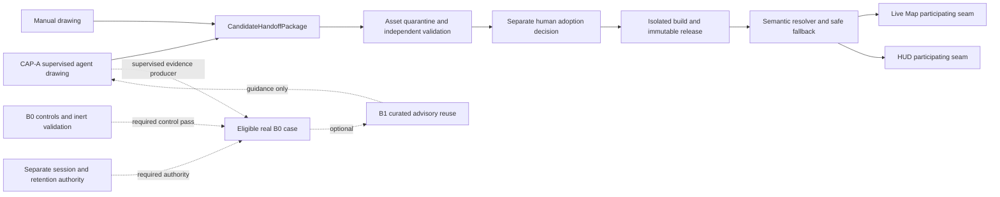

# Render and Art Program — Fresh-Agent Review Handoff

## Purpose and decision boundary

This is the entry point for a fresh AI or human reviewer evaluating the project's connected rendering and
art program. It explains what the documents are trying to achieve, how to read from overview to detail,
which decisions are already proposed, and which choices remain deliberately open.

This handoff is descriptive. It authorizes document review and milestone-plan refinement only. It does not
authorize implementation, dependency installation, Aseprite or MCP registration/execution, drawing
sessions, asset adoption, build or publication, runtime activation, renderer migration, native work,
adaptive-memory activation, or broad asset migration.

## Program goal

Deliver three independently useful but interoperable capabilities:

1. **Live Map rendering and HUD surfaces** — a readable browser presentation of the turn-based simulation,
   with independently operable map and HUD cores, explicit cross-surface interactions, measured renderer
   choices, accessibility, failure isolation, and Canvas rollback.
2. **Supervised agent-controlled pixel-art drawing** — determine whether an AI agent can deliberately
   construct, observe, revise, and preserve editable pixel assets through a bounded Aseprite control
   interface. This is agent-controlled drawing, not image-generation-based art.
3. **Visual asset management and runtime integration** — move an approved manual or CAP-A candidate through
   controlled handoff, human adoption, immutable source/build/release records, semantic resolution, safe
   fallbacks, compatible Live Map/HUD consumption, rollback, retention, and rights recall.

The combined program should support a useful browser product even when Aseprite CAP-A responsibly remains
NO-GO. Adaptive improvement (CAP-B), native delivery, renderer migration, Canvas scaling work, and broad
asset-family migration are conditional branches rather than assumed commitments.

## Read from overview to detail

### 1. Orientation and visual constraints

Read these first:

- [Project rendering overview](rendering-overview.md) — desired player-facing Live Map, HUD, and visual
  capabilities without detailed architecture.
- [Visual-system planning](visual-system-planning.md) — preliminary visual-language inventory, current
  16-pixel map-cell constraints, stress identities, and art questions that remain experimental.

For actual manual drawing-session order and evidence, use
[Detailed Plan 07](../../plans/render-and-art/07_manual_art_experiment_execution_plan.md). This general
handoff does not duplicate that experiment brief.

### 2. High-level architecture and decisions

Read the four owning proposals, then the portfolio roadmap:

1. [Live Map rendering client architecture](live_map_rendering_engine_architecture_proposal.md)
2. [Live Map/HUD surface integration architecture](live_map_hud_surface_integration_architecture.md)
3. [Aseprite agent-controlled pixel-art workflow](aseprite_mcp_pixel_art_workflow_proposal.md)
4. [Visual asset management and runtime integration](asset_management_and_runtime_integration_proposal.md)
5. [Three-epic full-delivery roadmap](three_epic_full_delivery_roadmap.md)

The roadmap coordinates the proposals but does not replace their authority. Its Section 2.1 maps every
portfolio alias to exact owner gates, prerequisites, evidence, permitted conclusions, and failure effects.

### 3. Detailed milestone packages

Read each package README before its numbered plans:

| Package | Goal | Detailed progression |
|---|---|---|
| [Live Map Rendering and Surface Integration](../../plans/render-and-art/README.md) | Deliver independently testable map/HUD cores, two explicit interaction directions, integrated browser evidence, and conditional native validation | `LMSI-G0` contract/evidence baseline → G1 Live Map → G2 HUD → G3 H2M → G4 M2H → G5 browser; G6 native only when triggered |
| [Aseprite Agent-Controlled Pixel Art](../../plans/aseprite-mcp-pixel-art/README.md) | Establish or reject supervised drawing capability without making adaptive memory or production assets prerequisites | M0 contract/tool dispositions → M1 CAP-A → independent M2 display harness; B0 controls → eligible evidence → B1 curated reuse → optional B2/B3 |
| [Visual Asset Management and Runtime Integration](../../plans/visual-asset-management-runtime-integration/README.md) | Provide the secure candidate-to-runtime lifecycle independently of who drew the candidate | M0 repository discovery → M1 contracts → M2 synthetic harness → M4 candidate rehearsal → M5 participating surfaces → conditional M6 pilot → optional M7 migration; M3/M8 coordinate CAP branches |

Each detailed milestone is conditional. A previous PASS supplies evidence, not inherited execution authority;
the next stage still requires its stated authorization and normal repository workflow.

## Decisions currently proposed

These are the architectural decisions a reviewer should test for consistency, not assume are implemented:

- The server remains authoritative. Rendering, HUD, assets, Aseprite tooling, and adaptive guidance are
  presentation/tooling concerns and cannot mutate `AuthoritativeState`; durable simulation changes still
  pass through the 39-phase authoritative pipeline.
- Canvas is the current browser renderer and rollback control. PixiJS is an evidence-gated candidate.
  Godot and native topology work are conditional experiments, not selected production directions.
- Live Map Core and HUD Core remain independently operable. HUD-to-map focus (H2M) and map-to-HUD
  inspection (M2H) are distinct typed, independently switchable routes with no automatic echo.
- Observation/session authorization (OBS), host-renderer control (HRC), preferences (PREF), and diagnostics
  are separate contract families rather than generic cross-surface messages.
- Unauthorized and nonexistent targets are observationally equivalent where distinction could reveal
  hidden world membership; revocation clears affected presentation data and fences late completions.
- Visual identities use finite semantic keys. Runtime/generated IDs do not receive unique art by default.
- Critical distinctions remain readable at native scale and cannot rely on hue, motion, hover, or a
  single-pixel cue alone. The current map cell is 16 pixels.
- Manual art and CAP-A are equal candidate producer classes. Both use the asset-owned versioned
  `CandidateHandoffPackage`; neither can assert adoption, publication, or activation.
- Candidate, adopted editable source, derived artifact, immutable release, activation, and audit records
  remain separate identities with human-controlled transitions.
- Each resolution/render transaction pins one compatible immutable asset snapshot. Stale work cannot
  populate current-generation cache state.
- Asset qualification requires only the surfaces a role actually uses: map-only, HUD-only, or shared.
- Runtime rendering never depends on Aseprite, MCP, mutable authoring workspaces, or CAP-B.
- CAP-A proves supervised drawing independently. CAP-B is staged separately: inert B0 control validation,
  separately authorized eligible real cases, small manually curated B1 reuse, then optional automated B2
  retrieval and B3 transfer only after useful evidence.
- Human review remains authoritative for subjective readability and adoption. Automated checks and external
  scores may inform bounded evidence but cannot approve art or activate guidance/assets.
- Post-activation license, authorship, provenance, or policy invalidation triggers an attributable recall
  path covering distribution, current/stale/offline clients, caches, rollback, late work, and evidence holds.

## Cross-epic wiring

The arrows are capability boundaries, not automatic promotions. Manual and CAP-A candidates can be
rejected at intake or adoption. A release can be rejected before activation. Either surface may participate
without requiring the other when the semantic role is surface-specific. CAP-B failure does not invalidate
CAP-A, and CAP-A failure does not invalidate manual drawing, asset infrastructure, or browser delivery.

## Decisions intentionally unfrozen

Do not treat any current example, experiment size, or candidate as settling:

- final sprite or icon resolution;
- final palette, ramps, art style, or rendering aesthetic;
- final status/effect roster or full skill roster;
- final Place representation or footprint treatment;
- faction-emblem breadth;
- animation frame count, timing, or production scope;
- production renderer or Canvas retirement;
- native delivery requirement or N1/N2/N3 topology;
- asset storage, packing, atlas, binary/LFS, publication, or deployment technology;
- supported-client breadth and numeric performance/storage/retention budgets;
- CAP-B schema, retriever, embedding, scorer, retention technology, or activation;
- broad asset-family migration order.

Unverified repository or platform facts remain `UNVERIFIED` and create investigation tasks. They must not be
converted into production requirements by inference.

## Current authorization state

| Activity | Current state |
|---|---|
| Review and refine proposals/milestone plans | Allowed within documentation scope |
| Scope future tickets | Allowed only through the normal repository workflow |
| Implementation or dependency changes | Not authorized by these documents |
| Aseprite installation, registration, execution, or CAP-A pilot | NO-GO pending its gates and new authority |
| Manual drawing sessions or asset creation | Not authorized by this handoff |
| Candidate adoption, build, publication, or runtime activation | Separate staged human authority required |
| CAP-B real-case recording or retrieval | Not authorized; real recording requires B0 PASS plus separate session/retention authority |
| Native work | Dormant until an explicit native Must and one topology are approved |
| Broad migration or Canvas retirement | Not authorized; per-family/per-path evidence and approval required |

## Fresh-review questions

A fresh reviewer should answer these rather than merely summarize the documents:

1. Are repository facts, measured evidence, active plans, proposals, and external-review hypotheses clearly
   distinguished?
2. Do the four proposals and three milestone packages assign each concern to exactly one owner?
3. Are all roadmap aliases traceable to exact owner gates without weakening their prerequisites or failure
   consequences?
4. Can Live Map, HUD, CAP-A, manual art, asset infrastructure, and CAP-B stop or proceed independently where
   claimed?
5. Can any agent, adapter, renderer, client, build worker, or asset path bypass server visibility or the
   authoritative mutation pipeline?
6. Are candidate handoff, adoption, build, publication, activation, rollback, recall, and garbage collection
   distinct and recoverable?
7. Do failure tests cover stale generations, restarts, revocation, unauthorized probing, offline clients,
   cache contamination, missing assets, inaccessible cues, and combined fallbacks?
8. Does any wording accidentally freeze an art/technology choice or grant authority for execution?
9. Are PASS, FAIL, BLOCKED, and INCONCLUSIVE outcomes evidence-backed and scoped to their exact gate?
10. Which remaining `UNVERIFIED` facts must become repository investigations before any executable ticket?

## Expected review output

Return:

- an overall `PASS`, `NEEDS_CHANGES`, or `BLOCKED` planning-readiness verdict;
- a finding register with severity, exact document/section, evidence, and proposed correction;
- contradictions between proposals and detailed owner plans;
- missing security, accessibility, recovery, evidence, or authorization gates;
- any accidental production/art/tool freeze;
- explicit confirmation that the review itself grants no implementation or execution authority.

Treat external AI reviews as hypotheses. Repository rules and current source evidence win when they
conflict, and unresolved facts stay `UNVERIFIED`.
