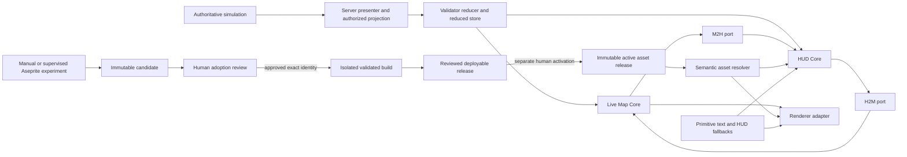
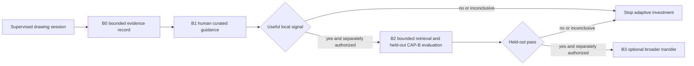
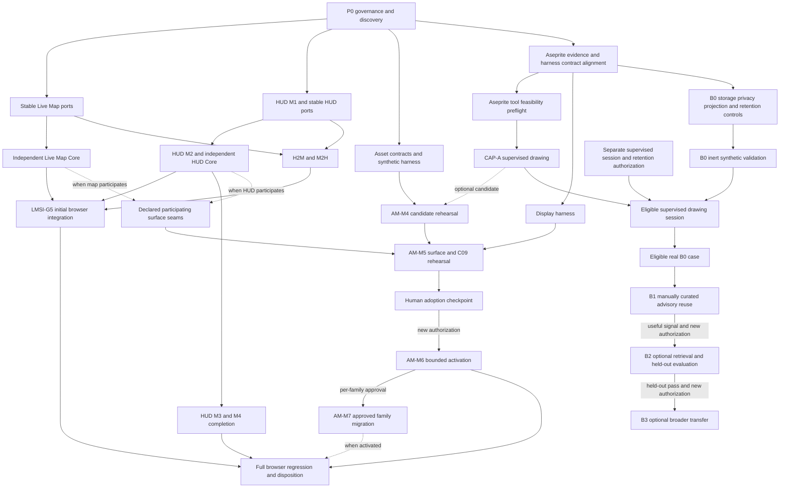

# Roadmap — Full Delivery of the Three Rendering and Art Epics

## Status and decision boundary

This is the portfolio roadmap for delivering and wiring:

1. [Live Map Rendering and Surface Integration](../../plans/render-and-art/README.md);
2. [Aseprite Agent-Controlled Pixel Art](../../plans/aseprite-mcp-pixel-art/README.md);
3. [Visual Asset Management and Runtime Integration](../../plans/visual-asset-management-runtime-integration/README.md).

It sequences their existing milestones; it does not replace or silently broaden them. This document is
planning-only. It does not authorize implementation, ticket creation, dependency installation, Aseprite or
MCP execution, drawing, asset adoption, build/publication, renderer selection, deployment, or activation.
Every implementation slice still enters the repository's normal ticket workflow and gates.

“Full delivery” means every mandatory capability passes its owning gates and every conditional branch has
an explicit evidence-backed disposition. It does not mean forcing a failed experiment, implementing both
deployment profiles, migrating every visual, creating art for generated IDs, selecting a native topology,
or building automated retrieval without useful signal.

## Table of contents

- [1. Program outcome](#1-program-outcome)
- [2. Authority and conflict rules](#2-authority-and-conflict-rules)
- [3. Repository starting point](#3-repository-starting-point)
- [4. Target system and wiring boundaries](#4-target-system-and-wiring-boundaries)
- [5. Dependency graph and critical path](#5-dependency-graph-and-critical-path)
- [6. Delivery waves](#6-delivery-waves)
- [7. Cross-epic integration checkpoints](#7-cross-epic-integration-checkpoints)
- [8. Test and evidence strategy](#8-test-and-evidence-strategy)
- [9. Release, activation, rollback, and recovery](#9-release-activation-rollback-and-recovery)
- [10. Ticket and change-management strategy](#10-ticket-and-change-management-strategy)
- [11. Security and authoritative-state constraints](#11-security-and-authoritative-state-constraints)
- [12. Risks, stop conditions, and valid terminal outcomes](#12-risks-stop-conditions-and-valid-terminal-outcomes)
- [13. Program completion criteria](#13-program-completion-criteria)
- [14. Decisions that remain unfrozen](#14-decisions-that-remain-unfrozen)
- [15. Source map](#15-source-map)

## 1. Program outcome

The successful browser outcome is:

- a renderer-neutral Live Map Core and independently usable HUD Core;
- explicit, separately switchable HUD-to-map (`H2M`) and map-to-HUD (`M2H`) interaction ports;
- a tested browser composition with server-authorized observation, host/render lifecycle, preferences,
  accessibility, diagnostics, failure isolation, and Canvas rollback;
- a supervised, bounded agent-controlled Aseprite capability that can produce immutable experimental
  candidates without automatic adoption;
- a semantic asset registry, validated build/provenance path, release snapshot, runtime resolver,
  information-preserving fallback, cache-generation fencing, retention, and rollback;
- one explicitly authorized noncritical asset role piloted in the live browser surfaces;
- only approved visual families migrated incrementally, with the primitive route retained until its own
  retirement criteria pass;
- adaptive guidance staged independently: evidence-only recording, cheap manually curated reuse, then
  optional automated retrieval and broader transfer only when prior evidence justifies them.

The program is presentation-only. The server remains authoritative, and every durable simulation mutation
continues through the 39-phase authoritative mutation pipeline.

### 1.1 Mandatory, conditional, and parallel outcomes

| Track | Portfolio completion treatment | Valid conditional disposition |
|---|---|---|
| Live Map/HUD | `LMSI-G0`–`LMSI-G5`, plus completion of the relevant HUD delivery chain | `G6` native is omitted unless a native Must and one topology are approved |
| Aseprite CAP-A | Preflight and supervised drawing capability must pass for the agent-controlled drawing claim | A CAP-A fail/no-go closes the experiment truthfully but does not invalidate manual art or browser rendering |
| Display harness | Required for comparable native-scale CAP-A/art evidence; may be implemented without Aseprite | May use synthetic/manual fixtures before CAP-A |
| Asset management | `AM-C01`–`AM-C10` through one bounded noncritical pilot | M7 migrates only individually approved families; “do not migrate” is valid per family |
| Manual art | Independent experiment stream and candidate source | May stop after any failed session; never gates renderer/asset infrastructure |
| CAP-B | Off the browser critical path; if the adaptive branch is activated, B0 and B1 resolve whether useful reuse signal exists | B2/B3 remain off when B1 signal or later held-out evidence is insufficient |
| Live-map scaling | M2 rendering optimization and M3 interest management only after their measured-need gates | Retain current behavior when measurements do not justify either |

## 2. Authority and conflict rules

| Concern | Owning plan | Portfolio rule |
|---|---|---|
| Renderer/surface seams and `LMSI-G*` | Live Map Rendering and Surface Integration package | This roadmap orders its work but does not redefine gates |
| Existing HUD M1–M4 content delivery | [HUD delivery roadmap](../../plans/hud_delivery_roadmap.md) and tickets | HUD sequence remains M1 → M2 → M3 → M4 |
| Measured Canvas optimization and interest management | [Live Map scaling roadmap](../../plans/live_map_scaling_roadmap.md) and open epics | Start only on measured need; neither is implied by renderer experiments |
| Agent-controlled drawing and `CAP-A`/`CAP-B` | Aseprite package | CAP-A remains deliverable without CAP-B |
| Manual drawing questions and identities | [Manual art experiment plan](../../plans/render-and-art/07_manual_art_experiment_execution_plan.md) | Results may inform candidates, never production specifications directly |
| Asset lifecycle and `AM-C*` | Visual Asset Management package | Candidate, adopted source, artifact, release, and activation remain distinct |
| Simulation state and visibility authority | Server and [authoritative pipeline](../../engine/authoritative_pipeline.md) | No client, renderer, asset, MCP, or feedback path may mutate or reveal truth |

When plans overlap, the owner above governs. A portfolio checkpoint may require evidence from multiple
owners, but it cannot turn evidence reuse into shared implementation ownership.

### 2.1 Owner-identifier traceability

The mappings below were checked against the linked detailed packages on 2026-09-11. They make the five-file
handoff self-contained without transferring gate authority into this roadmap. For every row, a missing
prerequisite or authorization is `BLOCKED`, a valid run that violates the stated gate is `FAIL`, and an
executed run with invalid, incomplete, contaminated or ambiguous evidence is `INCONCLUSIVE`. `PASS` requires
the complete owner evidence summarized in the row and detailed in the linked plan. The listed failure
consequence is a minimum; an owning plan may require a stronger stop or rollback.

#### Live Map Rendering and Surface Integration (`LMSI`)

| Alias and owner plan | Exact proposal-native inputs | Prerequisites | Required evidence and `PASS` | Permitted conclusion | `FAIL` consequence |
|---|---|---|---|---|---|
| [`LMSI-G0`](../../plans/render-and-art/00_contract_and_evidence_baseline_plan.md) | Renderer Phase 0; Surface M0; classified `LMSI-OQ-*` blockers | Human review; accountable contract/evidence owners | Ownership/glossary, coherent identity contracts, representative Canvas control charter/result, predeclared thresholds | Scope affected port, fixture and later experiment tickets | Withdraw disputed contracts; no implementation or renderer decision |
| [`LMSI-G1`](../../plans/render-and-art/01_live_map_core_and_renderer_evidence_plan.md) | Renderer Phases 1–4; `EX-F01`–`EX-F07`, `EX-P01`–`EX-P06`; Surface M1, `LM-FR-01`–`LM-FR-06`, `EX-X01` | G0; coherent protocol/replay seam; approved candidate charter for any comparison | LM-only harness, replay/fault suite, Canvas control and eligible renderer result bundle all meet their scoped gates | Live Map Core readiness plus a retain/revise/next-decision renderer disposition | Disable/archive candidate, retain Canvas; no production adoption |
| [`LMSI-G2`](../../plans/render-and-art/02_hud_core_readiness_plan.md) | Surface M2; `HUD-FR-01`–`HUD-FR-06`; `EX-X02`; applicable HUD M1/M2 gates | HUD M1 and fixture-backed selectors/navigation seam | HUD-only workflow, history/return, unavailable-state and accessibility evidence pass with recording/no-op H2M | HUD Core readiness only | Revert adapter/slice; HUD roadmap sequence remains authoritative |
| [`LMSI-G3`](../../plans/render-and-art/03_h2m_focus_interaction_plan.md) | Surface M3; `H2M-FR-01`–`H2M-FR-07`; `EX-X03` and H2M half of `EX-X05` | G0; stable HUD explicit-action and LM focus ports; scope identities; `FocusLocation` decision where used | Two-message contract, security/non-enumeration, timeout/dedup/restart, no-echo and independent rollback evidence pass | Minimum H2M readiness only | Disable H2M and expire pending work; both cores/M2H remain usable |
| [`LMSI-G4`](../../plans/render-and-art/04_m2h_inspection_interaction_plan.md) | Surface M4; `M2H-FR-01`–`M2H-FR-07`; `EX-X04` and M2H half of `EX-X05` | G0; stable explicit-picking and HUD navigation ports; gesture/focus and scope identities | Three-intent contract, accessibility, security/non-enumeration, dedup/restart, no-echo and rollback evidence pass | Minimum M2H readiness only | Disable M2H; map-local use and HUD Core remain usable |
| [`LMSI-G5`](../../plans/render-and-art/05_integrated_browser_validation_plan.md) | Surface M5; `EX-X06` and `EX-X07`; applicable `OBS-FR-*`, `HRC-FR-*`, `PREF-FR-*`; renderer Section 16.3 gate | `LMSI-G1`–`LMSI-G4`; support-family applicability; named browser renderer/control charter | Six modes, required control families, browser performance/accessibility/security/failure isolation and Canvas rollback pass | Integrated browser readiness for a separate adoption decision | Disable integrations/candidate and restore Canvas; no native or production claim |
| [`LMSI-G6`](../../plans/render-and-art/06_conditional_native_validation_plan.md) | Surface conditional-native milestone and `EX-X08`; renderer Phase 5 only when Godot is the approved question | Explicit native Must, one named N1/N2/N3 topology, owner and charter | Topology-specific build, bridge/copy/drift, security, accessibility, failure/recovery and rollback evidence passes | Readiness evidence for that exact native mapping only | Remove/archive disposable native work and restore prior host |

#### Visual Asset Management (`AM`)

| Alias and owner plan | Exact proposal-native gates | Prerequisites | Required evidence and `PASS` | Permitted conclusion | `FAIL` consequence |
|---|---|---|---|---|---|
| [`AM-M0`](../../plans/visual-asset-management-runtime-integration/00_repository_grounded_discovery_plan.md) | Evidence toward `ASSET-0` / `AM-C01`; closes no capability gate | Planning-only repository access and pinned owner documents | Sourced repository/deployment/authority dossier is complete, unknowns explicit, and neither profile selected | Supply factual input to M1 | Archive invalid discovery; M1 does not start |
| [`AM-M1`](../../plans/visual-asset-management-runtime-integration/01_architecture_decisions_and_contracts_plan.md) | `ASSET-0`; `AM-C01` | M0 PASS/human acceptance; named architecture, security, provenance, accessibility and rollback roles | One deployment profile, minimum contracts, threat/authority model and downstream charters are coherent | Asset architecture decisions for separately authorized synthetic work | Supersede decisions; Canvas/Vite stay unchanged; M2 stops |
| [`AM-M2`](../../plans/visual-asset-management-runtime-integration/02_synthetic_contract_harness_plan.md) | `ASSET-1`; `AM-C02`; evidence toward `AM-C05`–`AM-C07` and `AM-C09` | M1 PASS and a separate synthetic-harness ticket/charter | Finite semantic resolution, strict manifests, fallbacks, snapshot/cache fencing, rollback and GC dry run pass on inert fixtures | Synthetic contract/harness readiness only | Remove harness state and retain current primitive path |
| [`AM-M3`](../../plans/visual-asset-management-runtime-integration/03_experimental_drawing_capability_plan.md) | Coordination only; `CAP-A*` remains Aseprite-owned | Independently authorized CAP-A plan, if activated | Crosswalk preserves candidate/non-adoption and producer boundaries; no asset gate is claimed | Coordination disposition only | Stop crosswalk; asset and CAP paths remain independent |
| [`AM-M4`](../../plans/visual-asset-management-runtime-integration/04_candidate_adoption_rehearsal_plan.md) | `ASSET-2`; `AM-C03`, `AM-C04`, and `AM-C08` | `AM-M1`/`AM-M2` PASS; approved disposable fixture, rights, isolation and execution scope | Handoff intake, immutable source/artifact/provenance, isolated build, revocation and cleanup evidence pass | Disposable candidate/adoption rehearsal only | Quarantine/remove rehearsal state; no adopted, published or active state |
| [`AM-M5`](../../plans/visual-asset-management-runtime-integration/05_surface_compatibility_rehearsal_plan.md) | `ASSET-3`; `AM-C05`, `AM-C06`, `AM-C07`, and `AM-C09` | `AM-M2`/`AM-M4` PASS; declared participating seams/clients and isolated charter | Applicable surface, snapshot, fallback, accessibility, supported-client, retention and isolation evidence pass | Compatibility of only the declared map/HUD surfaces | Unmount resolver/cache and retain primitive controls |
| [`AM-M6`](../../plans/visual-asset-management-runtime-integration/06_bounded_activation_pilot_plan.md) | `ASSET-4`; `AM-C10` with fresh `AM-C01`–`AM-C09` | All prior applicable gates; one adopted noncritical role; new named pilot authority | Bounded activation, monitoring, cache fencing, rollback and rights-recall drills pass | Human disposition for that one role | Roll back/disable role, quarantine release and stop expansion |
| [`AM-M7`](../../plans/visual-asset-management-runtime-integration/07_incremental_migration_plan.md) | `ASSET-5`; every affected `AM-C*` rerun | M6 PASS plus separate per-family/batch approval | Family-specific compatibility, fallback, client, rollback, regression and retirement evidence passes | Retain or roll back only that approved family/batch | Restore that family to prior release/primitive path; do not broaden migration |

#### Aseprite Agent-Controlled Drawing and Adaptive Stages

| Alias and owner plan | Exact proposal-native gates | Prerequisites | Required evidence and `PASS` | Permitted conclusion | `FAIL` consequence |
|---|---|---|---|---|---|
| [Aseprite M0](../../plans/aseprite-mcp-pixel-art/00_authority_contracts_and_preflight_plan.md) | No CAP gate; separate contract-alignment and tool-feasibility dispositions | Planning/source-review authority; named owners and predeclared safety/evidence questions | Repository/source/licensing/options evidence supports each disposition without installation or execution | Scope a later bounded ticket or retain NO-GO | Reject tool option; independent evidence/display contracts may remain usable |
| [Aseprite M1](../../plans/aseprite-mcp-pixel-art/01_supervised_headless_drawing_plan.md) | `CAP-A01`–`CAP-A08`, `CAP-A11` **(2026-09-13, added by review)**; optional `CAP-A10` | Applicable M0 tool disposition plus separate execution authority, isolated host and exact manifest | Control, deterministic construction, editable structure, observation/correction, variants, multi-asset recovery, safety/latency, and authorization-boundary evidence all pass | Supervised agent-controlled drawing for the tested scope | Any A08 or A11 failure is NO-GO; earlier failures stop/replace or downgrade capability |
| [Aseprite M2](../../plans/aseprite-mcp-pixel-art/02_display_harness_support_plan.md) | `CAP-A09`; supports `ART-W04` and `ART-W05` | Approved visual-test/import contracts and renderer seam; no M1/Aseprite prerequisite | Bounded candidate import and fully identified native-scale capture/fallback evidence pass | Display-harness readiness only | Remove experiment route/cache; current Canvas/manual testing remains |
| [Aseprite M3 / B0](../../plans/aseprite-mcp-pixel-art/03_b0_evidence_recording_plan.md) | Foundations for `CAP-B01`, `CAP-B06`, and `CAP-B09`; none fully pass | Approved evidence/archive/privacy contracts; separate authority before any real case | Inert fixtures prove reconstruction, tamper detection, safe projection, quarantine, retention/revocation and no leakage | B0 control readiness; not adaptive improvement | Disable/quarantine recording and retrieval surfaces; return to stateless CAP-A |
| [Aseprite M4 / B1](../../plans/aseprite-mcp-pixel-art/04_b1_manual_advisory_reuse_plan.md) | `CAP-B05-L`; preliminary `CAP-B02`–`CAP-B04`, `CAP-B08`, and `CAP-B09` | Valid B0 controls, eligible supervised cases, human curator and preregistered comparison | Small manually curated advisory reuse shows useful local signal without authority, leakage or non-regression failure | Decide whether planning B2 is justified | Stop adaptive investment on fail/inconclusive unless one bounded evidence-defect rerun is approved |
| [Aseprite M5 / B2](../../plans/aseprite-mcp-pixel-art/05_b2_automated_retrieval_plan.md) | Full `CAP-B01`–`CAP-B09`, including held-out `CAP-B05` | B1 useful-signal PASS and new authorization; frozen corpus/index/splits | Bounded retrieval, human activation, provenance/rollback, security and held-out causal improvement all pass | Adaptive capability for the tested scope only | Disable retrieval/active playbook and retain supervised CAP-A |
| [Aseprite M6 / B3](../../plans/aseprite-mcp-pixel-art/06_b3_broader_transfer_plan.md) | Applicable `CAP-B02`–`CAP-B09` reruns plus preregistered scope-transfer evidence | B2's `CAP-B01`–`CAP-B09` PASS, uncontaminated new family and separate authorization | Held-out transfer and every applicable safety/non-regression gate pass | Experimental transfer conclusion for named families only | Stop/roll back transfer; no production-pipeline or project-wide claim |

Every future ticket must cite both its roadmap wave and exact owner identifier. Missing owner evidence is
`BLOCKED`; a roadmap label never supplies substitute evidence.

## 3. Repository starting point

Verified planning baseline as of 2026-09-11:

- Live Map reconnection is DONE: REST/WS projection, entity deltas, pause/resume and phased loading exist.
- Its planned live-browser FPS measurement remained incomplete; `LMSI-G0/G1` must repair or truthfully
  classify that evidence before comparative renderer conclusions.
- Canvas is the current renderer, control and rollback route; PixiJS is an experiment candidate, not an
  adopted dependency. Godot and native delivery remain conditional.
- Live Map rendering-performance and interest-management epics are OPEN but measured-need gated.
- HUD M1 and its child tickets are OPEN; HUD M2–M4 remain sequential scope-only epics.
- No working Aseprite/MCP adapter, editor installation, dedicated sandbox, production art tree, semantic
  runtime resolver, production asset catalog, or activated asset release is assumed.
- React/TypeScript/Vite, Vitest and Playwright are the current frontend stack. Exact supported browser,
  deployment, cache/offline and native-client policies remain subject to repository-grounded decisions.
- The current map cell is 16 pixels. Native-scale one-cell readability and non-hue critical distinctions
  remain mandatory test constraints. **(2026-09-13, added by review)** This is a repository implementation
  fact used as a test parameter, not a sprite-resolution decision — see
  `visual-system-planning.md`'s own line "The current 16-pixel cell is a real implementation fact, not a
  required sprite resolution." Every wave below that reuses "16-pixel cell" (§6, §8.3) inherits this same
  caveat; §14's "final sprite/icon resolution... remain unfrozen" is not contradicted by testing at the
  current cell size, but repeated reuse of one fixed number as a test constant should not be read as
  quietly deciding it.

Every wave re-investigates the then-current repository. A fact missing from the checkout is recorded as
`UNVERIFIED`, not invented.

## 4. Target system and wiring boundaries

### 4.1 Runtime and authoring flow

Only the server projection feeds semantic truth. H2M requests focus/navigation effects; M2H requests HUD
inspection. Neither route transports assets, grants observation, or mutates simulation state. The runtime
resolver maps finite semantic visual keys to immutable artifacts and safe fallbacks; it never derives
unique assets from runtime/generated IDs.

### 4.2 Adaptive feedback flow

Evidence, scores and guidance never auto-promote a drawing candidate, source asset, build, release, or
runtime activation. Disabling CAP-B restores the prior human-approved rule revision and leaves CAP-A and
all production releases unchanged.

### 4.3 Stable integration contracts

Before cross-epic wiring, the owning plans must agree on:

- world, session, stream, map, projection revision, tick and semantic-target identity;
- finite semantic visual keys and variant precedence, independent of entity instance IDs;
- strict manifest/release compatibility, bounds, hashes, trusted locators and fallback safety classes;
- renderer-neutral scene descriptors and HUD visual descriptors;
- H2M/M2H envelopes, outcomes, generations, timeouts and deduplication;
- separate OBS, host/render-control, preference and diagnostic families;
- immutable candidate/source/artifact/release/audit identities and human authorization roles;
- supported-client, cache generation, stale-load, rollback and retention behavior.

### 4.4 Candidate handoff boundary

The asset-management proposal owns the versioned `CandidateHandoffPackage`. Manual and CAP-A producers
may emit it, but cannot define adoption semantics. Intake copies the candidate across the trust boundary,
independently verifies its declared hashes/structure/provenance/rights, and either quarantines it or makes
it eligible for a separate human adoption decision. Handoff never means adoption, publication or activation.

Manual session records remain outside CAP-B by default. CAP-B real cases come only from separately
authorized supervised agent sessions after B0 controls pass. Mixing manual and agent cases requires a
future CAP-B owner amendment defining producer classes, corpus separation, scope matching, baseline leakage
controls and permitted conclusions.

### 4.5 Identity and generation namespaces

| Identity/version | Owner/writer | Scope and reset | Comparison and boundary rule |
|---|---|---|---|
| Authenticated session | Server/session authority | Login/re-auth/session expiry | Never substituted by UI, renderer or asset generation |
| World/map/stream | Server projection protocol | World/map change, reconnect/resubscribe | Wrong scope fails closed; semantic targets re-resolve only inside permitted projection |
| Projection revision and tick | Server presenter/reducer | Snapshot/resync/restart | Orders simulation projection only; not compared numerically with UI generations |
| Host instance generation | Host integration owner | Host process/view/container recreation | Invalidates old host measurements and control delivery; never orders renderer or projection work |
| Renderer lifecycle generation | Render adapter | Renderer/context loss or renderer restart | Invalidates old readiness, picking and render completions; compared only inside its host contract |
| Coordinator instance generation | Interaction coordinator | Coordinator restart/replacement | Invalidates pending route/dedup state; no blind replay into a new instance |
| Live Map destination instance | Live Map Core | Map core/view recreation | Old H2M and picking completions cannot mutate the new map instance |
| HUD instance generation | HUD host/core | HUD reload/recreation | Old navigation/focus completions cannot mutate the new instance |
| Client-build identity | Release/deployment owner | Frontend deploy/reload | Governs Profile A compatibility and complete-release rollback |
| Asset release/activation generation | Asset release owner | Profile A build or Profile B activation | One immutable snapshot per resolution transaction; compare only under declared client/renderer ranges |
| Preference version | Preference owner | User/profile update | Latest valid value wins; not a simulation or renderer generation |
| Playbook/index version | CAP-B human curator/index owner | Approved guidance/index activation | Cannot select art, runtime releases or tools |
| Evaluation epoch/split | CAP-B evaluation owner | Preregistered trial/split change | Prevents contamination; never used as runtime freshness |

Unrelated namespaces are never compared, ordered, substituted, or collapsed into one “generation.” A stale
asset load may finish for its pinned old snapshot but cannot populate or replace current-snapshot cache
state. Renderer, client and projection versions may coexist with an older asset snapshot when their
declared compatibility ranges allow it.

## 5. Dependency graph and critical path

The mandatory browser-product path and asset-pilot path converge at final regression:

- browser: `P0 → stable LM/HUD ports → {independent LM/HUD core closure, H2M/M2H} → G5`;
- asset: `P0 → AM-M2 → AM-M4 → stable surface seams/display harness → AM-M5 → human adoption → AM-M6`;
- completion: HUD M3/M4 plus both passing paths → final regression.

CAP-A has its own mandatory critical path for the drawing-capability claim, but AM-M4 may use a manual or
synthetic disposable candidate so CAP-A failure does not block asset-architecture learning. CAP-B, native
delivery, live-map optimizations and each AM-M7 family are conditional branches.

## 6. Delivery waves

### Wave P0 — Portfolio governance and repository-grounded decisions

**Sources:** `LMSI-G0`, Aseprite M0, AM-M0 and AM-M1.

Work:

- accept the three package boundaries and name accountable protocol, Live Map, HUD, interaction,
  accessibility, evidence, art-review, security, release and rollback owners;
- re-investigate current code, tests, dependencies, supported platforms, deployment/cache behavior,
  binary/licensing rules and existing ticket overlap;
- repair or classify the Canvas live-browser baseline;
- resolve shared identity vocabulary and interaction questions;
- select exactly one asset deployment profile in AM-M1 after AM-M0 selects neither;
- define semantic registry, descriptor, release, audit/provenance, fallback, compatibility, trust,
  retention and evidence contracts;
- resolve the Aseprite host/tool/license/isolation/dependency decision without installing or executing it.

Parallelism: LMSI, AM-M0 and Aseprite preflight investigations may run concurrently. Shared owners perform
one reconciliation review before any schema is implemented.

Exit:

- `LMSI-G0` and `AM-C01` pass;
- Aseprite preflight has a valid PASS or a truthful stop result;
- no shared term has conflicting owners;
- exact implementation tickets can be scoped without inventing deployment, tool or security facts.

Tests/evidence: contract examples; wrong-world/session cases; fake-port routing; deployment/profile ADR;
threat models; environment manifests; baseline raw results; no runtime mutation.

Rollback: withdraw unaccepted ADRs/contracts and retain the existing Canvas/Vite path.

### Wave P1 — Foundations and isolated harnesses

**Sources:** LMSI G1/G2 foundations, HUD M1, Aseprite display harness, AM-M2.

Work:

- implement strict projection validation, deterministic presentation reduction, atomic reduced store,
  renderer-neutral LM selectors, tick/frame policy and map-local state facade;
- implement the HUD thin foundation: semantic tokens, minimal layout wrapper, durable
  selection/navigation, ranked search/filter and before-change observer-task baseline;
- establish renderer-neutral Canvas adapter and no-HUD/no-H2M harness;
- implement a display comparison harness that can ingest synthetic/manual candidates without Aseprite;
- implement the tiny synthetic semantic asset resolver and catalog harness with fallbacks, snapshot/cache
  generation fencing, compatibility rollback and GC dry runs;
- keep every harness isolated from the normal product path.

Parallelism: HUD M1, LM reducer/store work, the display harness and AM-M2 may proceed concurrently after
their own P0 contracts. Coordinate shared frontend fixtures; do not share state ownership.

Exit:

- HUD M1 is DONE and its baseline retained;
- LM reducer/store/selector and Canvas control harness pass;
- Aseprite display-harness gate passes independently;
- `AM-C02` passes and contributing C05–C07/C09 evidence is retained;
- normal Canvas/HUD behavior remains unchanged.

Tests/evidence:

- schema/parser unit and adversarial tests;
- deterministic replay, duplicate/reorder/gap/resync/restart tests;
- selector/state isolation and no-op port tests;
- HUD navigation restoration and keyboard/focus tests;
- asset unknown-key, cycle/depth/cardinality, fallback and cache-generation tests;
- native-scale capture and synthetic GC/rollback dry runs.

Rollback: remove adapters/harnesses behind their seams, restore Canvas and recording/no-op ports, preserve
fixtures and evidence.

### Wave P2 — Independent product capabilities and supervised drawing

**Sources:** LMSI G1/G2, HUD M2, Aseprite M1, manual ART-W01–W07, AM-M4.

Work:

- finish Live Map Core isolation, Canvas baseline and at most one evidence-justified Canvas optimization;
- run the disposable PixiJS functional/performance comparison; run Godot only on its named trigger;
- deliver HUD M2's notice → locate → inspect → follow → return workflow and close HUD Core isolation;
- implement supervised CAP-A only after host, editor, adapter, confinement and authorization gates pass;
- run manual silhouette, grayscale item, skill grammar, size, crowded composition, color and optional idle
  experiments independently;
- rehearse one disposable candidate through source/artifact/provenance/catalog/audit records under AM-M4.

Parallelism: CAP-A/manual art, LM renderer evidence, HUD M2 and AM-M4 are independent after their
prerequisites. M4 may use synthetic/manual input and never waits for CAP-A.

Exit:

- `LMSI-G1` and `LMSI-G2` pass with retained evidence; renderer disposition may be retain-Canvas;
- CAP-A capability gates pass for the claimed supported operation set, or the capability is truthfully
  closed no-go;
- AM-C03, C04 and C08 pass without adopted/active state;
- manual sessions have explicit pass/fail/exploratory records;
- no experiment candidate is automatically adopted.

Tests/evidence:

- LM/HUD absent-opposite-surface harnesses;
- browser fixture parity and native-scale crowded captures;
- frame/backlog/memory/startup/payload distributions;
- Aseprite typed-operation, bounds, path/network/process-denial, deterministic-provenance and recovery
  checks;
- immutable candidate hashes, independent build validation, license/provenance and cleanup proof.

Rollback: Canvas remains default; remove experiment dependencies and disposable workspaces; reject or
quarantine candidate records without touching runtime state.

### Wave P3 — Directional wiring and initial browser integration

**Sources:** LMSI G3, G4 and G5; Aseprite B0 control validation may begin; AM-M5 preparation.

Work:

- implement minimum H2M focus separately from minimum M2H explicit inspection;
- prove both directions off, H2M-only, M2H-only and full-direction modes;
- integrate OBS only when the workflow changes authorized observation;
- integrate host/render-control, reduced-motion preferences and bounded/redacted diagnostics as separate
  families;
- run the mandatory six-mode browser harness, full fault campaign, quality campaign and Canvas rollback;
- implement and validate B0 storage, privacy, safe-projection, quarantine, retention and reconstruction
  controls using inert synthetic fixtures, with no retrieval into agent context;
- do not record a real CAP-B drawing case until CAP-A passes, B0 controls pass, separate supervised-session
  and retention authority exists, and that authorized session produces an eligible case;
- connect the asset surface rehearsal to the stable renderer/HUD descriptor seams without normal-path
  activation.

Exit:

- `LMSI-G3`, `LMSI-G4` and the initial `LMSI-G5` pass;
- all six modes and support-family isolation pass;
- B0 synthetic control evidence is bounded, redacted, attributable and not retrievable into agent context;
- real B0 case recording remains blocked unless CAP-A, B0-control, supervised-session and retention-authority
  gates all pass;
- AM-M5 has an approved surface/client/native-scale charter.

Tests/evidence:

- wrong target/world/session, duplicate, timeout, supersession and stale-generation interactions;
- zero echo loops and no direct cross-component callback;
- OBS authorize/deny/revoke and resync;
- resize/DPR/suspend/resume/readiness generation;
- preference versioning, keyboard/screen-reader/reduced-motion and no-hue checks;
- component, direction, coordinator, diagnostics and whole-tab failure cases;
- end-to-end replay and Canvas restoration.

Rollback: independently disable H2M, M2H, OBS, HRC, PREF or diagnostics; reset generations; restore
Canvas; preserve both cores.

### Wave P4 — Full HUD completion and asset surface qualification

**Sources:** HUD M3/M4 and AM-M5.

Work:

- use HUD M2 evidence to extract only justified chassis patterns;
- migrate remaining HUD panels by observer workflow;
- rerun M1 observer tasks, correct measured regressions, and complete cross-panel consistency;
- rehearse the disposable semantic release across only its declared participating Live Map and/or HUD seams;
- repeat retention/GC using M4 records, supported-client roots, rollback roots, evidence pins and in-flight
  work to close pre-pilot C09;
- rerun affected G5 modes after HUD migration and surface-adapter changes.

Parallelism: HUD M3/M4 remain sequential after HUD M2; neither is gated on initial G5. Initial G5, HUD M3
and AM-M5 preparation may overlap after their own prerequisites. AM-M5's final surface conclusion waits
for the declared HUD/LM revision, and final portfolio regression waits for HUD M4 and both G5/AM-M5.

AM-M5 qualifies only the surfaces declared for the candidate role:

| Role applicability | Required stable seam |
|---|---|
| Map-only | Live Map descriptor/resolver adapter and map fixture |
| HUD-only | HUD descriptor/resolver adapter and HUD fixture |
| Shared | Both participating adapters plus cross-surface consistency fixture |

Unrelated HUD panel migration never blocks a map-only rehearsal or pilot. Full HUD M4 still precedes the
final all-surface portfolio regression.

P4 is a coordination wave, not a global barrier. A role-specific P5 pilot may proceed after its applicable
`ASSET-3` and owning surface gates pass without waiting for unrelated HUD M3/M4 work; final portfolio
completion still waits for the full mandatory HUD chain.

Exit:

- HUD M1–M4 are DONE with before/after evidence;
- `AM-C05`, C06, C07 and C09 pass;
- current and supported-old client behavior, stale loads, accessibility, fallbacks and rollback are valid;
- final pre-pilot G5 regression passes;
- no production release or adopted asset exists merely because the rehearsal passed.

Tests/evidence:

- complete HUD workflow and return-context regression;
- every panel's volatility/attention default and data path;
- crowded 16-pixel-cell map plus HUD overlays at native scale;
- missing/corrupt/late catalog, image, animation and cache faults;
- mixed-generation rejection, compatible/incompatible rollback and supported-client matrix;
- reachability/lease/pin/lock/pressure GC dry runs.

Rollback: remove the isolated resolver/surface adapter and namespaced cache; restore primitive display and
the last passing HUD revision without altering simulation state.

### Wave P5 — Human adoption checkpoint and bounded activation

**Sources:** AM-M6 and all prior applicable gates.

This wave is dormant until a new human authorization names one noncritical semantic role, exact adopted
source/artifact/release, selected deployment profile, clients, environment, exposure, duration, owners,
thresholds and rollback route.

Work:

- separately review and adopt one candidate; experiment passage is insufficient;
- build and independently validate one immutable release under least privilege;
- execute the selected profile's human-controlled activation;
- test stale tabs/clients, late loads, cache generations, compatibility and emergency rollback;
- test post-activation license, authorship, provenance and policy recall across current and supported stale
  clients, with offline/Service Worker cases when applicable;
- monitor bounded semantic failures, performance, accessibility and fallback use;
- record retain, roll back or abandon disposition.

Exit:

- `AM-C10` passes while C01–C09 remain valid;
- one role is active only if the final human disposition retains it;
- prior compatible release and information-preserving fallback remain usable;
- activation is presentation-only and auditable.

Tests/evidence: release attestation; activation audit; supported-client/browser E2E; cache and corrupt
release faults; rollback objective; native-scale/accessibility comparison; long-session memory/performance;
no authoritative-state or runtime-ID-to-key mutation.

Rollback: activate the previous compatible release or disable the role's asset route. Quarantine the
failed release; do not partially load an incompatible manifest.

### Wave P6 — Incremental migration, scaling decisions, and final stabilization

**Sources:** AM-M7, live-map scaling M2/M3 when measured, and final portfolio regression.

Work:

- inventory finite semantic families and approve one migration batch at a time;
- rerun all affected AM and LMSI gates for each family;
- retain dual asset/primitive routes until family-specific retirement criteria pass;
- implement Canvas performance M2 only if measured browser evidence justifies it;
- implement interest-management M3 only if measured bandwidth evidence justifies it;
- run final regression, soak, recovery, compatibility, security and accessibility campaigns.

Exit:

- every approved migration family has a human disposition and reversible release history;
- unapproved families remain safely on primitives/text/HUD;
- scaling branches are implemented and measured or explicitly not activated from valid evidence;
- no protected release/evidence/client root is garbage-collected;
- final browser system meets the program completion criteria in Section 13.

Rollback: per-family compatible release or primitive fallback; scaling changes revert independently;
Canvas remains available until a separate cleanup decision proves it unnecessary.

### Wave PB — Adaptive improvement branch

This branch is deliberately off the product critical path.

1. B0 records safe evidence.
2. B1 runs a small manually curated advisory reuse test against a no-memory control.
3. B2 is scoped only after useful B1 signal and new authorization; it owns bounded automated retrieval and
   the full held-out CAP-B evaluation.
4. B3 is optional broader transfer to a new held-out target after B2 passes and new authorization.

A B1/B2 fail or inconclusive result stops adaptive investment. It does not invalidate CAP-A, manual art,
adopted sources, releases, renderer behavior or the browser product.

### Wave PN — Conditional native validation

`LMSI-G6` remains dormant until product/release owners declare native a Must, approve one N1/N2/N3
topology question and authorize its dependency/build/security work. Only the selected topology is built and
tested. Browser success never implies native readiness, and native failure never invalidates browser
delivery.

## 7. Cross-epic integration checkpoints

| Checkpoint | Required inputs | Decision enabled | Explicitly not enabled |
|---|---|---|---|
| `X0` Shared contracts | LMSI-G0, AM-M1, Aseprite preflight | Scope isolated implementation tickets | Dependencies, execution or deployment |
| `X1` Harness compatibility | LM/HUD fixtures, display harness, AM-M2 | Share immutable synthetic/native-scale fixtures | Shared state ownership |
| `X2` Candidate handoff | CAP-A or manual candidate, AM-M4 schema | Rehearse candidate/source/artifact records | Adoption or active state |
| `X3` Surface seam | Applicable LMSI G1/G2 port and role-specific stable seam, AM-M5 charter | Test semantic assets in isolated declared participating surfaces | Normal-path activation or readiness claims for nonparticipating/native surfaces |
| `X4` Adoption review | C01–C09, exact candidate/release and license/provenance | Ask for one bounded pilot authorization | Automatic pilot or migration |
| `X5` Pilot disposition | C10 evidence and rollback | Retain/rollback one role; propose one family | Broad rollout |
| `X6` Family disposition | Per-family rerun and final regression | Retain/rollback that family | Other families or primitive retirement |

### 7.1 Mandatory cross-epic scenarios

1. Unknown semantic key performs no network fetch or dynamic creation and renders a role-safe fallback.
2. A generated runtime entity ID reuses its semantic family visual and never creates a new art identity.
3. An Aseprite result remains a candidate until an exact immutable identity receives human adoption.
4. Each transaction pins one asset snapshot; client, renderer and projection revisions may combine with it
   only inside declared compatibility ranges, and an old load cannot contaminate current-snapshot caches.
5. HUD focus uses semantic entity/location identity; the map resolves focus independently of art identity.
6. Map inspection opens HUD navigation through M2H while leaving map-local selection and server truth intact.
7. Disabling either direction leaves both cores usable and does not replay expired intent.
8. Missing/corrupt/late assets preserve critical identity/action/state without hue-only or motion-only cues.
9. Renderer or HUD restart resynchronizes from the authorized projection and rejects stale pending work.
10. Release rollback and primitive fallback work while CAP-B and Aseprite are completely unavailable.
11. Asset activation, observation changes and user controls cannot bypass the authoritative mutation pipeline.
12. Retention protects active, rollback, supported-client, in-flight, evidence and fixture roots.

### 7.2 Additional failure and trust-boundary scenarios

| Scenario | Primary owner/gate | Required evidence | Rollback or containment |
|---|---|---|---|
| Activation/rollback during projection resync | Asset C05/C06 + LMSI G5 | Release/projection traces and visible-state capture | Pin transaction or fail to primitive; resync |
| Renderer restart with asset and H2M/M2H work pending | HRC/G5 + C05 | Generation/pending/cache trace | Expire old work; re-handshake |
| Observation revoked while target/asset completes late | OBS/G5 + surface security | Authorization, DOM/canvas and late-completion trace | Remove data; reject old completion |
| Renderer, release, family and semantic fallbacks combined | G5 + C06/C07/C10 | Matrix of independent switches and outcomes | Restore only the failed layer |
| Alias removed while supported-old client emits it | Asset C02/C05/C06 | Client/release compatibility fixtures | Compatible alias or safe fallback |
| Candidate revoked after adoption approval but before build | Asset C03/C04/C08 | Handoff/intake/revocation audit | Quarantine; deny build |
| Post-activation rights recall | Asset C06/C08/C10 | Current/stale/offline client and recall evidence | Revoke distribution; rollback/disable |
| GC concurrent with publish/load/rollback and pressure | Asset C09 | Locks, leases, roots, dry run and deletion audit | Stop deletion; retain protected objects |
| Manual and CAP-A ingress parity | Asset C03/C04/C08 | Same validator results by producer class | Quarantine mismatches |
| Display fidelity | Display CAP-A09 | Renderer/browser/viewport/DPR/zoom/backing/release/HUD manifest | Mark capture inconclusive |
| Old persisted preference/feature flag | PREF/G5 | Upgrade/default/version traces | Apply safe current default |
| Unauthorized versus nonexistent target probing | H2M/M2H/OBS security gates | Timing, result, rate and diagnostic comparison | Return non-enumerating outcome; revoke data |
| Profile B origin/cache/offline failures | C04–C06 when Profile B selected | CORS/CSP/redirect/taint/Service Worker/offline evidence | Reject bootstrap/release |
| Oversized decode plus renderer context loss | C04/C05/C07 + HRC | Decode bounds, quarantine and restart trace | Quarantine persists; renderer restarts safely |

Each scenario is assigned a ticket only after its owner gate is active. Its charter records
`PASS/FAIL/BLOCKED/INCONCLUSIVE`, raw evidence and permitted conclusions; a mock or skipped case cannot
support a real-runtime claim.

## 8. Test and evidence strategy

### 8.1 Test layers

| Layer | Primary purpose | Minimum coverage |
|---|---|---|
| Contract/unit | Reject malformed, ambiguous or unbounded input | Projection, H2M/M2H, semantic keys, manifests, provenance, evidence projections |
| Deterministic replay | Preserve semantic continuity | Snapshot/delta/gap/resync/restart, aliases/variants/fallback cycles |
| Component isolation | Prove ownership boundaries | LM without HUD; HUD without map; no-op directions; resolver without production catalog |
| Integration | Prove seams compose | Six LMSI modes, semantic resolver on both surfaces, selected profile snapshot |
| Browser E2E | Prove user-visible workflow | Notice/locate/inspect/follow/return, focus/inspect, resize/reconnect/stale tab |
| Visual/native scale | Prove readability and information preservation | 16-pixel cells, crowded composition, grayscale, fallback, reduced animation |
| Accessibility | Preserve operation and meaning | Keyboard, predictable focus, screen-reader announcements, non-hue distinctions |
| Performance/soak | Bound runtime costs | Frame/long-frame, tick-to-visible, queue, payload, memory, startup, cache and long sessions |
| Security | Prove denial boundaries | Paths/URLs, network/secrets/process, executable formats, redirects/origin, resource abuse |
| Provenance/release | Prove traceability and compatibility | Immutable hashes, declared C08 evidence level, build validation, client ranges |
| Fault/recovery | Prove failure domains | Projection, direction, renderer, HUD, catalog, artifact, cache, diagnostics and rollback faults |
| Retention/GC | Prevent destructive cleanup | Reachability, leases/pins, in-flight locks, pressure case, dry run and deletion audit |

### 8.2 Evidence rules

- Approve question, fixture, environment, supported clients, thresholds, repetitions, reviewer and allowed
  conclusions before executing an experiment.
- Retain raw results plus immutable source/config/release identities; summaries alone do not pass gates.
- Use `PASS`, `FAIL`, `BLOCKED` and `INCONCLUSIVE` consistently. Missing or contaminated evidence never
  defaults to pass.
- A completed ticket does not rewrite a failed or incomplete measurement.
- Reuse evidence only when exact fixture, platform, mapping, versions and validity window match.
- Run test commands determined by each ticket's changed-file scope; this roadmap does not invent a single
  monolithic command or unsupported platform claim.

### 8.3 Final regression matrix

The final browser candidate must exercise:

- Canvas/selected renderer with assets disabled, enabled for pilot role, missing and rolled back;
- HUD absent, map absent, both present, each direction alone and both directions;
- current and every supported-old client/release pairing;
- normal, crowded, reconnect, stale-tab, long-session and fault campaigns;
- keyboard, screen reader, reduced motion and grayscale/non-hue review;
- CAP-A and CAP-B unavailable, proving runtime independence from authoring/adaptive systems;
- simulation snapshots before/after presentation-only actions, proving no unauthorized durable mutation.

## 9. Release, activation, rollback, and recovery

### 9.1 Three distinct recovery mechanisms

| Mechanism | Scope | Required behavior |
|---|---|---|
| Semantic fallback | One unresolved/unsafe visual role | Preserve critical information through primitive/text/HUD alternative |
| Release rollback | Incompatible or faulty asset/frontend release | Restore one previously validated compatible immutable unit |
| Migration rollback | One migrated family | Disable that family route without disturbing unrelated families |

These mechanisms cannot substitute for each other. Profile A rolls back the whole compatible frontend
deployable. Profile B, if selected, appends an attributable activation of a prior compatible catalog and
must prove its bootstrap/generation protocol.

### 9.2 Rollout order

1. Isolated harness only.
2. Disposable candidate rehearsal.
3. Isolated Live Map/HUD surface rehearsal.
4. Exact human adoption.
5. One noncritical role in bounded pilot.
6. One approved family/batch at a time.
7. Primitive retirement only under a separate evidence-backed cleanup decision.

No pass automatically advances this sequence.

## 10. Ticket and change-management strategy

- Keep this roadmap and package milestone IDs as planning handles, not tickets.
- Use existing HUD and Live Map tickets for their declared scope; do not create duplicate portfolio tickets.
- Create new child tickets only after the owning entry gate passes and a fresh Scope/Investigate phase
  verifies files, conflicts, tags, tests, security and acceptance criteria.
- Keep tickets vertically bounded: contract/schema, one adapter, one harness, one experiment, one
  interaction direction, one support family, one adoption/build step, or one migration family.
- Do not combine experiment implementation with adoption, publication or activation.
- Execute child tickets sequentially within each epic through the repository workflow; parallelize only
  independent epics/workstreams whose file ownership and evidence inputs do not conflict.
- Stop the affected sequence on the first non-DONE ticket outcome. A later invocation resumes from the
  last healthy completed point; it does not bypass the gate.
- Update owning docs/parity/security evidence through each ticket's normal phases. Generated registries are
  regenerated by their approved tooling, never hand-edited.

No calendar estimate is committed here. P0 records team capacity, environments and owners before any
schedule forecast; conditional branches are excluded from committed delivery dates until activated.

## 11. Security and authoritative-state constraints

- The frontend consumes validated projections and issues permitted requests; it never authors simulation
  outcomes or visibility.
- All durable simulation changes remain `StateUpdate` operations through the 39-phase pipeline.
- Asset systems use finite semantic keys; callers cannot supply arbitrary paths, URLs, code, plugins or
  unbounded cache/log identities.
- Aseprite execution, if authorized, occurs in a disposable confined workspace with denied network,
  secrets, repository-wide write, publication and activation authority.
- Source/build/validation/publication/activation roles are separated; immutable hashes and authorization
  records bind every transition.
- Integrity, authenticity, authorization and freshness are checked independently.
- Parsers fail closed on unknown critical fields, incompatible versions, invalid MIME/hash/origin/root,
  decoded bounds, resource abuse and ambiguous serialization.
- Diagnostics and adaptive evidence are bounded and redacted; raw feedback/tool paths/errors do not enter
  agent context.
- External scores cannot break blind human review, promote guidance, adopt art or activate a release.
- GC is reachability-based and auditable; storage pressure does not override protected roots.

## 12. Risks, stop conditions, and valid terminal outcomes

| Risk/condition | Stop or containment action |
|---|---|
| Unresolved ownership or deployment/tool facts | Mark `BLOCKED`; do not invent a profile, host or authority |
| Invalid baseline or post-result thresholds | Mark `INCONCLUSIVE`; approve one named rerun or stop |
| Protocol/semantic ambiguity | Stop renderer/asset interpretation; fix contract under its owner |
| CAP-A confinement or license failure | Stop Aseprite path; preserve manual art and asset infrastructure |
| CAP-B weak signal | Stop after B1/B2; restore prior approved guidance |
| Candidate/provenance/license failure | Quarantine candidate; no adoption/build/activation |
| Accessibility or critical-fallback failure | Fail the affected surface/release; restore safe fallback |
| Mixed generations or incompatible client | Reject release; retain prior compatible snapshot |
| Performance regression | Revert affected adapter/family; do not trigger unrelated optimization automatically |
| Renderer experiment failure | Retain Canvas; do not force PixiJS/Godot adoption |
| Measured need absent | Do not activate Live Map scaling M2/M3 |
| Native trigger absent | Leave G6 dormant |
| Authoritative-state or visibility boundary breach | Stop immediately, disable the presentation path and require architecture/security review |

Program states:

- `DELIVERED`: all mandatory browser, CAP-A and bounded asset-pilot gates pass; any activated B0/B1 work
  has a valid useful-signal disposition; final regression and human dispositions are complete.
- `PARTIALLY_DELIVERED`: useful independent capabilities pass, but at least one requested mandatory epic
  outcome does not; no claim of all-three-epic success.
- `RESPONSIBLY_CLOSED_NO_GO`: valid evidence rejects a mandatory capability and work stops safely.
- `BLOCKED`: required authority, environment, owner or dependency is missing.
- `INCONCLUSIVE`: execution occurred but evidence cannot support the decision.

Conditional non-activation is not failure when the owning trigger did not pass.

### 12.1 Per-track status vector

Every portfolio report records these independently before deriving any aggregate label:

| Track | Allowed status |
|---|---|
| Browser presentation | `PASS / FAIL / BLOCKED / INCONCLUSIVE` |
| Surface integration | `PASS / FAIL / BLOCKED / INCONCLUSIVE` |
| CAP-A supervised drawing | `PASS / RESPONSIBLY_CLOSED_NO_GO / BLOCKED / INCONCLUSIVE` |
| Asset delivery | `PASS / FAIL / BLOCKED / INCONCLUSIVE` |
| CAP-B adaptation | `NOT_ACTIVATED / PASS / FAIL / BLOCKED / INCONCLUSIVE` |
| Native delivery | `NOT_APPLICABLE / PASS / FAIL / BLOCKED / INCONCLUSIVE` |
| Canvas scaling / interest management | `NOT_ACTIVATED / PASS / FAIL / BLOCKED / INCONCLUSIVE` per branch |

`BROWSER_PRODUCT_DELIVERED` may be reported when browser presentation, surface integration and bounded
asset delivery pass even if CAP-A responsibly closes NO-GO and the adopted candidate was manual. This is
not `DELIVERED` for all three epics and must retain the CAP-A status visibly.

## 13. Program completion criteria

### 13.1 Live Map Rendering and Surface Integration

- [ ] `LMSI-G0`–`LMSI-G5` pass with all six browser modes and final post-HUD/asset regression.
- [ ] Live Map and HUD cores work independently and use separate selectors/state.
- [ ] H2M and M2H can be disabled independently without echo loops or direct component coupling.
- [ ] OBS, HRC, PREF and diagnostics remain separate, bounded and correctly applicable.
- [ ] Renderer disposition is evidence-backed; Canvas remains rollback until separately retired.
- [ ] HUD M1–M4 complete with before/after observer-task evidence.
- [ ] Measured Live Map scaling branches are either completed or explicitly not activated.
- [ ] G6 is passed only when triggered, otherwise recorded dormant/not applicable.

### 13.2 Aseprite Agent-Controlled Pixel Art

- [ ] Preflight resolves editor, adapter, host, license, dependency, confinement and evidence facts.
- [ ] CAP-A supervised typed drawing operations pass the declared supported capability set.
- [ ] Native-scale display-harness comparison works independently of Aseprite.
- [ ] Candidate revisions, provenance, human review and recovery are immutable and auditable.
- [ ] CAP-A works with all CAP-B features disabled.
- [ ] If the adaptive branch is activated, B0/B1 reach a valid useful-signal disposition.
- [ ] B2/B3 are completed only when their evidence/authorization triggers pass; otherwise recorded stopped.

### 13.3 Visual Asset Management and Runtime Integration

- [ ] One deployment profile and minimum contracts pass `AM-C01`.
- [ ] Semantic resolution and fallbacks pass C02 without dynamic creation/fetch from unknown IDs.
- [ ] Source/artifact separation, build isolation and declared provenance evidence pass C03/C04/C08.
- [ ] Snapshot, compatibility/rollback, accessibility/failure and retention pass C05–C07/C09.
- [ ] One explicitly authorized noncritical role passes C10 and has a human retain/rollback disposition.
- [ ] Runtime operation does not require Aseprite, MCP, adaptive memory or mutable authoring sources.
- [ ] Every considered M7 family has a pass/rollback/not-approved disposition; no blanket migration claim.

### 13.4 Portfolio wiring

- [ ] All twelve mandatory cross-epic scenarios pass.
- [ ] Final build/test/security/architecture/parity/documentation gates pass for every implementation ticket.
- [ ] Release, semantic fallback and migration rollback have each been rehearsed.
- [ ] Evidence and protected release roots satisfy retention policy.
- [ ] No unresolved mandatory `UNVERIFIED` item remains.
- [ ] A human records the final portfolio disposition; no roadmap or gate self-authorizes production.

## 14. Decisions that remain unfrozen

- final sprite/icon resolution, palette, ramps, style and shape language;
- status/effect and full skill rosters;
- Place representation, footprint and transformation;
- faction-emblem breadth;
- animation timing, frame count and production scope;
- production renderer until evidence and a separate adoption decision;
- native requirement and topology;
- exact visual families, migration order and primitive-retirement timing;
- asset physical paths, formats, atlas/packing, storage, CDN, signing and cache mechanisms except what the
  selected deployment profile later requires;
- CAP-B schema, retention, rule representation, retriever, embeddings, scorer, thresholds and broader
  transfer;
- numeric production budgets until their owners preregister them against real environments.

## 15. Source map

- [Live Map/HUD milestone roadmap](../../plans/live_map_rendering_and_surface_integration_milestone_plan.md)
- [Live Map/HUD detailed package](../../plans/render-and-art/README.md)
- [Live Map scaling roadmap](../../plans/live_map_scaling_roadmap.md)
- [HUD delivery roadmap](../../plans/hud_delivery_roadmap.md)
- [Aseprite milestone package](../../plans/aseprite-mcp-pixel-art/README.md)
- [Visual asset management milestone package](../../plans/visual-asset-management-runtime-integration/README.md)
- [Manual art experiment plan](../../plans/render-and-art/07_manual_art_experiment_execution_plan.md)
- [Renderer architecture proposal](live_map_rendering_engine_architecture_proposal.md)
- [Surface integration architecture](live_map_hud_surface_integration_architecture.md)
- [Aseprite workflow proposal](aseprite_mcp_pixel_art_workflow_proposal.md)
- [Asset management proposal](asset_management_and_runtime_integration_proposal.md)
- [Visual-system planning](visual-system-planning.md)
- [Authoritative mutation pipeline](../../engine/authoritative_pipeline.md)
