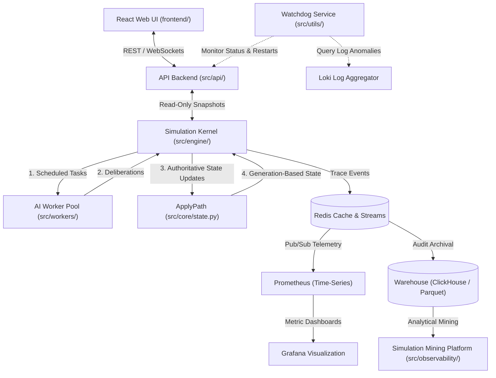

# RPG Simulation Ecosystem: Component Map & Architecture Directory

This document serves as the master structural directory for the entire RPG Simulation Ecosystem. It maps the relationships between the Core Source Code (`src/`), the Test Suites (`tests/`), the Interactive Web Client (`frontend/`), and the Distributed Infrastructure Stack.

---

## 🗺️ 1. Global Ecosystem Topology

The simulation ecosystem is designed around a strict separation of concerns: **Authoritative State Execution** resides in the backend kernel, **Asynchronous Telemetry & Analysis** runs out-of-loop via event streams, and **Visual Inspection** is handled by a reactive TypeScript client.



---

## 💻 2. Core Source Code Directory (`src/`)

The backend codebase enforces strict separation between **Thinking** (concurrent, read-only AI decision-making) and **Changing** (single-writer, authoritative state updates).

```
src/
├── core/             # Canonical state models and mutation interfaces
├── engine/           # Deterministic loop, world indexing, and persistence
├── systems/          # Domain-specific logic handlers (Strategic, Social, Economy)
├── observability/    # Telemetry, alerting, baseline comparison, and simulation mining
├── api/              # Presenters, schemas, and REST/WebSocket gateways
├── cli/              # Execution entry points for scenarios and sweeps
└── workers/          # Background daemons for async calculations
```

### Subsystem Directory:

#### 1. Core Domain Layer (`src/core/`)
*   **Role**: House the pure definitions of what the world contains.
*   **Key Modules**:
    *   `state.py`: Holds `EntityState` and its constituent Aspect components (`CombatComponent`, `InventoryComponent`, etc.).
    *   `updates.py`: Implements typed update records (e.g., `InteractionUpdate`, `StaminaUpdate`) representing proposed changes.
*   **Deep-Dive Reference**: See [docs/engine/architecture_reference.md](file:///home/vboxuser/Work/rpg-based-simulation/docs/engine/architecture_reference.md) for immutable conventions, and [docs/engine/authoritative_pipeline.md](file:///home/vboxuser/Work/rpg-based-simulation/docs/engine/authoritative_pipeline.md) for generation-based allocations.

#### 2. Deterministic Kernel Layer (`src/engine/`)
*   **Role**: The authoritative conductor running the simulation loop.
*   **Key Modules**:
    *   `kernel.py`: Orchestrates the strict 6-phase tick loop.
    *   `apply_pipeline.py`: Pure-functional pipeline applying proposed updates to transition to the next state generation.
    *   `world_index.py`: High-performance spatial indexing structure utilizing spatial hashing.
*   **Deep-Dive Reference**: See [docs/engine/kernel.md](file:///home/vboxuser/Work/rpg-based-simulation/docs/engine/kernel.md) for phase contracts, and [docs/engine/authoritative_apply_contract.md](file:///home/vboxuser/Work/rpg-based-simulation/docs/engine/authoritative_apply_contract.md) for transaction guarantees.

#### 3. Domain Systems Layer (`src/systems/`)
*   **Role**: Subsystem calculations that read immutable world snapshots and generate update proposals.
*   **Key Modules**:
    *   `strategic_systems/`: AI intention, goal generation, and projects.
    *   `world_systems/`: Quest state updates, navigation routing, and combat resolution.
    *   `economy_systems/`: Resource conservation, market operations, and tax calculations.
*   **Deep-Dive Reference**: See [docs/engine/architecture.md#6-domain-driven-system-organization-v21](file:///home/vboxuser/Work/rpg-based-simulation/docs/engine/architecture.md#L90) for coupling isolation laws.

#### 4. Simulation Mining & Observability (`src/observability/`)
*   **Role**: Telemetry routing, live inspection, baseline tracking, state-drift monitoring, and post-run parameter mining.
*   **Key Modules**:
    *   `mining/`: Orchestrates parallel experiment sweeps and analytical datasets (DuckDB/Parquet).
    *   `understanding/`: Generates AI-assisted diagnostic backlogs and root-cause hypotheses.
    *   `alerts/`: Routes in-tick hard law violations directly to logging sinks.
*   **Deep-Dive Reference**: See [docs/archive/observability/simulation_mining.md](file:///home/vboxuser/Work/rpg-based-simulation/docs/archive/observability/simulation_mining.md) for mining schemas (historical), [docs/archive/observability/simulation_mining_usage.md](file:///home/vboxuser/Work/rpg-based-simulation/docs/archive/observability/simulation_mining_usage.md) for execution templates (historical), and [docs/engine/contracts/sweep_configuration.md](file:///home/vboxuser/Work/rpg-based-simulation/docs/engine/contracts/sweep_configuration.md) for sweep schemas and JSON examples.

---

## 🧪 3. Ecosystem Test Suite (`tests/`)

We enforce stability through a multi-tiered test directory structure. Standard unit tests are executed rapidly to guarantee zero regressions, while heavy benchmarks are separated to run under production hardware configurations.

```
tests/
├── unit/             # Fast, deterministic component and system-level tests
├── integration/      # Multi-module flow checks (API, WebSocket streaming, DB adapters)
├── parity/           # Parity assertions comparing current engine against legacy behaviors
├── docs/             # Documentation integrity checks
├── performance/      # TPS profiles, memory regression checks, and GC monitors
└── benchmarks/       # Micro-benchmarks for database insertions and spatial queries
```

### Test Subsystem Directory:

#### 1. Unit Tests (`tests/unit/`)
*   **Objective**: Assert core logic operates deterministically under fixed scenarios.
*   **Structure**:
    *   `tests/unit/core/`: Validates state copying, aspect purity, and serialization.
    *   `tests/unit/combat/`: Tests targeting combat matrices, reward systems, and stalemates.
    *   `tests/unit/observability/`: Fast unit tests for local file exporters and mining brokers.
*   **Fast Run**: `pytest tests/unit/ -m "not slow"`

#### 2. Parity & Differential Tests (`tests/parity/`)
*   **Objective**: Ensure the current architecture does not diverge from legacy execution laws unless explicitly intended.
*   **Rules**:
    *   Requires tagging with specific markers (`v2_contract`, `differential`, `intentional_divergence`).
    *   **Fast Run**: `pytest tests/parity/`

#### 3. Documentation Integrity Suite (`tests/docs/`)
*   **Objective**: Guard the parity of code and documentation, automatically asserting all referenced file links, class names, markdown headers, and anchors remain active.
*   **Fast Run**: `pytest tests/docs/test_doc_integrity.py`

#### 4. Performance & Benchmarking (`tests/performance/` & `tests/benchmarks/`)
*   **Objective**: Enforce hardware class execution budgets (e.g., verifying Consumer Class B remains above 20 TPS).
*   **Fast Run**: `pytest tests/performance/ --benchmark-only`

---

## 📺 4. Interactive Frontend Web Client (`frontend/`)

Built using **React + Vite + TypeScript**, the frontend served by Nginx is a zero-state visual representation of the FastAPI read-model schemas.

### Component Map (`frontend/src/components/`):
*   **Visual Board (`GameCanvas.tsx`)**: Renders spatial coordinates, active entity nodes, resource positions, and movement paths using lightweight HTML5 Canvas.
*   **State Inspector (`InspectPanel.tsx`)**: Essential developer panel displaying live aspects, stamina pools, task assignments, and inventories of clicked entities.
*   **Settlement Dashboards (`BuildingPanel.tsx` & `ClassHallPanel.tsx`)**: Directives monitor displaying regional project completions and tax distributions.
*   **API Client Playground (`ApiDocsPage.tsx`)**: Renders interactive controls enabling developers to pause, resume, or trigger step-by-step ticks directly from the browser window.

---

## ⚙️ 5. Distributed Infrastructure Stack

The complete production-grade system is deployed via Docker Compose to manage logging, telemetry, queues, and self-healing watchdogs.

### Service Index (`docker-compose.yml`):
*   **`backend`**: FastAPI REST & WebSockets server serving state read-models.
*   **`frontend`**: The TypeScript React client served via Nginx.
*   **`redis`**: Handles live in-memory caching and real-time state broadcasts, and is the sole event-stream transport (`RedisStreamConsumer`).
*   **`ai_worker`**: Scaling pool executing computationally intense AI predictions.
*   **`prometheus`**: Time-series database scraping runtime TPS and performance counters.
*   **`grafana`**: Provisioned dashboards showing live simulation metrics.
*   **`loki` & `promtail`**: Multi-container centralized log aggregator.
*   **`watchdog`**: Self-healing daemon auditing endpoint availability and deadlocks.

---

## 🚀 6. Developer Quickstart Cheatsheet

### Boot up the entire local infrastructure stack:
```bash
docker compose up --build -d
```

### Scale up the AI reasoning pool:
```bash
docker compose up -d --scale ai_worker=3
```

### Run the standard, fast unit test suite:
```bash
pytest tests/unit/ -m "not slow"
```

### Run a headless local simulation run:
```bash
python3 -m src.cli.entry cli --ticks 200 --seed 42
```

### Run a scenario parameter sweep matrix:
```bash
python3 -m src.cli.entry sweep path/to/sweep_config.json
```
