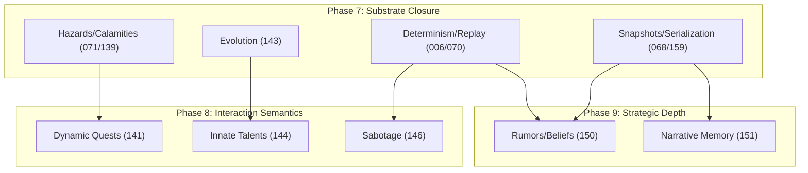

# Phase 7 Substrate Backlog

This document defines the official implementation backlog and closure conditions for Phase 7 (Substrate Closure).

## Substrate Closure Rows (Recovery Gaps)

These rows represent the primary recovery targets for the Phase 7 deterministic substrate.

| ID | Item | Closure Condition | Proof Path |
| :--- | :--- | :--- | :--- |
| **LEG-RPG-071** | Regional hazards | Authoritative `HazardSystem` implementation. Bit-identical trigger parity with legacy `regions.py`. | DIFFERENTIAL PARITY |
| **LEG-RPG-139** | Calamity consequences | Authoritative `CalamitySystem` extension. Verified deterministic scaling of regional pressure. | V2 CONTRACT |
| **LEG-RPG-143** | Entity Evolution | Authoritative `ArchetypeSystem`. Deterministic mutation in `PersistencePhase`. | V2 CONTRACT |

## Substrate Hardening Rows (Authoritative Closure)

Phase 7 takes final ownership of the following rows to ensure bit-identical determinism and invariant safety.

| ID | Item | Closure Condition | Proof Path |
| :--- | :--- | :--- | :--- |
| **LEG-RPG-001** | Action intent conv. | Verification of bit-identical update shape across all 15 domains. | CERTIFICATION |
| **LEG-RPG-004** | World mutation sep. | 100% pass on `test_mutation_tripwire` under high-pressure concurrency. | CERTIFICATION |
| **LEG-RPG-006** | Conflict resolution | Proof of bit-identical resolution for 1000-tick randomized action sets. | CERTIFICATION |
| **LEG-RPG-066** | World gen det. | Bit-identical grid-state equality for 10 distinct seeds. | CERTIFICATION |
| **LEG-RPG-068** | Snapshot immut. | Verified recursive freeze on all `MindAspect` and `WorldAspect` records. | CERTIFICATION |
| **LEG-RPG-070** | Det. replay | Bit-identical state reconstruction from `.jsonl` stream for 5000 ticks. | CERTIFICATION |
| **LEG-RPG-073** | Engine phase order | Verified invariant enforcement at every phase boundary (0 to 5). | CERTIFICATION |
| **LEG-RPG-159** | Serialization Hard. | 100% round-trip parity for all `Entity` components including strategic state. | CERTIFICATION |

## Substrate Truth Standards

All verification must adhere to the [Substrate Truth Standard](../engine/substrate_truth_standard.md).

## Downstream Dependencies

Phase 7 (Substrate Closure) is the strict prerequisite for all semantic recovery in Phases 8 and 9.

### Dependency Mapping

| Future Feature | Blocked By (Phase 7) | Dependency Type |
| :--- | :--- | :--- |
| **Dynamic Quests (Ph 8)** | **Hazards (071) & Calamities (139)** | Structural (World-state drive) |
| **Building Sabotage (Ph 8)** | **Action Conv (001) & Conflict (006)** | Structural (Interaction integrity) |
| **Innate Talents (Ph 8)** | **Entity Evolution (143)** | Functional (System inheritance) |
| **Rumors/Beliefs (Ph 9)** | **Serialization (159) & Snapshots (068)**| Persistence (Data integrity) |
| **Narrative Memory (Ph 9)** | **Snapshots (068) & Replay (070)** | Persistence (Causal integrity) |

### Dependency Map

### Critical Path Assessment

Phase 7 **Substrate Hardening** is the universal prerequisite for all V2 authoritative features. Without a deterministic and invariant-safe substrate, future high-level features cannot achieve the required "Authoritative" certification.

## Closure Condition

This backlog is considered "CLOSED" when all rows are marked as **SUPPORTED** in the ledger and backed by the specified proofs in the `data/runs/` manifest.
