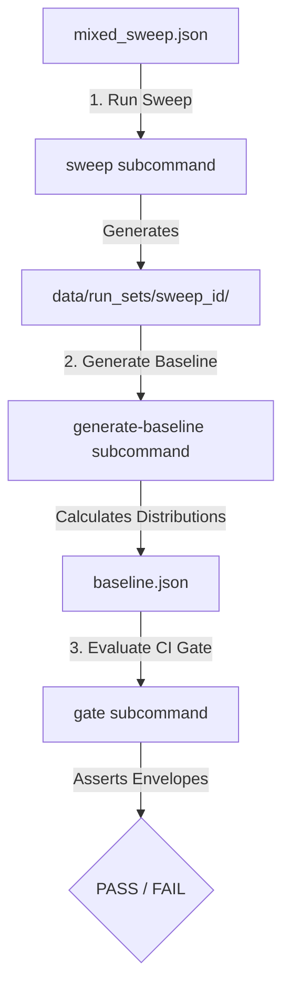

# RPG Simulation: Scenario Sweep Configuration & Execution Guide

Scenario sweeps are programmatic, multi-seed simulation matrices run sequentially or in parallel. They establish statistical performance baselines, audit determinism stability, and validate gameplay balance envelopes across identical conditions under controlled seed distributions.

---

## 📄 1. The `sweep_config.json` Specification

The sweeper parses a JSON file matching the Pydantic `ScenarioSweepConfig` schema defined in `src/observability/sweeper.py`.

### Schema Fields & Bounds:

| Field | Type | Required | Default | Description / Validation Rules |
| :--- | :--- | :--- | :--- | :--- |
| **`sweep_id`** | `string` | No | *Auto* | Unique ID for the sweep. If omitted, a timestamped ID is generated. |
| **`scenario_name`** | `string` | **Yes** | — | Symbolic name for the scenario being executed (e.g., `mixed`). |
| **`scenario_type`** | `string` | **Yes** | — | Underlying scenario logic profile loaded by the generator (e.g., `mixed`). |
| **`seeds`** | `array[integer]` | **Yes** | — | Non-empty list of seeds to run. Each seed represents one matrix cell. |
| **`ticks`** | `integer` | **Yes** | — | Positive integer defining the maximum execution ticks per run. |
| **`observability_mode`**| `string` | **Yes** | — | Mode to apply. Options: `OFF`, `LIGHT`, `DEBUG`, `CERTIFICATION`, `LONG_RUN`. |
| **`profile_name`** | `string` | No | `"cli_default"` | Target execution profile containing thread caps and memory bounds. |
| **`max_parallel_runs`** | `integer` | No | `1` | Maximum parallel threads (must be `>= 1`). |
| **`stop_on_first_critical`**| `boolean` | No | `false` | If true, halts the sweep immediately if any run crashes or fails. |
| **`output_dir`** | `string` | No | `"data/run_sets"` | Root directory where multi-run run sets will be archived. |

---

## 📝 2. Complete, Copy-Pasteable Config Example

Save this configuration as `mixed_sweep.json` in your workspace:

```json
{
  "sweep_id": "mixed_sweep_2026",
  "scenario_name": "mixed",
  "scenario_type": "mixed",
  "seeds": [42, 101, 2023, 8888],
  "ticks": 200,
  "observability_mode": "CERTIFICATION",
  "profile_name": "cli_default",
  "max_parallel_runs": 2,
  "stop_on_first_critical": false,
  "output_dir": "data/run_sets"
}
```

---

## 🛠️ 3. Execution & Management Workflow

The system provides a suite of CLI tools to run sweeps, view completed matrices, calculate statistical metrics, and run CI quality checks.



### Command Cheatsheet:

#### A. Execute a Scenario Sweep
Orchestrates the multi-run simulation matrix:
```bash
python3 -m src.cli.entry sweep mixed_sweep.json
```

#### B. List Executed Sweeps
Lists all past sweeps archived under the `output_dir`:
```bash
python3 -m src.cli.entry list-sweeps
```

#### C. Inspect Detailed Sweep Outcomes
Provides an ASCII summary including the worst-performing runs, best-performing runs, and recurring anomaly signatures:
```bash
python3 -m src.cli.entry inspect-sweep mixed_sandbox_sweep_2026
```

#### D. Generate Statistical Baseline
Computes average distributions, standard deviations, and recommended warning thresholds across successful runs (excluding crashed or law-violating runs):
```bash
python3 -m src.cli.entry generate-baseline mixed_sandbox_sweep_2026
```

#### E. CI Quality Gate Gating
Compares the outcomes of a sweep against a statistical baseline, returning an exit code of `0` on success, or `1` on failure (which halts CI pipelines if anomalies drift or crashes occur):
```bash
python3 -m src.cli.entry gate mixed_sandbox_sweep_2026 --baseline data/run_sets/mixed_sandbox_sweep_2026/baseline.json
```
