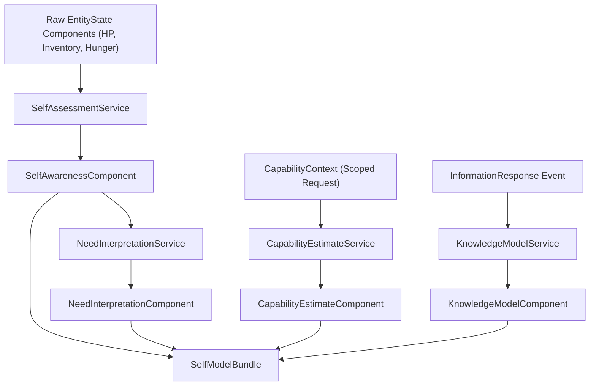

# Source Inventory — Implemented Entity Actions and Action-Related Aspects

## Inventory verdict

The engine already has **many action mechanics**, but they are **not cleanly unified**.

There are three different action surfaces:

| Surface                    | Meaning                                                             | Status                                                                      |
| -------------------------- | ------------------------------------------------------------------- | --------------------------------------------------------------------------- |
| **Runtime routed actions** | Payload actions handled by `ActionRouter`                           | Real runtime path                                                           |
| **Domain/system actions**  | Movement, interaction, blacksmith/shop/guild systems                | Real mechanics, but not always routed as direct actions                     |
| **Wrapper/test actions**   | `BlacksmithAction`, `ShopAction`, `GuildAction`, `HomeAction`, etc. | Useful, but do not assume they are all part of the main runtime action loop |
| **Phase 3 Subjective Routing**| Route candidate evaluation, imperfect personality-biased scoring, strategic mapping, and resolution to first intent | Fully implemented in `src/domains/adventure/` with 33 TDD/perf tests passing |
| **Phase 4 Combat Cognition**| Subjective target estimate, self capability estimate, risk evaluations, combat postures selection (`PROBE`, `AVOID`, `RETREAT`, `ENGAGE`, etc.), mid-combat reassessment, and capacity-limited combat memory updates | Fully implemented in `src/domains/combat_engagement/` with 36 TDD/perf tests passing |
| **Phase 5 Belief loop**| Subjective queries, candidate routers, response normalizers, personal knowledge/unknowns assimilation under memory limits, belief observations verification & contradiction disproofs, slow gradual clamping source-trust adjustments, and adventure route-scorer impact bridging | Fully implemented in `src/domains/information/` with 25 TDD/perf tests passing |


The uncomfortable truth: **the engine has action capability, but not yet a clean adventure action model**. You have mechanics for fighting, moving, crafting, buying, selling, resting, looting, training, recruiting, and interacting. But there is no single canonical “adventurer action vocabulary” yet.

---

# 1. Implemented entity model

`EntityState` is already rich. An entity is not just position + HP. It includes identity, inventory, strategy, social state, biological state, lifecycle, aptitude, combat, equipment, navigation, task, stamina, and interaction components.

## Main implemented entity aspects

| Aspect      | Implemented fields / behavior                                                               |
| ----------- | ------------------------------------------------------------------------------------------- |
| Identity    | role, faction, class, level/evolution, recipes, traits, cooldowns, personality              |
| Attributes  | strength, agility, vitality, endurance, intelligence, spirit, wisdom, perception, charisma  |
| Aptitude    | learning rate, stamina efficiency, stat aptitudes                                           |
| Combat      | HP, max HP, attack, defense, speed, range, evasion, readiness, wounds, scars, tactical role |
| Equipment   | slots and durability                                                                        |
| Inventory   | items, gold, capacity/weight logic through inventory services                               |
| Navigation  | position, target, path, movement mode, failure reason, leash/home/region                    |
| Stamina     | current/max stamina, regen, attack/move/harvest/skill costs                                 |
| Biological  | sleep debt, hunger, rest pressure, meal/sleep timestamps                                    |
| Lifecycle   | active/dead state, death reason, age, generation/heir fields                                |
| Interaction | target node, progress, start tick                                                           |
| Strategic   | projects, objectives, blockers, leads, concerns, directives, hypotheses, contracts          |
| Social      | trust/bonds/contracts/reputation-like state                                                 |
| Task        | current work kind and payload                                                               |

The canonical export also exposes strategic projects, directives, blockers, leads, concerns, social trust, combat state, biological state, lifecycle, and navigation state. That means the data exists for scenario diagnostics.

---

# 2. Implemented runtime action router

The main direct runtime action surface is `ActionRouter.route_action`.

It routes these payload action strings:

```text
SLEEP
EAT
REST
RECRUIT
ALLOCATE_AP
TRAIN
REPAIR
INTERACT
ATTACK
SKILL
AOE_ATTACK
```

`ActionRouter` first checks entity readiness through legality validation, then delegates to the correct action handler.

## Critical mismatch

The `ActionType` enum only defines:

```text
REST
MOVE
INTERACT
ATTACK
SKILL
```

But `ActionRouter` handles many more raw string actions like `SLEEP`, `EAT`, `RECRUIT`, `ALLOCATE_AP`, `TRAIN`, `REPAIR`, and `AOE_ATTACK`.

That is schema drift. You need one canonical action vocabulary.

---

# 3. Implemented action catalog

## 3.1 Survival / body actions

Implemented through `CoreActions.execute_survival`.

| Action  | Current behavior                                         |
| ------- | -------------------------------------------------------- |
| `SLEEP` | reduces sleep debt and rest pressure; consumes readiness |
| `EAT`   | reduces hunger; records last meal tick                   |
| `REST`  | reduces rest pressure                                    |

These are routed directly by `ActionRouter`.

### Current limitation

These are body-maintenance actions, not full adventure recovery yet. There is no strong adventure loop like:

```text
wounded -> retreat -> heal -> reassess readiness -> retry easier/harder objective
```

The pieces exist, but the closed loop is not mature.

---

## 3.2 Progression actions

## `ALLOCATE_AP`

Implemented in `CoreActions.execute_allocate_ap`.

Current routed version supports:

| Attribute | Effect                             |
| --------- | ---------------------------------- |
| strength  | increases strength and attack      |
| vitality  | increases vitality, max HP, and HP |

But there is also a separate `AllocateAttributeAction` wrapper that supports a broader attribute set through aptitude mapping.

### Problem

There are two allocation implementations with different capability breadth.

That is not harmless duplication. It can create false test confidence.

---

## `TRAIN`

Implemented in `CoreActions.execute_train`.

It requires `skill_id`, charges 50 gold through a `ResourceTransferIntent`, and removes capability blockers for that skill.

### Verified Bug

This is a **verified bug** in the codebase. 

- **Source:** Both `CoreActions.execute_train` ([core_actions.py:L199](file:///home/vboxuser/Work/rpg-based-simulation/src/engine/domain/core_actions.py#L199)) and `ClassHallAction.train` ([class_hall.py:L33](file:///home/vboxuser/Work/rpg-based-simulation/src/town/class_hall.py#L33)) set:
  ```python
  identity_upd=IdentityUpdate(recipes_learned=[skill_id])
  ```
- **Result:** In `IdentityPatch.apply` ([patches.py:L194](file:///home/vboxuser/Work/rpg-based-simulation/src/engine/patches.py#L194)), this maps strictly to `known_recipes` (crafting).
- **The Failure:** `SkillActions.execute_skill` ([skill_actions.py:L40](file:///home/vboxuser/Work/rpg-based-simulation/src/engine/domain/skill_actions.py#L40)) checks against `entity.identity.learned_skills` and fails with `SKILL_NOT_LEARNED`.
- **Verdict:** Training fails to unlock skill usage because the skill is stored in `known_recipes` instead of `learned_skills`.

---

## `REPAIR`

Implemented in `CoreActions.execute_repair`.

It checks equipment durability, computes gold cost, and emits a repair transfer from `BLACKSMITH` with an `EquipmentUpdate`.

This is useful for adventure loops, especially after combat or dungeon runs.

---

# 4. Combat actions

## 4.1 Normal attack

`CombatActions.execute_attack` is implemented and routed directly by `ATTACK`.

It does:

| Step                                                             | Behavior |
| ---------------------------------------------------------------- | -------- |
| validates target exists                                          |          |
| checks attack legality                                           |          |
| resolves attack via `CombatResolutionSystem`                     |          |
| applies attacker readiness/equipment/resource transfer           |          |
| evaluates hunt quest victory                                     |          |
| applies defender combat/wound/social/strategic/lifecycle updates |          |
| handles group betrayal case                                      |          |
| drains stamina                                                   |          |

Combat resolution includes positional and state modifiers such as high ground, flanking, surrounded, cover, frozen/exhaustion/stamina, bond synergy, and then applies damage, kill reward, XP/gold transfer, durability damage, wounds, social grudges, and strategic/social consequences.

## 4.2 Skill action

`SkillActions.execute_skill` is implemented and routed directly by `SKILL`.

It checks:

| Check                              | Behavior |
| ---------------------------------- | -------- |
| `skill_id` exists                  |          |
| skill is in `learned_skills`       |          |
| cooldown                           |          |
| stamina                            |          |
| target exists and is alive         |          |
| then resolves skill damage/effects |          |

## 4.3 AOE attack

`AoeActions.execute_aoe_attack` is implemented and routed by `AOE_ATTACK`.

It uses target position and radius, resolves affected entities, applies updates, checks kill quest progress, and drains stamina.

---

# 5. Movement and tactical actions

## 5.1 Direct movement

`SimulationDomainLogic.execute_move` delegates movement to `MovementActions.execute_move`.

`MovementActions.execute_move` calls `MovementSystem.resolve_move` and evaluates exploration quests after movement.

## 5.2 Movement resolution

`MovementSystem.resolve_move` is detailed.

It handles:

| Aspect                                    | Behavior |
| ----------------------------------------- | -------- |
| dead entity check                         |          |
| pathing/cache                             |          |
| weather/aura/movement mode cost modifiers |          |
| legality and occupancy                    |          |
| sidestep / yielding                       |          |
| reroute / replan                          |          |
| opportunity attack on disengagement       |          |
| terrain cost                              |          |
| readiness and stamina drain               |          |
| navigation update                         |          |

## 5.3 Tactical decision layer

`TacticalDecisionSystem` is large and already tries to choose local behavior based on emotion, hostile awareness, leash, project objective, group behavior, target selection, anti-stalemate, cover, retreat, bracketing, guarding, intercepting, chokepoints, kiting, skills, attacks, and pursuit.

This is one of the stronger implemented areas.

### Current limitation

Tactical behavior is more mature than strategic adventure behavior. The entity can fight/move tactically, but it still lacks complete high-level adventure routes like:

```text
choose quest
prepare supplies
ask information
upgrade gear
form party
enter dungeon
return and convert rewards
```

---

# 6. Interaction, harvesting, looting

## 6.1 Generic interaction

`INTERACT` is routed by `ActionRouter` into `CoreActions.execute_interact`.

It sets the target and advances interaction progress.

## 6.2 Harvest start action

`HarvestAction.start_harvest` exists.

It validates:

| Check                         |
| ----------------------------- |
| node exists                   |
| node has remaining charges    |
| cooldown <= 0                 |
| entity is within 1.5 distance |

Then it starts an interaction channel with target node and harvest metadata.

## 6.3 Loot start action

`LootAction.start_loot` exists.

It validates:

| Check                                  |
| -------------------------------------- |
| target exists as ground item or corpse |
| entity is within 1.5 distance          |

Then it starts an interaction channel.

## 6.4 Interaction completion

`InteractionSystem.enforce` handles channeling laws and completion.

It resets interaction on movement, target switch, or damage; advances progress; detects resource node, ground item, corpse, or chest; and on completion emits `ResourceTransferIntent` from `NODE`, `GROUND_ITEM`, `CORPSE`, or `CHEST`.

### Important distinction

Harvest and loot are not direct `ActionRouter` strings. They are interaction-start wrappers plus the interaction enforcement system.

For adventure design, you should treat them as implemented mechanics, but not yet cleanly part of the canonical routed action vocabulary.

---

# 7. Town, service, and economy actions

## 7.1 Blacksmith crafting

There are two relevant blacksmith surfaces.

### `BlacksmithService.craft_item`

It validates:

| Check                        |
| ---------------------------- |
| functional blacksmith nearby |
| distance <= 2                |
| recipe exists                |
| materials exist              |
| gold is enough               |

Then it emits a craft `ResourceTransferIntent` that removes materials, adds crafted item, and charges gold.

### `BlacksmithSystem.enforce`

This is deeper and more engine-like. It includes recipe definitions, recipe learning when visiting a blacksmith, craft target handling, known recipe check, material/gold blockers, and successful crafting transfer.

This matters because adventure crafting already has a mechanical foundation.

### Missing adventure behavior

There is still no clean high-level action like:

```text
ASK_BLACKSMITH_FOR_UPGRADE
REQUEST_RECIPE_FOR_CLASS
CRAFT_BEST_AFFORDABLE_ITEM
```

The mechanics exist, but the adventure-facing intent layer is missing.

---

## 7.2 Shop buy/sell

`ShopService.buy_item` and `ShopService.sell_item` exist.

Buy validates functional shop proximity, item registry, dynamic price, enough gold, and inventory capacity, then emits `SHOP_BUY`.

Sell validates item ownership and shop proximity, then emits `SHOP_SELL`.

There is also `ShopSystem.enforce`, which validates shop prices against truth, rejects stale/exploit price attempts, auto-sells materials/junk when entity is on shop tile, and includes trauma-based price effects.

### Missing adventure behavior

There is no clear high-level routed action like:

```text
BUY_FOOD
BUY_POTION
BUY_UPGRADE
SELL_LOOT
COMPARE_EQUIPMENT_BEFORE_BUY
```

The transaction mechanics exist, but the adventurer decision layer is still underbuilt.

---

## 7.3 Guild visit / intel

`GuildAction.visit` exists.

It scans resource nodes and adds vague `LeadState` entries, especially around iron nodes, and can generate quest projects if strategic capacity allows.

This is important for adventure information flow.

### Current limitation

It is still simple. It creates raw leads from world state. It is not yet a rich information economy with guide/guild/traveler differences, source trust, price-for-information, false rumors, and contradiction loops.

---

## 7.4 Home actions

`HomeAction.rest` and `HomeAction.upgrade` exist.

Rest reduces sleep debt. Upgrade charges gold and resolves maintenance blockers.

## 7.5 Home storage

`HomeStorageService.deposit` and `withdraw` exist near town center.

They validate proximity and item availability, then emit deposit/withdraw transfer intents.

## 7.6 Inn rest

`InnAction.rest` exists.

It costs 10 gold, clears sleep debt, reduces hunger, and grants `well_rested_until`.

## 7.7 Town navigation

`TownNavigation` can find the nearest service and check town radius.

---

# 8. Social, group, and recruitment actions

## 8.1 Recruit

`RECRUIT` is routed by `ActionRouter`.

`CoreActions.execute_recruit` does:

| Step                                                                                       | Behavior |
| ------------------------------------------------------------------------------------------ | -------- |
| finds target                                                                               |          |
| creates temporary recruitment contract                                                     |          |
| calls `SocialAppraisalSystem.appraise_contract`                                            |          |
| if accepted, creates `ContractState`, group ID, payout transfer, strategic contract update |          |
| if rejected, records rejection / social update                                             |          |

This is a real social-action bridge.

### Current limitation

Recruitment exists, but broader party-adventure behavior is not yet complete:

```text
form party because objective too hard
evaluate class compatibility
split loot
coordinate dungeon route
maintain cohesion
handle betrayal/abandonment
```

The engine has some group records and tactical group behavior, but not the full adventure-party loop.

---

# 9. Building / sabotage action

`SabotageAction.apply` exists.

It validates building existence, functioning state, and distance, then applies damage based on entity attack.

This is implemented, but for the current narrowed adventure scope, sabotage is probably not a priority unless you want monster camps, enemy structures, or faction conflict.

---

# 10. Quest-related actions and effects

Quest systems exist around:

| System                          | Behavior |
| ------------------------------- | -------- |
| exploration quest evaluation    |          |
| combat victory quest evaluation |          |
| quest resolution enforcement    |          |
| quest generation                |          |

Movement evaluates exploration quest progress after movement.

Combat evaluates hunt quest victory after kills.

Quest resolution/generation systems exist, but the action vocabulary still lacks a clean adventure route like:

```text
BROWSE_QUESTS
ACCEPT_QUEST
REJECT_QUEST
ABANDON_QUEST
TURN_IN_QUEST
```

That matters. For an adventure-first engine, quest actions should be first-class.

---

# 11. Strategic / cognitive action selection

## 11.1 Goal registry

The implemented goal framework has:

| Class          | Purpose                         |
| -------------- | ------------------------------- |
| `GoalScore`    | scored candidate goal           |
| `GoalScorer`   | interface                       |
| `GoalRegistry` | registers and evaluates scorers |

Current registered/basic scorers include:

| Scorer          | Purpose                                            |
| --------------- | -------------------------------------------------- |
| `HarvestScorer` | harvest utility                                    |
| `SleepScorer`   | fatigue/sleep utility                              |
| `EatScorer`     | hunger utility                                     |
| `SocialScorer`  | placeholder social utility                         |
| `TownScorer`    | return town based on needs, full inventory, low HP |

## Verified Bug: TownScorer fails to create project

This is a **verified bug** in the codebase.

- **Source:** `TownScorer.score` ([scorers.py:L97](file:///home/vboxuser/Work/rpg-based-simulation/src/ai/goals/scorers.py#L97)) returns a `GoalScore` with `target_pos=state.town_center`, but **`target_id` is None**.
- **Result:** In `StrategicIntelligenceSystem.evaluate_strategic_intent` ([intelligence.py:L1171](file:///home/vboxuser/Work/rpg-based-simulation/src/systems/strategic_systems/intelligence.py#L1171)), any goal score with `target_id is None` is skipped:
  ```python
  if g_score.utility < 20.0 or g_score.target_id is None:
      continue
  ```
- **Verdict:** Because `target_id` is never set, the town-return goal score is discarded on every strategic update, meaning `town_return` projects are never created. This fundamentally breaks the leave-town/return-town adventure loop.

---

# 12. Strategic projects, blockers, leads, concerns

The entity strategic state already supports:

| Strategic item   | Purpose |
| ---------------- | ------- |
| projects         |         |
| blockers         |         |
| leads            |         |
| directives       |         |
| concerns         |         |
| candidate zones  |         |
| hypotheses       |         |
| source trust     |         |
| contracts        |         |
| turning points   |         |
| boredom/overload |         |

`StrategicUpdate` supports adding/removing/updating all of these.

`StrategicIntelligenceSystem.evaluate_strategic_intent` evaluates goal scores, applies modifiers, filters low scores, requires a target, builds an objective/project, and evaluates project switching.

### Good

The strategic substrate is real.

### Bad

The current goal/action set is not adventure-complete. It does not yet express enough of:

```text
choose quest
prepare for quest
upgrade equipment
seek information
research unknown location
form party
buy supplies
repair gear because of upcoming risk
return to town as adventure closure
escalate to harder content
```

---

# 13. Resource transfer and update model

The engine uses `ResourceTransferIntent` as the key lawful transaction mechanism.

It can carry:

| Transfer aspect                                                                    |
| ---------------------------------------------------------------------------------- |
| source ID/kind                                                                     |
| items added/removed                                                                |
| gold delta / gold cost                                                             |
| price multiplier                                                                   |
| XP reward                                                                          |
| transfer kind                                                                      |
| group requirement                                                                  |
| contingent biological/attribute/identity/combat/strategic/equipment/reward updates |

`EntityUpdate` can mutate almost every entity aspect: position, readiness, resource transfers, identity, attributes, inventory, strategic, biological, social, quest, reward, lifecycle, combat, equipment, navigation, task, and stamina.

This is good. The law-enforcement substrate is strong enough for adventure simulation.

---

# 14. Implemented action aspects by category

## A. Body / survival

| Implemented                | Missing / weak for adventure                                        |
| -------------------------- | ------------------------------------------------------------------- |
| sleep, eat, rest           | heal action, potion use, condition recovery, camp/rest outside town |
| hunger/sleep/rest pressure | full survival-to-adventure readiness loop                           |
| inn rest                   | smarter choice of inn/home/rest/camp                                |

## B. Movement / navigation

| Implemented                         | Missing / weak                                                                            |
| ----------------------------------- | ----------------------------------------------------------------------------------------- |
| move resolution                     |                                                                                           |
| pathing/reroute                     |                                                                                           |
| sidestep/yield                      |                                                                                           |
| opportunity attack                  |                                                                                           |
| terrain/readiness/stamina cost      |                                                                                           |
| movement modes                      |                                                                                           |
| tactical retreat/pursuit/reposition | high-level expedition route planning, return-home loop reliability, party travel cohesion |

## C. Combat

| Implemented           | Missing / weak                                                                                             |
| --------------------- | ---------------------------------------------------------------------------------------------------------- |
| attack                |                                                                                                            |
| skill                 |                                                                                                            |
| AOE                   |                                                                                                            |
| damage modifiers      |                                                                                                            |
| wounds/scars          |                                                                                                            |
| kill rewards          |                                                                                                            |
| durability decay      |                                                                                                            |
| grudge/bond updates   |                                                                                                            |
| quest kill evaluation | adventure-level encounter selection, threat avoidance from memory, class-specific combat strategy maturity |

## D. Interaction / resource acquisition

| Implemented                       | Missing / weak                                                                               |
| --------------------------------- | -------------------------------------------------------------------------------------------- |
| interact                          |                                                                                              |
| harvest start                     |                                                                                              |
| loot start                        |                                                                                              |
| channeling completion             |                                                                                              |
| node/ground/corpse/chest transfer | clean direct action names for harvest/loot/open chest/gather; deeper tool/skill requirements |

## E. Economy

| Implemented              | Missing / weak                                                                             |
| ------------------------ | ------------------------------------------------------------------------------------------ |
| shop buy                 |                                                                                            |
| shop sell                |                                                                                            |
| dynamic price            |                                                                                            |
| stale price rejection    |                                                                                            |
| trauma price factor      |                                                                                            |
| storage deposit/withdraw | intentional adventurer buying: food, potion, gear, upgrade comparison, sell loot after run |

## F. Crafting / blacksmith

| Implemented                         | Missing / weak                                                                                                                                       |
| ----------------------------------- | ---------------------------------------------------------------------------------------------------------------------------------------------------- |
| recipe registry                     |                                                                                                                                                      |
| known recipe check                  |                                                                                                                                                      |
| material/gold check                 |                                                                                                                                                      |
| crafting transfer                   |                                                                                                                                                      |
| recipe learning on blacksmith visit |                                                                                                                                                      |
| repair                              | ask blacksmith for recommended upgrade, class-fit item selection, material source inquiry, prerequisite planning from recipe to adventure objectives |

## G. Progression

| Implemented                          | Missing / weak                                                                               |
| ------------------------------------ | -------------------------------------------------------------------------------------------- |
| AP allocation                        |                                                                                              |
| training                             |                                                                                              |
| level progression service            |                                                                                              |
| skill registry                       |                                                                                              |
| equipment ranking/auto-equip service | training likely writes wrong field; no full “I need stronger skill/gear for next quest” loop |

## H. Social / party

| Implemented                     | Missing / weak                                                                                                    |
| ------------------------------- | ----------------------------------------------------------------------------------------------------------------- |
| recruit                         |                                                                                                                   |
| contract appraisal              |                                                                                                                   |
| contract creation               |                                                                                                                   |
| group record                    |                                                                                                                   |
| betrayal/grudge hooks in combat | full party adventure loop, class compatibility, reward split, escort behavior, trust-based future party selection |

## I. Information / guild / knowledge

| Implemented                    | Missing / weak                                                                                                       |
| ------------------------------ | -------------------------------------------------------------------------------------------------------------------- |
| guild visit creates leads      |                                                                                                                      |
| belief system exists           |                                                                                                                      |
| source trust exists            |                                                                                                                      |
| strategic leads/blockers exist | ask guide/traveler/merchant, paid info, partial/wrong info, contradiction-driven route change, knowledge-gap project |

## J. Quest

| Implemented                         | Missing / weak                                                                              |
| ----------------------------------- | ------------------------------------------------------------------------------------------- |
| explore quest evaluation            |                                                                                             |
| hunt victory evaluation             |                                                                                             |
| quest generation/resolution systems | first-class browse/accept/reject/abandon/turn-in quest actions; risk/reward quest selection |

## K. World/building

| Implemented                                      | Missing / weak                                                                                             |
| ------------------------------------------------ | ---------------------------------------------------------------------------------------------------------- |
| sabotage building                                |                                                                                                            |
| camps/boss/calamity/world pressure systems exist |                                                                                                            |
| regional trauma affects some systems             | direct adventurer response to world threat, region threat escalation loop, quest pressure from world state |

---

# 15. What is implemented but not properly unified

## 15.1 Action vocabulary is fragmented

You currently have:

```text
ActionType enum
ActionRouter strings
ActionProposal verb
TaskComponent.work_kind
Town wrapper actions
System enforce actions
Strategic project/objective kinds
```

These are not yet one coherent action model.

That is the biggest structural problem.

## 15.2 Runtime router is narrower than available mechanics

`ActionRouter` does not directly route many important adventure actions:

```text
BUY
SELL
CRAFT
HARVEST
LOOT
OPEN_CHEST
VISIT_GUILD
REST_IN_INN
DEPOSIT
WITHDRAW
SABOTAGE
ACCEPT_QUEST
TURN_IN_QUEST
ASK_INFO
FORM_PARTY_BY_OBJECTIVE
```

Some of these exist through wrappers/systems, but not as a unified direct action surface.

## 15.3 Goal system is much narrower than action mechanics

The entity can mechanically do more than it can strategically decide to do.

Current goal scorers mostly cover:

```text
harvest
sleep
eat
social
town_return
```

That is not enough for adventure RPG behavior.

## 15.4 Training does not unlock skill usage (VERIFIED BUG)

Training writes `recipes_learned` (which updates crafting recipes), while skill execution checks `learned_skills`. They do not intersect. This is a verified bug and must be fixed.

## 15.5 Return-to-town is strategically broken (VERIFIED BUG)

`TownScorer` returns only `target_pos` and omits `target_id`. Because strategic project creation filters out scores where `target_id is None`, return-to-town projects are never active, breaking the loop:

```text
leave town -> adventure -> return town -> recover/sell/upgrade -> next adventure
```

This is a verified bug in `scorers.py` and `intelligence.py`.

---

# 16. Missing adventure-critical action intents

These are not necessarily absent as mechanics, but they are missing or weak as **clear adventure action intents**.

## Immediate missing canonical action intents

```text
INSPECT_SELF
INSPECT_EQUIPMENT
CHOOSE_QUEST
ACCEPT_QUEST
REJECT_QUEST
ABANDON_QUEST
TURN_IN_QUEST

BUY_SUPPLY
BUY_EQUIPMENT
SELL_LOOT
EQUIP_BEST_ITEM
REPAIR_GEAR

ASK_BLACKSMITH_UPGRADE
ASK_INFORMATION
PAY_FOR_INFORMATION
RESEARCH_LOCATION
SCOUT_LOCATION

HARVEST_RESOURCE
LOOT_TARGET
OPEN_CHEST

FORM_PARTY
REQUEST_ESCORT
LEAVE_PARTY
SPLIT_REWARD

RETREAT_TO_TOWN
RECOVER_IN_TOWN
PREPARE_FOR_ADVENTURE
ESCALATE_TO_HARDER_OBJECTIVE
```

Do not implement all blindly. But these are the missing action vocabulary for your narrowed adventure-only scope.

---

# 17. Priority Plan

## Mindset / assumption to change

Stop saying “the action exists” just because a helper class or service exists.

Use this stricter rule:

```text
An action is truly implemented only if:
1. the entity can decide to do it,
2. it can be routed/executed consistently,
3. legality/resource laws are enforced,
4. the result updates state,
5. future cognition can observe the result.
```

By that standard, many mechanics exist, but many adventure actions are not fully integrated yet.

## Immediate actions

1. Build a canonical action matrix with these columns:

```text
Action name
Current implementation path
Routed by ActionRouter?
Used by strategic goal?
Uses ResourceTransferIntent?
Updates cognition/memory?
Needed for adventure loop?
Status: complete / partial / wrapper only / missing
```

2. Fix obvious inconsistencies first:

```text
TRAIN writes recipes_learned but SKILL checks learned_skills
TownScorer target_pos vs target_id strategic filter
ActionType enum vs ActionRouter strings
Allocate AP duplicated behavior
```

3. Define the adventure action vocabulary before adding new features.

Start with:

```text
prepare
move
fight
flee
interact
harvest
loot
buy
sell
repair
rest
eat
sleep
train
craft
ask_info
accept_quest
turn_in_quest
return_town
form_party
```

4. Map each current implemented mechanic into that vocabulary.

## What to stop

Stop treating wrappers, systems, and router actions as the same thing.

They are not the same.

Also stop adding new story scenarios until you know exactly which actions are:

```text
fully runnable
partially runnable
only test wrappers
not routed
not strategically selectable
```

## Consequence if ignored

You will design adventure campaigns that the engine cannot actually execute end-to-end.

The failure will look like this:

```text
rich scenario design
rich entity state
many action helpers
but no clean route from strategic intent to executable action
```

That is how a simulation becomes impressive on paper and broken in runs.

---

# 18. Phase 2: Bottom-Up Entity Self Model

To solve the mismatch between raw entity parameters and high-level strategic reasoning, Phase 2 implements a bottom-up self-assessment and interpretation layer. This provides entities with subjective self-awareness, need prioritization, capability estimation, and personal knowledge retention, completely decoupled from action execution.

## 18.1 Architecture and Design Rationale

Unlike brittle top-down components like an "AdventureReadinessComponent" (which would hardcode transient tactical assumptions), Phase 2 implements a pure **bottom-up interpretation layer**. 



All self-model data is kept inside `SelfModelBundle` as a single top-level field on `EntityState`. Since this is derived state, it is excluded from the authoritative canonical state hash, but remains included in serializations for debugging and inspection.

## 18.2 Schema Components

### 18.2.1 SelfAwarenessComponent
Converts raw physical states into subjective wellness assessments:
* **Perceived Condition**: Rounded float metrics tracking HP percentage (`"health"`), stamina percentage (`"stamina"`), slots utilized percentage (`"carrying_load"`), and gear health (`"gear_quality"`).
* **Perceived Weaknesses**: Tuple of detected vulnerabilities (e.g. `"low_health"`, `"low_stamina"`, `"hunger_pressure"`, `"weak_weapon"`).
* **Confidence & Stress Levels**: Composite scores computed from physical status and severity of weaknesses.

### 18.2.2 NeedInterpretationComponent
Maps self-awareness into active desires and a single dominant need:
* **Healing**: Becomes critical when health is severely low, dominating all other desires.
* **Survival (Food, Rest)**: Outranks all growth needs under stress.
* **Growth (Gold, Equipment, Information)**: Active during stable conditions but deflated under vulnerability.

### 18.2.3 CapabilityEstimateComponent
Generates scoped capability estimates (0.0 to 1.0) for potential actions. To avoid expensive O(N) world-scans, estimates are strictly requested through a `CapabilityContext`:
* **Combat**: Compares entity stats (atk, defense, hp) vs expected enemy levels.
* **Gathering/Crafting**: Verifies tool requirements, recipe availability, gold, and component inventories.

### 18.2.4 KnowledgeModelComponent
Stores what the entity explicitly has learned (KnowledgeFacts) or knows it doesn't know (UnknownFacts).
* **Information Opacity**: Preservation of uncertainty is guaranteed — hidden world truth is never leaked; providers only return low-certainty "LeadState" facts.

## 18.3 SelfModelUpdatePhase & Performance Skip

Updates are orchestrated efficiently via the `SelfModelUpdatePhase.run` loop. A high-performance dirty-check ensures that Need Interpretation and Capability Estimation are skipped entirely if no raw stats changed and no information events were assimilated, executing in **under 5 microseconds** for clean ticks.

