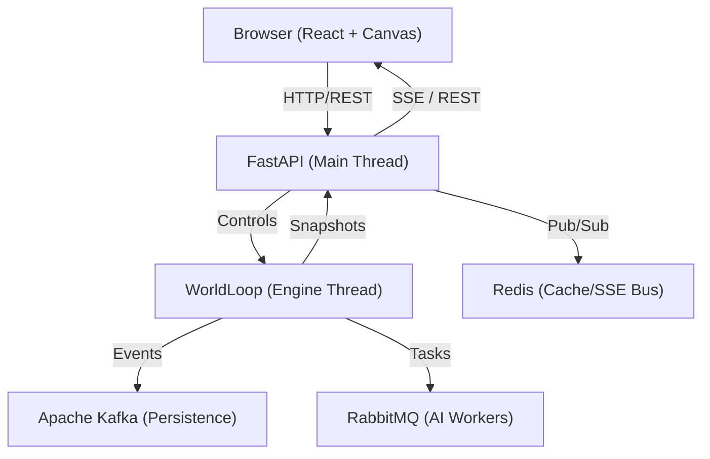

# Technical Execution Flow & Stack

Welcome to the internal technical documentation for the RPG-Based Simulation. This guide is designed to help developers understand the "plumbing" of the world and how to build new features from top to bottom.

---

## 1. High-Level Architecture (The Big Picture)

The project is built on a **Deterministic Concurrent Engine** with a vertical stack ranging from real-time simulation to event-sourced persistence.

### System Context Diagram



### The Threaded Concurrency Model

The simulation is architected to avoid Python's Global Interpreter Lock (GIL) contention and race conditions by strictly isolating the **Mutation** from the **Reading**:

1.  **Main Thread (FastAPI)**: Manages network I/O, user authentication, and serving the React app. It only reads *immutable* world snapshots.
2.  **Engine Thread (`WorldLoop`)**: The **Single-Writer**. Only this thread is allowed to mutate the `WorldState`.
3.  **Snapshotting**: At the end of every tick, the engine creates a `Snapshot` (a frozen Pydantic deep-copy) and performs an **atomic swap** (`EngineManager._latest_snapshot = new_snap`).
4.  **Worker Pool**: Brain computations (AI logic) are offloaded to background workers, but their intentions are "Collected" and "Resolved" strictly on the Engine Thread to maintain determinism.

### Technical Stack & Responsibilities

| Component | Responsibility | Technical Implementation |
| :--- | :--- | :--- |
| **Engine** | Simulation logic, physics, NPC AI | Python 3.11+, `threading`, `xxhash` |
| **API** | Real-time state delivery, Controls | FastAPI, `uvicorn`, SSE |
| **Schemas** | Single source of truth | Pydantic V2 Dataclasses |
| **Persistence** | Durable event-sourcing | Apache Kafka |
| **AI Workers** | Scaling NPC intelligence | RabbitMQ (shared work queue) |
| **Streaming** | High-performance delta updates | Redis Streams |
| **Frontend** | 60FPS World Rendering | React, Vite, HTML5 Canvas |

### The "Nervous System": Event Sourcing

This system uses a **Kafka-backed event-sourcing** architecture. Instead of just saving the current state (CRUD), every meaningful change (`SimEvent`) is appended to a log. This allows:
-   **Infinite Undos/Rewinds**: Replay the world to any tick.
-   **Stability**: If the server crashes, it "replays" the Kafka log to regain state on startup.
-   **Data Science**: ML pipelines can consume the event stream to learn behavioral patterns.

## 2. Part 1: The Simulation Engine (The Heart)

The `WorldLoop` is a single-threaded ticker that drives the entire world progression. To remain performant yet deterministic, it follows a strict **4-Phase Lifecycle**.

### The 4-Phase Tick Cycle

Every tick (default 50ms) executes these phases in order:

1.  **Schedule (World Timing)**: Updates the global clock, calculates world-age multipliers, triggers scheduled spawning, and checks for region-wide events (e.g., Calamity spawns).
2.  **Collect (AI Thinking)**: The `WorkerPool` dispatches the `AIBrain` for every entity. 
    *   **Input**: A frozen `Snapshot` of the world.
    *   **Output**: An `ActionProposal` (e.g., "I intend to move to Tile X").
    *   **Logic Location**: `src/ai/brain.py` and `src/ai/worker_pool.py`.
3.  **Resolve (Action Physics)**: The `ConflictResolver` processes all proposals.
    *   **Movement**: Resolves tile collisions (shuffling/yielding).
    *   **Combat**: Calculates damage, checks for deaths, and drops loot.
    *   **Side-Effects**: Updates the `WorldState` and records `SimEvent` logs.
4.  **Cleanup (State Management)**: Removes dead entities, updates the spatial index (`SpatialHash`), and emits the final `Snapshot` to the `EngineManager`.

### Determinism: The RNG Formula

To ensure that a world can be perfectly replayed from a seed, we use a custom `DeterministicRNG`. **Never use `random.random()` or `np.random`** in engine code.

```python
# The standard way to get a random value for an entity action:
roll = rng.next_float(
    domain=Domain.COMBAT, 
    entity_id=attacker.id, 
    tick=current_tick,
    sub_seed=0 # Optional offset for multiple rolls in one action
)
```

The seed is generated by hashing `(WorldSeed, Domain, EntityID, Tick, SubSeed)`. This guarantees that if the same move happens at the same time, the result is identical.

### Action Proposals vs. Mutation

To keep the system scalable, we separate **Intent** from **Result**:
-   **AI Brains** produce an `ActionProposal`. They cannot change the world directly.
-   **Engine** resolves the proposals. If two heroes try to grab the same loot, the engine awards it to one (deterministically) and the other proposal is marked as "Failed".

### Concurrency & Snapshots

Because the `WorldLoop` can take multiple milliseconds to resolve, we use **Snapshots** to allow the API to read state without locking the engine:
-   A `Snapshot` is a lightweight, serialized view of the world.
-   The `EngineManager` holds a `snapshot_lock` for the microsecond it takes to swap the reference pointer.
-   **Result**: The API never reads a "partial" state where an entity has moved but its loot hasn't.

## 3. Part 2: Data & Connectivity (The Nervous System)

This layer handles how the Engine communicates with the outside world and maintains a persistent memory.

### Shared Pydantic Schemas

We use Pydantic V2 models (`src/core/models.py`, `src/core/snapshot.py`) as our **Universal Language**:
-   **Backend**: Used for type-safe simulation logic and serialization to Kafka.
-   **API**: Automatically generates OpenAPI/Swagger documentation.
-   **Frontend**: TypeScript types are generated directly from these models, ensuring that the Browser always knows the exact structure of an `Entity` or `SimEvent`.

### Kafka Event-Sourcing & Recovery

The simulation does not use a traditional relational database (SQL) for primary state. Instead, it uses **Apache Kafka** for durable event-sourcing:

1.  **Snapshots**: Every 100 ticks, the engine persists a full "Compacted Snapshot" to the `sim.snapshots` topic.
2.  **Events**: Every meaningful action is appended to the `sim.events` topic as a `SimEvent`.
3.  **The Recovery Flow**: On startup, `EngineManager._try_recover_world()` performs a "Cold Boot":
    *   It fetches the **latest** snapshot from Kafka.
    *   It then "replays" all events that happened *after* that snapshot to rebuild the exact world state.

### Real-time Streaming (SSE)

The frontend receives live updates via **Server-Sent Events (SSE)** at `/api/v1/stream`. 

-   The `EngineManager` acts as a broadcaster.
-   When the `WorldLoop` finishes a tick, it broadcasts the new `Snapshot` to all connected SSE clients.
-   **Optimization**: To save bandwidth, we use **Redis Streams** to calculate and send only "Deltas" (changes) for large datasets like the world map.

### Data-Driven Registries

The engine's rules (Items, Classes, Skills) are kept in **Data Registries** (`src/core/registry_loader.py`):
-   At boot, the API calls `load_all_registries()`.
-   This hydrates static Python dictionaries that are shared across the Engine and API.
-   Adding a new Item only requires a change to the registry, never the core engine code.

### Worker Scalability

For high-density simulations, AI brain evaluations can be distributed:
-   **RabbitMQ**: Intentions are sent to a shared task queue.
-   **Workers**: Scalable AI worker processes consume these tasks and return `ActionProposals`.
-   This bypasses Python's GIL by moving heavy computation into independent processes.

## 4. Part 3: The React Frontend (The Body)

The visualization layer is a high-performance React application tuned for 60FPS rendering of thousands of simulated entities.

### Multi-Layer Canvas Strategy

To avoid expensive React DOM re-renders, the world map is drawn onto multiple HTML5 `<canvas>` layers:

1.  **Background Layer**: Static tiles (Grass, Water, Walls). This is pre-rendered once or cached on the GPU.
2.  **Entity Layer**: Dynamic sprites (Heroes, Mobs, Items). This layer is cleared and redrawn every frame based on the current snapshot.
3.  **UI/Indicator Layer**: Health bars, combat numbers, and range indicators.
4.  **Overlay Layer**: Fog of war and atmospheric effects (Grid lines, pathing debug).

### Real-time State Synchronization

The frontend connects to the API via **SSE (Server-Sent Events)**. 

-   **useSimulationStream**: A custom React hook that maintains the persistent connection.
-   **Atomic Updates**: Every message from the server is a complete (or delta) `Snapshot`. React state is updated atomically, and the canvas `requestAnimationFrame` loop kicks in to reflect the new state.
-   **Client-Side Prediction**: For smooth movement between 50ms ticks, the frontend performs linear interpolation (Lerp) of entity positions.

### Performance Guards

The simulation can scale to 1000+ entities. To handle this in Chrome/Firefox:
-   **Offscreen Canvas**: The minimap is rendered to an offscreen buffer and only "pasted" to the main canvas during zoom/pan changes.
-   **Viewport Culling**: Only entities currently within the user's view (plus a small margin) are sent through the drawing pipeline.
-   **Memoization**: React components for the Inspector and Logs are heavily memoized (`React.memo`) to prevent re-renders when the world state changes.

### Type-Safe Integration

Since the Backend and Frontend share the same `Snapshot` structure (via Pydantic → TypeScript generation), a developer can add a new attribute to an entity in Python, and it will automatically be available in the React `EntityInspector` with the correct type.

## 5. Part 4: The Developer's Cookbook (The Hands)

This section provides practical "recipes" for common development tasks.

### Recipe 1: Adding a New Entity Action
**Goal**: Allow an entity to perform a new type of interaction (e.g., "Blessing" another hero).

1.  **Define Proposal**: Add a new class to `src/engine/action_queue.py` inheriting from `ActionProposal`.
2.  **AI Brain**: Update `AIBrain.best_ready_action()` to propose this new action under specific conditions.
3.  **Conflict Resolution**: Add a `_resolve_bless()` method in `src/engine/conflict_resolver.py`. This is where the actual mutation of `WorldState` happens.
4.  **Emit Event**: Call `world.event_log.emit(SimEvent(...))` within the resolver to record the outcome.
5.  **Determinism**: Ensure any probability checks use the `rng` passed to the resolver.

### Recipe 2: Adding a New AI Behavioral State
**Goal**: Create a new lifestyle or combat tactic (e.g., "Cowardly" fleeing).

1.  **Enum**: Add the state to `AIState` in `src/core/enums.py`.
2.  **Transitions**: Update the decision tree in `src/ai/brain.py` to trigger this state based on context (e.g., `hp < 10%`).
3.  **Logic**: Implement the per-tick decision logic for the state in `AIBrain._handle_cowardly()`.
4.  **Perception**: If the state needs new data, update `Perception` in `src/core/models.py`.

### Recipe 3: Adding a New Item or Skill
**Goal**: Expand the game content without changing engine logic.

1.  **Registries**: Open `src/core/item_registry.py` or `src/core/classes.py`.
2.  **Define Template**: Add a new `ItemTemplate` or `SkillDef` to the respective registry.
3.  **Tags/Scaling**: Use standard tags like `FIRE`, `AOE`, or `LEGENDARY` to inherit baseline behavior.
4.  **Verification**: Restart the server; the new item will automatically appear in loot tables and API metadata.

### Recipe 4: Adding a New Building or Settlement
**Goal**: Add a new functional structure (e.g., "Magic Academy").

1.  **Building Model**: Add a new `Building` instance in `EngineManager._build()` during world generation.
2.  **Interaction**: Update `src/ai/states.py` to define how heroes behave when they are "Inside" this building type (e.g., training SPI).
3.  **Visual**: Add a new icon or color mapping in the React `TileSet` component on the frontend.

### Recipe 5: Adding a Frontend Inspector Tab
**Goal**: Display new detailed data about an entity.

1.  **Schema**: Update the Pydantic model (`Entity`) in `src/core/models.py`.
2.  **React Hook**: The data is already available in the snapshot; no hook update needed.
3.  **Component**: Open `frontend/src/components/Inspector.tsx` and add a new section rendering the property.
4.  **Styling**: Use the project's CSS tokens in `index.css` for a premium look.

### Bonus: Adding a Global World System
**Goal**: Add a system that affects everyone (e.g., Weather or Night/Day cycle).

1.  **Logic**: Create a new system class in `src/systems/`.
2.  **Hook**: Initialize it in `EngineManager._build()` and call its `update()` method during the **Schedule** phase of `WorldLoop.run_tick()`.
3.  **State**: If it has state, add it to the `WorldState` model so it survives a reboot via Kafka.
