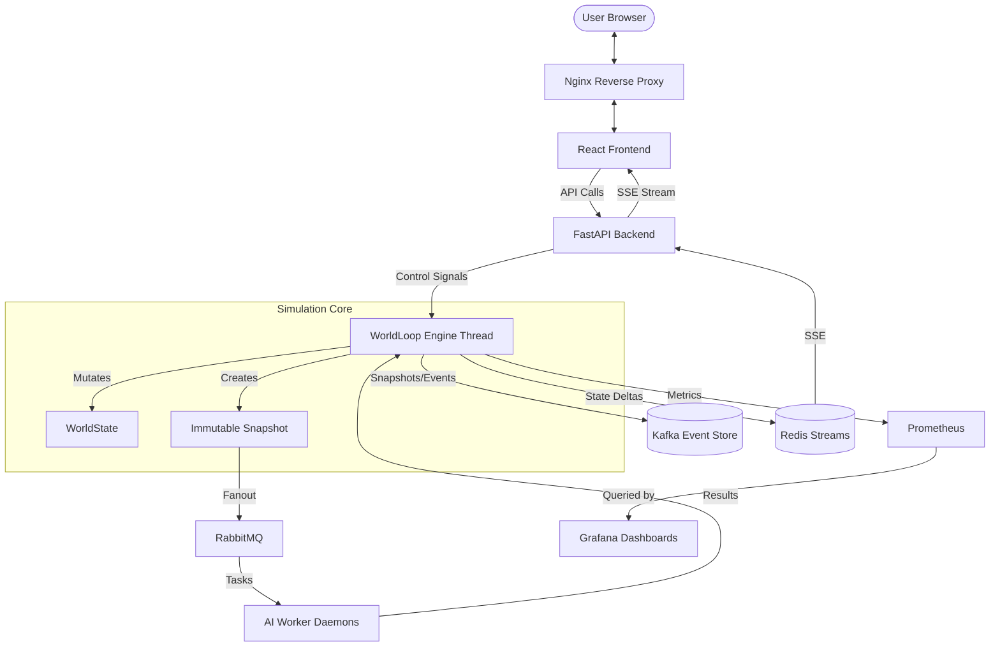

# Simulation Execution Flow and Technology Stack

This document provides a high-level overview of the entire RPG simulation system, detailing the technology stacks used and the primary flows of execution from boot to observability.

---

## 1. Technology Stack

The project uses a modern, distributed architecture to handle concurrent AI simulation with deterministic results and high observability.

| Layer | Technology | Purpose |
|-------|------------|---------|
| **Frontend** | React, Vite, TypeScript | Interactive UI for visualization, entity inspection, and simulation control. |
| **API Gateway** | Nginx | Serves static frontend assets and reverse-proxies API requests to the backend. |
| **Backend** | FastAPI (Python) | High-performance asynchronous API; manages the lifecycle of the simulation engine. |
| **Simulation Core** | Custom Engine (Python) | Single-threaded, deterministic 4-phase tick loop. |
| **AI Scheduling** | RabbitMQ + `pika` | Distributed task queue for offloading complex AI "brain" decisions to worker daemons. |
| **Event Sourcing** | Apache Kafka | Persistent append-only log for full simulation snapshots and granular delta events. |
| **Real-time Streaming** | Redis Streams + SSE | State deltas published to Redis and streamed to the frontend via Server-Sent Events. |
| **Observability** | Prometheus & Grafana | Real-time metrics collection (Prometheus) and visualization dashboards (Grafana). |
| **Infrastructure** | Docker & Docker Compose | Containerization and orchestration of all services. |

---

## 2. Main Execution Flow

### Phase A: Boot & Initialization
When the backend container starts, the following sequence occurs:
1.  **FastAPI Startup**: The application initializes and runs the `lifespan` event.
2.  **Engine Building**: `EngineManager` builds the initial world (Grid generation, entity spawning, metadata registry).
3.  **Infrastructure Connectivity**: Connection pools are established for Redis, Kafka, and RabbitMQ.
4.  **Recovery (Optional)**: If enabled, the engine consumes the latest snapshot and events from Kafka to rehydrate the state.
5.  **Thread Launch**: The `WorldLoop` is started in a dedicated backround thread to run the simulation independently of HTTP requests.

### Phase B: The Tick Cycle (4 Sequential Phases)
Each simulation tick executes a strict 4-phase pipeline in `world_loop.py` to ensure determinism:

1.  **Scheduling & Snapshotting**:
    *   The engine identifies entities due to act (`next_act_at <= current_tick`).
    *   An immutable `Snapshot` of the world is created.
    *   Tasks are fanned out to **RabbitMQ** (Distributed) or a **ThreadPool** (Local).
2.  **AI Decision Collection**:
    *   Worker daemons receive the snapshot once per tick (Fanout).
    *   Workers compute decisions (`AIBrain.decide`) for assigned entities and push `ActionProposals` to a results queue.
    *   The engine blocks until all results are collected or a hard timeout (e.g., 2s) is reached.
3.  **Conflict Resolution & Application**:
    *   Proposals are sorted deterministically (by `next_act_at`, then `entity_id`).
    *   Each action is validated against the current state (e.g., "is the target still reachable?").
    *   Valid actions are applied sequentially to the `WorldState`.
4.  **Post-Tick & Event Emission**:
    *   Subsystems update (XP gains, Level-ups, Stamina regen, Status effect ticks).
    *   Events are published to the internal `EventLog`.
    *   State deltas are published to the **Redis Stream** for immediate SSE delivery to the frontend.
    *   Periodic snapshots are pushed to **Kafka** for persistence.

### Phase C: Observability Pipeline
The system is instrumented to provide deep insights into performance and game balance:
1.  **Instrumentation**: The engine updates `prometheus_client` metrics (Gauges, Counters, Histograms) tracking tick durations, queue depths, and entity counts.
2.  **Scraping**: Prometheus periodically scrapes the `/metrics` endpoint of the backend.
3.  **Visualization**:
    *   **Grafana** queries Prometheus to display resource metrics (CPU, RAM).
    *   **Custom Dashboards** display simulation metrics (Ticks per second, total deaths, spawn rates).

---

## 3. Data Flow Diagram

---

## 4. Primary File References

*   **Entry Point**: `src/api/engine_manager.py` (Orchestrates startup/shutdown)
*   **The Loop**: `src/engine/world_loop.py` (Core 4-phase logic)
*   **The Snapshots**: `src/core/snapshot.py` (Persistence and Worker context)
*   **Worker Logic**: `src/workers/ai_worker_daemon.py` (Distributed AI processing)
*   **Streaming**: `src/api/routes/stream.py` (FastAPI SSE endpoints)
*   **Metrics**: `src/utils/metrics.py` (Prometheus definitions)
