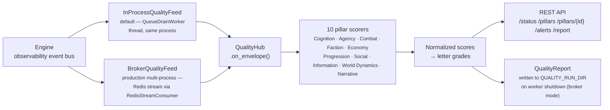

# Simulation Quality Scoring — Getting Started Guide

This guide explains how to enable, read, and act on the Simulation Quality (SimQ) module.
For the authoritative spec, see
[`quality_scoring_contract.md`](../simulation_quality/quality_scoring_contract.md) (relative path
corrected — the previous `../quality_scoring_contract.md` resolved to a nonexistent
`docs/quality_scoring_contract.md`). For every axis this system can be extended along (world
breadth/depth, tuning config, temporal depth, feed mode, anchor granularity, and more), see
[`extension_points.md`](../simulation_quality/extension_points.md).

---

## What SimQ does

SimQ scores a live simulation run across **10 behavioral pillars** (Cognition, Agency, Combat,
Faction, Economy, Progression, Social, Information, World Dynamics, Narrative) using a stream
of observability events emitted by the engine. Each pillar accumulates a raw score from
positive signals (healthy behavior) and negative signals (degenerate patterns). Scores are
normalized per tick and converted to letter grades.

Use SimQ to:
- Catch degenerate simulation states early (faction monopoly, economic stasis, combat lockout)
- Verify that balance changes actually improved simulation health
- Monitor a long run without watching every tick
- Drive automated regression tests against grade thresholds

### Data flow

See [Feed modes](#feed-modes) below for when each feed path applies.



---

## Quick start

### 1. Enable (default — no configuration needed)

SimQ is **on by default** in in-process mode. When the FastAPI server starts, the `QualityHub`
is initialized via `src/api/dependencies.py:get_quality_hub()`. Events flow from the global
observability queue through `InProcessQualityFeed → QualityHub.on_envelope()`.

Check it's alive:

```
GET /api/v1/quality/status
```

Expected response when healthy:

```json
{
  "enabled": true,
  "run_id": "run_20260630",
  "tick_count": 42,
  "overall_score": 0.73,
  "overall_grade": "A"
}
```

### 2. Disable

```bash
QUALITY_SCORING_DISABLED=1 python -m src.main
```

All five endpoints return `{"enabled": false}` when disabled.

---

## Environment variables

| Variable | Default | Purpose | Owning Process |
|---|---|---|---|
| `QUALITY_SCORING_DISABLED` | unset | Set to `1` to disable all scoring | Engine only |
| `QUALITY_FEED_MODE` | `inprocess` | `inprocess` or `broker` (Redis) | Engine only |
| `QUALITY_BROKER_URL` | `ObservabilityConfig.get_redis_url()` (`SIM_REDIS_URL`/`RPG_REDIS_URL`, else `redis://localhost:6379/0`) | Redis URL for broker mode | Engine + Worker |
| `QUALITY_STREAM_NAME` | `ObservabilityConfig.get_stream_name()` (`SIM_STREAM_NAME`/`RPG_STREAM_NAME`, else `simulation:events`) | Redis stream name | Engine + Worker |
| `QUALITY_CONSUMER_GROUP` | `quality_scoring` | Redis consumer group | Engine + Worker |
| `QUALITY_WEIGHTS_PATH` | `config/simulation_quality/scoring_weights.yaml` | Pillar event weights | Engine + Worker |
| `QUALITY_GRADE_PATH` | `config/simulation_quality/grade_thresholds.yaml` | Grade cutoffs | Engine + Worker |
| `QUALITY_DETECTION_PATH` | `config/simulation_quality/detection_params.yaml` | Loop / time-gate params | Engine + Worker |
| `QUALITY_PROFILE` | `default` | Config profile subdirectory | Engine + Worker |
| `QUALITY_RUN_DIR` | `data/runs/{QUALITY_RUN_ID}` | Where persistence writes score records | Worker only |
| `QUALITY_RUN_ID` | `broker_worker` | Run ID stamped on every score record | Worker only |
| `QUALITY_WORKER_PORT` | `8082` | Health-check port in broker-worker mode | Worker only |
| `QUALITY_STALE_WARNING_SECONDS` | `30` | Seconds after start before the worker logs a WARNING if zero events have been consumed (startup diagnosability — see "Broker" quickstart below) | Worker only |
| `SIM_STREAM_NAME` / `RPG_STREAM_NAME` | unset (falls through to `simulation:events`) | Producer-side Redis stream key; `QUALITY_STREAM_NAME` defaults onto this | Engine (producer, `src/observability/config.py`) |
| `SIM_REDIS_URL` / `RPG_REDIS_URL` | unset (falls through to `redis://localhost:6379/0`) | Producer-side Redis URL; `QUALITY_BROKER_URL` defaults onto this | Engine (producer, `src/observability/config.py`) |
| `SIM_STREAM_BACKEND` / `RPG_STREAM_BACKEND` | unset (deployment-profile-derived) | Selects `redis`/`null`/`in_process` event stream backend | Engine (producer, `src/observability/config.py`) |

---

## Grade scale

Grades are assigned per pillar using the **normalized score** computed as:

```
floor_tick       = max(1, current_tick // 4)
effective_denom  = max(floor_tick, last_event_tick)  # if any events fired
normalized_score = raw_score / effective_denom
```

This formula (introduced TCK-20260702-SIMQ-UPLIFT-GRADE-DECAY) prevents tick-dilution artifacts:
early-burst pillars use `last_event_tick` as denominator instead of the full run length.
The `floor_tick` guard (`current_tick // 4`) prevents S-grade inflation when all events cluster
at tick 1. See `docs/simulation_quality/quality_scoring_contract.md` §4.4 for the authoritative spec.

| Grade | Normalized score | Meaning |
|---|---|---|
| **S** | > +2.0 | Exceptional — subsystem operating far above baseline |
| **A** | +0.5 to +2.0 | Healthy — normal positive behavior |
| **B** | 0.0 to +0.5 | Adequate — minimal signal, neither improving nor degrading |
| **C** | −0.5 to 0.0 | Concerning — subsystem underperforming; investigate |
| **D** | −1.0 to −0.5 | Degraded — significant degenerate signals present |
| **F** | < −1.0 | Degenerate — subsystem broken, absent, or in permanent failure mode |

Thresholds are loaded from `config/simulation_quality/grade_thresholds.yaml`.
Do not hardcode them in scorers.

---

## The 10 pillars

| Pillar ID | What it measures | Key positive events | Key failure signals |
|---|---|---|---|
| `COGNITION` | Belief-driven decision making | `belief_updated`, `knowledge_sharpening`, `cognition_replan` | `belief_system_dormant`, `omniscience_collapse`, `zero_knowledge_decision` |
| `AGENCY` | Entity initiative and goal completion | `action_executed`, `project_started`, `project_completed` | `entity_stasis`, `population_stasis`, `rejection_cascade` |
| `COMBAT` | Combat diversity and resolution | `combat_initiated`, `combat_resolved`, `tactical_variety` | `combat_dormant`, `attrition_spiral`, `early_extinction` |
| `FACTION` | Diplomatic and political activity | `diplomatic_transition`, `alliance_accepted`, `territory_ownership_changed` | `diplomacy_dormant`, `faction_monopoly`, `all_factions_neutral` |
| `ECONOMY` | Resource flow and trade health | `gold_transferred`, `item_harvested`, `crafting_event` | `zero_harvest`, `conservation_law_violated`, `ecology_broken` |
| `PROGRESSION` | XP and skill advancement | `level_up`, `skill_learned`, `quest_completed` | `progression_frozen`, `xp_plateau` |
| `SOCIAL` | Reputation and relationship dynamics | `reputation_delta`, `cooperation_event`, `quest_accepted` | `zero_social_interaction`, `isolation_cascade` |
| `INFORMATION` | Knowledge discovery and propagation | `knowledge_discovered`, `strategic_goal_changed` | `knowledge_default_fallback`, `information_stasis` |
| `WORLD_DYNAMICS` | Ecological and environmental change | `ecology_event`, `calamity_started`, `world_emergence_event` | `ecology_cadence_broken`, `world_stasis` |
| `NARRATIVE` | Story milestones and chronicle events | `chronicle_entry_created`, `narrative_milestone`, `hero_death_unrecorded` | `zero_chronicle`, `zero_emergence` |

---

## REST API

All endpoints are mounted at `/api/v1/quality/`. See the contract §11 for the full spec.

### GET /api/v1/quality/status

Quick health check. Returns run overview and overall grade.

```bash
curl http://localhost:8000/api/v1/quality/status
```

### GET /api/v1/quality/pillars

All 10 pillar summaries: normalized score, grade, event count, loop detection flag.

```bash
curl http://localhost:8000/api/v1/quality/pillars
```

```json
{
  "enabled": true,
  "tick_count": 150,
  "pillars": [
    {"pillar_id": "COMBAT", "normalized_score": -1.3, "grade": "F", "event_count": 3, "loop_detected": false},
    {"pillar_id": "ECONOMY", "normalized_score": 0.8, "grade": "A", "event_count": 42, "loop_detected": false}
  ]
}
```

### GET /api/v1/quality/pillars/{pillar_id}

Full pillar state including the top-10 worst scoring events for drill-down.

Valid `pillar_id` values: `COGNITION`, `AGENCY`, `COMBAT`, `FACTION`, `ECONOMY`,
`PROGRESSION`, `SOCIAL`, `INFORMATION`, `WORLD_DYNAMICS`, `NARRATIVE`

```bash
curl http://localhost:8000/api/v1/quality/pillars/COMBAT
```

```json
{
  "enabled": true,
  "pillar_id": "COMBAT",
  "raw_score": -195.0,
  "normalized_score": -1.3,
  "grade": "F",
  "event_count": 3,
  "negative_count": 2,
  "loop_detected": false,
  "loop_flags": [],
  "worst_events": [
    {
      "tick": 200,
      "event_id": "evt_abc123",
      "pillar": "COMBAT",
      "delta": -50.0,
      "reason": "extinction_degenerate: entity count dropped below 2 by tick 200",
      "event_type": "entity_killed",
      "entity_id": "hero_7",
      "region_id": "region_east",
      "tags": ["extinction", "degenerate"]
    }
  ]
}
```

The `reason` field in each worst event is the scorer's explanation — use it as the starting
point when diagnosing a bad grade.

### GET /api/v1/quality/alerts

Returns only pillars graded D or F, or with active loop flags. Use this for monitoring.

```bash
curl http://localhost:8000/api/v1/quality/alerts
```

```json
{
  "enabled": true,
  "tick_count": 150,
  "alert_count": 1,
  "alerts": [
    {
      "pillar_id": "COMBAT",
      "grade": "F",
      "normalized_score": -1.3,
      "loop_detected": false,
      "loop_flags": []
    }
  ]
}
```

### GET /api/v1/quality/report

Full `QualityReport` snapshot — all pillars, all event counts, overall score. Use for
end-of-run persistence or detailed offline analysis.

```bash
curl http://localhost:8000/api/v1/quality/report
```

---

## Diagnosing a bad grade

When a pillar drops to D or F, follow this path:

1. **Check `/alerts`** — confirms which pillars are in alert state and lists `loop_flags`
2. **Drill into the pillar** — `GET /pillars/{pillar_id}`, read `worst_events[*].reason`
3. **Find the source event** — `event_id` in `worst_events` traces back to the observability
   event log at `data/runs/`. Match `event_type` to the engine behavior that produced it.
4. **Check the time gate** — many negative signals are only emitted after a threshold tick
   (e.g., `zero_harvest` fires after tick 100). Confirm the tick in the event against
   `config/simulation_quality/detection_params.yaml`.
5. **Check for loops** — `loop_detected: true` means the same scoring tag appeared in > 70%
   of the sliding window (200 events). The `loop_flags` list names the tag. This indicates
   a repetitive degenerate pattern, not a one-time spike.
6. **Cross-pillar correlation** — a COMBAT F often correlates with FACTION D (faction
   monopoly → no wars → no combat events). Use `/report` to view all pillars together.

---

## Feed modes

### In-process (default)

The `InProcessQualityFeed` drains the global observability queue via a `QueueDrainWorker`
background thread. No external dependencies. Works in development and single-process deploys.

```bash
# Default — no env change needed
QUALITY_FEED_MODE=inprocess python -m src.main
```

### Broker (Redis, production multi-process)

Events are published to a Redis stream by the engine process. The `BrokerQualityFeed`
consumes them in a separate process via `RedisStreamConsumer`. `QUALITY_BROKER_URL` and
`QUALITY_STREAM_NAME` default onto `ObservabilityConfig.get_redis_url()`/`get_stream_name()`
(the same values the producer resolves), so setting them explicitly is optional as long as
they already match the producer's `SIM_REDIS_URL`/`SIM_STREAM_NAME` configuration:

```bash
QUALITY_FEED_MODE=broker \
python -m src.simulation_quality.worker
```

The standalone worker process:
- Connects to Redis on startup; logs a warning and degrades gracefully if unavailable
- Logs its resolved `(broker_url, stream_name, consumer_group)` triple at INFO on start, and warns
  after `QUALITY_STALE_WARNING_SECONDS` (default 30) if zero events have been consumed — the
  previously-silent failure mode when producer/consumer stream names diverged
- Exposes a health endpoint at `http://localhost:8082/health`, including a `pillar_event_counts`
  dict (one key per `PillarId`, e.g. `"AGENCY"`, `"COMBAT"`) once the hub has processed at least
  one envelope — sourced from `QualityHub`'s existing per-pillar `PillarAccumulator` snapshots, so
  a future scorer-coverage regression (e.g. a partial pillar list) is observable via `/health`
  rather than silent (`TCK-20260804-OBSISO-WORKER-PARITY-HOTFIX`)
- Writes a final `QualityReport` to `QUALITY_RUN_DIR` on shutdown (SIGTERM or SIGINT)

**Operational note:** `QUALITY_RUN_DIR` defaults to `data/runs/{QUALITY_RUN_ID}`, so operators
running more than one concurrent broker-mode worker must set a distinct `QUALITY_RUN_ID` per
run — two workers left on the default `QUALITY_RUN_ID=broker_worker` still collide on the same
output directory and overwrite each other's score records.

---

## Configuration

All configuration files live under `config/simulation_quality/`. **Do not hardcode values
in scorer or accumulator Python files.**

### `grade_thresholds.yaml`

Grade cutoff boundaries (normalized score). The F grade applies below the D cutoff.

```yaml
S: 2.0
A: 0.5
B: 0.0
C: -0.5
D: -1.0
```

### `scoring_weights.yaml`

Per-event score deltas, grouped by pillar. Example (COMBAT pillar):

```yaml
COMBAT:
  combat_active: 2.0
  combat_resolved: 3.0
  survival_tension: 2.0
  tactical_variety: 1.0
  attrition: -1.0
  early_extinction: -10.0
  attrition_spiral: -20.0
  extinction_degenerate: -50.0
  combat_dormant: -15.0
  combat_unresolved: -8.0
  combat_hard_law: -30.0
```

To adjust sensitivity of a pillar, edit the relevant delta values. Increase negative weights
to make the grade more punishing; increase positive weights to reward normal behavior more.

### `detection_params.yaml`

Time gates and loop detection parameters:

```yaml
loop_threshold: 0.70      # tag must appear in >70% of window to flag a loop
window_size: 200          # sliding window size (events)
max_worst_events: 100     # top-N worst events kept per pillar
time_gates:
  zero_harvest_after_tick: 100      # emit zero_harvest signal only after tick 100
  zero_crafting_after_tick: 200
  zero_combat_by_tick: 200
  zero_diplomacy_by_tick: 200
  faction_monopoly_by_tick: 500
  # ... (see file for full list)
```

### Profiles

Scenario-specific config overrides live under `config/simulation_quality/profiles/`:

| Profile | Purpose |
|---|---|
| `default.yaml` | Balanced weights for generic simulation |
| `dungeon_crawl.yaml` | Heavy COMBAT and PROGRESSION weighting |
| `urban_political.yaml` | Heavy FACTION and SOCIAL weighting |

Activate a profile with `QUALITY_PROFILE=dungeon_crawl`. Profile values are merged on top
of the base `scoring_weights.yaml` — only override what differs.

---

## Event translation

The engine emits internal event types (e.g. `combat_kill`, `StrategicObjectiveChanged`)
that do not match the scorer vocabulary in the contract §5. `QualityHub._translate()` remaps
them before scorer dispatch. The original event type is preserved in
`payload["_original_event_type"]` for traceability.

Simple one-to-one remaps (`_TRANSLATE_SIMPLE` in `quality_hub.py`):

| Engine event type | Contract event type |
|---|---|
| `combat_kill` | `entity_killed` |
| `gold_transaction` | `gold_transferred` |
| `StrategicObjectiveChanged` | `strategic_goal_changed` |
| `leadership_changed` | `diplomatic_transition` |
| `alliance_formed` | `alliance_accepted` |

Payload-conditional remaps (`_TRANSLATE_CONDITIONAL`):
- `quest_event` → `quest_started`, `quest_completed`, or `quest_failed` (based on `payload.status`)
- `lifecycle` → `level_up` or `entity_killed` (based on `payload.action`)
- `betrayal_desertion` → `faction_tension_delta` if `payload.faction_id` is set, else `contract_lapsed`

---

## Adding a new scoring rule

1. Find the relevant pillar scorer in `src/simulation_quality/scorers/` (e.g. `combat.py`).
2. Add the event type to the scorer's `EVENT_TYPES` class attribute.
3. Add the score delta to `config/simulation_quality/scoring_weights.yaml` under the pillar.
4. In the scorer's `score()` method, handle the new event type and return a `ScoreRecord`.
5. If the engine emits the event under a different name, add a translation entry in
   `quality_hub.py` (`_TRANSLATE_SIMPLE` or `_TRANSLATE_CONDITIONAL`).
6. Add tests in `tests/unit/simulation_quality/` — at minimum: normal score path, zero
   delta path (event below time gate), and integration through `QualityHub.on_envelope()`.
7. Update the parity ledger entry in `docs/parity_ledger/infrastructure.yaml` if this
   closes a `missing` or `divergent` entry.

---

## Adding a new pillar

New pillars must be declared in `src/simulation_quality/pillars.py` (`PillarId` enum),
have a scorer class in `src/simulation_quality/scorers/`, be registered in
`QualityHub.SCORER_REGISTRY` (automatic — the hub builds it from each scorer's `EVENT_TYPES`),
and have weights declared in `scoring_weights.yaml`. The accumulator and report builder
iterate all `PillarId` values automatically — no changes needed there.

See the extensibility protocol in the contract §13 for the full checklist.

---

## Running integration tests

```bash
# Unit tests for SimQ scorers and hub
pytest tests/unit/simulation_quality/ -v

# Event extractor tests (social/faction/narrative events)
pytest tests/unit/observability/test_event_extractor_social_faction.py \
       tests/unit/observability/test_event_extractor_narrative.py -v

# Exclude slow tests
pytest tests/unit/simulation_quality/ -m "not slow" -v
```
