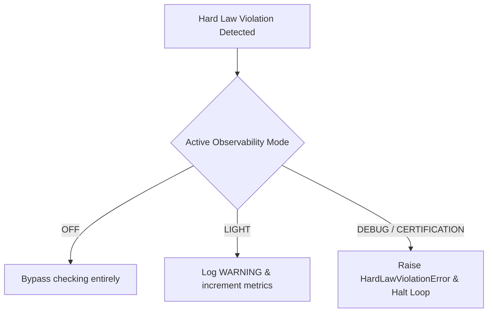

# Hard Law Monitor (HardLawMonitor)

The **Hard Law Monitor** is a core simulation health compliance guardian in the V2 RPG Simulation Engine. It executes lightweight, $O(1)$-efficient checks at the end of each tick, scoped strictly to the tick's modified elements (`DirtySet`), ensuring that simulation rules are perfectly maintained without compromising operational performance.

---

## 1. Core Operational Laws

The monitor enforces six authoritative laws spanning entity attributes, safety values, coordinates, and physical occupancy constraints:

| Law ID | Scope | Constraint Rule | Severity | Description |
| :--- | :--- | :--- | :--- | :--- |
| **`LAW-HP-NONNEGATIVE`** | `DirtySet.combat_entities` | $HP \ge 0$ | **ERROR** | Ensures active/alive entities do not have negative Health Points. Dead/inactive entities are bypassed. |
| **`LAW-READINESS-NONNEGATIVE`** | `DirtySet.combat_entities` | $Readiness \ge 0$ | **ERROR** | Guarantees that active combat readiness scores are non-negative. |
| **`LAW-GOLD-NONNEGATIVE`** | `DirtySet.inventory_entities` | $Gold \ge 0$ | **ERROR** | Confirms no active entity carries a negative gold balance. |
| **`LAW-STAMINA-NONNEGATIVE`** | `DirtySet.biological_entities` | $Stamina \ge 0$ | **ERROR** | Validates that stamina/energy points do not drop below zero. |
| **`LAW-POSITION-FINITE`** | `DirtySet.movement_entities` | $x, y \in \mathbb{R}$ | **ERROR** | Guarantees that entity location coordinates are valid finite floating-point numbers (no `NaN` or `Infinity`). |
| **`LAW-OCCUPANCY-COLLISION`** | `DirtySet.movement_entities` | $\text{occupants}(tile) \le 1$ | **ERROR** | Ensures no two solid active alive entities occupy the same spatial grid tile simultaneously. |

---

## 2. Observability Operational Modes & Policies

The simulation's reaction to detected hard law violations is governed by the thread-safe `ObservabilityMode` resolved via programmatic overrides, environment variables, or a system default:

### Modes Breakdown
- **`OFF`**: All health checking is completely bypassed.
- **`LIGHT` (Default)**: Tracks statistics and cumulative violations on the engine's thread-safe status signal. Emits structured warnings to standard logging outputs, but allows the simulation to proceed.
- **`DEBUG` & `CERTIFICATION`**: Fails fast immediately. Halts loop execution by raising `HardLawViolationError`, preventing corrupt states from committing to persistence or being exposed to APIs.
- **`LONG_RUN`**: Operates similarly to `LIGHT` mode but scales metrics to prevent operational memory degradation.

---

## 3. High-Performance Architectural Design

To maintain strict execution constraints ($< 1\%$ total tick compute overhead), the monitor employs three core design optimization strategies:

1. **DirtySet Scoped Evaluation**: Avoids costly $O(N)$ full-world linear scans by strictly checking only entity IDs present in the current tick's `DirtySet` (e.g. `combat_entities`, `inventory_entities`, `biological_entities`, and `movement_entities`).
2. **O(1) Spatial Grid Lookups**: Leverages cached tick spatial indexes returned by the `WorldIndexService` for spatial occupancy querying rather than iterating over all entities in the coordinate plane.
3. **Collision Early-Exit & Tile Deduplication**:
   - If an entity's tile is already recorded in a tick's reported collisions set, the monitor immediately skips the tile to prevent redundant duplicate occupant scans.
   - Bypasses inner loops and state lookups entirely when `len(occupants) <= 1`.

---

## 4. Observability Metrics & API Integration

The monitor records operational health statistics thread-safely inside the kernel's `RuntimeStatus`, which are exposed directly through the `/metrics` Prometheus exporter:

- **`sim_hard_law_violations_total{law_id="...", severity="ERROR"}`**: A cumulative Prometheus Counter tracking the number of times a specific simulation law was violated.
- **`sim_hard_law_last_violation_tick`**: A Prometheus Gauge reporting the tick index of the last detected hard law violation (defaults to `-1` if no violations occurred).

---

## 5. Verification & Performance Integrity

The module is verified under a comprehensive, high-coverage testing suite covering:
- **Unit Validation**: Scenarios triggering negative HP, gold, stamina, non-finite position coordinates, and tile occupancy collisions.
- **Integration**: Observability configuration environment and override resolutions, and Kernel tick loop failure and count policies.
- **Performance Benchmark**: Empirical profiling tests confirming that monitor checks active under `LIGHT` mode contribute no measurable overhead to simulation tick compute duration.
