# Phase 14: Human-Gated Agentic Simulation Lab Guideline

The V2 RPG Engine incorporates a secure, robust **Human-Gated Agentic Simulation Lab** (Phase 14). Designed around a strict "Agent Assists, User Controls" philosophy, it enforces isolation boundaries, budget guardrails, and absolute manual control over execution and knowledge promotion.

---

## Workflow Lifecycle Overview

```mermaid
graph TD
    %% Define styles
    classDef user fill:#2e6f40,stroke:#86efac,stroke-width:2px,color:#fff;
    classDef agent fill:#1e293b,stroke:#475569,stroke-width:2px,color:#cbd5e1;
    classDef gate fill:#7f1d1d,stroke:#f87171,stroke-width:2px,color:#fff;
    classDef data fill:#7c2d12,stroke:#fdba74,stroke-width:2px,color:#fff;

    %% Elements
    UserGoal[1. User Goal / Intent]:::user -->|Trigger| GenSetup(2. GenerateSimulationSetup Workflow):::agent
    GenSetup -->|Writes Drafts & Review Pack| ReviewPack[3. Draft Specs / Review Pack]:::data
    
    ReviewPack -->|Human Audit| Gate1{Gate: User Approval}:::gate
    Gate1 -->|Approved| PrepExec(4. PrepareSimulationExecution Workflow):::agent
    Gate1 -->|Rejected| GenSetup
    
    PrepExec -->|Generates command.sh| Cmd[5. Prepared Execution Script]:::data
    Cmd -->|User Triggers Manually| RunSim[6. Manual Simulation Run]:::user
    
    RunSim -->|Produces raw logs| RawLogs[7. Raw Simulation Runs Directory]:::data
    RawLogs -->|User registers path| RegRun(8. RegisterSimulationResult Workflow):::agent
    
    RegRun -->|Completeness Check| CompactRun(9. CompactSimulationData Workflow):::agent
    CompactRun -->|Removes heavy event logs| CompactData[10. Compact Summaries / Indexes]:::data
    
    CompactData -->|Reads digests| InvestRun(11. InvestigateSimulationResult Workflow):::agent
    InvestRun -->|Identifies bugs & signal gaps| ProposeEnhance(12. ProposeSimulationEnhancements Workflow):::agent
    
    ProposeEnhance -->|Writes YAML Patches & Candidates| Candidates[13. Insight Candidates / Patches]:::data
    Candidates -->|Human Audit| Gate2{Gate: Human Approval Marker}:::gate
    
    Gate2 -->|Approved| SyncKnowledge(14. UpdateSimulationKnowledge Workflow):::agent
    Gate2 -->|Rejected| End[Session Complete]
    
    SyncKnowledge -->|Updates rulebooks & decision logs| CentralStore[(15. Central Knowledge Base)]:::data
```



---

## 1. Core Architecture & Boundaries

To prevent unauthorized file writes, concurrency collision, and runaway token costs, the lab enforces absolute boundaries:
1. **Absolute Isolation**: All workflow operations operate strictly inside `data/lab_sessions/session_{session_id}/`. Double-dot path traversals (`../`) are blocked at the API level.
2. **No Auto-Triggering**: Workflows are fully decoupled. Completing one stage *never* auto-triggers the next.
3. **Manual Gatekeeping**: Simulation execution and knowledge synchronizations are blocked until explicit user credentials (`approved_by`) are supplied.

---

## 2. The Three Storage Domains

*   **`data/lab_sessions/`**: Tracks the user-agent interaction history, draft specifications, readiness reports, validation outputs, and audit trails per session.
*   **`data/lab_runs/`**: The target execution directory storing raw logs, manifests, metric windows, and anomaly records.
*   **`data/lab_knowledge/`**: The authoritative central directory for long-term reusable rules, gameplay principles, known issues, and decision logs.

---

## 3. The 7 Authoritative Workflows

The system guides the user through 7 specific execution workflows. Each has its own inputs, outputs, and safety checks.

### I. GenerateSimulationSetup
Generates draft world, scenario, and experiment specifications from user intent.
*   **Input Mode**: Support `generic` (free-text intent, e.g., *"medium resource economy stress setup"*) and `specific` (explicit YAML configurations).
*   **Safety Limits**: Restricted to drafts; cannot write directly to trusted directories or overwrite existing ones.
*   **Outputs**: 
    - `world.yaml`, `scenario.yaml`, `experiment.yaml` in `generation/draft_specs/`
    - `world_validation.json`, `scenario_validation.json`, `experiment_validation.json` in `generation/validation_reports/`
    - `generation_review_pack.md` and `duplication_report.json`

### II. PrepareSimulationExecution
Prepares everything the user needs to manually trigger the simulation sweep.
*   **Function**: Checks referenced templates and validates schema constraints.
*   **Outputs**:
    - `execution_readiness_report.md`
    - `execution_command.sh` (a runnable bash command prepared for you)
    - `expected_output_paths.json` and `budget_report.json`
*   **Gate**: Blocks script generation if specifications fail strict validator checks.

### III. RegisterSimulationResult
Once you have manually executed the simulation using `execution_command.sh`, you register the output.
*   **Function**: Verifies completeness of output folder and links it into the active lab session.
*   **Outputs**:
    - `result_integrity_report.md` and `result_integrity_report.json`
    - `artifact_index.json` containing paths and size digests
    - `actual_lab_run_path.txt`
*   **Classifications**: Validates status as `COMPLETE`, `PARTIAL`, `FAILED`, `CORRUPTED`, or `MISSING`.

### IV. CompactSimulationData
Converts heavy raw logs into lightweight, high-density structured digests.
*   **Reasoning**: Reduces downstream analysis token consumption and prevents context buffer overflows.
*   **Outputs**:
    - `compact_summary.json` and `compact_summary.md`
    - `issue_index.json` and `evidence_pack_index.json`
    - `metric_digest.json` and `signal_coverage.json`
*   **Hard limit**: Strips massive raw event streams (`simulation_events.jsonl`) entirely.

### V. InvestigateSimulationResult
Performs an automated post-run balance, telemetry, and liveness diagnostic sweep.
*   **Depths**: Supports `light` (read summary only), `standard` (top issues & evidence packs), and `deep` (analyzes selected tick windows). Deep analysis requires the `allow_deep_analysis` input constraint.
*   **Outputs**:
    - `investigation_report.md` (premium executive scorecard)
    - `issue_backlog.json` and `missing_signals.json`
    - `insight_candidates.json`

### VI. ProposeSimulationEnhancements
Synthesizes balance improvement and telemetric coverage patches based on the investigation report.
*   **Constraint**: All patches must remain declarative and non-destructive.
*   **Outputs**:
    - `enhancement_plan.md`
    - `proposed_patches/` (directory with YAML scenario/known-issue patch definitions)
    - `change_risk_report.json` (risk profile scorecards)

### VII. UpdateSimulationKnowledge
Promotes approved insights, known issues, and principles into the long-term knowledge repository.
*   **Hard Gate**: The workflow strictly rejects synchronization and raises a `ValueError` if the user credential `approved_by` is not supplied.
*   **Outputs**:
    - Files written to `data/lab_knowledge/insights/`, `data/lab_knowledge/known_issues/`, `data/lab_knowledge/rules/`, and `data/lab_knowledge/principles/`.
    - Appends to the central `decisions/decision_log.jsonl` ledger.

---

## 4. Guardrails & Budget Safeguards

The lab implements proactive safety constraints to avoid excessive costs and run failures:
*   **Raw Log Protection**: By default, the context pack builder is strictly prohibited from loading massive `simulation_events.jsonl` files into memory unless `raw_logs_allowed: true` is explicitly enabled.
*   **Deep Analysis Gate**: Standard investigations are kept lightweight. Deep analysis must be explicitly permitted by the user via the `allow_deep_analysis` input constraint.
*   **Run Scale Enforcement**: The execution budget checks target profiles:
    *   `ci`: Blocks execution preparations of experiments targeting $> 20$ runs or $> 500,000$ total ticks.
    *   `local_dev`: Issues high-visibility warnings for experiments targeting $> 50$ runs or $> 1,000,000$ total ticks.
*   **Lab Audit Trail**: Every guardrail warning, block event, workflow lifecycle stage, and human gate authorization is recorded inside an append-only JSONL log (`audit_log.jsonl`) within the session folder.

---

## 5. Verification and Test Suites

To verify the integrity of the lab guardrails and full E2E manual chains, run the validated pytest suites:

```bash
# Run all unit tests validating time, token, and storage guardrails (M104)
pytest tests/unit/lab_agent/test_agent_guardrails.py -v

# Run the 13-stage E2E human-gated integration sweep tests (M105)
pytest tests/integration/lab_agent/test_human_gated_agentic_lab_e2e.py -v
```
