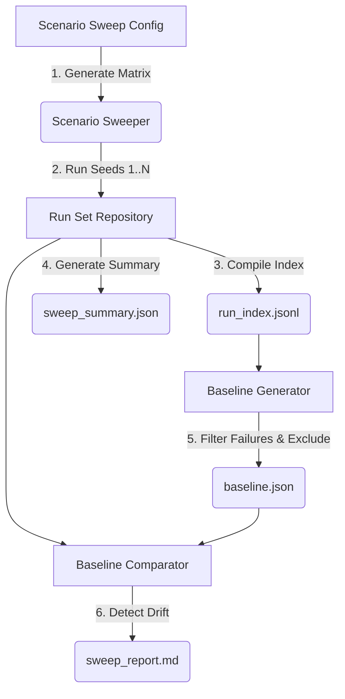

# Phase 4: Multi-Run Baseline and Balance Analysis

This document describes the architectural specifications, processing pipelines, and data layout introduced in **Phase 4: Multi-Run Baseline and Balance Analysis**. This phase expanded the single-run Observatory into a robust multi-run comparison engine, allowing developers to execute sweeps, compute statistical baselines, and detect metric drift across multiple seeds.

---

## 1. Architectural Overview

Phase 4 introduces multi-seed sweep execution and baseline generation. By comparing individual simulation runs against aggregated historical baselines, the system identifies anomalous seeds, metric drift, and regression signatures.



---

## 2. Standard Multi-Run Directory Layout

Multi-run sweep results are stored inside a dedicated run sets directory:

```text
data/run_sets/<sweep_id>/
  ├── run_set_manifest.json     # Sweep configuration parameters and run matrix map
  ├── run_index.jsonl           # Performance summary metrics per executed run
  ├── sweep_summary.json        # Unified aggregation (health avg, worst/best seed)
  ├── baseline.json             # Distribution-based thresholds generated from accepted runs
  ├── baseline_comparison.json  # Drift audit results comparing current sweep to active baseline
  └── sweep_report.md           # Premium-grade developer sweep diagnostic dashboard
```

---

## 3. Core Subsystems

### 3.1 Scenario Sweeper (`ScenarioSweeper`)
Located in `src/observability/sweeper.py`, the sweeper is responsible for:
*   Parsing Pydantic-validated `ScenarioSweepConfig` (defining seeds, tick limits, observability modes, and concurrency locks).
*   Sequentially spawning scenarios under isolated config overrides, shielding random number generator (RNG) states from cross-run contamination.
*   Writing a structured `RunSetManifest` linking all executed `run_id` references to their seed indices.

### 3.2 Run Set Repository (`RunSetArtifactRepository`)
Located in `src/observability/reporting/run_set_repository.py`:
*   Aggregates the individual runs into a single `run_index.jsonl` containing ticks completed, health score, critical counts, warning counts, and hard law violations.
*   Identifies the worst-performing seed (`worst_run_id`) and the best-performing seed (`best_run_id`).
*   Computes most common anomalies inside `sweep_summary.json` for rapid triage.

### 3.3 Baseline Generator (`BaselineGenerator`)
Located in `src/observability/reporting/baseline_generator.py`, this engine establishes statistical normality for a scenario:
*   **Eligible Run Selection**: Automatically excludes failed runs, runs with any hard law violations, or severely degraded runs (Health Score < 60.0). Allows manual includes/excludes.
*   **Statistical Distributions**: Computes deterministic summaries (`p10`, `p50`, `p90`, `p95`, mean, standard deviation) in pure Python.
*   **Weak Baseline Flags**: Accurately flags baselines constructed with < 5 accepted runs as `is_weak_baseline: true`, signifying lower statistical confidence.

### 3.4 Baseline Comparator & Drift Detector (`BaselineComparator`)
Located in `src/observability/reporting/baseline_comparator.py`, it compares a run set or single run against an active baseline:
*   Identifies when p95 tick latency degrades by more than 2.0x standard deviations.
*   Triggers drift warnings if the stuck entity ratio shifts significantly.
*   Generates a structured `sweep_report.md` showing distribution comparisons and flagging statistical anomalies.

---

## 4. Threshold Recommendations

The `baseline.json` outputs statistical threshold recommendations based on historical distributions:

$$\text{Critical Threshold} = \text{Mean} + 3.0 \times \text{StdDev}$$
$$\text{Warning Threshold} = \text{Mean} + 1.5 \times \text{StdDev}$$

This dynamic model replaces static hardcoded limits with scenario-specific bounds tailored to actual simulation behaviors.

---

## 5. Verification Command Checklist

Developers can run local tests to verify multi-run baseline processing:
```bash
# Run sweeper and matrix execution tests
pytest tests/unit/observability/test_scenario_sweeper.py
pytest tests/unit/observability/test_sweep_config.py

# Run baseline and drift detection tests
pytest tests/unit/observability/test_baseline_generator.py
pytest tests/unit/observability/test_baseline_comparator.py
```
