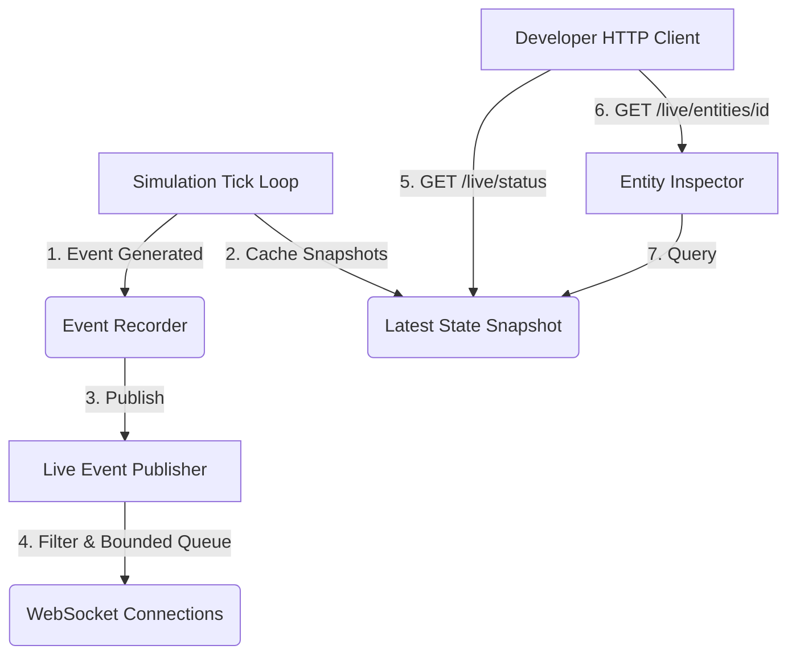

# Phase 5: Live Observatory and Developer Inspection

This document describes the architectural specifications, processing pipelines, and data layout introduced in **Phase 5: Live Observatory and Developer Inspection**. This phase added real-time inspection capabilities, enabling developers to monitor live simulations, inspect individual entities, and subscribe to streamed semantic events with zero lockouts or performance overhead in the hot tick path.

---

## 1. Architectural Overview

Phase 5 introduces a decoupled, thread-safe live inspection model. While the simulation tick loop executes, a separate API request thread reads from memory-efficient snapshots, bounded event publishers, and timelines, avoiding heavy locks or database queries.



---

## 2. Core REST Endpoints

The Live Observatory mounts the following endpoints under FastAPI:

*   `GET /api/v1/observability/live/status`: Exposes current simulation tick, governors, elapsed seconds, health state, and recent errors.
*   `GET /api/v1/observability/live/snapshot`: Returns high-level metrics, active event counts, tick speed (TPS), memory RSS, worker queue utilization, and phase breakdown costs.
*   `GET /api/v1/observability/live/entities/{entity_id}`: Yields a detailed, compact debugging summary for a single hero or entity.
*   `GET /api/v1/ws/observe`: WebSocket route for client-filtered real-time event streaming.

---

## 3. Core Subsystems

### 3.1 Live Snapshot Provider (`LiveSnapshotProvider`)
Located in `src/observability/live/snapshot_provider.py`:
*   Serves high-level platform status in $O(1)$ constant time.
*   Avoids scanning the active engine entity graph during HTTP requests, protecting simulation frame performance.
*   Ensures that an `IDLE` state returns clean default profiles rather than raising errors.

### 3.2 Focused Entity Inspector (`EntityInspector`)
Located in `src/observability/live/entity_inspector.py`:
*   Extracts compact, JSON-safe data (HP/max HP, gold, inventory slots, goals, actions, regional coordinates).
*   Tracks intent failure reasons (e.g., path blocks) and highlights active anomaly flags (`HIGH_OSCILLATION` for navigation loops, `HIGH_WAIT_COUNT` for crowding, and `HIGH_BOREDOM` for idle states).
*   Retrieves a bounded snippet of recent events from the `EntityTimelineStore` sorted in descending tick order.

### 3.3 Thread-Safe Local Publisher (`LiveEventPublisher`)
Located in `src/observability/live/event_publisher.py`:
*   Operates a local pub-sub broker. Delivery failures or slow client consumers are completely isolated, ensuring that live streams never block simulation tick steps.
*   Supports standard subscription filters (`event_type`, `event_category`, `severity_min`, `entity_id`, `region_id`, `quest_id`).
*   **Backpressure Policy**: Maintains a queue limit of 500. When full, older low-severity events (`DEBUG`, `INFO`) are evicted first to shield critical anomalies. If a client falls behind by more than 50 dropped events, the publisher auto-unregisters the slow consumer.

### 3.4 WebSocket Stream Router (`stream.py`)
Located in `src/api/ws/stream.py`:
*   Manages connection handshakes, heartbeats, and client pacing.
*   Supports live, in-flight filter updates sent by client messages without re-establishing connections.

---

## 4. Severity Filter Hierarchy

The subscriber's `severity_min` query resolves against the canonical log severity hierarchy:

$$\text{DEBUG} < \text{INFO} < \text{WARNING} < \text{ERROR} < \text{CRITICAL}$$

An event is dispatched to a connection only if its severity is equal to or greater than the client's configured `severity_min` threshold.

---

## 5. Verification Command Checklist

Developers can run local tests to verify real-time snapshot and streaming subsystems:
```bash
# Run snapshot provider and API route tests
pytest tests/unit/observability/test_live_snapshot_provider.py
pytest tests/api/test_live_observability_status.py

# Run entity inspector and timeline tests
pytest tests/unit/observability/test_entity_inspector.py
pytest tests/api/test_live_entity_inspection.py

# Run publisher and subscription filter tests
pytest tests/unit/observability/test_live_event_publisher.py
pytest tests/unit/observability/test_subscription_filter.py
```
