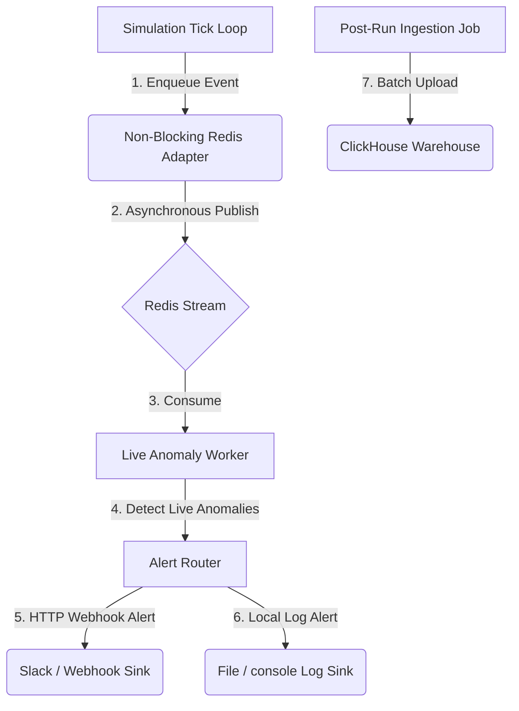

# Phase 7: Production-Grade Observatory Platform

This document describes the architectural specifications, processing pipelines, and data layout introduced in **Phase 7: Production-Grade Observatory Platform**. This phase introduced production-scale components (ClickHouse database warehouse, Redis Streams adapters, detached anomaly processing, webhook alert routing), turning the Observatory into an enterprise-ready laboratory analysis platform.

---

## 1. Architectural Overview

Phase 7 introduces complete decoupling at scale. The active simulation engine remains entirely local and lightweight, offloading events asynchronously to Redis Streams. Background workers process live anomalies, ingest historical runs to ClickHouse, and route high-severity alerts.



---

## 2. Core Production-Grade Subsystems

### 2.1 ClickHouse Event Warehouse Integration (`ClickHouseWarehouseAdapter`)
Located in `src/observability/warehouse/clickhouse.py`:
*   Implements the unified `WarehouseAdapter` interface supporting 6 query types: `worst-runs`, `anomaly-summary`, `entity-events`, `run-metric-trend`, `hard-law-violations`, and `events-by-tick-range`.
*   **Resiliency**: Dynamically imports `clickhouse-driver`. If missing, ClickHouse falls back to skipped states rather than crashing the engine start.
*   **Idempotency Checksums**: Enforces stable run imports:
    *   `Same run_id + same checksum` $\rightarrow$ Skip ingestion (already loaded).
    *   `Same run_id + different checksum` $\rightarrow$ Reject ingestion to prevent double-writes, unless `force=True` is provided.
*   **Batch Ingestion**: Buffers record writes based on `SIM_WAREHOUSE_CLICKHOUSE_BATCH_SIZE` (default 1000).

### 2.2 Redis Stream Adapter (`RedisStreamAdapter`)
Located in `src/observability/stream/adapters.py`:
*   **Non-Blocking Daemon Thread**: Spawns a background thread (`RedisStreamPublisherWorker`) draining a thread-safe double-ended queue (`collections.deque`). The simulation's `publish()` call returns immediately without executing network calls.
*   **Backpressure Policy**:
    *   If the publish queue is full, low-severity events (`DEBUG`, `INFO`) are silently dropped.
    *   For high-severity events (`WARNING`, `ERROR`, `CRITICAL`), the worker evicts the oldest low-severity record in the queue to write the alert.
    *   If no evictions are possible, high-severity alerts are dropped and `backpressure_active` is flagged.
*   **resiliency & Health Checks**: Re-establishes socket connections automatically on network failure. Exposes thread health statistics (`queue_size`, `backpressure_active`, `last_success_at`, `last_publish_error`).

### 2.3 Live Anomaly Worker Service (`LiveAnomalyWorker`)
Located in `src/observability/anomaly/worker.py`:
*   Operates in a separate process/thread, consuming events directly from Redis Streams.
*   Runs parallel invariant checks outside the engine tick sequence, preventing processing spikes from delaying simulation frames.

### 2.4 Alert Routing & Webhook Sinks (`AlertRouter`)
Located in `src/observability/alerts/router.py`:
*   **Deduplication**: Suppresses repeating alerts using a sliding time window to prevent "alert storms".
*   **Multi-Sink Routing**: Dispatches high-severity violations to both console logs (`LogAlertSink`) and external HTTP endpoints (`WebhookAlertSink`).

---

## 3. CLI Access Layer

Production operators can manage ClickHouse database tables and runs via CLI:

```bash
# Initialize ClickHouse database and logical tables
rpg-observe warehouse init

# Ingest single completed run to ClickHouse
rpg-observe warehouse ingest-run <run_id>

# Ingest full sweep set to ClickHouse
rpg-observe warehouse ingest-sweep <sweep_id>

# Run predefined historical ClickHouse analytics
rpg-observe warehouse query worst-runs
rpg-observe warehouse query entity-events --entity-id <id>
```

---

## 4. Verification Command Checklist

Developers can run local unit tests for ClickHouse mappings, Redis publishers, and Alert Routers:
```bash
# Run Redis Stream publisher tests (includes backpressure and daemon thread safety)
pytest tests/unit/observability/test_redis_stream_adapter.py
pytest tests/unit/observability/test_event_stream_adapters.py

# Run ClickHouse logical schema mapping tests
pytest tests/unit/observability/test_clickhouse_record_mapping.py

# Run Alert Router and Deduplicator tests
pytest tests/unit/observability/test_alert_router.py
```
