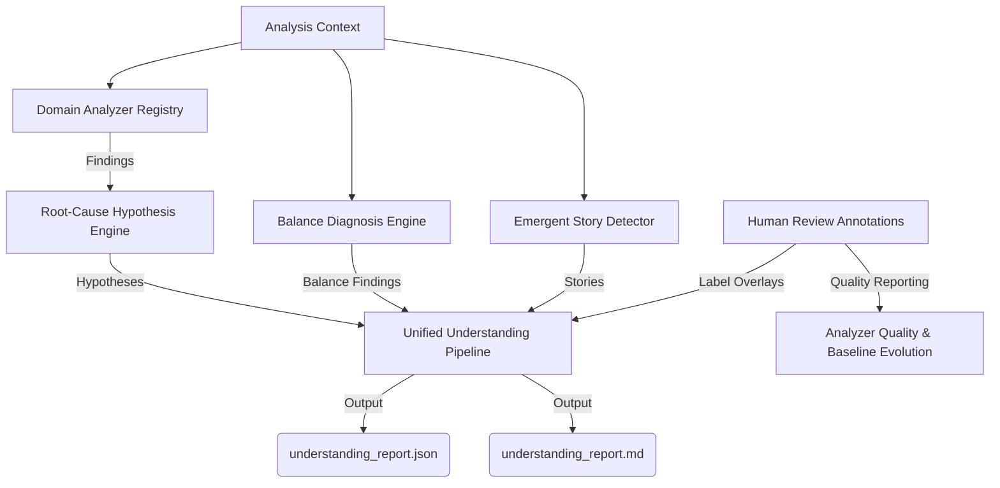

# Phase 8: Advanced Simulation Understanding Framework

This document describes the architectural specifications, post-run processing pipelines, and data layout introduced in **Phase 8: Advanced Simulation Understanding**. This framework transitions the V2 RPG Engine from simple anomaly alert detection into a proactive diagnostic system, providing behavioral interpretation, balance audits, narrative extraction, and developer investigation checklists.

---

## 1. Architectural Overview

The Phase 8 Simulation Understanding framework is executed entirely **post-run**. It aggregates time-series metrics, raw events, and anomalies into a shared `AnalysisContext`, executing seven specialized diagnostic engines to produce a comprehensive post-run understanding report.



---

## 2. Standard Output Artifacts

Upon pipeline execution, the post-run engine writes the following artifacts inside the run directory (`data/runs/<run_id>/`):

*   `understanding_report.json`: Machine-readable diagnostic payload holding expectations, findings, hypotheses, balance summaries, and detected stories.
*   `understanding_report.md`: Premium developer-facing diagnostic dashboard.
*   `finding_reviews.jsonl`: Local human reviews mapping findings to confirmed bug/false-positive labels.

---

## 3. Core Subsystems

### 3.1 Domain Analyzer Framework
Located in `src/observability/understanding/domain/base.py`:
*   Base `DomainAnalyzer` class mapping required/optional event signals.
*   **Registry**: Runs registered analyzers in sorted order, capturing per-analyzer execution runtimes and isolating code exceptions safely.
*   **Four Subsystem Analyzers**:
    *   `MovementDomainAnalyzer`: Pinpoints static coordinates of stuck worker crowds and movement oscillations.
    *   `EconomyDomainAnalyzer`: Monitors resource harvest locks and stagnant gold circulations.
    *   `QuestDomainAnalyzer`: Audits stalling quest progression rates and impossible parameters.
    *   `RuntimeDomainAnalyzer`: Logs excessive frame pressure and event drop occurrences.

### 3.2 Scenario Expectation Packs
Located in `src/observability/understanding/expectations/`:
*   Provides scenario-aware diagnostic thresholds (`resource_economy`, `combat_heavy`, `mixed_sandbox`, `peaceful_village`) loaded from Pydantic-validated JSON arrays.
*   Enables the same metric behavior to have different severities (e.g., zero combat is normal in `peaceful_village` but represents a hard failure in `combat_heavy`).

### 3.3 Root-Cause Hypothesis Engine
Located in `src/observability/understanding/rootcause/`:
*   Evaluates active findings against six heuristic inference rules:
    1.  `StaleResourceTargetSelection`: Workers choosing depleted resource nodes due to missing invalidations.
    2.  `MovementBottleneckOrOccupancyCrowding`: Coordinate traffic bottlenecks.
    3.  `InventoryFullReturnLoopBroken`: Blocked harvest loop because store returns are impossible.
    4.  `QuestObjectiveImpossible`: Missing item drops or mob spawns causing quest stalls.
    5.  `GovernorPressureFromObservabilityOrWorkDebt`: Real-time thread lag.
    6.  `CombatEngagementCannotResolve`: Faction combat locks without termination.
*   **Confidence Ranking**: Generates discrete confidence scores (`LOW`, `MEDIUM`, `HIGH`) and provides checklist instructions.

### 3.4 Balance Diagnosis Engine
Located in `src/observability/understanding/balance/`:
*   Audits scenario design quality across four distinct dimensions:
    *   `ACTIVITY`: Validates that required behaviors are actively occurring.
    *   `LIVENESS`: Confirms that started actions successfully resolve.
    *   `DOMINANCE`: Flags disproportionate faction or strategic superiority.
    *   `RUNTIME_STABILITY`: Verifies system performance consistency.

### 3.5 Emergent Story Detector
Located in `src/observability/understanding/stories/`:
*   Extracts narrative structures from events without penalizing run health.
*   Match algorithms detect five primary patterns:
    *   `UnexpectedSurvivor`: Weak actors surviving high-lethality engagements.
    *   `ResourceCrisis`: Deep, sudden regional resource shortages.
    *   `QuestHero`: Rapid, highly-efficient individual quest progressions.
    *   `FactionComeback`: Factions recovering from near-extinction states.
    *   `RegionPowerShift`: Complete territorial or regional resource dominance shifts.

### 3.6 Human Review Workflow (`ReviewStore`)
Located in `src/observability/understanding/review/`:
*   Allows developers to annotate findings with standard review labels (`CONFIRMED_BUG`, `FALSE_POSITIVE`, `BALANCE_ISSUE`, `EXPECTED_BEHAVIOR`).
*   Overlays these labels onto future report generation, allowing operators to suppress known non-critical notifications.

### 3.7 Quality & Evolution Policy
Located in `src/observability/understanding/quality/`:
*   `AnalyzerQualityReporter`: Calculates rule precision and signal-to-noise ratios.
*   `BaselineEvolutionPolicy`: Manages baseline life cycles, transitioning baselines from `CANDIDATE` to `ACTIVE` or `DEPRECATED`.
*   `StaleBaselineDetector`: Warns on schema or version incompatibilities.

---

## 4. Verification Command Checklist

Developers can run unit and integration tests for the Advanced Simulation Understanding subsystems:
```bash
# Run Domain Analyzer and expectations tests
pytest tests/unit/observability/test_domain_analyzer_registry.py
pytest tests/unit/observability/test_expectation_pack_loader.py

# Run Root-Cause and Balance Engine tests
pytest tests/unit/observability/test_root_cause_engine.py
pytest tests/unit/observability/test_balance_diagnosis_engine.py

# Run Story, Human Review, and Quality Evolution tests
pytest tests/unit/observability/test_phase8_m46_m47_m48.py
```
