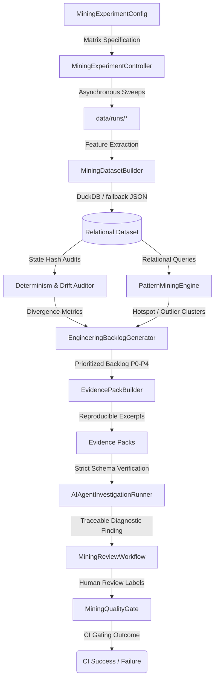

# Phase 9: Simulation Mining & AI-Assisted Investigation

This document describes the architectural specifications, processing pipelines, and queryable schemas introduced in **Phase 9: Simulation Mining and AI-Assisted Investigation**. This framework extends the V2 RPG Engine's Observability platform to support large-scale post-run experiment orchestration, relational data mining, determinism audits, self-contained evidence packaging, and evidence-grounded AI diagnostic sweeps.

---

## 1. Architectural Overview

The Phase 9 Simulation Mining platform operates strictly **post-run/offline**, ensuring zero compute overhead or interference inside the active tick loop. It leverages historical simulation runs and matrix parameters to build a unified relational dataset (DuckDB and JSON), executes quality/drift auditors, ranks anomalies into an engineering backlog, and leverages AI diagnostic orchestrators to resolve root-cause failures.



---

## 2. Standard Output Artifacts

All experiment metadata, datasets, mined reports, backlogs, and evidence files reside under the target experiment directory:
`data/mining_experiments/<experiment_id>/`

*   `experiment_manifest.json`: Holds metadata about configuration boundaries and associated execution run IDs.
*   `run_matrix.jsonl`: Maps each run to its corresponding scenario type, seed, and repeat index parameters.
*   `dataset/`: Contains relational database tables:
    *   `runs.parquet` / `runs.json`: Primary index of all runs, repeat indices, and health scores.
    *   `run_features.parquet` / `run_features.json`: Broad features (dropped events, law violation counts, worst-tick ranges).
    *   `anomalies.parquet` / `anomalies.json`: Granular anomaly rows containing domains, severities, and error messages.
    *   `hard_law_violations.parquet` / `hard_law_violations.json`: Audit log of all hard law violations.
    *   `dataset_manifest.json`: Holds dataset table formats and row counts.
*   `pattern_mining_report.md`: Cross-run pattern mining report highlighting outlier runs, anomaly rankings, temporal patterns, and hotspots.
*   `engineering_backlog.md`: Categorized developer backlog (P0 to P4) prioritising critical drift and law violations.
*   `evidence_packs/<candidate_id>/`: Fully isolated workspace containing excerpted metric windows and reproduction shell commands.
*   `evidence_packs/<candidate_id>/agent_findings.json`: Machine-readable AI diagnostic findings.
*   `evidence_packs/<candidate_id>/agent_investigation_report.md`: Premium developer diagnostic report detailing suspected subsystems.
*   `next_experiment_report.md`: Recommends future sweep dimensions and telemetry instrumentation spans.

---

## 3. Core Subsystems

### 3.1 Sweep Orchestrator
Located in `src/observability/mining/controller.py`:
*   **`MiningExperimentConfig`**: Configures scenarios, seed lists, repetitions, execution pool sizes, and storage root folders.
*   **`MiningRunMatrixBuilder`**: Generates deterministic grids mapping parameters to unique run IDs.
*   **`MiningExperimentController`**: Orchestrates matrix runs asynchronously in parallel pools with isolated folders and failure handling.

### 3.2 Relational Dataset Builder
Located in `src/observability/mining/dataset.py`:
*   **`RunFeatureExtractor`**: Extracts run-level health scores, dropped event rates, law violations, and worst 100-tick density ranges.
*   **`MiningDatasetBuilder`**: Compiles runs, features, anomalies, and law violations tables. Optionally writes compressed Parquet using `pandas` and `pyarrow`.
*   **`DatasetQueryService`**: Broker supporting DuckDB SQL queries with a high-fidelity pure-Python fallback JSON query router (implements 100% relational parity for custom SQL filters).

### 3.3 State-Drift & Determinism Auditor
Located in `src/observability/mining/auditor.py`:
*   **`DataCompletenessAuditor`**: Audits runs for trace leaks, truncated outputs, and schema misalignment.
*   **`DeterminismAuditor`**: Automatically correlates execution runs of identical seeds to isolate state divergence via event sequence signatures and terminal state hash comparisons.

### 3.4 Pattern Mining Engine
Located in `src/observability/mining/patterns.py`:
*   Runs automated analytical SQL sweeps to mine outlier seeds, recurring anomaly domain groupings, temporal failure windows, and message hotspots.

### 3.5 Engineering Backlog Prioritization
Located in `src/observability/mining/priority.py`:
*   **`PriorityScorer`**: Dynamically scores candidates across execution status, determinism drift, and anomaly weight factors.
*   **`EngineeringBacklogGenerator`**: Generates ranked developer-ready markdown catalogs from P0 to P4.

### 3.6 Self-Contained Evidence Packs
Located in `src/observability/mining/evidence.py`:
*   **`EvidencePackBuilder`**: Compiles lightweight evidence folders containing the target run manifest, worst-tick metric excerpt window, full anomalies list, and a ready-to-run reproduction terminal command.

### 3.7 AI-Assisted Investigation Orchestrator
Located in `src/observability/mining/orchestrator.py`:
*   **`AIAgentInvestigationRunner`**: Conducts structured LLM-driven sweeps to generate reproducible root-cause diagnoses, suspect subsystems, and reproduction templates.
*   **`AgentOutputValidator`**: Enforces strict schema validations and evidence traceability requirements (finding fails if not grounded in empirical trace keys).

### 3.8 Sweep Recommendation Engine
Located in `src/observability/mining/recommender.py`:
*   **`NextExperimentRecommender`**: Detects instrumentation gaps and compiles future parameter sweeps based on mined outlier patterns.

### 3.9 Human-in-the-Loop Gating
Located in `src/observability/mining/workflow.py`:
*   **`MiningReviewWorkflow`**: Provides human labels (Confirmed, Triaged, Postponed) and custom feedback mappings.
*   **`MiningQualityGate`**: Automatically gates CI pipeline outcome on high-severity drift alerts (`CONFIRMED_NONDETERMINISM`).

---

## 4. Verification Command Checklist

Developers can run unit and integration tests for the Phase 9 Simulation Mining subsystems:
```bash
# Run the complete Phase 9 unit testing suite
pytest tests/unit/observability/test_phase9_mining.py -v

# Run the broad V2 observability unit test suite to ensure zero regressions
pytest tests/unit/observability/ -v
```
