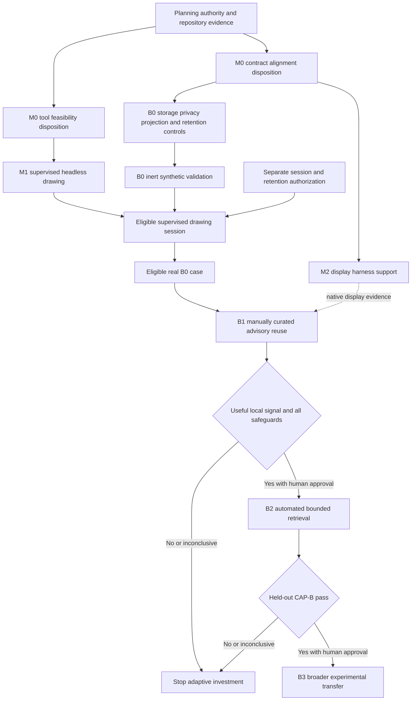

# Aseprite Agent-Controlled Pixel-Art — Draft Milestone Plan Package

## Status and decision boundary

This package translates the P2
[Aseprite MCP workflow proposal](../../brainstorm/render-and-art/aseprite_mcp_pixel_art_workflow_proposal.md)
into reviewable milestone scopes. The proposal and external AI reviews are inputs, not repository truth.
This package is a **draft for human review only**. It does not authorize implementation, dependency
installation, Aseprite acquisition or execution, MCP registration, a pilot, asset creation, production-art
promotion, or a change to the proposal's NO-GO status.

The intended decision structure is:

- `CAP-A` proves supervised agent-controlled drawing independently of adaptive memory;
- display-harness support is a separate integration capability and may proceed without MCP;
- Stage B0 records evidence without retrieving it into agent context;
- Stage B1 tests a small manually curated advisory memory against no-memory control;
- automated retrieval is conditional on useful B1 signal and is not on the committed path;
- no milestone establishes production readiness or freezes art direction.

## Repository facts checked

| Area | Current repository fact | Planning consequence |
|---|---|---|
| Authority | `AGENTS.md` requires all simulation durable-state mutation through the 39-phase authoritative pipeline | This tooling may consume fixtures and create isolated art evidence; it never mutates `AuthoritativeState` or bypasses server authority |
| Frontend renderer | `frontend/src/constants/colors.ts` defines `CELL_SIZE = 16`; `GameCanvas.tsx` and `useCanvas.ts` use the current Canvas path | Candidate art must be evaluated in the 16-pixel-cell context; Canvas remains unchanged and available |
| Browser tests | `frontend/e2e/live_map.spec.ts` takes one screenshot; Playwright config targets headless Chromium only | The current screenshot is not the required candidate-comparison harness; cross-browser support is UNVERIFIED |
| Art planning | Plan 07 defines `ART-W01`–`ART-W07`, native-scale review, exact stress identities, and human result recording | This epic reuses those experiments and does not replace their authority or freeze outputs |
| Python dependencies | `requirements.txt` pins `mcp==1.28.1`; `pyproject.toml` has a broader `search-mcp` extra; Python requirement is at least 3.11 | Any future adapter dependency decision must reconcile the two declarations and use the repository lock/update process |
| Frontend dependencies | `frontend/package-lock.json` exists; React/Vite/Vitest/Playwright are declared in `frontend/package.json` | Display-harness changes use the existing npm lock and test lanes; no new renderer dependency is implied |
| CI/platform | Current CI jobs use `ubuntu-latest`; repository README requires Python 3.11+, Node 18+, and optionally Docker | Ubuntu CI is evidence of CI coverage, not a supported Aseprite host declaration |
| Aseprite integration | No Aseprite binary, adapter, MCP registration, dependency, or dedicated test harness is present in the inspected repository | All executable capability and host-platform claims remain UNVERIFIED and gated |
| Related epics | Live Map/Surface plans own renderer seams, browser validation, and native triggers; Knowledge Gateway MCP provides local schema/redaction/cache precedents | Reuse governance lessons and existing owners; do not duplicate renderer migration or assume the knowledge gateway is safe for art memory |

## Milestone map

| Order | Plan | Capability | Current scheduling state |
|---:|---|---|---|
| 0 | [Authority, contracts, and preflight](00_authority_contracts_and_preflight_plan.md) | Decision/evidence baseline | Draft committed path; documentation and source review only |
| 1 | [Supervised headless drawing](01_supervised_headless_drawing_plan.md) | Core `CAP-A01`–`CAP-A08` and `CAP-A11` **(2026-09-13, added by review)**; optional `CAP-A10` after static proof | Blocked from execution pending M0 and separate human authorization |
| 2 | [Display-harness support](02_display_harness_support_plan.md) | `CAP-A09`, `ART-W04`, `ART-W05` | Parallel planning; implementation owned with renderer plans |
| 3 | [B0 evidence foundation](03_b0_evidence_recording_plan.md) | Synthetic control validation, then separately authorized eligible recording; foundation for `CAP-B01`, `CAP-B06`, `CAP-B09` | Controls may be planned independently; real cases are separately gated; no retrieval into agent context |
| 4 | [B1 manually curated advisory reuse](04_b1_manual_advisory_reuse_plan.md) | `CAP-B05-L` and preliminary `CAP-B02`–`CAP-B04`, `CAP-B08` | Conditional on valid B0 plus supervised candidate evidence |
| 5 | [B2 automated bounded retrieval](05_b2_automated_retrieval_plan.md) | Full retrieval and held-out `CAP-B01`–`CAP-B09` | Dormant until B1 useful-signal decision |
| 6 | [B3 broader experimental transfer](06_b3_broader_transfer_plan.md) | Scope-transfer evidence beyond one experiment family | Dormant and optional; never production adoption |

The two M0 dispositions are recorded by the same plan but have separate outcomes: tool-feasibility failure
does not invalidate already approved evidence, archive, privacy, visual-test, or bounded-import contracts.
M1 must remain deliverable if every B milestone is stopped. M2 may use current, synthetic, or approved
manual fixtures and must not depend on M1. B0 may validate evidence schemas using inert fixtures; a real
case may enter only after B0 controls pass and a separately authorized supervised agent session and
retention scope exist. Manual-art records remain outside CAP-B unless its owner explicitly amends producer
class, corpus separation, scope matching, and baseline-leakage controls. B1 is the cheapest causal signal
test. B2 and B3 are deliberately absent from the mandatory delivery path.

## Shared milestone contract

Every milestone file defines prerequisites, deliverables, non-goals, authorization boundary, covered
capability gates, objective exit criteria, evidence, security checks, rollback, dependencies, and stop
conditions. A future implementation ticket may take one work-package handle or a smaller vertical slice
only after the normal Scope, Investigate, Plan, Review, Implement, Test, and Finalize workflow. These plan
handles are not tickets.

Shared result states are:

| State | Meaning |
|---|---|
| `PASS` | Every predeclared mandatory condition passed with retained evidence |
| `FAIL` | A valid run violated a mandatory condition |
| `BLOCKED` | A named prerequisite or authorization was unavailable, so work did not run |
| `INCONCLUSIVE` | Work ran, but evidence was invalid, insufficient, contaminated, or materially ambiguous |

No missing result defaults to pass. Thresholds, platforms, fixtures, budgets, and allowed conclusions are
approved before execution; they are not repaired after results are visible.

## Shared authorization and security rules

- Documentation and read-only source review are the only currently authorized activities.
- Installation, build, registration, execution, GUI control, external scoring, network access, and creation
  of experiment artifacts each require later explicit scope and authorization.
- The future adapter accepts typed bounded operations and fixed hash-verified templates only. It rejects
  caller-supplied code, shell, paths, URLs, remote assets, plugins, and undeclared tools.
- Candidate work uses an OS-confined disposable workspace outside repository and production asset trees.
  The exact mechanism and host are UNVERIFIED and must be resolved at M0.
- Existing sources are copy-on-write inputs; validated outputs publish as immutable revisions. Canvas and
  the existing game remain rollback paths.
- Raw feedback, tool calls, errors, paths, manifests, filenames, and imported metadata never enter agent
  context. Only versioned typed safe projections may be retrieved.
- Agents and the Aseprite adapter possess no credential or tool capable of activating guidance. Human
  approval binds an exact validated rule hash, version, and scope.
- External scores remain hidden until the initial human review and cannot promote guidance or break ties.
- Logs and retained evidence are bounded and redacted. Retention, quarantine, revocation, and deletion are
  proven before real review data is retained.
- No client-side or tooling action may mutate simulation authoritative state.

## Cross-plan ownership

| Concern | Primary planning owner | This package's relationship |
|---|---|---|
| Manual art identities and experiment sequence | `render-and-art/07_manual_art_experiment_execution_plan.md` | Reuse exact fixtures and human criteria; do not redefine them |
| Browser renderer and Canvas rollback | Live Map rendering/surface integration plans | M2 contributes a candidate import/capture seam only |
| Final art choices | Human art/product review | Never delegated to gates, scores, or tooling |
| MCP adapter safety | M0/M1 future tickets | Knowledge Gateway MCP is precedent only, not reusable authorization |
| Evidence memory | B0–B3 | Separate from engine state, production assets, and repository truth stores |

## UNVERIFIED decision register

| ID | Missing fact or decision | Resolution task | Blocks |
|---|---|---|---|
| `U-01` | Supported Aseprite host OS/filesystem and whether GUI access is needed | Name one isolated pilot platform and confinement mechanism; document filesystem publication semantics | M1 execution |
| `U-02` | Aseprite acquisition, license, binary provenance, version, and scripting API compatibility | Legal/security/source review and exact version manifest; do not download during planning | M1 execution |
| `U-03` | Minimal adapter option and language | Compare project-owned stdio MCP, reduced pinned fork, and non-MCP script under one rubric | M1 implementation choice |
| `U-04` | Dependency declaration and lock update route | Reconcile `requirements.txt`, `pyproject.toml`, `uv.lock`, and packaging/CI ownership | Any dependency change |
| `U-05` | Numeric request, size, latency, storage, and retention budgets | Owners preregister bounded values and rationale | M1/B0 execution |
| `U-06` | OS isolation available in developer and CI environments | Prove deny-by-default filesystem/network/process behavior or select a different platform | M1 execution |
| `U-07` | Display comparison harness owner, browser matrix, and artifact location | Route through existing renderer plans and approve a charter | M2 implementation |
| `U-08` | Human reviewer/curator roles and availability | Name role holders and separation/recording expectations | B1 onward |
| `U-09` | Model/provider provenance fields, stochastic controls, and data policy | Probe the selected agent platform without exposing project data | B1 causal claims |
| `U-10` | External scorer candidates and validity | Define only after a human rubric; allow “none” | B1 score-visible follow-up, not blind human review |
| `U-11` | Safe-projection and guidance schema implementation | Design and adversarially review minimal typed schemas | B0/B1 |
| `U-12` | Sufficient sample and minimum practical effect for `CAP-B05-L` and `CAP-B05` | Human preregistration based on affordable session capacity | B1/B2 decisions |
| `U-13` | Storage technology, access control, deletion, and cryptographic-erasure capability | Compare simple local files/SQLite before any service | B0 real-data retention |
| `U-14` | Whether current CI can legally and technically run real Aseprite | Licensing/platform/runner investigation | Automated M1 real-editor evidence; local evidence may still be considered separately |

## Decisions deliberately unfrozen

- final sprite and icon resolution;
- final palette, ramps, and art style;
- status/effect and full skill rosters;
- Place representation and footprint;
- faction-emblem breadth;
- animation frame count, timing, and scope;
- production renderer, asset loader, atlas, manifest, storage, and pipeline;
- final adaptive schema, retriever, embedding approach, scorer, and retention technology.

## Package-level stop conditions

Stop the affected path when authorization is absent, source or license review fails, isolation cannot be
proven, mandatory evidence cannot be retained safely, a rollback route is missing, or a gate fails. Stop
adaptive work after B1 on `FAIL` or `INCONCLUSIVE` unless a human approves one bounded rerun for a named
evidence defect. Do not respond to weak adaptive signal by automatically adding embeddings, a vector
database, more models, or broader memory.

## Sources

- [Aseprite MCP workflow proposal](../../brainstorm/render-and-art/aseprite_mcp_pixel_art_workflow_proposal.md)
- [Manual art experiment plan](../render-and-art/07_manual_art_experiment_execution_plan.md)
- [Live Map/Surface plan package](../render-and-art/README.md)
- [Live Map/Surface milestone plan](../live_map_rendering_and_surface_integration_milestone_plan.md)
- [Knowledge Gateway MCP proposal](../knowledge-gateway-mcp-proposal.md)
- [Repository working-environment guidance](../../guidelines/agent_working_environment.md)
- [Authoritative mutation pipeline](../../engine/authoritative_pipeline.md)
