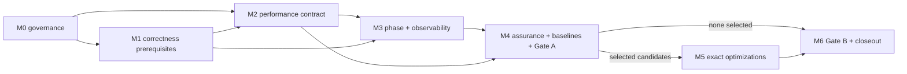

# Roadmap — Performance Optimization Design Enhancement

Date: 2026-09-09

## Purpose and planning boundary

This folder decomposes the performance-optimization proposal into milestone-sized epic plans.
Each milestone contains multiple candidate tickets that deliver one related capability group.
This is planning only: no ticket files, tracking tickets, runtime changes, approvals, or P1
supersession are created by this pass.

Candidate IDs such as `PERF-M2-T03` are planning handles, not real `TCK-*` IDs. A later
`create-tickets` invocation must re-investigate live code, check existing-ticket overlap, and
assign real ticket IDs only after the milestone entry gate is satisfied.

## Source and authority

The milestone set refines these P2 sources:

- `docs/brainstorm/codex/system-design/performance_optimization_architecture_proposal.md`;
- `docs/plans/design_enhancement/performance_optimization/performance_optimization_prerequisite_execution_plan.md`;
- `docs/plans/design_enhancement/performance_optimization/performance_optimization_conflict_approval_review.md`;
- `docs/plans/design_enhancement/performance_optimization/system_design_terms_and_concepts.md`.

It does not override:

- `AGENTS.md` or the Singular Bottleneck Law;
- P0 Mechanics Bible rules;
- P1 engine, determinism, certification, or performance contracts;
- `docs/plans/design_enhancement/design_enhancement_roadmap.md`;
- `docs/plans/design_enhancement/performance_milestones_epic.md`.

The older P1 roadmap and performance epic conflict with parts of the refined proposal. M0 must
resolve their status and surviving scope before any behavior-changing milestone proceeds.

## Stable structure across every milestone

Performance work may change representations, derived indexes, scheduling efficiency, execution
backend, and serving policy only within an approved contract. It does not change the following
spine:

1. Kernel is the sole owner of `AuthoritativeState`.
2. Workers receive read-only state and return proposals/`WorkerResult` values.
3. RESOLUTION remains the authoritative merge/refinement boundary.
4. Every durable change is a `StateUpdate` refined through the authoritative pipeline.
5. Derived performance structures remain rebuildable and never become a second mutable truth.
6. Operational worker order may vary; semantic ordering may not depend on completion timing.
7. New RPG phases/features declare state ownership, read/write domains, ordering, cadence/LOD,
   invariants, observability, and performance budgets instead of forcing a fixed phase count.
8. Semantic approximation, distributed writers, client prediction, and concurrent RESOLUTION are
   outside exact-optimization scope and require separate architecture approval.
9. Every promoted optimization remains covered by a change-aware regression control loop; a faster
   result is invalid when correctness, determinism, Arena behavior, or Simulation Quality regresses.

## Milestone map

| Milestone | Capability group | Candidate tickets | Entry gate | Exit |
|---|---|---:|---|---|
| [M0 — Architecture governance](performance_m0_architecture_governance_epic.md) | Durable sources, owners, PERF-D1..D6, P1 reconciliation | 9 | Planning sources available | Approved decisions or explicit blocked dispositions; one discoverable program authority |
| [M1 — Correctness prerequisites](performance_m1_correctness_prerequisites_epic.md) | Capacity/debt/hash corrections and ordering verification | 5 | Relevant PERF decisions plus M0 reconciliation | Corrected contracts/tests and baseline invalidation decisions |
| [M2 — Performance contract](performance_m2_performance_contract_epic.md) | One claim model and executable CI/scheduled projections | 6 | PERF-D2/D4 and affected M1 identities | Versioned authoritative contract with no silent missing-evidence pass |
| [M3 — Phase and observability foundation](performance_m3_phase_observability_foundation_epic.md) | Phase catalog, scheduling funnel, bounded instrumentation | 7 | PERF-D1/D6, M2 metric identity, PA-05A evidence | Catalog conformance and bounded observer overhead |
| [M4 — Continuous assurance, baselines, and Gate A](performance_m4_baseline_gate_a_epic.md) | Change-aware test routing, E2E/Arena/SimQ gates, audit evidence, baseline matrix, bottleneck decision | 12 | M1–M3 stable | Trustworthy regression-control loop, valid scenario dispositions, and approved Gate A report |
| [M5 — Exact optimization delivery](performance_m5_exact_optimization_delivery_epic.md) | Only Gate-A-selected semantics-preserving accelerators | 8 conditional families | Gate A selects each family | Per-family parity, bounds, rollout, and promotion/rejection |
| [M6 — Gate B and future architecture](performance_m6_gate_b_future_architecture_epic.md) | Assurance/matrix rerun, retirement, persistent guardrail ownership, Gate B, optional separate proposal | 6 | M5 selected work closed, or Gate A selected none | Exact-program closeout, owned regression controls, and explicit future-architecture disposition |

Dependencies are capability gates, not blanket serial execution. Tickets within a milestone may
run in parallel when their detail plan says so and their files/authority surfaces do not overlap.

## Program-wide ticket contract

Every eventual child ticket must include:

- the milestone candidate ID and real `TCK-*` ID;
- exact entry dependency and evidence artifact;
- affected authoritative state families and read/write domains;
- whether semantics are unchanged, corrected from a defect, or intentionally changed;
- reference path and oracle;
- benchmark identity, work cardinality, runtime mode, and observer level;
- change-impact classification and the required fast, E2E, Arena, SimQ, and scheduled lanes;
- deterministic ordering and RNG consequences;
- memory/retention bound;
- rollout, rollback, and retirement rule;
- durable audit-document path and links to machine-readable before/after evidence;
- documentation, parity-ledger, and generated-file updates;
- explicit exclusions preventing adjacent milestone scope from leaking in.

One ticket should remain independently reviewable and reversible. Shared-file overlap is a merge
coordination issue unless one change genuinely consumes another's output.

## Continuous performance-assurance model

Performance regression control is a tiered feedback system, not one large benchmark suite:

| Tier | Trigger | Purpose | Required outcome |
|---|---|---|---|
| Local/PR-fast | Every relevant change | Static/unit/property checks plus deterministic performance tripwires | Blocking PASS, or explicit INCONCLUSIVE/REGRESSION; missing evidence is not PASS |
| PR-targeted | Conservative impact map selects affected domains | Checkpoint/replay E2E, representative Arena slices, targeted SimQ worlds/pillars | PASS is merge-blocking once calibrated; before calibration it cannot satisfy a promotion gate and needs an approved substitute oracle |
| Main/nightly | Merge to main, schedule, or manual confirmation | Full performance matrix, slow Arena/5k behavior, full/slow SimQ audit | Detect cross-domain and long-horizon drift; create an owned incident/ticket for unexplained regression |
| Release/Gate | Candidate promotion, Gate A, Gate B, or baseline update | Controlled repeated capacity and quality comparison | Named-owner approval backed by compatible evidence and audit document |

The fast lane is a tripwire, not a capacity claim. Noisy or expensive measurements use a second
controlled confirmation stage. Where shared-runner noise makes a historical comparison unreliable,
the confirmation should compare base and candidate revisions on the same runner and record both
absolute and relative deltas. Retry policy, sample counts, variance limits, and thresholds are
predeclared; rerunning until green or silently refreshing a baseline is forbidden.

The impact contract assigns every lane to an explicit boundary: merge, candidate activation/default
ON, baseline or anchor update, reference retirement, release, or capacity claim. A required PR-fast
or calibrated PR-targeted lane must return `PASS` before merge; `REGRESSION` and `INCONCLUSIVE`
block it. Heavy checks may complete after a default-OFF implementation merges only when the contract
assigns them to activation/release, but they must pass before that boundary. A default-ON behavior
change cannot use this deferral.

Every affected change produces a machine-readable evidence bundle and a durable summary under
`docs/audits/performance/` (exact schema/path requires M4 owner approval). The summary links the
ticket/change, impact decision, identities, tests, E2E/Arena/SimQ results, before/after performance,
known exceptions, disposition, and rollback state. `docs/optimization_audit_ledger.md` remains the
discoverable index unless its P1 owner approves a replacement.

Known historical drift is partitioned into an owner-and-expiry ledger. An active quarantine is not
`PASS` and never authorizes candidate activation, baseline/anchor update, retirement, release, or a
capacity claim. It may permit an unrelated merge only when the impact contract excludes the debt or
a paired candidate/base comparison proves no new or worsened delta and the exception owner approves
it before expiry. The target state is blocking gates after debt is classified and the lane proves
stable.

## Cross-plan conflicts requiring M0 disposition

| Existing source | Conflict | Safe handling |
|---|---|---|
| `design_enhancement_roadmap.md` P1 | Treats the zero-capacity value as a known `0.0` fix and presumes a particular sequence | Do not implement until PERF-D1 defines disabled/local/unavailable/idle/saturated semantics |
| `performance_milestones_epic.md` P1 | Preselects region chunking, SoA, memoization, hierarchical hashing, job-graph RESOLUTION, and aggregate simulation | M5 admits exact candidates only through Gate A; RESOLUTION concurrency and approximation remain M6/separate architecture |
| `determinism_envelope_epic.md` P1 | Frames Canonical versus Live as a choice | PERF-D1 decides whether distinct contracts coexist and what control trace is sufficient |
| `subphase_domain_contracts_epic.md` P1 | Uses a phase count/catalog premise that differs from live code and P1 pipeline prose | PA-05A inventories first; PERF-D6 selects authority before M3 promotion |
| Performance/certification/baseline P1 docs | Sampling, metrics, baseline, and failure rules drift from live gates | M2 reconciles clause by clause before M4 baselines |
| Live performance and SimQ CI gates | Performance thresholds can warn without failing; missing baselines/calibration can skip; full SimQ audit is informational while known drift remains | M2 defines result/debt policy; M4 separates old debt from new deltas, calibrates trustworthy hard gates, and assigns an expiry/owner to temporary informational status |

Until M0 closes, this folder is a P2 decomposition for review—not implementation authorization.

## Completion outcomes

The roadmap succeeds when:

- M0–M4 establish trustworthy contracts, instrumentation, and evidence;
- relevant future changes receive immediate fast feedback and cannot bypass required E2E, Arena,
  SimQ, or scheduled confirmation through an incomplete changed-file rule;
- every Gate A candidate is selected, rejected, deferred, transferred, or escalated explicitly;
- every selected M5 optimization is promoted or rolled back with parity evidence;
- M6 publishes the final clean matrix and Gate B disposition;
- P1 owners reconcile or supersede overlapping plans;
- any advanced semantic work begins as a separate architecture proposal.

“No exact optimization justified by evidence” is a valid successful outcome.
