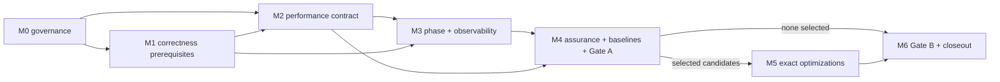

# Roadmap — Performance Optimization Design Enhancement

Date: 2026-09-09

## Purpose and planning boundary

This folder decomposes the performance-optimization proposal into milestone-sized epic plans.
Each milestone contains multiple candidate tickets that deliver one related capability group.
This is planning only: no ticket files, tracking tickets, runtime changes, approvals, or P1
supersession are created by this pass.

Candidate IDs such as `PERF-M2-T03` are planning handles, not real `TCK-*` IDs. A later
`create-tickets` invocation must re-investigate live code, check existing-ticket overlap, and
assign real ticket IDs only after the milestone entry gate is satisfied.

## Source and authority

The milestone set refines these P2 sources:

- `docs/brainstorm/codex/system-design/performance_optimization_architecture_proposal.md`;
- `docs/plans/design_enhancement/performance_optimization/performance_optimization_prerequisite_execution_plan.md`;
- `docs/plans/design_enhancement/performance_optimization/performance_optimization_conflict_approval_review.md`;
- `docs/plans/design_enhancement/performance_optimization/system_design_terms_and_concepts.md`.

It does not override:

- `AGENTS.md` or the Singular Bottleneck Law;
- P0 Mechanics Bible rules;
- P1 engine, determinism, certification, or performance contracts;
- `docs/plans/design_enhancement/design_enhancement_roadmap.md`;
- `docs/plans/design_enhancement/performance_milestones_epic.md`.

The older P1 roadmap and performance epic conflict with parts of the refined proposal. M0 must
resolve their status and surviving scope before any behavior-changing milestone proceeds.

## Plan review, 2026-10-02

The whole package was re-read against live code on 2026-10-02 (`origin/main` at `7dfd1349`). Its
design holds; the points below correct what has moved since 2026-09-09 and add what it missed.
Where an epic file in this folder disagrees with this section, this section is the newer statement.

### Ownership model (owner decision, 2026-10-02)

The package was written as if ten separate role-holders existed (the M0 epic lists ten roles, the
prerequisite plan's R0A lists seven, the conflict review's approval matrix groups them a third
way). This repository has one owner and several agent sessions, so the owner decided:

| Function | Held by |
|---|---|
| Planning, decision drafting, and review of every PERF-D record, conflict disposition, and implementation evidence | The `perf-planner` session |
| Implementation of dispatched tickets | The `perf-implementer` session |
| Accountable approval of anything that amends or supersedes an authority-P1 document, activates a behavior change, or accepts a baseline | The repository owner |

The ten role names survive only as **review perspectives**: each PERF-D record states which
perspectives it was reviewed from. They are no longer separate people to be named, and "no named
owner" is no longer an approval blocker. A review by `perf-planner` is not owner approval; a
decision that changes a P1 document stays a draft until the owner accepts it.

### Technology direction (owner decision, 2026-10-02)

The owner expects this project to grow very large and directed that the performance program
prefer a modern, widely adopted stack, framework, or design, even when it is more complex than a
minimal local fix. This changes how candidates are chosen, not whether they are proven:

- Where two options both satisfy the stable structure below, the program picks the one with
  broader industry adoption and more headroom, and accepts the extra complexity. "Simplest thing
  that passes" is not the selection rule.
- This applies first to the measurement and assurance tooling the foundation builds (benchmark
  harness, profiling, metrics and tracing, CI performance tracking), where an established tool is
  preferred over extending a bespoke one.
- The package's standing exclusions (full ECS or data-oriented rewrite, concurrent RESOLUTION,
  aggregate simulation) and the M6 line that popularity is not justification were written before
  this direction. They are no longer closed questions: each gets a real evaluation under M6-T05
  instead of a default no. PERF-M0-T09 carries this into the P1 plans.
- Determinism, the single authoritative owner, and typed durable state are repository hard rules
  and are not relaxed by this direction. A modern design is adopted in a form that keeps them, or
  it comes back to the owner as an explicit trade-off.

The stack survey is `performance_stack_survey.md`: candidate tools and designs per layer, with
what each would replace. The owner accepted its recommendations on 2026-10-02 and decided two
points: a Rust toolchain (PyO3 and maturin) is acceptable in the build and CI, and the
ECS/data-oriented core is scoped now as an architecture proposal only, in parallel with the
foundation. That second decision moves M6-T05's proposal ahead of Gate B as a document; it
authorizes no implementation, and Gate A and Gate B keep their roles for everything that is built.

### Live-state corrections

| Plan statement | State on 2026-10-02 |
|---|---|
| 43 static `run_phase()` calls in `AuthoritativeApplyPipeline.refine` | 44. The count moved within a month, so PA-05A must deliver a re-runnable inventory script, not a one-off table |
| Proposal and plan are untracked in git (C-17) | Resolved: the folder and the source proposal are tracked since PR #185 |
| Zero-worker utilization reports `1.0` (C-03) | Fixed to `0.0` by `TCK-20260911-WORKER-UTILIZATION-ZERO-WORKERS-DEGRADED-MISTRIGGER`, ahead of PERF-D1. PERF-D1 must ratify or revise that fix; the zero-queue case still reports `1.0` |
| FULL persistence hashes directly (C-06) | Still true (`Kernel._phase_persistence`); `BudgetedCanonicalHasher` has no caller outside its own module |
| Threshold checks default to warning (C-13 area) | Still true: 12 of 53 `assert_perf_threshold` call sites pass `hard=True` |
| Regression gate samples 10/50 ticks, average only, skips a missing baseline, empty hard-scenario set | Still true |
| Debt harness accounting defect (PA-02) | Still present and latent: `src/perf/long_run_harness.py` calls `len()` on integer debt values |

### Gaps the package did not cover

- **Simulation Quality cannot yet serve as a gate.** The calibration corpus runs at roughly ten
  entities and cannot see a scale-dependent change
  (`TCK-20260915-SIMQ-CORPUS-BLIND-TO-SCALE-DEPENDENT-BEHAVIOR`), and most grade anchors fail on
  untouched `main` (`TCK-20261001-SIMQ-GRADE-ANCHORS-RED-ON-MAIN-UNREPORTED`). M4-T05 inherits both.
- **The largest benchmark world is defective.** `build_metropolis_state()` stacks entities on the
  same tile by construction (`TCK-20260919-PERF-SCENARIO-METROPOLIS-SPAWN-COLLISION`). M4-T09 must
  not map a scenario identity to it until that is fixed.
- **Gate hardening reaches other work.** The `perf-cert-arena` CI job runs `tests/perf` on every PR
  that touches `src/core` or `src/engine`. Turning a soft threshold hard is therefore a change to
  what RPG-core PRs must pass, and is sequenced by the entry gate below.

### RPG-core stability entry gate

RPG-core work (the systemic-world track: death/lifecycle, derived-stat authority, body recovery,
semantic foundation, perception phase) is changing world behavior, pipeline phase count, and
`AuthoritativeState` shape on purpose while this program is planned. The package named that only as
an M6 revisit trigger. It is an entry gate:

- No performance baseline, capacity measurement, or SimQ/Arena comparison is taken as evidence
  until the owner states that the RPG-core foundation work has reached a stable point. A
  measurement taken earlier is labeled provisional and cannot be promoted.
- No ticket in this program edits `src/` while the `src/` freeze of the Python Code Craft plan is
  in force (`docs/plans/codebase_health/python_code_craft_roadmap.md`, which on 2026-10-02 exists
  only on branch `python-code-craft` and not yet on `main`), and none edits
  `src/core/state.py`, `src/engine/apply.py`, `src/engine/pipeline.py`, or `src/engine/kernel.py`
  while RPG-core tickets are open against them.
- No soft performance check becomes blocking until both conditions above have lifted.
- Inventories that depend on phase count or state shape (PA-05A, the call-site half of PA-03A) are
  delivered as re-runnable tooling under `tools/`, so they are regenerated, not re-authored, after
  each RPG-core merge.

### Foundation slice that may start now

Documents, tickets, and read-only tooling only — no `src/` edit, no baseline:

1. M0-T01 source audit.
2. M0-T02 review matrix and C-01..C-17 dispositions.
3. PA-03A hash audit, call-site and consumer inventory only; cost measurement waits for the gate.
4. PA-05A phase inventory as a re-runnable script.
5. M2-T01 clause-level inventory of the performance contracts against the gates that actually run.
6. Decision drafts for PERF-D2, PERF-D4, and PERF-D6, and the recorded closure of PERF-D3.

Items 3–6 follow item 2. Everything else in M1–M6 waits for the entry gate.

## Stable structure across every milestone

Performance work may change representations, derived indexes, scheduling efficiency, execution
backend, and serving policy only within an approved contract. It does not change the following
spine:

1. Kernel is the sole owner of `AuthoritativeState`.
2. Workers receive read-only state and return proposals/`WorkerResult` values.
3. RESOLUTION remains the authoritative merge/refinement boundary.
4. Every durable change is a `StateUpdate` refined through the authoritative pipeline.
5. Derived performance structures remain rebuildable and never become a second mutable truth.
6. Operational worker order may vary; semantic ordering may not depend on completion timing.
7. New RPG phases/features declare state ownership, read/write domains, ordering, cadence/LOD,
   invariants, observability, and performance budgets instead of forcing a fixed phase count.
8. Semantic approximation, distributed writers, client prediction, and concurrent RESOLUTION are
   outside exact-optimization scope and require separate architecture approval.
9. Every promoted optimization remains covered by a change-aware regression control loop; a faster
   result is invalid when correctness, determinism, Arena behavior, or Simulation Quality regresses.

## Milestone map

| Milestone | Capability group | Candidate tickets | Entry gate | Exit |
|---|---|---:|---|---|
| [M0 — Architecture governance](performance_m0_architecture_governance_epic.md) | Durable sources, owners, PERF-D1..D6, P1 reconciliation | 9 | Planning sources available | Approved decisions or explicit blocked dispositions; one discoverable program authority |
| [M1 — Correctness prerequisites](performance_m1_correctness_prerequisites_epic.md) | Capacity/debt/hash corrections and ordering verification | 5 | Relevant PERF decisions plus M0 reconciliation | Corrected contracts/tests and baseline invalidation decisions |
| [M2 — Performance contract](performance_m2_performance_contract_epic.md) | One claim model and executable CI/scheduled projections | 6 | PERF-D2/D4 and affected M1 identities | Versioned authoritative contract with no silent missing-evidence pass |
| [M3 — Phase and observability foundation](performance_m3_phase_observability_foundation_epic.md) | Phase catalog, scheduling funnel, bounded instrumentation | 7 | PERF-D1/D6, M2 metric identity, PA-05A evidence | Catalog conformance and bounded observer overhead |
| [M4 — Continuous assurance, baselines, and Gate A](performance_m4_baseline_gate_a_epic.md) | Change-aware test routing, E2E/Arena/SimQ gates, audit evidence, baseline matrix, bottleneck decision | 12 | M1–M3 stable | Trustworthy regression-control loop, valid scenario dispositions, and approved Gate A report |
| [M5 — Exact optimization delivery](performance_m5_exact_optimization_delivery_epic.md) | Only Gate-A-selected semantics-preserving accelerators | 8 conditional families | Gate A selects each family | Per-family parity, bounds, rollout, and promotion/rejection |
| [M6 — Gate B and future architecture](performance_m6_gate_b_future_architecture_epic.md) | Assurance/matrix rerun, retirement, persistent guardrail ownership, Gate B, optional separate proposal | 6 | M5 selected work closed, or Gate A selected none | Exact-program closeout, owned regression controls, and explicit future-architecture disposition |

```mermaid
flowchart LR
    M0[M0 governance] --> M1[M1 correctness prerequisites]
    M0 --> M2[M2 performance contract]
    M1 --> M2
    M2 --> M3[M3 phase + observability]
    M1 --> M3
    M3 --> M4[M4 assurance + baselines + Gate A]
    M2 --> M4
    M4 -->|selected candidates| M5[M5 exact optimizations]
    M4 -->|none selected| M6[M6 Gate B + closeout]
    M5 --> M6
```

Dependencies are capability gates, not blanket serial execution. Tickets within a milestone may
run in parallel when their detail plan says so and their files/authority surfaces do not overlap.

## Program-wide ticket contract

Every eventual child ticket must include:

- the milestone candidate ID and real `TCK-*` ID;
- exact entry dependency and evidence artifact;
- affected authoritative state families and read/write domains;
- whether semantics are unchanged, corrected from a defect, or intentionally changed;
- reference path and oracle;
- benchmark identity, work cardinality, runtime mode, and observer level;
- change-impact classification and the required fast, E2E, Arena, SimQ, and scheduled lanes;
- deterministic ordering and RNG consequences;
- memory/retention bound;
- rollout, rollback, and retirement rule;
- durable audit-document path and links to machine-readable before/after evidence;
- documentation, parity-ledger, and generated-file updates;
- explicit exclusions preventing adjacent milestone scope from leaking in.

One ticket should remain independently reviewable and reversible. Shared-file overlap is a merge
coordination issue unless one change genuinely consumes another's output.

## Continuous performance-assurance model

Performance regression control is a tiered feedback system, not one large benchmark suite:

| Tier | Trigger | Purpose | Required outcome |
|---|---|---|---|
| Local/PR-fast | Every relevant change | Static/unit/property checks plus deterministic performance tripwires | Blocking PASS, or explicit INCONCLUSIVE/REGRESSION; missing evidence is not PASS |
| PR-targeted | Conservative impact map selects affected domains | Checkpoint/replay E2E, representative Arena slices, targeted SimQ worlds/pillars | PASS is merge-blocking once calibrated; before calibration it cannot satisfy a promotion gate and needs an approved substitute oracle |
| Main/nightly | Merge to main, schedule, or manual confirmation | Full performance matrix, slow Arena/5k behavior, full/slow SimQ audit | Detect cross-domain and long-horizon drift; create an owned incident/ticket for unexplained regression |
| Release/Gate | Candidate promotion, Gate A, Gate B, or baseline update | Controlled repeated capacity and quality comparison | Named-owner approval backed by compatible evidence and audit document |

The fast lane is a tripwire, not a capacity claim. Noisy or expensive measurements use a second
controlled confirmation stage. Where shared-runner noise makes a historical comparison unreliable,
the confirmation should compare base and candidate revisions on the same runner and record both
absolute and relative deltas. Retry policy, sample counts, variance limits, and thresholds are
predeclared; rerunning until green or silently refreshing a baseline is forbidden.

The impact contract assigns every lane to an explicit boundary: merge, candidate activation/default
ON, baseline or anchor update, reference retirement, release, or capacity claim. A required PR-fast
or calibrated PR-targeted lane must return `PASS` before merge; `REGRESSION` and `INCONCLUSIVE`
block it. Heavy checks may complete after a default-OFF implementation merges only when the contract
assigns them to activation/release, but they must pass before that boundary. A default-ON behavior
change cannot use this deferral.

Every affected change produces a machine-readable evidence bundle and a durable summary under
`docs/audits/performance/` (exact schema/path requires M4 owner approval). The summary links the
ticket/change, impact decision, identities, tests, E2E/Arena/SimQ results, before/after performance,
known exceptions, disposition, and rollback state. `docs/optimization_audit_ledger.md` remains the
discoverable index unless its P1 owner approves a replacement.

Known historical drift is partitioned into an owner-and-expiry ledger. An active quarantine is not
`PASS` and never authorizes candidate activation, baseline/anchor update, retirement, release, or a
capacity claim. It may permit an unrelated merge only when the impact contract excludes the debt or
a paired candidate/base comparison proves no new or worsened delta and the exception owner approves
it before expiry. The target state is blocking gates after debt is classified and the lane proves
stable.

## Cross-plan conflicts requiring M0 disposition

| Existing source | Conflict | Safe handling |
|---|---|---|
| `design_enhancement_roadmap.md` P1 | Treats the zero-capacity value as a known `0.0` fix and presumes a particular sequence | Do not implement until PERF-D1 defines disabled/local/unavailable/idle/saturated semantics |
| `performance_milestones_epic.md` P1 | Preselects region chunking, SoA, memoization, hierarchical hashing, job-graph RESOLUTION, and aggregate simulation | M5 admits exact candidates only through Gate A; RESOLUTION concurrency and approximation remain M6/separate architecture |
| `determinism_envelope_epic.md` P1 | Frames Canonical versus Live as a choice | PERF-D1 decides whether distinct contracts coexist and what control trace is sufficient |
| `subphase_domain_contracts_epic.md` P1 | Uses a phase count/catalog premise that differs from live code and P1 pipeline prose | PA-05A inventories first; PERF-D6 selects authority before M3 promotion |
| Performance/certification/baseline P1 docs | Sampling, metrics, baseline, and failure rules drift from live gates | M2 reconciles clause by clause before M4 baselines |
| Live performance and SimQ CI gates | Performance thresholds can warn without failing; missing baselines/calibration can skip; full SimQ audit is informational while known drift remains | M2 defines result/debt policy; M4 separates old debt from new deltas, calibrates trustworthy hard gates, and assigns an expiry/owner to temporary informational status |

Until M0 closes, this folder is a P2 decomposition for review—not implementation authorization.

## Completion outcomes

The roadmap succeeds when:

- M0–M4 establish trustworthy contracts, instrumentation, and evidence;
- relevant future changes receive immediate fast feedback and cannot bypass required E2E, Arena,
  SimQ, or scheduled confirmation through an incomplete changed-file rule;
- every Gate A candidate is selected, rejected, deferred, transferred, or escalated explicitly;
- every selected M5 optimization is promoted or rolled back with parity evidence;
- M6 publishes the final clean matrix and Gate B disposition;
- P1 owners reconcile or supersede overlapping plans;
- any advanced semantic work begins as a separate architecture proposal.

“No exact optimization justified by evidence” is a valid successful outcome.
