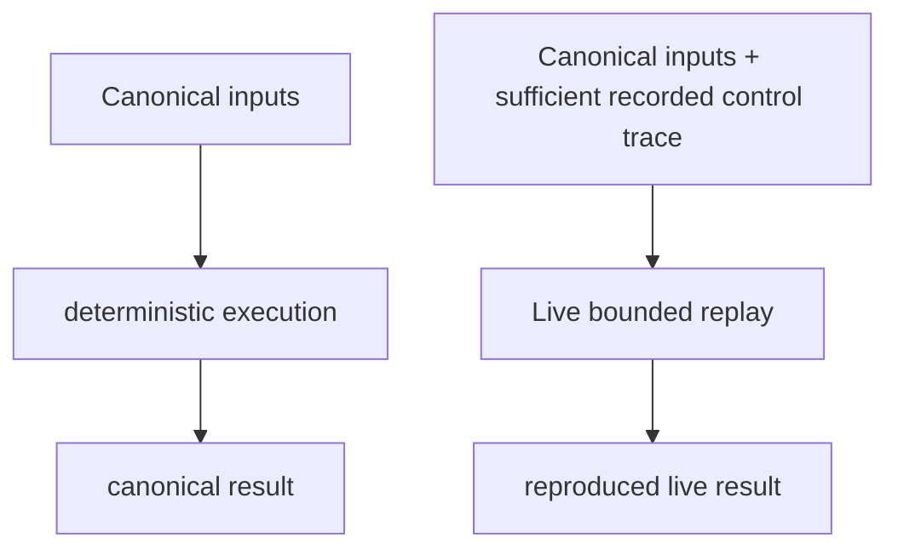
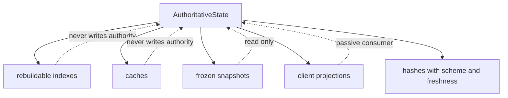

# System Design Terms and Concepts

Date: 2026-09-08

Owner: Architecture documentation owner (assignment required before promotion)

Audience: developers, architecture reviewers, performance engineers, test engineers, and new
contributors

Current lifecycle: work-in-progress guide within the architecture-design epic. `status: active`
means the document is current work in that epic under the repository's four-value documentation
schema; it does **not** mean approved architecture. Its P2 authority makes it explanatory/FYI.

Promotion: after terminology conflicts, ownership, status vocabulary, and authoritative references
are approved, the assigned owner may keep this path or promote the guide into the permanent
architecture/reference area. Promotion, generated navigation, approved architecture, and P1/P0
normative authority are separate decisions.

## 1. Authority, purpose, and maintenance

This guide explains terminology used across the project. It does not override authoritative
engine contracts, executable behavior, schemas, or higher-authority architecture documents.
Where definitions conflict, the referenced authoritative contract and verified implementation
take precedence. A proposal is cited only to explain a proposed or conditional term; citation is
not approval.

This guide is authority P2 and is intended to:

- explain terms and their relationships;
- support onboarding and architecture/performance review;
- distinguish implemented, partial, proposed, conditional, deprecated, and unverified concepts;
- expose terminology drift instead of silently resolving it.

It does not approve architecture, replace contracts, authorize implementation, or serve as an
executable specification. Update it when an architecture term, macro/refinement phase,
`RuntimeMode`, implementation status, approved decision, or authoritative definition changes, and
when a listed drift item is resolved.

### Origin and status vocabulary

| Field | Values used here |
|---|---|
| Origin | **Industry**: conventional term; **Adapted**: conventional design with project restrictions; **Project**: project-defined law/concept; **Implementation**: concrete symbol or protocol; **Proposed**: introduced by an unapproved proposal; **Historical**: retained only for context |
| Status | **Implemented**; **Partially implemented**; **Documented but not enforced**; **Not implemented — explanatory only**; **Explicit non-goal**; **Proposed — approval pending**; **Conditional — evidence-gated**; **Deprecated**; **Historical only**; **Unverified** |

`Documented but not enforced` means intended or required behavior exists in repository prose but
executable enforcement is absent or incomplete. `Not implemented — explanatory only` means the
term is present for comparison/onboarding and is not claimed as a project capability. `Explicit
non-goal` means the current architecture proposal deliberately excludes it; this does not mean the
idea is permanently forbidden. Origin and implementation status are independent.

“Canonical” in this guide means normalized or designated within a stated scope. It does not elevate
a P2 document to P1/P0 authority. “Recommended” is not “approved,” and a target architecture is not
implementation authorization.

Citation shorthand below is exact: **proposal** means
`docs/brainstorm/codex/system-design/performance_optimization_architecture_proposal.md`;
**prerequisite plan** means
`docs/plans/design_enhancement/performance_optimization_prerequisite_execution_plan.md`; and
**conflict review** means
`docs/plans/design_enhancement/performance_optimization_conflict_approval_review.md`.
PERF-D1..D6 and PA-00..08 are decision/work identifiers owned by those documents, not approvals
granted by this guide.

## 2. Discovery decision

Repository-wide filename, heading, body-term, registry, and generator searches found no existing
developer-facing guide with this document's cross-engine scope. The dashboard glossary is a
specialized enum-tooltip registry, not an architecture glossary.

| Candidate document | Path | Scope | Authority | Generated? | Overlap | Decision |
|---|---|---|---|---:|---|---|
| Simulation getting-started guide | `docs/guides/simulation.md` | Running/authoring simulations | P1 | No | Partial; short engine overview, with known count/determinism drift | Keep specialized; do not expand into a glossary |
| Runtime state contract | `docs/engine/contracts/runtime_state_contract.md` | Runtime/export/diagnostic model separation and retention | P1 | No | Specialized glossary/contract | Cite as authority |
| Authoritative pipeline | `docs/engine/authoritative_pipeline.md` | Singular Bottleneck Law and named refinement phases | P1 | No | Authoritative architecture contract | Cite; do not restate as new authority |
| Deterministic execution contract | `docs/engine/deterministic_execution.md` | Current determinism guarantee | P1 | No | Authoritative but narrower; conflicts require reconciliation | Cite and flag drift |
| Candidate-selection and dirty-state guides | `docs/engine/candidate_selection.md`; `docs/core/dirty_state_and_dependency.md` | Scheduling/filtering internals | P1 | No | Specialized concepts | Cite as authority |
| Performance contracts | `docs/engine/performance_contract.md`; `docs/performance/perf_baseline_policy.md` | Targets, benchmark and gate policy | P1 | No | Specialized and mutually drifting | Cite and flag drift |
| Dashboard glossary registry | `registries/glossary_registry.jsonl` | UI tooltips for workflow enum-like values | Runtime-owned registry | No; append-only via tool | Specialized glossary, unrelated to engine concepts | Do not duplicate or modify |
| Performance optimization proposal/plan | `docs/brainstorm/codex/system-design/performance_optimization_architecture_proposal.md`; `docs/plans/design_enhancement/performance_optimization_prerequisite_execution_plan.md` | Proposed — approval pending | P2 | No | Source for proposed/conditional vocabulary | Label every borrowed term pending/evidence-gated |
| Archived glossary proposals/tickets | `docs/plans/archive/agent_ops_dashboard/`; `tickets/done/*GLOSSARY*` | Historical dashboard glossary work | Historical | Mixed artifacts | Historical/specialized | Do not revive or consolidate into this guide |
| Documentation registry | `docs/REGISTRY.yaml` | Generated navigation metadata | Generated | Yes | Navigation only | Regenerate with `tools/generate_registry.py`; never hand-edit |

**Decision: Option C — create one new explanatory guide.** The selected WIP path is
`docs/plans/design_enhancement/system_design_terms_and_concepts.md`, as requested. It is the
candidate cross-project navigation guide inside the current epic, not an approved canonical
navigation document and not the canonical source of any P1/P0 rule. Specialized contracts retain
ownership of their definitions. The registry records discoverability; it does not promote status or
authority.

## 3. Five-minute overview

1. `Kernel` owns the current `AuthoritativeState`. Workers receive a read-only view and cannot
   mutate durable state.
2. `Kernel.tick_once()` runs six authoritative macro phases—INIT, SCHEDULING, COLLECTION,
   RESOLUTION, CLEANUP, ADVANCEMENT—then executes the non-authoritative PERSISTENCE hook after
   authoritative publication but before `tick_once()` returns.
3. COLLECTION may execute work concurrently. Its returned `WorkerResult` objects are gathered at
   a barrier, then RESOLUTION applies the current commit sort key. The shipped scheduler/executor
   path supplies deterministic input order for current system-debt results, but the protocol does
   not prove a unique total key for every valid system-result batch; see the contract ambiguity in
   §14.
4. RESOLUTION converts worker output into a raw `StateUpdate`, then
   `AuthoritativeApplyPipeline.refine()` validates and enriches it. `ApplyPath.apply_generation()`
   builds the next state, after which Kernel replaces its state reference.
5. Determinism requires the same complete semantic inputs and ordering—not merely the same RNG
   seed. The current P1 guarantee is sequential; broader Canonical/Live bounded contracts and
   portability tiers remain proposed.
6. Scheduler readiness, cadence, LOD, candidate budgets, dirty filtering, and `ResourceGovernor`
   policy bound work. If pressure changes admission, it can change simulation results and belongs
   inside the reproducibility contract.
7. Clients consume snapshots and absolute-value deltas/projections. They are passive with respect
   to authoritative mutation. Server-side spatial interest management remains evidence-gated.

```mermaid
flowchart LR
    A[AuthoritativeState at t] --> B[read-only snapshot]
    B --> C[parallel or local COLLECTION]
    C --> D[WorkerResult batch]
    D --> E[global barrier]
    E --> F[canonical ordering]
    F --> G[raw StateUpdate]
    G --> H[authoritative refinement]
    H --> I[ApplyPath.apply_generation]
    I --> J[reference replacement: state t+1]
```

## 4. Core simulation architecture

| Term | Origin | Status | Meaning in this project | Primary references |
|---|---|---|---|---|
| **Authoritative state** | Implementation term | Implemented | The complete durable simulation truth represented by `AuthoritativeState`; only the authoritative apply route may produce its successor | `src/core/state.py`; `docs/engine/authoritative_pipeline.md` |
| **World state** | Adapted industry concept | Implemented | Context-dependent shorthand. It may mean the whole authoritative simulation state in prose, but `WorldState`/world-domain fields are only portions of `AuthoritativeState`; do not assume synonymy in code | `src/core/state.py`; `docs/architecture/macro_interest_constraints.md` |
| **Single authority / authoritative server** | Adapted industry concept | Implemented | One engine-owned mutation authority decides durable state; workers, clients, observers, and external processes do not co-own truth | `docs/engine/authoritative_pipeline.md`; `src/engine/kernel.py` |
| **Single authoritative writer** | Adapted industry concept | Implemented | The Kernel/apply path serializes authoritative publication even when Collection work is parallel | `src/engine/kernel.py`; `src/engine/apply.py` |
| **Singular Bottleneck Law** | Project-specific | Implemented | Every durable change is a `StateUpdate` refined through `AuthoritativeApplyPipeline`; no direct `AuthoritativeState` mutation | `AGENTS.md`; `docs/engine/authoritative_pipeline.md` |
| **Tick / tick loop** | Implementation term | Implemented | One ordered engine step performed by `Kernel.tick_once()` | `src/engine/kernel.py`; `src/engine/phases.py` |
| **Tick budget** | Adapted industry concept | Implemented | Profile limit used for pacing and pressure/hard-cap decisions; it is not proof that equal work was completed | `src/engine/kernel.py`; `docs/engine/performance_contract.md` |
| **Macro phase** | Project-specific | Implemented | A `TickPhase` boundary. Six phases affect authoritative semantics; PERSISTENCE is a seventh non-authoritative hook | `src/engine/phases.py`; `src/engine/kernel.py` |
| **INIT** | Implementation term | Implemented | Establishes tick context, observes pressure, updates governor policy, and configures the executor | `src/engine/kernel.py::_phase_init` |
| **SCHEDULING** | Implementation term | Implemented | Selects and budgets deterministic `WorkItem` objects; records dropped work | `src/engine/kernel.py::_phase_scheduling`; `src/engine/scheduler.py` |
| **COLLECTION** | Implementation term | Implemented | Executes selected work against a read-only view and gathers validated `WorkerResult` objects; may be parallel | `src/engine/kernel.py::_phase_collection`; `src/engine/executor.py` |
| **RESOLUTION** | Implementation term | Implemented | Sorts results, merges them into a raw update, and invokes authoritative refinement; current application is serial | `src/engine/kernel.py::_phase_resolution`; `src/engine/pipeline.py` |
| **CLEANUP** | Implementation term | Implemented | Performs tick-final cleanup and lifecycle preparation before publication | `src/engine/kernel.py::_phase_cleanup` |
| **ADVANCEMENT** | Implementation term | Implemented | Adds the RNG checkpoint and applies the refined update as the next generation/tick | `src/engine/kernel.py::_phase_advancement`; `src/engine/apply.py` |
| **PERSISTENCE** | Implementation term | Implemented | Non-authoritative replay/hash/recording hook executed inside `tick_once()` after authoritative publication; it must not feed mutation back into the completed tick | `src/engine/phases.py`; `src/engine/kernel.py::_phase_persistence` |
| **Refinement phase / subphase** | Project-specific | Partially implemented | An ordered validation, routing, or enrichment step inside `AuthoritativeApplyPipeline.refine()`; it is not a macro phase | `docs/engine/authoritative_pipeline.md`; `src/engine/pipeline.py` |
| **Phase ordering / phase boundary** | Adapted industry concept | Implemented | The semantic sequence and isolation point between engine stages. Reordering may change visible prior/current state and therefore behavior | `src/engine/phases.py`; `src/engine/pipeline.py` |
| **Invariant** | Industry-standard | Implemented | A condition that must remain true across permitted state transitions, such as single-authority mutation or conservation | `docs/engine/authoritative_pipeline.md`; `src/observability/hard_law_monitor.py` |
| **Read domain / write domain** | Adapted industry concept | Partially implemented | Declared sets of state families a phase may inspect or update; used for safety analysis, but catalog coverage is not yet one complete execution authority | `src/engine/phase_graph.py`; `src/engine/phase_domain_permissions.py`; `docs/plans/design_enhancement/subphase_domain_contracts_epic.md` |
| **Barrier** | Adapted industry concept | Implemented | RESOLUTION waits until executor output is gathered; completion timing remains operational, while application order is canonical | `src/engine/kernel.py`; `src/engine/executor.py` |
| **Immutable snapshot / frozen view** | Adapted industry concept | Implemented | A read-only view provided to Collection so workers cannot mutate authority; “snapshot” does not necessarily mean a serialized checkpoint | `AuthoritativeState.readonly_view()` in `src/core/state.py`; `src/engine/executor.py` |
| **WorkItem / work packet** | Implementation term | Implemented | `WorkItem` is scheduled work; `WorkerPacket` is a bounded, frozen execution payload derived for a worker | `src/core/work.py`; `src/core/worker_protocol.py` |
| **Intent** | Project-specific | Implemented | A requested action or domain-specific desired effect subject to validation; intent types are not authoritative state changes by themselves | `src/core/updates.py`; `src/engine/intent/action_intent.py` |
| **Proposal (runtime)** | Adapted industry concept | Implemented | Untrusted/tentative worker or subsystem output offered for resolution. It may contain intents or update fragments; it is not automatically accepted | `docs/engine/authoritative_pipeline.md`; `src/engine/pipeline.py` |
| **WorkerResult** | Implementation term | Implemented | Frozen envelope linking worker output to source/work identity plus deterministic sort keys, status, timing, and optional debt metadata | `src/core/worker_protocol.py` |
| **StateUpdate** | Implementation term | Implemented | Typed aggregate of candidate durable changes and audit metadata. Raw updates are refined before application; possessing one does not authorize direct mutation | `src/core/updates.py`; `src/engine/pipeline.py` |
| **Refinement pipeline** | Project-specific | Implemented | The serial trust/validation/domain-resolution sequence that turns a raw update into the update eligible for application | `docs/engine/authoritative_pipeline.md`; `src/engine/pipeline.py` |
| **Apply generation** | Implementation term | Implemented | `ApplyPath.apply_generation()` constructs the successor state from the prior state and refined update | `src/engine/apply.py` |
| **Generation / generation stamp** | Adapted industry concept | Implemented | A version/epoch identifying a state or derived-data lifetime. The exact field differs by subsystem; never compare unrelated generation schemes | `src/engine/apply.py`; `src/engine/cache_registry.py`; `src/api/read_model_cache.py` |
| **Single-owner generation reference replacement** | Project-specific | Implemented | Kernel assigns the newly built state to its sole current-state reference after successful construction; this is not crash-atomic persistence or a general transaction | `src/engine/kernel.py::_phase_advancement`; `src/engine/apply.py` |
| **Passive client** | Adapted industry concept | Implemented | A client may observe projections and request allowed controls, but cannot authoritatively mutate simulation state or change workload by mere presence | `src/api/`; `docs/plans/live_map_reconnection_epic.md` |

### Intent-to-state transformation

| Boundary | Owner | Input | Output | Authority |
|---|---|---|---|---|
| Scheduling/Collection | Scheduler and executor | `WorkItem`, read-only state | `WorkerResult` containing update/proposal data | Non-authoritative |
| Result merge | Kernel RESOLUTION | Validated result batch after the current sort key; non-success results become empty/no-op entity updates | Raw `StateUpdate` | Candidate mutation only |
| Refinement | `AuthoritativeApplyPipeline` | Prior state + raw `StateUpdate` | Validated/enriched `StateUpdate` | Authorized representation, not state itself |
| Apply/publication | `ApplyPath` then Kernel | Prior state + refined update | New `AuthoritativeState`, then reference replacement | Authoritative applied state |

`Intent`, `WorkerResult`, `StateUpdate`, and applied state are therefore not synonyms: an intent is
requested semantics; `WorkerResult` is an execution envelope; `StateUpdate` is the typed mutation
representation; applied state is the published result.

## 5. Determinism and reproducibility

| Term | Origin | Status | Meaning in this project | Primary references |
|---|---|---|---|---|
| **Determinism / reproducibility** | Adapted industry concept | Partially implemented | Equal complete semantic inputs under the supported execution envelope yield equal canonical state/hash. “Same seed” alone omits initial state, config, content/rules, executor/runtime scope, and any semantics-affecting control inputs | `docs/engine/deterministic_execution.md`; `tests/integration/kernel/test_determinism_suite.py` |
| **Deterministic input** | Adapted industry concept | Implemented | A stable input included in the execution contract: initial state, seed, versioned rules/content/profile, ordered external inputs, and approved control policy | `docs/engine/deterministic_execution.md`; `src/platform/rng.py` |
| **Determinism envelope** | Adapted industry concept | Partially implemented | The boundary of runtime, platform, executor, inputs, modes, and controls for which equality is promised; current P1 explicitly guarantees sequential mode only | `docs/engine/deterministic_execution.md`; `docs/plans/design_enhancement/determinism_envelope_epic.md` |
| **Canonical execution / Canonical mode** | Proposed term | Proposed — approval pending | Certification-oriented contract that forbids unrecorded timing/resource pressure from altering admitted semantic work. It is not a `RuntimeMode` enum member | `performance_optimization_architecture_proposal.md` §5; PERF-D1 in the prerequisite plan |
| **Certification mode/run** | Adapted industry concept | Partially implemented | Controlled execution used to make determinism/capacity claims. The repository has certification tests/profiles, but no single `RuntimeMode.CERTIFICATION` | `docs/engine/contracts/certification_contract.md`; `tests/certification/` |
| **Live bounded mode** | Proposed term | Proposed — approval pending | Live contract allowing bounded resource/timing controls to affect admission only when sufficient versioned semantic controls are reproducible | `performance_optimization_architecture_proposal.md` §5; PERF-D1 |
| **Replayability** | Adapted industry concept | Partially implemented | Ability to reproduce or inspect a run from defined inputs/artifacts. Current trace replay is not proven to reconstruct every authoritative state transition | `src/engine/replay_manager.py`; `tests/integration/kernel/test_event_replay.py` |
| **Semantic control input / control trace / runtime policy trace** | Proposed term | Proposed — approval pending | A bounded, versioned record—or proven derivation—of pressure-driven decisions that can alter admission, cadence, cutoff, dropping, coalescing, debt, or fidelity | `performance_optimization_architecture_proposal.md` §§5, 18 |
| **Canonical ordering / deterministic tiebreaker** | Adapted industry concept | Partially implemented | `Kernel._phase_resolution()` stably sorts by `(class_priority, -local_priority, entity_id)`. Nonzero entity IDs are batch-unique. System results use ID zero and require a `subsystem_id`, but validator/schema do not require unique subsystem/work identity or include either in the key. Current `DRAIN_DEBT` construction is deterministic upstream; the general protocol guarantee remains ambiguous | `src/engine/kernel.py::_phase_resolution`; `src/core/protocol_validator.py::ProtocolValidator.validate_result_batch`; `src/engine/scheduler.py::Scheduler.select_work`; `src/engine/executor.py::LocalSequentialExecutor.execute`; `src/engine/executor.py::ConcurrentExecutionAdapter.execute` |
| **Operational ordering / worker completion order** | Industry-standard | Implemented | Timing/order in which workers finish. It may vary, but must not influence the canonical result sequence | `src/engine/executor.py`; `tests/perf/test_concurrency_parity.py` |
| **Context-addressed RNG / RNG namespace** | Adapted industry concept | Implemented | Random values are derived from stable domain/tick/entity/sub-ID context instead of consumption order | `src/platform/rng.py`; `tests/integration/kernel/test_seed_stability.py` |
| **RNG scheme/version** | Adapted industry concept | Partially implemented | Identity of the RNG algorithm and input namespace. Changing it can intentionally change results and requires compatibility/version handling | `src/platform/rng.py`; `docs/engine/deterministic_execution.md` |
| **State hash / canonical flat hash** | Implementation term | Implemented | SHA-256 over canonicalized authoritative-state data produced by `CanonicalStateHasher`; it is a proof identity only within its byte-composition scheme | `src/engine/checkpoint.py` |
| **Hierarchical/Merkle hash** | Proposed term | Conditional — evidence-gated | Incremental tree of sub-hashes proposed for localization/cost reduction; it is not the implemented canonical certification digest | Proposal §9; PERF-D5 |
| **Hash freshness** | Adapted industry concept | Proposed — approval pending | Scheme plus represented state tick and computation tick; without freshness metadata, a cached digest must not be claimed as current proof | Proposal §9; `src/engine/checkpoint.py` |
| **Same-scheme comparison** | Proposed term | Proposed — approval pending | Compare digests only when algorithm, byte composition, and version match. Flat and tree digests are not expected to equal each other | PERF-D5; proposal §9 |
| **Divergence / divergence localization** | Adapted industry concept | Partially implemented | Divergence is unequal canonical outcomes inside a claimed envelope; localization narrows the first tick/domain/subtree that differs | `docs/engine/deterministic_execution.md`; `src/engine/checkpoint.py` |
| **Semantic parity** | Adapted industry concept | Implemented | Equality of authoritative outcomes/invariants across two paths, not necessarily equality of timing or diagnostic artifacts | `tests/perf/test_dirty_parity.py`; `tests/perf/test_concurrency_parity.py` |
| **Executor parity** | Adapted industry concept | Partially implemented | Same-environment comparison among local/thread/process executors; existing tests do not establish universal portability | `tests/perf/test_concurrency_parity.py`; `docs/engine/deterministic_execution.md` |
| **Portability scope / DET-PORT-0..3** | Proposed term | Proposed — approval pending | Named tiers proposed to separate no portability claim, approved-runtime/platform reproducibility, a declared cross-platform matrix, and broader guarantees; they are not adopted P1 vocabulary | PERF-D2; proposal §5 |

### Canonical versus Live bounded contracts

| Concern | Canonical/certification contract | Live bounded contract |
|---|---|---|
| Status | Proposed — approval pending | Proposed — approval pending |
| Goal | Reproducible certification and correctness | Reproducible bounded live operation |
| Permitted controls | Canonical, versioned inputs only | Canonical inputs plus bounded semantic controls |
| Wall-clock influence | Must not change admitted semantic work | May influence it only within declared policy |
| Reproduction | Same full input/config/runtime envelope | Same full envelope plus sufficient recorded/derivable control trace |
| Intended use | Tests, baselines, certification, reference paths | Production/live pressure behavior |

Wall-clock pressure becomes semantic when it changes which work is admitted, dropped, coalesced,
or delayed. Recording only the seed cannot reproduce that choice.

### Canonical order versus completion order

| Property | Worker completion order | Canonical commit order |
|---|---|---|
| Owner | Executor/OS scheduling | Kernel RESOLUTION |
| May vary? | Yes | No for current shipped constructors and unique-key results; validator-accepted tied ID-zero batches retain the §14 contract ambiguity |
| Semantic effect allowed? | No | Yes; it defines conflict/application order |
| Safety mechanism | Barrier gathers results | Stable commit sort before merge/refinement; a protocol-wide total-key proof is still pending |

## 6. Scheduling and load management

| Term | Origin | Status | Meaning in this project | Primary references |
|---|---|---|---|---|
| **Readiness** | Adapted industry concept | Implemented | Whether a work item is eligible under state/preconditions before budgeting | `src/engine/scheduler.py`; `docs/engine/candidate_selection.md` |
| **Dirty state / dirty filtering** | Adapted industry concept | Partially implemented | Per-tick domain marks derived from updates and used to conservatively limit downstream candidates; false negatives are correctness defects | `docs/core/dirty_state_and_dependency.md`; `src/core/dirty.py` |
| **Affected set** | Adapted industry concept | Implemented | Entities/objects requiring reevaluation after direct and implied changes | `src/core/dirty.py::DirtyDependencyGraph`; `CandidateSelector` |
| **Candidate selection** | Adapted industry concept | Partially implemented | Deterministic readiness/LOD/cadence, dirty-domain, and budget filters. Some live paths still bypass `CandidateSelector` | `docs/engine/candidate_selection.md`; `src/core/dirty.py` |
| **Candidate budget** | Adapted industry concept | Implemented | Deterministic cap on admitted candidates, with declared urgency/priority rules | `src/engine/scheduler.py`; `docs/engine/candidate_selection.md` |
| **Admission** | Adapted industry concept | Implemented | Decision that work enters this tick's executable set; unlike execution speed, it may change semantics | `src/engine/scheduler.py`; `src/engine/policy.py` |
| **Cadence / due eligibility** | Adapted industry concept | Implemented | Deterministic tick-frequency policy deciding when subsystem/entity work is due | `src/config/profiles.py`; `src/engine/scheduler.py` |
| **Due-work bucket** | Proposed term | Conditional — evidence-gated | Deterministic index of work due at a tick, proposed to replace repeated scans only if Gate A proves material cost and parity | Proposal §7; Gate A |
| **Deterministic staggering** | Adapted industry concept | Partially implemented | Stable distribution of periodic work across ticks using identity-derived offsets, never random completion timing | `src/engine/scheduler.py`; `docs/engine/candidate_selection.md` |
| **LOD / near-far-background tier** | Adapted industry concept | Implemented | Simulation-detail/cadence class used by scheduling. It must not silently change fidelity claims | `src/engine/scheduler.py`; `src/config/profiles.py` |
| **ResourceGovernor** | Implementation term | Implemented | Converts `PressureSignals` into `RuntimeMode` and `GovernorPolicy` decisions | `src/engine/governor.py`; `src/core/governance.py` |
| **RuntimeMode** | Implementation term | Implemented | Ordered pressure enum: NORMAL, CONSTRAINED, DEGRADED, SURVIVAL. It is not Canonical/Live bounded mode | `src/core/governance.py`; `src/engine/governor.py` |
| **NORMAL** | Implementation term | Implemented | Lowest-pressure mode with the richest configured policy | `src/engine/governor.py`; `src/engine/policy.py` |
| **CONSTRAINED** | Implementation term | Implemented | Moderate pressure mode applying bounded policy reductions | `src/core/governance.py::RuntimeMode`; `src/engine/governor.py::ResourceGovernor`; `src/engine/policy.py::GovernorPolicy` |
| **DEGRADED** | Implementation term | Implemented | High-pressure mode with stronger admission/richness reductions; may be forced by the mid-tick hard cap | `src/engine/kernel.py::_phase_resolution`; `src/engine/governor.py` |
| **SURVIVAL** | Implementation term | Implemented | Highest-severity mode intended to retain essential progress under extreme pressure | `src/engine/governor.py`; `src/engine/policy.py` |
| **Hysteresis** | Adapted industry concept | Implemented | Separate escalation/recovery behavior prevents mode thrashing near thresholds | `src/engine/governor.py` |
| **Load shedding / hard backstop** | Adapted industry concept | Implemented | Deterministically or operationally dropping work to honor resource limits; the mid-tick emergency throttle is a backstop and affects semantics | `src/engine/kernel.py::_phase_resolution`; `src/engine/scheduler.py` |
| **Dropped work** | Adapted industry concept | Implemented | Admitted/candidate work not processed and counted by runtime status; it does not imply later replay | `src/engine/runtime_status.py`; `src/engine/kernel.py` |
| **Coalesced work** | Industry-standard | Partially implemented | Multiple updates/messages represented by a later/current value; correctness depends on replaceability semantics | `src/api/ws/`; `docs/plans/live_map_reconnection_epic.md` |
| **Capacity debt / work debt** | Project-specific | Partially implemented | `AuthoritativeState.work_debt` is an aggregate integer per subsystem representing capacity shortfall; it does not identify a postponed operation | `src/core/state.py`; `src/engine/scheduler.py`; proposal §7.4 |
| **Semantic deferred work** | Proposed term | Proposed — approval pending | A future authoritative queue of specific postponed operations with stable identity, preconditions, revalidation, expiry, cancellation, and bounded repayment | PERF-D3; proposal §7.4 |
| **Debt repayment** | Adapted industry concept | Partially implemented | Scheduling generic subsystem capacity to reduce aggregate debt; it cannot claim to replay an original operation | `src/engine/executor.py`; `src/engine/scheduler.py` |
| **Starvation / fairness** | Industry-standard | Partially implemented | Starvation is indefinite lack of service; fairness is the bounded allocation rule preventing it | `src/engine/scheduler.py`; proposal benchmark debt-pressure scenario |
| **Maximum staleness / freshness guarantee** | Adapted industry concept | Partially implemented | Maximum permitted age between required reevaluations or observations; must be stated per feature/tier | `src/config/profiles.py`; performance proposal §7 |

### Capacity debt versus semantic deferred work

| Property | Capacity debt | Semantic deferred work |
|---|---|---|
| Stored value | Count per subsystem | Identified operation record |
| Operation identity | None | Stable/idempotency identity required |
| Preconditions | Generic service eligibility | Stored and revalidated |
| Replay meaning | Replenish capacity, not original action | Attempt the recorded semantic action under policy |
| Expiry/cancellation | Not operation-specific | Explicit |
| Authority | Already in `AuthoritativeState` | Would be authoritative if approved |
| Typical use | Overload accounting | Feature requiring an exact action to survive deferral |

## 7. Parallelism and execution

| Term | Origin | Status | Meaning in this project | Primary references |
|---|---|---|---|---|
| **Parallel COLLECTION** | Adapted industry concept | Implemented | Independent work may run concurrently against read-only state; authority remains serial | `src/engine/executor.py`; `src/engine/kernel.py` |
| **Serial RESOLUTION** | Project-specific | Implemented | One ordered merge/refine/apply path resolves conflicts and publishes the successor state | `src/engine/kernel.py`; `docs/engine/authoritative_pipeline.md` |
| **Worker / worker pool** | Implementation term | Implemented | Execution unit and bounded manager used for Collection; zero workers can mean local/disabled and its utilization semantics are disputed | `src/engine/worker_manager.py`; `src/engine/executor.py` |
| **Local, thread, and process executors** | Implementation term | Implemented | Interchangeable Collection backends with differing IPC/scheduling costs; parity scope must be stated | `src/engine/executor.py`; `tests/perf/test_concurrency_parity.py` |
| **Chunking / micro-chunking** | Industry-standard | Partially implemented | Grouping work to amortize dispatch; micro-chunking uses smaller batches to improve balance at overhead cost | `src/engine/executor.py`; proposal §11 |
| **Worker utilization / queue utilization** | Implementation term | Partially implemented | Ratios exposed as pressure signals. Current zero-denominator fallback is `1.0` for each, which can imply false saturation | `src/engine/worker_manager.py`; `src/engine/governor.py` |
| **Critical path / worker imbalance** | Industry-standard | Unverified | Tick Collection duration is bounded by the slowest required worker; imbalance is uneven work/cost across workers | proposal §§6, 11; `src/perf/bench_harness.py` |
| **Work stealing** | Industry-standard | Conditional — evidence-gated | Dynamic transfer of queued work between workers; permitted only if identity/RNG/output ordering remain semantic and ownership timing remains operational | Proposal §11; Gate A |
| **Locality-aware / region-local partitioning** | Industry-standard | Conditional — evidence-gated | Partitioning chosen to reduce data movement/cache misses; spatial partitioning is one candidate, not an automatic best choice | Proposal §11; conflict C-08 |
| **Barrier synchronization** | Adapted industry concept | Implemented | All required Collection results reach a join point before canonical resolution | `src/engine/kernel.py`; `src/engine/executor.py` |
| **Serial fraction / Amdahl's law** | Industry-standard | Not implemented — explanatory only | Overall speedup is bounded by serial Resolution/apply and other nonparallel cost; this is an analytical model, not a project capability or guarantee | `docs/brainstorm/codex/system-design/performance_optimization_architecture_proposal.md` §§2, 11 |
| **Bulk-Synchronous Parallel (BSP)** | Adapted industry concept | Implemented | Parallel local computation, barrier, then ordered global reconciliation describes the existing Collection/Resolution spine | Proposal §2; `src/engine/kernel.py` |
| **Concurrent RESOLUTION** | Proposed term | Proposed — approval pending | Parallelizing authoritative conflict resolution; explicitly not a continuation automatically authorized by performance work | Gate B; conflict C-10 |

## 8. Authoritative and derived data

| Term | Origin | Status | Meaning in this project | Primary references |
|---|---|---|---|---|
| **Source of truth / authoritative data** | Adapted industry concept | Implemented | Data whose value directly defines simulation semantics and must change through `StateUpdate`/apply | `docs/engine/authoritative_pipeline.md`; `src/core/state.py` |
| **Derived structure / secondary index** | Adapted industry concept | Implemented | Disposable data computed from authority to accelerate reads; it must have a complete rebuild/bypass correctness path | `src/engine/semantic_entity_index.py`; `src/api/read_model_cache.py` |
| **Rebuildable, dirty, spatial, and static index** | Adapted industry concept | Implemented | Indexes respectively recreated from authority, incrementally maintained from dirty sets, keyed by location, or built from content that does not change within its version | `src/core/dirty.py`; `src/engine/semantic_entity_index.py`; `src/core/state.py` |
| **Cache** | Industry-standard | Implemented | Reuse of derived data. Existing cache infrastructure and subsystem caches do not imply that every proposed hot-path computation is cached | `src/engine/cache_registry.py`; `src/api/read_model_cache.py` |
| **Memoization expansion** | Proposed term | Conditional — evidence-gated | Proposed reuse of pure expensive results such as pathfinding or scoring, requiring complete semantic keys, invalidation, bounded memory, and Gate A evidence | Proposal §8; Gate A |
| **Cache key / invalidation** | Adapted industry concept | Implemented | Key identifies all result-changing inputs; invalidation prevents stale values after state/content/version change | `src/engine/cache_registry.py`; `src/api/read_model_cache.py` |
| **Version stamp / content-rules version** | Adapted industry concept | Partially implemented | Scheme identifier included in artifacts/keys so results from different semantics are not silently compared | `src/content/`; `docs/engine/contracts/certification_contract.md` |
| **Read-only projection** | Adapted industry concept | Implemented | Consumer-specific representation derived from authority, such as API DTOs or worker views | `docs/engine/contracts/runtime_state_contract.md`; `src/api/read_model_cache.py` |
| **SoA / Structure of Arrays; Data-Oriented Design** | Industry-standard | Conditional — evidence-gated | Narrow disposable columnar views can improve locality without replacing the authoritative object model | Proposal §10; Gate A |
| **ECS** | Industry-standard | Explicit non-goal | Entity-Component-System pattern; some component-shaped models exist, but a full authoritative-model ECS rewrite is explicitly excluded from this performance program without separate evidence and approval | `src/core/state.py`; `docs/brainstorm/codex/system-design/performance_optimization_architecture_proposal.md` §17 |
| **Structural sharing / copy-on-write snapshot** | Industry-standard | Partially implemented | Successor states may reuse unchanged structures; copy occurs on change. Do not assume full persistent-data-structure semantics | `src/engine/apply_plan.py`; `src/engine/apply.py` |
| **Correctness-preserving fallback / reference path** | Adapted industry concept | Implemented | Slower route used as oracle or rollback when a derived accelerator is absent, invalid, or disabled | `force_full_scan` in `src/core/dirty.py`; proposal §18 |
| **Second mutable truth** | Project-specific | Explicit non-goal | A cache/index/projection independently mutated as if authoritative. The Singular Bottleneck Law excludes this ownership model; derived structures must remain rebuildable and non-authoritative | `AGENTS.md` (Engine Authority); `docs/engine/authoritative_pipeline.md` (Singular Bottleneck Law); `docs/brainstorm/codex/system-design/performance_optimization_architecture_proposal.md` §§3, 18 |

### Authoritative state versus derived structure

| Property | Authoritative state | Derived structure |
|---|---|---|
| Ownership | Kernel/apply authority | Owning cache/index/projection subsystem |
| Persistence | Defines durable semantics | Optional; if stored, still reconstructible from authority/version |
| Mutation path | `StateUpdate` → refinement → apply | Rebuild/invalidate/update from published authority |
| Rebuildability | Not derived from the accelerator | Required |
| Failure | Must stop/recover according to contract | Disable/discard and use correctness fallback |
| Semantic effect | Direct | Must be none for an exact optimization; indirect timing effects must also be controlled |

## 9. Persistence, recovery, and diagnostics

| Term | Origin | Status | Meaning in this project | Primary references |
|---|---|---|---|---|
| **Checkpoint / scenario checkpoint** | Adapted industry concept | Implemented | Serialized state/config boundary used to start, compare, restore, or benchmark a run; scenario checkpoints also fix workload identity | `src/engine/checkpoint.py`; `src/certification/`; `src/perf/` |
| **Checkpoint restore / resume** | Industry-standard | Partially implemented | Loading a compatible persisted state and continuing under declared versions; not equivalent to replaying every event | `src/engine/checkpoint.py`; CLI/certification paths |
| **Replay / replay event stream** | Adapted industry concept | Partially implemented | Bounded `TraceEvent` chunks and manifest produced asynchronously for diagnostics/replay fidelity checks; not established as the sole state-reconstruction log | `src/engine/replay_manager.py`; `src/engine/replay_buffer.py`; `src/engine/replay_sink.py` |
| **Event stream / audit trail / journal** | Industry-standard | Implemented | Ordered diagnostic or persistence records. These names do not imply event-sourced authority unless a contract says state is rebuilt from them | `src/observability/`; `src/engine/replay_manager.py` |
| **Event sourcing** | Industry-standard | Not implemented — explanatory only | Architecture where authoritative state is reconstructed from the event log. Current authority advances by applying `StateUpdate` to prior state; bounded `TraceEvent` chunks are diagnostic evidence, not that source of truth | `src/engine/apply.py::ApplyPath.apply_generation`; `src/engine/replay_manager.py::ReplayManager`; `docs/engine/contracts/runtime_state_contract.md` |
| **State reconstruction** | Industry-standard | Unverified | Rebuilding authoritative state from persisted inputs/events. Current replay tests verify trace persistence/replay behavior, not complete authoritative-state reconstruction; a complete-event-coverage contract and reconstruction test are missing | `tests/integration/kernel/test_event_replay.py`; `src/engine/replay_manager.py::ReplayManager`; conflict register §14 |
| **Canonical serialization** | Adapted industry concept | Implemented | Stable field/order representation used for identity; it is scheme-specific and not every export DTO is canonical | `src/engine/checkpoint.py::CanonicalStateHasher`; `docs/engine/contracts/runtime_state_contract.md` |
| **Schema, compatibility, and content/rules version** | Adapted industry concept | Partially implemented | Content-pack and API-manifest versions exist; one unified compatibility identity spanning state, messages, baselines, and rules does not | `src/content/pack_manifest.py::ContentPackManifest`; `src/content/schema.py::CatalogBaseDefinition`; `src/api/presenters/manifest_presenter.py::ManifestPresenter`; `docs/engine/contracts/certification_contract.md` |
| **Migration** | Industry-standard | Implemented | Explicit conversion between versions; never silently reinterpret old state/baselines under new semantics | `src/content/repository.py`; `data/content/compatibility/migration_map.yaml`; `docs/engine/contracts/certification_contract.md` |
| **Atomic tick commit** | Adapted industry concept | Unverified | Logical publication of one successor generation. Current reference replacement provides in-process single-owner publication, not durable transactional commit across process failure | `src/engine/kernel.py`; `src/engine/apply.py` |
| **Crash recovery** | Industry-standard | Partially implemented | Bounded shutdown/finalization, manifests, checkpoints, or restart behavior after failure. Event flushing is not proof of full state recovery | `src/cli/entry.py`; `src/engine/replay_manager.py` |
| **Durable state** | Adapted industry concept | Implemented | State intended to survive semantic progression/persistence and governed by the mutation bottleneck | `AuthoritativeState`; authoritative pipeline contract |
| **Diagnostic state** | Adapted industry concept | Implemented | Non-authoritative traces, metrics, events, and profiles with bounded retention; losing it may reduce evidence but must not change completed state | `docs/engine/contracts/runtime_state_contract.md`; `src/observability/`; `src/engine/replay_manager.py::ReplayManager` |

### Checkpoint, replay stream, and control trace

| Property | Checkpoint | Replay event stream | Semantic control trace |
|---|---|---|---|
| Purpose | State boundary/start/restore/benchmark | Diagnostics and event replay | Reproduce live pressure-driven semantic choices |
| Contents | Serialized state plus identity/version metadata | Bounded `TraceEvent` chunks + manifest | Recorded or derivable admission/cadence/cutoff/drop/coalescing/debt controls |
| Reconstructs state? | Supplies a state boundary | Not proven complete by itself | No; combines with canonical inputs/execution |
| Required for reproduction | Initial/boundary state may be | Depends on claimed replay scope | Required for proposed Live bounded contract unless derivation is proven |
| Retention | Scenario/run policy | Bounded buffer/chunks/rotation | Must be bounded/versioned; not implemented yet |
| Failure consequence | Restore unavailable/incompatible | Evidence window incomplete | Live run cannot claim reproducibility |

## 10. Client/server architecture

| Term | Origin | Status | Meaning in this project | Primary references |
|---|---|---|---|---|
| **Thin/passive client** | Adapted industry concept | Implemented | Renders server projections and may request allowed controls, but owns no simulation truth | `src/api/`; `frontend/`; live-map reconnection plan |
| **Initial snapshot** | Industry-standard | Partially implemented | The current WebSocket connect message is a minimal summary without entity/event state and the frontend ignores it; map/static data arrive separately. A full consistent entity snapshot-before-deltas handoff remains unimplemented | `src/api/engine_manager.py`; `src/api/presenters/state_presenter.py`; `frontend/src/hooks/useSimulation.ts`; live-map reconnection plan |
| **Incremental delta / projection** | Adapted industry concept | Implemented | Server-derived changed/removed entity representation. Live-map entity values are absolute current values, enabling safe replacement/coalescing | `src/api/read_model_cache.py`; `src/api/ws/`; live-map reconnection plan |
| **Visibility layer** | Adapted industry concept | Partially implemented | Determines what a viewer sees without becoming authoritative simulation logic | `frontend/`; live-map scaling roadmap |
| **Server-side interest management / spatial or topic subscription** | Industry-standard | Conditional — evidence-gated | Would limit delivered projections to a viewer's relevant entities/topics. Client-side visibility and a reserved envelope field exist, but they are groundwork—not server-side filtering; the existing M3 epic owns any future implementation | `docs/plans/live_map_scaling_roadmap.md`; interest-management epic |
| **Tombstone** | Industry-standard | Implemented | Explicit deletion marker needed when absence from a delta does not mean deletion | `src/api/read_model_cache.py`; WebSocket schemas/tests |
| **Stream/session ID** | Industry-standard | Partially implemented | Identity separating connection/run epochs so messages from different streams are not mixed | API WebSocket code and schemas |
| **Base tick / result tick / snapshot-as-of tick** | Adapted industry concept | Implemented | Tick identities relating a delta to its starting or resulting view; exact schema names are authoritative | `src/api/ws/`; live-map reconnection plan |
| **Sequence number** | Industry-standard | Documented but not enforced | Monotonic message ordinal. Current absolute-value/coalescible protocol relies on tick/alignment and reconnect rather than full sequence machinery | live-map reconnection plan |
| **Gap detection / duplicate delta** | Industry-standard | Documented but not enforced | `snapshot_as_of_tick` exists server-side, but the frontend does not validate it or detect missed/duplicate entity-delta ticks | `src/api/ws/stream.py`; `frontend/src/hooks/useSimulation.ts`; live-map reconnection plan |
| **Resynchronization / resnapshot** | Industry-standard | Partially implemented | The client reconnects, but it does not discard uncertain entity state and request/apply a fresh consistent entity snapshot; that stronger recovery remains planned | live-map reconnection plan; `frontend/src/hooks/useSimulation.ts` |
| **Backpressure / bounded delta queue** | Industry-standard | Partially implemented | Replay and `/ws/observe` have explicit bounded-pressure behavior. The main entity-delta `/ws` path uses a bounded queue but lacks an explicit `QueueFull` drop/coalesce/notify/disconnect policy around listener delivery | `src/api/ws/stream.py`; `src/engine/replay_manager.py` |
| **Delta coalescing** | Adapted industry concept | Partially implemented | Replacing multiple pending entity updates with the latest absolute state where semantics permit | live-map reconnection plan |
| **Client interpolation** | Industry-standard | Documented but not enforced | Visual smoothing between received states; the live-map plan requires delta-time-based interpolation, but the current `frontend/src` implementation has no matching simulation-position interpolation path | `docs/plans/live_map_reconnection_epic.md` §§4, 7; `frontend/src/components/GameCanvas.tsx` |
| **Client prediction / rollback** | Industry-standard | Explicit non-goal | Speculative local simulation and correction. Current client is passive, and prediction/rollback are explicitly excluded from this performance program | `docs/brainstorm/codex/system-design/performance_optimization_architecture_proposal.md` §§3, 17; `docs/plans/live_map_reconnection_epic.md` |

## 11. Performance and benchmarking

| Term | Origin | Status | Meaning in this project | Primary references |
|---|---|---|---|---|
| **Performance contract** | Adapted industry concept | Documented but not enforced | Versioned claims about workloads, hardware, sampling, metrics, failure thresholds, and evidence tiers. P1 sources and live CI gate currently disagree | `docs/engine/performance_contract.md`; `docs/performance/perf_baseline_policy.md`; live regression test |
| **Benchmark scenario / identity** | Adapted industry concept | Partially implemented | Fixed workload plus checkpoint/builder, content/rule/config/runtime/environment versions, mode policy, sample protocol, and metric schema | `src/perf/scenarios.py`; `src/perf/bench_harness.py`; proposal §6 |
| **Baseline / baseline version** | Industry-standard | Implemented | Committed comparison result valid only for its matching identity and metric contract; semantic/config changes require invalidation or explicit promotion | `tests/perf/baselines/`; baseline policy |
| **Warmup / sample window / repetition** | Industry-standard | Partially implemented | Untimed stabilization ticks, measured ticks, and independent reruns. Current P1 policy says at least 100/1,000 while a live gate uses 10/50 | performance contract; baseline policy; `tests/perf/test_perf_regression_baseline.py` |
| **Throughput / tick rate** | Industry-standard | Implemented | Completed work or ticks per time. Report processed-work cardinality so shedding cannot masquerade as improvement | `src/perf/bench_harness.py`; proposal §6 |
| **Tick latency / CPU time / wall time** | Industry-standard | Implemented | Tick duration; CPU measures processor consumption, wall time includes waiting/pacing/IPC. State which interval and pacing policy is measured | `src/perf/bench_harness.py`; `src/engine/kernel.py` |
| **p50 / p95 / p99 / maximum / variance** | Industry-standard | Partially implemented | Median, tail quantiles, worst observation, and spread. Average alone cannot describe stalls/tail risk | benchmark harness; performance contract; baseline policy |
| **Memory high-water mark** | Industry-standard | Implemented | Maximum observed RSS/working memory during the declared window | `src/perf/bench_harness.py`; `tests/perf/test_perf_stress.py` |
| **Working-set cardinality** | Adapted industry concept | Proposed — approval pending | Count of candidates/admitted/processed/dropped/coalesced items by bounded dimensions; establishes whether compared runs did equal work | proposal §6; prerequisite plan |
| **Scaling slope** | Industry-standard | Proposed — approval pending | Rate at which cost changes with entity/client/work density, more informative than one size point | proposal benchmark matrix |
| **Observer effect / instrumentation overhead** | Industry-standard | Partially implemented | Profiling/tracing changes measured execution. Heavy instrumentation must run separately and its overhead be quantified | proposal §§6, 18; PA-06 |
| **Microbenchmark / end-to-end benchmark** | Industry-standard | Implemented | Microbench isolates a function; end-to-end includes scheduler, snapshot, Collection, Resolution, apply, persistence/observer configuration. A local speedup does not prove tick improvement | `tests/perf/`; `src/perf/bench_harness.py` |
| **CI-fast regression test / scheduled benchmark** | Adapted industry concept | Partially implemented | Cheap noisy smoke protection versus longer controlled capacity evidence. A CI-fast pass is not a capacity claim | live regression test; PERF-D4/PA-04 |
| **Capacity claim** | Adapted industry concept | Unverified | Supported workload/tick target on a declared hardware/runtime class with correctness and mode/cardinality evidence | certification/performance contracts |
| **Bottleneck / material contributor** | Adapted industry concept | Unverified | Component limiting end-to-end target; “material” means measured contribution large enough to justify complexity under approved Gate A criteria | proposal §§6, 15 |
| **Decision Gate A** | Project-specific | Proposed — approval pending | After corrected contracts/baselines, selects or rejects each exact Stage 5 optimization from end-to-end p95/p99, memory, work-cardinality, and correctness evidence | `docs/brainstorm/codex/system-design/performance_optimization_architecture_proposal.md` §15; `docs/plans/design_enhancement/performance_optimization_prerequisite_execution_plan.md` §§8–9 |
| **Decision Gate B** | Project-specific | Proposed — approval pending | Re-runs the full matrix after selected exact optimizations and decides whether unmet goals justify separate advanced/semantic architecture | `docs/brainstorm/codex/system-design/performance_optimization_architecture_proposal.md` §15; `docs/plans/design_enhancement/performance_optimization_prerequisite_execution_plan.md` §§8–9 |

A faster tick may mean fewer items were admitted or processed. Therefore every credible comparison
records `RuntimeMode`, mode transitions, candidates, admitted/processed/dropped/coalesced work,
correctness result, and observer configuration alongside latency and memory.

## 12. Testing and verification

| Term | Origin | Status | Meaning in this project | Primary references |
|---|---|---|---|---|
| **Correctness oracle** | Industry-standard | Implemented | Rule deciding expected behavior: specification, known-good result, invariant, or reference path | `tests/`; proposal §18 |
| **Golden / corrected golden result** | Adapted industry concept | Implemented | Recorded expected output. A corrected golden intentionally differs from known-broken behavior and must cite the specification/bug decision | `tests/perf/baselines/`; `tests/perf/test_perf_regression_baseline.py`; proposal §18 |
| **Specification-based test** | Industry-standard | Implemented | Asserts declared semantics rather than copying current implementation output; required for the proposed zero-capacity correction | `tests/unit/core/test_signal_hardening.py`; prerequisite plan PA-01 |
| **Property-based / metamorphic test** | Industry-standard | Implemented | Generates cases for invariants; metamorphic tests verify relations across transformed inputs when exact outputs are impractical | `tests/integration/lab/test_species_relations_metamorphic_validation.py`; `tests/integration/lab/test_metamorphic_validation_flow.py` |
| **Differential / parity test** | Industry-standard | Implemented | Runs two paths from equivalent inputs and compares the approved oracle, such as dirty versus full scan or executors | `tests/perf/test_dirty_parity.py`; `tests/perf/test_concurrency_parity.py` |
| **Fault injection** | Industry-standard | Implemented | Deliberately triggers failure, corruption, delay, or capacity boundaries to verify fallback/recovery | `tests/unit/core/test_fallback_hardening.py`; `tests/unit/kernel/test_replay_determinism.py`; `tests/api/test_ws_protocol.py` |
| **Determinism matrix / certification run** | Adapted industry concept | Partially implemented | Repeated comparison across supported seeds, runtimes, executors, platforms, modes, and configurations | certification tests; PERF-D2 |
| **Full-scan / full-path oracle** | Project-specific | Implemented | Nonoptimized reference route used to prove an accelerator did not omit work or change state | `src/core/updates.py::StateUpdate.force_full_scan`; `src/core/dirty.py`; `tests/perf/test_dirty_parity.py` |
| **Cache-bypass comparison** | Adapted industry concept | Partially implemented | Cache invalidation and selected reference/optimized parity tests exist; no universal cache-bypass harness covers every accelerator | `tests/unit/perf/test_phase10_cache_invalidation.py`; `tests/unit/domains/optimization/test_cache_invalidation_policy.py`; proposal §18 |
| **OFF / SHADOW mode** | Adapted industry concept | Implemented | Feature flags support OFF and SHADOW; SHADOW computes candidate behavior without enabling authoritative effects and supports parity checks | `src/domains/optimization/feature_flags.py::FeatureMode`; `src/engine/pipeline.py`; `tests/certification/test_phase10_enhanced_determinism_parity.py::test_shadow_mode_preserves_baseline_hash` |
| **Rollout / promotion / rollback** | Adapted industry concept | Implemented | Gradual enablement, evidence-based default adoption, and return to reference path on failure | `docs/guides/feature_flags.md`; proposal §18 |
| **Retirement rule** | Adapted industry concept | Proposed — approval pending | Explicit point at which one of dual reference/optimized paths is removed so permanent dual maintenance does not drift | proposal §18 |
| **Expected semantic difference / versioned semantic change** | Adapted industry concept | Implemented | Intentional output change with version bump, declared differences, migration, invariants, and acceptance tests | `docs/engine/contracts/certification_contract.md`; proposal §18 |
| **Bug-fix parity** | Project-specific | Implemented | A fix need not reproduce broken output. Its oracle is the corrected specification/golden result; unchanged unaffected behavior still needs coverage | `docs/plans/design_enhancement/performance_optimization_prerequisite_execution_plan.md` PA-01; `docs/brainstorm/codex/system-design/performance_optimization_architecture_proposal.md` §18 |

### Optimization versus semantic approximation

| Property | Exact optimization | Semantic approximation/fidelity change |
|---|---|---|
| Required outcome | Same authoritative semantics | Deliberately different bounded semantics |
| Oracle | Reference-path parity/invariants | Versioned differential bounds and domain acceptance rules |
| Authorization | Gate A after prerequisite evidence | Gate B plus separate architecture approval |
| Examples | Valid dirty filtering, complete memoization key | Aggregate simulation, reduced-fidelity far population |
| Rollback | Disable accelerator and rebuild derived data | Version-aware transition/migration; cannot pretend old/new are equal |

## 13. Architecture governance

| Term | Origin | Status | Meaning in this project | Primary references |
|---|---|---|---|---|
| **Architecture authority / authority level** | Project-specific | Implemented | Precedence and normativity recorded as P0/P1/P2. Lower-authority prose cannot silently replace a higher-authority contract | document frontmatter; `docs/README.md` |
| **Canonical document / higher-authority contract** | Project-specific | Implemented | Designated navigation/source within its authority scope; “canonical” wording does not itself change metadata authority | `docs/README.md`; `docs/REGISTRY.yaml` |
| **Decision record / ADR / approved decision** | Adapted industry concept | Implemented | Durable choice with context, alternatives, consequences, owner/approver, and revisit conditions. Draft/proposed records are not approved decisions | `docs/architecture/`; architecture skill |
| **Proposal (governance)** | Industry-standard | Implemented | Candidate design for review. It differs from a runtime proposal and grants no authority until adopted through repository governance | `docs/brainstorm/codex/system-design/performance_optimization_architecture_proposal.md` §1; `docs/plans/design_enhancement/performance_optimization_conflict_approval_review.md` |
| **Prerequisite / dependency** | Industry-standard | Implemented | Condition or work that must complete before dependent work may start; dependency describes relation, not necessarily approval | `docs/plans/design_enhancement/performance_optimization_prerequisite_execution_plan.md` §§3, 8; `AGENTS.md` (Workflow Continuation) |
| **Adoption, exit, and evidence gate** | Adapted industry concept | Implemented | Explicit proof/decision boundary for entering work, completing a phase, or promoting a candidate | `docs/plans/design_enhancement/performance_optimization_prerequisite_execution_plan.md` §§3, 8; proposal §15 |
| **Conditional optimization** | Project-specific | Proposed — approval pending | Candidate retained for measurement but not authorized until Gate A selects it | `docs/plans/design_enhancement/performance_optimization_prerequisite_execution_plan.md` §8 |
| **Architectural enablement** | Project-specific | Proposed — approval pending | Prerequisite contract/infrastructure correction that enables trustworthy measurement without preselecting an accelerator | `docs/brainstorm/codex/system-design/performance_optimization_architecture_proposal.md` §15 PA table |
| **Semantic change** | Adapted industry concept | Implemented | Intentional change to authoritative outcomes, workload admission, or fidelity requiring explicit version/acceptance/migration treatment | `docs/engine/contracts/certification_contract.md`; proposal §15 Gate B |
| **Feature admission rule** | Project-specific | Proposed — approval pending | New RPG features first declare authoritative state, read/write domains, ordering, cadence/LOD, invariants, observability, and performance budget; phase growth follows semantics rather than a fixed ideal count | `docs/brainstorm/codex/system-design/performance_optimization_architecture_proposal.md` §3.5; prerequisite plan PERF-D6 |
| **Phase catalog / generated documentation** | Proposed term | Proposed — approval pending | Single static source proposed for phase identity/order/contracts/instrumentation, validated against live execution before generating docs or driving execution | PERF-D6; PA-05A/B |
| **Compatibility policy** | Adapted industry concept | Implemented | Rules for reading/comparing versions and rejecting or migrating incompatible state, messages, hashes, or baselines | `docs/engine/contracts/certification_contract.md`; `src/content/pack_manifest.py::ContentPackManifestValidator`; `src/api/presenters/manifest_presenter.py::ManifestPresenter` |
| **Non-goal** | Industry-standard | Implemented | Explicitly excluded outcome that prevents scope inference; it is not a promise that the idea is permanently forbidden | proposals/plans |
| **Deprecation / historical** | Project-specific | Implemented | Deprecated capability remains temporarily recognized; historical material explains past design but must not direct current implementation | `docs/guidelines/frontmatter_schema.md` (STATUS_VALUES); prerequisite plan C-16 |
| **RabbitMQ/Kafka worker transport design** | Deprecated or historical | Historical only | Removed transport premise retained in an active-metadata P1 ADR for history; it is not the current engine scaling path and must not be revived by this guide | `docs/architecture/performance_optimization.md`; conflict C-16 |
| **Source-of-truth ownership** | Adapted industry concept | Implemented | Named component/document/owner responsible for authoritative definition and lifecycle, preventing competing mutation or documentation sources | `docs/engine/authoritative_pipeline.md`; `docs/engine/contracts/runtime_state_contract.md`; `AGENTS.md` (Engine Authority) |

## 14. Known Terminology Conflicts and Documentation Drift

This is a routing register, not a defect backlog. “Confirmed” can mean confirmed documentation
drift or a confirmed implementation limitation; it does not automatically mean a runtime defect.
The owning contract/decision/work item—not this P2 guide—must resolve each item. Remove a row after
its owner resolves the conflict and this guide is updated.

| Term | Evidence status | Conflict and evidence | Current safe interpretation | Owner / required resolution |
|---|---|---|---|---|
| Macro/refinement phase counts | Confirmed documentation drift | The simulation guide, P1 pipeline, phase epic, and static `run_phase()` calls report different counted units: `docs/guides/simulation.md`; `docs/engine/authoritative_pipeline.md`; `docs/plans/design_enhancement/subphase_domain_contracts_epic.md`; `src/engine/pipeline.py::AuthoritativeApplyPipeline.refine` | Six authoritative macro phases plus non-authoritative PERSISTENCE is clear; P1's 39 controls refinement terminology until reconciled | Engine Architecture via PERF-D6 and PA-05A/B |
| Replay | Confirmed limitation | Event fidelity, diagnostic trace, and state reconstruction are used loosely: `src/engine/replay_manager.py::ReplayManager`; `tests/integration/kernel/test_event_replay.py`; `docs/engine/contracts/runtime_state_contract.md` | Current manager persists bounded `TraceEvent` chunks; complete authoritative reconstruction is unverified | Simulation Correctness + Observability/Replay via PERF-D1 |
| Work debt | Confirmed terminology mismatch | Aggregate capacity shortfall is sometimes described as postponed operations: `src/core/state.py::AuthoritativeState.work_debt`; `src/engine/scheduler.py::DeterministicScheduler.select_work`; proposal §7.4 | Current value is an aggregate integer per subsystem, not an operation queue | Simulation Semantics via PERF-D3 and PA-02 |
| Canonical hash scheduling | Confirmed implementation/documentation drift | P1 prose describes a budgeted wrapper, while FULL persistence calls the flat hasher: `src/engine/kernel.py::_phase_persistence`; `src/engine/checkpoint.py::CanonicalStateHasher`; `docs/plans/design_enhancement/performance_milestones_epic.md` | Wrapper existence is not proof of live-path governance | Simulation Correctness + Observability/Replay via PA-03A then PERF-D5 |
| Zero-capacity utilization | Confirmed contract ambiguity | `WorkerManager.get_stats()` returns `1.0` for zero worker/queue denominators; LOCAL/disabled/unavailable meanings are not distinguished: `src/engine/worker_manager.py`; `src/engine/governor.py` | Report executable `1.0`; do not claim it is the approved semantic meaning | Architecture + Simulation Correctness via PERF-D1/PA-01 |
| Determinism portability | Confirmed scope drift | P1 guarantees sequential execution; tests cover a same-environment subset: `docs/engine/deterministic_execution.md`; `tests/perf/test_concurrency_parity.py`; `tests/integration/kernel/test_worker_determinism.py` | Claim only the P1 sequential envelope and explicitly tested matrices | Architecture + Release/Certification via PERF-D2 |
| Canonical/Live mode | Confirmed proposal/implementation distinction | Proposed contract names can be confused with `src/core/governance.py::RuntimeMode`: proposal §5; PERF-D1 | They are proposed execution contracts, not enum members | Architecture + Simulation Correctness via PERF-D1 |
| Atomic apply | Confirmed guarantee limitation | `src/engine/apply.py::ApplyPath.apply_generation` and `src/engine/kernel.py::_phase_advancement` prove in-process successor construction/reference publication, not durable transactions | Only single-owner generation replacement is verified | Engine Architecture; retain precise P1 wording or approve a separate persistence decision |
| Phase dependency graph | Confirmed incomplete coverage | `src/engine/phase_graph.py`, `src/engine/phase_domain_permissions.py`, the phase epic, and live pipeline do not form one proven execution authority | Treat graph metadata as partial safety analysis | Engine Architecture via PERF-D6 and PA-05A/B |
| Candidate selection | Confirmed partial coverage | P1 prose implies universal routing but live direct paths remain: `docs/engine/candidate_selection.md`; `docs/core/dirty_state_and_dependency.md`; `src/core/dirty.py`; `src/engine/pipeline.py` | Authoritative only where invoked; not proven universal | Engine Architecture via PA-05A and PERF-D6 |
| WorkerResult canonical order | Contract ambiguity; no shipped-path defect proven | Kernel sort omits system/work identity; validator permits multiple ID-zero results. Current `DRAIN_DEBT` results are produced synchronously in scheduler order, and current entity results have unique nonzero IDs: `src/engine/kernel.py::_phase_resolution`; `src/core/protocol_validator.py::ProtocolValidator.validate_result_batch`; `src/engine/scheduler.py::DeterministicScheduler.select_work`; `src/engine/executor.py` | Current shipped construction is deterministic, but the allowed protocol lacks a unique total-key or general commutativity proof | Engine Architecture + Simulation Correctness; resolve under PERF-D1 or a separately approved determinism-contract item |
| Performance baseline | Confirmed contract/test drift | P1 100/1,000 and percentile/memory requirements differ from a 10/50 average-only, skippable gate: `docs/engine/performance_contract.md`; `docs/performance/perf_baseline_policy.md`; `tests/perf/test_perf_regression_baseline.py` | Report exact test behavior; do not infer stronger capacity evidence | Performance + Release/Certification via PERF-D4/PA-04 |
| Interest management | Confirmed partial groundwork | Client visibility and an envelope field exist; server filtering does not: `docs/plans/live_map_scaling_roadmap.md`; `src/api/ws/`; `frontend/src/hooks/useSimulation.ts` | Server-side interest management is conditional M3 work | Existing live-map scaling epic owner; Gate A evidence before adoption |
| Live-map snapshot/gap recovery | Confirmed implementation gap | Initial WS summary is minimal/ignored and frontend does not consume `snapshot_as_of_tick`: `src/api/engine_manager.py`; `src/api/presenters/state_presenter.py`; `src/api/ws/stream.py`; `frontend/src/hooks/useSimulation.ts` | Reconnect plumbing exists; consistent entity resnapshot and gap detection do not | Existing live-map reconnection epic owner |
| Entity-delta backpressure | Confirmed implementation gap | Main delta listener uses bounded `put_nowait` without an explicit `QueueFull` policy: `src/api/ws/stream.py`; replay and `/ws/observe` behavior is separate | Do not infer observer/replay policy applies to main entity deltas | Existing live-map owner; separately approved policy/test |
| PERSISTENCE authority | Confirmed terminology distinction | Named in `src/engine/phases.py::TickPhase` but executed after publication by `src/engine/kernel.py::_phase_persistence` | Seventh tick hook, outside six authoritative semantic phases | Engine documentation owner; keep guides aligned with the P1 pipeline |
| Active performance ADR | Confirmed metadata/content drift | `docs/architecture/performance_optimization.md` is active P1 while retaining a superseded RabbitMQ premise | Do not revive historical transport claims; assess surviving decisions individually | Architecture documentation owner; mark scope/status and link replacement |

### WorkerResult ordering investigation disposition

**Outcome D — contract ambiguity; evidence remains insufficient to call this a shipped defect.**

- Schema inspected: `src/core/worker_protocol.py::WorkerResult` carries `work_id`,
  `subsystem_id`, priority fields, and `entity_id`, but declares no unique canonical key.
- Validation inspected: `ProtocolValidator.validate_result_batch()` makes nonzero entity IDs
  unique and requires `subsystem_id` for ID-zero results, but does not make system IDs/work IDs
  unique.
- Construction inspected: both executor implementations create `DRAIN_DEBT` system results
  synchronously while iterating the deterministic scheduler output. Concurrent worker packets
  currently produce ordinary entity results.
- Ordering/merge inspected: `Kernel._phase_resolution()` uses
  `(class_priority, -local_priority, entity_id)`; stable-sort input order survives ties.
  Distinct current debt subsystems write distinct dictionary keys, but duplicate allowed
  same-subsystem results would be last-write-wins, so general commutativity is not proved.
- Tests inspected: `tests/unit/kernel/test_worker_harden.py::test_priority_sorted_results`,
  `tests/integration/kernel/test_worker_determinism.py::test_race_resistance_via_sorting`, and
  `tests/perf/test_concurrency_parity.py` do not exercise tied ID-zero results or randomized
  system-result arrival.

No separate work item is created by this documentation task. The named owners should first decide
whether the protocol guarantees only shipped constructors or all validator-accepted batches. The
minimal resolving experiment is adversarial tied system results under randomized insertion and
completion order, across supported local/thread/process routes, comparing raw `StateUpdate`,
refined update, authoritative state, and same-scheme hash. A resulting contract must specify either
a stable final key (for example, validated system/work identity) or a proved commutative merge rule.

The detailed approval handoff is
`docs/plans/design_enhancement/performance_optimization_conflict_approval_review.md`.

## 15. Alphabetical glossary

Each label points to its primary definition above. Tightly coupled aliases that share a definition
also share an anchor; separately defined concepts have separate links.

- **A:** [Admission](#term-admission), [ADVANCEMENT](#term-advancement), [Affected set](#term-affected-set), [Amdahl's law](#term-serial-fraction), [Apply generation](#term-apply-generation), [Architectural enablement](#term-architectural-enablement), [Architecture authority](#term-architecture-authority), [Atomic tick commit](#term-atomic-tick), [Authoritative server](#term-single-authority), [Authoritative state](#term-authoritative-state)
- **B:** [Backpressure](#term-backpressure), [Barrier](#term-barrier), [Barrier synchronization](#term-barrier-sync), [Base tick/result tick](#term-base-result-tick), [Baseline](#term-baseline), [Benchmark identity/scenario](#term-benchmark-scenario), [Bottleneck](#term-bottleneck), [BSP](#term-bsp), [Bug-fix parity](#term-bug-parity)
- **C:** [Cache](#term-cache), [Cache key/invalidation](#term-cache-key), [Cache-bypass](#term-cache-bypass), [Cadence](#term-cadence), [Candidate budget](#term-candidate-budget), [Candidate selection](#term-candidate-selection), [Canonical document](#term-canonical-document), [Canonical execution/mode](#term-canonical-execution), [Canonical flat hash](#term-state-hash), [Canonical ordering](#term-canonical-ordering), [Canonical serialization](#term-canonical-serialization), [Capacity claim](#term-capacity-claim), [Capacity debt](#term-capacity-debt), [Certification mode](#term-certification-mode), [Checkpoint](#term-checkpoint), [Chunking](#term-chunking), [CI-fast](#term-ci-fast), [CLEANUP](#term-cleanup), [Client interpolation](#term-client-interpolation), [Client prediction](#term-client-prediction), [Coalesced work](#term-coalesced-work), [COLLECTION](#term-collection), [Compatibility policy/version](#term-compatibility-policy), [Concurrent RESOLUTION](#term-concurrent-resolution), [Conditional optimization](#term-conditional-optimization), [CONSTRAINED](#term-constrained), [Control trace](#term-semantic-control-input), [Correctness oracle](#term-oracle), [Crash recovery](#term-crash-recovery), [Critical path](#term-critical-path)
- **D:** [Data-Oriented Design](#term-soa), [Debt repayment](#term-debt-repayment), [Decision/ADR](#term-decision-record), [Decision Gate A](#term-gate-a), [Decision Gate B](#term-gate-b), [DEGRADED](#term-degraded), [Delta](#term-incremental-delta), [Delta coalescing](#term-delta-coalescing), [Deprecation](#term-deprecation), [Derived structure](#term-derived-structure), [Determinism](#term-determinism), [Determinism envelope](#term-determinism-envelope), [Determinism matrix](#term-determinism-matrix), [Deterministic input](#term-deterministic-input), [Diagnostic state](#term-diagnostic-state), [Differential test](#term-differential), [Dirty state](#term-dirty-state), [Divergence](#term-divergence), [Dropped work](#term-dropped-work), [Due-work bucket](#term-due-bucket), [Durable state](#term-durable-state)
- **E:** [ECS](#term-ecs), [Event sourcing](#term-event-sourcing), [Event stream](#term-event-stream), [Evidence gate](#term-adoption-gate), [Executor parity](#term-executor-parity), [Executor types](#term-executors), [Expected semantic difference](#term-expected-difference)
- **F:** [Fairness](#term-starvation), [Fault injection](#term-fault-injection), [Feature admission](#term-feature-admission), [Flat hash](#term-state-hash), [Frozen view](#term-immutable-snapshot), [Full-path/full-scan oracle](#term-full-oracle)
- **G:** [Gap detection](#term-gap-detection), [Generation/stamp](#term-generation), [Golden result](#term-golden)
- **H:** [Hard backstop](#term-load-shedding), [Hash freshness](#term-hash-freshness), [Hierarchical hash](#term-hierarchical-hash), [Historical](#term-deprecation), [Hysteresis](#term-hysteresis)
- **I:** [Immutable snapshot](#term-immutable-snapshot), [Incremental delta](#term-incremental-delta), [INIT](#term-init), [Initial snapshot](#term-initial-snapshot), [Intent](#term-intent), [Interest management](#term-interest-management), [Invariant](#term-invariant)
- **L:** [Latency](#term-latency), [Live bounded mode](#term-live-bounded), [Load shedding](#term-load-shedding), [Local executor](#term-executors), [Locality-aware scheduling](#term-locality-scheduling), [LOD](#term-lod)
- **M:** [Macro phase](#term-macro-phase), [Material contributor](#term-bottleneck), [Maximum staleness](#term-staleness), [Memory high-water](#term-memory), [Memoization](#term-memoization), [Metamorphic test](#term-property-test), [Microbenchmark](#term-microbenchmark), [Migration](#term-migration)
- **N:** [Non-goal](#term-non-goal), [NORMAL](#term-normal)
- **O:** [Observer effect](#term-observer-effect), [OFF mode](#term-shadow-mode), [Operational ordering](#term-operational-ordering), [Optimization](#term-optimization-versus-semantic-approximation), [Ownership](#term-ownership)
- **P:** [p50/p95/p99](#term-percentiles), [Parallel Collection](#term-parallel-collection), [Passive client](#term-passive-client), [Performance contract](#term-performance-contract), [PERSISTENCE](#term-persistence), [Phase boundary/order](#term-phase-ordering), [Phase catalog](#term-phase-catalog), [Portability](#term-portability), [Prerequisite/dependency](#term-prerequisite), [Process executor](#term-executors), [Projection](#term-projection), [Promotion](#term-rollout), [Proposal—governance](#term-proposal-governance), [Proposal—runtime](#term-proposal), [Property-based test](#term-property-test)
- **Q:** [Queue utilization](#term-utilization)
- **R:** [RabbitMQ/Kafka worker transport](#term-rabbitmq-transport), [Read/write domain](#term-read-write-domain), [Readiness](#term-readiness), [Reference path](#term-fallback), [Reference replacement](#term-reference-replacement), [Refinement phase](#term-refinement-phase), [Refinement pipeline](#term-refinement-pipeline), [Region-local partitioning](#term-locality-scheduling), [Replay](#term-replay), [Replayability](#term-replayability), [Repetition](#term-warmup), [Reproducibility](#term-determinism), [RESOLUTION](#term-resolution), [ResourceGovernor](#term-resource-governor), [Resnapshot/resynchronization](#term-resync), [Restore/resume](#term-restore), [Retirement rule](#term-retirement), [Rollback](#term-rollout), [RNG namespace](#term-context-rng), [RNG version](#term-rng-version), [RuntimeMode](#term-runtime-mode)
- **S:** [Same-scheme comparison](#term-same-scheme), [Sample window](#term-warmup), [Scaling slope](#term-scaling-slope), [SCHEDULING](#term-scheduling), [Schema/version](#term-schema-version), [Second mutable truth](#term-second-truth), [Semantic approximation](#term-optimization-versus-semantic-approximation), [Semantic control input](#term-semantic-control-input), [Semantic deferred work](#term-semantic-deferred-work), [Semantic parity](#term-semantic-parity), [Semantic change](#term-semantic-change), [Sequence number](#term-sequence-number), [Serial fraction](#term-serial-fraction), [Serial Resolution](#term-serial-resolution), [Session ID](#term-stream-session), [SHADOW mode](#term-shadow-mode), [Single authority](#term-single-authority), [Single writer](#term-single-writer), [Singular Bottleneck Law](#term-singular-bottleneck-law), [SoA](#term-soa), [Source of truth](#term-source-of-truth), [Spatial index](#term-rebuildable-index), [Spatial subscription](#term-interest-management), [Specification test](#term-spec-test), [Staggering](#term-staggering), [Starvation](#term-starvation), [State hash](#term-state-hash), [State reconstruction](#term-reconstruction), [StateUpdate](#term-state-update), [Structural sharing](#term-structural-sharing), [SURVIVAL](#term-survival)
- **T:** [Thin client](#term-thin-client), [Thread executor](#term-executors), [Throughput/tick rate](#term-throughput), [Tick/loop](#term-tick), [Tick budget](#term-tick-budget), [Tombstone](#term-tombstone)
- **V:** [Variance](#term-percentiles), [Version stamp](#term-version-stamp), [Visibility layer](#term-visibility)
- **W:** [Wall/CPU time](#term-latency), [Warmup](#term-warmup), [Worker/pool](#term-worker), [Worker completion order](#term-operational-ordering), [Worker imbalance](#term-critical-path), [WorkerResult](#term-worker-result), [Working-set cardinality](#term-working-set), [WorkItem/packet](#term-work-item), [Work stealing](#term-work-stealing), [World state](#term-world-state)

## 16. Coverage and status summary

The inventory contains 177 classified term entries plus one explicit comparison-section anchor:
178 explicit anchors total. The alphabetical index has 206 links reaching all 178 unique anchors.
Some entries intentionally group tightly coupled aliases, so the number of searchable labels is
larger than the classified-entry count.

| Origin | Entries |
|---|---:|
| Industry-standard | 46 |
| Adapted industry concept | 77 |
| Project-specific | 19 |
| Implementation term | 23 |
| Proposed term | 11 |
| Deprecated or historical | 1 |

| Implementation status | Entries |
|---|---:|
| Implemented | 99 |
| Partially implemented | 39 |
| Documented but not enforced | 4 |
| Not implemented — explanatory only | 2 |
| Explicit non-goal | 3 |
| Proposed — approval pending | 17 |
| Conditional — evidence-gated | 7 |
| Unverified | 5 |
| Historical only | 1 |
| Deprecated | 0 |

| Classification | Summary |
|---|---|
| Industry-standard | General concurrency, persistence, client/server, performance, and testing vocabulary, adapted only where the project imposes narrower rules |
| Adapted industry concepts | Determinism envelope, canonical ordering, dirty filtering, BSP-shaped execution, passive clients, bounded backpressure, reference paths |
| Project-specific | Singular Bottleneck Law, six-authoritative-plus-one-hook macro model, capacity-debt distinction, Gate A/B, feature-admission and authority conventions |
| Implementation terms | `AuthoritativeState`, `StateUpdate`, `WorkerResult`, `RuntimeMode`, macro phases, executors, governor, hashes, dirty/candidate mechanisms |
| Proposed and conditional concepts | The 17 approval-pending entries include Canonical/Live bounded contracts, control trace, portability tiers, phase-catalog authority, and concurrent Resolution. The seven evidence-gated entries are hierarchical hashing, due-work buckets, memoization expansion, SoA hot views, work stealing, locality-aware/region-local scheduling, and server-side interest management. Semantic approximation is discussed separately and requires Gate B plus its own architecture approval |
| Historical/deprecated | RabbitMQ performance premise and any document claims explicitly marked superseded; not promoted here |

## 17. Source map

Primary controlling and executable sources used for this guide:

- [Repository agent contract](../../../AGENTS.md)
- [Documentation conventions](../../README.md)
- [Frontmatter schema](../../guidelines/frontmatter_schema.md)
- [Authoritative refinement pipeline](../../engine/authoritative_pipeline.md)
- [Deterministic execution contract](../../engine/deterministic_execution.md)
- [Candidate-selection contract](../../engine/candidate_selection.md)
- [Engine performance contract](../../engine/performance_contract.md)
- [Runtime-state contract](../../engine/contracts/runtime_state_contract.md)
- [Certification contract](../../engine/contracts/certification_contract.md)
- [Dirty-state and dependency model](../../core/dirty_state_and_dependency.md)
- [Performance baseline policy](../../performance/perf_baseline_policy.md)
- [Live-map reconnection epic](../live_map_reconnection_epic.md)
- [Live-map scaling roadmap](../live_map_scaling_roadmap.md)
- [`AuthoritativeState`](../../../src/core/state.py), [`StateUpdate`](../../../src/core/updates.py),
  [`WorkerResult`](../../../src/core/worker_protocol.py), and
  [`RuntimeMode`](../../../src/core/governance.py)
- [`Kernel`](../../../src/engine/kernel.py), [`TickPhase`](../../../src/engine/phases.py),
  [refinement](../../../src/engine/pipeline.py), and [apply](../../../src/engine/apply.py)
- [Scheduler](../../../src/engine/scheduler.py), [governor](../../../src/engine/governor.py),
  and [worker manager](../../../src/engine/worker_manager.py)
- [Hash/checkpoint](../../../src/engine/checkpoint.py),
  [replay manager](../../../src/engine/replay_manager.py), and
  [deterministic RNG](../../../src/platform/rng.py)
- [API read-model cache](../../../src/api/read_model_cache.py),
  [WebSocket implementation](../../../src/api/ws/)
- [Benchmark harness](../../../src/perf/bench_harness.py), [performance tests](../../../tests/perf/),
  and [certification tests](../../../tests/certification/)

## 18. Validation record and external-review disposition

Validation snapshot: 2026-09-08.

| Check | Result |
|---|---|
| Location retained | `docs/plans/design_enhancement/system_design_terms_and_concepts.md` |
| Metadata/status decision | Keep `status: active`, `layer: architecture`, `authority: P2`. These are validator-supported values; active means current epic work here, while P2 and the authority statement prevent approval/normative inference |
| Status vocabulary changes | Added `Not implemented — explanatory only` and `Explicit non-goal`; narrowed `Documented but not enforced` to intended/required behavior lacking enforcement |
| Entries reclassified | Amdahl/serial fraction and event sourcing → explanatory only; ECS, second mutable truth, and client prediction/rollback → explicit non-goal; client interpolation → documented but not enforced |
| Alphabetical index coverage | 206 index links, 178 unique targets, all explicit anchors reachable |
| Broken/added anchors | Replaced the renderer-generated optimization/approximation target with `term-optimization-versus-semantic-approximation`; added 15 missing primary index links; zero broken targets |
| Reference precision improvements | All 19 project-specific and 23 implementation-term definitions have at least one concrete repository path; high-risk partial/unverified claims now state the implemented portion or missing evidence |
| Coverage totals | 177 classified entries; 178 explicit unique anchors including the comparison section; origin/status tables mechanically reconciled |
| WorkerResult ordering conclusion | Outcome D: contract ambiguity. Current shipped constructors are deterministically ordered, but all validator-accepted ID-zero batches lack a proved total key or commutativity invariant; no shipped-path defect is claimed |
| Remaining terminology conflicts | 17 routed items, each with evidence status, current safe interpretation, and an owner/decision/work-item route |
| Generated files touched | `docs/REGISTRY.yaml` remains generator-produced and reports 2,271 entries in sync; it was not hand-edited for this refinement |
| Tests/checks run | Frontmatter validator passed; registry `--check` passed; doc-path test produced its repository-declared xfail and exited 0; custom anchor/index/classification/path audit passed; `git diff --check` passed |

Mechanical counts were calculated from definition-table rows beginning with an explicit
`term-*` anchor, and internal index links were compared as sets against all explicit IDs. Concrete
inline-code paths were normalized before `::symbol` and checked with `Path.exists()`. The
repository has no dedicated Mermaid semantic validator; three Mermaid fences are present and all
Markdown fences are balanced. Plans are excluded from the published Docusaurus site by
`docs/README.md`, so a site build would not render this WIP file.

| External observation | Repository verification | Action | Evidence |
|---|---|---|---|
| Keep the WIP path | Confirmed | Retained the file and added promotion boundaries | `docs/README.md`; epic sibling paths |
| Reconsider `status: active` | Confirmed as repository-supported | Kept active/P2 and clarified that this is current work, not approved architecture | `docs/guidelines/frontmatter_schema.md`; `tools/validate_frontmatter.py`; active P2 sibling plans |
| Split contextual/non-goal statuses | Confirmed | Added two statuses and reclassified six entries | Proposal §17; executable client/replay/state paths |
| Approximate index coverage was 163 | Confirmed exactly before repair | Added all 15 missing primary links; final unique coverage is 178/178 | Mechanical explicit-ID/index-link set comparison |
| Add a stable optimization-comparison anchor | Confirmed | Added one explicit anchor and repointed both aliases | Existing explicit-anchor convention throughout this guide |
| Every claim needs more precise evidence | Partially confirmed | Replaced vague examples and ensured every project/implementation-origin row has a concrete path; retained broader paths where no exact symbol exists | 100 distinct cited repository paths verified present |
| `WorkerResult` ordering is a confirmed defect | Modified; still unverified as a defect | Recorded Outcome D contract ambiguity and did not create a runtime-fix item | Worker schema, validator, scheduler, both executors, Kernel merge, and three cited test modules |
| Conflict section should not become a backlog | Confirmed | Added evidence status, safe interpretation, and owner route to every row | PERF-D1..D6, PA work, live-map epics, P1 document owners |
| WIP guide might stay out of generated navigation | Rejected under current repository convention | Retained registry registration; registry discoverability does not imply Docusaurus publication or promotion | `docs/README.md`; `tools/generate_registry.py --check` |
| Preserve the existing architecture distinctions | Confirmed | Kept the six-plus-one phase model and authority, determinism, debt, persistence, client, and optimization boundaries | P1 contracts and executable sources in §17 |

Proposed vocabulary is sourced only as proposed from:

- [Performance optimization architecture proposal](../../brainstorm/codex/system-design/performance_optimization_architecture_proposal.md)
- [Performance optimization prerequisite execution plan](performance_optimization_prerequisite_execution_plan.md)
- [Performance optimization conflict approval review](performance_optimization_conflict_approval_review.md)

Temporary prompts and external-agent review files are deliberately not architecture sources.
