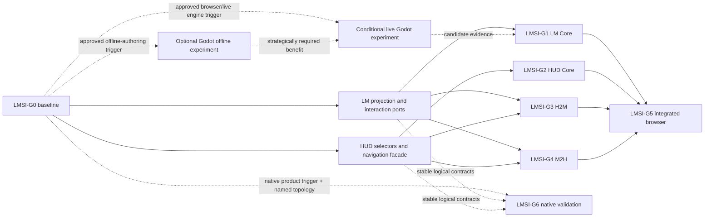

# Roadmap — Live Map Rendering and Surface Integration

**Owners:** accountable people are assigned at `LMSI-G0`; candidate owner roles are named below.  
**Decision state:** milestone plan proposed for human review; planning only.  
**Planning inputs:** [renderer architecture](../brainstorm/render-and-art/live_map_rendering_engine_architecture_proposal.md) and [surface-integration architecture](../brainstorm/render-and-art/live_map_hud_surface_integration_architecture.md).
**Detailed planning package:** [gate-aligned work packages](render-and-art/README.md).

## Table of contents

- [1. Executive summary and decision requested](#1-executive-summary-and-decision-requested)
- [2. Authority and repository planning conventions](#2-authority-and-repository-planning-conventions)
- [3. Scope and non-goals](#3-scope-and-non-goals)
- [4. Current state and existing ownership](#4-current-state-and-existing-ownership)
- [5. Capability and workstream model](#5-capability-and-workstream-model)
- [6. Dependency and parallelism model](#6-dependency-and-parallelism-model)
- [7. Program readiness gates](#7-program-readiness-gates)
- [8. Experiment and evidence placement](#8-experiment-and-evidence-placement)
- [9. Cross-plan ownership matrix](#9-cross-plan-ownership-matrix)
- [10. Requirement-to-gate traceability](#10-requirement-to-gate-traceability)
- [11. Risks, rollback, and cleanup](#11-risks-rollback-and-cleanup)
- [12. Open questions and blocking classification](#12-open-questions-and-blocking-classification)
- [13. Deferred and conditional work](#13-deferred-and-conditional-work)
- [14. Readiness and authorization boundaries](#14-readiness-and-authorization-boundaries)
- [15. Sources and contradictions](#15-sources-and-contradictions)

## 1. Executive summary and decision requested

Approve this document for **human milestone review** as the cross-plan coordination layer for player-facing Live Map rendering and HUD integration. It does not replace either source architecture or create implementation tickets.

The repository already uses milestone roadmaps backed by scope-only epics. Live Map has its own M1–M3 sequence; HUD has a different M1–M4 sequence. Reusing `M0–M5` for this initiative would create ambiguous identifiers and duplicate work. The reviewer-suggested A–G split is therefore retained as seven **readiness gates**, `LMSI-G0` through `LMSI-G6`. Existing roadmaps retain their declared delivery scope. New renderer-neutral seam, PixiJS experiment, and integration work receives owners only through later normal ticket scoping; these gates define when outputs are sufficient for the next cross-plan decision.

| Gate | Deliverable state | Nature |
|---|---|---|
| `LMSI-G0` | Planning incorporation, ownership, contract and evidence baseline | New orchestration gate |
| `LMSI-G1` | Independently ready Live Map Core and renderer decision evidence | Aggregates renderer phases and existing Live Map owners |
| `LMSI-G2` | Independently ready HUD Core | References HUD M1/M2 rather than duplicating them |
| `LMSI-G3` | Minimum H2M ready | New directional integration gate |
| `LMSI-G4` | Minimum M2H ready | New directional integration gate |
| `LMSI-G5` | Integrated browser experience ready for its next adoption decision | Cross-plan integration gate |
| `LMSI-G6` | One named native topology validated | Conditional gate, off the committed critical path |

The critical path to an integrated browser decision is `G0 → stable LM/HUD ports → {G1, G2, G3, G4} → G5`. `G1` and `G2` are parallel-compatible. `G3` and `G4` may start once both endpoints for their direction are stable, without waiting for complete `G1/G2` closure; closing either directional gate does not require the other. `G5` requires all four preceding gates to close. `G6` exists only after a native product trigger.

## 2. Authority and repository planning conventions

### 2.1 Authority

- The 39-phase authoritative mutation pipeline remains the only path to `AuthoritativeState`. This plan covers presentation and requests, never simulation mutation or visibility authorization.
- The P1 surface-integration proposal is the reviewed planning/evidence input for core independence, H2M/M2H, OBS/HRC/PREF, state ownership, freshness, failure domains, and EX-X experiments; it owns no delivery.
- The P2 renderer proposal is the reviewed planning/evidence input for candidates, protocol/presentation seams, Canvas/PixiJS/Godot evaluation, experiment governance, and renderer production gates; it remains a proposal and owns no delivery or production decision.
- Existing P1 roadmaps and their tracking epics retain delivery ownership. This plan coordinates them and records integration gaps; it does not silently supersede them.

### 2.2 Conventions applied

| Repository convention | Application here |
|---|---|
| Roadmaps connect meaningful milestone outcomes; epics own implementation scope | This file defines readiness gates and references existing epics; it creates no child tickets |
| Evidence-gated scope is not decomposed speculatively | Performance, interest management, PixiJS adoption, and native work remain gated; detailed tickets wait for their normal Scope phase |
| A completed ticket does not prove every planned measurement succeeded | Live Map reconnection is DONE, but its disclosed browser-FPS evidence gap remains an input to `G0/G1` |
| Frontmatter declares document lifecycle, not implementation progress | This plan is `active`, P1 planning authority; individual tickets remain the progress source |
| Every experiment has a pre-execution charter and retained result bundle | Gates consume only valid evidence with declared thresholds and allowed conclusions |
| Normal implementation uses the `implement-ticket` workflow | Human acceptance of this plan may authorize later ticket scoping only; it bypasses no phase or gate |
| New plan documents appear in `plans_tracking.md`; `docs/REGISTRY.yaml` is generated | Update the tracking inventory with this plan; regenerate the registry during normal incorporation/finalization rather than hand-editing it |

## 3. Scope and non-goals

In scope:

- milestone-level ownership, dependencies, parallelism, evidence, acceptance, rollback, and blocker classification;
- Live Map Core, HUD Core, H2M, M2H, and the supporting OBS/HRC/PREF/diagnostic boundaries;
- protocol/fixture/reducer/selector prerequisites;
- Canvas control, PixiJS experiment, and conditional Godot evidence;
- browser integration and conditional native validation.

Not authorized or in scope:

- implementation, dependency installation, ticket creation, estimates, renderer adoption, production migration, or Canvas removal;
- changing the HUD roadmap's information design or the Live Map scaling roadmap's evidence gates;
- expanding the first directional roster;
- selecting Unity or a native topology;
- final sprite/icon resolution, palette, style, animation system, art production, Place representation, status/effect roster, full skill roster, or faction-emblem breadth;
- duplicating the deterministic server-side QA renderer or making a client authoritative.

## 4. Current state and existing ownership

| Area | Repository state | Owner and planning effect |
|---|---|---|
| Live Map reconnection | M1 ticket and eight children are DONE; live REST/WS connection exists | Historical reconnection epic remains evidence; do not reopen its implementation |
| Browser performance evidence | Backend payload evidence exists, but the planned live-browser FPS run did not obtain live data because Chromium/resource constraints blocked it | Evidence repair is a `G0/G1` prerequisite; it does not retroactively reopen the DONE epic |
| Live Map rendering performance | M2 scope-only epic is OPEN and hard-gated on measured need | Reuse it only for justified Canvas optimization; it does not own PixiJS adoption |
| Interest management | M3 scope-only epic is OPEN, parallel to Live Map M2, gated on measured bandwidth need | Referenced data/scale owner; not automatically on the renderer critical path |
| HUD foundation | HUD M1 epic and five child tickets are OPEN | Existing owner for tokens, minimal layout, durable HUD navigation, search/ranking, and baseline measurement |
| HUD investigation | HUD M2 scope-only epic is OPEN and gated on HUD M1 | Existing owner for the notice → locate → inspect → follow → return workflow |
| HUD extraction/polish | HUD M3 and M4 scope-only epics are OPEN and strictly follow M2 then M3 | Continue under the HUD roadmap; only workflow-relevant outputs gate `G5` |
| Renderer technology | Canvas is current control/fallback; PixiJS is the next recommended experiment; Godot is conditional; Unity is not shortlisted | Renderer proposal owns design and evidence rules; later scoped tickets must assign delivery ownership |
| Batch/QA world rendering | Server-owned deterministic renderer program is separate and already planned/implemented through its own program | Reuse semantic fixtures/ideas where compatible; never conflate it with Live Map Core |
| Render tiers and art | Render tiers are P2 idea-level; manual art experiments are disposable brainstorm work | Deferred/not on the critical path; experiments cannot freeze production art |
| Architecture incorporation | Both authoritative planning inputs and this plan currently require normal worktree/repository incorporation | `G0` requires human recognition, cross-links, ownership, and generated-index handling before implementation tickets |

Verified implementation coupling remains the starting condition, not the target: `App.tsx` composes shared callbacks; `useSimulation.ts` mixes network/projection and selected/observed subject concerns; `GameCanvas.tsx`/`useCanvas.ts` combine rendering, map-local input, and direct HUD callbacks; `Sidebar.tsx` derives navigation from shared selection-like values. The source architectures define the required separation.

## 5. Capability and workstream model

| Capability/workstream | Accountable owner role at `G0` | Existing owner reused | Gate |
|---|---|---|---|
| Protocol, fixtures, reducer, store | Frontend protocol/session owner | Reconnection history plus the renderer proposal as a P2 planning/evidence input; new delivery requires later scoped ownership | `G0/G1` |
| Live Map Core | Live Map owner | Live Map roadmap for its declared scope and rendering-performance epic where measured; new seam/candidate work requires later scoped ownership | `G1` |
| HUD Core | HUD roadmap owner | HUD M1/M2 epics | `G2` |
| H2M | Cross-surface owner with HUD and map representatives | New port/adapter work; HUD workflow remains HUD-owned | `G3` |
| M2H | Cross-surface owner with map, HUD, and accessibility representatives | New port/adapter work; existing panels remain HUD-owned | `G4` |
| OBS | Protocol/security owner | Session/observation policy and server authorization | `G0`; workflow-specific proof at `G5` |
| HRC | Host/render-adapter owner | Browser host initially; native host only conditionally | `G1/G5`, then `G6` if triggered |
| PREF | Application preference/accessibility owner | HUD and map adapters consume approved preferences | `G2/G5` |
| Diagnostics/evidence | Experiment evidence owner | Existing performance and test infrastructure | Every evidence-bearing gate |

OBS, HRC, PREF, and diagnostics may share envelope or physical transport utilities. They are not H2M/M2H messages and do not pass through the interaction coordinator.

## 6. Dependency and parallelism model

The arrows from ports to `G3/G4` are implementation-entry prerequisites; they do not require all of `G1/G2` to close. The arrows into `G5` are integration-exit prerequisites.

| Dependency | Type | Effect |
|---|---|---|
| Human acceptance and incorporation of the three planning documents → later tickets | Hard prerequisite | Planning may be reviewed now; implementation ticket approval waits |
| Stable world/session/stream/map identities → live H2M and M2H | Hard prerequisite | Fixture-only contract prototypes may proceed; live acceptance may not |
| Representative Canvas/browser baseline → optimization or candidate comparison | Hard evidence prerequisite | Prevents post-result thresholds and speculative optimization |
| Protocol fixture validity and reducer seam → full PixiJS comparison | Hard prerequisite | Conditional offline authoring may run earlier; live/candidate comparison may not |
| Mandatory Canvas/PixiJS gate failure or strategically required offline Godot result → conditional live Godot | Conditional trigger | Adds an exact browser/live Variant A/B experiment under `G1`; it does not require or imply native commitment |
| Live Map Core work ↔ HUD Core work | Parallel-compatible | Shared schema/selector coordination only; neither waits for renderer/HUD completion |
| Stable LM/HUD ports → H2M and M2H | Hard prerequisite per direction | The two directional packages may then proceed in parallel |
| HUD M1 durable navigation → HUD M2 and live directional HUD adapters | Hard prerequisite | Fake-port schemas can be designed earlier; UI ownership cannot be bypassed |
| Live Map M2 and M3 | Parallel-compatible after their separate measured-need gates | Neither gates the other; M3 gates only scale scenarios that require it |
| All four capabilities + HRC + reduced-motion PREF + diagnostics, and OBS when the workflow changes observation → browser integration | Integration gate | Applicability is explicit; every included support family stays outside H2M/M2H; `G5` cannot infer native readiness |
| Native requirement + named N1/N2/N3 topology → native experiment | Conditional trigger | `G6` stays off the committed path |

## 7. Program readiness gates

### LMSI-G0 — Planning incorporation, contracts, and evidence baseline

| Field | Plan |
|---|---|
| Objective | Make ownership, contract identity, evidence rules, and existing-plan reconciliation sufficient for scoped follow-on work |
| Scope | Recognize/cross-link inputs; assign accountable people; accept component boundaries; define world/session/stream/map identities, `FocusLocation` identity, explicit-inspect gesture/focus behavior; assign numeric-budget approval and evidence-storage owners; rerun the existing live-browser baseline in a suitable environment |
| Non-goals | Runtime modules, dependency adoption, renderer choice, child-ticket backlog, final numeric production targets without evidence |
| Owner | Frontend architecture owner; protocol/security, LM, HUD, accessibility, and experiment-evidence representatives |
| Prerequisites | Human review of this plan and both source architectures; no implementation prerequisite |
| Deliverables | Accepted ownership map; reconciled protocol/interaction glossary; approved baseline charter/result location; blocker register; explicit existing-plan amendments queued through their owners where needed |
| Functional gate | No shared-selection authority, ambiguous generic bridge, or unowned first-slice field remains; OBS authorization stays server-side |
| Evidence/NFR gate | Representative baseline evidence is valid or explicitly inconclusive with a rerun owner; thresholds are typed, sourced, and fixed before candidate results |
| Tests/experiments | Protocol/fixture validity; current Canvas control; focused OBS/HRC/PREF fake-port harness design |
| Rollback/cleanup | Documentation-only: withdraw unaccepted wording; archive invalid evidence; no runtime rollback needed |
| Open blockers | `LMSI-OQ-01`, `LMSI-OQ-02`, `LMSI-OQ-04`, `LMSI-OQ-05`, and `LMSI-OQ-06` in Section 12; each blocks only its named downstream work |
| Enables | LM/HUD port work, `G1`, `G2`, and direction-specific contract/fake tests |
| Does not authorize | Implementation, renderer dependency, migration, production threshold approval, or tickets beyond a later normal scoping decision |

### LMSI-G1 — Live Map Core readiness and renderer evidence

| Field | Plan |
|---|---|
| Objective | Produce an independently testable, renderer-neutral Live Map Core and valid evidence for the next renderer decision |
| Scope | Coherent protocol/fixtures; validator, reducer, store, LM selectors; tick/frame behavior; map-local camera/hover/selection/picking/minimap; objects/entities/visibility/fallback/recovery/diagnostics/capture; LM-only harness; Canvas baseline/control; one bounded profile-guided Canvas optimization only if justified; chartered PixiJS comparison; conditional live Godot Variant A/B experiment only when the parent trigger passes |
| Non-goals | HUD content, M2H delivery, production PixiJS adoption, Canvas removal, speculative Live Map M2 work, interest-management implementation, final art |
| Owner | Live Map owner plus protocol and experiment-evidence owners |
| Prerequisites | `G0` contract/evidence baseline; live experiments also require the renderer-facing protocol seam, coherent snapshot/delta and reconnect/resync fixtures, authentication approach, and an exact comparison question; Live Map M2 starts only if its measured-need gate passes; live Godot additionally requires one [renderer-proposal Section 16.4 trigger](../brainstorm/render-and-art/live_map_rendering_engine_architecture_proposal.md#164-godot-trigger-gate) |
| Deliverables | Versioned replay corpus; renderer-neutral core seams; LM-only result; Canvas control bundle; candidate result bundle; renderer selection recommendation or retain-Canvas result |
| Functional gate | LM requirements pass with HUD absent and no-op M2H; renderer consumes projection without authority or HUD navigation dependencies |
| Evidence/NFR gate | Correctness, frame/backlog/memory/startup/payload/accessibility/recovery thresholds required by the candidate charter pass; evidence validity and per-dimension disposition recorded |
| Tests/experiments | Protocol/replay faults, EX-X01, Canvas baseline/control, bounded Canvas optimization, PixiJS EX-F/EX-P; optional Godot EX-W01 on its separate trigger; conditional live Godot when a browser/live trigger passes |
| Rollback/cleanup | Canvas remains control/fallback; delete/archive disposable candidate; disable candidate adapter; invalid evidence cannot advance |
| Open blockers | Representative browser environment and protocol identities block live comparison; scale budgets block production selection; native questions do not block |
| Enables | G1 work produces and stabilizes LM ports before gate closure so `G3/G4` may start; closed `G1` contributes to `G5` after the renderer reaches the selected browser gate |
| Does not authorize | Production renderer adoption/migration, permanent dependency, Canvas deletion, interest management, native readiness, or art freeze |

`G1` distinguishes four outcomes: fixture/protocol **done enough for an experiment**; LM harness **core ready**; a valid candidate result **decision evidence ready**; and the later parent production gate **adoption ready**. None implies the next automatically.

### LMSI-G2 — HUD Core readiness

| Field | Plan |
|---|---|
| Objective | Establish the HUD-owned investigation core against fixtures without waiting for renderer selection |
| Scope | Reuse HUD M1 thin foundation and the relevant HUD M2 investigation slice; HUD selectors/fixtures; workspace/navigation/history/inspector/filter/focus; truthful unavailable/stale/rejected states; no-op/recording H2M harness |
| Non-goals | Duplicating HUD M1–M4, renderer work, implicit camera/focus mutation, full M3/M4 completion unless the selected integration workflow requires it |
| Owner | HUD roadmap owner with accessibility and protocol-data representatives |
| Prerequisites | HUD M1 is the existing hard prerequisite for HUD M2; fixture-backed work has only a soft data-availability dependency on live-map projection repair |
| Deliverables | Stable HUD selector and navigation facade; HUD-only result bundle; explicit map-unavailable and H2M outcome presentation |
| Functional gate | HUD workflow preserves history/return context with map absent; HUD changes no map-owned camera/selection/focus unless an explicit H2M action is issued |
| Evidence/NFR gate | DOM keyboard, focus, announcement, non-hue, and failure-state tests pass; fixture provenance is recorded |
| Tests/experiments | EX-X02 plus HUD roadmap baseline and vertical-slice evidence |
| Rollback/cleanup | Recording/no-op H2M remains usable; revert integration adapter without reverting HUD navigation; retain baseline evidence |
| Open blockers | HUD M1 completion blocks live HUD M2; data-path defects block live evidence but not truthful fixture work |
| Enables | G2 work produces and stabilizes HUD ports before gate closure so `G3/G4` may start; closed `G2` contributes to `G5`; HUD M3/M4 continue under their own strict sequence |
| Does not authorize | HUD redesign beyond its roadmap, map mutation, integrated readiness, production migration, or renderer selection |

### LMSI-G3 — Minimum H2M interaction readiness

| Field | Plan |
|---|---|
| Objective | Deliver only `FocusEntity` and `FocusLocation` as independently switchable HUD-to-map requests |
| Scope | Typed port/adapter and H2M coordinator route; current target re-resolution; named outcomes; dedup/coalescing/cancellation/timeout/restart; diagnostics and no-op switch |
| Non-goals | Highlight, follow, bookmarks, OBS, HRC, PREF, renderer controls, or automatic reverse events |
| Owner | Cross-surface owner with HUD-origin and LM-destination owners |
| Prerequisites | `G0`; stable HUD explicit-action port and LM focus facade; world/session identities for live use; `FocusLocation` identity decision |
| Deliverables | Versioned two-message contract; fake/recording ports; results and diagnostics; independent enable/disable path |
| Functional gate | Explicit HUD action is the only origin; map owns applied focus/camera; every request terminates truthfully; zero automatic M2H echo |
| Evidence/NFR gate | Type-specific freshness, monotonic timeout, security, bounded queue, dedup, loop, restart, and rollback assertions pass |
| Tests/experiments | EX-X03 and the H2M half of EX-X05 |
| Rollback/cleanup | Disable H2M, expire bounded pending work, retain both cores and M2H; never blindly replay after restart |
| Open blockers | LMSI-OQ-04 blocks live identity checks; LMSI-OQ-06 blocks final `FocusLocation`; numeric latency budget blocks production exit, not fake-port correctness |
| Enables | H2M contribution to `G5`; does not wait for `G4` |
| Does not authorize | Other H2M messages, observation switching, renderer preference/control, integrated or production readiness |

### LMSI-G4 — Minimum M2H investigation readiness

| Field | Plan |
|---|---|
| Objective | Deliver only explicit `InspectEntity`, `InspectWorldObject(family=building)`, and `InspectGroundStack` intents |
| Scope | Typed port/adapter and M2H coordinator route; semantic picking source; HUD re-resolution/navigation/history/focus; named stale/missing/unsupported/unavailable/timeout behavior; independent switch |
| Non-goals | Hover or camera telemetry, implicit selection handoff, event/location/summary extensions, OBS, generic map-context stream, automatic H2M echo |
| Owner | Cross-surface owner with LM-origin, HUD-destination, and accessibility owners |
| Prerequisites | `G0`; stable LM explicit-inspect output and HUD navigation facade; gesture/focus decision; live identity fields for live use |
| Deliverables | Versioned three-message contract; fake/recording ports; picking/focus results; independent enable/disable path |
| Functional gate | Hover, camera, minimap, and map-local selection emit nothing; explicit inspect produces at most one HUD transition; HUD owns history/focus; zero H2M echo |
| Evidence/NFR gate | Pointer/keyboard accessibility, picking priority, freshness, monotonic timeout, security, dedup, restart, loop, and rollback assertions pass |
| Tests/experiments | EX-X04 and the M2H half of EX-X05 |
| Rollback/cleanup | Disable M2H and retain map-local use plus HUD Core; do not replay expired intents |
| Open blockers | LMSI-OQ-02 blocks gesture and accessibility acceptance; LMSI-OQ-04 blocks live scope identity; panel-file overlap must be coordinated with HUD M2/M3 |
| Enables | M2H contribution to `G5`; does not wait for `G3` |
| Does not authorize | Extension intents, high-rate context reporting, HUD roadmap supersession, integrated or production readiness |

### LMSI-G5 — Integrated browser experience

| Field | Plan |
|---|---|
| Objective | Prove the two cores, both minimum directions, and only workflow-required support families together in the browser |
| Scope | Four-capability composition; required OBS/HRC/PREF adapters; one reduced store with separate selectors; six modes; reconnect/resync, partial failure, coordinator restart, accessibility, security, diagnostics, Canvas fallback and directional rollback |
| Non-goals | Native readiness, optional messages, full HUD roadmap unless selected workflow requires it, final art, Canvas removal, automatic production rollout |
| Owner | Frontend release/integration owner with LM, HUD, protocol/security, accessibility, and operations representatives |
| Prerequisites | `G1–G4`; an explicit support-family applicability record; HRC, reduced-motion PREF and diagnostics evidence; OBS evidence only when the workflow changes observation; and `G5-DR-01` naming an EX-X07 renderer. Canvas requires a retain-Canvas G1 disposition plus G5-charter control thresholds; PixiJS/live Godot requires the [renderer-proposal Section 16.3 browser/live gate](../brainstorm/render-and-art/live_map_rendering_engine_architecture_proposal.md#163-browserlive-experiment-passfail-gates). This selects a test candidate, not production technology |
| Deliverables | Integrated result bundle, compatibility matrix, failure/recovery evidence, rollback rehearsal, recommendation to retain/revise/proceed to a separately approved adoption decision |
| Functional gate | All six modes pass; each core remains useful with the other/directions unavailable; authoritative/visibility rules hold |
| Evidence/NFR gate | Parent browser platform/performance gates plus cross-surface latency, queue, accessibility, security, observability, and recovery thresholds pass |
| Tests/experiments | EX-X06 and EX-X07; scoped renderer production evidence from the parent proposal |
| Rollback/cleanup | Independently disable H2M/M2H, restore Canvas control, remove candidate artifact if rejected, preserve HUD/map context truthfully |
| Open blockers | `LMSI-OQ-05`, `LMSI-OQ-10`, and `LMSI-OQ-11` block production-facing exit; unfinished HUD or scale work blocks only workflows/scenarios that consume it |
| Enables | Human production-adoption decision; may supply reusable contract evidence to `G6` but does not trigger it |
| Does not authorize | Production migration, Canvas deletion, native claims, optional contract expansion, or art production |

### LMSI-G6 — Conditional native topology validation

| Field | Plan |
|---|---|
| Objective | Validate one exact approved N1, N2, or N3 native deployment question without generalizing browser evidence |
| Scope | Named process/topology; WebView/CEF/plugin/IPC ownership; build/startup/package; focus/input/accessibility; bridge copy/queue/drift; auth/security; scene/reducer/WebView/bridge/whole-host faults; recovery/update/diagnostics/rollback |
| Non-goals | Generic native readiness, comparing every topology, choosing Godot merely because this gate exists, production native migration, HUD rebuild |
| Owner | Product/release native sponsor plus native experiment, security, operations, LM, and HUD owners |
| Prerequisites | Native is an approved product scenario; exact topology and owner are named; topology-specific charter exists; shared logical contracts are stable |
| Deliverables | Reproducible build and topology map; raw result bundle; exact pass/fail/inconclusive disposition and cost/ownership recommendation |
| Functional gate | Only declared topology guarantees pass; N1 explicitly loses embedded HUD on whole-host crash |
| Evidence/NFR gate | Predeclared build/startup/copy/drift/security/recovery/accessibility budgets pass on target environment |
| Tests/experiments | EX-X08; conditional live Godot experiment if Godot and that topology are the approved question |
| Rollback/cleanup | Remove/archive disposable native artifacts and dependencies; restore prior host; retain result bundle |
| Open blockers | `LMSI-OQ-09` blocks the entire gate; `LMSI-OQ-05`, `LMSI-OQ-10`, and `LMSI-OQ-11` block its budget, diagnostics, and compatibility exits |
| Enables | A human decision about that exact native mapping only |
| Does not authorize | Another topology, Unity/Godot production selection, production migration, browser replacement, or art freeze |

## 8. Experiment and evidence placement

Detailed experiment contracts remain in the two source architectures. Every row below requires an approved pre-run charter, valid fixture/control, predeclared functional or numeric thresholds, raw retained evidence, allowed/prohibited conclusions, pass/fail/inconclusive classification, and cleanup/rollback.

| Evidence family | Gate | Question and entry prerequisite | Fixture/workload, predeclared threshold, and retained evidence | Allowed effect; failure/inconclusive handling and cleanup |
|---|---|---|---|---|
| Protocol/fixture validity | `G0/G1` | Can one coherent versioned replay drive current and candidate reducers? Entry: identity/schema owner assigned | Snapshot/delta/gap/resync/restart corpus; every required replay assertion passes; retain schemas, logs, and hashes | Enables live renderer work; any failed assertion blocks it; invalid/incomplete corpus is inconclusive and archived/rebuilt |
| Canvas browser baseline | `G0/G1` | What does the current control actually cost? Entry: suitable browser/hardware and approved scenarios | Native-scale normal/crowded/soak traces; all predeclared capture-validity fields/repetitions must exist; retain raw frame/backlog/memory/payload distributions | Establishes control evidence, not product truth; invalid run is inconclusive and rerun, never an optimization trigger |
| Bounded Canvas optimization | `G1` | Can a measured Canvas bottleneck be corrected cheaply? Entry: valid baseline/profile and approved time/scope bound | Same fixture before/after; semantic non-regression plus the predeclared improvement target must pass; retain profiles and patch notes | Informs retain/compare only; fail or inconclusive restores the control and archives evidence |
| PixiJS EX-F/EX-P | `G1` | Does PixiJS add enough measured value to justify its cost? Entry: valid protocol/reducer seam, Canvas control, and charter | Identical semantic/platform/performance/accessibility/recovery workloads; every Must and charter numeric threshold passes; retain raw bundle/build manifest | Produces experiment disposition only; fail/inconclusive removes or archives dependency/artifact and cannot authorize adoption |
| Optional Godot EX-W01 | `G0/G1` side branch | Does offline authoring/capability merit later study? Entry: approved workflow trigger, owner, charter, and recorded fixture | Disposable content slice; declared workflow/capability subset and reproducible build/capture must pass; retain workflow/build evidence | Authoring evidence only; fail/inconclusive deletes or archives project and makes no live/native claim |
| Conditional live Godot | `G1`, or `G6` for a native topology question | Can an exact Godot Variant A/B answer the approved browser/live or native question? Entry: native desktop is a committed Must, optimized Canvas/PixiJS failed a mandatory gate, or EX-W01 showed a strategically required benefit; plus protocol seam, coherent snapshot/delta/reconnect fixtures, authentication approach, owner, charter, and named A/B question | Browser/host or topology-specific protocol, bridge-or-dual-client, drift, reconnect, build/export, compatibility and fault workload; all declared functional/numeric thresholds pass; retain raw bundle and manifest | Evidence applies only to the named mapping and question; fail/inconclusive removes or archives the disposable project and cannot advance production or imply native readiness |
| EX-X01 / EX-X02 | `G1/G2` | Are LM and HUD independently ready? Entry: respective selectors, fixtures, and fake/no-op ports | LM replay/input and HUD investigation/accessibility fixtures; all respective Must assertions and zero-dependency checks pass; retain traces/results | Closes only the corresponding core gate; fail/inconclusive leaves the other track unaffected and resets fixture state |
| EX-X03 / EX-X04 | `G3/G4` | Is the minimum directional roster correct? Entry: stable origin/destination ports and first-slice schemas | First-slice semantic/freshness/failure cases; every case yields its declared transition/result with zero echo; retain state diffs/traces | Closes only its direction; fail/inconclusive disables that adapter, expires pending work, and retains both cores |
| EX-X05 | `G3/G4` | Are coordinator routes loop-free, restart-safe, bounded, and reversible? Entry: direction routes, fake endpoints, and monotonic fake clock | Duplicate/reorder/loss/restart workload; zero loops/duplicate applies and all pending work terminates within predeclared bounds; retain causation/pending timelines | Supports each passing direction; fail/inconclusive restarts/disables only the affected route |
| EX-X06 | `G0/G5` | Are OBS/HRC/PREF separate and correct? Entry: family schemas, owners, and fake policy/renderer/surface endpoints | Authorization/projection, lifecycle/DPR, and preference-version fixtures; every family requirement passes with zero H2M/M2H traffic; retain family traces | Advances only tested family; fail/inconclusive resets that adapter, and cross-routing is a hard failure |
| EX-X07 | `G5` | Does integrated browser behavior preserve all four capabilities? Entry: `G1–G4` plus required OBS/HRC/PREF readiness | Six modes, faults, accessibility, security, traces, rollback; every applicable Must and predeclared browser threshold passes; retain mode matrix/raw bundle | Supports a later adoption review only; fail/inconclusive restores Canvas, disables directions, and cannot imply native readiness |
| EX-X08 | `G6` | Does one named native topology meet its guarantees? Entry: native trigger, exact N1/N2/N3 mapping, owner, and charter | Target environment plus bridge/copy/drift/security/five failure domains; every topology guarantee and predeclared threshold passes; retain build/topology/raw bundle | Applies only to that mapping; fail/inconclusive removes or archives artifact and cannot generalize or authorize production |

Manual pixel-art experiments remain under the art handoff. They may supply readability evidence to renderer fixtures, but are not renderer-selection or integration gates and freeze no production specification.

## 9. Cross-plan ownership matrix

| Work | Owning source | Relationship to this plan |
|---|---|---|
| Renderer candidates, protocol/presentation seam, Canvas/PixiJS/Godot experiments, renderer production gates | [Renderer architecture proposal](../brainstorm/render-and-art/live_map_rendering_engine_architecture_proposal.md) | P2 planning/evidence input; new delivery requires a later scoped owner; feeds `G0/G1/G5/G6` |
| Surface independence, H2M/M2H, OBS/HRC/PREF, freshness, failure domains, EX-X | [Surface-integration architecture](../brainstorm/render-and-art/live_map_hud_surface_integration_architecture.md) | P1 planning/evidence input; H2M/M2H/control-family delivery requires later scoped owners; feeds every integration gate |
| Reconnected REST/WS foundation | [Historical plan](live_map_reconnection_epic.md) and [DONE epic](../../tickets/done/live-map-reconnection/TCK-20260821-EPIC-LIVE-MAP-RECONNECTION.md) | Completed reusable prerequisite with disclosed evidence gap |
| Canvas scaling optimization | [Live Map roadmap M2](live_map_scaling_roadmap.md) and [rendering-performance epic](../../tickets/todos/live-map-rendering-performance/TCK-20260821-EPIC-LIVE-MAP-RENDERING-PERFORMANCE.md) | Conditional measured-need owner; parallel-compatible with M3 |
| Server interest management | [Live Map roadmap M3](live_map_scaling_roadmap.md) and [interest-management epic](../../tickets/todos/live-map-interest-management/TCK-20260821-EPIC-LIVE-MAP-INTEREST-MANAGEMENT.md) | Conditional data-scale owner; hard only for scenarios whose bandwidth gate requires it |
| HUD foundation and investigation | [HUD roadmap M1/M2](hud_delivery_roadmap.md), [M1 epic](../../tickets/todos/hud-design-system-foundation/TCK-20260822-EPIC-HUD-DESIGN-SYSTEM-FOUNDATION.md), and [M2 epic](../../tickets/todos/hud-core-panel-wiring/TCK-20260822-EPIC-HUD-CORE-PANEL-WIRING.md) | Hard delivery owner for `G2` and HUD sides of `G3/G4` |
| HUD extraction, remaining panels, and measurement | [HUD roadmap M3/M4](hud_delivery_roadmap.md), [M3 epic](../../tickets/todos/hud-contextual-panel-wiring/TCK-20260822-EPIC-HUD-CONTEXTUAL-PANEL-WIRING.md), and [M4 epic](../../tickets/todos/hud-content-polish-measurement/TCK-20260822-EPIC-HUD-CONTENT-POLISH-MEASUREMENT.md) | Continues under its strict sequence; integration dependency only for consumed workflows |
| Deterministic batch/QA renderer | [World rendering core program](world_rendering_core_epic.md) | External owner; semantic-fixture/parity validation input only, with no client-architecture or pixel-identity implication |
| Render tiers | [P2 Canvas render-tier idea](idea_frontend_canvas_render_tiers.md) | Deferred; cannot become committed scope through this plan |
| Visual language and drawing practice | [Visual-system planning](../brainstorm/render-and-art/visual-system-planning.md), [manual experiment Plan 07](render-and-art/07_manual_art_experiment_execution_plan.md), and [program review handoff](../brainstorm/render-and-art/render-and-art-review-handoff.md) | Deferred/not critical path; renderer tests keep final art unfrozen |
| Ownership map, cross-plan gates, blocker routing, and integration evidence placement | This plan | New orchestration work only |

## 10. Requirement-to-gate traceability

| Requirement family | Gate(s) | Evidence |
|---|---|---|
| Parent FR-01–15, 17–20 and renderer NFR/eligibility gates | `G1`, production subset again at `G5` | Protocol/replay, EX-F/EX-P, Canvas/candidate bundles |
| Parent FR-16 and FR-21 | `G3–G5` | Directional and separated-family harnesses |
| Companion LM-FR and LM-relevant XS-NFR | `G1` | EX-X01 plus renderer evidence |
| Companion HUD-FR and HUD-relevant XS-NFR | `G2` | EX-X02 plus HUD roadmap evidence |
| H2M-FR | `G3` | EX-X03 and EX-X05 |
| M2H-FR | `G4` | EX-X04 and EX-X05 |
| OBS-FR, HRC-FR, PREF-FR | `G0` ownership; workflow-relevant acceptance at `G5`; topology-specific HRC again at `G6` | EX-X06 and topology harnesses |
| Cross-surface security, accessibility, failure recovery, observability, and rollback | `G3/G4` independently, `G5` integrated, `G6` conditional | Contract, fault, security, accessibility, trace, and rollback bundles |

## 11. Risks, rollback, and cleanup

| Risk | Control | Rollback/cleanup |
|---|---|---|
| New plan duplicates or silently overrides active epics | Readiness gates reference existing owners and preserve their numbering | Remove the orchestration reference; existing roadmaps remain intact |
| Missing browser baseline drives speculative optimization | `G0` requires valid representative evidence before measured-need scope | Classify inconclusive and rerun; do not start Live Map M2 or candidate adoption |
| Candidate demo becomes de facto dependency | Disposable experiment boundary and prohibited-conclusion field | Delete/archive candidate code and dependency; Canvas stays unchanged |
| Shared store becomes shared interaction authority | Separate selectors/state owners/ports and loop sentinels | Disable direction; restore no-op port; projection remains read-only |
| HUD roadmap and integration edit the same navigation files | Assign one file/workflow owner and sequence overlapping ticket scopes at `G0` | Pause integration adapter ticket, retain fixture contract, let owning HUD ticket land first |
| OBS leaks visibility through optimistic UI | Server validation and distinct projection transition evidence | Reject request, retain last valid projection marked truthfully, re-auth/resync |
| Native logical independence is mistaken for process survival | Topology-specific guarantees; explicit N1 whole-host loss | Reject claim and experiment result; choose a different topology only through a new charter |
| Experiments freeze art or optional contracts | Semantic fixtures and explicit prohibited conclusions | Discard disposable visuals/APIs; return decision to art or extension owner |
| Dual renderer paths persist indefinitely | Candidate charter and production gate require fallback expiry owner | Keep Canvas default until adoption decision; later cleanup requires separate approval |

## 12. Open questions and blocking classification

| ID | Decision and evidence owner | Exact blocker |
|---|---|---|
| `LMSI-OQ-01` | Name accountable people for projection, LM, HUD, H2M, M2H, OBS, HRC/PREF, accessibility, evidence | Blocks implementation-ticket approval; not human review of this plan |
| `LMSI-OQ-02` | HUD/LM UX and accessibility owners choose explicit inspect gesture versus map-local selection | Blocks `G4` live implementation/acceptance only |
| `LMSI-OQ-03` | Protocol/security owner chooses the concrete OBS client/port | Blocks OBS implementation and OBS-consuming `G5` workflow only |
| `LMSI-OQ-04` | Protocol owner defines stable world/session/stream/map identities and projection transition | Blocks live `G3/G4`, live renderer consistency, and OBS transition tests; not fixture-only prototypes |
| `LMSI-OQ-05` | Product/performance/operations owners approve latency, payload, queue, rate, copy, and drift budgets before runs | Blocks production-facing `G1/G5/G6` exits; not functional fake-port tests |
| `LMSI-OQ-06` | Map schema and HUD workflow owners choose `FocusLocation` identity | Blocks final `FocusLocation` schema and `G3`; not `FocusEntity` contract work |
| `LMSI-OQ-07` | HUD evidence determines whether return context needs a map bookmark | Blocks deferred `RestoreMapView` only |
| `LMSI-OQ-08` | HUD evidence identifies a real consumer for bounded map-context reporting | Blocks optional context port only |
| `LMSI-OQ-09` | Product/release declares whether native is required and names one N1/N2/N3 question | Blocks `G6` only |
| `LMSI-OQ-10` | Operations/privacy approves diagnostic redaction, retention, sampling, and cardinality | Blocks production observability at `G5/G6`; development harnesses use sanitized fixtures |
| `LMSI-OQ-11` | Deployment/protocol owner defines version rollout across cached browser/conditional native clients | Blocks production compatibility exit, not isolated contracts |
| `LMSI-OQ-12` | Suitable browser/hardware owner reruns the existing live render-timing harness | Blocks evidence-based Canvas optimization and comparative `G1` conclusions |

No open question blocks human review of this milestone plan. `G0` owns routing and resolution before the affected implementation work.

## 13. Deferred and conditional work

- H2M highlight, follow, and restore-view/bookmark extensions.
- M2H location, event context, accessible map summary, and any bounded map-context query.
- Effect-density and other unapproved preferences.
- Player-facing render tiers and automated tier choice.
- Interest management unless measured bandwidth and a product scenario require it.
- Godot offline authoring unless its workflow trigger is approved; live Godot unless its stronger trigger is approved.
- Unity unless platform, staffing, licensing, or capability evidence materially changes.
- Any native commitment before `LMSI-OQ-09` is resolved.
- Production renderer migration, Canvas removal, independent release topology, and process-separated availability.
- Final art direction and content-specific visual rosters.

## 14. Readiness and authorization boundaries

| State | Meaning | Does not mean |
|---|---|---|
| Done enough for next experiment | Valid prerequisite seam/fixture and approved charter exist | Core ready or candidate selected |
| Core ready | LM or HUD passes independently with fake/no-op opposite ports | Directions or integrated product ready |
| Direction ready | One minimum H2M or M2H contract passes independently | Other direction or integrated product ready |
| Integrated browser ready | `G1–G5` evidence supports the next human adoption decision | Automatic production rollout or native readiness |
| Production adoption ready | A later decision satisfies all parent production conditions, operations, security, ownership, and rollback gates | Canvas may be removed without a separate cleanup approval |

**Plan verdict: Ready for human milestone review.** Acceptance authorizes only refinement/approval of this milestone structure and later normal ticket scoping. It does not authorize implementation, dependency adoption, renderer migration, production rollout, Canvas removal, native delivery, or art freeze.

## 15. Sources and contradictions

### Sources consulted

- `AGENTS.md`, frontmatter/registry guidance, and `docs/plans/plans_tracking.md`
- the two architecture proposals named at the top of this plan
- `docs/plans/live_map_scaling_roadmap.md` and historical reconnection plan/ticket
- active Live Map rendering-performance and interest-management epics
- `docs/plans/hud_delivery_roadmap.md`, HUD foundation plan, and active HUD M1–M4 epics/tickets
- `docs/plans/idea_frontend_canvas_render_tiers.md`
- server-owned world-rendering plan and the render/art overview and experiment handoff

### Contradictions and smallest reconciliations

| Tension | Resolution in this plan |
|---|---|
| Reviewer A–G milestone names collide with two established M1-based roadmaps | Use `LMSI-G0–G6` cross-plan readiness gates; existing roadmap milestones keep their names and owners |
| Live Map M1 is DONE, but its browser-FPS criterion was inconclusive | Preserve DONE status; make evidence repair a new `G0/G1` prerequisite rather than reopening history |
| Live Map M2 forbids third-party/WebGL migration while the renderer proposal recommends a PixiJS experiment | Keep M2 as Canvas optimization only when measured; run PixiJS as a separate disposable experiment and require a later ADR before any adoption |
| HUD roadmap says Live Map is separate/no file overlap, while H2M/M2H need integration | Preserve independent core work; put cross-surface ports in `G3/G4` with explicit ownership and file-scope coordination |
| HUD foundation prose can be read as HUD ownership of camera/one durable shared selection | Interpret durable HUD state as HUD investigation/return context; Live Map owns applied camera and map-local selection, changed only through explicit H2M |
| HUD roadmap says `/state` supplies full data, while checked architecture evidence records a minimal endpoint mismatch | Permit fixture-backed HUD progress; require current protocol verification/repair before live data acceptance |
| HUD M1 epic has stale wording that M3 is independent of M2, while the current HUD roadmap and M3 epic say M2 → M3 | Follow the current roadmap/M3 evidence; reconcile the stale related-ticket line through the HUD owner before affected ticket scoping |
| P2 render-tier idea says reconnection is open, but the reconnection epic is now DONE | Treat that status statement as stale; reuse only its still-unfrozen tier ideas |
| Server QA renderer and Live Map both use “rendering” language | Preserve separate ownership; reuse semantic fixtures/contracts only where explicitly compatible |

No contradiction required modifying either architecture proposal. The unresolved items above are routed to `G0` or their exact downstream gate rather than treated as global blockers.
