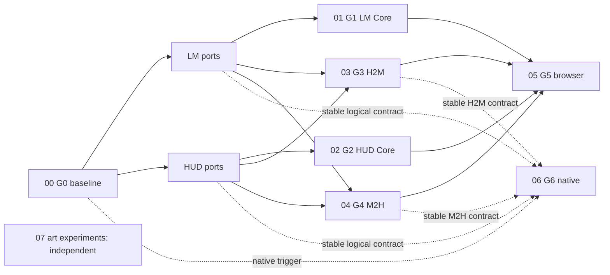

# Live Map Rendering and Surface Integration — Detailed Plan Package

This package refines the cross-plan readiness gates in the
[milestone plan](../live_map_rendering_and_surface_integration_milestone_plan.md) into work packages that
can later enter normal ticket scoping. It remains planning-only: no file here authorizes implementation,
dependency installation, renderer adoption, production migration, Canvas removal, native delivery, or
final art production.

The [three-epic full-delivery roadmap](../../brainstorm/render-and-art/three_epic_full_delivery_roadmap.md) coordinates this package with
the Aseprite capability and visual asset management/runtime integration packages. It does not change this
package's gate ownership or sequencing.

## Package map

| Order | Plan | Gate or track | Entry |
|---:|---|---|---|
| 0 | [Contract and evidence baseline](00_contract_and_evidence_baseline_plan.md) | `LMSI-G0` | Human acceptance of the milestone structure |
| 1 | [Live Map Core and renderer evidence](01_live_map_core_and_renderer_evidence_plan.md) | `LMSI-G1` | Approved G0 contracts and evidence rules |
| 2 | [HUD Core readiness](02_hud_core_readiness_plan.md) | `LMSI-G2` | Existing HUD M1 sequencing plus fixture contract |
| 3 | [HUD-to-map focus](03_h2m_focus_interaction_plan.md) | `LMSI-G3` | Stable HUD origin and map destination ports |
| 4 | [Map-to-HUD inspection](04_m2h_inspection_interaction_plan.md) | `LMSI-G4` | Stable map origin and HUD destination ports |
| 5 | [Integrated browser validation](05_integrated_browser_validation_plan.md) | `LMSI-G5` | G1–G4 and required OBS/HRC/PREF evidence |
| 6 | [Conditional native validation](06_conditional_native_validation_plan.md) | `LMSI-G6` | Approved native Must and one named topology |
| P | [Manual art experiments](07_manual_art_experiment_execution_plan.md) | Parallel, non-production | Manual-session capacity and current-gate stress set |

## Dependency shape

G1 and G2 can run in parallel. G3 and G4 can begin when both ports for their own direction are stable;
they do not wait for complete G1/G2 closure and do not wait for each other. G5 requires all four gates.
G6 is outside the committed path and also requires stable logical contracts. Manual art experiments are
independent. Their captures may be reused as native-scale readability fixtures, but renderer work must also
accept current or synthetic fixtures and cannot depend on completion of the art plan.

## Shared rules

- The server and 39-phase authoritative mutation pipeline remain authoritative. Client code consumes
  projections and issues requests; it never invents simulation outcomes or visibility.
- Canvas stays the control and rollback route through every browser experiment and until a separately
  approved cleanup decision.
- PixiJS is the next browser experiment, not a selected production dependency.
- Godot work requires its exact offline, live-browser, or native trigger. Unity remains unshortlisted.
- H2M and M2H are separate, independently switchable capability families.
- OBS, HRC, PREF, and diagnostics remain outside the interaction coordinator.
- Experiments require an approved charter before execution and retain raw evidence plus a bounded
  pass/fail/inconclusive result.
- Existing HUD and Live Map roadmaps retain their declared work. These plans describe only new seams,
  cross-plan coordination, or evidence needed to close LMSI gates.

## Ticket-scoping rule

The work-package IDs below are planning handles, not tickets. A future ticket may take one handle or a
smaller vertical slice after the repository's Scope and Investigate phases confirm file ownership,
conflicts, tags, tests, and acceptance criteria. Evidence-gated or conditional packages must not be
pre-created as implementation tickets before their entry condition passes.

## Sources

- [Milestone plan](../live_map_rendering_and_surface_integration_milestone_plan.md)
- [Renderer architecture](../../brainstorm/render-and-art/live_map_rendering_engine_architecture_proposal.md)
- [Surface-integration architecture](../../brainstorm/render-and-art/live_map_hud_surface_integration_architecture.md)
- [HUD roadmap](../hud_delivery_roadmap.md)
- [Live Map scaling roadmap](../live_map_scaling_roadmap.md)
- [Render and art program review handoff](../../brainstorm/render-and-art/render-and-art-review-handoff.md)
