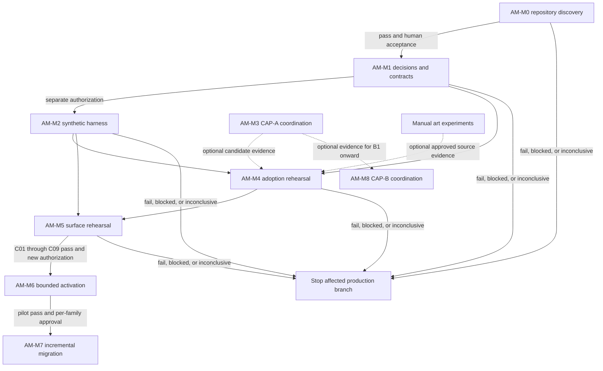

# Visual Asset Management and Runtime Integration — Draft Milestone Plan Package

## Status update 2026-10-02

The physical home for the store and the drawing tools is chosen and partly built: see
[`../visual-asset-foundation/README.md`](../visual-asset-foundation/README.md) (structure, layering, decisions D1-D7) and
`docs/architecture/visual_asset_foundation_adr.md`. Built so far: `visual_assets/drawing/` (the Aseprite tools, moved from the
spike) and empty `visual_assets/store/` / `visual_assets/catalog/` skeletons. The foundation is planned to implement minimal
first versions of `AM1-W02`, `AM1-W05`, `AM1-W12` and mechanisms for `AM4-W01`..`W10` on synthetic fixtures (children 2-6, not yet
filed). Nothing here is activated; `AM1-W01`, `W03`, `W04`, `W06`-`W11`, `W13` and `AM-M5`..`M7` remain open.

## Status update 2026-10-03

The foundation's children 1-6 are built (`TCK-20261002-EPIC-VISUAL-ASSET-FOUNDATION`; see `docs/assets/store_contract.md`): typed records and identities
(`AM1-W02`, `AM1-W05`, `AM1-W12`), intake with an independent validator, human-gated adoption and revocation, a provenance chain the audit can rebuild, sandboxed
build to pixel-hashed artifacts, immutable release CANDIDATES, `verify`, `gc`, and read-only MCP store tools, all on synthetic fixtures and with
`REHEARSAL_ONLY` evidence. Nothing is activated. Still open: `AM1-W01` (deployment profile), `W03`, `W04`, `W06`-`W11`, `W13` and `AM-M5`..`M7`.

## Status update 2026-10-03 (decisions by the user)

- `AM1-W01` / `AM-DR-05` / `AM-C01` profile choice: **Profile A** (build-coupled frontend assets), ADR `D8`. Profile B is not built.
- `AM1-W08` / `AM-U09` for Profile A: **no signing**; integrity is the `pixels-v1` hash plus the hash-linked provenance chain, authenticity is
  git review plus the normal frontend deployment (ADR `D9`).
- Batch `TCK-20261003-EPIC-VISUAL-ASSET-HARDENING-AND-REHEARSAL` (folder
  `agent-working/tickets/todos/visual-asset-hardening-and-rehearsal/`): local real-Aseprite evidence, budgets (`AM-U08` proposal), a
  minimal runtime manifest export (proposal 9.3) and an isolated `AM-M5` surface rehearsal on synthetic fixtures. The user authorized this
  `AM-M5` rehearsal on 2026-10-03; it changes no normal Live Map, HUD or simulation path.
- `AM-M6` and `AM-M7` stay **dormant**: there is no adopted art and no human-selected role, and each needs its own authorization.

## Status update 2026-10-03 (hardening and isolated rehearsal)

Batch `TCK-20261003-EPIC-VISUAL-ASSET-HARDENING-AND-REHEARSAL` is built. Profile A (D8), no signing (D9) and local-only real Aseprite (D10) are recorded in the ADR; budgets are
measured and `PROPOSED` at the time (`docs/assets/budgets.md`; approved 2026-10-04, see the status update below); the minimal runtime manifest and `export-runtime` exist; and the user-authorized **isolated `AM-M5`
rehearsal** ran on synthetic fixtures with the normal Live Map, HUD and simulation untouched. Result (`docs/assets/surface_rehearsal_result.md`): overall `INCONCLUSIVE`;
`AM5-W01`, `W02`, `W04`, `W06`, `W08` `PASS` within their stated scope; `W03`, `W05`, `W07` `INCONCLUSIVE`; `W09` `BLOCKED`; gates `AM-C05` and `AM-C07` `INCONCLUSIVE`, `AM-C06` and
`AM-C09` `BLOCKED`. `AM-M6` and `AM-M7` stay dormant; no gate toward activation passed.

## Status update 2026-10-04 (decisions by the user)

- `U-05`: every row of `docs/assets/budgets.md` approved by the owner on PR #309; retention stays the one unset row.
- Batch `TCK-20261004-EPIC-VISUAL-ASSET-PILOT-READINESS` (folder `agent-working/tickets/todos/visual-asset-pilot-readiness/`) filed to make
  `AM-M6` *ready to authorize*: one real **terrain** tile adopted by the user (the pilot role kind the user chose; planner recommends Forest),
  the `AM-M5` gaps closed for that role, retention and rollback, an M5 rerun and an `AM6-W01` charter **draft**.
- `AM-M6` execution stays `NO-GO` until the user signs the charter and gives a new explicit authorization. `AM-M7` stays dormant.

### Results 2026-10-04 (ticket batch closed)

One real terrain tile (`terrain.forest`) was adopted by the owner and is in release candidate `pilot/rc-0001`; the `AM-M5` gaps for it were rerun on commit `401921bdd`: `W03`, `W07` (within the approved matrix) `PASS`, `W05`, `W09`, `C05`, `C06`, `C07`, `C09` `INCONCLUSIVE`, overall `INCONCLUSIVE`
(`docs/assets/surface_rehearsal_result.md`). Retention is approved (30 days, local only) and a rollback drill exists (`docs/assets/retention_and_rollback.md`). A charter **draft** is at `docs/assets/pilot_charter_am6.md`, marked not an authorization.
`AM-M6` stays `NO-GO` (M1 open items, no M2 or M4 `PASS` record, M5 not `PASS`, no signed charter, no authorization); `AM-M7` stays dormant.

## Status and authorization boundary

This package translates the P2
[visual asset management proposal](../../brainstorm/render-and-art/asset_management_and_runtime_integration_proposal.md)
into conditional, reviewable milestone scopes. It is **GO for planning only** and **NO-GO for execution**.
It does not authorize `ASSET-0` execution, implementation, dependency installation, Aseprite or MCP use,
asset creation or adoption, build/release activity, renderer changes, or runtime activation.

The plans are hypotheses until a normal ticket workflow re-investigates the then-current repository. Plan
handles are not tickets. No later milestone inherits authority from an earlier milestone's result.

## Authority and cross-plan ownership

| Concern | Primary owner | This package's relationship |
|---|---|---|
| Asset adoption, build, semantic resolution, release and rollback | This package after human approval | Defines the candidate-to-runtime bridge |
| Live Map renderer and Canvas/PixiJS/Godot evidence | [Live Map/Surface package](../render-and-art/README.md) | Consumes stable renderer ports and native-scale harnesses; does not select a renderer |
| HUD workflow and surface independence | [Live Map/HUD architecture and plans](../render-and-art/README.md) | Supplies surface-specific asset consumption/fallback contracts; does not redesign HUD |
| Manual visual decisions | [Manual art experiment plan](../render-and-art/07_manual_art_experiment_execution_plan.md) | Reuses its human criteria; never promotes experiment passage automatically |
| Supervised Aseprite capability and display-harness seam | [Aseprite package](../aseprite-mcp-pixel-art/README.md) | M3 coordinates only; CAP-A remains independently deliverable |
| Adaptive feedback/reuse | [Aseprite B0–B3 plans](../aseprite-mcp-pixel-art/README.md) | M8 references their existing order and gates; does not duplicate them |
| Simulation mutation and truth | [Authoritative pipeline](../../engine/authoritative_pipeline.md) | Asset systems are presentation-only and never mutate `AuthoritativeState` |

If wording conflicts, the primary owner in this table governs its concern. The asset proposal governs this
package's lifecycle vocabulary; P1 Live Map/HUD plans govern their established surface gates; existing CAP
plans govern drawing and adaptive capability.

## Repository evidence baseline

Verified for this draft on 2026-09-10:

- the frontend uses React, TypeScript, and Vite 7; `npm run build` runs `tsc -b && vite build`;
- `vite.config.ts` declares no production asset manifest, PWA/Service Worker, deployment, or public-base policy;
- no application Service Worker/offline-cache implementation or production frontend deployment workflow
  was found;
- the current Live Map draws Canvas primitives and defines a 16-pixel map cell;
- no runtime sprite resolver, semantic asset registry, `.aseprite` source tree, or production pixel-art
  layout was found;
- `frontend/dist/` is ignored; `.gitattributes` declares no project-specific Git LFS/binary-art policy;
- renderer-neutral presentation and semantic visual definitions are planning concepts, not current frontend
  implementation;
- exact deployment topology, ownership, supported clients, asset storage, binary policy, and release
  authority remain `UNVERIFIED`.

M0 must recheck these facts against its own repository revision. It selects neither deployment profile.

## Milestone map

| Order | Plan | Primary scope | Scheduling state |
|---:|---|---|---|
| 0 | [Repository-grounded discovery](00_repository_grounded_discovery_plan.md) | Evidence for `ASSET-0` / `AM-C01` | Planning-only committed path; selects no profile |
| 1 | [Architecture decisions and contracts](01_architecture_decisions_and_contracts_plan.md) | Resolve `ASSET-0`; `AM-C01` | Conditional on accepted M0 evidence |
| 2 | [Synthetic contract harness](02_synthetic_contract_harness_plan.md) | `ASSET-1`; `AM-C02` plus evidence toward C05–C07/C09 | Requires separate implementation authorization |
| 3 | [Experimental drawing capability coordination](03_experimental_drawing_capability_plan.md) | Existing `CAP-A` plan linkage | Independent; no production dependency |
| 4 | [Candidate adoption rehearsal](04_candidate_adoption_rehearsal_plan.md) | `ASSET-2`; `AM-C03`, C04, C08 | Disposable; creates no adopted state |
| 5 | [Surface compatibility rehearsal](05_surface_compatibility_rehearsal_plan.md) | `ASSET-3`; C05–C07 plus pre-pilot C09 | Isolated Live Map/HUD harness only |
| 6 | [Bounded activation pilot](06_bounded_activation_pilot_plan.md) | `ASSET-4`; `AM-C10` | Dormant until C01–C09 pass and new authorization |
| 7 | [Incremental migration](07_incremental_migration_plan.md) | `ASSET-5`; affected gates rerun | Optional and evidence-dependent |
| 8 | [Adaptive improvement coordination](08_adaptive_improvement_plan.md) | Existing B0 → B1 → B2 → B3 / `CAP-B` | Independent optional branch |

## Conditional dependency graph

```mermaid
flowchart TD
    M0[AM-M0 repository discovery]
    M1[AM-M1 decisions and contracts]
    M2[AM-M2 synthetic harness]
    M3[AM-M3 CAP-A coordination]
    M4[AM-M4 adoption rehearsal]
    M5[AM-M5 surface rehearsal]
    M6[AM-M6 bounded activation]
    M7[AM-M7 incremental migration]
    M8[AM-M8 CAP-B coordination]
    MANUAL[Manual art experiments]
    STOP[Stop affected production branch]

    M0 -->|pass and human acceptance| M1
    M1 -->|separate authorization| M2
    M1 --> M4
    M2 --> M4
    M4 --> M5
    M2 --> M5
    M5 -->|C01 through C09 pass and new authorization| M6
    M6 -->|pilot pass and per-family approval| M7

    M3 -. optional candidate evidence .-> M4
    MANUAL -. optional approved source evidence .-> M4
    M3 -. optional evidence for B1 onward .-> M8

    M0 -->|fail, blocked, or inconclusive| STOP
    M1 -->|fail, blocked, or inconclusive| STOP
    M2 -->|fail, blocked, or inconclusive| STOP
    M4 -->|fail, blocked, or inconclusive| STOP
    M5 -->|fail, blocked, or inconclusive| STOP
```

M3 is governed by the existing Aseprite package and may proceed or stop independently of M0–M2 and
M4–M7. M4 can use a deliberately disposable manual or synthetic candidate; CAP-A is not a prerequisite.
M8's B0 may be planned independently, while its reuse stages require the existing CAP plan's evidence.
Failure of CAP-B never invalidates CAP-A. Failure of M4–M7 never invalidates CAP-A or manual art results.
Failure of CAP-A never invalidates the asset contracts or prevents later use of manually authored sources.

## Shared milestone contract

Every milestone defines repository evidence/assumptions, prerequisites, deliverables, acceptance,
applicable gates, retained evidence, security/recovery, non-goals, start authorization, result outcomes,
rollback/abandonment, dependencies, stop conditions, and unfrozen decisions.

Shared result meanings are:

| Result | Meaning |
|---|---|
| `PASS` | Complete, valid retained evidence satisfies every predeclared mandatory condition |
| `FAIL` | A valid run violates a mandatory condition |
| `BLOCKED` | A prerequisite or explicit authorization is absent, so work does not run |
| `INCONCLUSIVE` | Work runs but evidence is invalid, insufficient, contaminated, or materially ambiguous |

Contributing evidence gathered before a gate's complete setup cannot yield that gate's result or authorize a
later milestone. Missing evidence never defaults to pass. Thresholds, fixtures, supported clients, budgets,
and allowed conclusions are approved before execution.

## Shared security and recovery rules

- No asset path, catalog, client, renderer, agent, or tool may mutate authoritative simulation state.
- Runtime/generated IDs never create visual keys or unique assets by default.
- Candidate, source, artifact, deployable release, and audit identities remain separate and immutable.
- Callers cannot supply executable code, paths, URLs, plugins, or unbounded semantic/cache identities.
- Production-facing builds use allowlisted inputs, bounded staging, denied network/secrets/activation
  authority, independent validation, and content-addressed publication.
- Integrity, authenticity, authorization, and freshness are distinct checks.
- Per-semantic fallback, release rollback, and temporary migration rollback remain distinct.
- Canvas/primitives remain the control and migration rollback until separately retired; accessible
  information-preserving fallback remains after that.
- Build-coupled and independently activated delivery are alternatives. M1 selects one; do not implement both
  without a later demonstrated requirement.
- Retention/garbage collection is reachability-based and cannot delete active, rollback, supported-client,
  in-flight, evidence, or fixture roots.

## Decisions deliberately unfrozen

- final sprite/icon resolution, palette, ramps, style, and shape language;
- status/effect and full skill rosters;
- Place representation and faction-emblem breadth;
- animation timing, frame count, and production scope;
- production renderer/engine and renderer migration;
- deployment profile until M1, plus physical paths, formats, atlas/packing, compression, storage, CDN,
  signing, cache, offline/stale-client, hot-reload, and GC mechanisms;
- exact visual families, variants, migration order, and adoption of any experiment candidate;
- CAP-B schema, retriever, embeddings, scorer, thresholds, and broader-transfer scope.

## Package-level stop and abandonment rules

Stop only the affected branch on missing authority, invalid evidence, gate failure, unsafe fallback,
unresolved ownership, provenance/license failure, build isolation failure, incompatible snapshot/rollback,
or unsafe retention. Archive truthful evidence and preserve the last working deployable route. Do not add
complexity merely to turn an inconclusive result into a pass.

Abandon Profile B when its independent cadence does not justify bootstrap/security/operations cost. Abandon
production integration without invalidating experiments when critical information cannot be preserved.
Stop CAP-B after the existing B1 useful-signal test on failure or inconclusive evidence unless one bounded
rerun is separately approved for a named evidence defect.

## Sources

- [Asset management proposal](../../brainstorm/render-and-art/asset_management_and_runtime_integration_proposal.md)
- [Live Map/Surface detailed plans](../render-and-art/README.md)
- [Live Map/HUD milestone plan](../live_map_rendering_and_surface_integration_milestone_plan.md)
- [Aseprite CAP-A/CAP-B plans](../aseprite-mcp-pixel-art/README.md)
- [Manual art experiment plan](../render-and-art/07_manual_art_experiment_execution_plan.md)
- [Visual-system planning](../../brainstorm/render-and-art/visual-system-planning.md)
- [Authoritative mutation pipeline](../../engine/authoritative_pipeline.md)
