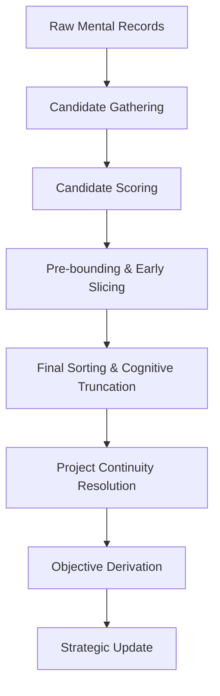

# Bounded Cognition Decision Flow

This document formalizes the cognitive pipeline used by the `BoundedStrategicAppraisalService` to derive strategic outcomes from raw mental records.

## Pipeline Architecture

### 1. Gathering (Sources)
We gather up to 8 distinct strategic sources:
- **Current Project**: Explicitly prioritized.
- **Concerns**: Immediate high-salience interrupts.
- **Obligations**: Unilateral duties to others.
- **Suspended Projects**: Previously active business.
- **Active Blockers**: Stalling conditions.
- **Leads**: Uncertain strategic pointers.
- **Contracts**: Explicit party commitments.
- **Active Projects**: Other non-current pursuits.

### 2. Scoring Formulas
Each candidate is scored using exact, deterministic formulas tied to the entity's `CognitionCapacityProfile`.
- **Projects**: `0.30*p + 0.20*u + 0.15*s + 0.25*a + 0.10*resume_reliability`
- **Concerns**: `0.25*p + 0.40*u + 0.25*s + 0.10*(1.0 - resistance)`
- **Blockers**: `0.40*sev + 0.30*cp_score + 0.15*budget + 0.15*patience`

### 3. Slicing (Cognitive Limits)
The `active_slice_limit` (range 3-9) defines how many candidates can enter the evaluator.
- **Reserved Slot**: If a current project exists, it ALWAYS occupies slot 0.
- **Early Dropping**: Concerns/Leads are capped before final sorting to prevent "lead/concern floods" from drowning out long-term strategy.

### 4. Continuity (Hysteresis)
Strategic shifts are governed by a `switch_margin` (range 0.10 - 0.45).
- `SWITCH IF: BEST_RIVAL_SCORE > CURRENT_SCORE + switch_margin`
- This prevents "thrashing" and ensures that entities only switch projects when a clear and significant strategic advantage is found.

### 5. Final Derivation
The selected project's `active_objective_id` is derived using a strict precedence chain:
1. **Blocker**: If a high-score blocker is in the slice and tied to the project.
2. **Lead/Concern**: If tied to the project.
3. **Active Objective**: The project's own `active_objective_id`.
4. **Resolution Order**: The first non-resolved objective in the list.
