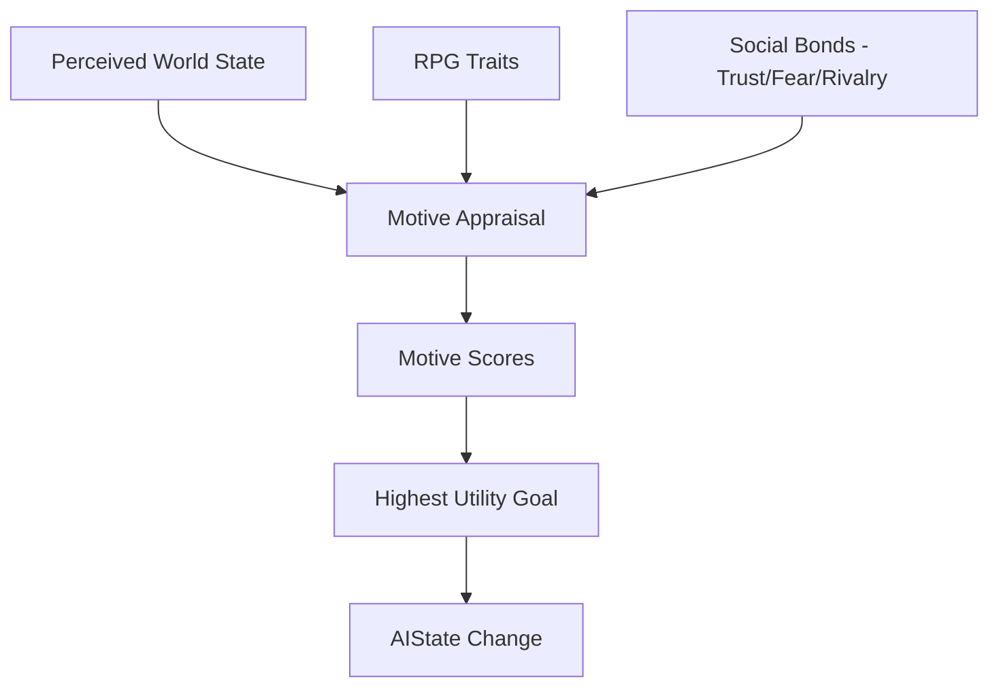

# Design Spec: Phase 1 — Personality & Relationships (RPG Traits & Motives)

## Goal
Transform simulation entities into recognizable individuals with stable identities and evolving relationships. This is the first "behavioral" phase of the Macro-Interest redesign.

## Architecture & Data Flow

### 1. Mind Reconstruction (RPG Traits)
The `MindAspect.decision.personality` stores the **RPG Traits** as floating-point values (0.0 to 1.0).

| Trait | Behavioral Impact |
| :--- | :--- |
| **Aggression** | Biases toward `COMBAT` and `HUNT` goals. |
| **Greed** | Biases toward `LOOT` and `TRADE` goals. |
| **Caution** | Biases toward `REST`, `FLEE`, and safety. |
| **Neuroticism** | Multiplier for `Fear` and `Panic` interrupts. |
| **Loyalty** | Biases toward `SOCIAL` and protection of allies. |
| **Ambition** | Biases toward `TRAIN` and progression. |
| **Curiosity** | Biases toward `EXPLORE` and discovery. |

**Archetype Templates:**
Entities are seeded with traits based on their `Archetype`. For example, a `GLORY_SEEKER` starts with High Aggression and Low Caution.

### 2. Social Appraisal & Motive Generation
The **Motive Appraisal** logic sits in the `SocialAppraisalService` and converts raw simulation state + personality + bonds into **Subjective Motives**.

**Motive Logic Example:**
- **Objective Fact**: A nearby Orc is attacking an ally.
- **Subjective Appraisal**:
    - If `Trust(Ally) > 0.8` AND `Loyalty > 0.5` → **HELP** becomes the highest motive.
    - If `Fear(Orc) > 0.8` AND `Neuroticism > 0.7` → **FLEE** becomes the highest motive (overrides loyalty).
    - If `Rivalry(Orc) > 0.5` → **REVENGE** motive increases combat aggression.

## Core Components

### `src/core/logic/personality.py` [STABILIZED]
A service to calculate utility multipliers based on RPG traits.

### `src/core/logic/social_appraisal.py` [STABILIZED]
A service to transform perceived entities into motive impulses using the `SocialRegistry`.

### `MindAspect` (`src/core/aspects/mind.py`) [STABILIZED]
- `decision.personality`: Holds the `PersonalityProfile` RPG traits.
- `last_appraisal_tick`: Tracks temporal decay of motives.

## Verification Plan

### Automated Tests
- **Unit Test**: `tests/unit/logic/test_person_logic.py`
  - Ensure different personalities produce different motives for the same world state.
- **Regression**: `tests/unit/core/test_region_events.py`
  - Ensure regional awareness and difficulty penalties function correctly.

### Manual Verification
- Observe two entities with identical stats but different archetypes (e.g., `COWARDLY_SURVIVOR` vs `HONORABLE_DEFENDER`) and confirm their survival/help strategies diverge visibly in the CLI Inspector.
