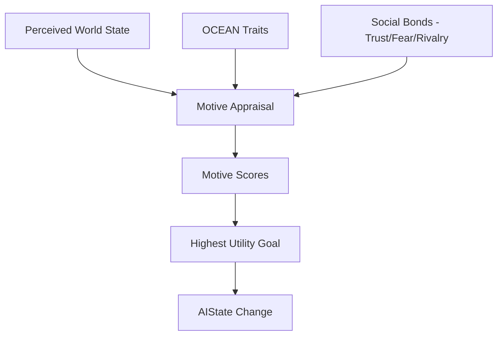

# Design Spec: Phase 1 — Personality & Relationships (OCEAN & Motives)

## Goal
Transform simulation entities into recognizable individuals with stable identities and evolving relationships. This is the first "behavioral" phase of the Macro-Interest redesign.

## Architecture & Data Flow

### 1. Identity Reconstruction (OCEAN)
The `IdentityAspect` will store the **OCEAN** (Five Factor Model) personality traits as floating-point values (0.0 to 1.0).

| Trait | Behavioral Impact |
| :--- | :--- |
| **Openness** | Biases toward `EXPLORE` and non-routine pathfinding. |
| **Conscientiousness** | Biases toward `ROUTINE`, `REST`, and "Duty" goals. |
| **Extraversion** | Increases utility for `SOCIAL` and clustering with others. |
| **Agreeableness** | Increases `HELP` utility and reduces selfish `LOOT` priority. |
| **Neuroticism** | Sensitivity to `Fear` and `Trauma` (multiplies negative emotional spikes). |

**Archetype Templates:**
Entities will be seeded with traits based on their `Archetype` (e.g., `GLORY_SEEKER` starts with High Extraversion and Low Neuroticism).

### 2. Social Appraisal & Motive Generation
The **Motive Appraisal** logic sits in the `MindAspect` and converts raw simulation state + personality + bonds into **Subjective Motives**.

**Motive Logic Example:**
- **Objective Fact**: A nearby Orc is attacking an ally.
- **Subjective Appraisal**:
    - If `Trust(Ally) > 0.8` AND `Agreeableness > 0.5` → **HELP** becomes the highest motive.
    - If `Fear(Orc) > 0.8` AND `Neuroticism > 0.7` → **FLEE** becomes the highest motive (overrides loyalty).
    - If `Rivalry(Orc) > 0.5` → **REVENGE** motive increases combat aggression.

## Proposed Changes

### [NEW] `src/core/logic/personality.py`
A stateless service to calculate utility multipliers based on OCEAN traits.

### [NEW] `src/core/logic/social_appraisal.py`
A service to transform perceived entities into motive impulses using the `SocialRegistry`.

### [MODIFY] `IdentityAspect` (`src/core/aspects/identity.py`)
- Add `openness`, `conscientiousness`, `extraversion`, `agreeableness`, `neuroticism` fields.
- Add `apply_archetype_template()` method.

### [MODIFY] `MindAspect` (`src/core/aspects/mind.py`)
- Update `DecisionModel` to track `motives` (dict of `GoalType: float`).
- Add `last_appraisal_tick` field.

### [MODIFY] `EntityBuilder` (`src/core/entities/entity_builder.py`)
- Update construction logic to initialize OCEAN traits.

## Verification Plan

### Automated Tests
- **Unit Test**: `tests/unit/logic/test_motive_appraisal.py`
  - Ensure different personalities produce different motives for the same world state.
- **Regression**: Ensure combat math and basic movement still function normally.

### Manual Verification
- Observe two entities with identical stats but different archetypes (e.g., `COWARDLY_SURVIVOR` vs `HONORABLE_DEFENDER`) and confirm their survival/help strategies diverge visibly.
