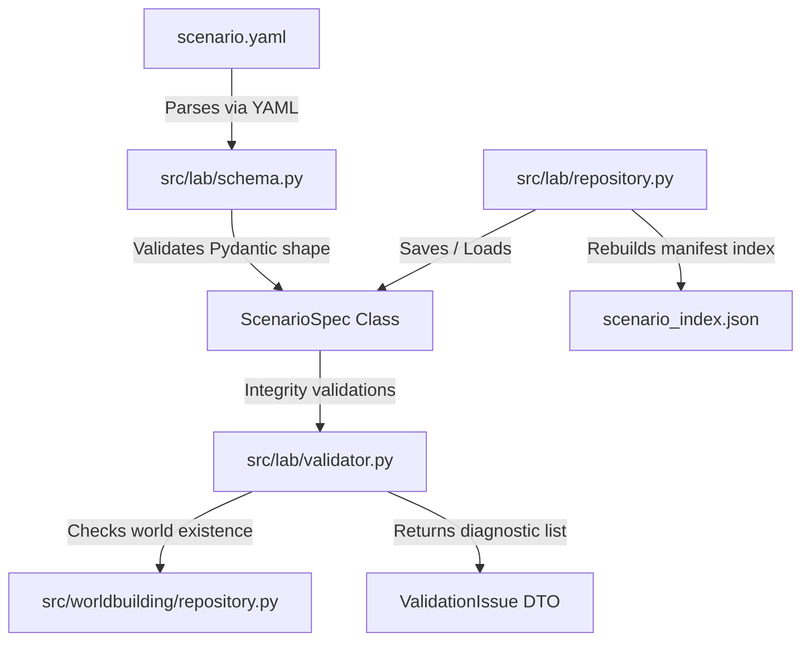

# ScenarioSpec Design Document — Milestone 75

## Goal
Establish a robust, data-driven system to define scenario testing intent separately from game worlds, enabling a single world to be reused by many scenarios (e.g. testing economy vs pathing vs quest chains).

This design doc codifies the schemas, validators, and repository layers for Milestone 75.

---

## 1. Technical Architecture & Component Layout

All classes will be developed under a new package: `src/lab/`.

---

## 2. Component Design Specifications

### 2.1 schema.py
Defines the Pydantic models for the specification:
*   `ScenarioSpec`: Extensible (`extra="allow"`), frozen Pydantic model.
*   `IntentSpec`: Details primary goals and textual descriptions.
*   `ExpectedLimitSpec`: Validates custom metric bounds with numerical `min` and `max` limit checks.
*   `RequiredSignalsSpec`: Houses telemetry metrics, event strings, and cognition trackers.
*   Custom Domain Exception: `InvalidScenarioSpecError`.
*   Loader function: `load_scenario_spec_from_yaml(path: Path) -> ScenarioSpec`.

### 2.2 validator.py
A pluggable validation engine that inspects structural and semantic alignment:
*   `ScenarioValidationRule`: Abstract base class.
*   `WorldExistenceRule` (`SCENARIO-REF-001` - ERROR): Verifies that the referenced `world_id` exists in the filesystem via `WorldRepository`.
*   `ExpectedBehaviorRule` (`SCENARIO-LIMIT-001` - WARNING): Flags unrecognized expected behavior metric keys, while allowing standard metrics without warning.
*   `RequiredSignalsRule` (`SCENARIO-SIGNAL-001` - WARNING): Warns if metrics, events, or cognition trackers are not in standard engine lists.
*   `AnomalyReferencesRule` (`SCENARIO-ANOMALY-001` - WARNING): Warns if specified allowed or critical anomalies are unrecognized.
*   `ScenarioValidator`: Orchestrator class. Supports strict mode validation (blocks and raises errors on any WARNING).

### 2.3 repository.py
Responsible for scenario asset management under `data/scenarios/`:
*   Path Traversal Protection: Enforces strict alphanumeric boundaries via RESOLVE + Ancestor comparison.
*   Loads and saves specs deterministic as standard YAML formats.
*   `scenario_index.json`: Manifest index storing updated timestamps, verification statuses (`VALIDATED`, `BROKEN`), and tags.

---

## 3. Verification Plan

### 3.1 Automated Tests
1.  **Schema Tests (`tests/unit/lab/test_scenariospec_schema.py`)**:
    *   `test_valid_scenariospec_loads`: Verifies full compliant files load cleanly.
    *   `test_missing_id_and_world_id_rejected`: Checks basic schema validations.
    *   `test_invalid_limits_rejected`: Ensures `min > max` raises ValidationError.
2.  **Validator Tests (`tests/unit/lab/test_scenariospec_validator.py`)**:
    *   `test_validator_detects_existing_world`: Verifies target world is checked in `WorldRepository`.
    *   `test_validator_detects_missing_world`: Rejects non-existent `world_id` with `ERROR`.
    *   `test_validator_warns_on_unrecognized_metrics`: Option B warning reporting.
    *   `test_validator_warns_on_unrecognized_signals_and_anomalies`: Option A warning reporting.
    *   `test_strict_mode_blocks_warnings`: Asserts warnings raise exception in strict validation.
    *   `test_validator_does_not_compile_world_or_run`: Guarantees isolation from engine runner code.
3.  **Repository Tests (`tests/unit/lab/test_scenario_repository.py`)**:
    *   `test_repository_path_traversal_guards`: Verifies escaping target roots is blocked.
    *   `test_repository_index_rebuild_and_listing`: Asserts manifest synchronizes cleanly.

### 3.2 Manual Verification
*   Execute pytest on the new scenario suites to guarantee 100% compliance.
