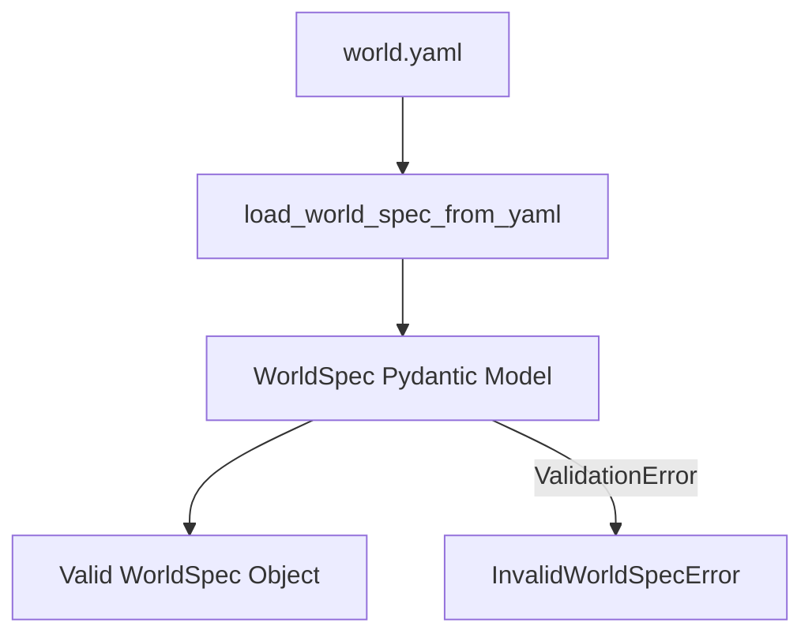

# Design Spec: WorldSpec Schema Foundation

**Date**: 2026-05-23
**Goal**: Define and implement the initial stable WorldSpec YAML file schema structure and validation tests.

## 1. Problem Statement
To transition the V2 RPG Engine to a data-driven worldbuilding foundation, users and tools must be able to describe worlds using declarative file-based specifications. The first step is establishing a highly reliable, strongly typed schema file parser that rejects invalid formats immediately before any simulation resources are allocated.

## 2. Proposed Architecture
We will implement the parsing and validation logic inside a new module `src/worldbuilding/schema.py` using Pydantic. 

### 2.1 Schema Class Mapping
We will define strict Pydantic `BaseModel` classes with `ConfigDict(frozen=True)` to prevent mutation after loading:

*   **`TopologySpec`**: Defines bounds.
    *   `width`: `int` (minimum value: `1`)
    *   `height`: `int` (minimum value: `1`)
    *   `coordinate_system`: `str` (must strictly be `"grid"`)
*   **`RegionSpec`**: Defines map regions.
    *   `id`: `str` (non-empty)
    *   `type`: `str` (non-empty)
    *   `bounds`: `tuple[int, int, int, int]` (bounds constraint check: `min_x <= max_x` and `min_y <= max_y`)
*   **`FactionSpec`**: Defines faction identifiers.
    *   `id`: `str` (non-empty)
    *   `type`: `str` (non-empty)
*   **`PopulationSpec`**: Defines groups of entities.
    *   `id`: `str` (non-empty)
    *   `count`: `int` (minimum value: `0`)
    *   `role`: `str` (non-empty)
    *   `faction`: `str` (non-empty)
    *   `spawn_region`: `str` (non-empty)
*   **`ResourceNodeSpec`**: Defines resource locations.
    *   `id`: `str` (non-empty)
    *   `resource_type`: `str` (non-empty)
    *   `count`: `int` (minimum value: `1`)
    *   `region`: `str` (non-empty)
*   **`BuildingSpec`**: Defines town buildings.
    *   `id`: `str` (non-empty)
    *   `type`: `str` (non-empty)
    *   `region`: `str` (non-empty)
*   **`ValidationSpec`**: Declarative schema verification parameters.
    *   `expected_min_entities`: `int` (default: `1`, minimum value: `0`)
    *   `allow_overlapping_regions`: `bool` (default: `False`)
*   **`WorldSpec`**: Root spec container.
    *   `schema_version`: `str` (must strictly match `"worldspec.v1"`)
    *   `world_id`: `str` (non-empty, alphanumeric / underscores)
    *   `name`: `str` (non-empty)
    *   `description`: `Optional[str]`
    *   `topology`: `TopologySpec`
    *   `regions`: `list[RegionSpec]` (default: `[]`)
    *   `factions`: `list[FactionSpec]` (default: `[]`)
    *   `entities`: `list[PopulationSpec]` (default: `[]`)
    *   `resources`: `list[ResourceNodeSpec]` (default: `[]`)
    *   `buildings`: `list[BuildingSpec]` (default: `[]`)
    *   `quests`: `list[Any]` (default: `[]`)
    *   `validation`: `ValidationSpec` (default: default factory)

### 2.2 Domain Exceptions
If loading fails due to file-reading issues, YAML syntax, or Pydantic Validation errors, the loader will raise:
*   `InvalidWorldSpecError`: Extends Python's base `Exception` class and wraps the underlying library errors with a clean, descriptive message.

## 3. Data Flow
1. `load_world_spec_from_yaml(file_path)` is called with a path to a YAML file.
2. File is read, and `yaml.safe_load(f)` converts it into a Python dictionary.
3. The dictionary is parsed via `WorldSpec.model_validate(dict)`.
4. On success, a read-only `WorldSpec` instance is returned.
5. On failure, `InvalidWorldSpecError` is raised.

## 4. Verification Plan
*   **Unit Tests** in `tests/unit/worldbuilding/test_worldspec_schema.py`:
    *   `test_valid_minimal_world_spec_loads`: Asserts valid minimal yaml parsing succeeds.
    *   `test_missing_schema_version_rejected`: Asserts schema_version check.
    *   `test_missing_world_id_rejected`: Asserts world_id presence check.
    *   `test_invalid_topology_size_rejected`: Asserts width/height validation constraint checks.
    *   `test_duplicate_ids_rejected`: Asserts duplicate keys in components are caught.
    *   `test_optional_sections_omitted`: Asserts defaults are set when sections are omitted.
    *   `test_schema_no_side_effects`: Asserts loading the schema does not load, run, or change the active engine state.
